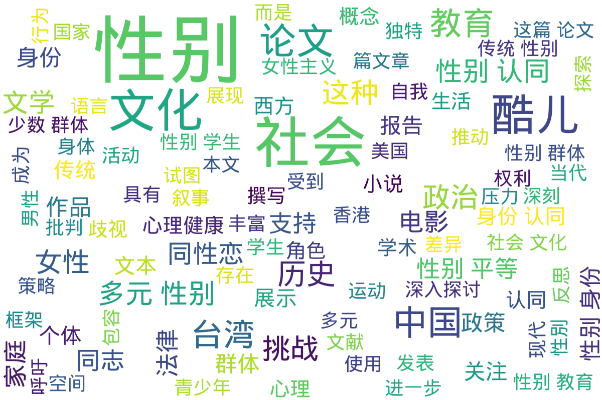

---
search:
  exclude: true
---

# 社科

该目录下收录了与跨性别相关的社会科学研究文献，包括对跨性别群体的社会分析、文化研究以及相关的理论探讨。这些文献旨在提升对跨性别群体生活现状的理解与关注。

标签: `跨性别`, `社会科学`, `研究文献`, `文化研究`, `社会分析`

总计 226 篇内容

### 📄 文档

#### 2024

[【书评】《谁在害怕性别？》当性别成为制造恐慌的鬼魂，巴特勒如何拆解](【书评】《谁在害怕性别？》当性别成为制造恐慌的鬼魂，巴特勒如何拆解_page.md)

查看摘要

这份文件是对朱迪斯·巴特勒（Judith Butler）新书《谁在害怕性别？》的书评。书中，巴特勒讨论了性别如何成为一种制造恐慌的工具，尤其是反性别运动中的极端表现。这种恐慌不仅存在于西方国家，也在全球范围内传播。在书中，巴特勒以独特的视角和深刻的理论背景，分析了性别、性别认同，以及这些概念在社会和文化中的建构。

书评中指出，巴特勒的作品强调性别的流动性与开放性，批判了传统性别二元对个人自由的限制。她认为，性别不仅是生理差异，更是一种文化实践，是权力与欲望交错的产物。评论提到，反性别运动常常利用恐慌来维系主流文化和权力结构，抵制性别多样性和性别研究，这与巴特勒的立场形成鲜明对比。

在书中，巴特勒讨论了多个与性别相关的重大议题。她讨论了全球反性别运动，特别提到在俄罗斯和梵蒂冈的政策变化、美国保守势力的反性别主张，以及在东亚地区的宗教影响。她指出，这些运动的推动力往往是对权力失控的恐惧，而性别研究正是挑战这些权力结构的一种形式。

书评中也涉及巴特勒对排跨女权（TERF）和酷儿女权的分析。巴特勒批评了排跨女权主义对于跨性别群体的排斥，认为其本质主义的观点与保守派无异。书评进一步讨论了体育竞技中的跨性别参与问题，探讨了如何在公平和包容之间找到平衡。

巴特勒的书不仅限于批判西方社会，她也深入探讨了殖民历史对全球性别观念的影响。她分析了殖民遗留下来的性别二元论在各地如何被扭曲为传统，而性别的多样性曾经是许多文化的正常实践。

[酷儿未来与时间观的探讨_海德薇格_2024](酷儿未来与时间观的探讨_海德薇格_2024_page.md)

查看摘要

这篇文章探讨了酷儿未来的可能性与时间观念，并对“幸福”的构建和理解提出了深刻的反思。文章引用了2018年诺贝尔文学奖得主奥尔加·托卡尔丘克的看法，指出当今社会的暴力、愚蠢和仇恨在好消息中被中和，但依然掩盖不了普遍的焦虑和不确定感。作者海德薇格提出，我们如何想像希望，就将在何种程度上获得希望，而这个过程与对未来的感知紧密相连。

文中强调幸福科学的观点，即幸福是可以存在、测量的状态，是社会预设好的，常常与传统的异性恋规范紧密相连。Sara Ahmed在《情感的文化政治》一书中批判了这种幸福的概念，指出现代社会鼓励人们追求幸福的过程中，不断地强化了异性恋作为唯一“正常”的生活方式，从而压制了其他生活形式的可见性与合法性。在这样的框架下，社会以“婚姻”、“事业成功”等指标来衡量个人的幸福，而这些标准又在不断地被再生产和传播。

文章还讨论了“残酷乐观主义”的概念，强调了当人们持续地相信一种生活模式的承诺时，即使这种承诺已经开始失效，仍然会导致一种焦虑和痛苦。现代社会对于幸福生活的期望构建了一种理想的脚本，但随着社会情况的变化，人们越来越感到这种脚本的破碎。在不同历史节点中，诸如政治动荡、经济危机和社会变革等，均对这种理想生活的实现造成了严峻的挑战。

[Chinese_Transgender_Students_and_Teacher_Allies](Chinese_Transgender_Students_and_Teacher_Allies_page.md)

查看摘要

这篇论文探讨了香港教育环境中跨性别学生及其教师盟友的现状和挑战。论文由 Diana K. Kwok 撰写，发表在 The Education University of Hong Kong 的特辑中，旨在呼吁教育者成为跨性别学生的盟友，以推动教育公平。国际研究表明，教育环境中的性别偏见和歧视可能影响跨性别学生的福祉和学习成果，而一个安全的校园环境及教师作为盟友的支持能够促进他们的正面学业经验和心理健康。在香港，这种支持尤为重要，因为跨性别学生普遍未能享有平等的学习环境和法律保护。在这篇文章中，Kwok 提到了“性别偏见”对跨性别学生的负面影响，并强调了教师教育的重要性，特别是如何成为跨性别学生的支持者和倡导者。在东亚城市如香港，由于缺乏包容性学习环境和法律保护，跨性别社群常常面临偏见与歧视。这种歧视不仅影响了他们的日常生活，也影响了他们在教育上的成就。论文还提到了一些关键概念，如“跨性别”是一个包含广泛性别认同概念的术语，在香港语境中，诸如“跨仔”、“跨女”等用语也逐渐被大众熟知。跨性别学生的困境，包括精神健康问题，如焦虑和抑郁等，常常与社会的污名化和受拒有关，因此，教师的支持对于创建一个安全的校园环境至关重要。总之，这篇论文强调了教育工作者在减少性别偏见与歧视中的关键角色，鼓励他们通过自身的地位和特权为跨性别学生发声，创造一个包容的学习环境，以满足这些学生的身份认同和发展需求。

[酷儿代词使用偏见研究_黄天毅_索马杉达_2024](酷儿代词使用偏见研究_黄天毅_索马杉达_2024_page.md)

查看摘要

本文件为一篇关于大型语言模型（LLM）中酷儿代词使用偏见的研究论文，作者为黄天毅和索马杉达，发表于2024年。文件的开头部分提供了一个摘要，重点指出在大规模语言模型中，传统的性别代词（如“he”，“she”）在代词使用中的不恰当性，以及对酷儿个体的表现所产生的负面影响。研究表明，现有的偏差缓解技术主要关注二元性别和种族等更为普遍的人口统计特征，而往往忽略了酷儿身份的多样性和复杂性，因此对酷儿群体在人工智能表现中的独特挑战进行了深入探讨。研究揭示，在代词使用和性别认同方面，酷儿群体在人工智能的表示中面临了特别的困难，尤其是那些非二元性别和跨性别个人所使用的代词通常在生活中得不到充分的代表性或不被理解。这种性别歧视与排斥性语言的广泛使用，导致了对酷儿个体的持续偏见和歧视。 

本研究提出了一种协作代理管道，通过分析和优化代词使用，以促进包容性，来减轻这些偏见。研究的多代理框架包含了专门用于偏见检测和优化的代理，显著改善了包容性代词分类。使用Tango数据集进行的实验评估表明，与基础模型GPT-4o相比，所提方法在有效纠正常规性别代词的不恰当使用上提高了32.6个百分点，这表明该方法在增加AI生成内容的公平性和包容性方面具有巨大的潜力。 

在方法方面，文件详细说明了三个主要代理如何参与到整个流程中，首先由助理代理分析用户的查询语句，接着由语言分析代理对此进行反思和修改，最后由优化代理做出最终决定。此过程中的每一个步骤都有相应的推理提供，以确保透明性和可靠性。评估结果中，完整代理工作流程在Tango数据集的表现得到了显著认可，尤其在使用非二元代词时，模型的正确响应率达到了非常高的水平，显示出该多代理系统在通过包容性语言来促进性别中立性的重要性。通过这种方法，研究指向了对于未来AI系统开发的可能性，倡导在设计中确立更多的包容性，从而更好地代表边缘群体，尤其是那些在性别表达上具有流动性和多样性的个体。 

综上所述，该研究不仅提供了对当前AI表现偏见的深入分析，也为解决AI中的性别代词使用问题提出了切实可行的框架，这对确保语言模型在自动生成内容时的包容性和公平性具有重要的理论和实践意义。

#### 2023

[PDF_淺談非二元認同及其教育意涵_面對性別刻板印象與性別二分的反思](PDF_淺談非二元認同及其教育意涵_面對性別刻板印象與性別二分的反思_page.md)

查看摘要

这篇文章发表于《台湾教育评论月刊》2023年第12卷第2期，题为《浅谈非二元认同及其教育意涵：面对性别刻板印象与性别二分的反思》，作者是桃园市潜龙国小的教师陈贞瑾。文章对非二元认同进行了详细的讨论，并分析了其对教育的影响以及应对性别刻板印象的反思。文章首先介绍了跨性别作为一个广义术语，涵盖了多种身份认同，包括变性人、双性人和非二元等。接着，作者详细描述了非二元者通常认为自己不属于男或女二元框架，对性别刻板印象感到不适应，因此不会承认传统男女角色的负担。文章指出，非二元认同者因为不适应两性生理特征，可能会使用医学手段如手术和荷尔蒙治疗以减少外观上的性征，从而获得心理上的舒适。接下来，文章反思了非二元认同与性别教育的影响，指出这种认同可能给性别教育带来的挑战，即在促进性别多样性和尊重个体自我认同方面的重要性。同时，文章还指出以生理性别为基础的限制对非二元及其他多元性别者带来的社会不公。最后，文章呼吁教育界应采取更科学的态度对待性别多样性，以客观事实为基础理解生理性别和性别认同的区别，避免以俗成的刻板印象对学生进行分类和标签化。

[PDF_行政院我國多元性別LGBTI者生活狀況調查研究案](PDF_行政院我國多元性別LGBTI者生活狀況調查研究案_page.md)

查看摘要

这份文件是由台湾行政机构委托，由社团法人台湾彩虹平权大平台协会主导进行的一项关于我国多元性别（LGBTI）者生活状况的调查研究。这项研究涵盖了多元性别者在台湾的健康、福祉、社群支持、社会敌意、歧视经验等多方面的生活状况。文件详细描述了研究的背景、方法、分析结果，以及针对台湾多元性别群体的生活现状提出的政策建议和未来研究建议。研究背景提到，台湾在2019年通过《司法院释字第七四八号解释施行法》后成为亚洲第一个同性合法结婚的国家，该法律的通过促进了社会的多元化进程。然而，多元性别群体仍然面临着社会敌意和偏见。研究通过综合问卷调查和数据分析来评估这些群体的社会处境，提出了诸如建立全面的性别平等教育、优化法制监管等政策建议，以期改善多元性别者的生存境遇。文件中还进行了与欧洲2019年相关调查的比较，讨论了两地多元性别者在社会支持、歧视经历等方面的异同。

[PDF_被消費的跨性別表達國內Bilibili_平臺上的變裝皇后](PDF_被消費的跨性別表達國內Bilibili_平臺上的變裝皇后_page.md)

查看摘要

该文件是一篇关于中国大陆Bilibili平台上变装皇后的学术探讨，重点分析了变装皇后群体在网络平台上的表现及其性别表达所引发的社会现象与文化意义。文章指出，变装皇后通过夸张的妆容、戏剧性的表演和幽默的语言获得了大量的关注，尤其受到了异性恋顺性别女性的喜爱。然而，变装皇后并非传统意义上的跨性别者，而是一些性别表达为女性气质的男同性恋者。这一角色在社会上形成了一个新的酷儿身份，使得变装皇后的身份在性别认同上也变得复杂。\n本文详述了变装皇后在中国内地视频平台上被消费的现象，他们通过这样的身份博人眼球，进而获取经济利益。在分析这些现象的同时，作者指出这种文化现象对真正的跨性别者造成了误解和困扰，社会大众往往将变装皇后错误地等同于跨性别者，这对跨性别群体的社会认同造成了障碍。而变装皇后通过打破传统性别角色，展示了性别表演的独特面，但这种表现又不可避免地加深了对性别形象的刻板印象。文章还探讨了异装视角下性别身份的复杂性，并分析了这些表现所反映的人们对性别流动性和性别革命的不同看法。\n在具体案例中，文章分析了Bilibili 平台的up主如莲龙青Kudos等是如何通过这种表现形式获得关注及经济利益的。他们通过异装呈现并标榜自己为“变装皇后”，将此作为一种商业手段，同时也借此引发观众对性别身份的更多关注。文中指出，这是一种消费异装表演以获取流量与商业价值的现象，并在一定程度上呼吁社会对跨性别者和变装皇后之间区别的深度了解。

[LGBTQI+抗争中的双语表达_2023_ANU_Press](LGBTQI+抗争中的双语表达_2023_ANU_Press_page.md)

查看摘要

这篇论文以中国的LGBTQI+群体为研究对象，探讨了他们在严苛的社会和法律环境中如何通过创新的沟通方式进行抵制和抗争。作者Ausma Bernot详细描述了LGBTQI+人士如何通过使用比喻和秘密语言来避免网络上的直接审查。在中国，尤其是在习近平上台领导以来，LGBTQI+团体受到的氛围变得更加严峻。许多政治敏感词语被禁止使用，例如“性别多样性”和“LGBTQI”。文章提到在中国的酷儿活动人士通过暗示性的符号和秘密语言进行交流，例如在微信中通过彩虹表情符号传达信息，这成为他们日常交往中的必备技能。

作者还分享了自己在2014年至2017年间在中国的LGBTQI+活动经历，她参与创立了一个在宁波诺丁汉大学注册的LGBTQI+学生社团，积极组织各种活动来增强群体意识，如反对恐同、双相和跨性别恐惧日的庆祝活动。尽管遇到了一些政府的审查与阻碍，他们依然成功地创造了一个包容的社区氛围。

论文还讨论了在习近平政府下中国数字空间的收缩，特别指出了对LGBTQI+群体日益升级的审查和监控。文中提到的“娘炮禁令”等立法，和对微信等社交媒体的严格控制，导致LGBTQI+个体和团体在数字空间里几乎无隐私可言。这种环境迫使很多人使用更为安全的加密交流平台，从而维系他们的社会网络和组织活动。文中揭示了一个在压迫性社会体制下，LGBTQI+群体为了生存和发展而进行的暗语式抗争的真实画面。

[2023_廖昱凱_酷兒跨性別生態學與河川正義書評](2023_廖昱凱_酷兒跨性別生態學與河川正義書評_page.md)

查看摘要

这篇关于《Underflows: Queer Trans Ecologies and River Justice》的书评由廖昱凱撰写，发表于地理学报的第104期。书中对Cleo Wölfle Hazard所著的内容进行了深刻的解析。Cleo Wölfle Hazard是一位酷儿生态学家，他的研究主要集中在人与物种在河流生态与社会层面的互动，以及如何通过酷儿、跨性别与女性主义的视角来改变生态科学的知识观。书中探讨了如何通过有色酷儿立场科学家们的实践改变科学研究及治理美国西岸河流的问题。

文中详细介绍了书籍的学术贡献，指出其系统性地运用有色酷儿理论、女性STS文献及跨越（trans）思考，挑战当代田野科学与河川治理中根深蒂固的种族主义与定居殖民主义。从研究方法的角度，作者详细描述了如何通过包含田野课程及与原住民协助的多元方法进行生态研究，并在金沙谷与克拉马斯河的实例中展示这些方法的应用。书中呼吁科学家如酷儿跨性别科学家般透过田野的情感视角改变以往白人和异性恋主导的生态调查，并强调与原住民及非人类物种的合作对于河川治理的重要性。

此书的七个章节，从水体想象到河流治理的跨越性实践，给我们提供了对于科学实践与社会正义之间关系的独特视角。第一章分析对水体体制想象的影响，探讨十五年来加州水资源法规的变迁及其对地下水和生态环境的管理。第二章中，Wölfle Hazard通过一系列学术艺术行动，如“向鲑鱼诉说你的烦恼”，尝试将酷儿与跨性别研究引入生态科学。第三章则反思了河狸在河流治理上的角色，提出河流治理不能简单依靠传统法律与财产权制度。整体书评不仅总结了书籍的核心观点，还深入思考了Cleo Wölfle Hazard提出的将酷儿理论应用于生态学的必要性。

[萨克森女性主义论坛_多元交叉视角_2023年9月.pdf](萨克森女性主义论坛_多元交叉视角_2023年9月.pdf_page.md)

查看摘要

这份文件记录了2023年9月中旬在德国莱比锡举办的萨克森女性主义论坛的详细信息。此论坛致力于通过多元交叉的视角来探讨如何在政治、行政管理和社会架构中获得更为多样化的观点，旨在赋能并分享权力的意义。文件详细描述了论坛举办的具体日期地点，以及由哪些组织主办和合作，参与者的多样背景，包括性别*、跨性别*、双性别*和非二元性别人群等。文件强调了活动的无障碍设计和多语言服务，显示出对多样性和包容性的高度重视。

论坛由多个组织合作举办，内容包括多种形式的活动，如叙述沙龙、专题座谈、工作坊、音乐、舞蹈等。在这些活动中，参与者可以分享经验、知识，并通过互动促进相互连接与理解。文件中提到的重要活动包括主题演讲、嘉宾座谈会和工作坊，每一项活动均围绕赋能、社会参与以及应对种族歧视等议题展开。

工作坊的内容关注如应对日常种族歧视的方法策略、移民背景女性的社会参与可能性、护理工作与女权主义视角等重要议题。具体而言，一个舞动与戏剧表演的工作坊旨在通过身体活动提高参与者的自信与复原力；另一工作坊探讨了性别平等写法中的酷儿实践。这些活动展示了不同背景和性取向的参与者如何在一个多元交互的环境中分享和提升自我，努力促进更广泛的社会理解与支持。

萨克森女性主义论坛不只是一个学术交流的场合，更是社群动员的契机。论坛的理念在于通过赋权和交叉视角的应用，来提高弱势群体的可见性，并倡导社会正义。文件中提到的座谈嘉宾和论坛参与者都是积极从事社会变革的代表，通过实际活动和理论探索激励更多人参与这种正向的社会和文化变革。

[中华帝国晚期的性_法律与社会_文字版_苏成捷_Z_Library](中华帝国晚期的性_法律与社会_文字版_苏成捷_Z_Library_page.md)

查看摘要

本文件是一本名为《大学问·中华帝国晚期的性、法律与社会》的书籍，作者为苏成捷，由广西师范大学出版社于2023年5月18日出版。书中由简繁体中文和比如英文版序等多种序言构成，通过实践社会科学的视角对中华帝国晚期的性、法律与社会进行了详尽的探讨。书籍分为多个章节，从不同的角度解读中华帝国晚期的性别秩序及法律演变。其内容立足于对性别秩序的愿景、强奸罪及鸡奸罪的法律变迁、清代贞节崇拜对女性的约束、以及雍正朝之前与之后卖娼的法律规制等多个社会法治演变过程进行了深入分析。

例如，书中在分析强奸罪相关的法律演变时，探讨了女性贞节与外来男子的威胁。这一主题不仅涉及法律条文的变迁，还涵盖官员实际执行过程中面临的社会刻板印象。对“奸”的概念界定及其在社会中涵盖的范围进行详细的探讨，显示出父权社会中独特的性别特权现象。同时书中也介绍了清代对鸡奸的立法，如何维持男性性别角色，并揭示不同社会阶层中性行为的复杂性。关于卖娼入法的演变则显示了雍正朝的法律改革策略，书中对法治与社会之间的互动进行了实证性分析。

书籍还附有多个与清代法律有关的文献附录和历史资料，如关于性侵犯、鸡奸等罪行的立法详细解释，以及尼坤的‘禁谕乐户’措施等。书后附录的参考文献对于研究者来说是非常有价值的资源。通过这些明清法律条文的实际应用及其背后理论支持的研究细节，读者能更深刻地理解性别和法律之间在历史及社会变迁中的紧密联系。

[跨性别者自杀意念的影响因素探析Analysis_of_Influencing_Factors_of](跨性别者自杀意念的影响因素探析Analysis_of_Influencing_Factors_of_page.md)

查看摘要

这篇论文题为《跨性别者自杀意念的影响因素探析》，由李记勇撰写，发表于 2023 年 1 月的《社会科学前沿》期刊。这篇论文针对跨性别者这一特殊社会群体，探讨其高自杀意念的影响因素。跨性别者因其性别认同或性别表达与生理性别的不一致，常常在社会中处于边缘地位，并承受着巨大的心理压力。论文中提到，跨性别者的自杀意念比普通人群更为普遍，研究显示约 25% 至 76% 的跨性别者曾考虑过或企图自杀。

论文的摘要指出，跨性别者作为社会的边缘群体，其独特的心理问题需要得到重视。通过探讨跨性别者所经历的压力源，本文对其高自杀意念的影响因素进行了梳理，以期为跨性别人群的心理干预提供一定帮助。论文进一步展开讨论了造成跨性别者自杀意念的几个主要因素。其中，少数群体压力理论被引入，强调性少数群体经受独特的压力，如远端压力（如歧视、被排斥的经历）和近端压力（如内在化的变性恐惧、负面期望）。

研究还涉及了个体如何通过应对策略来缓解心理焦虑，包括促进型和回避型策略。家人和社会的接纳度也被视为关键影响因素。特别是在中国，传统观念使得跨性别者甚少能获得家庭的支持，而家庭的支持对减轻个体的心理痛苦和自杀意念具有重要作用。同时，社会接纳度的提高也能够积极影响跨性别者的心理健康，减少抑郁和焦虑的发生。论文引用了近年来针对不同国家和地区跨性别者的多项调查数据，来展现这些因素对跨性别者心理健康影响的普遍性和严重性。

#### 2022

[人工智能时代性别伦理的多维思考与前瞻性治理](人工智能时代性别伦理的多维思考与前瞻性治理_page.md)

查看摘要

《人工智能时代性别伦理的多维思考与前瞻性治理》这篇论文由邵娜和张宇撰写，发表于2022年7月的深圳社会科学期刊。文章探讨了人工智能技术的发展对传统性别问题的影响以及性别伦理在人工智能时代的重新建构。作者指出，人工智能不仅能够反映和放大已有的性别偏见，而且由于技术从业者的性别单一性，导致性别伦理观念在技术开发和应用中被嵌入。这种技术特点可能使人工智能的应用难以实现对公平等社会公共价值的回应。

文章还讨论了“第三性”的“人造智能生命体”出现所引发的人机交往新问题。尽管人工智能的发展有可能推动性别伦理返回具体社会情境，减少性别二元对立，但文章强调技术本身无法自发推动性别问题的解决。政府和社会治理行动者需进行前瞻性治理，如通过理念更新和职能调整以挖掘性别问题并设计治理工具，从而在人工智能时代建设新的性别伦理观。论文还探讨了不同历史阶段性别问题的演变，尤其是平等伦理、差异伦理和解放伦理的作用，从社会结构和历史情境的角度分析性别问题和其可能的解决办法。在探讨性别伦理的解放时，文章援引了马克思主义和女性主义的观点，强调社会结构的变革是消除性别不平等的关键。这篇论文强调了政府和社会在人工智能时代应具备的前瞻性行业治理策略，期望在人工智能的技术变革中主动发现和解决性别偏见，使技术能够促进更复杂和包容的社会伦理建设。

[人类社会行为的双重属性及其双重判断](人类社会行为的双重属性及其双重判断_page.md)

查看摘要

这篇文章题为《人类社会行为的双重属性及其双重判断》，由吴家睿撰写，发表在2022年7月的《生命科学》期刊第34卷第7期。文章探讨了人类行为的生物学属性和文化属性，强调了基因在影响人类社会行为中的作用，并且指出这个作用往往是复杂且受到争议的。

在文章中，作者引用了威尔逊教授的社会生物学理论，这一理论认为人类和其他动物的社会行为是通过自然选择演化而成的。但是，作者也指出，威尔逊的观点在学术界引发了激烈的批评，认为这种观点可能导致生物决定论的误解。

生物学基础在影响人类行为中扮演了关键角色，尤其是涉及遗传因素的研究。文章详细讨论了人类基因组的角色，基因组不仅记录遗传信息，其碱基序列的排列方式直接影响各类蛋白质的形成，从而对生物体的生理或病理活动产生重大影响。例如，基因ARHGAP11B的特定序列会导致灵长类新皮质增大，意味着人类社会行为可能部分依赖于基因的推动。

然而，研究也展示了文化因素在社会行为中的介入。例如，关于同性恋行为的研究指出，环境因素对性取向的影响并不可忽视，人类的社会行为因而具有文化属性。生物学属性与文化属性的结合形成一个连续谱，其中既有以生物学为主导的行为，也有以文化为主导的行为。

文章强调，由于社会环境的变化，如社会经济条件的改善和思想观念的变迁，现代社会的人类行为逐渐分化出更多样化的形式，比如跨性别和性别酷儿现象的出现，这一现象反映了社会文化在性别维度上的多样化发展。

[何谓跨文化_自我与他者的吊诡共生](何谓跨文化_自我与他者的吊诡共生_page.md)

查看摘要

该文件是一篇关于跨文化研究的学术论文，题为《何谓跨文化：自我与他者的吊诡共生》，由彭小妍撰写，发表在某期学术期刊上。论文旨在探讨跨文化研究作为一种新兴的研究范式，其在全球化时代所产生的效应和重要性。文件从解释跨文化概念的意义入手，指出跨文化研究不同于传统的比较文化研究和后殖民研究，它更关注于文化间接触所带来的转化与新生，而不是仅仅强调文化之间的差异和冲突。

论文从历史角度回顾了跨文化研究的发展历程，提到古巴人类学家Fernando Ortis创造的术语“transculturation”相对于“acculturation”的优势，强调文化互动的复杂性，并以古巴的历史为例说明这一过程。论文还详细分析了跨文化概念在后殖民研究和多元文化研究中的批判和融入，提出跨文化不仅仅是文化间的接触，而是视作一种伦理态度，关注文化混杂本质，并对此提出新的范式。

除了理论阐述，文件还涉及跨文化研究在实践中的具体应用和挑战，其中包括如何在全球化的语境中重新审视文化的身份认同问题。作者通过对比东西方哲学，提出“吊诡共生”的观点，即自我与他者在跨文化交流中是矛盾且共存的。通过对中国文化历史发展的分析，该研究指出跨文化的动态过程中的两个文化的相互侵透及变革。这种互动关系既促成文化创新，也构成互动中的矛盾。

文章强调了超越文化间明显的界限，并把这种超越作为实现创新和变革的途径。跨文化研究不仅在学术界具备探索性，还与实际的社会文化问题紧密相关。该论文为跨文化的研究铺路，增加了社会对于不同文化背景下的性别、身份认同问题的理解与关注。

[跨性別女性向父母現身之歷程研究_-_教育心理學報](跨性別女性向父母現身之歷程研究_-_教育心理學報_page.md)

查看摘要

这篇名为《在荊棘中邁向真實自我：跨性別女性向父母現身之歷程研究》的论文刊载于国立台湾师范大学的《教育心理学报》，旨在探讨跨性别女性在向父母坦诚性别身份过程中所经历的复杂情感与社会过程。通过质性访谈研究，作者宋宥贤与陈思帆深入探讨了16位年龄在23至45岁之间的跨性别女性在坦露身份给父母时的个人经验，包括坦白的意义、可能面临的困境以及应对策略等。研究结果通过扎根理论构建出一个由五个阶段组成的模型，分别是犹豫期、自我展现与反复试探期、现身期、关系震荡过渡期以及接纳期。这一模型试图展现跨性别女性在坦露性别认同时的心理历程及其与父母关系的动态变化，研究进一步指出，在这一历程中，现身的意义及促成顺利坦现的关键因素极大影响着跨性别女性的选择和行为。论文指出，尽管现身作为一种自我揭露的行为被视为个人成长的重要一步，但实际过程中存在的挑战仍促进了对进一步社会支持，特别是家庭支持的需求。在这种背景下，如何为跨性别女性创造支持性的家庭和社会环境成为了一项亟待满足的要求。同时，文章也较为详细地介绍了当前社会对跨性别群体的认知偏差和传统性别观念对其所造成的多重压力，并指出，社会支持特别是来自家庭的关怀和理解，对跨性别者的发展与心理健康起到了举足轻重的作用。这些发现在一定程度上为政策制定者、社会工作者以及心理咨询师提供了有力的支持和指导。

[中国跨性别者非自杀倾向自残行为研究——流行率和风险因素的横断研究](中国跨性别者非自杀倾向自残行为研究——流行率和风险因素的横断研究_page.md)

查看摘要

这篇名为《中国跨性别者非自杀倾向自残行为研究——流行率和风险因素的横断研究》的文章发表于心理学刊物《心理学进展》。文章探讨了中国跨性别者中非自杀倾向自残行为（NSSI）的流行率及其相关的风险因素。本文背景指出，NSSI 是影响跨性别群体心理和生理健康的主要问题。由于跨性别者群体的特殊性和国内相关研究的缺乏，该研究填补了现有文献的空白，提供了一组独特的中国跨性别者样本以探讨其心理健康状况。

根据这项研究的数据，63%的受试者报告曾有非自杀倾向自残行为，尤其是在跨性别女性中更为普遍。文章指出，这些个体通常表现出较高的焦虑水平，且身体满意度、社区归属感和自尊心较低。研究发现，较低的身体满意度和心理健康问题显著预示了跨性别者的NSSI行为。为了减少这类行为的发生，文章建议通过改善跨性别者的心理健康状况和提高身体满意度，并呼吁社会减少歧视，增强对跨性别者的尊重。

该文还指出，跨性别者处于一种独特且长期存在的压力中，这种压力源于他们性别认同与社会系统赋予的性别角色的不符。研究所使用的方法是对703名年龄在18至51岁之间的中国跨性别者进行在线问卷调查，问卷包括身体意象量表、罗斯伯格自尊量表等多个与NSSI相关的心理评估工具。作者总结指出，研究结果对于减少社会偏见、提高跨性别者生活质量、以及实施有效的心理健康干预措施具有重要意义。

[PDF_在荊棘中邁向真實自我跨性別女性向父母現身之歷程研究](PDF_在荊棘中邁向真實自我跨性別女性向父母現身之歷程研究_page.md)

查看摘要

这篇文章名为《在荊棘中邁向真實自我：跨性別女性向父母現身之歷程研究》，由宋宥賢和陳思帆联合撰写，发表于教育心理学报的第五十四卷第二期的357至384页。本研究以台湾为背景，探讨了跨性别女性向父母现身的过程及其所面临的困境与应对策略。文中指出，跨性别者，尤其是跨性别女性，常常面临性别认同以及社会接受问题，尤其是在家庭中现身时更面临巨大的心理和情感压力。研究采用质性访谈的方法，收集了16位跨性别女性的深度访谈资料，年龄范围从23岁至45岁。文章分析了现身过程的五个阶段：犹豫期、自我展现与反复试探期、现身期、关系震荡过渡期、接纳期。通过对这些阶段的分析，研究揭示了现身对跨性别女性的意义，以及如何顺利现身的关键要素。文中提到，现身过程不仅影响到跨性别个体自身的心理发展，还可能对其家庭结构和动态产生深远影响。父母的支持和接纳在此过程中尤为重要，对于帮助跨性别者发展健康的性别认同和社会适应具有重要作用。本文的研究结果能够帮助辅导顾问更好地理解跨性别女性的现身经验，并反映了跨性别族群在面临社会偏见和家庭压力时的真实处境。

[PDF_吳繼文酷兒小說中的性別飄浪_-_臺灣文學研究所-](PDF_吳繼文酷兒小說中的性別飄浪_-_臺灣文學研究所-_page.md)

查看摘要

《〈吳繼文酷兒小說中的性／別飄浪、家國想像與時間觀〉》是一篇发表于《臺灣文學研究雜刊》的学术论文，详细分析了台湾作家吳繼文在1990年代创作的两部酷儿题材长篇小说——《世紀末少年愛讀本》和《天河撩亂》。文章由曾秀萍撰写，重点讨论了这两部作品在台湾酷儿文学领域中如何展现独特的性别流动性与家国想像。吳繼文的作品在当时的文学潮流中凸显了与众不同的酷儿时空观，以回顾的方式重塑酷儿叙事，相较于其他前瞻性的酷儿小说有着独特的文学价值。文章指出，这些小说通过展示不依照传统线性时间进展的叙事结构，尤其是在《世紀末少年愛讀本》中对经典古典男色小说《品花寶鑑》的改写，揭示了佛教时空哲学对作品的影响，打破了传统的进步史观。在《天河撩亂》中，透过主人公家族史的叙事和跨文化背景，探索了性别流动性与避世情怀。小说不仅在男同志刻画上有深刻的表现，在跨性别主题的开拓上也有重要贡献。作者的研究不仅限于文本分析，更涉及台湾社会文化的历史背景，呼应了1990年代同志文学研究中的诸多讨论。曾秀萍在文中对台湾酷儿文学的复杂性和多样性提出了独到见解，批评当时较为鲜明的政治书写策略，认为吳繼文的创作虽然没有直接的政治目的，却通过更温和且迂回的方式传达深刻的性别和政治思考。论文透过严谨的学术论证和敏锐的文本解读，成功地为读者呈现了多元文化视域下台湾酷儿文学的丰富性。

[创伤与修复：华语女性酷儿电影表现研究（李春裔，2022）](创伤与修复：华语女性酷儿电影表现研究（李春裔，2022）_page.md)

查看摘要

《创伤与修复：华语女性酷儿电影表现研究》是李春裔撰写的博士论文，完成于2022年，授予单位为拉曼大学的中文研究所。这篇论文从四个维度对华语女性酷儿电影进行了综合论述，包括创伤、身份认同、内在客体关系以及隐喻心理意向，用心理学的视角分析了华语女性酷儿电影中女性内心的冲突。随着华语地区逐渐开放的社会环境，尤其是在台湾于2019年率先将同性婚姻合法化后，华语女性酷儿电影被视为探讨女性身份焦虑和认同的重要场所。论文的研究目的具体包括四个方面：（一）通过文本分析了解华语女性酷儿电影反映的女性心理发展特点；（二）对具有代表性的电影进行深入个案分析，探讨女性酷儿的内心冲突及其修复情况；（三）分析影片中隐喻心理意向的电影符号；（四）总结当前华语女性酷儿电影的共性特质及其缺陷。

论文详细探讨了酷儿女性在不同环境下的心理状态和对抗创伤策略，指出女主角们在面对创伤时采取两种截然不同的心理导向：逃避现实与面对真实。这种处理方式在不同电影中呈现出不同的表现，例如在《爱丽丝的镜子》和《刺青》中，女主角们采取逃避现实的方式以防御内部无法承受的创伤情绪，而在《命运化妆师》中，部分女主角则因良好支持系统得以真正疗愈，重新建立与正常生活的联系。

论文还从身份认同的角度分析，指出女性人物的身份焦虑源自个人内部和外部环境的冲突，这在青春期自我认同的影片中表现得尤为明显，例如《蓝色大门》和《渺渺》通过开放式结局展示多元未来可能性。针对女性酷儿电影中隐喻心理意向的使用，作者指出符号化的运用将心理活动外化为视觉感受，深刻影响观众对影片的解读。

作者李春裔通过此研究突破了传统酷儿理论中性别研究的局限，聚焦于女性精神世界与客体的互动，拓宽了电影中女性表现的分析视角，并为研究华语电影中文化女性创伤与修复做出贡献。

[中學同志教育經驗探析_蔣琬斯_游美惠_2022](中學同志教育經驗探析_蔣琬斯_游美惠_2022_page.md)

查看摘要

这篇论文题为《朝向容纳多元性别教育：中学教师推动同志教育之经验探析》，由蔣琬斯和游美惠撰写，发表在2022年9月的《课程研究》期刊第17卷第2期上。论文旨在探讨台湾中学教师在推行同志教育方面的经验和策略。论文采用质性研究方法，访问了19名中学教师，分析他们如何在校内落实同志教育，并根据这些教师的经验提出改进建议。研究发现，许多教师在观察到学生对性倾向的隐忧后，开始积极投入同志教育推广。他们通过参加研习与进修，逐渐意识到自己和社会中对LGBTQ人群的偏见，并努力将这些教育扩展至校园生活的方方面面。论文指出，事实上，并不需要刻意强调同志话题，部分教师通过自然的方式反而取得了更好的教育效果。最后，作者建议将‘同志教育’更名为‘容纳多元性别教育’，以更好地涵盖多样的性别身份和认同。这一研究不仅揭示了台湾在推行性别平等教育过程中所遇到的挑战和抵抗，也呼吁教育界和社会更广泛地接纳和尊重多元性别。

论文还涉及台湾在2004年通过《性别平等教育法》之后，性别平等教育的实施和相关的社会、政治背景。尽管法律上性别平等得到了强调，但实际上政策执行过程中仍面临重大挑战，尤其是来自保守派的反对声音。2018年的公投使得‘同志教育’一词被从性别平等教育相关条款中删除，虽然教育中仍保持了对于多元性别学生的尊重和理解的核心精神。论文提供了丰富的数据和见解，强调了教师在面对潜在的教育和社会矛盾时的决策和行动的重要性，丰富了关于学校性别教育的研究领域。

[酷儿理论视域下的电影研究_夜间飞行的身份认同_曾思繁_2022](酷儿理论视域下的电影研究_夜间飞行的身份认同_曾思繁_2022_page.md)

查看摘要

这篇论文发表于2022年11月，作者曾思繁来自福建师范大学，其研究集中在酷儿理论与电影分析的交汇点。文章的题目为“酷儿理论视域下电影《夜间飞行》的身份认同”，探讨了韩国导演李宋熙日执导的男同性恋电影《夜间飞行》中的身份认同问题。论文首先介绍了酷儿理论的背景，指出其起源于20世纪90年代，是对传统性别和性取向研究的颠覆与解构，强调了这理论在电影等多个学科中的重要应用。

在文章的摘要部分，曾思繁指出“酷儿”理论强调人的身份认同的复杂性和多样性，主要集中在同性恋电影这一重要分支，体现了如何通过具体的电影文本分析来理解“酷儿”理论的核心观点。该文以《夜间飞行》这部影片为例，详细分析了两位男主角的身份认同过程，尤其是如何在主流社会的压迫和霸权下，探索自我身份的认同。

文章随后回顾了《夜间飞行》电影的背景与创作历程，指出电影探索的主题诸如社会欺凌、性别歧视以及青少年的困惑与挣扎是当今社会仍然存在的重要课题。李宋熙日导演通过影片中的角色展现了男同性恋者在主流社会中所遭遇的压力与挑战，强调了在被视为“异类”身份的抵抗与接受，以及追求真实自我的艰辛之路。

在论及电影中身体认同的问题时，作者提到主流社会对性别和性取向的划分，使得非异性恋者必须在这种强压下寻找自我认同的道路。尤其是申永俊和韩志雄两位主角的情感故事，体现了社会规训下的身份认同的困境与内心的挣扎。文章引用了许多影片中的关键情节，深入阐述了如何通过影片中的互动与冲突反映出性少数群体的生活现实。

总之，这部作品不仅为酷儿理论的研究提供了新的视角，同时也为理解跨性别与多元性别的索寻提供了理论与实践的融合平台。曾思繁的研究表明，酷儿理论的应用使我们能更深入地探讨传统性别视角之外的复杂性，反思在当代社会中，如何在传统规范下寻找并表达个人的身份与声音。

[2022-02-05_马骋Yura_酷儿女性看爱情与百合文化解构异性恋关系](2022-02-05_马骋Yura_酷儿女性看爱情与百合文化解构异性恋关系_page.md)

查看摘要

本文件标题为《酷儿女性看爱情：百合文化如何颠覆异性恋情感和关系》，由马骋Yura撰写，发表于端传媒。文章探讨了百合文化在颠覆传统异性恋故事架构中的作用。百合（Yuri）文化源自日本动漫次文化，主要描述女性之间微妙而深刻的情感关系，同时对比于男男爱情（BL，薔薇），百合作为形容女女关系的特定词汇并没有统一的边界。文章详细阐述了百合文化在华语世界的发展，从2004年引入至今，深入根植于各类影视作品、综艺节目和网络文学中。文章指出，随着发展，百合文化逐渐成为一种由受众解读和构建的文化。在学者对日语和华语界百合文化的研究中，均把百合视为一种论述性文化。更进一步，百合阅读和耽美类似，对文本的解构与阅读成为文化的一部分。

百合不仅是一种文本，亦是一种读者的文化。其核心并不单由百合作品的创作者决定，而是由读者在解读中的不断建构。作者详细分析了百合与耽美读者的差异，提出女性观众多为酷儿女性或性向暧昧的女读者，与异性恋的耽美观众不同。通过百合阅读，女性观众能够解构主流故事中的性别角色，重新想象竞争与团结的可能性。百合不仅关注性，而是把核心置于感情的细腻描绘之上。

另外，本文件中对荷李活爱情片将性爱作为情感关系考量的普遍现象提出质疑，希望从百合文化中看到女性角色有别于传统异性恋关系的更多可能性。文章探讨了“正宫配小三”的百合阅读愉悦性，及不同关系构建的可能，如《延禧攻略》中令妃与皇后之间的情感引发的各种同人作品与新的解读。百合文化的出现，为探索铺设了一条突破异性恋常态的路线，使女性主体的表达得以呈现。

[性别寻旅_跨性别者自述_梁詠恩_2022](性别寻旅_跨性别者自述_梁詠恩_2022_page.md)

查看摘要

《性/別尋旅——一位跨性別者的自我民族誌》是一篇由梁詠恩撰写的硕士论文，隶属于台湾世新大学性别研究所。该论文以自我民族誌为研究方法，通过个人的人生经历，探讨跨性别者在现代社会中的身份认同与文化适应。这篇论文的指导教授是陈明莉博士，完成于2022年1月，主要研究跨性别者在中港台地区的生存与发展。

论文详细描述了作者在社会中的跨性别旅程，以其自身及其在大中华地区的LGBTQ+运动中的观察为背景。作者指出，随着西方人权及性别运动的影响力日渐增大，具有性别认同困扰的跨性别者开始从西方的理论中找到立足点。然而，尽管在法律与权利方面有一定进展，但跨性别群体的境况依然不容乐观。

作者通过参与中港台的跨性别及同志运动，观察到这些地区的运动策略多借鉴于西方社会，这导致类似的社群困境。针对这些问题，梁詠恩提出，希望通过比较中西医的方式，寻找解决方案。论文中作者形象地以"画"为比喻，通过社会文化与个人反思，描绘出跨性别的生存境况，并借助实地研究，探索更为广阔的性别认同蓝图。

梁詠恩通过自身五十多年的性别经验，再结合自我民族誌的方法，试图描绘出一幅跨性别生活的完整画卷。在挑战传统性别分类的种种困境时，梁詠恩通过不同的视角反思跨性别者的生存意义，并在论文中提出针对此困境的可能解决路径。这段旅程不仅是对性别身份的深刻探索，更是对不同时代与文化背景下跨性别身份的深入解析。

[成为安迪沃霍尔：性别与社会的对话_2022年2月19日](成为安迪沃霍尔：性别与社会的对话_2022年2月19日_page.md)

查看摘要

本文档记录了一场名为“成为安迪·沃霍尔”系列活动的对谈，围绕性与别（Gender/Sexuality）展开讨论。活动于2022年2月19日在UCCA Edge举办，参与者包括华东师范大学社会学教授魏伟和昆山杜克大学文学助理教授向在荣，对谈由徐子涵和喻梦彤整理编辑。魏伟教授在对谈中深入探讨了安迪·沃霍尔这一艺术人物在性别与社会对话中的角色，他强调沃霍尔的酷儿特质对其艺术创作的重要性。魏伟教授通过将沃霍尔的生平与艺术作品融入性别研究领域，提出沃霍尔不仅是一个伟大的艺术家，更是酷儿理论的重要人物，通过其作品大大提高了LGBT群体的社会可见度。尤其是在《酷儿沃霍尔》的展览中展示出来的性别交织的复杂性，反映了台湾性研究中的跨界意识。在对谈中，魏伟教授指出性别概念在当代社会中的流动性与多重特质，并举例沃霍尔的作品如何在性别的各个方面进行再现和表达。他强调沃霍尔以巧妙的艺术表现手法呈现酷儿群体的经验，挑战了性别与性取向的传统概念。魏伟教授还通过分析沃霍尔电影作品如《BlowJob》和《Heat》讨论了其作品中的性别表现主义以及同性文化暗号的表现，认为这些作品在当时同性恋社群间形成了文化共鸣及互动。同时，魏伟教授与参与嘉宾共同探讨了沃霍尔的艺术不仅仅是商业上的成功，而是在其那个时代同性恋社群的生活方式及公共参与方面具有开拓性的意义。特别是在保守的社会氛围下，沃霍尔用其艺术构建了一种具有对抗性质的公共空间，即"工厂"（Factory），这为不同身份认同的实践提供了可能。
最后，魏伟教授通过对巴特勒性别理论的分析，讲述了沃霍尔如何通过重复性行为和复制过程来呈现性别操演和机构缺失的艺术实践。他指出沃霍尔的艺术作品与酷儿理论中的主体建构概念产生了有趣的对话，通过其影像作品为当时的酷儿社群提供了文化和情感上的支持。

[儿童文学研究新视野_彼得·亨特访谈_2022](儿童文学研究新视野_彼得·亨特访谈_2022_page.md)

查看摘要

文件《儿童文学研究新视野：彼得·亨特访谈》是发表在《文学跨学科研究》期刊中的一篇文章。该期刊是由浙江大学文学跨学科研究院赞助，知识枢纽出版公司在香港发行的一本同行评审的学术期刊。这篇文章特别着眼于儿童文学研究的新视角，是由张盛甄和彼得·亨特合作编撰的，旨在探讨如何在文学、伦理学、历史学及跨学科的方法中发掘新的研究途径。彼得·亨特作为儿童文学研究领域的权威，通过访谈的形式讨论了关于儿童文学的若干关键问题，包括其与成年文学的区别、儿童文学的道德和教育功能，以及如何通过学术研究促进儿童文学的发展。期刊强调文学与人文学科的其它领域之间的对话，试图为文学批评的伦理功能和价值的讨论提供一个国际化的平台。该期刊还参加一年一度的国际伦理文学批评大会，该大会是国际伦理文学批评协会的旗舰活动，致力于将理论和实践中的伦理文学批评工作者联系起来。根据文件内容看，访谈涉及诸如儿童文学在全球化背景下的挑战与机遇，文学对于儿童社会化及其心理发展的影响等问题。同时，也提到如何通过孩童的视角理解世界，并将这种理解转化为文学创作的实践。彼得·亨特强调了研究中需要使用的伦理视角，以确保文学作品不仅仅符合商业化的目标，还能真正对儿童的成长产生积极的影响。这项访谈闪烁其词的风格和对实用问题的深入探讨，为学术界提供了独特的洞察力。总之，这篇访谈文献鼓励文学研究者探究儿童文学中的伦理及其创造性表达。

[The_Negative_Influence_of_Social_Media_on_Transgender_Group_Self-identity_in_The_East_Asian__Society](The_Negative_Influence_of_Social_Media_on_Transgender_Group_Self-identity_in_The_East_Asian__Society_page.md)

查看摘要

这篇论文题为《社交媒体对东亚社会跨性别群体自我认同的负面影响》，刊登于《Advances in Social Science, Education and Humanities Research》的第664卷，系在2022年第8届人文与社会科学研究国际会议（ICHSSR 2022）上发表的文献之一。作者为来自澳大利亚昆士兰大学商学院的朱洛、华中农业大学外国语学院的沈楚汉，以及深圳国际教育学院的郑景阳。论文通过系统文献综述的方法，针对社交媒体在现代东亚社会框架中对跨性别者自我认知的负面影响展开讨论。该研究收集了谷歌学术上的16篇相关文献，对互联网时代跨性别群体所面临的社会困境进行了归类与分析，使得该群体如何在双重意识及双重身份中求得平衡成为研究的焦点。文中分析了跨性别者在网络上面临的社会困境和内在冲突，指出由于传统社会概念的束缚，跨性别者在网络平台上公开自己的性取向面临较大风险，这不仅缩小了其生存空间，还会遭遇网络欺凌。论文对现今跨性别群体在社会和个人两个层面上所需克服的挑战进行了全面描述，这种挑战不仅涉及法治机构，也关乎公共与跨性别群体的差距缩小与实际行动提出证据性参考意义。文中提到若干重要跨性别研究著作，如David Valentine的《想象跨性别》、Patricia Gherovici 的《请选择你的性别》以及Susan Rankin的《跨性别者的生活》等，对这些著作的关注和分析进一步补充了该领域的理论研究。总的来说，论文使读者了解到东亚游跨性别者在社交媒体时代的自我认同危机及其背后的复杂社会问题。

[Mainland_Chinas_TERFs_Misogyny_Under_JK_Rowlings](Mainland_Chinas_TERFs_Misogyny_Under_JK_Rowlings_page.md)

查看摘要

本论文发表于《社会科学、教育与人文研究进展》卷664，是在2022年于第八届国际人文与社会科学研究会议（ICHSSR 2022）上发表。作者乔乐水来自临沂大学，借助语料库技术，分析了中国微博平台上月来关于J.K.罗琳反跨性别事件的评论。通过该事件，作者探讨了在中国的反跨性别激进女性主义（TERF）现象及其背后的历史和现实原因。论文以J.K.罗琳的反跨性别言论为切入点，分析微博网友的反应和评论，揭示出中国的TERF政策是基于本质主义和自我意识对大他者附着的混合产物。通过词云技术，展示了这些评论中所包含的女性厌恶倾向，以及女性主义对女性普遍代表性的过度依赖。作者认为，为了突破这一困境，我们应号召女性主义的多元化，创造更多可能性。论文利用社交媒体数据，并结合国际上反跨性别女性主义的历史渊源，如苏珊·斯特赖克(Susan Stryker)在20世纪70年代的女权主义纪录，探析了反跨性别女性主义的思想演变。

[Chinese_Trans_Women_in_Japan_and_Their_Embodied](Chinese_Trans_Women_in_Japan_and_Their_Embodied_page.md)

查看摘要

这篇学术文章由王欣瑜（Xinyu Promio Wang）撰写，主要探讨了生活在日本的中国跨性别女性面临的身份寻找过程。在这篇文章中，作者通过与七位居住在日本五个县的受访者进行访谈，展示了跨性别女性如何在不同的网络与现实环境中阐释和表现她们的性别认同。文章揭示了一幅性别认同的复杂图景，具体而言，跨性别女性的性别认同反映了她们为获得完整感和存在安全感而进行的个人努力，并在实质上与酷儿身份的移动性紧密联系。借助数位媒体，这篇文章探讨了中国跨性别女性如何在日本的日常生活中解释和表现她们的性别身份，特别是在不同的数字和现实领域产生的持续或冲突的现实中，她们的理解和表现如何相互塑造。作者使用“酷儿”一词来表达其立场，即她认为这些生活经历是多种体系——如家庭和国家身份中异性恋规范的特权——交互作用下的结果，而不仅仅由她们的性别属性决定。论文还援引了90年代以来有关酷儿迁移研究的学术动态，讨论了移动性和酷儿身份之间的关系变化。作者指出，跨性别女性的身份塑造不仅受到异地迁移的影响，还应考虑到数字和实体空间的同步存在及其交融对性别认同塑造的影响。在中日两国对于LGBTQ+群体不同的社会态度背景下，作者进一步研究了这些网络如何影响跨性别女性的身份表现和表达策略。

[An_Exploration_of_Transgender_Individuals_Identity_Experiences_in_the_Chinese_Context](An_Exploration_of_Transgender_Individuals_Identity_Experiences_in_the_Chinese_Context_page.md)

查看摘要

这篇文章发表在《国际社会科学与人文学期刊》的第十二卷第二期，出版于2022年5月，由史紫琪撰写，探讨了中国背景下跨性别者的身份体验。文章通过半结构化访谈，收集了四名成年有跨性别认同的中国参与者的个人故事。这些故事揭示了塑造跨性别身份的艰难过程，即使有些体验是积极的，但中国的跨性别个体仍然面临诸多困难，包括精神健康、亲密关系、公共场所遭遇的困难，以及在COVID-19大流行期间药物短缺的问题。文章指出，中国的跨性别支持体系仍然相对薄弱，尤其是家庭支持不足，性少数群体支持机构的发展尚处于起步阶段。因此，作者希望这项研究能够激励法律和社会变革，丰富现有的跨性别研究文献，并在理论和实践上具有重要意义。文章中提到，中国当下大约有400万跨性别者，其中75%经历过极端的社会歧视。研究期间正值COVID-19疫情，调查显示疫情期间跨性别者获得激素治疗和性别确认手术的难度更大。最后，作者旨在帮助更多的中国人理解跨性别个体，提升对他们的尊重，提高社会的包容性。

[在社工教育納入多元性別社群議題：態度、知識、服務或行動策略](在社工教育納入多元性別社群議題：態度、知識、服務或行動策略_page.md)

查看摘要

本文档是一篇学术论文，题为《在社工教育納入多元性別社群議題：態度、知識、服務或行動策略》，由钟道诠撰写，发表在《社區發展季刊》178期，编于中华民国111年6月（2022年6月）。本文探讨了多元性别社群议题在台湾社工教育中的重要性和融入策略。论文首先从历史和社会背景着手，指出台湾自2019年通过《司法院释字第748号解释施行法》以来，同性婚姻法制化促使社会对多元性别社群看法有所转变。这一变化使得社工教育必须重新考量如何在教学中合理纳入多元性别议题，从而培养学生尊重差异、消除歧视并促进社会平等。作者概述了美国社工学界在该领域的研究发展，为台湾社工教育提供参考。20世纪末，美国社工界已开始探讨与同性恋者相关的议题，并逐渐扩展至更多元的性别身份，如跨性别者和间性人。在21世纪，交织性理论的发展对研究不同身份交叉带来的影响提供了新的视角。文章还分析了在社工教育中，学生态度、知识、服务或行动策略的重要性。笔者强调当学生对多元性别社群抱有负面态度、持有不准确知识时，可能在未来工作中忽视为多元性别社群提供服务的责任。文中还探讨了相关教学主题，如认同与现身、社群连结，以及与原生家庭的关系，这些问题对多元性别者的心理健康和社会关系至关重要。通过丰富的活动和讨论，帮助学生理解并消除可能对多元性别社群存在的偏见与歧视。这一主题的教学，除了提供实际操作策略外，还需让学生认识到社会机制如异性恋霸权对多元性别者的影响。总之，本文聚焦于在社工教育中如何有效整合多元性别议题，以更好地支持多元性别社群的发展，并为未来从事社工的学生打下多元包容的职业基础。

[從當代電影看亞洲跨性別人士的困局](從當代電影看亞洲跨性別人士的困局_page.md)

查看摘要

《從當代電影看亞洲跨性別人士的困局》是一篇详细分析亚洲跨性别人士现状的学术论文。由王雅雯撰写，发表于2022年，是嶺南大學中文系毕业论文选粹的一部分。这篇研究通过分析三部具有代表性的当代电影：《阿莉芙》、《翠丝》和《迷失安狄》，探讨了亚洲各地区跨性别群体所面临的复杂困境。这些电影分别由台湾、香港和马来西亚的导演创作，与当地文化有深厚的渊源。

论文首先定义了跨性别以及与性别相关的社会结构问题。作者指出，“跨性别”是指行为与社会预期原生理性别不一致的个体，挑战了传统性别分类。在这个背景下，电影作为文化产品，可以揭示社会对跨性别群体的态度。

通过分析《阿莉芙》，王雅雯展示了台湾相对开明的文化对跨性别群体的包容与挑战；而《翠絲》则描绘了香港社会中跨性别者在自我身份认同与社会压迫中的挣扎；《迷失安狄》进一步揭露了马来西亚跨性别者面对的重重挑战，包括宗教审判和家庭歧视。

文章还讨论了跨性别者在家庭、职场和宗教等不同社会场景中所需面对的具体困难，这些困境在不同国家和地区展现出多样化。通过对电影叙事和电影语言的分析，论文揭示了亚洲跨性别者的生存现状与不公正待遇，使我们更加理解这一群体所遭受的误解与不公。这不仅是对多元性别议题的剖析，也是对社会文化和法律框架的反思。

[論邦斯的性別形上學與性別詞理論__2_](論邦斯的性別形上學與性別詞理論__2__page.md)

查看摘要

这篇论文刊登于《欧美研究》第五十二卷第三期，由中央研究院欧美研究所的陈湘韵和东吴大学哲学系的颜均萍共同撰写。其主要内容是剖析邦斯在论文《〈性别与性别词〉》中所提出的性别形上学与性别词使用理论。邦斯指出，当代性别理论的主要问题在于混淆了性别形上学和性别词的适用条件，他强调应该将性别词的使用划分为单独的语言使用领域，而这应与形上学分开考量。论文中，邦斯修改了哈斯兰格的社会位置论，把这个理论和语言使用结合起来，提出性别形上学不需定义性别词的适用条件，但会影响性别词的使用方式。本论文深入探讨这一理论的背景、论证方法，并对其优缺点进行了评估。论文指出，邦斯的理论在性别词分析上存在明显缺陷，且没有充分说明将形上学与性别词使用区分开来的优势。文本通过比较社在位置论和性别认同为基础的理论，批评这些理论不能充分解决性别分类中的排除问题。文末，作者探讨邦斯学说在寻求性别正义方面的实际影响，提出虽然邦斯的方法可能提供新的视角看待性别理论，但在实施上可能遇到其他困难，不一定能有效促进性别平等，这为改良性别理论提供了反思和挑战。

#### 2021

[跨性别运动员参加高水平体育比赛的科学思考](跨性别运动员参加高水平体育比赛的科学思考_page.md)

查看摘要

这篇论文题为《跨性别运动员参加高水平体育比赛的科学思考》，由深圳大学的田野教授撰写，发表于《体育科学》期刊的2021年第10期。这篇论文探讨了跨性别运动员参与女子高水平体育比赛这一复杂而富有争议性的话题。文章从新西兰变性运动员劳拉·哈伯德参加第32届夏季奥运会的事件切入，分析了自1936年起跨性别运动员在女子体育赛事中的重要案例，以及这些案例引发的学术界和大众的争议。论文综述了运动员性别检测的历史和技术演变，详细描述了从传统的外生殖器检查到现代基因测试的性别验证方法。这些技术随着科学的发展变得更加先进，但同时也衍生出伦理和社会问题。作者讨论了国际体育组织关于跨性别运动员参赛资格的演变过程，并特别关注了跨性别运动员参加女子比赛时涉及的人体形态生理学、伦理学和社会学等问题。文章提到的一些问题包括：跨性别运动员，如变性人，由男性变为女性后是否在公平性上对女性运动员造成不公；跨性别运动员是否能够在公平地体现包容的同时参加比赛；以及跨性别运动员的身体优势在激素治疗后是否能够完全消退。研究还涉及如何平衡性别变更后的运动员在公平竞争和社会包容之间的关系，并提出了一些关于未来发展方向的见解。本文针对跨性别运动员的定义做了精确的阐释，界定了性别（性别解剖和生理学特征）与性别认同（社会性特征与自我认识）之间的区别。通过对相关术语的清晰定义及其在不同上下文中的应用，研究进一步探讨了国际体育界在处理跨性别运动员参赛问题上的政策变化和科学依据。

[酷儿理论视角下档案与性别身份认同的冲突与和解](酷儿理论视角下档案与性别身份认同的冲突与和解_page.md)

查看摘要

该文件为学术论文，题为《酷儿理论视角下档案与性别身份认同的冲突与和解》，由闫静和刘洋洋两位学者撰写，隶属于山东大学历史文化学院。论文探讨了酷儿理论如何与档案的历史记录属性相互作用，并分析了在这一框架下，性别身份认同所面临的挑战与机遇。

在论文的摘要部分，作者指出酷儿理论是后现代主义思想中关于性与性别的重要理论，强调性别与性不是自然形成的，而是文化与社会建构的结果。该理论为性少数群体及其他边缘群体的身份认同提供了有力的理论支持。然而，档案的固化特性与性别身份的流动性之间的冲突，常常使这一身份认同过程变得复杂。文章深入探讨了档案在帮助不同性别身份理解的同时，如何在某种程度上加深彼此的隔阂，并剖析了档案中权力与权利的不同作用对性别身份认同的影响。

具体而言，文章将档案视为一种“固化信息”和“固化记忆”，探讨了在面对流动的人类性别身份时，这种固化如何引发冲突与矛盾。酷儿理论主张性别的流动性、交叉性与多样性，认为不应仅限于传统的男女二元划分。论文也指出，档案不仅是历史的记录，它同时承载着社群的记忆与身份定义，具备重新塑造和常态化性别身份的潜力。基于前人的研究，作者在这篇文章中进行了一次综合的论述尝试，试图从后现代主义和酷儿理论的视角分析档案与性别身份认同之间的关系，提出可能的“和解”建议，以期通过档案为性别身份赋声。

总的来说，该论文不仅为酷儿理论的学术研究提供了新的视角，还为档案在性别身份认同中的实践应用提供了珍贵的理论依据，为理解性别如何在社会建构中形成提供了重要的参考。

[体育运动中的性别平等公平及包容性表述](体育运动中的性别平等公平及包容性表述_page.md)

查看摘要

本文件为《体育运动中的性别平等、公平及包容性表述》，是由国际奥委会（IOC）发布的一份指南，针对体育运动的管理者、组织者、媒体机构，以及其他相关方，提供了一系列在体育活动及报道中实现性别平等的建议和实践办法。指南主要分为几个部分，首先介绍了性别平等在体育运动中的重要性，指出体育不仅是促进性别平等的强大平台，也对体育文化和媒体报道中的性别规范产生深远影响。指南引用了大量的数据和实例，说明目前女性运动员在媒体曝光和资源获得上的不平等，比如相较于男性运动员，女性在体育报道中往往被边缘化，女性运动所受到的关注度和资源支持也明显不足，这样的现象在奥运会等重大赛事期间尤为显著，但在其他时间段则相对稀少。文件还提到，由于历史形成的偏见和刻板印象，女性运动员的媒体表述通常集中在外貌而非体育表现上。\n为了提高性别平等，文件建议在媒体报道和宣传中采用性别中立的语言，避免性别歧视以及刻板印象的再生产，强调对所有性别的运动员应有的平等评价。同时，文件附有一系列可操作的核对清单，供体育组织在开展性别平衡报道时参考。指南还倡导各国和地区结合自身文化背景，因地制宜地调整和采用这些建议，力求为体育运动员和爱好者打造一个更加公平和包容的环境。这样的指导原则不仅对提升女性在体育界的地位具有重要意义，也为其他潜在的身份交叉群体提供了倡导包容和多样化的途径。文件力求通过推广这些倡议，改变大众对女性运动员及少数群体的传统观念，促进体育运动向性别平等的方向发展，从而推动社会更广泛意义上的进步。

[酷兒化檔案臺韓酷兒檔案庫與創作轉譯](酷兒化檔案臺韓酷兒檔案庫與創作轉譯_page.md)

查看摘要

该文件是关于台湾酷儿文化与历史的一篇学术论文，主要阐述了2019年在台湾与南韩同时举办的与酷儿档案相关的两个文化展览，特别关注了其如何影响和重塑两地的酷儿历史与文化认同。文中首先提及2019年对台湾同志运动的重要意义，包括台湾实现同性婚姻合法化的里程碑，以及首尔举行第20届酷儿游行的历史性事件。这些事件已成为一个时代的集体记忆，同时也提出了关于主流公共历史与被淹没过去之间的紧张关系。  
 
接着，论文介绍了台韩两地的酷儿主题创作展“QueerArch”和“一次重访台湾同志污名史的邀请：文献x创作计划展示”。这两个展览都围绕“酷儿／同志档案资料库”的建构展开，反映了对两地酷儿历史的重新审视。这种相互参照的方式不仅突破了传统对于美国和西方的参照，还重新聚焦于台韩之间的关系，揭示了殖民历史与冷战分隔所带来的影响。在文中，作者阐述了酷儿化档案的概念，认为历史档案不应仅仅被视为知识的源头，而应被看作知识生产的对象。通过对过去的回顾和反思，酷儿历史的建构不仅涉及性少数的历史修正，更促进多元历史书写与想象的发展。  
 
论文的摘要部分明确提出，台湾同性婚姻的合法化和首尔的酷儿游行不仅是公共事件，亦是记录着一代人共同回忆的重要里程碑。论文还探讨了如何在涉及酷儿的档案和历史时，面对记忆、创伤以及被遗忘的个体经历的复杂性。尤其是安·克维特科维奇（Ann Cvetkovich）所提到的“档案的不可能”在性少数群体的历史中尤为凸显，存档有关创伤史的记录往往面临重重挑战，这些挑战源自于不愿意或无法公开的私人生活。同时，作者还指出，这两个展览通过档案的展示与创作，让人们得以重访和重新解读过去的生活体验，从而在不断变化的社会中找到新的定位与认同。 
 
总体而言，这篇文章不仅提供了对于两岸酷儿档案发展背景的深刻考察，也为理解当代亚洲酷儿文化的形塑及其历史意义提供了丰富的视角。

[以愛之名擁抱多元性別_课件](以愛之名擁抱多元性別_课件_page.md)

查看摘要

本文件是南玉芬的讲座课件，主题为多元性别认同与社会接纳。在其中，作者详细探讨了性别的各个方面，包括性别认同、性倾向、出生性别、生理性别、法定性别和性别表达等基本概念。她引用Korell与Lorah（2007）的研究，指出性别更多的是在一个连续体上而非绝对的二元划分，并引用了不同的社会现象和事件来支持这种观点。如文件中提到的2016年联合国邮局发行的“LGBT应享有平等与自由权利”主题邮票，便是关于性别多样性的一种国际认可。课件中还涉及了跨性别者如何应对社会标签，墨西哥的一项研究中提出，跨性别者的精神痛苦并非源自其性别认同而是由于暴力和社会排斥带来的压力。文件还引用了近期关于性别平权进展的统计数据和实例，如台湾同志婚姻合法化后的社会反应。这些内容丰富地展示了多元性别在社会文化中的复杂性和重要性。

[PDF_在美亚裔美国人和太平洋岛民的LGBT_成年人](PDF_在美亚裔美国人和太平洋岛民的LGBT_成年人_page.md)

查看摘要

这份报告标题为《处于种族交汇处的LGBT幸福感：在美亚裔美国人和太平洋岛民的LGBT成年人》。由Soon Kyu Choi、Bianca D.M. Wilson、Lauren Bouton、Christy Mallory撰写，于2021年5月发布。该研究旨在深入分析美国亚裔美国人和太平洋岛民（AAPI）中的LGBT成年群体的多维幸福感，涵盖心理健康、身体健康、经济状态以及社会文化经历等方面。报告指出，在美国大约有1130万LGBT成年人，其中40%是有色人种，而只有3%是亚裔美国人或太平洋岛民。通过分析多方数据，研究提供了关于自我识别为AAPI和LGBT成年人的详细信息，包括他们的人口特征和幸福感的各个方面。报告特别指出，AAPI LGBT成年人在心理健康上很可能面临更多挑战，比如相较于非LGBT成年人，他们被诊断出抑郁症的比例更高。经济上AAPI LGBT成年人也较易面临不安全感，例如家庭收入普遍低于非LGBT群体，而且生活在低收入家庭的比例也较高。赖于此，AAPI LGBT成年人在就业、医疗保健等方面也面临不同程度的困难。报告最后进行多组比较，突出各种亚组如亚裔和夏威夷原住民、太平洋岛民在性别和性取向差异方面的个体与群体异同。

[非西方酷兒理論與臺灣國族問題_劉文_2021.pdf](非西方酷兒理論與臺灣國族問題_劉文_2021.pdf_page.md)

查看摘要

这篇论文标题为《非西方酷儿理论与台湾国族问题》，由刘文在2021年发表，收录于《台湾文学研究》期刊的酷儿文学与文化特辑中。该论文探讨了国族议题在台湾酷儿知识生产中所引发的复杂焦虑。作者表示，这种焦虑不仅源于台湾的地缘政治历史及现状的纠葛，还反映了欧美中心酷儿理论框架在处理台湾多元地理特征时的不足之处。论文首先回顾了欧美酷儿理论的演变，尤其是西方与非西方的二分法如何在早期的跨国转向中被重构，并探讨了近期酷儿理论在区域研究中的冷战分析如何仍未能解决酷儿台湾在地理定位上的概念与政治层面问题。刘文指出，“同性恋国族主义”在此过程中被应用到台湾，成为一种旅行理论的案例，展现了欧美中心逻辑的复制与压缩的问题。最后，论文提出了一种“时间转向”的研究可能性，旨在更有力地回应围绕台湾国族主权的议题。

论文中引用了一段尤为引人注目的话：“在我们的国家中，邪人是无所不在的；我们的国家应当是个邪人国—女人国、酷儿国、工人国、原住民国、残障国。没有我们邪人，就没有什么生命共同体。”这段话强调了酷儿在台湾国族叙述中的重要性，也显示出国族内部深刻的社会与阶层不平等。作者通过对后殖民框架的反思，讨论台湾酷儿知识生产中如何面临国外理论的挑战，并探讨如何更有效地在各种地域框架中进行分析。

在文末，作者提出了酷儿台湾在国际学术语境中如何定位的问题，以及对跨国文化心理学影响的反思，提醒我们关注在华人文化研究中易被忽视的地方性和权力不平等。整篇论文不仅关注了台湾酷儿理论的学术发展，也反映了其与全球学术潮流的紧密互动，旨在为理解和应对跨国身份与地域政治的复杂性提供新的视角。

[从本性到性：性化与重新构想_马正堂_2021](从本性到性：性化与重新构想_马正堂_2021_page.md)

查看摘要

这份学术文献主要探讨了“性”在中文中的历史演变及其与性行为的关系。作者Yahia Zhengtang Ma（马正堂）详细分析了“性”在儒家哲学与现代语境下的不同定义及其对性道德的影响。在儒家思想中，“性”不仅仅与性活动有关，它更广泛地表示人的本性和生命力。文献指出，儒家典籍将“性”与生命的意义联结，如《左传》中“性”意味着生计与生命力。

作者进一步解释了近现代中国“性的性化”过程，强调晚清至五四运动期间，“性”的概念受西方性学影响发生转变。这种转变不仅在语言上吸收了大量西方术语，也在观念上开始接受西方科学及性教育的视角。这一时期的性观念逐渐从传统形而上学转变为以人体和健康为核心的讨论。

进入毛泽东时代及改革开放后，“性”的概念再次经历重塑。虽在此过程中接受了部分西方思想，但在主流意识形态的影响下，性道德并未完全开放，相关表述在语言层面上仍具边缘性和道德评判。

作者通过此分析，揭示了“性”如何随着时代的变化而被重新诠释，并在当今中国的语境中获得新的界定。他指出，“性”的内涵不仅是一个语言翻译的结果，也是在中国本土文化之下经过重新构想的产物。学者认为，这种重新定义和翻译的动态过程反映了现代性压抑与需要被重新理解的复杂关系。

[多元文化性别与家庭的探讨_2021_性别平等教育季刊](多元文化性别与家庭的探讨_2021_性别平等教育季刊_page.md)

查看摘要

这份文献出自《性别平等教育季刊》第95期，主题集中在多元文化、性别与家庭的关系探索，通过多篇文章深入讨论和分析家庭不同形态的样貌及其对性别议题的影响。发刊人的话开篇以2021年东京奥运中的性别议题为切入点，引出奥运会成为性别平等讨论平台的社会现象，如挪威女子沙滩手球队因抵制服装规定受到关注，及新西兰压力举重选手拉尔·哈伯德成为首位跨性别奥运选手等事例，展示了奥运期间性别平等的进步。季刊主编强调，这期主题的设定源于近年来对教育现场的观察，探讨多元家庭对性别平等教育的意义。文章集以“多元成家、何以成家：家的想像与实作”为中心，分析了多元婚姻、同志家庭及跨国伴侣的现实案例，以及社会地理学的角度如何看待这一现象的变化。书中内容不仅涵盖全球性的性别讨论，还包括本地化的观察与经验，通过引入真实家庭故事，彰显出多元家庭在不同社会和文化下的不同形态及其存在的必然性。文中引述的数据及法律条款解释家庭的构成标准，及其在面对现代社会的变迁时，如何被挑战和重新定义的过程。

[2021_卓芸萱_性別跨不跨_跨性別學生於友善校園成長的可能](2021_卓芸萱_性別跨不跨_跨性別學生於友善校園成長的可能_page.md)

查看摘要

这篇文章题为“性别跨不跨？跨性别学生于友善校园成长的可能”，由卓芸萱撰写，探讨了跨性别学生在台湾学校环境中面临的挑战与成长可能性。文章源于作者在高雄医学大学性别研究所进行的研究，以揭示跨性别学生在教育体系内的经历和所需的支持。

本文指出，《性别平等教育法》实施近20年，虽然倡导松绑性别角色的刻板印象，鼓励多元性别的发展，然而根据台湾伴侣权益推动联盟（TAPCPR）的报告，许多跨性别者在中学阶段仍遭遇不友善对待。调查显示尽管大部分跨性别者在初中以前已开始探索自己的性别认同，许多跨性别学生仍在校园环境中面对传统性别规范的阻碍。这些规范包括严格的着装要求、二元分性别的分组方式以及缺乏多元性别意识的师长态度。

通过对不同跨性别者在青春期阶段性别认同的探索，作者希望校方和教师能够调整校园中性别规范，为跨性别学生提供更友善的成长环境。文中引述了多名跨性别学生的个人经历，如小雨、小麦等，揭示了跨性别学生在性别认同过程中，由于缺乏资源和支持所遭遇的困难，以及他们在获得相关知识和医疗支持后的自信提升。

作者强调跨性别学生的自我发现是多样化的，不应将其局限于传统二元性别间的选择。文章提出，教育应提供更多多元性别的讨论空间和支持，以帮助学生在探索自我身份的过程中感受到归属和接纳。

[2021年卓芸萱_跨性別學生於友善校園成長的可能性](2021年卓芸萱_跨性別學生於友善校園成長的可能性_page.md)

查看摘要

本文来自卓芸萱撰写的学术论文，研究了跨性别学生在友善校园环境中的成长可能性。这篇文章由高雄医学大学性别研究所的卓芸萱撰写。文章的中心是讨论在台湾的学校中，跨性别学生是如何面对二元性别框架的限制以及如何在学校环境中探索并确立自己的性别认同。

作者引用《性别平等教育法》的实施背景，指出该法旨在解除人们对二元性别角色的刻板期待，并鼓励多元性别表现。然而，尽管法律上保障了性别多样性，跨性别学生仍在校园中面临着诸多挑战和不友善的对待。特别是，他们在成长过程中，尤其是在国中阶段，受到恶劣对待的比例高达74.09%。

通过对跨性别主体在青春期对“性别认同”的摸索，卓芸萱结合西方学者West和Zimmerman提出的“做性别”社会学观，探讨了学校如何可以通过调整性别教育和教学生态来支持多元性别。

文章详细讨论了不同跨性别个体，包括跨男和跨女，以及非二元性别人士在社会中的认同经历，他们在性别身份探索过程中经验的苦与乐，以及他们如何开始通过衣着、发型、甚至是医学手段如性别重置手术来表达自我真实的性别身份。文章还呼吁在教育中摒弃性别刻板印象，让每一位学生都可以在自己选择的性别身份中成长和被接纳的可能性。

通过引用多个跨性别个体的故事，文章强调多元化性别支持的重要性，例如跨女小雨的观点：相关支持和知识可以帮助跨性别个体更好地做出自我肯定的决定。这种教育和支持不仅帮助跨性别学生，也有助于全社会更加开放地接纳多元性别。

[Castration_fever_On_trans_China_and_psychoanalysis](Castration_fever_On_trans_China_and_psychoanalysis_page.md)

查看摘要

这篇论文题为《阉割热：论跨性别、中国与精神分析》，由加州大学戴维斯分校的历史学者谢汉伟撰写。论文旨在考虑作者十五年来对研究阉割作为历史问题的演变，并探讨这一主题如何能够在不同学术领域和范式之间建立联系。通过追溯作者的研究重点从性别转换的科学转向跨文化的精神分析，文章提出了一些关于跨性别、中华性以及潜意识之间交织的政治的见解。

论文特别关注阉割在中国历史中的重要角色，尤其是在帝制时期太监——被阉割的皇室仆从们——对国家的巨大控制能力。儘管政府雇佣的太监已经消失，但关于中国阉割的讨论在学术界和社会中依然活跃。文章探讨了中西结合的精神分析如何能够为中国性别和药医学史的新叙事提供想象空间。论文还反思太监在东汉、唐代和明代三个鼎盛时期的政治力量，并问道：为何太监总被指责为汉族中心儒家政权末期的破坏性政治力量？

作者也回溯了自己作为研究生时对阉割历史的兴趣起源，指出在阉割历史与精神分析之间的连接并未曾引起中国历史学者的关注，而这正是引发了他独特的学术道路。作者表示，尽管面临史料的稀缺，他在研究过程中充分利用了社会学和亚洲美籍者的酷儿理论，以丰富对亚洲男性去性化力量的理解。在文章中，精神分析不再是与古代中国太监毫无关联的主题，而是通过方法学的反思，成为重新想象新历史叙事的重要领域。

[Excluded_lives_The_largest_scale_survey_on_the_social_and](Excluded_lives_The_largest_scale_survey_on_the_social_and_page.md)

查看摘要

这篇名为《被排除的生命：迄今为止最大规模的香港跨性别者社会与法律边缘化调查》的调查报告由崇基学院性别研究计划的人员撰写，包括作者孙耀东、陈震雄和黄妙燕。该报告主要探讨了香港跨性别者在社会和法律层面的边缘化处境。调查于2019年到2020年之间进行，覆盖234名跨性别者，发现香港的跨性别者普遍遭受社会排斥、受害和歧视，这已成为许多人生活中的常态。跨性别者在使用与其自我认同性别匹配的洗手间方面遇到极大困难，并且在使用公共设施时，常遭遇言语攻击、肢体暴力，甚至是不愿接受的性接触。

调查显示，由于多种原因，相当一部分受访者未进行或不愿进行性别确认的医学干预，这导致他们根据香港现有法律无法更改身份证性别标识。这种社会与法律的边缘化严重影响了跨性别者的心理健康，报告指出42.8%的受访者表现出中重度抑郁症状，34.7%表现出中重度焦虑症状。而76.9%的受访者想过自杀，25.6%制定过自杀计划，12.8%尝试过自杀。有些跨性别者积极抵制相关歧视，约三分之一的人采取了行动。

报告呼吁提高公众对跨性别者的认识和教育，并强调立法禁止基于性别认同的歧视是当务之急。该研究还展示了跨性别者在性别确认医学干预方面的需求异质性，由此提出法律性别识别辩论需考量跨性别者的诉求和自我认同权。报告表明绝大多数跨性别者因现行法规而无法修改性别标识，这在根本上影响了其公民、政治、经济、社会和文化权利。同时，强调为跨性别者提供心理健康支持的紧迫性。

[PDF_研究摘要_本港中學實施全面性教育研究](PDF_研究摘要_本港中學實施全面性教育研究_page.md)

查看摘要

本文件是关于《本港中学实施全面性教育研究》的研究摘要，探讨香港中学在全面性教育实施中的情况及其存在的问题。平等机会委员会倡议通过性教育帮助青少年掌握正确的性知识与技能，以创建一个性别平等、无性骚扰的社会。这项研究旨在为香港政府和学校提供指导，以改善性教育的策略。研究通过混合方法收集数据，包括向本地中学发放问卷及进行焦点小组讨论。在数据收集过程中，研究发现很多中学在性教育方面时间分配不足，且缺乏全面的课程规划和教师培训。在2018/19学年中，约13.8%的学校完全没有教授性教育，很多学校每年用于性教育的课时都不到5小时。研究也指出虽然大多数学校引入外部机构授课，但整体的教学内容仍偏重生理知识，忽视了心理及社会层面的教育。性方面的知情同意及性别多样性等重要议题在课程中被普遍忽略。并且，教师在性教育方面的专业培训有所不足，学校对相关教师的培训要求亦不多。尽管多数受访学校表示家长支持学校的性教育项目，但是学校向家长提供的支持和资源极有限。该研究为政府和相关持份者改善香港性教育做出了具体建议，提出更新性教育指引、增加家长宣传、提供多样化教材、以及支持教师培训等。研究还强调了非政府组织在提供性教育课程中的重要作用，并建议加强与这些组织的合作。总的来说，这份报告揭示了香港中学性教育在制度、内容，及资源上的多方面欠缺，并为未来的改进提供了明确的路径。

[台灣當代服裝反抗行動的性／別論述及意識分析：以Vieso拒男客試女褲事件](台灣當代服裝反抗行動的性／別論述及意識分析：以Vieso拒男客試女褲事件_page.md)

查看摘要

该文件是一篇关于台湾当代服装反抗行动的性别论述与意识分析的研究论文，旨在探讨与性别消费相关的社会争议，尤其是围绕Vieso拒绝男顾客试穿女裤事件的讨论。摘要中提到，近年来在各国发生了许多涉及性别消费争议的抗议事件，比如2013年美国某蛋糕店因宗教信仰拒绝为同性伴侣制作结婚蛋糕而引起法律诉讼。这些事件虽然看似细小，但却在性别平等和人权争霸领域中扮演着重要角色。本文选择了发生在2016年10月的Vieso事件作为案例，旨在了解在台湾推动性平教育十余年之后，公众对于此类消费争议的看法及其背后的意识形态。研究收集了《苹果日报》和当时台湾使用人次最多的电子佈告栏平台批踢踢（PTT）上的相关留言，共取得645个有效留言并进行了内容与论述分析。研究结果发现，公众对这一事件存在两种主要观点：一是认为顾客应当被统一对待，性别不应成为区分的理由，否则便是歧视；二是认为店家有权决定自身的管理政策。进一步分析表明，媒体领域中存在着三种主要的意识形态竞争：平权论述、管理论述以及男女有别的论述。显然，这一事件不仅仅是一个消费问题，而是引发了关于性别认同及其相关权利和义务的更深层次讨论。通过对该事件的分析，本论文得出了一系列重要结论，呼应了当下社会对性别多元性的重视与反思。该资料考察了社会在性别消费中的表现与矛盾，也让我们看到公众对性别和消费的理解正在不断变化。

[竞技人文传播东京2020_奥运会系列事件的思考](竞技人文传播东京2020_奥运会系列事件的思考_page.md)

查看摘要

这篇学术文章《竞技·人文·传播：东京2020奥运会系列事件的思考》发表在成都体育学院学报上，主要从竞技、人文、传播的角度分析了东京2020奥运会。文章详细探讨了奥运会在现代文明社会中的作用，指出其展示了权力结构、话语权、游戏精神及身份表征。作者通过解析中国体育代表团的成功要素、金牌榜、中国女排的表现、女性主义、奥林匹克格言等，理解了当今世界体育发展的趋势。具体而言，文章认为东京奥运会展现了中国竞技体育发展的现状、问题及未来改革方向。文中提到，东京2020奥运会在奥运精神的诠释、文化传播、艺术表达、性别平等建构、现代意识提升等方面表现出强烈的人文关怀。文章提到国外媒体刻意淡化中国代表团优异表现，以反映西方文明面临的焦虑。这篇文章通过多个视角对东京奥运会进行分析，提出对于中国体育及其发展的多方面见解。文章还强调了中国在奥运会上的成功体现了新型举国体制的优势，并通过科学化训练水平的提升和高水平复合型团队的搭建保障了奥运会的成绩。东京奥运会本身就是一届在全球疫情背景下进行的特殊奥运会，文章回顾了中国体育代表团在克服种种挑战后所取得的佳绩，指出尽管面临巨大压力，中国代表团还是取得了金牌、银牌和铜牌的累累战果，并成为2020年东京奥运会上坚定的优异选手。本文还特别关注性别平等建设，比如变性人参与奥运会等事件，这些也都成为奥运会系列事件中重要的议题之一。作者张月霖等还从更广阔的文化传播角度分析了媒体对中国体育成果的表现和解释，探讨了奖牌榜的价值导向及其政治、经济和文化象征意义，指出某种人文精神是不可替代的。

#### 2020

[从２０１９年纽约左翼论坛看西方左翼思想发展动态](从２０１９年纽约左翼论坛看西方左翼思想发展动态_page.md)

查看摘要

《从2019年纽约左翼论坛看西方左翼思想发展动态》是由田曦撰写的一篇学术论文。该文件围绕2019年6月28日至30日在纽约布鲁克林长岛大学召开的纽约左翼论坛，讨论了西方左翼思想的最新动态。作者对当今社会中持续的经济政治危机、极端运动的抬头、法西斯主义苗头的激增以及全球生态危机加重等问题进行了深入探讨。文章的主题聚焦在特朗普主义以及如何在21世纪内对抗资本主义的挑战。该论坛提供了一个聚集各种左派思想的交流平台，主题涵盖了现代性、民族国家、种族制度、性别压迫、现代政治、殖民霸权以及阶级统治等。

论文中详细分析了特朗普主义的崛起对美国乃至全球政治格局的影响，指出其对法治和公民自由的威胁，并讨论了特朗普现象的原因，认为其起因复杂，包括对白人中产阶级经济状况的反弹、种族主义、性别歧视、反移民情绪等。作者探讨了马克思主义和其他左翼思想在面对特朗普主义时的理论与实践应对策略。

在这次论坛上，参会者还讨论了美国国内的现实困境，特别是在金融危机后的经济复苏疲软，少数群体权益的争取，以及对抗资本主义和不平等的国际运动，纽约左翼论坛的160个专题讨论和特别论坛为期三天，包括书展和电影放映等活动，这使得与会者能够在多方面、深入地展开讨论和研究。

[小号中的叙事认同与爵士乐身份](小号中的叙事认同与爵士乐身份_page.md)

查看摘要

这篇名为《小号》中的叙事认同与爵士乐身份的学术论文，从身份构建的视角对杰基·凯的小说《小号》进行了深入分析。论文的作者王卉，从小说主人公乔斯·穆迪的多种族和跨性别身份切入，探讨了穆迪女性的身体和男性的身份之间的冲突，以及这种冲突引发的公众关注。文章分析了在商业利益驱动下，传记家斯通斯如何通过叙事认同的方式，试图将穆迪定义为荒淫堕落的人物，这种有悖伦理的身份定义对穆迪的家人造成了困扰。在小说中，穆迪以杂合性质的爵士乐为隐喻，构建出流动的身份，并通过想象出以情感为纽带的家庭谱系，将这种身份构建方式传递给其养子科尔曼。《小号》因此成为其作者杰基·凯对于文化和社会规约以外进行身份构建的一次尝试和探索。随着论文的深入，作者引用了比利·提普顿的生平作为背景，提普顿是一位终生以男装示人的20世纪初的女士，成为小说《小号》创作灵感的重要来源。而通过对小说的分析，论文揭示了穆迪的身份问题是众多参与者关注的焦点，尤其是记者斯通斯通过搜集穆迪隐私，用于揭露他性别秘密的伦理困境。这样，《小号》一书不仅成为性别解放的文本，更通过其叙事手法，引发读者对于身份多元化的思考。

[从后学到认同政治_当代美国人文思潮走向](从后学到认同政治_当代美国人文思潮走向_page.md)

查看摘要

本文档是一篇学术论文，题为《从后学到认同政治：当代美国人文思潮走向》，由刘康所著。文章探讨了近半个世纪以来在美国人文学术界兴盛的所谓“后学”理论，包括后结构主义、后现代主义及后殖民主义。这些理论在美国的兴起与英国的文化研究互动，形成一种新的科学及学术范式，并在社会科学领域产生了深远影响。这些理论的核心，是所谓的“认同政治”，在一个种族、族裔及信仰多元的国家背景下，这种理论逐渐在学术界和社会形成了一种政治正确的话语，影响深远。

刘康教授从历史的角度回顾了美国学术界的变化。以后殖民主义理论为例，刘康指出其以认同政治为中心，该政治模式强调差异及多样性的政治。通过分析法国、德国等国理论在美国的落地与传播，该文对美国学术思潮的跨国影响进行了详细的剖析。文章也着眼于中国背景，探讨了西方学术思潮如何通过中介作用传入中国，并对中国现代学术形成了影响。通过介绍美国成为学术思想集市的过程，文章进一步分析了认同政治如何成为一种文化政治，并影响到社会大历史、思想史及学术史等多个领域。

作者强调，认识这些变化对于理解中国学术界如何接纳及转换西方理论，具有重要意义。文章不仅从学术层面分析了后殖民理论的传播，还讨论了这一过程中涉及的文化中介的复杂性。例如涉及到翻译、传播、接纳及变异等环节的挑战。文章还反思了在全球文化多样性的历史变迁中，美国内部认同政治扩展到全球，并在大历史中形成一种新的政治主旋律。

本文的摘要指出，这种学术话语逐渐向社会蔓延，成为一种影响深远的社会力量，推动了民粹主义等的崛起。美国的政治与社会据此产生了新动态，使得反思美国的认同政治成为必要，以帮助中国寻找自身的人文与现实问题。

[许通元同志小说研究_阮欣宁_2020](许通元同志小说研究_阮欣宁_2020_page.md)

查看摘要

《论许通元及其同志小说》是由阮欣宁撰写的一篇学术性毕业论文，提交于拉曼大学中文系。该论文主要探讨马华文学中的同志小说创作，尤其聚焦于作家许通元的作品。论文通过分析许通元对同志题材的创作历程及其在马华同志小说史方面的研究，展示其对同志议题的关注度和独特的写作手法。文章进一步探讨了许通元小说中同志情感和社会困境的表现方式，以及其作品所揭示的象征意义，包括运用后现代主义的魔幻现实手法等。论文还指出，由于社会对同性恋的排斥，许多同志依然如同隐藏在“衣柜”中，对自身价值感到否定。通过文化学研究方法，结合文本细读，研究提供了关于同志文学的理论基础，旨在解析许通元小说中所蕴含的多元意义。阮欣宁的研究为获取更多有关同志生活状况的学术理解提供了贡献，并帮助挖掘出传统文学中不平凡的同志形象。

[叶面纱曳叙事时空研究_唐玫_池州学院](叶面纱曳叙事时空研究_唐玫_池州学院_page.md)

查看摘要

这篇论文由唐玫和胡琴撰写，发表于巢湖学院学报，主要探讨了威廉·萨默赛特·毛姆的中篇小说《叶面纱》及其2006年同名电影改编之中的叙事时空表现。文章运用热奈特和查特曼的叙事学理论，对比小说和电影在故事和话语层面的时间与空间的呈现，发现两者都展现了时间和空间的二元性。作者指出，虽然这两种文本都采用了与原始故事时间不同的叙事时间系统，但因为媒介和叙事手段的不同，它们在呈现出来的故事空间和话语空间上有着显著差异。分析过程中，作者深入探讨了叙事学在这两种符号系统中的意义，并认真检视媒介变化对叙事时空的影响。

论文首先从电影与文学作品相互借鉴的历史背景展开，指出从首部文学改编电影出现后，文学成为电影创作的重要源泉，反过来也影响了作家的写作手法。以具体案例——《叶面纱》的小说和电影改编，作者深入分析毛姆的独特叙事手法，特别是时间倒错和非线性叙事的应用。作者详细列举了小说和电影在处理叙事时间上的不同方式，即如何通过倒叙和不同事件的重新排列来影响观众和读者对时间的感知。

在故事的推进上，小说《叶面纱》中许多事件并没有按照自然时间顺序出现，而是通过倒叙来重新展现，并且这个倒叙跨度从吉蒂13岁起到27岁之间。而在电影中，滑动的时间顺序为观众创造了一种不同的叙事体验，影片通过频繁的倒叙和叙述事件的再排列，在有限的影片时间内传达出更广泛的时间跨度。

作者特别阐述了小说和电影在时间顺序安排上的不一致现象，并解释了热奈特关于时间倒错的概念。研究认为，这种叙事手法不仅丰富了文本内容，也为观众提供了一种新的观察角度。文章结尾，作者强调了理解媒介转换时对叙事时间和空间的影响，对于叙事学研究的重要性。

[2020年迈克尔·尤因印度尼西亚LGBT应用影响研究](2020年迈克尔·尤因印度尼西亚LGBT应用影响研究_page.md)

查看摘要

迈克尔·尤因在2020年5月6日发表的一篇学术文章中，深入探讨了LGBT一词在印尼的应用及其对社会、文化和政治的影响。文章开篇即指出，传统上印尼社会对私人同性关系持有较为宽容甚至中立的态度。同时，印尼某些地方存在性别多样化的传统文化，例如苏拉威西岛的布吉人的五类性别中的“bissu”，以及东爪哇的“warok”分类。文章详细介绍了印尼女性跨性别者，即通常被称为“女变性人”，在社会和大众文化中的可见性。然而，自2016年起，随着印尼一位高级政治家发表针对LGBT的言论，社会对性少数群体的负面态度显著增加，从而导致了一系列的公共反对活动，甚至提议将同性恋行为定为犯罪。整体上，LGBT一词在印尼社会中不仅被认为与国家意识形态潘查希拉对立，还被视作外国强加的影响。这一概念在宗教上的对立尤为显著，伊斯兰教及其他官方认可的宗教均被用来支持对LGBT的反对立场。反对LGBT的主旨是将其视为对社会、儿童和宗教的威胁和病态表现。尽管LGBT概念与贬义词汇相关联，但在仔细分析印尼主流媒体文章过程中，作者发现一些正面和中立的表述依然存在。文章通过对四家印尼主流媒体过往LGBT主题文章的分析，尝试揭示这一词汇在当地社会的真实含义与功能变化。尤因的研究为理解印尼社会如何通过媒体中使用LGBT一词来谈论性少数问题，提供了一个多角度的观察和分析。

[變性者電影評論_我就是我_趙庭輝_109年12月](變性者電影評論_我就是我_趙庭輝_109年12月_page.md)

查看摘要

本文档是由赵庭辉撰写的一篇电影评论，发表于艺术学报第107期，分析英国电影《我就是我》。这部电影改编自Geoff Brown的同名小说，是英国电影史上首部聚焦于男变女变性者的剧情片。赵庭辉以当前的性别认同及变性欲望的理论为基础，利用文本分析的方法对此影片进行了深入解读。在信息极度匮乏的早期年代，这部影片就预见了变性者在现身后试图融入社会时面临的各类难题，这些难题成为了男变女变性者电影叙事的特殊性基础。文章提出了变性者需面对的22种难题，这些难题被整合进电影的故事情节，从而突显出其叙事角度的独特性。

赵庭辉介绍，这部影片由英国导演John Dexter执导，Twickenham Film Studios出品，Anne Heywood主演。影片讲述了Roy/Wendy从性别不安到变性过程中的心路历程，努力用女性身份重新融入社会。尽管Wendy在尝试变性手术时遇到经济和医疗的困难，但最终获得了英国女性身份的官方认证。

电影不仅在当时带来了文化冲击，也为男变女变性者的后续描写提供了重要的参考。赵庭辉还分析了变性者面临的社交及心理挑战，并讨论了在医学及社会标准双重压力下的性别转变。这些内容帮助读者更深刻地理解变性者的经历及电影的社会文化背景。

[Workplace_Experiences_of_Transgender_Individuals](Workplace_Experiences_of_Transgender_Individuals_page.md)

查看摘要

这是一篇名为《跨性别者在职场上的经历：范围综述》的学术文章，由卡尔加里大学沃尔克兰教育学院的丹妮尔·C·莱佛维尔及何塞·F·多梅内撰写。该文章发表于《亚太职业发展杂志》第三卷第一期（2020年3月）。本文旨在通过范围综述探讨跨性别者在职场上的经验。通过对先前发表的定量和定性研究的审视，文章分析了跨性别者在工作场所中面临的各种挑战和支持系统，其中突出了一些关键主题和模式：工作支持、性别相关问题、结构性和制度性问题以及跨性别者的复原力。文章采用了以优势为基础的视角，重点强调了跨性别者的适应能力、灵活性和抗逆能力。讨论还包括为创建安全和非歧视的职业发展实践、工作场所和政策提供的建议。研究指出，全球范围内，尤其是在亚太地区，越来越多的跨性别者愿意公开其身份，但仍然面临教育、住房及工作上的歧视和障碍。尤其在工作场所，跨性别者可能遭遇口头骚扰、肢体暴力及不利的工作政策。研究强调了跨性别者常常限制于某些工作类型，例如性工作，或进行化妆和发型处理。文章还指出，不同民族背景、社会经济地位等交叉因素如何影响对跨性别者的歧视和骚扰水平。文章特别关注于涵盖亚洲许多国家和文化的亚太地区，指出每个国家对跨性别者的观点和经历差异显著。尽管该地区有大量的跨性别者人口，相关的职场经验研究仍然缺乏。因此，研究强调探索这一领域的重要性。

[A_Sisterhood_of_Hope_How_Chinas_Transgender_Sex_Workers](A_Sisterhood_of_Hope_How_Chinas_Transgender_Sex_Workers_page.md)

查看摘要

《希望的姊妹情：如何中国的跨性别性工作者应对亲密伴侣暴力》是由香港城市大学的Eileen Yuk-ha Tsang教授在《国际环境研究与公共健康杂志》发表的一篇学术论文。本文旨在探索中国的跨性别性工作者（TSW）在面对亲密伴侣暴力（IPV）时的应对方式。论文指出，跨性别性工作者经常面临来自客户、警察以及亲密伴侣的暴力，尤其亲密伴侣暴力的发生率较高，估计约有50%的暴力行为来自伴侣。此群体由于受到社会偏见和制度性歧视，常常处于边缘状态，无法通过正式渠道寻求帮助如报警或心理咨询服务。因此，这些跨性别性工作者依靠非正式的社交网络，特别是她们之间的‘姊妹情’来获得建议和情感支持，这种支持比刑事司法或社会政策的介入更为有效。通过深入访问25名跨性别性工作者，研究提供了关于亲密伴侣暴力的见解，并强调这种‘姊妹情’在保护跨性别性工作者的身体和心理健康方面的重要性。文章探讨了中国社会结构对跨性别性工作者的边缘化以及这种结构如何在某种程度上默许对她们的暴力和虐待。同时，文章呼吁关注跨性别群体在性别和身份上的不一致带来的挑战以及社会对他们的排斥和羞辱问题。研究通过以田野调查和深度访谈为基础的方法论，使我们更好地理解这个高度边缘化却又往往被忽视的群体的生存状态。特别是在中国这样一个具有文化和政策特殊环境的国家，跨性别性工作者的困境尤为引人关注。

[Dialnet-How_a_Chinese_Male-_to-Female_Manages_Gender_Nonconformity-7639547](Dialnet-How_a_Chinese_Male-_to-Female_Manages_Gender_Nonconformity-7639547_page.md)

查看摘要

本文档是一篇学术文章，题为《寻找应得身体的马拉松：一个中国从男性到女性者如何管理性别不符》。作者Fung Kei Cheng探讨了性别不符的人如何在性别重塑手术过程中处理心理不适和焦虑。文章发表在Multidisciplinary Journal of Gender Studies（多学科性别研究期刊）第九卷第三期中，日期为2020年10月。文章分析了性别二分法的霸权如何主导关于性别与性的问题的讨论，其中包括产生的偏见、污名化、歧视和排斥现象。作者通过详细的半结构化访谈和诠释现象学的分析方法，对中国跨性别女性在面对性别身份不一致的情况下进行的性别重塑过程进行了研究。研究不仅揭示了参与者如何逐步从扮演男性的假象中获得解放，还探讨了性别确认与公众利益之间的关系。研究结果表明，支持性别确认的社会有助于个体身心的完整性和调整，能够有效缓解因性别不符带来的压力。本研究贡献了为性别不符人群搭建更全面的理论框架，并建议社会应加强对性别多元化的包容与支持。

[The__Slow__Depathologizing_of_Gender_Incongruence.11](The__Slow__Depathologizing_of_Gender_Incongruence.11_page.md)

查看摘要

这篇论文题为《性别不一致的去病理化（缓慢的）》，由Robert D. Davies医生和Madeline E. Davies共同撰写，发表在《The Journal of Nervous and Mental Disease》杂志上。文章的核心内容是讨论如何从精神病理学的角度逐步去除对性别不一致者的病理化标签，及其历史进程与社会影响。文章通过比较同性恋去病理化的历史过程，探讨当前性别不一致病理化去除中遇到的类似情况与挑战。

论文指出，历史上精神病学诊断往往反映了社会文化价值，将一些行为视为不道德或偏离常态，从而导致对此类行为或身份的污名化和社会歧视。尤其在涉及性别和性取向的问题上，许多边缘化群体受到不公正对待。罗列与分析同性恋从精神诊断手册中去病理化的过程，文章借此提出在性别不一致的去病理化过程中，我们可以汲取哪些教训。

文中详细探讨了“性别不一致”的定义，即个体的性别认知与其出生时的性别不符。这不仅仅涵盖被称作“跨性别”的群体，还包括诸如非二元性别者、性别酷儿、变性人等多元性别认同者。作者指出，传统将性别不一致视为病态的做法影响了性别少数群体在社会上的地位和健康心理状态。

论文进一步分析，精神病学系统的诊断标准往往没有考虑到社会压力对个体心理的影响。例如，同性恋群体在去病理化之前正经历艾滋病带来的社会回避及污名化，对此，论文引用Meyer's Minority Stress Model，说明外部社会压力常导致个体内部的感知焦虑和抑郁。

论文认为，尽管在精神病学手册中的分类变动已显著改变了医学与社会对性别和性取向的态度，但由此产生的另一些负面诊断类别如'SOD'、'EDH'等曾给相关群体带来新的歧视标签。同时，在对策阶段长达四十多年过程中，从第一版《精神疾病诊断和统计手册》(DSM)将同性恋纳入精神疾病，到后来的逐步去病理化，显示了社会对于性别和性倾向问题的理解和态度需时间去修正和进步。文章最终呼吁，以文化和精神医学的双重视角去理解和减少性别不一致者的社会污名化与心理健康负担。

[“伪娘”亚文化现象的美学解读_高妍](“伪娘”亚文化现象的美学解读_高妍_page.md)

查看摘要

本文档是来自四川师范大学的硕士学位论文，由研究生高妍撰写，题为《“伪娘”亚文化现象的美学解读》。该论文深入探讨了“伪娘”亚文化现象，分析了这一文化现象在美学上的特征和意义。论文的研究对象是“伪娘”亚文化，它已成为当代社会中一个引人注目的审美文化研究热点。论文的核心在于揭示这一亚文化不再追求传统的“阳刚”与“阴柔”绝对对立的性别美学观念，而是在追求个性化审美和大众媒体的共同作用下，展现出性别体态的美丑评价态度的转变。特别地，“伪娘”亚文化追求的多元化审美展示了对性别气质的多样性理解。论文通过四个主要章节详细解答了关于“伪娘”的“伪”的意义、本质及其存在的可能性成因，利用伯明翰学派的亚文化理论对其作为亚文化现象的风格和仪式进行了深入剖析，进一步探讨其与主流文化审美理念的关系，并最终分析了“伪娘”个体灵与肉的问题。

论文指出，在全球化的影响下，越来越多的亚文化在中国崛起，因此，如何理解和解释这些亚文化已成为亟待解决的问题。这篇研究为理解“伪娘”现象提供了新的视角并对当代社会的审美心理研究具有重要意义，为其他亚文化的研究提供了参考。高妍在教授钟华的指导下，通过深入的学术研究与分析完成了这一论文，意图为人们理解复杂的性别和文化关系提供洞察力和分析框架。

原论文的摘要部分总结道：‘“伪娘”亚文化审美在当今社会已是文化审美研究的热点，大众文化与网络媒介的发展，将这一社会亚文化的基本面貌呈现在我们面前。作为一种亚文化，注定其地位处于主流意识形态的审美观的边缘地带。

本论文旨在为人们了解和研究“伪娘”现象提供新的视角，并对当代社会审美心理的探究具有重要意义，在全球化影响下，越来越多的亚文化在中国涌现，如何更准确地理解和阐释亚文化已成为一个迫切的现实问题。因此，对“伪娘”亚文化的美学解读和研究能够为国内其他亚文化研究提供类比依据。’

[性别互动论：基于“做性别”视角的探讨](性别互动论：基于“做性别”视角的探讨_page.md)

查看摘要

这篇名为《性别互动论：基于“做性别”视角的探讨》的论文由王晴锋撰写，刊登于2020年1月的《妇女研究论丛》。该论文主要讨论了性别作为一种社会互动达成的过程，以及这一过程如何在日常生活中不断地被展现和重构。

论文的缘起来自坎迪斯·韦斯特和唐·齐默尔曼在1987年发表的《做性别》理论，该理论首次将性别从固定的“结构性规定”转变为“互动式达成”，即性别不再仅仅是生理上的两性区别，而是一种需要通过社会互动去不断展演和维护的角色扮演。论文通过分析这种展演过程的重要要素，指出性别不仅仅是通过社会化过程自上而下的施加，而是个体在社会互动中主动构建的结果。在这种框架下，性别成为一种动态的、情境依赖的社会表现。

王晴锋进一步在论文中指出，“做性别”的理念还孕育出了两个新的视角，即“消解性别”和“再做性别”。这三个视角构成了性别互动论的核心。论文提到，通过“做性别”，个体能够在日常互动中对性别不平等进行抵制或重申，从而潜在地给予个体更多的赋权机会。它挑战了传统性别阶序的结构，探讨了这种框架下性别斗争权力的重新分配问题。

论文通过借鉴具体的社会情境，探讨了性别在互动中的实现方式。它考察了“做性别”过程中，行为、标识与情境的关系，并分析了这一过程中潜在的性别固化机制，例如通过对谈判的性别角色进行评估和强化。这种以微观交互为重点的分析，揭示了性别互动论的重要意义，即使性别不平等的根本性改变成为可能。

[热风学术网刊2020年6月第17期](热风学术网刊2020年6月第17期_page.md)

查看摘要

《热风学术网刊》2020年6月第17期刊，主要围绕中国青年文化的话题展开了深入的讨论，特别是在全球疫情背景下，中国青年的自我认知和社会命名之间的矛盾冲突。文件中引入了B站发布的宣传片《后浪》，以及对此片引发的‘后浪’/‘韭菜’等命名大战，作为背景阐述，引出深入的思考：在疫情封锁的社会氛围中，青年们在被赋予名称的过程中产生了多样化的参照与自省。

文件其中特别专题讨论了《草芥》的青年与剧场行动，通过对鲁迅作品中所传达的精神力量进行重塑，以此揭示青年在现代社会中的自我命名努力。这一专题下的各个章节分别探讨了青年文化在表演艺术中的表现，例如，通过‘草芥’这一符号，审视个体在集体行动及剧场实践中的角色变化。

文章还探讨了当代社会中的多重身份认同与全球化背景下的文化交流，例如跨国经济对个体身份的影响。特稿“在全球经济的子宫里”一文通过分析菲律宾纪录片《孩子》，揭示了全球化背景下，跨国经济如何通过文化与地缘政治将个体规范化为‘幼稚公民’。

在n地域栏目中，文章探讨了疫情背景下的两岸关系，特别是香港和内地之间的文化与政治互动，道出了疫情封锁下的焦虑与分歧。在文末，《酷儿中国》的书讯与目录则为读者提供了关于酷儿文化研究的重要参考。

总体而言，本期《热风》试图在这一纷繁复杂的时代背景下保存和讨论这样两类历史：一类是潜流暗礁般的小众文化线索，另一类是传统历史轨迹的批判与记录，从艺术和文化研究的角度提供了一种深入的、批判性的社会观察。

[跨性別者的從軍觀察](跨性別者的從軍觀察_page.md)

查看摘要

本文是一篇详尽的自传性文章，详细记录了作者黄琴爱作为跨性别者在台湾军队服役的经历与心路历程。文章中，作者描述了自己从男跨女的身份与经历，特别是在性别未完全转换期间所面临的兵役问题。她分享在未完成性别重置手术的情况下，如何处理军中生活的挑战等核心问题。文章中特别强调，当无法以性别不安为理由豁免兵役时，跨性别者必须面对如何安全退役的问题。黄琴爱作为一名先经历义务役后又选择成为职业军人的跨性别者，分享了其在2011年完成义务役并在2012年通过军事专业课程—政战官科的考试，最终在2018年以空军上尉身份退役的历程。这篇文章不仅探讨了军中对于LGBTQ族群的压抑环境，也揭示了因性别不平权导致的心理压力与精神健康问题。黄琴爱通过自身的经历描述如何与家人沟通出柜，并在面对传统观念时，母亲对于其性别身份的误解和最初的抵触。即便如此，她表现出极大的勇气，勇敢做自己，渡过困境，最终在2020年完成了性别重置手术。文章中涉及对多元性别在军中环境的反思，作者多次提到加强多元性别相关课程及对军中性别友善空间建设的建议，包括设立性别友善厕所，提供独立换装空间，资深护理人员陪同等措施，以及通过立法和教育方式增加对多元性别者的理解和接纳。这不仅涉及个人的故事与内心挣扎，还包含了广泛的社会问题分析和对制度改进的期望。

[重读史丹_王天然_2020](重读史丹_王天然_2020_page.md)

查看摘要

本文件为王天然撰写的一篇学术论文，题目为《重读史丹——酷儿理论视域下的《桑青与桃红》》，发表在2020年的《世界文学研究》期刊上，探讨了聂华苓的小说《桑青与桃红》中两个主要女性角色史丹与桑青之间的复杂关系。文章通过酷儿理论的视角，对这部作品中的同性亲密关系及其对角色发展的影响进行了深入分析。论文的摘要指出，瞿塘峡的故事展示了一对酷儿伴侣：史丹与桑青，他们共同构建了一个深厚的同性亲密关系。史丹的角色起到了引导和影响桑青生活选择的重要作用，而他们各自所承受的家庭创伤则在精神上塑造了他们的关系。本文指出，在流亡学生的影响下，他们的稳定生活被打破，桑青则因渴望“生”而在自我探索中徘徊于心灵与肉体、生命与死亡之间。王天然在文中深入分析了史丹这一角色的复杂性，认为她的存在是帮助桑青认知自我的重要因素，尤其是在同性关系的背景下，展现了“镜面的作用”。

作者在文章中引用了多个学者对《桑青与桃红》的研究，提及该小说自1989年英文版问世以来，受到了众多评论和解读，尤其是在女性主义和少数族裔视角下进入了学术讨论。王天然的主要关注点是如何通过酷儿理论重新审视史丹的角色，指明她在桑青的生活中的影响力和支撑，深化了对角色之间关系的理解。文中提到“酷儿”的身份并非静态，而是流动、变化的，这一点在史丹与桑青的关系中得到了显现。

论文还探讨了两个角色的家庭背景——史丹失去父亲，桑青失去母亲，形成了他们在心理和角色上的某些交互。这对角色间的亲密关系既是对个人外部环境的回应，也反映了对各自家庭创伤的内在抗争。原文中提到：“在酷儿理论视域下，桑青与史丹的肉体关系是不确定的、有争议的”。通过此文，王天然试图给阅读者呈现出更为丰富的角色层次和社会文化背景下的情感纠葛，使这一经典作品在当代读者面前焕发出新的生命力。

#### 2019

[PDF_指导简报-_性别简介_-_FHI_360](PDF_指导简报-_性别简介_-_FHI_360_page.md)

查看摘要

这份PDF文件是由FHI 360为强生公司的WiSTEM2D计划而编制的指导简报，专注于提供有关性别主题的基本概述。其目的是向参与该计划的志愿者介绍与性别相关的关键概念以及推动社会包容性和公正性的深层问题。文件详细介绍了性别与性别之间的区别，系统地解释了性别作为一种社会结构的意义。它指出性别差异具有普遍性和动态性，并强调了性别认同和性别表达的多样性。文件讨论了跨性别者及他们如何挑战传统的性别规范，甚至为满足性别认同而选择医学干预。随后，文件探讨了性别平等和女性赋权的重要性，强调了在促进公平和公平的同时补偿历史和社会不足的策略。它提出例如在STEM领域为女性提供额外奖学金以促进性别平衡的具体例子。此文件还深入探讨了基于性别的暴力（GBV），及其在教育环境中的体现，如体罚和性压力等问题。为了推进性别平等，该文件呼吁通过与男性和男孩的互动，促进他们成为女性赋权的支持者。交叉性概念被介绍为理解个人多种身份的交汇影响的工具。文件通过详细的例子，展示了在STEM教育中，如何通过分析课堂内的性别和种族动力，以创造一个更佳的教育环境。

[PDF_跨性別學生更容易受心理問題所苦](PDF_跨性別學生更容易受心理問題所苦_page.md)

查看摘要

这份名为《跨性別學生更容易受心理問題所苦》的文件，是一项关于在校大学生心理健康状况的研究结果，特别关注跨性别及其他非常规性别群体。文件指出根据一项最新研究显示，跨性别、非常规性别及非二元性别的大学生遭遇心理健康问题的几率是顺性别学生的两到四倍。这些心理状态包括抑郁、焦虑、饮食失调、自残和自杀倾向。文章强调，此研究是同类研究中规模及细致程度最大的一个，这说明了该课题的重要性和影响力。文章中提到，波士顿大学健康法律、政策及管理系的助理教授莎拉·凯辰·利普森（Sarah Ketchen Lipson）作为此研究的主要作者指出，跨性别及其他性别少数族群大学生在心理健康方面承担的压力和代价令人担忧。她表示希望通过研究揭示的显著差异唤起大学领导层的紧迫感，以制定对性别友好的政策，例如提供不分性别的卫生间和住宿选择，允许学生在学籍记录中更改姓名。研究发现，78%的处于跨性别或非典型性别身份的学生符合至少一种心理健康问题的诊断标准，而顺性别学生这一比例为4.3倍。有58%的性别少数学生在受访时及前两周表现出抑郁症状，其中52%在过去一年中曾有过非自杀性的自残行为。令人担忧的是，超过三分之一的性别少数学生在过去一年中曾认真考虑自杀的可能。这些数据清晰地描述了性别少数群体面临的心理健康挑战，并在一定程度上反映了这些学生所需的支持和关怀。研究在探索性别少数群体中具体性别身份与心理健康问题间的关联性方面提供了新知，它指出跨性别男性和女性在心理健康上的特殊风险。研究下一步计划是开展长期追踪，以便能更全面地了解政策对这些性别少数群体的支持如何改善心理健康状况。

[PDF_跨性別學生受心理問題困擾的比例遠高於其他族群](PDF_跨性別學生受心理問題困擾的比例遠高於其他族群_page.md)

查看摘要

这篇文件是关于跨性别学生心理健康问题的大规模研究报告，显示跨性别、非常规性别和非二元性别大学生在心理健康问题上遭受的困扰远高于顺性别学生。研究由波士顿大学卫生法律、政策及管理学系的助理教授莎拉·利普森（Sarah Ketchen Lipson）领衔，发表在《美国预防医学期刊》（American Journal of Preventive Medicine）。研究时间跨度从2015年到2017年春季，涵盖了65,213名学生，其中包括71所大学的大学生。研究显示，跨性别学生受忧郁、焦虑、饮食障碍、自残和自杀倾向等心理健康问题困扰的比例是顺性别学生的2到4倍。文章指出，在这个群体中，78%的学生符合至少一种心理健康问题的条件，这一比例是顺性别学生的4.3倍。而58%的上述学生在最近两周内出现过抑郁症状，52%在过去一年有过自残意图。超过33%的这类群体在过去一年认真考虑过自杀。文章还指出，跨性别男性和女性学生的自残和自杀意图比顺性别学生分别高出2.9倍和1.6倍，以及2.6倍和1.8倍。利普森倡导大学采取性别友善的政策，如性别中立的浴室和宿舍，来提供更支持性的环境。这篇文章的数据希望引起各方对这个问题的关注，促使大学进行政策改革以改善跨性别学生的心理健康。该研究的下一阶段将关注肯定性别少数认同的政策对学生心理健康的影响，利普森希望大机构能尽快采取行动，改善甚至挽救学生的生命。

[PDF_軍隊助人者協助多元性別從軍者的輔導困境與挑戰性別觀點的分析](PDF_軍隊助人者協助多元性別從軍者的輔導困境與挑戰性別觀點的分析_page.md)

查看摘要

本研究文章是由崔艾湄撰写，发表于《復興崗學報》，探讨了多元性别者在台湾的军队环境中面临的辅导困境与挑战。文章指出，多元性别（LGBT）群体在社会中长期受偏见和压迫，尤其是军队中的雄性气概文化对他们造成了更大的心理压力。该研究旨在通过实际经验分析，反思国军专业助人者如何帮助军中多元性别者适应环境，并提出改善建议。

文章首先描述了多元性别者在军队中适应的困难，指出即使军方有完整的三级防处体系及转介机制，但这些措施通常无法及时和有效地为多元性别者提供支持。多元性别者在军队接受专业支持时，常常面临不友善的求助环境和缺乏多元性别/文化咨询培训的辅导人员。

该研究强调，军队助人者不仅是面临社会偏见压迫的对象，也因为军中职务的限制，在实施助人策略时受到约束。研究者通过访谈五位具有相关辅导经验的专业助人者，对多元性别者在军中面临的适应问题、辅导工作的困境与限制进行深入探讨。

建议方面，文章提出了在军校增设多元性别相关课程，强化部队性别平等教育，积极引入外部机构支持资源，以及提高对同志友好的辅导员的能见度等建议。通过这些措施，期待增强军中助人者在同志咨询上的专业能力，并减少多元性别者在军中面临的心理压力，以提升他们的心理健康和福祉。

[华人酷儿神学暑期工作坊2019_课程介绍](华人酷儿神学暑期工作坊2019_课程介绍_page.md)

查看摘要

华人酷儿神学暑期工作坊2019是一个由性神学社与香港中文大学崇基学院神学院联手支持举办的教育活动，旨在为亚洲地区有志于研究酷儿神学的教牧及信徒领袖提供全面的课程指导和全人教育。这一工作坊在2019年的7月9日至14日于香港新界的香港中文大学举行，为期六日五夜，主要面向性小众基督徒信仰群体的教牧或信徒领袖，特别是那些关注性神学和性别公义的参与者。课程内容丰富多元，包含了一系列关于女性主义神学、酷儿神学、酷儿释经、性伦理及基督宗教与性小众平权历史的讲解。工作坊为每位参与者提供教师与导师支持，通过每日的宗教默想活动和最终的"师友计划"，在神学与社会实践之间架起桥梁。工作坊还致力于提升参加者从智力、灵性到德行的综合素质，使参与者能够在安全的环境中重建尊严，并以实际行动推动性/别平等。通过安排参与者到不同服务性小众的机构进行探访和学习，工作坊希望鼓励和支持参与者在其各自的社区中开发共融的事工和建立支持性群体。该活动的学术质量得到了相关神学院的全力支持参加者在完成工作坊后表现合格者将获得香港中文大学崇基学院神学院颁发的听讲证书。

[酷兒同志-評價與政治-江河清-2019](酷兒同志-評價與政治-江河清-2019_page.md)

查看摘要

本文件为《女学学志：妇女与性别研究》第45期的书评，评述了包宏伟所著的《酷儿同志：中国后社会主义时期的同性恋身份与同志政治》。文章探讨了“酷儿”一词的历史变迁与其在性别研究中的批判面向，指出这一词汇在华语学术圈中的引介及其正面进步的内涵。 文中提到，英文“queer”最初是一个贬义词，而现代性别研究者和运动者通过重新定义和认同这一词，审视社会规范与常规秩序的限制。同时，文章强调“同志”这个概念也是流动和变化的，它的意义由具体的社会关系、历史记忆等因素所构成。包宏伟在书中并没有直接给“同志”下定义，而是将其视为一个不固定的“空符征”，人们根据自身的背景来赋予其特定含义。值得注意的是，尽管在不同历史时期“同志”一词的意义多样，但它与“人民”概念密切相关，特别是在后社会主义的中国，性少数的“同志”概念延续了“人民”的历史意涵。 文中还具体分析了同志身份如何在特定社会情境和历史背景下形成和演变，以及在性少数运动过程中，如何通过载体如电影等实现自我认同与社会连结。 作者借助数个实例，探讨了男性同志在性别政治中的身份认同与表现，以及如何在社会和政治变迁中继续争取平等与公民权益。文章讨论了南方与北方在性别和认同上的差异，以及这些差异如何在现代社会中影响同志运动的表达与形式。总之，这篇书评不仅总结了包宏伟的研究成果，还为我们提供了对中国同性恋及性少数现状的深入思考。

[跨性别教育与社会变迁观察报告_第二个十年](跨性别教育与社会变迁观察报告_第二个十年_page.md)

查看摘要

《跨性别教育与社会变迁观察报告_第二个十年》是一份关注性别平等教育发展的学术报告，重点对跨性别议题在教育领域的探讨与应用进行了深入分析。文件开始由教育部长的言辞拉开序幕，强调性别平等教育的重要性及其在消除校园歧视中所发挥的作用，并希望通过教育影响社会的性别观念转变。文中描述了108课纲的实施，对性别平等教育进行了回顾与展望，表明教育的目标是倡导对多元性别差异的理解与尊重。在整个报告中，不同作者通过多个专题文章探讨跨性别者在友善环境中成长的可能性，以及如何在教育政策中融入性平教育的内涵。报告还通过引用案例、教育实验和多方采访，展示了跨性别者在社会中面临的结构性挑战和个人故事，表达了对推动多元性别平等的努力和期望。总体而言，这份报告在学术层面提供了对跨性别教育议题的全面见解，并呼吁建立一个包容的教育和社会环境，以保护和尊重每一个性别及其独特性。

[PDF_硕士学位论文_我国跨性别群体歧视知觉对心理健康的影响研究](PDF_硕士学位论文_我国跨性别群体歧视知觉对心理健康的影响研究_page.md)

查看摘要

这篇硕士学位论文题为《我国跨性别群体歧视知觉对心理健康的影响研究》，由申请人韩小琳撰写，研究探讨了在中国社会中，跨性别者如何因为受到歧视而影响其心理健康。本研究由两部分构成，第一部分通过网络抽样方法收集了146名跨性别者的数据，并对内化跨性别嫌恶量表进行了修订。第二部分则通过跨性别歧视知觉量表、修订后的内化跨性别嫌恶量表、社会支持评定量表等工具，测量了321名跨性别者的歧视知觉、社会支持及其心理健康状态，其中包括抑郁、焦虑和主观幸福感等指标。本研究重要发现包括跨性别女性在知觉歧视方面的水平显著高于其他群体，年轻跨性别者的歧视知觉水平突出。跨性别者的内化嫌恶水平在不同自我认同、亲密关系状态和出柜状态上有明显差异，社会支持水平相对偏低，并在受教育程度和关系状态上呈现显著差异。论文还利用结构方程模型分析社会支持和内化跨性别嫌恶在歧视与心理健康之间的中介作用，总结出中国跨性别群体的心理健康水平普遍偏低，抑郁、焦虑水平偏高。论文的abstract部分指出，跨性别者因性别表达不同而面临严重的社会污名，并强调研究结果对改善跨性别群体心理健康具有重要的现实意义。

#### 2018

[放映抵抗新加坡影片中的酷儿化战术_Screening_resistance](放映抵抗新加坡影片中的酷儿化战术_Screening_resistance_page.md)

查看摘要

这篇硕士论文《放映抵抗：新加坡影片中的酷儿化战术》由刘思娴于2018年在新加坡南洋理工大学人文学院完成。论文探讨了在新加坡电影中如何使用酷儿化作为一种抵抗策略。论文的核心在于剖析新加坡电影中通过酷儿视角所展开的叙述，这种策略不仅在文化表达上挑战了主流叙事，更影响了社群的身份认同和社会结构。作者通过详细研究特定电影作品，分析了这些作品中隐匿和公开的酷儿意象如何对抗异性恋规范以及社会控制。

论文中涉及的新加坡电影，通过巧妙运用酷儿元素，使得电影本身成为了一种另类对话平台，观众在这种电影语言中能感受到对个人身份及社会角色的重新检视。作者不仅从电影的视觉和叙事技术层面进行分析，还探讨了这些作品背后更深层次的社会和政治意涵。刘思娴在研究中指出，这种以酷儿化为策略的电影，提供了一个开放且多元的对话空间，让观众重新审视被普遍接受的性别和身份概念。

同时，论文也探讨了文化产品如何在特定政治环境中产生抵抗效果，尤其是在如新加坡这样对异议和另类文化相对保守的社会中。作者总结道，这些电影在某种程度上启发了社会对多元性别与酷儿文化的理解与接受，虽然其影响可能局限于子文化现象，但却在长远意义上挑战和重新定义了大众文化叙事中的边界。

论文中充分表达了对导师、家庭和朋友的感谢，显示了作者在整个研究过程中的成长与思考。不仅仅是学术上的挑战，还有对自身身份认同和社会责任的深刻反思。

[PDF_翻译受到规训得到学科化现在关于酷儿研究的跨性](PDF_翻译受到规训得到学科化现在关于酷儿研究的跨性_page.md)

查看摘要

本篇文档是对原文为《Getting Disciplined: What’s Trans* about Queer Studies Now?》的翻译，这篇文章最初由凯尔·M·基根(Cáel M. Keegan)撰写，发表在《Journal of Homosexuality》上。文章探索了跨儿*研究(trans* studies)在酷儿研究(queer studies)中的定位，尤其在被纳入到酷儿研究项目并常被设置在女人研究(women’s studies)部门后所面临的认识论挑战。文中回顾了过去二十年酷儿研究和女人研究的快速专业化过程，这一变化导致新的学科权力模式的生成，这些模式虽试图涵括和引用跨儿*研究，但并未充分接纳其具体的物质和政治投入。

文章的摘要（Abstract）指出，跨儿*研究存在于一种被广泛收编入其他学科的局面，因而可能被视作一种知识上的障碍或对既定研究方法的干扰，迫需要通过‘规训’来控制和管理。作者探讨了跨学科间的协作与冲突，尤其是跨儿*研究在学术界如何定位自己的问题。在文中，作者使用了如“跨性（transsexuality）”和“跨性别(transgender)”等术语，并讨论了这些术语在酷儿研究语境中的应用及其象征意义。

不仅如此，译者还在翻译过程中对词汇的选择做了详细解释。例如，译者将“sexuality”译为“性意识”，“trans”根据使用语境分别译为“跨儿”或“跨性别”，展示出翻译过程中的词意细腻转换以及其带来的理念移植。译者明确表示，其翻译基于尽量保留原文词汇和结构的基础上，应用了较为中性的翻译方法，关注着符号意义的保持。这份文档在酷儿研究和跨儿研究领域提供了一种新的学术视角，对改学科未来发展提出了反思和挑战。

总之，这篇文章不仅仅是对酷儿与跨儿学术研究的一次学科分析，还是对更大社会语境的一次理念反思，其讨论围绕着学术权力、对象化以及学科包容性，这也反映了一定程度的社会和政治背景的变化。

[后人类时代的非自然叙事与边界消弭_思想战线_舒凌鸿_2018](后人类时代的非自然叙事与边界消弭_思想战线_舒凌鸿_2018_page.md)

查看摘要

舒凌鸿撰写的学术论文《边界消弭的文本呈现：后人类时代的非自然叙事》发表在《思想战线》2018年第6期。在这篇文章中，作者探讨了后人类时代背景下非自然叙事的特征以及这些特征如何反映出概念边界的消融和二元对立的解构。论文开始时，舒凌鸿介绍了“后人类”的概念，这是在19世纪末由俄国神秘学家布拉瓦茨基提出的。到20世纪末，该术语变得越来越常用，以描述因科学技术飞速发展所带来的新的人类-技术融合现象。人类生活与技术进步的紧密结合以及人类主体与技术之间的共生关系打破了传统人类中心主义的思想框架。

文章通过分析非自然叙事，展示了后人类时代叙事者身份的含混和概念边界的消弭。非自然叙事通过不符合常规的方式，呈现出非人类叙述者的身份不稳定性，同时在虚构与非虚构文本的融合中探索小说创作的无限可能性。作者指出，后人类时代的文学作品打破了虚构与真实的界限，这在先锋派和后现代主义小说中得到具体体现。从形式到内容，非自然叙事中的角色往往超越了单一的人类角色设定，展示出非人类视角的深刻性。

文章引用了多个例子来说明非自然叙述者的多元性，如在奥尔罕·帕穆克的《我的名字叫红》中，由死尸、动物、颜色、树木等非人类角色充当叙述者，这种讲述方式极大地突破了传统叙事框架。在后人类文学的背景下，这种形式不仅是艺术手法的创新，更是对科技发展影响下人类主体性的深入思考。舒凌鸿认为，在新技术的引领下，非自然叙事对人类身份及其与世界关系的认知提供了新的视角，使得我们更为敏感地理解主体的多元构成和不确定性。

[曹文轩与当代性别认同研究（1997-2008）](曹文轩与当代性别认同研究（1997-2008）_page.md)

查看摘要

该文件是Petra Thiel在海德堡大学哲学院提交的博士论文，主要研究了中国当代的青少年小说，特别是在1997年至2008年这一段时期的作品。这篇论文聚焦于探讨性别认同的表达与表现如何在中国青少年文学中展现。研究的对象包括曹文轩的《草房子》，杨红樱的《女生日记》和《男生日记》，以及郭敬明的《小时代1.0》。

论文首先通过对比和分析西方和中国的成长小说，讨论了青少年小说的类型特征及其发展历程，并提出了“Adoleszenzroman”作为概念。论文强调，性别认同的表现不仅是文学分析中的一个重要方面，而且是理解文本中角色关系和主题的关键。

在“性别表演”这一章中，作者深入分析了何谓性别表演，并通过对文本细致的分析，展示了如何在文学中体现角色的性别表现。这一部分特别考察了青少年在成长过程中，如何通过行为和互动来定义和重塑自身的性别身份。曹文轩、杨红樱以及郭敬明的作品被选作案例研究，详细探讨这些作品如何呈现性别的多样性和复杂性。

论文中有一句话总结了这一研究：“在全球化的背景下，性别认同已经成为一个多层次、多维度的话题，尤其在青少年小说中愈发明显”。

通过本研究，作者试图填补当前中国青少年文学中性别研究的空白，并为理解中国当代文学如何反映社会变迁贡献新的视角。

[人性III_酷兒釋經_2018](人性III_酷兒釋經_2018_page.md)

查看摘要

《人性 III 酷儿“释”经》是一本由香港基督徒学会与性神学社联合出版的神学研讨书籍。该书于2018年首次出版，集合了来自中国大陆、香港、台湾三地的十多位神学家及酷儿学者的文字探讨，试图透过酷儿视角重新解读圣经。书中批判性地审视了传统释经学的角度，运用解放神学、女性主义神学、同志神学及后殖民神学的资源，旨在为读者提供不同于惯常理解的阐释，挑战固有的信仰框架。其核心目的在于解放性/别范畴，探寻找从圣经文本中被忽略或消逝的酷儿声响，俾使酷儿信仰群体得到更大自由和富足的福音体验。该书的章节探讨涉及多方面的主题，包括从创造神话到早期基督徒社群的家范式批判、妓女喇合的二次叛变、《路得记》中的酷儿家庭解读、以西结书中的酷儿历史叙事、以及关于太监和使徒新解的论述。各篇文章通过细腻的文本分析与神学思辨，力图重建那些在传统解读中被隐去的多元叙事和边缘身份，从而挑战读者打破思维定势，超脱舒适区，去领略上帝恩典的精妙和广博。本书对于信仰在现代社会遭遇的批评与变革提出了多元的解答，特别是通过酷儿与生存信仰的交接，在神学的学科内外激发了深层的理解与对话。香港作为一本书的出版地，在华人语境中扮演了重要的角色，其内容及倡议之影响远超本土，如同推介中所提到，不仅仅影响香港地区，还扩展至整个东亚地区，包括中国大陆、台湾、马来西亚、新加坡等。全书共分为两部分：一是酷儿与圣经的解放与重建，探讨被传统释经学边缘化或压制的酷儿元素。二是酷儿作为基督福音的见证者，通过各种圣经故事与人物关系的重新阐释，彰显出一种通过认同多样性与包容性的信仰呈现方式。这种学术上的探索与发问，不仅丰富了神学研究的视域，同时也提供了跨性别与酷儿群体面对自身信仰与生活实际的深刻反思。

[Trans-in-Asia_Asia-in-Trans](Trans-in-Asia_Asia-in-Trans_page.md)

查看摘要

这篇论文题为《Trans-in-Asia, Asia-in-Trans》，由Howard Chiang、Todd A. Henry、和Helen Hok-Sze Leung撰写。该文章刊载于2018年8月的《TSQ: Transgender Studies Quarterly》杂志中。论文的中心主题是探讨亚洲本土性别文化与西方性别话语之间的互动，以及在这两个领域中跨性别和酷儿研究的重要性。作者指出，过去二十年来，学者和活动人士们已经开始研究跨文化背景下长期以来的性别文化历史，并关注非规范化身体在亚洲社会中的成长与发展。然而，这些工作常常被边缘化，缺乏学界的广泛关注。论文批评这种"亚细亚学"忽略跨性别和酷儿视角的倾向，并试图通过跨学科的研究方法来整合这两者。通过文章，作者挑战将亚洲的跨性别研究视作仅为少数人口的小领域，并主张关注这些非规范身体所能揭示的新问题及过程。论文强调全球化影响下不同时空点的跨性别体验的多样性，反对对全球化过程中跨性别经验的普遍化假设，也强调了殖民历史、文化帝国主义、冷战动态、经济一体化以及迁移实践等因素对地方性别话语的深刻影响。文章探讨如何从非西方中心的视角重新定义并叙述跨性别体验，并希望通过将目光投向亚洲跨性别研究，激发对这些“次”非规范化身体的新思考。这种尝试使得亚洲跨性别研究在地缘政治上具有批判性，学术上具有扩张性，并在学科上具有大胆性。

[2018_酷兒釋經_香港基督徒學會.pdf](2018_酷兒釋經_香港基督徒學會.pdf_page.md)

查看摘要

《人．性III—酷兒「釋」經》是由香港基督徒学会与性神学社合作出版的一本探讨香港本土酷儿神学的著作。书中探讨了神学界对于酷儿议题的思考与挑战，尤其是如何在基督教信仰的框架内重新理解和接纳被主流社会边缘化的人群。书籍延续了前两本作品《人．性》和《人．性II》的思考轨迹，通过大胆质疑和批判主流宗教思想来给予酷儿群体更多的尊重与理解。在此过程中，书中作者强调了酷儿神学的重要性，即詮釋聖經不仅需要传统的解读，更要考虑到多元化的性／别身份。

《人．性III》由中、港、台三地的十多位神学家和酷儿学者共同撰写，反映了丰富的地区性和学术多样性。书中的文本内容记载了多次学者交流、互访的经历，并基于2014年香港举办的酷儿神学暑期研讨会展开。本书不但聚焦于酷儿神学的发展历程，也质疑传统教会对圣经文本的单一诠释方式。书中指出，传统解读经常忽视了历史情境下的异性恋中心文化和父权文化影响，而酷儿神学则倡导对这些传统结构进行重新审视和批判。

该书通过丰富的理论和学术讨论，探寻酷儿视角下的圣经解读，并挑战对于性别和性欲的常规看法。书中几位参与者通过个人的信仰反思和经验分享，推动对基督信仰深刻而包容的理解，他们提到需要一种以爱和尊重为核心的实践，以此重新建构信仰群体的包容性。这本书不仅是一种神学探索，也是一种社会实验，为基督徒群体提供对话和理解的可能性空间。

[Suicidal_ideation_and_attempted_suicide_amongst_Chinese_](Suicidal_ideation_and_attempted_suicide_amongst_Chinese__page.md)

查看摘要

这篇发表在《情感障碍杂志》上的研究文章，题为《Suicidal ideation and attempted suicide amongst Chinese transgender persons: National population study》，旨在通过全国范围内的调查，深入研究中国跨性别人士中自杀意念和自杀尝试的情况。文章指出，跨性别是一个涵盖术语，指的是性别认同或性别表达与出生时指定的性别不一致的人群，其中包含了男性到女性（即跨性别女性，TW）和女性到男性（即跨性别男性，TM）。

文章的背景介绍了关于跨性别人士在社会中面临的独特挑战和风险因素，尤其是在中国这样的文化背景下。研究采用了横断面调查方法，通过结构化问卷调查参与者的基本信息、他们对自身性别的认知冲突、童年逆境经历和心理健康状态等多个方面。文章使用了逻辑回归模型，以分析哪些因素与跨性别群体内的自杀意念和自杀尝试有显著关联。

在研究结果部分，文章指出，在调查覆盖的1309名来自中国32个省份和直辖市的跨性别人士中，自杀意念和自杀尝试的终生患病率分别是56.4%和16.1%。这两个数据显著高于一般中国社区样本。进一步分析发现，对出生时指定性别的反感、寻求性别重置手术经历，以及与父母的严重冲突、患有严重抑郁症史、最近的抑郁发作、自残行为和寻求心理健康服务都明显增加了自杀意念和自杀尝试的风险。尽管该研究主要揭示了关于TM和TW共同的风险因素，但同样也指出了不同性别组在自杀意念和自杀尝试模型上的差异。

文章最后讨论了这些发现对中国心理健康专业人员的临床意义，并建议自杀预防工作者和政策制定者考虑利用这些资料策略性地保护跨性别群体的心理健康。

[TG_transgender_GNC_gender_non-conforming](TG_transgender_GNC_gender_non-conforming_page.md)

查看摘要

这份文件是《2018年夏威夷性少数与性别少数健康报告：聚焦跨性别青年》，由夏威夷州卫生部门发布。报告以跨性别和非顺性别群体为重点，深入探讨这些群体在夏威夷所面临的健康和社会不平等问题。文件包括了一系列数据分析，如人口统计、健康保健获取、身体健康、行为风险因素、受伤与暴力、心理健康、保护性因素、以及学术成就等。文件特别强调了这些团体在健康状况方面的巨大挑战，提出了改善健康公平性的契机，并呼吁政策制定者和各界对这些问题给予更多关注。

报告指出，尽管性少数和性别少数人群在夏威夷有着独特的健康需求，但目前关于这一人群的本地数据仍然非常有限。报告反映了亟需关注这些社区以更好地解决健康和社会不平等问题。报告中提到，针对这些人群的政策和文化规范可能会导致健康不平衡，并强调在健康政策制定中，应更重视跨性别和非顺性别社区的需求。例如，健康风险行为调查显示，与普通人群相比，跨性别青少年在教育成就、心理健康和行为风险因素方面存在显著差异。

报告的发布是基于对夏威夷性别小众群体的不平等状况的持续关注，其旨在为健康政策制定者、规划人员以及社区成员提供数据支持，帮助共同提升夏威夷居民的健康状况。作者Bruce Anderson博士在报告中指出，希望通过该文件来改善边缘化与弱势群体的健康结果，为所有夏威夷人提供成长与发展的机会。

[The_de_politicization_of_pronouns_implications_of_the_No_Big_Deal_Campaign_for_gender_expansive_educational_policy_and_practice](The_de_politicization_of_pronouns_implications_of_the_No_Big_Deal_Campaign_for_gender_expansive_educational_policy_and_practice_page.md)

查看摘要

本文由李·艾尔顿撰写，探讨了性别中立代词的非政治化过程，特别是 "No Big Deal" 活动对性别多元化教育政策和实践的影响。这篇文章发表于《性别与教育》杂志，探讨了在加拿大出现的一场关于性别中立代词的争议，强调代词使用的法律保护如何被认为威胁到言论自由。作者从酷儿理论、情感理论及德勒兹-瓜塔里组装理论的视角出发，提出了一个框架以分析法律保护的超出普通社交差异的 "额外" 努力与 "过度" 努力之间的界限。这种努力被认为是当代加拿大一场社交媒体活动的实例，该活动旨在将性别多元化人士的代词使用塑造成仅需 "额外" 努力而非 "过度" 努力，这相当于去政治化代词。  
这个研究集中于教育场所中性别中立代词使用的微观政治和用户体验，特别是在日常互动中的代词谈判。文章认为，要求对已知的人使用单数第三人称 "they" 揭示了为适应社会差异所需的 "额外" 努力（人们认为不显著）与 "过度" 努力（被认为超出了社会契约的范围，因而不能合理地被要求）之间的阈值。尽管单数第三人称的 "they" 在语法上被认为是正确的，然而将其用于指称已知的、性别不符合二元分类的个人仍需要额外的努力，尤其是在最初阶段。作者分析指出这一努力是如何被认为是多余的并在社会中被争议。  
通过研究 "No Big Deal" 活动，这篇文章试图解构这种努力感如何在日常生活中被感知并讨论教育政策和实践中对性别多元化的影响。活动本身意图创造一种社会氛围，认为识别和称呼跨性别人士的代词仅需少量的附加努力，而不是要求更多。作者以此为例，探讨代词使用背后的言论自由的反对意见如何影响教育环境中性别多元化政策发展的微妙变化。

[新探索与内卷化_2015-2017年西方跨文化传播研究述评](新探索与内卷化_2015-2017年西方跨文化传播研究述评_page.md)

查看摘要

这篇论文是对2015年至2017年间西方跨文化传播研究的述评，分析了该领域546篇英文文献。文章认为，尽管跨文化传播研究在一定程度上有所拓展，但仍未能脱离传统的问题框架。研究者发现，跨文化传播的身份认同研究正在走向多重身份的情境化，但未能充分揭示社会结构对不同跨文化情境的影响。文章提出，当前关于文化适应理论的研究趋于细化与固化，而跨文化能力与理性的研究出现失衡现象。媒介跨文化传播角色研究依旧被旧有框架束缚，缺乏对历史文化深度的研究。研究者已经开始反思传统跨文化传播研究的问题，尝试引入非西方元素，但传统的西方思维方式仍主导着学术探讨。作者认为，现有研究在某种程度上陷入了理论的内卷化，即学术创新并未带来实质性进展。

论文引入了“内卷化”的学术概念，描述这一现象为社会或文化模式在某一阶段停滞不前，无法转化为更高级的模式。这成为论文评价学术创新意义的一种框架。2015至2017年的跨文化传播研究在移民与种族问题、难民危机、性别权益问题和互联网时代的交往难题等方面依旧延续了传统视角，但未能产生成熟的新理论来解释这些复杂的社会现象。论文指出，尽管同性婚姻在一些国家被认可，但真正的性别平等与性别权益的社会差异仍未得到充分解答。

总之，该研究在总结分析中指出，现有的跨文化传播研究要想取得实质性进展，需要更深入地探讨社会结构、历史文化背景对于不同文化交流模式的影响，并提出新的理论框架来解释不断发展的社会和文化现象。

#### 2017

[PDF_浅析蝴蝶君的跨文化戏剧意义](PDF_浅析蝴蝶君的跨文化戏剧意义_page.md)

查看摘要

《浅析蝴蝶君的跨文化戏剧意义》是一篇学术论文，发表于《比较文学与跨文化研究》中，作者为袁佳颖。文章深入分析了现代跨文化戏剧作品《蝴蝶君》（原作由美籍华裔剧作家黄哲伦创作）的戏剧意义与文化内涵。文章开篇指出，跨文化戏剧是在全球文化一体化背景下，各国文化的交汇融合产出的结果，而体现中国文化的跨文化戏剧也逐渐增多，其中《蝴蝶君》作为90年代的佳作，展现了历史文化的深刻解构与创新。《蝴蝶君》取材于真实事件，通过黄哲伦独特的构思与创作，从历史文化方面对西方关于东方的定义进行了解构与再创造，并在舞台表演方面展现了东西方戏剧传统的融合。《蝴蝶君》不仅在内容和形式上实现了跨文化性，也试图通过文化交融的深层次探索促进东西方文明的平等对话。文章认为，《蝴蝶君》是中西方戏剧发展的里程碑，对于世界跨文化戏剧的发展与传播具有不可忽视的学术价值。文章还对《蝴蝶君》的历史渊源进行了考察，提及了跨文化戏剧的三大阶段，以及如何通过对传统戏剧的反思与批判，达到文化交流的目的。例如，通过对意大利歌剧《蝴蝶夫人》的改编，黄哲伦将批判的视角引入到剧本之中，揭示出西方文明对东方文化的根深蒂固的误解与偏见。《蝴蝶君》的故事通过细腻的情节发展，展现了西方“东方主义”的文化幻想与殖民心态冲击下的个人内心挣扎与社会身份认同的主题。文章以戏剧表演与文化象征的结合，提出了关于国际文化交流与戏剧形式变革的广泛讨论。通过深入分析跨文化戏剧的表现特点和该戏剧在中西观众中的接受与响应，文章强调了在全球化背景下文化多样性与包容性的重要性。

[PDF_朱迪斯巴特勒与德国文学后结构主义性别批评](PDF_朱迪斯巴特勒与德国文学后结构主义性别批评_page.md)

查看摘要

这篇论文发表于2017年12月，由薛原撰写，发表在《比较文学与跨文化研究》第二期，是一篇关于朱迪斯·巴特勒在德国文学界的后结构主义性别批评影响的研究文章。朱迪斯·巴特勒被认为是当今最重要的性别理论家之一，她的理论对德国社会文化产生了深远影响。文中探索了巴特勒的后结构主义性别理论在德国文学评论界的接受历史和演变过程，并回溯了性别批评在德国产生的缘由和其扎根的文化社会背景。文章概括了德国文学性别批评的三大发展阶段，从60年代末的民权运动背景下的女权主义到80年代引入拉康心理分析理论，再到90年代以后对巴特勒后结构主义理论的延展与反思。特别提出，巴特勒的理论在德国不仅被学术界接受，也广泛渗透至大众文化。文章还详细讨论了德国学者如何接受和挑战巴特勒的学说，尤其是在身体与性别概念方面的争论，为巴特勒理论的反思和发展提出有益补充。除了学术论述外，文中也体现了巴特勒与德国学界的互动对其学说成熟的重要性。文章不仅是对巴特勒学术影响的系统化回顾，也是一份对德国性别批评发展的文化探讨。

[PDF_西方当代性别理论对传统理论的批判_-_CORE](PDF_西方当代性别理论对传统理论的批判_-_CORE_page.md)

查看摘要

本文以“近来发展迅速的性别理论是如何推翻了传统理论假设”为主题，从背景介绍、传统性别理论梳理及其批判三个方面展开论述。文章指出性别差异在社会发展中一直是被广泛讨论的议题，各种性别理论也随之而演化。传统的性别理论多基于“生物决定论”，认为男女的角色分工源于生理和自然的差异，并从这种视角出发形成了一系列社会规则，进而固化了女性的边缘地位。在自由主义女性主义、社会主义女性主义等不同立场中，均看到了一系列关于女性受到不平等待遇及应有权利的讨论。

文中详细讨论了西方当代性别理论对传统性别理论的批判，如第二次女性主义思潮兴起后，性别不平等的根源被重新审视，以西蒙·波伏娃等为代表的学者认为性别关系是由社会构建而非自然生成的。文章阐述了诸如酷儿理论这样的新兴理论挑战传统性别观念，主张打破二元性别划分和建构更包容、平等的社会形式。

从女性主义社会学家的视角出发，制度化性别不平等的背后不仅涉及对社会结构的质疑，还对社会学研究方法提出了反思。实证主义研究中对“价值中立”的偏重往往忽视了性别问题的复杂性。本文通过引用多位学者的研究给出了详实的批注和观点总结，从而推动读者更深入理解性别理论的流变。

[2017年东方论坛_彩虹岛上的家国梦_台湾同志电影的系谱与政治](2017年东方论坛_彩虹岛上的家国梦_台湾同志电影的系谱与政治_page.md)

查看摘要

该文件是一篇发表于《东方论坛》2017年第6期的学术论文，题为《彩虹岛上家国梦——台湾同志电影的系谱与政治》，作者为韩琛和邱伊萌，隶属于青岛大学文学院。论文探讨了20世纪90年代以来台湾同志电影的发展轨迹，分析其在文化和政治领域中的影响。论文指出，台湾同志电影在相对开放的社会氛围中逐渐形成了一种类型化的电影形式，它既挑战了传统社会的保守观念，又在某种程度上被主流文化吸收。这些电影通过不同的视角对同性恋亚文化进行景观化呈现，然而也无法完全摆脱后殖民性和台湾民族主义的影响。文章详细讨论了台湾同志电影如何在过去的三十年中，通过其独特的影像叙事表述，反映出台湾社会在国族身份辩证中的复杂性，并展现了一种想象中的“后殖民台湾同志”社会。在具体的电影分析中，文章以李安的《喜宴》为例，探讨了这部影片如何通过刻画同志人物，与台湾的国族叙事和主体意识相结合，以及电影所反射出的对性别认同的简化与塑造。综上所述，这些电影不仅是艺术表达的产物，也是台湾政治和社会发展的重要文化现象。论文意在揭示台湾同志电影在塑造同志群体形象和影响台湾社会性别观念方面的双重角色以及面临的政治压迫与文化压抑问题。

[差異與壓迫的界線_陳胤安_酷兒神學評析_2017](差異與壓迫的界線_陳胤安_酷兒神學評析_2017_page.md)

查看摘要

《差异与压迫的界线？》是陈胤安对郑书祥《彻底的爱：酷儿神学导论》一书的评析，这是一部将酷儿神学重要观点引入华语世界的先锋著作。郑书祥的书首次出版于2011年，而2016年出版的中译本弥补了华语世界在理解酷儿神学方面的不足。酷儿神学质疑和重新定义了传统神学中的性别和性取向界线，以一种激进的爱（radical love）为核心，挑战既存的界线，将其消解，并提出新的理解。

文章先探讨了酷儿神学的定义和发展，指出其在与其他神学领域（如女性神学、解放神学等）的交融中，形成了多元、复杂的特征。酷儿神学远不止是针对同性恋的神学，而是涉及所有性少数者的神学反思。郑书祥举出了酷儿神学在过去数十年中的四个发展趋势：从护教学式神学，到解放神学，再到关系神学和现代理论之下的流动性别与爱欲观念。

文章着重介绍了酷儿神学对三一上帝的独特解读，认为上帝的“出柜”行动象征了上帝激进的爱，这种爱能消融人与上帝、人与人、性别和身份之间的界线。上述观点的重要性在于，这不仅重新诠释了基督教的核心信条，还赋予跨性别者、性少数者等众多性别身份新的神学意义。

陈胤安对酷儿神学在历史中的发展进程做出了详尽的分析，并借此解释了酷儿神学对传统基督教思想的重要挑战与贡献。在这篇论文中，酷儿神学不仅是对教会传统观点的反驳，更是对神圣关系与性别流动性的深层反思，强调神的爱是无条件的、超越一切既定界线的。

[A_narrative_review_of_quantitative_research_s](A_narrative_review_of_quantitative_research_s_page.md)

查看摘要

这篇文章是由爱尔兰都柏林圣三一学院的爱德华·麦克肯博士和苏格兰爱丁堡纳皮尔大学的迈克尔·布朗博士撰写的，标题为《对跨性别者歧视与韧性及需求的定量研究叙述性综述》。文章发表在《临床护理杂志》上。研究通过定量方法分析跨性别者在社会上经历的歧视和由此发展的韧性，以及他们的健康服务需求。研究的目的是探讨跨性别者面临的社会挑战，尤其是在性别认同的理解和接受方面。该研究旨在确定健康服务如何更好地回应跨性别者的需求。这项综述采用严格的纳入和排除标准，从CINAHL、MEDLINE、PsycINFO和Sociological Abstracts电子数据库中筛选了2006至2016年间的文献，共纳入了19篇论文。结果表明，跨性别者的需求需要被充分代表和融入，以改善他们的健康和生活质量。文章还指出，歧视经验可能导致较差的健康结果，但许多跨性别者已发展出韧性和积极应对策略。研究建议护理人员需识别和适当回应这一群体的护理和治疗需求，建议制定全面的护理评估和计划，并支持以政策指南和循证研究为基础的护理需求。
这项研究对全球临床社区有重要贡献，强调了全球跨性别者面临的歧视和韧性经验，并展示了跨性别健康服务领域的不断增长。

[2017王娟_多元性别身份的操演与戏仿](2017王娟_多元性别身份的操演与戏仿_page.md)

查看摘要

《多元性别身份构建中的操演和戏仿》是由王娟撰写的学术论文，发表于2017年3月的《长安大学学报（社会科学版）》。该论文深入探讨了朱迪斯·巴特勒的性别操演理论，通过文献分析的方式，研究了巴特勒的著作及其他相关研究，解构了传统性别身份的建构概念。论文认为，性别不是一种静态的存在，而是一种通过反复操演获得的流动状态。这种状态是对文化中性别指令的响应，使性别特征的参数得以自由组合，并推动对规范的重塑，探索生理性别的文化构建性。

王娟在文章中分析了性别操演的三个维度：语言维度是通过话语权的操控构建性别化主体，生成关于性别特征的现实；仪式维度指在时间的框架下，通过重复性别规范体系确立性别身份，将其视为一种仪式性实践；最后，戏剧维度强调，社会性别是不稳定的，通过表演而显现其非自然性。通过这三个维度，论文进一步探讨了“戏仿”在突破二元性别结构中的作用，试图通过扩大化及多样化性别范畴消解性别，提供解决性别身份问题的新路径。

论文还指出了国内外对朱迪斯·巴特勒理论研究的现状及不足，特别是在女性身份认知应用领域的欠缺。文章结尾呼吁从社会文化视角重新审视性别身份构建的机制，强调文化理解力在其形成过程中的影响。

论文抽象（Abstract）：关于Judith Butler的性别表演理论，通过她的著作和其他研究进行文献分析。研究结果表明，巴特勒将性别身份构建视为不断重复性别表演的流动状态，这种状态是对文化性别指示的响应。该理论颠覆了传统性别身份的建构概念，从而自由组合性别特征参数，重新塑造规范，探讨生理性别的文化建构性，分析性别表演的三个维度：话语权的操控、仪式构建以及戏剧表演。"

[The_Bathroom_Case_Creating_a_Supportive_School__Environment_for_Transgender__and_Gender_Nonconforming__Students](The_Bathroom_Case_Creating_a_Supportive_School__Environment_for_Transgender__and_Gender_Nonconforming__Students_page.md)

查看摘要

标题为《The Bathroom Case: Creating a Supportive School Environment for Transgender and Gender Nonconforming Students》的论文，关注跨性别及非二元性别学生在学校环境中的法律权益及学校对于这些学生的支持。文章以罗伯特（鲍比）冈萨雷斯案例为例，探讨跨性别学生面临的设施使用问题，如洗手间及更衣室的使用权。作者通过剖析美国关于跨性别学生的联邦指导和相关诉讼提高了公众对这些学生法律权益的认知，并讨论学校在遵守Title IX法规时面临的现实挑战。如论文中所述，Title IX允许学校为男女性别学生提供分开的但相同的设施，这给需要使用与性别认同匹配设施的跨性别学生提出了法律问题。论文详细描述了在满足跨性别学生需求时，学校需满足的法律要求，以及实际执行中可能遇到的问题。作者引用了跨性别知名人物Jazz Jennings的话，“很多人说，‘哦，你就是那个跨性别女孩。’但这不是我想被贴的标签。我想被称为Jazz，那个恰好是跨性别的女孩。”反映了跨性别学生对自身身份认同及标签的独立性。论文对学校如何应对姓名及性别更改的制度缺失等问题进行了探讨，指出虽然存在各学区关于名字更改的政策先例，但是没有普适的标准可供参考。作者通过对参与者的深入描述，如Dawn Adams和Principal Romeo，展现该案例在实际操作中遇到的复杂性和挑战。

[住錯性別身體的靈魂-跨性別與人權保護](住錯性別身體的靈魂-跨性別與人權保護_page.md)

查看摘要

这篇文章详细探讨了台湾跨性别者在法律、社会和心理层面所面临的挑战，以及如何从人权角度对他们进行保护。文章从电影《丹麦女孩》中角色的性别认同问题出发，以其为切入点引入跨性别者灵魂与外在身体不符的困境。文章指出即使台湾近年来因女性权利和LGBTQ运动的推动，性别意识有所提高，但跨性别者的真实处境并未随着发展而有所改善，仍被社会和法律忽视。作者林春元教授摘取了诸如社会通过生殖器来判断性别，以及跨性别者是如何因为这样的体系而面临身份认同危机的讨论。文章介绍了心理学对跨性别的历史看法转变，从将其视为精神病态到如今的更理解与包容。文中引用历史事例，譬如美国跨性别青少年Leelah Alcorn的自杀事件，强调社会歧视对跨性别者生命带来的悲剧性影响。这种情况在台湾也不例外，尽管法律上提供变更性别的途径，但严格的限制（如须动变性手术）依然阻碍其实现其认同。文中还引用了台湾早期知名跨性别者的事例，描述了社会压力如何影响其生活。总之，该文章通过多角度分析，呼吁台湾法律和社会要更宽容和公平地对待跨性别群体，为他们提供更好的法律保障和人文关怀。

[性别治理_性／別研究丛書](性别治理_性／別研究丛書_page.md)

查看摘要

这部专著《性别治理》是台湾学者何春蕤的重要著作，聚焦于台湾的性别平等建制化进程以及其对台湾民主政治的影响。书中详细探讨了性别治理如何与台湾民主化进程交织在一起，透过政策、文化和法律等多重层面，分析性别平等在台湾社会的政治和社会意涵。在书中，何春蕤借助多个例证，论述了台湾性别平等政策如何与政治改革及政党的竞争策略紧密结合。尤其是在1990年代起，台湾内的性别议题逐渐成为政党政治的一部分，推动了性别议题在政府层面的制度化。何春蕤批判性别治理常常被用作国际行销工具，展现台湾在人权与民主方面的进步形象，以此来提升台湾的国际地位。她指出，性别治理不仅影响行政体制，同时在文化和知识生产中担当重要角色，形成了一种独特的台湾性别政治景观。这部著作不仅探讨了台湾内部的政治与社会架构，还在全球化视野下考量台湾的性别政策，这对于研究性别政治与社会变革有着重要的参考价值。整体而言，《性别治理》通过实证分析，深刻揭示了性别政策在国家建构中的作用及其对民主发展的深远影响。

[论社会性别理论视域下的女性研究及其争论](论社会性别理论视域下的女性研究及其争论_page.md)

查看摘要

这篇论文《论社会性别理论视域下的女性研究及其争论》是张成华在女性研究领域中对社会性别理论的深入探索。起初，社会性别理论是在20世纪70年代由美国精神分析学者罗伯特·斯托勒的研究提出来的。在此理论框架下，研究者们聚焦于社会对男女身份认同的塑造，研究如何通过性别区分形成的社会结构进行论述。论文揭示了女性研究在象征形象分析、规范学科建构、社会角色区分、和价值体系认同等方面的扩展与成就。但同时，也指出了社会性别理论可能导致的对权力的一般化理解，忽视了具体语境的影响，进而可能限制女性研究的广度和深度。

这篇文章的摘要指出，社会性别理论的产生主要是为了挑战生物性别差异决定性别认同的传统观念，通过分析社会性别理论在象征形象、学科建构、社会角色、价值认同等方面的实践，论文展示了这一理论的学术价值。然而，张成华也指出，这种同步可能忽视了特定社会文化语境中的复杂性，可能会在某些程度上限制女性研究。因此，文章不仅从学术角度评价社会性别理论，还从批判的视角论述了其可能面对的挑战。

论文进一步讨论了从生物性别到社会性别的转变背景，这种转变为女性研究提供了更为广泛的视野。作者在本文中详尽地引用了斯托勒的扩大研究成果，强调社会因素对性别认同的发展作用，探讨了心理特质和性别身份如何在社会文化的影响下形成。这一研究的重要性在于它为进一步的女性研究提供了一个坚实的理论基础，同时也引发了对性别问题的广泛社会讨论。这篇论文全方位地展示了社会性别理论在女性研究领域的不可忽视的地位及需要面对的问题，指出了更全面的研究视角的重要性。

#### 2016

[台湾酷儿小说中跨性别与父权的关系（一九九〇——一九九九_](台湾酷儿小说中跨性别与父权的关系（一九九〇——一九九九__page.md)

查看摘要

本篇论文题为《台湾酷儿小说中跨性别与父权的关系（一九九〇——一九九九）》，由魏美慧撰写，呈交于马来西亚博特拉大学，以满足文学硕士学位的要求。该研究深入探讨了在台湾政治解严后的九十年代，大众文学中酷儿理论的演变及其对跨性别群体表达与可视度的影响。论文指出，九十年代是台湾社会运动蓬勃发展的时期，酷儿理论也在此背景下被广泛引入并应用于跨性别理论的研究。酷儿一词涵盖了所有性别与性取向的小众群体，包括但不限于同性恋、双性恋、异性恋守序者及跨性别者。

作者在本文中指出，跨性别在酷儿群体中的能见度尤其低，因此本研究通过对九十年代台湾酷儿小说的分析，尝试理解跨性别者在父权社会中的主体性问题。"跨性别"一词涵盖了“改变性别”、“跨越性别”和“超越性别”的多重意义，本研究以此为基础，选取了“变性者”、“男性角色的女同性恋”和“追求双性同体者”为研究对象，深刻探讨父权制度如何对跨性别者形成压迫以及跨性别者是如何开展自我认知与身份构建，最终通过酷儿表现形式抵抗这些压迫。

论文详细分析了从台湾解严后至九十年代末期，这一阶段跨性别者如何在文学创作中构建自身的酷儿身份，并利用酷儿表演性来回击社会对它们的污名化及歧视。作者通过文本细读和理论分析，揭示了酷儿意识是如何在文学文本中反映出来的，并指出跨性别群体的斗争与成长过程是复杂且充满挑战的。一般而言，跨性别者通过文学作品中的自我呈现而得以更好地在社会中为自己的身份争取合法性和可见性。

该文件的重要性在于它提供了台湾九十年代文学中关于跨性别现象的独特视角，也反映了大型社会运动背景下的酷儿理论实践和跨性别研究的新进展。

[PDF_性别表演新潮演剧中的男扮女装](PDF_性别表演新潮演剧中的男扮女装_page.md)

查看摘要

该文件是一篇学术论文，题为《性别表演：新潮演剧中的男扮女装》，由胡志毅撰写，发表在2016年的上海戏剧学院学报上。论文从性别神话、卡米拉·帕格丽亚的“性面具”以及荣格的“两性同体”与朱迪斯·巴特勒的性别表演理论等多角度探讨新潮演剧中的男扮女装现象。研究对象包括李叔同、欧阳予倩、马绛士等人物，他们在中国现代戏剧中展现出性别表演的多层次与复杂性。这篇论文不仅追溯了中国古代和日本新派剧中的性别表演传统，还分析了洪深废除男扮女装的社会政治意义。论文指出，即使在洪深之后，男扮女装这一表演传统也未曾消失。该文还对一些戏剧家的性别表演进行深入探讨，尝试揭示在戏剧舞台上性别界限的流动性与模糊性。替代的性别角色不仅涉及文化和心理层面的模仿，也负载了丰富的社会意义，是对传统性别结构的一种挑战与再现。论文中引用了许多知名学者的观点，试图在性别研究和戏剧表演之间建立联系。整体而言，该论文结合理论分析和历史实例，对男扮女装作为一种性别表演在戏剧中的重要性进行了全面而透彻的讨论。

[关于现代汉语中‘族’与‘党’的演变研究_索非亚·巴雷托_2016](关于现代汉语中‘族’与‘党’的演变研究_索非亚·巴雷托_2016_page.md)

查看摘要

这篇学术论文题为《现代汉语中‘族’与‘党’的演变研究》，由索非亚·巴雷托撰写，聚焦于现代汉语中的两个重要构词成分——“族”与“党”的衍生方式及其在现代汉语中应用的研究。论文的主题在于探讨“XX族”和“XX党”这两种词组结构的形成与演变，深入分析其语义拓展及结构变化。前言部分指出，自1990年代初，“上班族”、“追星族”、“打工族”等词汇在中国流行开来，这些词通过“XX族”结构形成，迅速传播并频繁出现在日常语言及辞典中，例如“上班族”已被现代汉语词典正式收入。类似的词语每年也在以指数级速度增加，其中不乏“朋克族”、“候鸟族”等新词汇。论文详细探讨了“族”和“党”作为后缀词素在词语创作中的灵活应用，涵盖了前缀构造、语义模糊、虚化等方面，尤其是通过对比分析“族”与“党”在词汇上的区别与联系，揭示了其在汉语中从传统意义上指代某一类人向表示特定社会现象的转变。作者通过Corpus 中的实例和文献资料，全面解析了“族”与“党”在反映社会文化动态时的语言学特性并论证其构词法意义。论文以数据为支撑，通过新词创造的案例，描绘了现代汉语词汇的创生机制，倡导更进一步的研究以理解这些语言现象对文化与社会交流的深远影响。

[多元性别教育分享与研究成果_东华大学_2016年](多元性别教育分享与研究成果_东华大学_2016年_page.md)

查看摘要

该文件为东华大学花师教育学院编纂的一期电子报，围绕 "多元性别教育" 为主题，内容涵盖多篇与该主题相关的研究论文和心得分享。电子报的开篇提到了一位资深男演员在金钟奖后台不支持同性恋言论，引发对多元性别教育的更高重视。这一期电子报包含多篇文章，关注点集中在性别教育、LGBTQ议题、以及提供相关经验分享上。早期文章如陈正文撰写的 "日本ICP研讨会：多元性别论文发表经验谈"，分享了作者如何在学术大会上跨出研究的第一步，推广台湾大学生对双性恋的看法。沈大为则分享了其作为国际心理学会（APA）会员的ICP会议心得，提到在国际会上与LGBTQ事务专家及同行交流的经验，以及勇于参与国际会议的重要性。台湾女性学学会年度研讨会的心得分享文中，指出了跨性别学生在校园内面临的挑战和困境，突显了教育界性别友善环境需要改善的问题。张哲源的文章谈到了其在花莲彩虹嘉年华中的经历，以及主办活动的困难，尤其是来自家庭的压力。卷萱描述劳工同志朋友们面临的双重困难，不仅是性别角色刻板印象，还有 "同性恋恐惧症" 的影响。整辑电子报旨在通过各式文章的视角，凸显多元性别教育的重要性，并鼓励更多人关注和参与该议题，体现出普及性别平等教育的社会诉求。

[区域主义与酷儿亚洲研究_2016_黄煜星_江浩德](区域主义与酷儿亚洲研究_2016_黄煜星_江浩德_page.md)

查看摘要

这篇文章题为《Queering the transnational turn: regionalism and queer Asias》，由Howard Chiang和Alvin K. Wong撰写，发表于2016年2月3日的《Gender, Place & Culture》期刊上。该文章主要探讨了近年来酷儿研究领域的“跨国转向”现象，特别强调在亚洲背景下区域主义对酷儿现代性的研究可能带来的批判性视角。文章中，作者们结合酷儿理论、酷儿区域主义、中国、华语语系、新加坡以及去势等关键词，提出通过区域主义可以有效地研究分布于东南亚、澳大利亚、帝制中国及现代华语文化圈的多重酷儿性别差异。这种研究视角强调了酷儿性别如何在这些地区不同的权力关系中产生和流通，以挑战传统以西方殖民现代性为中心的文化二元对立。在内容结构上，文章首先概述了酷儿研究中的“跨国转向”，指出其在批判西方殖民现代性时对文化特殊主义与欧陆中心主义二元对立的忽视，以及在此背景下区域主义概念如何能够被赋予新的解释力，用以研究跨越多区域枢纽的性别差异。接下来，作者通过实名阅读李成宽的《Peculiar Chris》和苏照彬、吴宇森的《剑雨》两部作品，展示了全球酷儿化虚无缥缈之间地域文化间的传译过程。由此，酷儿区域主义在新加坡、中国及其他华语语系群体中的展开，涵盖了关系动力学、权力差异，以及次国家和超国家的联系。文章最终认为，酷儿区域主义能够为关于性别及身体性的研究提供新的分析框架，深化对跨殖民关系及更广泛时空连结的理解。对于学界，该文章通过其深刻的理论视角和实例分析，丰富了全球酷儿研究议题的多样性，对理解亚洲和华语语系群体中的酷儿文化提供了文化和历史层面的重要见解。

[酷儿经验与博物馆解读_吴咨闵_2016](酷儿经验与博物馆解读_吴咨闵_2016_page.md)

查看摘要

本文是吴咨闵于2016年发表的一篇学术论文，题目为《非关类属：以酷儿经验通向多重的博物馆诠释架构》，收录于《博物馆与文化》第11期，探讨了美国旧金山卡斯楚街区中的男同志、女同志、双性恋及跨性别历史博物馆（GLBT历史博物馆）的展览策略及其对酷儿身份的展示和叙述。文章首先指出，GLBT历史博物馆作为首个以展示酷儿认同为使命的博物馆，其展示不仅涉及传统的性别分类，还强调多重性与生活经验的复杂性。通过参与观察与现象学的“倾向”概念，吴咨闵分析了该博物馆开馆首年的展览，探讨了酷儿如何通过展示空间与物件的转译，来表达自身的身份，并试图构建新的社会关系。博物馆的展示设计引导观众关注身份背后人类经验的多重性，而不仅仅是LGBT性别类别的多样性。

在摘要中，作者指出，博物馆的展览应该加强对隐秘的LGBT历史的可见性，关注人类生活经验的多样性，而非简单的性别多样性。例如，通过重新解读哈维·米尔克等具有高度可见性的LGBT历史遗产，来构建一个更为激进与包纳的酷儿认同叙事。吴咨闵运用了酷儿学者Sara Ahmed提出的现象学概念“倾向”作为分析的视角，探讨了酷儿身份的独特视点，识别在异性恋生活中酷儿物件的位置，并挖掘酷儿身体与物件之间互动所生成的隐秘语境。

本研究的核心在于重新审视传统的性别分类框架，通过展示将性少数群体的历史与生活经验重新定位，强调更广泛的身份认同与社会关系的构建。文章探讨的背景是自1960年代以来，美国旧金山的卡斯楚街区在公民权运动与同志解放运动中的重要性，并描述了性少数群体如何从街头抗争走向承载记忆的博物馆，形成了对性别身份的多层面的理解与诠释。通过该研究，吴咨闵还指出，GLBT历史博物馆在策展时所面临的挑战包括如何让内部及外部的观众理解其身份构建及其背后的复杂历史。

[Public_Support_for_Transgender_Rights_A_Twenty-three](Public_Support_for_Transgender_Rights_A_Twenty-three_page.md)

查看摘要

这份报告题为《Public Support for Transgender Rights》是对跨性别者权利的全球支持状况进行的一项突破性调查。报告由Andrew R. Flores, Taylor N.T. Brown和Andrew S. Park撰写，发表于2016年12月。调查涉及全球23个国家，共采访了17,105位成人，旨在探讨公众对跨性别者及其权利的态度。报告的执行摘要指出，跨性别者权利已成为LGBT权利讨论中的核心议题，然而，全球范围内公众对这些权利的支持状况知之甚少。调查显示，在所有23个国家中，受访者的多数支持跨性别者的重要权利：在所有国家中，多数认为跨性别者应有权更改自己的身份文件以符合其性别身份，但部分人认为需要一定形式的医学专业人员、医学干预和/或政府的监管。21个国家的多数支持禁止针对跨性别者的歧视政策，16个国家支持跨性别者的婚姻权利，14个国家支持跨性别者的领养权利，15个国家支持跨性别者根据其性别身份使用公共厕所的权利。报告提出了一种记录国家公众对跨性别者权利支持水平的新尺度，大多数国家的支持度偏中间。调查发现，年轻人、女性、受教育程度较高者和收入较高者对跨性别者权利更为赞同。而有跨性别朋友或家庭成员是对跨性别者权利认可的最强预测因素。报告旨在通过提供这些新见解来丰富针对跨性别者权利的公共讨论并填补研究空白。

[2016徐蔚-明清易性乔装剧的性别书写](2016徐蔚-明清易性乔装剧的性别书写_page.md)

查看摘要

本文档是关于明清时期戏曲文学中的性别书写，尤其关注于易性乔装戏剧的研究。作者徐蔚在此论文中探讨了易性乔装在明清戏曲和小说中的表现与文化意义。她将易性乔装与西方传统性学中将其视为性心理异常进行对比，提出在明清时期文化背景下，性别换装是一种独立自主的身份实践，反映了传统社会里根深蒂固的性别规训与文化观念。

在摘要中，作者指出："易性乔装是明清戏曲、小说常用的一种叙事方式，其与西方传统性学常将易性装扮视为性心理异常不同，明清易性乔装剧中的性别换装是独立自主的身份实践，映现传统社会根深蒂固的文化观念与性别规训，既是现实性别角色规范的复现，也是对固置的性别论述的调整与僭越。"

据徐蔚的研究，易性乔装戏剧提供了一种通过服装改变生理性别的方法，其中包括女扮男装、男扮女装以及二者兼有的类型，在这些戏曲中尤以女扮男装的戏曲比例较高。作者还引用了如《雌木兰》《女状元》等流行作品示例，以展示女性在男装中的英勇形象，而男扮女装的研究则相对较少由于其性别文化信息的隐蔽性。徐蔚还讨论了包括戏曲文本的性别叙事，指出语言和文化中对性别角色的固有观念。

通过详细的文本分析，徐蔚揭示了这些文学作品在推动戏剧性情境构建时，也反映了传统的性别文化观念。她强调易性乔装不仅体现在文本，更通过舞台表演在男性和女性角色的转换上发挥作用，亦在文化、社会层面上影响公众对性别的认识与接受。

[Synergies_in_health_and_human_rights_-_a_call_to_action_to_improve_transgender_health](Synergies_in_health_and_human_rights_-_a_call_to_action_to_improve_transgender_health_page.md)

查看摘要

这份名为《在健康与人权中的协同作用：改善跨性别健康的行动呼吁》的文件深入探讨了跨性别者在健康与人权方面所面临的挑战，以及联合国秘书长艾滋病亚洲及太平洋特使J V R Prasada Rao等作者的研究视角。文件发表于2016年6月17日，源自《柳叶刀》对于跨性别健康的系列研究，指出跨性别者在一些高收入国家中得到了一定程度的权利承认。然而，这种公众认可并未切实转化为对跨性别者的健康权利的有力支持，跨性别群体在全球各地仍然面临诸多健康服务获取上的挑战，包括与性别确认、性与生殖健康等方面相关的问题，健康政策必须改变以改善这种现状。

论文强调，跨性别者的健康和心理健康正遭受这种“社会边缘化”的负面影响，导致抑郁、焦虑、自残和自杀行为，尤其是在艾滋病和其他性传播感染的风险上更为显著。这份研究特辑指出，需要在法律与社会政策的理解上作出改进，以减少不必要的健康负担，并揭示了更加有效的临床服务模式和内容。

文件提出要消除对青少年和成年跨性别者的性别修复治疗，并审视所有与跨性别健康相关的公共医疗，需要建立在尊重人权和基于证据的基础上。政府应致力于取消任何形式的转换性治疗，主流的专业意见认为这些治疗不道德。该文件呼吁社会各界采取行动，确保跨性别者享有公平的医保待遇、包括性别确认治疗在内，对推动社会全面了解并接纳跨性别者健康需求具有重要意义。

[Transgender_health_-_an_opportunity_for_global_health_equity](Transgender_health_-_an_opportunity_for_global_health_equity_page.md)

查看摘要

这篇学术文献《跨性别健康：全球健康公平的契机》讨论了跨性别健康问题在全球范围内所面临的挑战和机遇。文章指出，跨性别者在所有国家都存在，但在不同的文化和社会中，他们获得的认同和生活自由度各不相同。该文献由澳大利亚科廷大学的Sam Winter 和英国谢菲尔德大学的Kevin Wylie领导，汇集了各领域专家和跨性别社区成员的贡献，旨在增进对跨性别健康问题的理解，并为全球跨性别人的健康和生活改善提供框架。

文章基于2011年的研究工作，强调跨性别健康问题不仅是某个专业领域的关注点，而是涉及多学科的全球性挑战。这些挑战不仅仅是医学领域的问题，还涉及到社会、文化和法律方面的问题。文献提到，在2014年的北京会议中，亚太地区的跨性别社区成员和国际评论员对跨性别健康问题进行了深入讨论。该文献指出医疗工作者普遍缺乏对跨性别健康问题的了解是现存问题之一，很多跨性别者因为缺乏法律认同和公共卫生监测中性别身份识别的缺失而变得隐形。

文中引用了Sari Reisner及其同事的研究，提到跨性别群体由于社会污名而难以获得所需的健康服务。虽然一些人选择了社会性别转换，但可能并不寻求性别确认医疗服务。而社会和文化因素也影响了跨性别者的健康之旅，包括社会地位、家庭支持、教育水平和文化规范。文章强调，接受跨性别者的多元化健康需求是可能的，尽管现有的商业或非盈利医疗服务模式存在诸多障碍，导致许多跨性别者难以获得适当的护理服务。这篇文章试图为此类问题提供有效解决方案，使健康护理可以应对跨性别个体的具体需求。

[Transgender_people:_health_at_the_margins_of_society_-_Winter_et_al-2016](Transgender_people:_health_at_the_margins_of_society_-_Winter_et_al-2016_page.md)

查看摘要

这篇文章“Transgender people: health at the margins of society”由Sam Winter与多个合作者撰写，发表在2016年《柳叶刀》（Lancet）上，主要探讨了跨性别者在社会边缘的健康状况。文章特别关注跨性别者所面临的社交与法律环境以及他们获得医疗服务时面临的困境。研究揭示了跨性别者常面对的污名、歧视、排斥和暴力现象，并指出这对他们的健康造成了显著的负面影响。文中强调，尽管部分国家政府正在努力提高人权并提供更好的法律保护，但这些行动并不普遍。跨性别者在医疗保健系统中的定位常被医疗心理疾病的视角框定，这种观点正面临审视，世界卫生组织（WHO）可能会移除其精神疾病的诊断分类。文章还指出，社会和法律政策应以性别认同为基础，以促进跨性别者生活的真实性。文中呼吁公共和私人机构应投资于普及性别不符的信息教育，以便跨性别者能够享受全面的社会包容。针对医务工作者，文章建议要进行相关的培训，以提供符合跨性别者权利且能应对他们需求的服务。通过详细分析现有研究成果，作者呼吁在公共卫生系统中提供对跨性别者的保健服务，强调提供性别肯定的医疗照护的重要性。文章还涉及一些生物学因素与性别不一致相关的研究，提出对跨性别儿童进行怎样的诊断仍存争议。此系列的首篇文章设置了基调，即跨性别者需要更为人性化和包容的社会环境和医疗服务。

[性別二十_性／別研究丛書](性別二十_性／別研究丛書_page.md)

查看摘要

《性／別 20：性／別研究丛书》是由何春蕤和甯應斌主编的关于性别研究的学术著作，这本丛书由台湾国立中央大学性／别研究室出版，初版于2016年11月。这本书作为性／别研究室成立二十周年的重要里程碑，回顾了过去二十年来在台湾性／别学术和运动领域的发展。本书不仅仅是对性别与性研究在台湾特殊社会和历史脉络中发展的梳理，也呈现出该领域中的多元政治和社群运动之间的相互关系。编辑通过汇集了2013年的“小心公民社会”会议及2015年“性／别二十”会议的成果，探索性别主流化与公民政治情感之间的复杂关联，以及如何在现代治理中讨论性与性别议题。

本书的内容丰富多元，包含许多重要的研究成果和学术讨论，如治理中的性与性别、中国大陆的变性人婚姻问题、未成年人与矫正制度的关系、性别主流化下的台湾政治无意识等。这些研究不但在学术理论上进行深度分析，而且也通过真实案例揭露了许多性别权力结构中的隐形问题，比如研究者在学术发表、职业生涯中的障碍与抵制。篇章中提到台灣的性别解放运动如何在本土语境中发展出独特的论述，并对国际性／别研究形成冲击。

书中多次强调了“性／别”这条斜线，其代表着对权力结构多元性的进一步思考与挑战；不仅对传统的性别差异提出新的视角观察，也包含着对主流性别政治和社会常规的批判。槓斜线的象征意义在于质疑既有的理论和政治假设，例如国家法律作为权力中心的角色被重新审视。由于这些因素，《性／别研究丛书》不仅是一本学术著作，更是一份充满批判性色彩和社会运动精神的文集，对理解台湾及更广泛的华语文化圈中的性别议题有重要参考价值。

[现代中国文学中的酷儿中国课程大纲](现代中国文学中的酷儿中国课程大纲_page.md)

查看摘要

这份文件是关于一门在美国布林茅尔学院（Bryn Mawr College）教授的课程纲要，名为“现代中国文学中的酷儿中国”（Topics in Modern Chinese Lit: Queer China），课程编号为EALC B225。这门课程于2016年春季学期开设，由凯西·J·米勒博士（Dr. Casey J. Miller）主讲，课程时间为每周二、四上午9:55至11:15。课程旨在探讨中国同性恋历史的悠久与详细，从周代起至今的文献中来记录同性恋文化。在现代中国，包括中国大陆、台湾、香港以至整个华语地区的现代与当代的酷儿（Queer）身份、文化和社区的形成与表达，将通过一系列文学、历史、电影和人类学文本的分析进行深入研究。课程涵盖多个时期和地区，从民国时期（1912–1949）的性别和性取向的理解到改革开放之后（1977年至今）内地的酷儿文化的逐渐形成，并重点放在九十到二十一世纪初的同性恋文学和电影的兴起。授课教材包括著名作品如李碧华的《霸王别姬》和白先勇的《孽子》，并包含田田郑和北同等学者的相关研究。这门课程不仅是一门文学课程，更是一门探讨性别、文化和历史变迁的课程，通过细致的文化文本分析，揭示出在不同时代和社会环境下，酷儿文化与政治、社会的互动关系。

#### 2015

[对同性恋和性取向异源性的跨学科观](对同性恋和性取向异源性的跨学科观_page.md)

查看摘要

这篇名为《对同性恋和性取向异源性的跨学科观》的学术文章由沈政撰写，发表在《中国科学》杂志的2015年第60卷第19期。文章从跨学科的角度深入分析同性恋和性取向的复杂性，并倡导通过多学科的研究来进一步理解其起源和形成过程。文章首先介绍了在性取向研究领域中各种传统方法的局限性，强调需跳出传统行为问卷和社会统计的框架，以获得更具说服力的研究成果。沈政提出，性取向的成因应分为‘内源性’和‘外源性’两大类，前者与生物学因素，包括胚胎期基因和激素、脑发育及母体免疫机制的协调一致性有关，而后者则受社会、家庭和个人情感经历的影响。作者引用诸多既往研究和结果，探讨了不同性取向模式的发生过程。同时，文章回顾了性取向的历史发展，从19世纪精神医学中被视为疾病的同性恋现象，到现代心理学和生物学对其自然存在的认可。其中提到，Kinsey和其他学者对性取向的多维度和连续性指标提供了基础，但作者认为这些方法需在新理念下重新审视。文章建议以性吸引、性行为和性别身份认同为核心，结合现代生物心理学和社会学的研究，形成更具全面性的性取向理论框架。文章的科学性和学科交叉视角为理解同性恋和性取向的复杂性提供了建设性的见解。

[话语竞争与性别平等理念的传播](话语竞争与性别平等理念的传播_page.md)

查看摘要

这篇文章深入探讨了在媒体上性别平等理念的传播现状及其受到的各种挑战。文章从央视春晚节目中角色设置的不当描绘开始，指出目前媒体在性别平等意识上的缺乏，导致许多节目内容未能传播积极向上的社会正能量。由于政策对媒体内容的监管不足，尤其在性别平等方面未能提供有效的指导，因此媒体往往优先考虑吸引眼球的话题，而忽视了对女性议题的真实关注和客观展现。

文章作者佟新，作为北京大学社会学系的教授，指出大众传媒有宣传社会主义核心价值观的责任，尤其是男女平等的价值观，并建议对传媒监管机制进行改进，将性别平等指标纳入其中。文章还详细探讨了“女汉子”和“女神”形象在春节晚会中的对比，揭示了这些刻板化形象背后的性别意识薄弱问题。她指出，“女汉子”一词尽管表现出女性的某些积极品质，但在大众文化的演绎中仍沦为一种消费符号，与传统女性角色形成鲜明对比。

佟新进一步分析了在消费社会中，如何利用新的传播方式和话语空间传播性别平等理念。她强调创新和重述性别话语的重要性，并倡导以公众参与的方式推进性别平等。在具体实践上，文章建议通过新媒体和互联网平台，创造和推广打破传统性别刻板印象的新形象和新的话语，比如良好的“女汉子”与“暖男”形象的塑造。最后，佟新建议将“女权主义”一词调整为“男女平权主义”，以更好地在多元话语的竞争中实现思想传播，并这种对词汇的巧妙利用正是反抗传统文化秩序的一种方法。

[个人化的婚姻和家庭](个人化的婚姻和家庭_page.md)

查看摘要

这是一篇详细探讨当代法国婚姻与家庭状况变化的学术文献，发表在《法国研究》(Etudes Françaises)2015年第四期。文章的作者刘巍，深入分析了法国家庭结构的变化，尤其是在个人化和多样化趋势下的演变。正如文中所述，‘法国当代家庭无论在规模还是结构上都发生了巨大的变化，进一步显现出个人化的特点’，本文旨在通过婚姻制度和立法的变革反映出法国的社会变迁。

作者首先从数据的角度出发，对家庭结构的转变进行了详细的分析，指出现代法国的家庭核心化趋势，即夫妇为基本单位的核心家庭不断缩小，独身家庭和单亲家庭数量显著增多。在1990年至2011年期间，标准核心家庭即一对夫妇与子女生活的家庭比例从36.4%降至26.5%。伴随着家庭规模的缩小，日常生活中也越来越显现出“私人化”的内倾和“公开化”的对外依赖矛盾。

文章着重探讨了婚姻的社会功能与法律框架的转型，指出法国社会逐渐接受了如同性婚姻这样的新形态，尤其在2013年通过的同性婚姻法成为这种新思想的写照。文本中提到‘法国人越来越把婚姻视作个人事务’，这一观点的转变同样反映在法国法律的调整中，如自由平等理念下的法律革新，还有民事同居协议的出现。

在全球化和现代化的背景下，法国婚姻和家庭的多样化是一个普遍现象，它不单是军事或经济的表征，同时也是社会思潮的重要表现形式。虽然传统家庭构成如大家庭和家长对婚姻的完全掌控已不存在，但新的家庭形式如单身、同居、单亲家庭逐渐成为社会主流。文章提供的不仅是一份社会现象的描述，也借由法律和文化的视角为读者提供了深入解析西方现代家庭发展趋势的信息。

[社会语言学视阈下的英语性别语言差异研究](社会语言学视阈下的英语性别语言差异研究_page.md)

查看摘要

这篇题为《社会语言学视阈下的英语性别语言差异研究》的文章发表在西昌学院学报·社会科学版第27卷第1期，作者是吴栋梁。文章探讨了语言与性别之间的紧密关联，特别是男性和女性在语言特征上的差异。以社会语言学为视角，作者分析了不同性别在语调、语义、句法、话语量和语题应答等方面的不同，并追溯男性和女性语言差异产生的社会根源。这些根源包括社会分工的不同、社会地位的差异以及社会心理的偏见。

文章指出，从古至今，男性多以权威、独立和雄心壮志的词语描述，反映出其在语言中常占据主导地位。例如，描述男性的词汇大多含有积极的赞美，而女性则常被轻蔑的词汇描绘，如犹豫不决、顺从等。这种现象不仅仅出现在日常用语中，还深入到学术界的性别语言研究中。

具体而言，在语调层面，女性的音调普遍高亢，常被视为情绪不稳定，而男性语调较为坚定；在语义层面，用以形容女性的词语多含贬义；句法层面上，女性常使用附加疑问句，而男性常用陈述句。在动态层面的分析中，作者指出，男性在公共场合多采用命令式的语气，女性则更讲礼貌和含蓄。男性常主导话题的选择及进程，女性则多表现出被动的附和。

文章最后总结了英语性别语言差异的产生并非来自语言本身，而是由于社会环境的影响。男性与女性在语言交际过程中受到不同语境下的期待，使得语言呈现出差异化的特征。随着社会的发展，这种差异也在不断变化。

[性少数人群的心理健康理论模型与研究取向](性少数人群的心理健康理论模型与研究取向_page.md)

查看摘要

这篇论文发表于2015年的《心理科学进展》，作者为张静、郑丽军和郑涌，探讨了性少数人群的心理健康，特别是性少数压力模型及其对心理健康的影响。论文介绍了性少数人群包含男女同性恋者和双性恋者，并通过性少数压力模型研究这些群体因身份认同而面临的压力，包括外部压力（如偏见、歧视、污名）和内部压力（如身份认同、身份隐藏与出柜）。作者们指出，性少数个体受到的各种压力可能导致心理健康问题，如焦虑、抑郁、自杀意念等。论文还涉及到性少数压力模型的发展，例如LGBT模型的扩展，特别是跨性别者与性少数者在心理健康机制上的相似性，以及IPT模型专注于自杀风险的机制分析。论文强调了社会支持和个人情绪调节在减轻压力影响方面的重要性。

[華人性權研究_總第七期](華人性權研究_總第七期_page.md)

查看摘要

《華人性權研究》是由世界華人性學家協會主辦，WACS系列雜誌社出版的一本學術期刊，專注於探討華人社會中的性權議題。這本第七期雜志於2014年3月刊行，由吳敏倫、阮芳賦、何春蕤等編輯團隊共同策劃和撰寫。該期刊物旨在深入探討和記錄華人社會在過去一年中的性別事件及性權發展情況，涵蓋兩岸三地的性權進展。期刊收錄了2014年兩岸華人性權報告，其中包括台灣十大性權事件以及中國十大性/性別事件，這些報告不僅全面回顧了年度重要事件，更從中評析變化和趨勢。本期刊載有眾多學者文章和評論，包括對著名事件的反思，如台鐵性愛趴案，媒體中隱私及誠信議題的討論。在論爭與倡議方面，期刊更推動讀者思考，包括在廣泛社會文化影響下的性權如何在法律、道德和日常生活中表現出來。刊物特別強調國際背景與華人文化碰撞出的獨特視角，試圖在激烈的性別辯論中找到共識，這也包括一些對性教育制度改革的建議和跨性別族群的法律權益保障等。在該期的年度性權報告中，學者們分析了過去一年一些重大事件的影響，包括同性婚姻的制度化進程，以及關於隱私權與媒體責任的爭議。雜誌中的內容不僅為學界提供了豐富的觀察視角，也為普羅大眾理解現代性別文化的複雜性提供了重要參考。這不僅僅是一份記錄，也是對性別公義的研究和倡導。

[PDF_夺框而出论女房客的跨性别叙事](PDF_夺框而出论女房客的跨性别叙事_page.md)

查看摘要

这篇论文题为《夺 “框” 而出：论〈女房客〉的跨性别叙事》，由李方木撰写。文章发表于上海理工大学学报《社会科学版》第37卷第2期（2015年6月）。文章通过探讨安妮·勃朗特的小说《女房客》，对维多利亚时期的性别认同构成了重要的挑战。作者通过跨性别叙事，考察了在性别领域的表现形式。这种叙事方法不仅利用了男叙述者的视角，还通过框套结构反映了性别之间的复杂关系。论文总结出，这种跨性别叙事体现了性别角色的可变性和解构性，是对传统性别观念的挑战，且赋予女性主体意识更多表现的空间。安妮·勃朗特通过此手法，使其作品在女性主义文学中占有重要地位。文中引用的女性主义思想表明，作品开始被视作妇女解放运动的宣言书，超越仅仅是讲述女性苦难的框架，也涵盖了性别间的不平等现象等复杂社会现象。\n摘要部分提到：“安妮·勃朗特的《女房客》对维多利亚时期的性别认同形成了极大挑战，小说通过作者与男叙述者、叙述者与受述者之间的跨性别现象，阐释了性别本身的不确定性与可操演性……”。文章还分析了在当时历史背景下，女性作家使用男性笔名的原因以及这种行为在文学界的影响。总体而言，此论文探讨了通过跨性别角色和叙事手法反映出的性别动态特性，作者通过详细的分析与理论框架，为读者剖析这部作品的前瞻性与美学价值。

[男旦艺术文化心理研究_福建师范大学_徐蔚](男旦艺术文化心理研究_福建师范大学_徐蔚_page.md)

查看摘要

《男旦艺术文化心理管窥》是福建师范大学学报（哲学社会科学版）上发表的一篇学术论文，作者为福建师范大学文学院的徐蔚。这篇论文深入探讨了男旦艺术作为一种特殊艺术形态的文化心理背景与发展历程。男旦艺术，亦即戏曲舞台上男扮女角的表演形式，是中国戏曲中一个独特的传统现象。论文引入了"雌雄同体"的神话原型，认为男旦艺术是一种深层次的心理机制的反映，与古老的文化神话紧密相连。通过分析荣格的集体无意识理论，徐蔚指出男旦艺术体现了人类潜意识中对性别角色可以相互渗透的反思，并探讨了这种艺术形式在京剧发展中的重要性与影响。

文章特别关注到梅兰芳为代表的京剧男旦如何突破传统表演的限制，使男旦角色成为戏曲舞台上艺术成就的代表。尽管现代社会中男旦艺术逐渐式微，作者仍认为其存在与发展有其合理性和可能性。同时，徐蔚通过对比中西演剧历史，说明了男旦艺术在中国独特的艺术地位，并探讨了传统宗法制度对审美心理的影响。

论文摘要提到："男旦艺术是远古'雌雄同体'神话原型的折射和映象，符合艺术创作中'双性同体'的心理机制。"根据论文，男旦艺术不仅是在社会历史背景下形成的，也是艺术创作心理的一种表现重新审视。

总之，这篇论文通过文化心理学的视角分析男旦艺术的形成及其在当今发展面临的挑战，为理解中国传统戏曲文化提供了新的视野。

[2015_性少数学生心理健康与校园欺凌关系研究_魏重政_刘文利](2015_性少数学生心理健康与校园欺凌关系研究_魏重政_刘文利_page.md)

查看摘要

这篇论文题为《性少数学生心理健康与遭受校园欺凌之间关系研究》，作者是魏重政和刘文利，发表于2015年的中国临床心理学杂志。该研究的目的是了解性少数学生在校园中遭遇欺凌的现状，以及这种欺凌与他们心理健康之间的关系。研究通过在线问卷向751名性少数学生进行了调查。调查的内容包括学生的基本信息、校园经历、心理健康和幸福感、社会支持网络等方面。论文发现，在学校，40.7%的学生因性倾向和性别认同受到不雅绰号困扰，34.8%受言语伤害，22.4%被同伴孤立，6.0%受到身体伤害威胁。研究结果显示，曾遭受欺凌的学生更容易产生自杀想法，主观幸福感降低，并且在过去一年中出现抑郁情绪的比例更高。遭受校园欺凌与学生的抑郁情绪、自杀想法呈显著正相关，而与主观幸福感、自尊、社会支持呈显著负相关。作者建议教育机构应特别重视预防针对性少数学生的校园欺凌，并对他们的抑郁情绪和自杀想法进行干预。论文不仅分析了性少数学生所面临的校园欺凌的具体情境，还通过数据分析强调了其对心理健康的显著影响。研究表明，校园欺凌不仅影响学生的学业表现和人际关系，还显著降低了他们的生活满意度和自尊水平。研究进一步建议社会、学校以及相关组织应该加强对性少数学生的支持，减少欺凌现象的发生，并采取具体措施调节受到欺凌的学生的心理健康问题。这对于提高性少数学生的生活质量至关重要，并且在一定程度上可以减少因校园欺凌而导致的负面社会心理影响。总之，这篇文章为性少数学生群体在校园所遭受的不公正待遇提供了实证数据支持，并呼吁相关各方应采取行动以改善性少数学生的校园生活环境，保护他们的心理健康不受侵害。

[洪凌_反常肉身奇觀_跨性酷異戰役_科奇幻文學.pdf](洪凌_反常肉身奇觀_跨性酷異戰役_科奇幻文學.pdf_page.md)

查看摘要

《反常肉身奇觀，跨性酷異戰役：再閱讀科奇幻文學的酷兒陽剛與負面力量》是洪凌于2015年在《文化研究》期刊上发布的学术论文。这篇文章探讨了一种被认为是怪异且危险的酷儿阳刚表征，作者试图重新审视它们在当代性别政治和酷儿理论中的位置。洪凌的论点是，这些酷儿表征和具身化主体被目前性别平等政策和民族主义女权的不性化议程贬为落后和不道德，与根据现实、克制和中产阶级价值观建立的LGBT新常态形成对比。作者通过文本中角色及其身体的战斗来剖析这些表征的文化再现，批判地回应性别常态化的同志主体和使用污名化的医学话语。

作者通过分析当代奇幻文学中酷儿阳刚、神秘与负面力量的叙述，重申酷儿阳性如何被视为败德之物。文中引用了“罔两理论”来解读跨性酷儿的身体如何成为斗争的场域。这些身体无法被常态结构所接纳，并被视为非人的怪胎。作者强调，这些负面阳刚必须在特定文本和文化背景中理解。该论文不仅关注奇异的酷儿阳刚，还涉及这些表征背后的政治道德结构，探讨如何在压制的文化环境中重新解读和理解这些冒犯性的身体符号。

论文分为几部分，首先讨论奇幻世界中遁身为黑魔法师的跨性别角色的发展，还关注神话性现实中跨性少年的征服故事。这些具体的文本和文化分析强调了表征的复杂性，揭示出它们对保守性主导势力的挑衅，尤其是将非正常态的主体病理征兆化的生命治理，以及粉红清洗和同性恋国族主义的影响。洪凌在文中呼吁正视这些表现的现实意义及其在性别政治中的作用。通过使用“负面性”和“奇观”作为关键概念，论文提出了一种对酷儿阳刚“恶魔般”特质的文化和政治反思。

本文中同时突出“酷儿反社会论纲”，该纲领强调拒绝“新正常”以及生育未来主义的重要性，批评当前主流对酷儿阴影部分的忽视。洪凌的分析支持酷儿阳刚的身心表现，提示鉴赏者在性别政治语境下钩沉这些被边缘化的历史遗存，从而揭示它们对当代社会结构的批判和变革潜力。

[2015_刘家妠_范一亭_文化种族与性别混杂性研究](2015_刘家妠_范一亭_文化种族与性别混杂性研究_page.md)

查看摘要

本文件为一篇关于杰弗里·尤金尼德斯（Jeffrey Eugenides）创作的小说《中性》（Middlesex）的学术文章，该文章从文化、种族和性别的混杂性视角深入探讨了小说中的相关主题。这篇文章发表在《北京第二外国语学院学报》2015年第10期，其重点在于分析两希文化（希腊文化与希伯来文化）的杂糅、移民与全球化所带来的种族融合，以及主人公卡尔所展示的性别混杂。尤金尼德斯通过文化、种族与性别的多重混杂性，试图打破二元对立结构，并构建一个给边缘群体提供自由生存与发展的“第三空间”。论文作者刘家妠与范一亭，分别来自中山大学新华学院和北京科技大学，为本论文贡献多角度的文化分析和学术讨论。文章指出，《中性》这部小说不仅仅是一个人、一个家庭的故事，它更是对希腊裔美国人身份以及更大文化构架中的种族和性别政策的反思。通过对卡尔这个人物及其家庭背景的分析，论文进一步探讨了混杂性文化、种族和性别在现代社会的意义及其对个人身份的影响。这种分析显示，尤金尼德斯的作品在跨文化、跨种族和跨性别领域提供了一种新的可能性，推动读者重新思考和理解这些深刻的社会命题。

[许建平_明清小说叙事的意味形式_社会科学2015年第1期](许建平_明清小说叙事的意味形式_社会科学2015年第1期_page.md)

查看摘要

论文《明清小说叙事的意味形式》是由上海交通大学人文学院教授许建平撰写，发表于2015年《社会科学》的第一期。这篇学术文章通过对英国著名美学家克莱夫·贝尔提出的“意味形式”审美概念进行分析，探讨了明清小说叙事形式中蕴含的意味和美学价值。文章认为，“意味形式”这一概念不仅适用于绘画等视觉艺术，也能够用于分析作为语言艺术的小说叙事。作者在文中详细阐述了贝尔所提出的“有意味的形式”，并将其分为三大层次和七种类型。通过这些层次和类型，许建平希望能够清晰明白明清小说中叙事的“有意味的形式”及其生成原因。

文章的讨论集中在小说叙事的三大意味层次：诱人、动人和移人，以及对抗意味、人格意味、幻想意味、巧合意味、怪奇意味、神秘意味和诗思意味等七种具体类型。这些意味类型经过精心分析，被认为与叙述者的叙述意图和意图力密切相关。作者通过一系列具体的小说实例和叙事手法，分析这些意味是如何在故事中生成和展现的，从而引发读者的情感共鸣和美感体验。

许建平通过历史和理论的双重角度，探讨了小说叙事的意味形式与读者接受之间的关系，认为小说的艺术效果不仅源自叙述者的独特构思，也依赖于读者的视觉和心灵感知。他用明清时期的小说实例如《三国演义》中的叙事风格作为说明，指出这些意味形式是如何通过构建代入情境、利用情感转折和情节背景吸引并影响读者的。

论文强调了小说和视觉艺术在表现形式和情感激发方面的共性和差异，并提出“有意味的形式”在叙事艺术领域的重要性和适用性。这种形式表面的美学和深层的情感联结，使得小说叙述得以深刻打动读者。通过这样深入的审美探析，许建平的文章试图为文学研究提供一种新的视角，为理解明清小说的艺术成就和文化价值提供新的理论工具。文章最后，还引入了中西方古代艺术思想的对比，讨论了贝尔的“意味形式”与中国古代“意象”、“意境”理论之间的联系。

[翻译的公共_爱滋_同志_酷儿_纪大伟_台湾文学学报](翻译的公共_爱滋_同志_酷儿_纪大伟_台湾文学学报_page.md)

查看摘要

这篇由纪大伟撰写的文章《翻译的公共：爱滋，同志，酷儿》发表于《台湾文学学报》的第二十六期，主要探讨爱滋病（AIDS）与同志（LGBT）、酷儿（Queer）这三个概念如何透过翻译过程在台湾的公共场域中实现并重新定义的现象。作者指出，台湾的同志文学在二十世纪末兴起，这不仅是因为1987年台湾解严后的文化开放，更是因为早在1980年代初期，爱滋病引入台湾社会所创造的公共讨论空间。文中提出了“翻译的公共”这一观点，强调翻译并不是单向的传播，而是在公共场域中重新生成和被本土化的过程。例如，AIDS 翻译到台湾催生社会各界的讨论，但在大众舆论中这些翻译又被赋予新的诠释和意义，如“爱死”或“爱滋”等词充满了爱的联想，带有文化上的独特性。这三者的互相生成不仅影响了地方文化，还激发了本土文学尤其是同志文学的创作热潮。作者进一步挑战对“原创者”的过度崇拜，指出词语的意义更多是由本地实践所决定，而非取决于所谓的原初作者。文中强烈关注爱滋病对于同志与酷儿文化在台湾形成的重要性，并通过历史回溯指出若没有80年代的爱滋讨论，90年代的同志与酷儿论述就缺乏基础。此文不仅对台湾文化界的重要术语进行详细分析，也为批评台湾文化圈常见的一些误解和崇拜关系提供了新的视角，尤其是在本土化翻译的过程中如何形成独特的文化判断。这篇文章发表于2015年，作者纪大伟为国立政治大学台湾文学研究所的助理教授，体现了其在文化翻译与公众议题研究上的深厚造诣。

[2015年同性双性恋及跨性别中学生校园骚扰与歧视经历研究](2015年同性双性恋及跨性别中学生校园骚扰与歧视经历研究_page.md)

查看摘要

《同性/双性恋及跨性别中学生在校园遇到的骚扰和歧视经历》研究是一项由香港教育学院（现已更名为香港教育大学）特殊教育与辅导学系进行的调研，详细探讨了香港地区同性恋、双性恋及跨性别（LGBT）中学生在校期间遭受的各种骚扰和歧视问题。本调查的原始数据收集于2014年5月至2015年4月，通过问卷的形式访问了332名职前教师，以了解他们在性教育课程中是否接受过有关跨性别或性倾向的培训内容。结果表明，超过八成的受访者表示从未在性教育课程中获得相关训练。同时，有接近一半的受访者承认对性小众持有一定程度的偏见，这表明香港的教师训练课程尚未十分完备，无法充分应对和理解性别多元群体的需求。

研究还通过深度访谈，对象包括42位同性/双性恋/跨性别青少年、13位有相应孩子的家长及7位社区工作者，详细剖析了中学生遭遇的歧视和骚扰可能涉及个人和政策层面的问题。个人层面上，性小众青少年可能面对言语、肢体、关系及网络欺凌等形式的骚扰；而在政策层面，校内未能提供性别多元友好的环境，例如性教育课程不完整。结果表明，学校内的偏见严重影响了跨性别青少年的心理健康和学习机会。

研究呼吁，香港的师训课程应该将性教育及性别多元内容作为必修课程，并建议制订性倾向和性别认同的反歧视法律来保障学生的权利。郭勤博士指出，这不仅是为了消除对LGBT学生的骚扰和歧视，也是为了给这些学生提供安全的学习环境，让他们能够安心学习和发展自己的性别认同。整体研究显示，性小众在校所受到的政策不友善及教师缺乏相关培训的问题，正是影响这些弱势群体健康发展的主要障碍。教育工作者需要获得更好的培训，提供真正的包容教育。

[沈政_关于外源性同性性行为和性少数群体的发展观_2015](沈政_关于外源性同性性行为和性少数群体的发展观_2015_page.md)

查看摘要

这篇文章由沈政发表于2015年，讨论了性少数群体的发展观，尤其是外源性同性性行为对性少数群体的影响。作者指出，外源性同性性行为与人类社会的生态、经济和文化条件密切相关，并追溯了美国性少数群体的历史。在历史回顾中，文章强调了美国作为移民国家的社会结构如何为外源性同性性行为和性少数群体的形成提供了温床。在20世纪20至30年代，美国黑人文化的兴起和二战后的社会变迁，都对性少数群体产生了深远影响。文章还提到，艾滋病大流行对性少数群体打击严重，但也激发了社区内部的互助精神，以及性少数群体倡导自我权利的运动。这篇学术论文中，作者提出对女性同性性行为应采取理解和包容的态度，但建议将肛交作为不良性行为进行道德自律。为减少贫富差距带来的社会问题，作者建议在区域性经济发展中加强性教育和社会监测。文章通过参照美国国家医学科学院的报告，分析了性少数群体的当前生态现实，指出性少数群体的就业、医疗、养老等社会保障问题仍待改善。最终，沈政呼吁通过更深刻的社会分析来理解和改善性少数群体的生存状况。

[Reading_Transgender_Narratives_in_Late_Imperial_China_by](Reading_Transgender_Narratives_in_Late_Imperial_China_by_page.md)

查看摘要

这篇论文以“跨（文化）性别文化”为题，深入探讨了中国古代社会中跨性别现象的产生及其意义，对帝制时期尤其是明清时期的跨性别历史进行了跨文化和历史性的研究。这篇博士论文由谢文娟提交至加拿大阿尔伯塔大学比较文学系，试图为英语世界首次描绘出中国古代背景下跨性别存在的未充分研究的群体，其目的在于系统性地重新审视这些跨性别个体通过古代文本所反映的生活，并讨论其在塑造古代中国跨性别历史和全球跨性别经验形成中的重要性。作者在论文中使用了三个主要术语：二形（即现代术语中的双性人）、女化男（FTM）和男化女（MTF），以此阐述古代中国跨性别现象的中国特性。在首章中，作者重点介绍了与这三种跨性别存在相关的多种历史文本、记录和事件。其后各章节分别探讨了二形双性个体的刑事化、反转MTF的纪录，以及明清时期FTM的性别转换现象等，透过这些实例反映出当时社会道德对跨性别者是否具备主观能动性的影响。此论文通过讨论性别 narrative 的可塑性、建构性与历史性，特别聚焦于明清时期‘奇异’话语的背景下提出，中国古代跨性别被视为‘道德行为的伦理对象’，它们在社会运作中作为被施加道德的对象而非主体，展现出跨性别在不同历史时期间的差异与连结，作者希望藉此为中国跨性别研究及更大范围的跨文化跨性别研究开辟新的探索途径。

[Transgender_Inmates_in_Prisons](Transgender_Inmates_in_Prisons_page.md)

查看摘要

这篇文章来自《国际罪犯治疗与比较犯罪学杂志》，题为《监狱中的跨性别罪犯：适用法令及政策回顾》，由Douglas Routh及其他合作者撰写。文章深刻分析了美国各州监狱系统中关于跨性别囚犯的政策和法律。在跨性别囚犯增加的情况下，监狱管理人员在罪犯分类、受害及医疗健康问题上面临挑战。通过使用LexisNexis和WestLaw这两种法律数据库以及州监狱管理部门的信息，研究者收集了各州关于跨性别囚犯的法律法规和管理政策。他们运用了学术法律研究与内容分析来判断相关法律和政策是否处理了囚犯分类程序、提供咨询服务、激素治疗的启动与持续以及性别重置手术等问题。研究发现，尽管更多州提供了跨性别囚犯的法律或政策指导，但许多州在与跨性别相关的医疗问题上仍缺乏具体指导。文章中还提到，2003年的《监狱强奸消除法案》(PREA)以及后续的发展对州立监狱部门制定关于LBGT囚犯治疗和看护的政策起了推动作用。文中尤其以俄勒冈州为例阐明，一些跨性别囚犯待遇不当的诉讼案件推动了法律的发展，并描述了这些政策如何应对有关囚犯分类、住所配置和看护的需求变化。文章还指出，这些政策的批评意见，认为其模糊、不充分或有限制性，但随着越来越多州模仿俄勒冈州的做法，跨性别囚犯将会减轻在不理解跨性别意义的社会和监狱系统下双重压迫的困扰。这篇文章的主要目的是识别和分析关于跨性别囚犯的州法令和州监狱管理政策，尤其关注囚犯的分类、互动、住所和看护等问题。

[性少数人群的心理健康_理论模型与研究取向_张静](性少数人群的心理健康_理论模型与研究取向_张静_page.md)

查看摘要

这篇题为《性少数人群的心理健康：理论模型与研究取向》的学术论文由张静等人撰写，发表于《心理科学进展》第23卷第6期。论文探讨了性少数人群的心理健康问题，主要基于性少数压力模型来分析这些个体面临的心理健康挑战。性少数人群通常指代男女同性恋者和双性恋者，即LGB群体。研究指出，这些个体因其性少数身份而承受着来自外部世界的偏见、歧视、和污名性的压力，同时内部也存在身份认同和自我接受的压力。这些因素都会对其心理健康产生深远的影响，导致较高的焦虑、抑郁、自杀倾向和其他心理疾病症状的发病率。文章总结了当前国内外关于性少数人群心理健康的研究现状，并提出了相关的理论模型和研究方向。在研究取向上，群体间比较研究与群体内研究之间的差异被深入探讨，前者着重于将性少数个体与异性恋者对比，而后者则关注性少数压力对心理健康的直接和间接影响机制。作者提出了不同压力源的分类，包括一般压力、外部压力以及内部压力，并强调压力的处理策略及其对心理健康的影响。同时，文章还探讨了一些新兴的补充模型，如LGBT模型、IPT模型以及SMS模型，这些模型在性少数压力模型的基础上发展而来，以更广泛和更具体的视角分析不同性少数群体的心理健康状况和应对策略。本论文的重要观点还包括如何通过提高性少数个体的自我认同和社会支持，来防止外部压力的内化，以维持积极的心理健康状态，值得相关领域的研究者和实践工作者的进一步关注和探讨。

#### 2014

[陳煒仁_以酷兒觀點探討利未記研究_2014](陳煒仁_以酷兒觀點探討利未記研究_2014_page.md)

查看摘要

本文件是陈煒仁于2014年撰写的学术论文，题为《以酷儿观点探讨利未记研究》，该论文为台南神学院神学院神学硕士学位论文，由罗光喜牧师指导。论文主要探讨圣经《利未记》18:22和20:13的文本意义，并通过酷儿理论的视角进行深入分析。在引言部分，作者首先阐述了研究的问题陈述及其重要性，强调了在基督教会中对同性性行为的引用，尤其是《利未记》所引发的伦理和神学争议。作者在文中指出，传统解读往往将同性性行为视作绝对的罪恶，而他将对此进行质疑与分析。

[transgender_performance_in_contemporary_Chinese_films](transgender_performance_in_contemporary_Chinese_films_page.md)

查看摘要

这篇学术文章，题为“性别的表演与政治：当代中国电影中的跨性别表演”，由南京大学英语系的赫承洲撰写，发表于2014年，刊载于《性别、地点与文化：女性地理学杂志》。文章聚焦于电影中的性别转换或扮演现象，尤其是跨性别表演及其在中国文化语境中的政治意义。作者通过深入剖析当代中国电影中关于性别表演的案例，结合西方性别理论如加伯、巴特勒和哈伯斯特姆的观点，对性别与性别身份的讨论进行批判性分析。

文章首先分析了两类性别转换的影视表演：一是男性演员扮演女性角色的传统戏曲文化，例如电影《霸王别姬》（1993）和《梅兰芳》（2009），其中展现的旦角扮演成为研究的典型案例；二是女性装扮成男性以挑战传统的公共领域，如电影《花木兰》（2009），基于中国古代女英雄华木兰的故事。作者认为，这些电影中的跨性别表现并未实质上挑战当代中国的性别二元化和异性性主义，而是一定程度上支持和巩固性别阶层结构。

作者通过具体的电影分析探讨了跨性别表演的艺术性、身份认同及其在特定社会历史背景下的意识形态意义。文章认为，这些表现揭示了当代中国文化和政治中跨性别的复杂性，同时质疑了西方性别理论在跨文化背景下的普遍性。文章条理清晰、论证有据，为理解当代中国电影中跨性别议题提供了新的视角。

该文章的研究还指出“跨性别”作为一个广义性别术语，包括许多具有挑战性的表现形式，如变装、穿衣及模仿等，这不仅表现在银幕上，也涉及更加深入的社会性别交流与认可。作者通过电影对比、理论结合以及文化背景分析，丰富了对性别表演的理解。

[上海拉拉：中國都市女同志社群與政治](上海拉拉：中國都市女同志社群與政治_page.md)

查看摘要

《上海拉拉：中国都市女同志社群与政治》是一本由金曄路撰写、廖愛晚翻译的学术著作，聚焦于中国上海的女同志社群及他们的政治活动。该书是酷儿亚洲丛书的一个重要组成部分，试图通过不同学科视角下的专著和文集的汇编来揭示亚洲地区不正统的性别文化、认同与实践，挑战目前仍由欧美学术界主导的酷儿研究领域的传统观点。这本书通过田野调查与详实的描述，记录和讨论了上海女同志在社会文化中的生存状态及其在私人和公共领域的活动。书中提到的“上海拉拉”，意指一种在当地逐步形成的女同志社群，这些拉拉不仅在私人生活中面对重重障碍，也在公共舞台上积极参与，以扩大社会对他们的认知和接受程度。通过对故事的生动描述，该书展示了这一社群如何在家门内外的狭缝中寻求自我，以及在不断变化的社会环境中，如何运用集体的智慧与力量向社会展示他们的多样性。序与译者序部分则记录了作者与译者在参与同志运动中的感悟与成长，反映出这不仅是一本学术研究的书籍，也是一段心路的见证。

[虛實之間：Cospaly中的反串行為與性別認同](虛實之間：Cospaly中的反串行為與性別認同_page.md)

查看摘要

《虛實之間：Cosplay中的反串行為與性別認同》是由何欣（靜宜大學大眾傳播學系學士）與王孝勇（靜宜大學大眾傳播學系副教授）於2014年發布的一篇學術研究，發表於《傳播研究與實踐》期刊。這篇研究的主要目的是探討Cosplay中的反串行為及其對性別認同的影響。文章以文本盜獵和性別展演的理論為基礎，提出了關於Cosplay中反串行為是暫時性性別跨越還是具有政治意義的問題。研究發現，Cosplay玩家的反串行為必須遵循一套社群內部的性別規範，這些規範雖然與主流社會的性別價值觀並沒有根本性的差異，但在虛擬的Cosplay空間中，反串行為仍然能夠為玩家在現實中塑造多元性別認同提供重要的支持。

文章引用的戀愛角色扮演文獻，指出在Cosplay領域中，反串行為是一種常見的現象，參與者通過反串打破傳統的性別框架。在這種情境下，Cosplay活動形塑了玩家的性別認同，也讓他們在虛擬空間中享受性別表現的自由。然而，雖然反串行為在理論上展現出性別的流動性，實際上這一行為仍然受到現實社會性別規範的束縛。這意味著，男性Coser在實際表演中，必須進行適當的裝扮以迎合社群的接受度，這樣才能獲得認可。

本研究的另一個重點是對Cosplay在臺灣的歷史和發展進行探討，從啟蒙期到當前穩定發展期的過程中，Cosplay文化及其社群的變遷，以及隨著社會開放程度的提高，Coser表現自我的方式也隨之演變。文章的摘要總結了研究目的與方法，透過半結構式深度訪談收集的資料，為後續關於反串行為與性別認同的關聯性研究奠定了基礎。該研究強調了Cosplay中反串行為的性別政治意涵需要進一步探討，以便加深對於性別認同的複雜性理解。

[西方大学生身份研究及其启示](西方大学生身份研究及其启示_page.md)

查看摘要

本篇论文《西方大学生身份研究及其启示》由粟进英和龚双萍撰写，于2014年发表在《高等教育研究学报》。此研究综述了过去60年间西方国家关于大学生身份的多学科研究。主要学科包括心理学、社会学、社会心理学、个体与环境理论等。论文强调，这些领域的研究在心理学特别是Erikson的发展心理学、社会心理学、Marcia的身份状态理论等方面取得重要进展，并为高校大学生、管理人员和教育工作者提供了有价值的指导。论文首先介绍身份这一复杂的概念，从Tajfel的定义出发，探讨大学生在成长过程中如何通过不同的学科视角理解和建构自己的身份。文章详述Erikson心理发展的模式，特别是其在青少年时期的身份与角色困惑，以及Marcia对Erikson理论的拓展，提出身份状态范式，研究青少年在身份发展的四种状态。社会学视角下，社会交往场所如何影响大学生的身份建构，大学环境和社会力量在其中的作用被重点讨论。社会心理学家则关注个体和群体的互动，研究大学生如何形成其社会身份。个体与环境理论则着眼于大学生个体与大学环境的相互影响，帮助识别大学中影响学生发展的关键因素。研究指出，大学生的身份发展需要结合多学科成果，理解其复杂背景和多维因素，对于教育者来说具有重要的参考价值。

[郭建树_2014_论许通元数梦同志的心理语言及身份认同](郭建树_2014_论许通元数梦同志的心理语言及身份认同_page.md)

查看摘要

本文为郭建树在2014年撰写的学术论文，题目为《论许通元数梦同志的心理语言及身份认同》，旨在探讨同志在文学作品中的表现方式及其心理状态。《数梦》是许通元创作的一部同志小说，论文围绕着其文本中的心理语言和身份认同展开深入研究。在摘要中，作者指出，同志在社会中常常面临不自觉的自卑感，这使得他们可能选择逃避与社会的接触。在这样的情况下，同志的心理语言便成为理解其内心世界的重要路径。郭建树认为，通过分析《数梦》中的心理语言，为同志群体在社会中争取认同提供了可能的途径。

论文的内容分为若干章节，包括绪论、各章的具体研究及结语。在绪论中，作者介绍了“同志”一词的历史来源和演变，强调了其在文学和社会中的重要性。随着社会的开放与变迁，同志的身份问题变得愈发复杂，研究同志的文学作品也逐渐成为学术界的热门话题。通过对《数梦》这一作品的分析，作者希望揭示同志的内心想法以及其在社会中的位置，强调“身份认同”对同志来说至关重要。

论文进一步探讨了《数梦》中的“魔幻写实式心理语言”和“梦的解析式心理语言”，分析其如何反映出同志的身份认同及其遭遇的社会压力。本论文也讨论了象征意义的运用，以“鼠”的形象解析同志的身份认同和社会异化。从心理语言的角度，论文企图展示同志文学作品中的情感深度与复杂性。同时，郭建树在论文中对许通元的《数梦》进行了详细的文本分析，从中提炼出该作品所传达的心理层面和社会背景，为理解当代同志文学提供了新的视角。

在致谢部分，作者对家人、朋友及指导老师李树枝表示了感谢，及其对论文完成的支持与关心。整篇论文不仅反映了郭建树对同志文学的深刻理解，也揭示了社会对同志身份和心理状态的复杂态度。最终，这份论文不仅是学术研究的结晶，也是对同志群体情感与身份认同的深入探讨。

#### 2013

[流行歌曲中意象符号的性别使用差异](流行歌曲中意象符号的性别使用差异_page.md)

查看摘要

《流行歌曲中意象符号的性别使用差异》一文由四川大学文学与新闻学院教授陆正兰撰写，聚焦于流行歌曲中性别特征的文本表达及其意义。文章论述了流行歌曲因其广泛传播的性质，歌词中的性别意识常常被遮掩或忽视。然而，流行歌曲作为一种当代艺术形式，对于性别特征的表达是最为明显而又特殊的。本文通过分析不同流行歌曲性别文本对歌词意象选择和使用的差异，揭示出其潜藏的复杂性别意识对性别文化建构的深刻影响，以及这些意识在当代文化中的特殊作用。陆正兰以流行歌曲中的“男歌”和“女歌”为例，展示了其在意象选择上的明显差异。在男歌中，歌词常以强调女性外貌的意象为主，例如《在那遥远的地方》中对女性美貌的赞美。而在女歌中，更常见的是对男性精神品质的描绘，如蔡琴演唱的《你的眼神》中对男性忠诚和承诺的追求。文章还深入探讨了流行歌曲中文化符号学，尤其是在意象如“月亮”上的性别运用。陆正兰通过一系列具体的歌曲案例，展现了歌词中意象的赋值问题及由此产生的性别动态，讨论了词作者、歌手性别如何潜在地影响歌曲文本的性别表现。这篇文章不仅是对流行音乐性别研究的重要贡献，也为我们理解当下流行文化中的性别表现提供了新视角。

[PDF_从身份到身体_跨媒介视域中女扮男装叙事的身体政治_-_符号学论坛](PDF_从身份到身体_跨媒介视域中女扮男装叙事的身体政治_-_符号学论坛_page.md)

查看摘要

文档《从身份到身体：跨媒介视域中女扮男装叙事的身体政治》是由苗田创作的一篇论文，发表在符号学论坛的特别期刊中。这篇文章深入探讨了女扮男装叙事中的身体政治，通过分析从文学文本到戏剧与影视的跨媒介叙事来揭示叙述中的性别身份问题。这篇文章借助美国文论家华莱士与亚里士多德对于文学真实和虚假的讨论，从现实与想象的交错中理解叙述艺术，进而分析女扮男装故事在不同媒介中的表现。文章指出，这类叙事往往以性别身份的隐—显对立结构为特征，并讨论了中国文化中女性身份在家庭与社会空间中的复杂定位。论文将花木兰、梁祝等广为流传的故事作为案例，讨论它们如何反映性别与身体的社会期待。本篇论文旨在揭示性别身份如何在不同叙事形式中发生变化，并如何通过角色和文本的结合，在一定程度上挑战或强化既定的社会性别框架。

[PDF_女同运动的分歧与联合](PDF_女同运动的分歧与联合_page.md)

查看摘要

《女同运动的分歧与联合》是一本集中探讨女同性恋运动的完整文献，详细记录了国际范围内女同性恋群体在社会运动中的历史贡献与错综复杂的运动关系。该文档包含了广泛的学术文章、访谈笔录以及相关报告节选，旨在讴歌世界各地致力于推动女同性恋权益的女性。文中详细梳理了女同性恋群体在倡导性别平等及反对性别歧视中的不懈努力。女同性恋者在为有色人种和土著女性争取权利的过程中扮演了重要角色，然而这些贡献常常被主流社会运动所忽略。文件通过反映女同性恋运动的多样性与复杂性，引导读者思考女同性恋与女权主义、LGBT群体以及其他社会运动的内在联系，同时提及在中国女同群体与其他性别平等运动的互动经历。女同性恋行动者们的努力为形成一个更加包容的社会运动奠定了基础。这本刊物希望通过发布经历与探讨学术知识，激励更多人去理解和支持女同性恋者在全球以及本土运动中的角色与贡献。

[PDF_女性主义心理学的逻辑演进及其对心理治疗的意义_-_CORE](PDF_女性主义心理学的逻辑演进及其对心理治疗的意义_-_CORE_page.md)

查看摘要

这篇论文名为《女性主义心理学的逻辑演进及其对心理治疗的意义》，作者是宋建丽，发表于《妇女研究论丛》。文章分为两个主要部分：女性主义心理学的演进和女性主义心理治疗的方法论背景。文章首先概述了女性主义心理学的三个主要路径：实证主义、现象学和后现代取向的女性主义心理学。女性主义心理学挑战传统心理学中男性中心主义和性别偏见，通过实证研究、现象学方法以及建构主义方法试图重新定义女性在心理学中的地位。宋建丽指出，实证主义女性主义心理学旨在通过更严格的科学程序来消除性别偏见，而现象学取向则注重女性的独特经历和声音，要求重塑女性性别认同来促进解放。文章探讨了基于后现代的女性主义心理学的反本质主义立场，强调理解女性多样性的必要性，将社会情境视为不可或缺的研究背景。论文进一步探讨了女性主义心理治疗，其中尤其强调性别角色分析和介入技术，以帮助女性理解性别角色对其生活的影响。整体而言，该研究主张在社会变革和性别平等的视角下考察心理学，以此提高女性的生活质量。

[PDF_惟性别政治_反思Gender_在中国的知识再生产](PDF_惟性别政治_反思Gender_在中国的知识再生产_page.md)

查看摘要

这篇名为《男女二元、无性之性别、惟性别政治：反思 Gender 在中国的知识再生产》的论文由中国人民大学社会与人口学院社会学系副教授黄盈盈撰写，发表于《社会学评论》2013年第五期。在文章中，黄盈盈批判性地分析了“社会性别”作为一种研究范畴在中国知识生产中的应用和局限。她指出，与西方丰富的性别理论内涵和背后的社会运动历史相比，中国的“社会性别”研究缺乏系统的理论积淀，并存在强化传统男女二元性别概念的倾向。研究内容中对身体、性、欲望等核心议题的忽视也被批评。黄盈盈指出，这些局限与中国知识生产者的特点及所处的社会历史情境紧密相关。文章呼吁在中国学术界引入更为多元的性别理论，并加强与国际社会性别理论的对话，以推动中国社会性别研究的发展。

[纪大伟_感官世界情欲书写与酷儿化_李心洁_2013](纪大伟_感官世界情欲书写与酷儿化_李心洁_2013_page.md)

查看摘要

这份文件是拉曼大学中华研究院中文系学生李心洁于2013年递交的学士（荣誉）论文，题为《论纪大伟《感官世界》中情欲书写与酷儿化》。论文旨在探讨台湾作家纪大伟在作品中对情欲的书写与酷儿文化的表现。作者认为，纪大伟在台湾90年代的文学创作中，通过独特的酷儿文学视角，对异性恋社会规范提出质疑。论文中提到，纪大伟的作品致力于颠覆传统同性恋文学中普遍存在的自怜与自贬文化，通过生动的情欲描写以及对性别定义的挑战，呈现出一种新锐且反叛的文学风格。在绪论部分，作者说明了研究动机在于对《感官世界》文本细节的兴趣与理解，尤其是对情欲书写背后所蕴含之社会反思的意义。论文详细分析了纪大伟小说中的情欲与性的政治，通过酷儿理论的视角，揭示了作品中的身份流动性、欲望的深层隐喻，以及对主流文化的反抗。论文还涉猎了90年代台湾社会的文化背景，指出在政治解严后，这些酷儿文学作品在文学与社会上扮演的重要角色。摘要中提到，纪大伟的写作不仅仅是对禁忌议题的探讨，更是一种对社会常规的挑战。他的作品让人在形似平常的生活中感受到欲望的笼罩，颠覆了社会传统的性别观念。通过这篇论文，李心洁力图展示酷儿文学、性别与文学艺术的互动关系。致谢部分，作者感谢导师与家人的支持，特别是在身体不适期间的帮助。该论文不仅展示了纪大伟的文学贡献，也探讨了酷儿文学在台湾文化中的位置和影响。

[Transgender_Representation_by_the_People’s_Daily_Since_1949](Transgender_Representation_by_the_People’s_Daily_Since_1949_page.md)

查看摘要

这篇学术文献题为《Transgender Representation by the People’s Daily Since 1949》，由清非张撰写，发表于2013年。这是一项关于《人民日报》中跨性别代表性和表述的研究，目的是揭示自1949年以来性别“偏差”如何被规范，性别意识形态如何受到政治、文化和技术因素的影响而变化，以及这些因素如何促使或解构了跨性别身份。本文首先回顾了中国历史上跨性别现象，指出如太监、戏剧表演中的旦角表演者、跨性别卖淫文化，以及帝王和贵族对男性宠爱的现象都是历史上持久的跨性别表现。同时，研究强调儒家思想对家庭主导地位的重要性，指出这些儒家观念在面对未婚无嗣的跨性别者时，常常导致社会排斥和家庭乃至强制婚姻的悲剧性结果。

文中还指出自中国进入社会主义以来，这种文化复杂性进入了社会主义意识形态，导致对性别“偏差”产生了独特而独异的处理方式。通过审视党报的跨性别表述，研究尤其注意到新中国成立后的具体意识形态变化，如儒家文化的影响，及其如何通过性别“偏差”对跨性别身份构建或解构造成影响。研究在探讨儒家文化对家庭和孝道的强调时提到，“三从四德”对跨性别者婚姻与后嗣方面的影响，以及这些观念如何内化为对跨性别群体的社会谴责和排斥是讨论的核心。

本文还包括对历史文献的分析，如对五本开创性著作的综述，包括《中华文化中的情与欲》、《性爱的历程：从两宋到明清》、《断袖之情》、《中国的男性同性恋传统》，以及《暧昧的历程》。其中，书籍《断袖之情》特别给出了对“跨性别同性恋”的描述，即“一方扮演或甚至打扮成女性角色，从而允许关系按照男性/女性角色进行结构化”。总之，本文提供了一个关于跨性别在中国历史和现代社会中代表性与否的深入讨论，并揭示了相关的文化、法律和社会背景，并以此作为进一步研究和政策分析的基础。

#### 2012

[PDF_杰克哈伯斯坦酷儿面孔摄影与亚文化生活Queer_Faces](PDF_杰克哈伯斯坦酷儿面孔摄影与亚文化生活Queer_Faces_page.md)

查看摘要

《酷儿面孔：摄影与亚文化生活》是杰克·哈伯斯坦（Jack Halberstam）在2012年的一篇关于视觉文化的研究文章，收录于Nicholas Mirzoeff编辑的第三版《视觉文化读者》中。在这篇论文中，哈伯斯坦探讨了如何通过摄影视觉化酷儿性（queerness），以及这种视觉化与历史酷儿身份和现代酷儿文化理解之间的联系。他提到的摄影不仅承诺接近那些遥不可及的事物，还揭示了摄影可能带来的误认和歪曲的能力，因此引发了关于真实与表演的讨论。例如，在分析亚裔美国摄影师妮基·李的作品时，哈伯斯坦指出，李的参与性拍摄手法打破了传统摄影的暴力和类型化模式。对于二十世纪30年代布拉塞（Brassaï）的巴黎夜生活摄影，哈伯斯坦特别指出，这些影像为现代观众提供了一个难以想象的酷儿世界的亲密窥视。作品试图通过反复观看来解放酷儿主体，从而打开新的诠释可能性。布拉塞通过他的摄影和文字引导观众的观看，但哈伯斯坦认为，通过多个视角反复观看，这些酷儿主体的真实和多样性得以恢复和关注。文章还讨论了不同视觉语言中含糊、不稳定的元素如何为酷儿和跨性别个体在历史和文化中创造新的空间和表达方式。整体来说，这篇文章不仅展示了酷儿摄影在历史和文化层面的多种含义，也激发读者深入思考视觉文化在定义和理解酷儿身份中的作用。

[白蛇主题的多维视角研究_罗靓_现代华文文学](白蛇主题的多维视角研究_罗靓_现代华文文学_page.md)

查看摘要

这篇题为《世界华文文学中的白蛇主题》的论文由罗靓撰写，讨论了世界华文文学中白蛇主题的多重维度和演变历程。作者将世界华文文学从历史、地理、语种和人种等多方面进行探讨，指出这既是一个复杂的跨国界文化现象，也是一个在不同历史背景下不断变迁的文学范畴，特别是在唐宋、明清及现当代等不同历史时期的演变。文章指出，白蛇故事的原型可以追溯到唐传奇《李黄》，随后在明清时期以《白娘子永镇雷峰塔》等作品流传下来，并在文学、宗教、道德层面上具有深远的影响。现当代的变革则进一步将白蛇传说赋予了社会批判和现代性转型的意涵，特别是代言自由恋爱、女性解放、现代化演变等方面的思想和冲突。值得注意的是，作者还探讨了白蛇主题在不同文化语境下的跨学科、跨文化的影响，通过比较文学的方式，强调其在宗教与哲学、文本与图像表现、以及多媒体呈现的复杂关系。整体看来，罗靓的分析不仅揭示了白蛇故事在华文文学中的重要地位，同时也通过多重学科维度为理解这一经典主题提供了新的视野。

[郁达夫文学性爱叙事研究_福建论坛2012](郁达夫文学性爱叙事研究_福建论坛2012_page.md)

查看摘要

该文件为2012年发表于《福建论坛·人文社会科学版》的学术论文，题为《郁达夫小说性爱叙事的文学史价值重估》，作者为韩冷。论文主要探讨了中国现代文学作家郁达夫的性爱叙事及其所受的文化影响，以及其作品在文学史上的位置和意义。论文摘要指出，包括斯蒂纳、卢梭、戈蒂耶、王尔德、施笃姆和尼采等关注人类感性生命的西方文学家，对郁达夫的创作有着重要影响。同时指出，郁达夫受日本私小说的影响很大，但其情爱书写中缺乏将好色与物哀结合的审美特征。论文还提及俄罗斯文学对郁达夫的影响，特别强调了陀斯妥耶夫斯基对其病态心理描写的影响。

在论述郁达夫小说的文化背景时，作者提到，五四新文化运动是中国的文艺复兴运动，受到西方文化思潮影响下，郁达夫也强调了个人在文艺创作中的重要性。例如，作者援引郁达夫的名言“个人的发现是五四运动的最大成功”，来说明人们已经不再仅仅为国家或社会而存在，而是追求自我价值的实现。

论文还揭示了郁达夫与西方唯美主义文学的关系，尤其是对卢梭和王尔德的崇拜，并指出这些影响导致他在作品中表现出对社会规范的反叛。他在性叙事上大胆直白，揭示了人性中的病态和欲望，挑战了中国长期以来的虚伪道德。值得一提的是，郁达夫在日留学期间，与日本私小说作家接触，受到其影响而在情感描写上更加开放和直接。对于郁达夫作品的批评，作者认为其性爱叙事并不是现代社会性自由的表现，相反在诸多文化背景下，他的性爱叙事较之于西方文化有所局限。

最后，论文以对郁达夫对待女性和男性的不同角色的分析收尾，指出郁达夫的作品虽在对权力的讽刺上存在先见之明，但同样也反映出了他内心的矛盾与挣扎，同时也显示了他对传统男性角色和社会期待的复杂态度。整体来看，韩冷在这篇论文中对郁达夫的性爱叙事提出了新的视角和理解，揭示了其作品内涵丰富的文化底蕴与历史背景。

[2012年上海心理与社会和谐会议论文集](2012年上海心理与社会和谐会议论文集_page.md)

查看摘要

这份文档是2012年在中国上海举办的心理与社会和谐会议（CPSH 2012）所收录的论文集。会议时间为2012年5月20日至22日，汇集了来自多个学科的研究论文，主题涵盖心理学、社会和谐、认知等领域。会议探讨了心理健康、社会和谐及其在不同文化与教育背景下的应用和研究。比如，其中一篇论文“多维度来源记忆中背景提示效应”由李宇铭等撰写，探讨了心理过程中的来源记忆问题。另一篇关于进化心理学基本理论的哲学辩论论文由姜景陶撰写，而关于压力管理课程对大学生感知压力和自我效能影响的研究则是由Örücü等撰写的。诸如关于大学生情绪承受力培养、社会心理干预效果等研究均在会议中有深刻讨论。总体而言，这些论文为心理学的跨文化研究及其实践提供了丰富的学术资源和应用实例。

[Imagining_Transgender_China](Imagining_Transgender_China_page.md)

查看摘要

《Imagining Transgender China》是一篇由Howard Chiang撰写的学术文献，旨在探讨中国跨性别研究的演变及其在学术界的影响。文章开篇引用了性学家Magnus Hirschfeld和人类学家Esther Newton的相关著作，标志着二十世纪在性别多样性研究方面的重要学术传统。通过引入二十世纪末和二十一世纪初在跨性别研究领域中涌现的多个学术理论与作品，Chiang试图展示跨性别话题在学术界获得关注的演变历程。文中提到，尽管在20世纪70年代和80年代跨性别人士开始逐渐脱离女性主义运动与同性恋运动，在随后的数十年中，酷儿研究作为一个统一领域的出现促使跨性别研究的迅速发展。利用Judith Butler在其代表作《Gender Trouble》中的理论，Chiang论证了跨性别议题在酷儿研究中逐步获得中心地位的过程。文章还回顾了1990年代至2000年代初期的一批具有影响力的跨性别研究著作，如Halberstam、Butler、Bornstein和Meyerowitz等人的作品，这些著作从不同的学术角度，如女性与男性气质的关系、性别表现的文化戏剧性、跨性别历史等，推动了跨性别学术研究的丰富与成熟。文章特别强调了合作项目在推动跨性别研究发展中的重要性，例如Susan Stryker主编的《Transgender Studies Reader》大大丰富了学术交流的平台。总之，Chiang通过分析一系列学术作品与理论，描述了跨性别议题在现代中国的理论预设和研究现状，并指出此类研究如何挑战传统性别二元对立的学术话语。

[Supporting_Transgender_Children_New_Legal_Social_and_Medical_Approaches](Supporting_Transgender_Children_New_Legal_Social_and_Medical_Approaches_page.md)

查看摘要

这篇文章《支持跨性别儿童：新的法律、社会和医学方法》发表在《同性恋杂志》上，是由美国华盛顿特区的跨性别法律和政策研究所的 Shannon Price Minter 撰写的。文章详细探讨了跨性别儿童和青年的临床处理方法，以及这些方法如何适应影响这些年轻人的社会和法律变化。Minter 强调指出，来自家庭和社会的拒绝以及试图改变儿童性别认同或表达对他们会造成伤害。作者呼吁医疗提供者和法律倡导者与政策制定者以及跨性别儿童和青年的家庭合作，以创造一个这些年轻人能充分发挥潜力的未来。作者还提及了过去十多年里美国公众对跨性别儿童和青少年的认识和接受度的提高，例如通过影视作品如比利时电影《粉红色的生活》和好莱坞电影《男孩子不哭》的传播。这些作品通过艺术创作展现了对跨性别议题的理解和同情。尤其是后者，通过希拉里·斯万克的人物塑造，展示了跨性别者所经历的困境与人性的一面。Minter 的文章不仅仅分析法律和医疗上的进步，他还特别指出社会支持网络的重要性，强调家长和社会团体如何在支持跨性别家庭方面发挥积极作用。例如，文章提到了 PFLAG 创建的跨性别网络（TNET）这样的组织，以及 Gender Spectrum 和 TransYouth Family Allies 等非盈利组织在促进对跨性别儿童的支持方面的努力。这些努力反映了社会对跨性别者的逐渐接受，以及法律和社会环境中的重要变革。这篇文章通过详细的研究和社群案例探讨，为促进跨性别儿童的生活质量提供了有力的支持和启发。

[Transgender_Marriage_and_the_Legal_Obligation_to_Disclose_Gender_History](Transgender_Marriage_and_the_Legal_Obligation_to_Disclose_Gender_History_page.md)

查看摘要

本文件是由Alex Sharpe撰写，发表于《现代法律评论》（The Modern Law Review）第75卷第1期（2012年1月）的学术文章《Transgender Marriage and the Legal Obligation to Disclose Gender History》。该文主要探讨英国婚姻法中的一项法律要求，即跨性别者在结婚或公民伴侣关系之前，必须向另一方披露其“性别历史”。作者从法律和人权的角度批判性地分析了这项规定，认为这是对跨性别者不公平的歧视，侵犯了个人隐私权。

文章深入分析《2004年性别承认法》（Gender Recognition Act 2004）中的具体条款，指出虽然该法案给予符合特定医学和法律条件的跨性别者“已获得”的性别地位的法律承认，包括用于婚姻的目的，但通过对《1973年婚姻成因法》（Matrimonial Causes Act 1973）的修正，限制了这种承认。为了避免婚姻无效程序，跨性别者被要求在婚礼前披露与其性别历史有关的事实。作者强调，这种要求与侵犯隐私的指控构成欧洲人权公约第8条和第14条的违反。作者还探讨了如果确实存在知情同意的权利，那么这种权利不应凌驾于正义、法律一致性和公共政策之上。

文章认为，隐含在这项规定中的理念，即性别历史的不披露是不道德或欺诈的，这种观念本身就是有问题的。作者拒绝接受因为与跨性别者的不小心性接触可能有害的说法，而为这种隐私侵害找到理由。作者通过对现行法律和人权标准的批判性审视，呼吁修正这些歧视性政策。

通过详细的法律分析和对具体条款的解读，Alex Sharpe在文章中不仅反映了跨性别者在婚姻关系中面临的法律挑战，也阐述了法律与人权之间的复杂关系。

#### 2011

[青少年性教育是什么_中国性科学](青少年性教育是什么_中国性科学_page.md)

查看摘要

本文件为《青少年性教育是什么？》的论文，作者徐震雷，发表于2011年2月的《中国性科学》第20卷第2期中。徐震雷在文中详细探讨了中国青少年性教育的起源、发展及其重要性。文章开篇引用周总理的话强调性知识教育的重要，这为中国现代性教育奠定了基础。随着社会的发展和青少年面临的性相关问题逐渐增多，性教育的内容也相应地在不断扩展和深化。徐震雷提到，教育工作者在面对青春期的问题时，会设计相应的教育课程，帮助青少年更好地理解性、性别角色、性健康等内容。对于不同的社会和文化背景下的青少年，他建议进行针对性的性别平等教育、性权利教育以及生殖健康教育，帮助青少年形成良好的性观念和价值观。

文章进一步指出，性教育不仅涉及生理学层面的知识，还包括心理学和社会学的理解。性教育需要涵盖的内容广泛，从生理、心理到法律、道德等均属于其范畴。徐震雷强调，全面的性教育可以帮助青少年在面对生活中的各种挑战时，更好地作出知情的选择，培养他们的能力、责任感及权利意识。他提到，教育工作者应该借鉴国内外的经验，进行不断的总结和反思，以促进中国的性教育发展。

文末，徐震雷对中国性教育的未来发展进行了展望，希望在百花齐放、百家争鸣的环境中，不断整合不同的教育理念，建立更加完善的性教育体系，以满足青少年群体的需求。这篇论文不仅提供了关于中国青少年性教育的深刻见解，还为未来的性教育实践提供了宝贵的参考和指导。总的来说，这篇论文为我们理解青少年性教育提供了重要的理论基础和实践指导。

[PDF_歌曲文本的性别符号传播](PDF_歌曲文本的性别符号传播_page.md)

查看摘要

这篇名为《歌曲文本的性别符号传播》的论文由陆正兰撰写，探讨了如何在中国悠久的诗词发展史和当代商业社会背景下，歌曲文本的性别身份借助于复杂的建构和传播机制得以形成，歌手在其中扮演了重要角色。全文深入分析了歌词文本的性别身份，并以历史和文化背景为基础，讲述这种身份在不同的创作和传播环节中如何表现出复杂性及多元性。

文本指出，歌词文本的性别身份在中国古代诗词中早已存在，其表现形式比如“男子作闺音”，即男性诗人通过女性视角创作爱情作品，这种创作手法在中国诗史上成为一种典型现象。作者详细探讨了苏珊·兰瑟提出的“结合式”和“疏离式”文本理论，通过分析不同的文本体裁探讨作者与文本性别身份的复杂关系。歌手的性别身份对歌曲文本而言尤为重要，它不仅帮助确立歌曲的性别身份，还可能影响听众对性别文化的理解。

论文对古代与当代文化中的性别面具进行了翔实的比较。现代歌词由于商业因素使得歌手的性别对文本影响尤为突出，歌曲因歌手的表演风格从而赋予特定的性别属性，从而进一步加深或挑战社会文化对性别文本身份的定型化理解。作者还通过引用实例分析指出，这种性别的陈述和转换不仅对文本本身有重要影响，更塑造了听众与文本之间的文化互动。

这种分析为我们理解现代流行歌词如何通过性别叙述折射出更为复杂的文化结构提供了重要视角。这篇文章成果来自于中央高校科研前沿与交叉创新项目和国家社会科学基金项目，揭示了文本生产和传播背后较为隐秘的性别文化交流运动。

[PDF_認識多元性別_分享人處王振圍_好性會秘書長_](PDF_認識多元性別_分享人處王振圍_好性會秘書長__page.md)

查看摘要

本文件是由好性會秘書長王振圍于2011年10月25日的一次演讲内容，分享了其对多元性别的认识。文件深入探讨了诸如男同性恋、女同性恋、双性恋、跨性别等群体的存在特质，并展现了对这些少数族群在社会中的压迫结构及其应对方式的理解。文件中描述了如何构建和推动一个支持包容的社区环境，以及如何开展针对恐同症和异性恋霸权的反抗。王振圍在演讲中倡导人们摒弃刻板印象，比如将同性恋男性简单分类为哥或弟，并呼吁对双性恋群体的多样存在给予更多理解和接纳。文件中也提到许多相关支持组织及其联系信息，如台湾同志咨询热线协会和台湾同志家庭权益促进会。文件使用LYBTSQQ这一丰富的字母表（包括Lesbian、Gay、Bisexual、Transgender、Tonzhi-friendly Straight、Queer、Questioning）来涵盖多元性别光谱，强调个体自我认同的重要性而非外界分类。文件详尽讨论了关于性别流动、自我认同的复杂性，引导听众重新审视性别二元对立的局限性，进而推动社会对所有性别身份和性倾向的全面尊重与包容。

[2011年罗显勇_论20世纪90年代台湾小说中的酷儿书写现代性](2011年罗显勇_论20世纪90年代台湾小说中的酷儿书写现代性_page.md)

查看摘要

《论20世纪90年代台湾小说中的酷儿书写现代性》是由罗显勇撰写的一篇学术论文，该文发表在2011年《中南大学学报(社会科学版)》上。文章主要探讨了20世纪90年代台湾小说中的酷儿书写及其现代性特质。罗显勇分析了台湾酷儿作家如邱妙津、朱天文等如何通过作品挑战传统，以及如何在作品中展现酷儿的自信、情欲和性别流动性。这些酷儿作家采用边缘化的写作策略，用叛离中心、颠覆权威的方式突显酷儿的独特性感经验。文章强调台湾酷儿文学自20世纪60年代白先勇等奠定基础后，到90年代形成了大胆描写酷儿情欲和身份认同的浪潮，展现出一种独特的汉语文学现代性。文章深刻分析了诸如邱妙津的《鳄鱼手记》、纪大伟的《膜》等代表性作品。

[2011年_郭思慧_男扮女装的操弄策略](2011年_郭思慧_男扮女装的操弄策略_page.md)

查看摘要

这份文件由郭思慧撰写，是一篇关于“男扮女装”在新加坡文化中的表达策略的学术论文，发表于2011年，作为南洋理工大学中文系的毕业论文。论文主要以新加坡处境剧《女王本色》中角色“Auntie Lucy”作为研究对象，探讨其广受欢迎的原因及其背后的文化意义。通过解构“Auntie Lucy”的整体形象，包括仪表打扮、行为举止及谈吐修养，论文指出在大众文化中，“Auntie Lucy”不仅仅是一个喜剧角色，其更代表了一种隐藏在华人社会中的对性别角色的刻板理解和批判。此类表演不仅夸张地表现性别角色，也引发了关于性别定型及社会变革的讨论。因此，论文从文化批评、性别刻板印象及国家意识形态等多个角度对这一现象进行解析。论文的摘要部分明确指出“Auntie Lucy”在新加坡流行文化中的地位及其作为文化符号的学术价值。

[多元性别主题书展书单_陈洛葳_2011](多元性别主题书展书单_陈洛葳_2011_page.md)

查看摘要

《多元性别主题书展书单》是一份汇集多元性别主题相关作品的详细书单，由陈洛葳整理。书单中列出了一些关于性别议题的经典和热门书籍，涵盖了性别平等、双性恋、跨性别者的生活经历、性别认同的心理支持等多方面的内容。陈洛葳是台湾首个双性恋团体“Bi The Way”的发起人之一，她在书单中精选了一些具有深刻社会意义的文学作品，通过这些作品从不同的角度审视和探讨性别议题。比如，其中一本书详细讲述了18位双性恋者在异性恋和同性恋社群中遭遇的双重歧视，以及他们如何克服社会的刻板印象和偏见，追求自己的性别和情感认同。这些作品不仅反映了性别多样性的丰富与复杂，也展示了个体在追求自我认同过程中所经历的冲突与成长。书单中还包括了有关跨性别者成长经历的纪实作品，这些作品通过跨性别者的自述，深入探讨了性别认同带来的挑战，以及家庭和社会对于性别不安少年的支持方式。这些书籍的出版年跨度从2002到2021年，显示出性别议题在不同时代的变化和发展。这些作品提供了不同群体在性别认同上如何应对生活挑战的视角，揭示了性别多样化的重要性以及社会对性别问题的渐渐包容与理解，加强了对性别多元化的意识培养。书单还特别关注同性恋家庭中的亲情和伴侣关系，探讨了非传统家庭在社会体系下的处境，以及如何通过教育和理解来加强对性别多样性的接纳。综合来看，这份书单是对多元性别文化的一次深入挖掘与反思，为读者提供了理解和支持多元性别群体的丰富资料。

[彭晓辉_追寻理想性教育环境探讨](彭晓辉_追寻理想性教育环境探讨_page.md)

查看摘要

这篇文章题为《追寻理想的性教育环境之梦》，由彭晓辉撰写，探讨了关于中国大陆性教育发展的一些关键性思考。作者从自身的经历出发，讲述了其在推动中国大陆性学专业教育方面所做的努力和面临的挑战。文章中提到，美籍华裔性学家阮芳赋曾在中国大陆的学术会议上呼吁建立性学专业，强调其成立的可行性。然而，尽管进行了一系列尝试性倡议，这些努力在实际布局上尚未取得实质进展。作者对性教育环境的理想条件进行了详细的说明，指出该环境应具备七个基本条件，包括独立的性学专业设立、相关学位教育、严格的法规执行力、研究与人才培养能力、公共性与生殖健康服务的建立、性学学术团体的设立与运行，以及社会层面的性教育普及。其中，他特别强调了性学专业需在教育部的专业目录中设立，并详述了各所大学应当设立的专业方向，如性教育学、性心理学、性医学等。

文章讨论了性学研究和师资人才的培养策略，特别指出未来十年可能的政策倾斜方向，比如公费派遣高素质人才出国深造。政府应加大对性学公共服务的投入，使青年人能够获得免费且综合的性与生殖健康服务。通过媒体、共青团及其他社会组织，我们应积极推进性教育活动的普及，营造一个全面的社会性教育环境。整体而言，作者不仅详细描述了理想性教育环境的构想，还深入分析了其形成的政策条件和社会协作机制。

[朱惠慈_多元性別教育教案分析_2011](朱惠慈_多元性別教育教案分析_2011_page.md)

查看摘要

本文件是一篇由朱惠慈撰写的关于多元性别教育教案的深度分析，刊载于2011年的《校园》杂志的某一期文章。文章探讨了多元性别议题被纳入台湾国民教育体系的情况，以及这些教育内容在实际教学中的实施情况和可能的社会影响。朱惠慈从台湾教育部推动的性别平等教育中，特别是融合同志议题的课程内容切入，指出了这些政策在各国小学和国中推行的具体措施。

文章首先对台湾教育部引入的《性别好好教》和《我们可以这样教性别》等教材进行了分析与批评，认为这些教材在试图打破传统的‘二元对立’观念时，可能反而强化了在性别和性取向上的对立，例如在强调多元性别的同时，反而树立了同志与非同志之间、男性与女性之间两种对立。文章强调了这些教材如何规定性别认同，并指出教材中一些将同志情感与性别课程内容过于草率地介绍给国小学生的内容。这引起了作者及一些家长的关注，他们担心这样的教育可能并未准备好充分的学术支持来帮助学生正确理解这些议题。

值得注意的是，文章展现了在小学生对性别和情感认知尚未成熟时，教育部的教材如何可能带来不确定的影响。作者结合多重视角，如心理学的发展阶段论，论证了在小学生心智发展的一些关键阶段，教材所引入的复杂性别话题可能适得其反。

朱惠慈还专门指出，同步融入不同学科中，如国语、数学、社会研究等课程，可能使学生在学习基础学科知识时无法专注，甚至无形中施加不必要的价值观认同压力。文章结尾呼吁教育部对此类教材的内容进行慎重再评估，以确保其符合学生身心发展的实际需求。

[酷儿视角下的城市性和空间政治](酷儿视角下的城市性和空间政治_page.md)

查看摘要

本文题为“酷儿视角下的城市性和空间政治”，由魏伟撰写，发表于2011年的《人文地理》第一期，文章主要探讨城市与同性恋之间的关系，并提供了一种关照现代都市性与同性恋身份的独特视角。文章的摘要指出，它探索了城市与同性恋之间的联系，并对现代城市的发展中同性恋作为社会群体的出现和演变进行了概述。尽管城市与同性恋的关联可以追溯到古代雅典，性别身份的社会建构在现代城市的发展中才得以实现。文章认为，后现代城市的兴起为同性恋表达提供了前所未有的机会，这种表达成为了地方推广的一个必要部分，旨在争取全球资本与经济增长。在文章的后半部分，作者转向当代城市空间政治，探讨性别与空间之间的复杂关系，特别引入了异性规范理论，分析了城市空间与同性恋欲望和权利表达之间的紧张关系。为了挑战城市空间中存在的异性规范，酷儿化城市空间被视为同性恋群体争取公共空间的重要策略。虽然作者承认在中国城市中同性恋能见度的提升带来了积极变化，但他也对公共空间的建构过程提出了问题，指出中国的公共空间建构主要受到HIV/AIDS话语和消费驱动的主导，并呼吁采取更为进步的方法以赋予同性恋群体主体性。为说明上述理论关切，文章分析了2009年中国主要城市中引发媒体关注的三起酷儿空间事件，包括北京的同志婚礼秀、上海的第一次同志骄傲周以及广州的人民公园事件。这三起事件反映了公民文化和活动家的方法在不同地域的显著差异，但共同展现了当代中国同志社群在争取公共空间所有权与城市社会景观转型方面的斗争。文章最后指出，同志社群的社会可见度与公共空间的扩展表明了中国社会中发生的进步变化。文章利用丰富的案例，对同性恋身份与城市空间政治的复杂关系进行了深入的探讨，强调了在当代中国背景下，同志群体在城市公共空间中的位置和权利斗争的重要性。

[2011性别意识与社会变革论文_符文玲](2011性别意识与社会变革论文_符文玲_page.md)

查看摘要

本文为台湾研究生符文玲撰写的学术论文，讨论了台湾与西方在性别平等及意识上的发展历程。文章从2004年台湾通过性别平等教育法入手，探讨了性别意识如何逐步从传统的两性（男性与女性）概念扩展至多元性别的理解。作者深入浅出地剖析了性别与两性的差异，强调了性别不仅是生理特征的体现，也受到社会与文化的深远影响。她引用女性主义先驱西蒙·波娃的理论强调，性别角色是后天社会塑造的结果。文章探讨了多元性别政策在社会结构中的挑战，例如同性婚姻和多元家庭形式的接受度。符文玲指出，虽然推动性别意识的初衷是实现平等，然而全面解构性别概念是否可能导致个人身份的迷失，让人反思性别自由与平等的真正内涵。整篇论文表达了对性别意识演变的思考和对未来社会变革的期待。

#### 2010

[跳出性别之网_读朱迪斯·巴特勒《消解性别》_兼论“性别规范”概念](跳出性别之网_读朱迪斯·巴特勒《消解性别》_兼论“性别规范”概念_page.md)

查看摘要

本文件是一份名为《跳出性别之网———读朱迪斯·巴特勒《消解性别》兼论“性别规范”概念》的学术文献，由范 撰写。文章详细分析了现代女性主义理论前沿的性别规范概念，主要围绕美国学者朱迪斯·巴特勒的《消解性别》展开讨论。巴特勒在性别理论的研究中确立了其不可忽视的地位，她的理论包括“性别戏仿”、“展演性”等概念，对二元性别结构进行了深入的批判和反思，寻求一种更为多样和开放的性别理解。该文通过探讨巴特勒的核心理论“性别规范”，深刻剖析规范在社会中对于性别构建和暴力维持的作用。

在巴特勒看来，性别规范不仅是社会生活的可能性前提，也是制造异端与正常之分的机制。作者引用了《消解性别》的精华段落，探讨了在社会生活中，性别规范如何隐藏在体型、声音、衣着等日常行为之中，犹如无形之网，影响行为和认同。特别有趣的是，文章引用案例和概念，讨论医学界对两性生理的“纠正”、变性手术的自由问题，揭示了性别规范的隐含和其对人类资格、自由和社会正义的强制性影响。巴特勒挑战性的观点在于，“什么样的权力设定建构了‘男人’与‘女人’之间的二元关系？”这样的思考推动她发展了一种拓展性别可能性的学术方法，以应对社会现实。

通过对巴特勒理论的学习和批判性反思，文章勾画出一种希望打破传统性别界限的愿景。文章不是简单的理论陈述，而是对激荡的性别理论进行融汇比较，探究社会生活与“性别规范”的关系，以及巴特勒想象与之脱离的性别解放策略。这种策略涉及对于人的存在和资格的重新思考，进而设想一个开放的社会构想，使其超越单一的性别规定。本书的学术贡献在于为权力与性别关系提供了深刻的社会理论分析，启发了关于性别正义和解放议题的持续讨论。

[PDF_香港跨性別社群發展與歧視個案研究](PDF_香港跨性別社群發展與歧視個案研究_page.md)

查看摘要

《香港跨性別社群發展與歧視個案研究》这篇文献由陈文慧撰写，以质性研究方法，通过八个跨性别社群的组织者和活跃活动策划人的个案研究，探讨香港跨性别社群的发展历程、所面临的歧视和社会挑战，以及其在互联网上的发展模式。研究指出，自1985年香港首次进行性别重塑手术以来，香港的跨性别社群逐渐发展壮大，虽然没有显著的社会运动，但跨性别社区通过互联网组群、线下的朋辈互助小组以及非政府组织逐步形成。

文本详细介绍了跨性别社群内部多样化的性别身份和相应的发展挑战，与社群组织者的访谈揭示了香港跨性别社群的不同发展模式，比如男跨女群体较女跨男群体更见成形的现象。研究持续从社群的发展策略和个体遭遇歧视的案例中，探讨两者是否存在相互关系，以及社群网络如何在资源获取和问题解决能力方面给予支持。

文献引用了Harry Benjamin和Vanessa Baird等学者的研究观点，将跨性别定义放置在历史与现代文化建构的语境中，同时借助了跨性别社群的复杂性和模糊性以展示社群内部关系的错综缠绕。文献辅以对相关文献的回顾，包括跨性别与主流社群的比较、社群发展心理学的应用和互联网对跨性别社群的重要性，展现了跨性别社群如何利用社会资本改善生活和应对社会排斥。这些探讨为理解香港跨性别社群面临的社会制度化歧视提供了深刻洞察。

[刘丽凤_后现代女权主义与酷儿理论_2010](刘丽凤_后现代女权主义与酷儿理论_2010_page.md)

查看摘要

这篇学术论文《后现代女权主义与酷儿理论》由刘丽凤于2010年发表在《长春工业大学学报（社会科学版）》上，深入探讨了后现代主义思潮下的性别与性议题。文章首先介绍了后现代女权主义和酷儿理论的发展与内涵。后现代女权主义受到德里达、福科等后现代思潮的影响，反对大型理论体系，强调女性话语的创造和性别差异的多样性，致力于打破现代男性话语的主导地位。酷儿理论则是在同性恋者受到压迫与批判的背景下发展起来，批判传统性别二元对立，挑战异性恋霸权和性规范，倡导性别身份和性欲解放理论。 

文章在接下来的部分分析了这两种理论的理论贡献和实践意义。后现代女权主义抨击了现代主义理论中的性别歧视，提出知识总是在特定情境中形成，并质疑传统的普遍性和性别中立。酷儿理论表现出其强大的革命性，通过挑战异性恋中心主义和传统性别分类，为边缘群体提供了新的联合行动可能。这些理论不仅在理论层面上对性别和性的理解产生了重大影响，也在实践上为性别压迫的认知和争取女性与少数性别群体权利提供了新的视野和策略指导。 

文章还强调了后现代女权主义和酷儿理论的比较。两种理论虽然在具体贡献方面有所不同——前者以女性解放为目标，后者追求性的自由，但它们都旨在突破传统的二元对立思维，为人们提供解构社会制度与性别压迫的思想武器。总而言之，这篇论文不仅为研究学者提供了关于性别理论的深入见解，还为社会实践提供了一些关键的理论支持和指导。

[酷儿视角下的西游记解读_张丛丛_2010](酷儿视角下的西游记解读_张丛丛_2010_page.md)

查看摘要

这篇论文由张丛丛撰写，发表于2010年7月的《湖南医科大学学报(社会科学版)》第12卷第4期，题为《酷儿视镜下解读<西游记>》。文章的摘要指出，《西游记》作为中国古典四大名著之一，包含了丰富的想象，描绘了各种神明及妖魔鬼怪的形态，展现了一幅复杂的性关系图景。张丛丛从酷儿理论的角度探讨了这部小说中的性别角色及性关系，旨在揭示潜在的酷儿性特征。

在文章中，张丛丛首先介绍了酷儿理论的起源和发展，强调自20世纪80年代以来，‘酷儿’这一词汇已不再局限于对同性恋者的贬损，而是扩展至所有非常态的性特征和性关系。相较于西方的酷儿政治，中国的酷儿文化依然处于初期阶段，呈现出一种默认与轻视的态度。

接着，论文深入分析了《西游记》中各主要角色的性别表现，尤其是唐僧作为主要人物的女性化特征，以及与其徒弟之间复杂的关系。文章引用了多种文本实例，指出唐僧的形象常常被认为是‘女性化’的，并且其容貌和性格特征在异性恋文化中被刻板化地视作‘女性化的男性’，例如“白面和尚”这类称呼与他美丽的外貌相关。唐僧在对待女性以及妖魔的态度中，隐隐约约流露出与同性恋相关的特征。唐僧与徒弟之间的情感纽带被视为具有同性恋群体的特征，强调了师徒之间超越了师生关系的亲密感。

论文还探讨了《西游记》中女人与妖的关系，以及佛教教义对唐僧与徒弟关系的影响，表明在艰险的取经旅程中，师徒四人的感情愈加紧密，形成了福薄妻别、相互依赖之情。通过对师徒的情感描写，作者揭示了文化交织下的复杂性关系，展示了唐僧与三位徒弟在艰难取经途中的紧密互动。此几位角色间存在着超越传统意义上的性别与身份限制的性关系，形成了一个充满酷儿潜能的解读空间。文章在后续部分讨论了各种妖怪家庭关系，以及在不同环境中存在的多样性关系展示，显示了《西游记》作为酷儿研究的经典范本的潜力。

总体而言，张丛丛在这篇论文中运用了丰富的文本分析方法和酷儿理论，通过对经典文本的重新审视，成功地提炼出《西游记》中存在的多元性别元素，并为相关研究提供了新的视角和丰富的论述素材。

[The_Case_Against_Autogynephilia_驳AG_论](The_Case_Against_Autogynephilia_驳AG_论_page.md)

查看摘要

这篇文章来自于《International Journal of Transgenderism》，由Julia M. Serano撰写，发表于2010年。这是一篇关于跨性别议题特别是自我女性恋（Autogynephilia, AG）理论的学术论文。AG理论由Ray Blanchard提出，认为一些跨性别女性，若非仅被男性吸引，则其性取向会指向自身作为女性的形象或想法，这种理论将跨性别女性的性别动机与其性唤起挂钩。文章中，作者Serano批判了自我女性恋的理论，指出其不仅具有误导性，还对跨性别群体产生不必要的污名化。文中引用的Blanchard的研究认为，跨性别女性有两种主要亚型：男性恋和自我女性恋，并通过一系列调查数据来佐证这种划分。然而，Serano质疑了这些主张和数据的合理性，指出AG理论在学术界和跨性别社群中都引发了争议，尤其是其关于性别身份与性欲倒错的片面理解。不仅如此，本文还讨论了在MtF（跨性别女性）中被认定为AG的个体，其性别焦虑和过渡的动机不是由异性性吸引驱动，而是基于个体对自己女性身份的认同和性唤起。文章进一步质疑了Blanchard的分类法，认为过于简单化地将性别认同、性别表现和性取向划分为仅两类，忽视了跨性别群体中性别表现和性取向的多样性。Serano倡导一种性别变异模型（gender variance model），认为性别认同、性别表达、性取向和生理性别为相对独立的特征，强调理解跨性别者的个人性别体验不应拘于传统的性取向和性别分类框架。

[多元性别与后殖民叙事_高利马与宋的身份反转_周妍君_2010](多元性别与后殖民叙事_高利马与宋的身份反转_周妍君_2010_page.md)

查看摘要

\n《以語言建構的性別認同與後殖民敘事：比較〈蝴蝶君〉與〈九重天〉》是臺灣大學戲劇學研究所周妍君所撰寫的碩士論文，于2010年完成。該論文以後殖民主義的視角，探討性別認同與文化敘事中語言的角色，並比較分析了黃哲倫的《蝴蝶君》（M. Butterfly）和邱琪兒的《九重天》（Cloud Nine）。論文主張這兩部著名的後殖民戲劇都是在性別和種族問題上使用模仿（mimicry）、假扮（masquerade）和扮裝（transvestite）等戲劇技巧，以非傳統的敘事手法來展現後殖民背景下的議題。論文的第二章首先從巴赫汀（Bakhtin）的社會語言學出發，分析語言在後殖民文學中的決定性力量。巴赫汀的「狂歡節」與「眾聲喧嘩」理論被用來揭示語言如何促進多聲對話和性別認同的流動性。研究者引用了巴特勒（Butler）的性別表演理論，強調性別不僅是固定的標籤，而是受到語言影響的流動性和表演性過程。這些理論背景將性別的演變與後殖民語境下的語言互動相連結。接下來的章節集中分析《蝴蝶君》這部作品。通過細緻解讀語言、服裝和敘事技巧，論文探討了該劇如何重構或強化性別與二元對立的殖民關係。特別是語言在這部戲劇中，某種程度上同時使用和挑戰了殖民語言，從而在某些情況下無法完全抵制帝國主義的壓迫力量。第四章則深入剖析《九重天》的語言和後殖民語境。邱琪兒的劇作展示了劇中各幕之間的時間、語言和角色上的斷裂，這些不連續性創三了一個多重意識形態共存的世界，對應於巴赫汀的異質性語境（heteroglossia）。最終，論文通過對比《蝴蝶君》與《九重天》的語言使用，提出前者多使用單一的“獨白語言”，而後者則運用“異質化語言”，從而展現出不同的世界觀和多元的意識形態，折射出作者的獨特視角。這篇論文不僅力圖揭示後殖民語境下語言和性別身份的交織與張力，還為殖民與被殖民者可能構建何種新的歷史關係提供了理論支持，意圖促進讀者反思自身的語言和文化構建。

#### 2009

[榎本奈理子_2009_科学怪人视角下的腐女视觉修辞](榎本奈理子_2009_科学怪人视角下的腐女视觉修辞_page.md)

查看摘要

这篇名为《一種漱石式的“科學怪人”凝視漫畫《心》的腐女視覺修辭》的论文，作者为涂銘宏，发表于2009年的《英美文學评论》。文章深入探讨了榎本奈理子通过漫画形式改编夏目漱石的经典小说《心》的创新之处。论文以一位漱石式的“科學怪人”视角，剖析了漫画创作中所彰显的同性社交欲、群体意识与视觉文类转译问题。这种改编视野独特地结合了玛丽·雪莱的《科學怪人》元素，使得原作中几位男性叙事者之间的同性欲张力，通过BL（boy love）漫画的视觉框架得到了突出表现。

文章中，涂銘宏对榎本奈理子的处理给予了详细的阐释。他指出，作品中的主要叙事者“我”与“先生”以及“先生”与友人K之间的隐晦关系，与新婚妻子的性罪恶感和破局，完美契合少女漫画文类中腐女的想象与解读。不仅如此，其中榎本与玛丽·雪莱这两位女性作者在讨论不存在的女性与男性同联盟之间的爱与罪的辩证关系方面有异曲同工之妙。

论文进一步分析了榎本版《心》的BL漫画改编如何通过同性社交共同体“仲间意识”的运作，以及腐女视觉修辞中的同性欲之异质空间型构，策略性地转译原著中的“酷儿性”，挑战了日本主流文化中对同性情欲的表现与遮蔽方式。文章还讨论了性别角度的文学想象，批判和丰富了传统剧情并一并前移了本应藏匿于背景的男男之间“爱恨等同”的同性欲望。

这篇论文不仅是对文豪夏目漱石作品的重新解读，同时也因BL漫画明显的现代都市人文景观展示而被赋予新的文化意味，极大程度上为学术界探讨BL漫画对于文学经典改编的研究带来了新的视角。

[科技社會與跨性別研究報告_林文靈_2009](科技社會與跨性別研究報告_林文靈_2009_page.md)

查看摘要

这份名为《科技、社会与跨性别研究报告》的文档是行政院国家科学委员会的一项专题研究计划成果，由林文灵主导，于97年8月1日至98年7月31日期间在国立交通大学人文社会学系执行。研究报告完整呈现关于跨性别议题在科技与社会间的关联性，以丰富的研究资料探讨跨性别个体在社会中的可见度以及性别多元的表现。

在文件介绍中，林文灵指出，近年来，跨性别议题越来越多地出现在大众传播媒介中，成为众多学术研讨会的重要主题。报告中具体提到，“跨性别”一词不仅涵盖变性欲者和变装者，还包括性别酷儿等多样化的性别主体，强调跨性别作为性别和身体的实践与反映，如何在社会框架中表现其多样态。

研究的主要目的是从性别化身体在转换过程中的表现出发，考察其在既有性别想象、社会体制、医学系统以及社会保障体系中的体现，并解析相关的社会互动与性别意识形态。这项研究旨在探讨跨性别者如何在自身的性别计划中协调社会性别角色的适应性，同时带出公共和私人领域的互动改进。

报告中，林文灵深入探讨了变性争议的复杂性，涉及身份认同、身体塑造、医药手术以及相应的社会文化脉络，强调跨性别者在性别转变过程中面临的挑战与机会。因此，该研究不仅是对跨性别议题的学术审视，也是社会对性别多元性别族群处境的深思。透过对台湾跨性别者生命经验的描述，本文为学界提供了一个理解跨性别者在社会中面临的多方面困境与生活挑战的窗口。

[Supportive_Families,_Healthy_Children__-_FAP_English_Booklet_pst](Supportive_Families,_Healthy_Children__-_FAP_English_Booklet_pst_page.md)

查看摘要

这份文件是一本名为《支持性家庭，健康儿童》的小册子，旨在帮助家庭支持拥有女同性恋、男同性恋、双性恋和跨性别（LGBT）子女的家庭。该手册由美国旧金山州立大学的家庭接纳项目（Family Acceptance Project）提供，是Caitlin Ryan博士撰写的。该项目的目标是开发新的家庭模式，以增加家庭的支持，减少风险，并促进LGBT儿童和青少年的福祉。这本小册子提供了一些基本信息，帮助父母和看护者支持他们的LGBT孩子，从而减少抑郁、自杀、物质滥用和艾滋病感染的风险，并促进他们的健康成长。书中指出，许多青年和成年人并非异性恋，研究显示，约2-7%的成年人是女同性恋、男同性恋或双性恋。调查还显示，年轻人通常在大约10岁时首次意识到自己对他人的性吸引力。在对LGBT青少年和家庭的研究中，发现年轻人平均在13岁出头时意识到自己是同性恋，甚至有些人在7岁或9岁时就知道了。然而，由于社会的歧视和偏见，许多孩子很早就学会了如何隐藏自己的真实感受，而这是该项目试图通过改善家庭环境来改变的。这本小册子不仅用于教育家庭和看护者，还通过多种语言（包括英语、西班牙语和中文）普及信息，以便更广泛地传播。

Ryan博士以及她的研究团队，如Rafael Diaz博士和Jorge Sanchez，积极致力于通过研究和教育来推动社会对于LGBT子女的理解和支持。文件还强调了家庭在维护孩子心理健康的过程中所扮演的重要角色，呼吁家庭的接纳和包容能够显著地改善LGBT青少年的生活质量。

[Transgender_Legal_Advocacy_-_What_Do_Feminist_Legal_Theories_Have_to_Offer?](Transgender_Legal_Advocacy_-_What_Do_Feminist_Legal_Theories_Have_to_Offer?_page.md)

查看摘要

《变性者法律倡导：女性主义法律理论能提供什么？》是加州法律评论（California Law Review）2009年12月的第97卷第6期中刊登的一篇论文，由Demoya R. Gordon撰写。本文探讨了变性人士在就业、信贷、公共设施、法律执行等公共领域以及婚姻、育儿、医疗保健和继承等私人领域内面临的严重偏见和歧视，同时分析女性主义法律理论能为寻求法律救济的性别不一致者提供什么支持。文中引用了Ruth Bader Ginsburg在美国公民自由联盟（ACLU）的工作，该工作导致了一系列男女差别法律和政策的无效化，这展示了女性主义法律理论的实际应用。作者详细讨论了女性主义者Catharine MacKinnon对工作场所性骚扰的分析如何被最高法院在判例中接纳为一种可认知的Title VII性别歧视的形式。尤其，本文聚焦在变性人在使用《1964年民权法案》第七章为就业歧视寻求救济方面，指出就业歧视的重要性，因为它影响到生活的多个方面，包括住房和医疗保健的可获得性。总之，该论文从法律理论的角度分析了女性主义者在保护变性者及其他性别非规范人的法律权益方面可能提供的帮助和局限性。

[酷儿新声_性／別研究丛書](酷儿新声_性／別研究丛書_page.md)

查看摘要

《酷兒新聲：性／別研究丛书》是一部由台湾多位性别研究和酷儿研究领域的学者共同编辑的文集，主要汇集了多位年轻研究者的研究论文。这本书不仅关注性别和性取向的研究，还探索了权力关系和社会差异，包括性、年龄、阶级和种族等多个维度。在这本书的序言中，何春蕤教授指出，性／别研究在台湾的语境中有着独特的意义，强调了不同权力关系的平等对待，尤其是那些被边缘化的性差异。

#### 2007

[我国心理健康研究现状的文献计量学分析](我国心理健康研究现状的文献计量学分析_page.md)

查看摘要

这篇文章是发表在《医学与哲学（人文社会医学版）》2007年8月第28卷第8期上的一篇题为《我国心理健康研究现状的文献计量学分析》的论文，由王道阳和姚本先撰写。文章使用文献计量学方法，对1984至2006年间中国期刊网上收录的488篇心理健康研究论文进行了分析。研究发现，心理健康研究在刊物上的文章数量相对有限，主要集中在心理健康相关因素和现状调查两个方面内。合作研究已经成为该领域研究的主要形式，而研究力量的机构主要分布在高等师范院校和医科院校及医院。这些研究力量在较为发达的经济地区更为集中。文章明确指出，心理健康是个体整体健康的重要组成部分，对个体心理与社会的和谐和发展具有重大影响。文章对研究对象的分布进行了详细分析，显示青年儿童是研究的重点对象，占比超过一半，并且特别关注了特殊群体如病人、医生和军人等的心理健康。研究结果显示，我国的心理健康研究随着年代的推进呈现快速增长，尤其是进入21世纪后，更是呈现出跳跃式的发展。文章总结了心理健康研究领域的主要方向，包括心理健康现状调查、量表编制、相关因素研究和心理健康教育等。研究方法上，以文献计量法为主要统计分析工具，结果揭示了当前心理健康研究社区的结构和特点。

[性与经济正义_新女权主义解决方案_研讨会报告](性与经济正义_新女权主义解决方案_研讨会报告_page.md)

查看摘要

《性与经济正义：新女权主义解决方案》研讨会报告是一份由Kate Bedford和Janet R. Jakobsen撰写的报告，讨论了全球正义特别是性与经济正义的问题。本报告源于2007年秋季在巴纳德学院举行的维吉尼亚·舍·格尔德斯尼福讲座与研讨会上，Josephine Ho和Naomi Klein女士的主导下，众多学者和社会活动家共同探讨，试图通过经济与性正义的结合来探讨未来人类安全及社会正义的新途径。报告中探讨了如何将性与经济正义这两个经常被分割的领域重新连接起来，以及当前政治经济变化对性的影响。报告中的一大主题是性正义和经济正义在不同地区和社会中的合法性问题。例如，经济正义作为概念在许多非洲国家和地区被广泛接受，而性正义则往往面临被禁止的状态。在美国，相比贫困或阶级不平等的问题，讨论LGBTQ+群体的权利则被相对容易地接受。报告强调，要回答这些问题，有必要超越所谓的性与经济正义的单一视角，并将两者有机地结合起来以在世界范围内争取更全面的正义。报告还探讨了宏观经济层面上经济与性正义的联系，例如由于经济资源分配的不均，对性健康服务的资金不足导致产妇死亡率的上升，并探讨了受全球健康体系改革影响的艾滋病药物获取问题。报告以广泛的视角结合当前及历史案例呼吁新的人类发展项目，倡导政府在危机中发挥更大的作用，平衡资本市场带来的过度自由带来的问题。

#### 2005

[酷兒政治與同志研究_游靜_2005](酷兒政治與同志研究_游靜_2005_page.md)

查看摘要

本文件《酷兒政治與同志研究》由游靜撰写，探讨了“酷儿”这一词汇自1990年代以来在西方文化中的重要性与影响力。文件开头提到，‘酷儿’作为一个新的文化名词，挑战了国家权力对性主体的认定，质疑了传统的性别、性向二元对立，试图暴露社会关系中身份的构造及正常化过程。文中提及，‘酷儿’政治的期望在于通过批判多重社会权力结构，比如种族、性别、阶级、宗教等，促进性别与性向的包容性。游靜从1969年纽约的“石墙暴动”出发，描述了同性恋运动的历史脉络，指出这一事件奠定了后续的女男同性恋运动，并引发了关于性别及性取向的广泛讨论以及文化研究的兴起。

#### 2004

[儿童性别恒常性发展](儿童性别恒常性发展_page.md)

查看摘要

本文件是一篇关于儿童性别恒常性发展的学术论文，发表于《心理科学进展》杂志，旨在探讨儿童性别认知发展的关键阶段，即性别恒常性的获得过程以及影响因素。研究总结指出，儿童在6至7岁左右具备完全的性别恒常性，但在此之前，他们的性别认同和性别稳定性已经初步显现。论文引入并回顾了Kohlberg提出的性别恒常性理论，强调儿童性别恒常性是一个渐进的认知发展过程，涉及性别认同、性别稳定性与性别一致性三个阶段。文章还讨论了Piaget的认知发展理论对性别恒常性研究的影响，指出儿童认知能力的发展阶段决定了性别恒常性的获得。

作者通过综合国外研究，探讨了影响儿童性别恒常性发展的多重因素，包括文化背景、社会经济地位、教育环境等。例如，在不同文化背景下，儿童获得性别恒常性的年龄会有所不同。研究还指出社会经济地位可能影响儿童获得性别恒常性的速度。教育对性别恒常性的影响也不可忽视，学校教育的质量和老师的态度似乎在一定程度上影响儿童性别恒常性的形成时间。

论文中还讨论了性别恒常性与性别类型活动之间微妙的关系。研究表明，即使在性别恒常性尚未完全发展的阶段，儿童已经表现出性别特有的偏好，如玩具选择和同行交往偏好。这一点挑战了以往性别恒常性为性别角色表现前提条件的传统理论，表明性别认知与性别相关活动之间的关系更为复杂。作者指出，尽管性别恒常性不是所有性别偏好的必需条件，但两者间确实存在密切的相关性，这可能会影响儿童在性别角色上的表现和行为态度。

[霓虹流光下的性別逾越_周美玲導演](霓虹流光下的性別逾越_周美玲導演_page.md)

查看摘要

该文件名为《霓虹流光下的性别逾越》, 由纪孟均撰写，探讨了周美伶导演的电影《艳光四射歌舞团》中跨性别扮装美学与性别政治。在这篇文章中，作者从电影的叙述、角色塑造和文化背景出发，分析了性别表现的复杂性和社会文化的冲突。文章首先介绍了电影的故事大纲，讲述了主角阿威由道士转变为扮装皇后薔薇的过程，以及他在丧礼现场表演招魂的悲壮与美学。电影通过这种剧情展现了社会对跨性别群体的偏见与不理解，阿威对爱人阿阳的深切怀念与痛苦展示了情感的真实与复杂。在前言部分，作者进一步阐述了自1990年代以来，台灣同志文化逐渐渗透主流社会的历程，特别指出了扮装文化如何在当代性别研究中崭露头角。

文件分析了电影如何通过这种丰富的视觉表现形式对抗性别暴力与歧视，以一种融合传统文化与现代艺术的方式展示跨性别者的生存状态。文章细致地探讨了扮装皇后在舞台与日常生活中的双重身份，指出她们如何在社会与私人空间中流动，打破性别框架。特别是在夜晚，当她们脱去日常的束缚，换上艳丽服装，在舞台上完全展现自我时，真正的解放与快乐得以在此刻聚集。影片更是通过这些表演回击了对性别的刻板印象，呈现了性别多样性的美。

文件提供了丰富的文献回顾，承接了已有的关于电影及性别议题的研究动态，强调了在这个过程中，电影的视觉美学和叙事情感是如何相辅相成地构建起同志文化的表现空间。尤其是通过复述导演与参与者的采访，作者揭示了作品背后更深层次的社会批判与反思，透露出这些表演不仅是艺术的展示，更是对看似传统与保守的文化语境的挑战。整片文章通过生动的文本及多元的视角，对同儿/跨性别者的生存状态进行了深刻的反思，以展示在当今社会变革的背景下，性别叙事如何与时俱进，继续扩展着社会研究与文化生产的边界。

[厦门大学论文_西方歌剧中的东方女性形象研究](厦门大学论文_西方歌剧中的东方女性形象研究_page.md)

查看摘要

这篇出自《东南大学学报》2004年第6期的文章，作者孙惠柱，分析了西方歌剧中的东方女性形象，集中讨论普契尼的歌剧《蝴蝶夫人》和《图兰朵》。文章引述了爱德华·赛义德在《东方主义》中的观点，谈到西方文学中东方人的再现问题，认为这两个歌剧作品通过西方人的视角创造了缺乏东方人真实参与的东方女性形象。尤其是《蝴蝶夫人》，被认为曲解了东方女性的形象，并在西方左派知识分子中引发了一波批评。这种批评指出该角色构建了一种逆来顺受的亚洲女性模范，因而被认为是一种敌视性的文化“他者化”。

文章深入讨论了普契尼作品的背景和人物刻画，指出虽然两部歌剧都以东方女性为主角，但塑造方式截然不同。《蝴蝶夫人》成为一种被广泛批判的形象，因为其中的日本女子忠诚却悲惨地自杀，定格了一种被动和屈辱的亚洲女性形象。而在《图兰朵》中，中国公主的形象带有杀气腾腾的荒唐感，她誓言要杀光所有求婚者，而这两种形象皆不像真实的东方女性，尽管它们在西方舞台上异常成功。该剧本质上反映了西方艺术家在逐渐接触和了解东方文化后的自我表达，并用这种再现方式强加了文化偏见。

文章还追踪了《蝴蝶夫人》的历史起源，从最初的法文本小说《菊子夫人》到后来美国作家约翰·路德·郎的短篇小说，再到贝拉斯科的话剧改编，这一系列作品的塑造过程揭示了多层次的文化交织和对东方文化的误解与迷恋。作者通过详细分析这些文学和戏剧作品，试图揭示出西方对日本文化具有的深刻误解，及其在商业性和艺术表现中的功利心态。这些东方女性形象的浮现及其戏剧化，除去表面的文化借用，实则反映了内心深处对异域文化的浪漫化和过度简化。最终，文章对西方“日本主义”风潮进行了批判性反思，强调了文化再现的责任和偏见，这也是当代文化研究中重要的课题之一。

[探討台灣兒童與青少年的性別觀念-陳瓊花-2004](探討台灣兒童與青少年的性別觀念-陳瓊花-2004_page.md)

查看摘要

《从画与话探讨台湾儿童与青少年的性别观念》是陈琼花教授于2004年撰写的一篇学术研究文章，该文章以台湾的儿童和青少年为研究对象，探讨他们如何通过图像与语言来表达对于性别特征与行为的概念。文章指出，受试者在图像表现上，通常通过“衣服”、“发型”、“动作或活动”和“配件”等要素来区分男女。其中，“动作或活动”的区分随着年级的增长而增加，而“女孩穿裙子”的观念在学生中尤为固化。文字描述中，男孩图像获得了更多负面描述，男性学生的负面用语也多于女性学生。研究还发现，随着年级增长，女生做家事的刻板印象在逐渐减少，显示出儿童和青少年对性别概念的多元性。文章认为，性别观念的探讨应融入教育过程中，以消除社会中普遍存在的性别刻板印象。台灣在傳統父权制度下，男女待遇不平等依然顯見，男性被期望成為積極進取及具競爭力的角色，而女性則常被期待為内敛、家庭導向的角色。隨著一些法律進程和社會運動的推動，兩性平權的观念逐漸受到社會正視。陈琼花教授通过深度分析儿童与青少年的观点，呼吁教育界在性别平等的议题上负起责任，为消除性别偏见提供了理论基础。这项研究相结合了艺术教育与性别研究领域的理论，试图通过分析学生的绘画与言语表达，来反映更广泛的社会性别观念的形成与变迁。文章不仅探讨了图像表达的视觉表现，也深入探讨性别观念在个体心智、社会环境以及教育系统中的生成与演变。

研究成果丰富，理论基础涉及心理学、性别研究及社会历史的论述，为后续性别与教育研究提供了重要的参考资料。通过这篇文章，陈琼花希望推动一种以性别平等为基础的教育改进，以应对台湾传统社会中根深蒂固的性别角色划分，推动在教育谱系中去污名化刻板印象，以期培养更具包容性的新世代。

#### 2003

[跨性别_【性／別研究】丛書](跨性别_【性／別研究】丛書_page.md)

查看摘要

《跨性别》是由中央大学性／别研究室出版的一本跨性别研究文集，由何春蕤编集。该书是【性／别研究】丛书的一部分，出版于2003年，汇集了跨性别议题在台湾的研究、理论探讨及社会实践。

书中包含多位作者的研究论文。如果我们从书名和概述入手，《跨性别》特别聚焦在跨性别者的主体经验、社会适应，以及各种权力关系下的性别表现。前序提到，在台湾，性／别研究有其独特的语境，不同于经典的性别研究。该领域会同时考虑各种社会差异与权力关系，并对边缘化的社会群体给予特别关注。性／别研究不仅注重性别权力关系，还会反省与主流思维间的压迫性问题。

本书的内容深入探讨了跨性别者在不同社会、文化情境下的身份表现。从跨性别主体如何在性别二元世界中寻找定位开始，继而讨论到跨性别中的文化想象、虚拟扮装及其在大众媒介中的再现。书中也涉及台湾综艺节目中的性别文化现象，及跨性别美学在后现代背景下的变化。作者们呼吁大众关注跨性别者承受的污名和歧视，并号召与其他受压迫群体联合抗争。

在针对跨性别运动的讨论中，书里呈现了如菲雷思等跨性别运动者的见解，强调跨性别主体系与其他受压迫个体结盟的重要性。该书不仅为跨性别研究提供了坚实的理论支撑，也在台湾的性／别解放运动中扮演了重要角色。出版这本书标志着台湾对跨性别议题的探索进入了更为系统和深入的学术阶段。

[PDF_跨性別_-_中央大學性別研究室](PDF_跨性別_-_中央大學性別研究室_page.md)

查看摘要

《跨性別》是由中央大學性／別研究室於2003年初版發行的一本重要的跨性別研究文集，由何春蕤教授主編，是【性／別研究】叢書的一部分。這本書收錄了來自不同學術背景和專業的作者，他們在跨性別領域進行的多角度研究和討論，為跨性別主體的學術研究提供了豐富的多樣資料和分析。書中涵蓋的主題廣泛，包括對跨性別主體的認同探討、變性手術後的社會適應、性別壓迫問題、以及跨性別在台灣的不同文化表現。除此之外，書中也引用了國際跨性別重要學者如Judith Halberstam和Leslie Feinberg的研究和觀點，並附有其翻譯文章，彰顯了跨性別研究的國際聯繫。

本書不僅局限於理論探討，還通過實際案例和歷史紀錄對台灣的跨性別社會運動進行了深入分析。它描述了2000年代台灣在同志社群內部對於跨性別演繹的激辯，及跨性別在社會事件中引起的廣泛關注，強調了跨性別與其他性別少數群體協作的重要性。書中的內容豐富且詳盡，幾乎涵蓋了當時涉及跨性別研究的所有重要議題和文化表現。可以說，《跨性別》不僅是一部學術論著，還是台灣社會性／別運動發展的重要見證。

此文集對於進一步推廣跨性別研究的脈絡與意識作出了顯著貢獻。涉及的議題不僅限於學術界的探討，同時也涉及前沿的社會實踐和運動策略，引導讀者深入理解跨性別主體所面臨的社會挑戰及其解放運動的必要性。這種多層次的分析不僅深化了性／別研究在台灣的特定意義和學術地位，也促進了跨文化性／別議題的國際化交流。

#### 2002

[性别形成和差异的社会认知理论述评](性别形成和差异的社会认知理论述评_page.md)

查看摘要

本文为南京师大学报（社会科学版）于2002年3月发表的文章，题为《性别形成和差异的社会认知理论述评》。作者邢强来自华南师范大学心理学系。文章主要探讨了性别形成的不同理论，集中研究了社会认知理论对性别形成和差异的解释。文章首先回顾了心理分析理论、认知发展理论、性别图式理论等传统性别形成理论，指出这些理论存在的局限性。接下来，本文详细梳理了社会认知理论这一对性别形成和差异的解释具有合理性的新兴理论。社会认知理论强调性别概念和性别角色是通过广泛的社会网络相互作用形成的。文章指出，社会认知理论结合了心理因素和社会文化决定因素，认为人类的进化提供了身体结构和生物潜能，而不是固定模式的性别差异。研究表明，在与同性父母认同过程中，儿童逐渐形成性别定型，这种变化受到认知和环境的双重影响。社会认知理论还认为，性别角色和行为是通过社会结构中的互动模仿以及角色扮演获得的。通过对不同社会结构和环境的分析，该文阐述了性别角色形成的复杂性和多样性，以及不同文化背景对性别概念的影响。

[“灵魂”对“肉体”的背叛——变性人现象综述_祁冬涛](“灵魂”对“肉体”的背叛——变性人现象综述_祁冬涛_page.md)

查看摘要

该文件为《“灵魂”对“肉体”的背叛——变性人现象综述》，作者祁冬涛，发表于2002年。该论文从社会、历史和心理多个角度讨论变性人的复杂现象。文章指出，变性现象在古代和现代社会中都有广泛存在，并且并不是现代社会的独特产物，而是古已有之。变性人的经历常常充满挑战，他们面对的不仅是生理上的过渡，还有社会的接纳和心理的调适问题。文件详细描述了变性人在术前承受的灵魂与肉体分裂的痛苦，以及术后与社会文化冲突所带来的新的困境。文章引用了不同历史时期的相关记载，例如，明代小说《镜花缘》的虚构情境和清代历史文献中关于变性现象的真实记载，从文学作品到历史事实，表现出变性话题的延续性和普遍性。文章提及了现代医学对变性现象的研究，揭示了一些变性人的脑结构与普通人不同的生物学证据。这项研究突破了传统观念的束缚，为变性现象提供了科学依据。总之，这篇综述文章通过丰富的历史资料和现代科学研究揭示了变性现象的复杂性和多样性，展示了变性人所承受的多重压力及其追求自我认同的坚定决心。

#### 2001

[中国同性恋走向正常](中国同性恋走向正常_page.md)

查看摘要

这篇名为《人文社科/中国同性恋走向正常》的文件，深入探讨了中国同性恋话题的标准化及其背后的理论与实践变迁。文件的主要内容涵盖了同性恋在中国医学精神标准中的定位，特别是1996年前后CCMD-3的设立以及相关国际背景下的变化。作者万延海详尽描绘了中华精神科学会制定《中国精神疾病分类与诊断标准》（CCMD-3）的过程。在此过程中，中国的科学家们如何在国际标准与本土国情间寻求切合点，成为文件讨论的核心。

文件详细记载了如何在不同历史阶段，中国的精神医学界对于同性恋的态度发生变化：从CCMD-2时代视同性恋为病态，到CCMD-3时期更倾向于视其为正常现象。文章通过数例电话访谈包括与CCMD-3工作组组长陈彦方教授的交谈，揭示了在国际压力及国内社会伦理冲突下，中国精神病学界对同性恋去病理化的逐步认知转变。

万延海还引入全球背景下的视角，引用了世界卫生组织及美国精神病学会的立场，其中指出“同性恋本身并不意味着判断力、稳定性、可信赖性或一般社会或职业能力的损害”。这表明中国专家的决定参考了国际标准以及1973年美国精神病学会的历史决定。

文件还包括《爱知行动》项目的详细活动记录，展示了民间及学术界如何共同推动中国性别少数群体政策变革。文件特别提及爱知行动通过电话采访CCMD-3工作组成员、组织研讨会、出版简报等多种方式，力争推动同性恋非病理化，并为该群体的正名做出大量努力。

整体上，这个文件不仅是对中国同性恋“去病理化”运动的历史记录，亦是对社会、医学和伦理间复杂互动的一次剖析与呈现。作者在具体阐述政策和医学标准变迁的同时，也在探讨少数人权利及其在不同文化背景下的现实挑战。

#### 2000

[从酷儿空间到教育空间](从酷儿空间到教育空间_page.md)

查看摘要

这篇论文以台湾的性别解放运动和酷儿空间的学术研究为中心，探讨了性与性别在社会中的作用与意义。文章指出，台湾的性/别解放运动自1994年以来取得显著的进展，不仅在社会层面推动了性/别平等，也在学术界引发了重要的反思与研究。本文详细讨论了如何将性/别问题从私人化和道德化的视角中解放出来，作为一种政治、经济、历史、文化问题进行探讨。论文反思了学术界长期存在的性别盲点，批判了缺乏性视野的研究所导致的客观性缺失，提出性不仅是重要的权力关系，也是研究中不可忽视的社会因素。这篇论文来自于1997年在台湾举行的“第二届四性研讨会”，这些论文集合了对酷儿理论、认同政治，及性/别教育的讨论。包括许多宝贵的田野资料，例如从佛洛伊德的个案研究到对台湾同志运动的后殖民思考。作者何春蕤指出，学术界对性的关切需融入每个环节中，包括从方法论到对性的权力关系结构的深度剖析。因此，性/别研究成为交叉学科的研究范畴，向本土文化和历史视野中的性/别研究开拓。这个学术努力上升为学界思考的必要背景，以期在全球化过程中为台湾和其他地区的性/别议题提供新的进路。整部论文集经过多方学者的讨论与思维碰撞，为本土性/别研究打开了更广阔的视野。特别是，在台湾的多元性别与教育改革领域，通过跨学科的方法论提供了新颖的学术观点与实践案例。

#### 1999

[第五章_扮装的性别与文化意义_明末清初_讨论](第五章_扮装的性别与文化意义_明末清初_讨论_page.md)

查看摘要

这份PDF文件讨论了在明末清初时期，扮装行为在性别与文化层面上的意义。论文探讨了通过服装、扮装以及扮演异性来表现和挑战传统性别角色的历史背景。作者首先引入了扮装在当时社会中的具体表现形式及其文化背景，引出这些行为如何挑战传统性别观念。随着明末清初社会变化，传统的性别角色开始被重新审视，尤其是在戏剧和文学中的表现更为显著。在这段特殊的历史时期，男扮女装或女扮男装不仅是一种戏剧表演形式，更是一种文化现象，反映出当时社会对性别和身份的多元理解与包容。作者分析了大量明末清初的文学作品和戏剧文本，以展现这些作品如何通过人物角色的性别转换来传达多重意义。论文还深入探讨了这类文本中出现的性别流动的震撼力量以及对于当时社会传统观念的潜在冲击。通过分析这些文本的内容，作者试图揭示这一时期的社会对于性别角色、身份认同的复杂态度，并探讨这些态度对当代性别研究的启示。论文的各个章节中提到了具体的戏剧表现和文本分析，形成了对这一现象多角度的文化解读。

#### 1998

[PDF_解讀台灣綜藝節目反串模仿秀_的性別文化_-_中央大學性別研究室](PDF_解讀台灣綜藝節目反串模仿秀_的性別文化_-_中央大學性別研究室_page.md)

查看摘要

这篇论文《解读台湾综艺节目“反串模仿秀”的性别文化》由林宇玲编写，主要分析了台湾综艺节目中的“反串模仿秀”这一表演形式所反映的性别文化现象。文章通过对台视《台湾红不让》节目中的“变男变女变变变”单元的研究，探讨了在台湾社会背景下，相关节目受到了怎样的文化和法律的评判。这一节目的播出曾经被新闻局罚款，因为认为其对儿童心理及人格发展有不良影响。论文通过符号学分析，深刻剖析这一节目如何展现性别意识，以及何以被视为反常。

研究者引用了巴特勒的“性别扮演”理论，指出性别是通过特定社会权力环境下反复表达和演绎出来的行为。反串表演挑战了传统意义上的性别界限，通过分析节目表演者转换性别的过程，作者探讨了这一过程是否解构了性别本质，或是反而加强了性别刻板印象。作者深入剖析报名参加这种反串节目的人群，以及他们身上展现的性别文化寓意。

论文还回顾了反串这一表演形式在历史、文化和社会学中的发端和演变。在她的研究中，她分析了反串模仿秀在不同文化背景下的接受度与争议。作者借用精神分析学、人类学以及性别研究等多个学科的视角来探讨反串文化，并指出其不仅仅是心理层次的问题，而是与特定的社会文化脉络紧密相联。通过比较不同文化对反串的态度，文章揭示了当代台湾文化中这种表现形式的性别政治意义。

作者还提到，虽然“反串模仿秀”作为一种娱乐形式广受欢迎，但对其对儿童及大众心理影响的担忧从未消退。文化研究者逐渐关注到这种节目形式可能带来的性别歧视、性别刻板印象深化等潜在问题，尤其是当节目中反串者隐去了他们的真实性别特征时，这更是对社会性别分类的一种挑战。这篇研究呼吁人们重新审视性别文化的流动性与多样性。

#### 1997

[安吉拉·卡特_作品分析_女性与性别视角](安吉拉·卡特_作品分析_女性与性别视角_page.md)

查看摘要

这篇PDF学术文献由刘凯芳撰写，讨论了英国当代女作家安吉拉·卡特的作品，从女性与性别视角进行分析。安吉拉·卡特被认为是后现代主义的顶尖人物，她的作品展现了强烈的现代气息，深入探讨了两性关系及其社会根源。文章提到卡特积极参与妇女解放运动，用她特有的写作风格对西方文化中的大男子主义进行了无情的批判。她的作品题材怪诞神奇，富有哥特式风格，同时也寓意深刻。在文章中，刘凯芳引用卡特的话：“女人并非天生就是女人，而是逐渐才变成女人的”，这反映了卡特对社会文化中性别角色的质疑。卡特的很多作品通过改写传统的童话故事挑战了以男性为中心的叙事结构，赋予女性角色以新的意义，例如《血室》与《老虎的新娘》中的女性角色不再是受害者，而是主动者。文章还分析了卡特对婚姻、宗教以及色情文化的批判，她认为这些体制强化了对女性的压迫和经济依附。卡特通过文学鼓励女性反思并从这种社会角色束缚中解放出来。她的作品不仅丰富了文学形式，而且对性别平等的讨论具有重要的启示意义。总体而言，本文对卡特作品在性别叙事方面的创新及社会批判提供了深入分析，展现了卡特在文学艺术中引领潮流的贡献。

[酷儿理论与政治概论_卡维波_1997](酷儿理论与政治概论_卡维波_1997_page.md)

查看摘要

该文件名为《酷儿理论与政治概论》，由卡维波撰写，首次发表于1997年6月，本文的目的是为帮助一般读者更好地了解酷儿的概念和相关政治。文件的内容围绕酷儿理论展开，特别关注其与台湾性别解放运动的关系。文件开头简要回顾了酷儿的起源和发展，指出酷儿不仅仅是对同性恋的一个附属概念，而是试图挑战固定的性别角色和性道德标准。

卡维波在文中首先定义了“什么是酷儿”，通过介绍酷儿包含的广泛性别身份例如变性者（transsexual）、反串者（transvestite）、反串秀者（drag）等，点出这些术语是对固定性别标准的反叛。不同于1970年代的同性恋解放运动，酷儿理论是在1990年代崛起的一种更为全面的运动，意在超越传统的性别定义和同性恋的固定身份，寻求更为流动和多样的性别表达。文中提到酷儿的主体与言说权力的展开，强调酷儿的抗争是一个多维的过程，涉及到不同的社会阶层、文化、地域等多种因素。

在探讨台湾的酷儿运动时，作者提出“台湾没有Queer”的命题，强调由于台湾同性恋运动的历史和文化背景与西方入境的差别，导致酷儿在台湾的接受度和诠释有所不同。卡维波反思了“酷儿”在台湾的翻译和使用问题，提出“翻译是否适切必须看翻译的目的而定”，不同目的会产生不同的翻译方式。

文本中提到，酷儿意在以一种挑战和挑衅的力量存在，而这种挑衅性的存在形式在台湾社会中仍面临困境。卡维波指出，酷儿的思维深受各种后现代和后结构主义思潮影响，并指出在台湾的文化环境下，如何将西方的酷儿理论和台灣传统文化相结合，形成自己的酷儿运动，将是一个值得探讨的课题。文中也提到，对抗异性恋体制和文化霸权是酷儿运动的根本目标，必须建立一种抵抗并且敢于展示身体与欲望的文化，以挑战主流的性道德和性压迫。

总的来说，该文件深入探讨了酷儿理论的定义及其在台湾的背景，同时挑战了传统的性别规范，让读者更深入地理解酷儿在性别研究和社会变革中的重要性。

[酷儿理论与政治_卡维波_1997](酷儿理论与政治_卡维波_1997_page.md)

查看摘要

该文件名为《酷儿理论与政治_卡维波_1997》，由卡维波撰写，主要出现在性别研究领域的第三、四期合刊上，内容聚焦于酷儿政治的初步探讨。文章从台湾性别解放运动的视角出发，致力于让一般读者更深入理解酷儿思维与情感。文中提及，所谓的酷儿不仅指同性恋或双性恋，还包括跨越性别的人群，如变性者、反串者等。卡维波通过回顾西方特定历史语境下的同性恋解放运动，探讨了1990年代酷儿政治的兴起及其与既有性别角色和身份的关系，以及如何理解台湾的酷儿文化。 文章中指出，酷儿的核心在于其身体和性欲的挑战，即对主流的性别标准和性道德的抗拒。文章强调，在台湾的文化背景下，酷儿并不是单纯从西方引入的异质性，而是可能具有本土的前驱现象。关于“酷儿”这个词的翻译，卡维波讨论了多种传播方式及适用场景，指出翻译的适切性要视具体目的而定。通过对台湾同性恋运动发展阶段的阐述，提出由于缺乏像西方同性恋运动那样的社会环境，使得台湾的同性恋者在公开身份时面临更大的压力。卡维波提到，现身（coming out）策略在台湾还处于困难阶段，使得酷儿的自我展示与其反抗策略更加复杂。最后，文章讨论了台湾酷儿的本土实践，与英美的酷儿政治策略相结合的必要性，以及如何以肯定（“sex positive”）的态度去推动对性欲和情欲的正面理解，最终期望在台湾建立更为包容和开放的性文化。 

这篇论文不仅为读者提供了一种理解酷儿的视角，同时也勾勒出在当前社会语境中，如何通过酷儿政治推动性别与性欲的流动性。卡维波在文中提到的性压迫网及其复杂性，进一步引发对权力、文化和性别之间关系的深思。

#### 1993

[1993年_李菀瑄_霸王别姬与酷儿身份分析](1993年_李菀瑄_霸王别姬与酷儿身份分析_page.md)

查看摘要

本文档为李菀瑄（LI Yuxuan）撰写的论文，题为《霸王别姬与酷儿身份分析》，详细分析了1993年由陈凯歌执导的电影《霸王别姬》的创作意图和在内地观众中受欢迎的原因。电影《霸王别姬》被称为中国大陆首部获得戛纳电影节金棕榈奖的影片，以京剧花旦程蝶衣的命运为线索，呈现出20世纪中期中国历史的波澜壮阔。

论文从政治创伤隐喻与酷儿身份挪用的角度出发，探讨陈凯歌在电影创作中的真实意图，以及内地观众在接受影片时产生的误读现象。论文认为，影片中的酷儿元素虽然在创作者的意图中作为特殊的隐喻存在，但在观众中却引发了强烈的共鸣和解读偏差，这不仅因为社会环境的变迁，也由于观众对历史政治反思的敏感性增加。

李菀瑄在论文中指出，《霸王别姬》自1993年以来一直陪伴着中国观众的文化记忆，其中展示的同性情感在当前社会语境中愈加被强调，而这反而模糊了电影中所蕴含的深刻政治批评意义。本文尝试梳理电影的接受与解读历程，分析其中的影响因素，并探究陈凯歌表达和观众理解之间的错位。

#### 时间未知，按收录顺序排列

[人工智能与性别伦理一个新时代](人工智能与性别伦理一个新时代_page.md)

查看摘要

《人工智能与性别伦理：一个新时代》由马中红撰写，探讨了传统性别伦理在人工智能时代面临的新挑战。文章从传统性别伦理系统的男性/女性二元对立出发，指出新科技和人工智能的出现，一方面延续了男女不平等的性别关系模式，另一方面又在数字青年文化的影响下动摇了传统性别伦理的基础。随着科技女性主义的兴起，人机共存以及人类本体自我消失等观点，进一步解构了传统性别伦理。因此，作者指出有必要思考建立性别平等、差异互补，以及公正对待人造物的新性别伦理的可能性。全篇还探讨了许多具体的伦理问题，包括“人工智能时代的伦理主体问题”、“人与智能机器之间的伦理关系”等，并着重讨论了人工智能对性别关系的冲击。如在滴滴顺风车事件中，算法导致司机对女性乘客的性骚扰风险增加，显示了技术和伦理之间的紧张关系。随着人工智能的扩展，如智能语音助手，机器人常被赋予女性角色，这一现象同样引人深思。这种角色选定与性别刻板印象交织在一起，显示了在人工智能设计中性别议题的复杂性。本文还阐述了人工智能对青年数字文化的影响，尤其在性别伦理上的变革。科技和人工智能的结合正在挑战和改写传统的异性恋和生儿育女为基石的性别伦理。随着人工智能的广泛应用，对性别角色和关系的重新构建也愈发显著。

[酷儿理论等于同性恋研究吗](酷儿理论等于同性恋研究吗_page.md)

查看摘要

本文探讨了酷儿理论与同性恋研究之间的关系，具体分析了二者的理论渊源与内涵差异。酷儿理论自20世纪90年代在妇女研究领域兴起，是一种后结构主义的批判理论，与同性恋研究之间有深厚的历史根源，但同时也存在明显的反拨。文章作者都岚岚提出，国内学者普遍倾向于将酷儿理论与同性恋研究等同，这一观点需要深入探讨和澄清。文章的摘要指出：“酷儿理论是20世纪90年代兴起于妇女研究领域的一种后结构主义批判理论，它与同性恋研究既有一定的渊源，又有反拨它的地方。”这为读者明确了酷儿理论的历史背景及其学术定位。

在分析酷儿理论的起源时，文章提到，酷儿理论自1991年以来开始正式命名，并随着同性恋权益运动的发展而逐渐成为一个独立的学术领域。不同于传统的同性恋研究，酷儿理论更加强调性别认同与性倾向的流动性，这一观点与后结构主义的思想相契合。本文还探讨了同性恋研究的主要关注点，包括同性恋倾向是否为先天形成等本质主义与社会文化建构论的争论，并指出，“早期的同性恋研究并没有从根本上质疑‘男性’‘女性’这样的普遍性概念。” 

作者进一步分析了酷儿理论的理论渊源，认为其核心在于对异性恋霸权的反思和对性别与性的多样化的拥护。酷儿理论不再仅仅关注某一固定的身份，而是揭示身份的局限性和变动性，强调个体在不同历史语境中所面临的权力关系。从这一角度看，酷儿理论不仅是对性少数群体所遭受压迫的阐释，更是对社会主流规范的深刻批判。文章最后提到了福柯对于知识和权力的分析，指出酷儿理论关注的是如何理解和挑战那些被视作规范的知识话语，反映出一种解构传统的渴望。

总体而言，这篇论文为国人学界深入理解酷儿理论提供了重要视角，揭示了其发展历程、理论基础、以及与同性恋研究的差异，为未来的学术讨论奠定了基础。

[性行为和性规范多样性研讨会的内容探讨](性行为和性规范多样性研讨会的内容探讨_page.md)

查看摘要

该PDF文档属于学术文献的一部分，标题为《性行为和性规范多样性研讨会内容探讨》。尽管无法直接提取文本内容，我们可以推测该文档可能涉及关于性行为多样性及其社会文化、法律及心理学视角下的讨论。这类研讨会通常汇集学者、社会活动家及政策制定者，旨在通过对多元性别和性行为的分析，揭示当代社会中的性规范变化及其对个体自由和社会秩序的影响。

文档可能包含与会专家对性别和性行为研究的最新成果，如许多性行为模式的统计数据分析、跨文化性规范的比较研究，或法律框架下性行为合法化与立法改革的讨论。此类文献还可能探究了在不同社会和文化背景下，性行为的接受程度及其引发的社会争议，以及推动性多样性包容化的策略和实践。

研讨会内容可能包括政策建议，推动社会对多元性别的认可与包容，强化反歧视法律，以及提供更全面的教育资源，以引导公众对多样性议题的理解。通过案例研究、社会实验和定性、定量研究，文档或揭示了建议性别教育策略如何在不同国情下实施，以利于促进观念更新和社会和谐。同样，跨性别者及多元性别群体的生活经历与过渡经历也可能是此研讨之一部分，为社会提供学术与实践支持。

[酷儿电影中的跨性别身份认同](酷儿电影中的跨性别身份认同_page.md)

查看摘要

该文件为一篇关于酷儿电影中跨性别身份认同的学术论文，主要以电影《男孩别哭》为考察对象，探讨跨性别者在社会中所面临的身份认同问题。全文的内容充实且富有见解，从多个维度解析了酷儿电影如何承载和表达跨性别者的生活状态、情感及其社会认同的挑战。

文章开篇提出了跨性别身份认同作为酷儿电影的重要主题，并指出这种身份认同通常以身体构建为基础，这种构建通过言行实践参与到社会生活中，形成一种独特的情感表达方式。与此同时，跨性别者在与外界的交往中，常常遭遇病理化和污名化，成为“他者”，来自外部的不认同和迫害成为了他们生存的最大障碍。

通过《男孩别哭》这部电影，作者揭示了跨性别者的生活状态，影片讲述了一个名为布兰登的女孩，她无法接受自身的生理性别，选择用男性身份生活。在影片中，布兰登的经历暴露了跨性别者的真实困境。随着影片剧情的发展，布兰登因其真实性别被揭穿，遭遇了来自社会的歧视和暴力，最终走向毁灭，影片在1999年公映后引发了广泛的社会讨论，关于跨性别身份认同的问题逐渐形成了重要的文化建构意义。

文中指出酷儿电影作为一种特殊的媒介，能够使观众产生“投射”和“认同”的效应，从而对性别二分制度和异性恋霸权进行深入探讨。文章还提及了跨性别者在身体重塑过程中的挣扎和努力，以及在性别认同上的种种表现。“身体是自我形成的基础”，作者强调了身体在性别认同中的核心地位及其与身份感之间的关系，通过易装和生理改造的手段，跨性别者们得以努力寻找和建构自己所期望的身份。

作者还探讨了性别刻板印象如何深刻影响个体的发展，指出在传统的二元性别模型下，跨性别者适应性别角色的挑战。在跨性别的身份认同与社会认同之间，文章深入剖析了社会文化对个体言语和行为模式的制约，意味着跨性别者通过言行实践在不断突破社会性别刻板印象，从而塑造出理想的性别认同。最终，作者希望通过对《男孩别哭》的分析，能进一步推进对酷儿电影中的跨性别身份认同问题的研究。

[很高興認識你跨性別者_XX的房間導讀](很高興認識你跨性別者_XX的房間導讀_page.md)

查看摘要

《很高興認識你》，跨性別者！是一份由國立高雄師範大學性別教育研究所教授游美惠撰寫的導讀文獻，旨在通過解析影片《XX的房間》來引導觀眾認識並思考跨性別議題。此文獻詳細介紹了影片中三位跨性別人物周逸人、貓哥和維恩的生活經歷，並探討他們所面臨的社會挑戰與誤解。影片以探索房間的方式吸引觀眾，讓大家了解到跨性別者的多元化生命經驗及其內心的耐性和韌性。

在文中，游美惠教授分析了跨性別者的多樣性，說明了這些人群如何打破性別二元的框架，從而形成自己獨特的性別認同。例如，影片中的主角周逸人自小渴望學習芭蕾舞卻被母親拒絕，貓哥則是因為婚後體檢才得知自己是雙性人。這些真實的生命故事揭示了在亞洲社會中跨性別者如何勇敢面對來自家庭及職場的壓力與不公正待遇。

文獻亦對國際上關於跨性別的定義變更，以及如何去除污名化的發展進行了簡述。例如，世界衛生組織在2018年去除了病理化概念的'性別認同障礙'用詞，轉而採用更為中性的'性別不一致'。這一紀錄片通過個案呈現，意圖使社會大眾感受到這便是真實而多元的生活，讓觀眾自此開啟理解和尊重差異的社會視界。

影片末隨著字幕表達了一個重要的社會期待，即『性別本來是多元』，藉由理解跨性別群體，社會將為每一個人找出舒適的生活方式，以期共創一個尊重性別差異的和諧社會。這篇導讀為不理解跨性別文化的群體提供了一個契機，進一步關注並學習他們的處境和權利轉進歷史。

[促进变革音乐行业中的性别平等](促进变革音乐行业中的性别平等_page.md)

查看摘要

这篇名为《促进变革：音乐行业中的性别平等》的研究文献深入探讨了目前音乐行业中存在的性别不平等现象，并提出了一系列改革建议。研究指出，在音乐行业中，性别歧视仍然是一个显著问题，较多女性和非二元性别群体常视性别歧视为一个重大障碍。值得关注的是，文中提到的艺术家和行业专业人士中近60%认为行业内存在性别歧视现象，这种经验的差距严重制约了行业的多元化发展。论文还指出，女性和非二元性别工作者在音乐行业中普遍受困于工资差距及职业发展被质疑，这不仅影响其个人收入潜力，也阻碍了其职业成就。

文献强调了音乐行业中的性骚扰和性虐待问题，这些问题通常针对女性和性别拓展个体，且幸存者往往缺乏获得适当资源的途径，而肇事者也常未受到应有的惩罚。报告中提供的数据令人震惊：34%的女性、42%的跨性别者和43%的非二元性别人士在音乐行业中遭遇性骚扰或虐待。

在领导力方面，研究显示，女性和性别拓展人士取得晋升机会存在困难，此种现象在音乐行业尤为突出。调查中指出，58%的受访者不认为性别机会均等，尤其在领导职位上，女性、跨性别者和其他边缘群体要面临更高的晋升障碍。为此，论文建议通过工资透明化、性别多元化招聘与培训等方式来改善这种现状。为了进一步促进性别平等，文献还倡议创造更多的对话空间，推动有关性别平等的学习交流。

最后，瞄准行业整体的多样性特征，研究呼吁音乐行业从多个层面致力于包容性环境的营造，包括增加女性和性别拓展个体在音乐表演和制作领域的参与，同时提供足够的心理健康支持和安全的创作空间。

[研究报告_同性雙性戀及跨性別中學生在校園遇到的骚扰和歧视](研究报告_同性雙性戀及跨性別中學生在校園遇到的骚扰和歧视_page.md)

查看摘要

这份研究报告详细探讨了香港地区中学的同性、双性恋及跨性别学生在校园中遭遇的骚扰和歧视问题。报告首先从儒家思想的“有教无类”这一核心理念出发，强调每个学生都应该在学校受到平等对待。然而，现实情况却与这一理念相去甚远。报告指出，在没有相关法律保护的背景下，这些学生面临的不仅仅是语言和肢体上的直接欺凌，还包括制度层面的不友善和不安全。由于校内尚无关于性倾向和性别认同的教育，许多教师和校长在支持这些学生时束手无策。本研究结合了质性访谈和量化问卷调查的方法。质性访谈部分通过与42位青少年、13位家长和7位社工的深入交流，对个体层面和政策层面的歧视行为进行了细致的剖析。量化部分则收集了332位职前教师的问卷数据，以分析他们对性/别小众的态度。报告使用了SPSS和NVivo等数据分析工具，以确保研究数据的科学性和准确性。研究发现，骚扰和歧视具体表现为言语、肢体、人际关系、财物损失及网络骚扰等多种形式，严重影响了学生的精神健康、学习兴趣和校园生活质量。政策层面的局限使得学生得不到法律保护，同时也限制了学校和老师有效应对这些挑战的能力。报告对促进校园的包容性提供了系统的建议，包括提升教师的性别认同敏感度和改善校园政策等。本研究受到香港平等机会委员会的资助，被认为是填补香港地区相关研究空白的重要成果，对理解和改善性小众学生的校园生活环境具有指导意义。

[PDF_台灣也有丹麥女孩認識異裝症](PDF_台灣也有丹麥女孩認識異裝症_page.md)

查看摘要

这篇学术文章以案例形式探讨台湾地区的异装症现象，文章开头通过一个媒体报道引入，即一名20岁的嫌疑人郑某因异装成女性骗过警察及法律机构被捕的事件。郑某自述从小倾向于女装，并在生活中多次以女性身份出现。文章接着详细阐述异装症的定义与诊断标准。根据美国精神疾病诊断手册第五版（DSM-5），异装症是一种通过穿戴异性服装获取性愉悦的行为，这一行为必须持续至少六个月，并且在社会、职业或其他重要功能领域造成显著困扰。若此行为合并恋物癖，则需特别注明。文章进一步引用国际疾病分类第十版（ICD-10）对此症的定义，即恋物性异装症，通过穿戴异性衣物达到性高潮。文中还区分了异装症与变性症，以及其与其他性心理异常焦点的差别。

文章后半部分引用了话题电影《丹麦女孩》的情节来解释异装症中的一些现象和患者的心理状态变化。电影中，主角在妻子的启发下逐步认同自我的女性身份并体验社会的种种反应，这间接展示了异装与性别身份认同之间的复杂关系。与此同时，文章还指出异装症患者在性别认同和社会压力下寻求治疗的可能性，包括心理治疗和婚姻治疗等方式。

文章结尾部分探讨了异装症的可能成因，建议及早介入治疗以帮助患者正常融入社会。作者认为，认知治疗和行为治疗对患者的性别认知和心理健康改善具有积极作用。文末列出了几种治疗异装症的方法，如婚姻治疗、性治疗、厌恶制约法和认知治疗等，并以表格形式进行了总结。这篇文章通过对异装症的深刻解读，带给读者对性别多元化现象更为全面的理解。

[PDF_蝴蝶君对性别和种族的解构](PDF_蝴蝶君对性别和种族的解构_page.md)

查看摘要

《蝴蝶君对性别和种族的解构》可能是一篇学术论文或研究文献，关注于通过对蝴蝶君这一角色或作品的分析来探讨性别和种族的交叉性议题。在一系列的学术探讨中，此文献或许深入剖析了蝴蝶君文本中多元性别表现的细微之处，以揭示其对现代社会性别建构的批判性视角。该文件可能研究了跨文化交互中性别角色扮演的复杂性，并突出强调了种族在性别认同和表达中的显著影响。文献可能引用了该故事背景中的经典片段，来论证性别和种族在历史中的共同作用。通过细致的文本解读，作者可能旨在通过揭露隐含的文化偏见和社会性别幻想的模糊界线，探讨如何通过艺术表达创造一种对传统性别和种族概念的新理解。虽然无法进行具体文本摘抄，但可以合理推测，学者们可能对以上主题进行了深刻的分析并提供了启发性结论。

[第五章_华语同性恋电影的美学特征（下）](第五章_华语同性恋电影的美学特征（下）_page.md)

查看摘要

这篇文献探讨了华语同性恋电影的美学特征，尤其关注英俊少年美和男性肉体美的呈现方式。研究指出，华语同性恋电影如《美少年之恋》、《17岁的天空》、《雨后的天空》、《春光乍泄》等，通过塑造外形俊朗、青春洋溢的男同性恋者形象，传达了青春无畏的审美感受。同时，该文献指出在这些电影中，英俊少年美的美学特点与西方同性恋电影中的表现相呼应。这些影片大多自1990年代以来出品，并深受观众喜爱，尤其是男同性恋者。文中通过分析中国古代对美少年的描绘和古希腊关于美少年的文化象征，指出英俊少年美在同性恋美学中的历史渊源。特征上，英俊少年美既保留了传统的美学路线，也具备现代偶像剧的色彩。该论文深入剖析了男性肉体美，尤其是在同性恋电影中的呈现方式，尽管华语电影在此方面较西方同类影片显得含蓄且唯美，但依然成就了独特的视觉审美。文章提到，在古代艺术，男性肉体一直是被崇拜的对象，而这种倾向在现代同性恋电影中有所延续，通过作品如《美少年之恋》，电影制作者努力将阳刚与阴柔和谐并现，表现出一种不单弥散在视觉层面的美感，更引发观众深思和共鸣。文中还引用了多位中西方学者的观点，充分诠释了电影审美在社会文化中的复杂互动机制。整体而言，该文档通过对同性恋电影中文化符号、人物塑造及美学传达的细致分析，探讨了美少年和男性肉体在不同文化背景下的象征意义，并对此作出深入的理论分析，展现出该领域研究的丰富性与多样性。

[PDF_與我同在____多元性別探索與認同_-_學生輔導中心](PDF_與我同在____多元性別探索與認同_-_學生輔導中心_page.md)

查看摘要

本文件是一篇关于多元性别探索与认同的学术文献，或许由学生辅导中心发布，重点探讨性别认同的发展历程及其复杂性。文中首先提到了1940年代金赛博士的研究，指出同志群体大约占总人口的10%。这个比例提醒我们，在一个20人的家庭中，可能有2名亲属是同志，使其成为我们身边密切关注的议题。在主流文化的影响下，异性恋观点普遍存在，而同志群体为了自我认同常常需经历更长的时间，这一过程从青春期早期开始，可能持续到25岁左右，甚至一生。心理学家Cass在1979年提出了“性别认同形成模式”，将复杂的认同过程分为六个阶段：认同混淆、认同比较、认同容忍、认同接纳、认同骄傲，以及认同整合。每一个阶段代表了同志在自我发现和社会互动中的不同状态。文件进一步阐述了这些阶段的具体表现和心理状态，如认同混淆中的困惑、认同比较中的疏离感，以及认同容忍中的伪装。在认同整合阶段，个体能够接纳自我和他人之间的差异，认识到性向只是自我认同的一部分。文中也提醒，在这个过程中的任何阶段，个体可能会因为某些环境因素进入所谓的“假性同性恋”或“假性异性恋”状态。最终，文章建议通过阅读相关资料、参与活动、以及寻求心理咨询来更好地完成自我探索，从而达到对自身的更深理解。

[PDF_專題說明_-_女學學誌](PDF_專題說明_-_女學學誌_page.md)

查看摘要

《女學學誌》的特刊 "性别与台湾文学" 特别邀请台湾文学研究者进入性别研究的领域进行对话。性别研究是《女學學誌》持续进行的一个话题，而其他主题如医疗、宗教、文学等则会不定期地被纳入讨论。文章指出，在台湾文学的领域，时间进程如日本时期、白色恐怖时期等是常数，而性别则是变数。这种常与变的分析强调了台湾文学常将性别置于次要地位，类似于其他国族文学。这种现象并非台湾文学独有，而是许多国家的文学教育的通病。性别在台湾文学中常被当做次要讨论的话题，而台湾文学的国族和国家色彩也让性别议题难以主导。

这次的特刊收录了多篇投稿文章，分别从不同角度探讨性别在文学中的角色。宋玉雯的文章探讨了舒畅小说中的阶级、性别、变异等如何在冷战时期被分割状况下影响角色的呈现。蔡孟哲则讨论了陈若曦的小说《纸婚》，分析如何通过爱滋病与同性恋来探讨"幸福婚姻"与"不幸疾病"之间的关系。纪大伟的文章则注意到了台湾文学中女同性恋的呈现，指出其与男同性恋的描绘存在很大区别。尤其在经济上女性与女性间出现了不同的经济依赖关系。

总的来说，这份特刊不仅讨论了性别在台湾文学中的表现，更是试图通过多学科、多视角的审视来促进更多关于台湾文学与性别的跨学科对话。

[中国性研究_性别起点论](中国性研究_性别起点论_page.md)

查看摘要

这篇学术文献题为《中国性研究：性别起点论》，是一本集中探讨中国性别研究与性别观念的综合性资料集。文件由多篇文章组成，涉及多个领域的问题。从法律、文化，到社会学等，通过不同的角度对性别、性观念及其在中国的演变进行了深入的探讨。例如，其中一篇文章谈论了民国时期关于同性性关系的法律，并深入分析了激进女权主义在当代中国的运作情况，以及色情资讯对未成年人犯罪的影响。这些研究采用如对数回归模型等先进工具作分析，揭示性别权利保护的法律差异。

就性别议题，文件特别聚焦于非传统性别及相关现象的研究。如文中探究了中国耽美小说文化及其粉丝现象，讨论男性情爱被动性、跨性别与变性主义的内在冲突等，尤其是性别起点论在挑战传统性别本质论时的独特视角。宁应斌所撰的核心文章集中阐述了“性别起点论”，提出了一种基于社会历史条件的性别视角，主张性别能力的多样性和发展的渐进过程，而非单一的生物性别观。

文件还研究了传统与现代观点在性别观念上的冲击，涉及女性主义如何质疑变性主义等。这些研究从宏观的社会政策到微观的个体经历，提供了丰富的数据和反思，为性别研究领域提供了新的理论框架和实证支持。最终，文献呼吁放缓传统一切先天论的观点，转而关注多元性别的复杂社会背景与发展动态。

[PDF_全球女权主义口述史访谈艾晓明](PDF_全球女权主义口述史访谈艾晓明_page.md)

查看摘要

这份文件是关于艾晓明教授接受的一次口述历史访谈，涉及全球女权主义的背景以及她在性别教育方面的具体实践与思考。艾晓明是中国大陆女性主义运动的重要学者，她在访谈中详细叙述了她自2002年以后的活动发展，其中包括在中山大学推动的性别教育论坛。访谈中指出，该论坛由一系列活动构成，包括邀请国际知名女性主义学者如何春蕤到场授课，这些课程旨在引领学生和教师在性别和女性主义理论上取得新突破，特别是在讨论性别压迫与解放的基础上，对多样性别群体（包括跨性别者和同性恋者等）的关切表达了高度重视。艾晓明还谈及在大学校园环境中如何通过媒介和资源支持女性主义议题，例如组织"阴道独白"的演出，通过戏剧演出唤醒社会对于女性问题的关注，并筹资帮助受害女性，这种文化活动不仅限于演出，更是一个结合教育和行动的女性主义实践。艾晓明通过该访谈展示了她将教学与性别平等教育结合的理念，强调教学中师生之间平等交流的重要性，颠覆传统教学同时赋予学生更多主观能动性。她主张课程内容应该包容多样化的思想和方法，通过性别平等的教育帮助学生在未来的公共角色中更有效地促进性别平权。

[PDF_晚清至民国时期异装现象及其性别意识研究_-_浙江理工大学学报](PDF_晚清至民国时期异装现象及其性别意识研究_-_浙江理工大学学报_page.md)

查看摘要

本论文《晚清至民国时期异装现象及其性别意识研究》系浙江理工大学学报的一篇学术文章，探讨了晚清至民国时期中国社会中的异装现象及其相关的性别意识。论文通过历史档案、个人记忆和文学作品的分析，试图揭示这一时期中国社会的性别认同和跨性别文化现象。作者首先回顾了晚清末期至民国初期的社会变迁，这一时期的动荡与变革使得传统的性别角色受到挑战。异装作为一种反传统的行为，逐渐被一些社会群体所接受和采用。文章中提到，在这一时期，不少女性借用男装来参与公共事务，同时一些男性也因不同的原因而采取异装。在文化作品中，异装常常被用于表现某种反叛或逃避传统束缚的愿望。论文对当时的性别意识进行了详细的阐述，指出这种意识的演变不仅与社会变革有关，更与个人的性别认同有深刻的联系。作者在总结中强调，通过这些现象的研究，可以更深入地理解中国近现代性别角色和文化的多样性。

[好性会青少年性别教育报告_酷儿理论](好性会青少年性别教育报告_酷儿理论_page.md)

查看摘要

《好性会青少年性别教育报告_酷儿理论》是一篇重要的学术文献，旨在探讨酷儿理论在青少年性别教育中的应用和影响。该报告从多个角度深入探讨了性别多元性和性别流动性在青少年的成长和社会化过程中的重要性。文章首先概述了酷儿理论的基本原理，强调性别不是二元的，而是一种流动的、多样的表达。酷儿理论挑战了传统的性别二元对立观，为青少年提供了一个更为开放和包容的性别认同视角。

接下来，报告分析了传统性别教育模式存在的问题，指出这些模式往往以异性恋和性别二元论为基础，忽视了性别和性向的多样性。通过对比传统性别教育与酷儿理论导向的教育方法，报告展示了后者在提升青少年性别多元性认知和包容性态度方面的优势。尤其是在青少年面临性别认同困惑以及相应的社会压力时，酷儿理论能提供更具支持性的教育框架，让青少年理解并接纳自身和他人的独特性别表达。

报告中引用了多项研究和数据，表明接受包含酷儿理论内容的性别教育的青少年，比未接触该理论的青少年表现出更高的自我认同感，更少的性别相关焦虑，以及对多元性别社群的更大包容性。报告还讨论了在教育实践中实施酷儿理论面临的挑战，尤其是来自保守文化和教育政策方面的阻力。这些阻力包括缺乏酷儿理论教育专家的支持、教育材料短缺，以及部分家长和社会对该教育模式的抵制。

最后，报告呼吁教育工作者、政策制定者以及社群组织，应该努力推动性别教育的多元化，倡导并鼓励更多关于多元性别的公开讨论和研究，以实现更具性别包容性的社会。

[英汉文化词汇探讨_徐东林](英汉文化词汇探讨_徐东林_page.md)

查看摘要

这份文件是由徐东林撰写的关于英汉文化词汇差异的学术探讨。作者在文件中详细分析了英汉词汇在社会文化内涵方面存在的不同之处，以及这些差异对于跨文化交流的影响。作者指出词汇空缺现象，即由于文化差异，一种语言中的词汇在另一种语言中可能没有对应词。这种现象源于对社会生活和客观世界不同的理解，例如英语中的 'American Dream' 在中文中没有直接对应的表达。作者通过一些具体的例子展示了英汉词义联想和文化意象的不同，如'lion'在英语中象征勇敢和威严，而在汉语中这样的角色通常由'虎'来承担。接着，文件详细探讨了英汉词汇的语义和文化内涵的不等值，涉及概念意义、内涵意义和搭配意义等多个方面。例如，汉语中的'狗'常带有贬义，而在英语文化中，'dog'常被视为人类忠诚的朋友。最后，作者强调语言是社会文化的载体，理解和尊重文化差异对于有效的跨文化交流尤为重要。

[城市空间与同性恋关系研究_魏伟_富晓星](城市空间与同性恋关系研究_魏伟_富晓星_page.md)

查看摘要

《城市空间与同性恋关系研究》由魏伟与富晓星联合撰写，这篇学术论文通过探讨中国城市化进程中的同性恋公共空间与文化关系，为中国的同性恋研究引入了城市维度。论文使用空间-文化作为核心架构，进行了一系列深入分析，研究中国城市，特别是成都、沈阳和上海的同性恋社群的形成与发展。这项研究基于两位作者自1990年代以来在上述城市的实地调查，包含了男性同性恋社群的历史、地理、情感、行为等多方面内容，并运用了都市民族志的定性研究方法，如参与观察、深入访谈和历史文献分析。论文指出，城市空间对同性恋欲望的表达和实现有着深远影响。

论文的摘要特别提到：“本文以空间-文化为主线，探讨了同性恋和城市空间两者的关系以及这种关系在当代中国城市化进程中的演变。文章首先将城市这一维度引入中国的同性恋研究，呈现城市同性恋公共空间的演变；讨论了中国自20世纪以来城市化进程对同性恋社群形成和发展的具体影响；最后，通过批判性反思西方‘同性恋聚居区’模式，提出中国语境下同性恋公共空间生产的可能路径。”

文章通过比较不同城市同性恋公共空间的生产，强调了本地文化的影响，并对西方同性恋社区形成的四个标准：场所集中、文化区域、社会隔离和居住集中进行讨论，指出这些标准中有些并不适合中国的语境。论文的研究主要集中在城市同性恋者的活动区域，即“点儿”，这些区域不仅在地理上具有重要性，还在社会和文化上扮演重要角色。文章强调，虽然地理位置等客观因素很重要，但同性恋者建构空间意义的能动性同样不可忽视，他们通过经常光顾这些场所，而使其获得了新的文化与社会意义。

[中国LGBTQ活动家社会分类研究](中国LGBTQ活动家社会分类研究_page.md)

查看摘要

《中国LGBTQ活动家社会分类研究》是一份关于中国LGBTQ活动家群体的深度研究文献，旨在通过社会学的视角探讨该群体的社会分类与特征。这份文档对中国范围内的LGBTQ活动进行了全面的调研，包含活动家的背景、生活方式、在社会活动中扮演的角色，以及他们在促进平权方面的努力与面临的挑战。研究文献通过访谈、问卷调查和文献分析等多种方法收集数据，深入了解这些活动家在社会中的定位和影响力。

文献中详细分析了LGBTQ活动家群体的背景，指出许多活动家来自不同的社会和经济背景，他们如何通过个体努力和集体活动来推动社会改变。在研究中指出，随着近年来社会对LGBTQ话题的关注增加，这些活动家在政策改革、社会认同以及文化表达等多方面都起到了关键作用。通过细致的数据统计与分析，文档揭示了这些活动家在中国不同地区的分布，活动策划的模式，以及他们如何利用科技和社交媒体来扩大影响。

文献特别关注法律政策对LGBTQ群体的影响，分析了现行法律框架的优劣以及对跨性别群体、同性恋者及其他身份者的社会接纳程度。通过具体案例研究，作者们展示了活动家如何在现有制度下寻求破局，倡导和推动基础设施的改善和政策的变革。

除了对社会现状的客观描绘外，文献还探讨了个人体验和社会制度的交汇，揭示了在性别多元化的背景下，活动家如何协调个人身份认同与群体利益之间的冲突与和解。文本最后呼吁社会对多元性别和性取向的更大包容和理解，并建议相关政策提高对LGBTQ社区的支持。

[跨性别教育的必要性与意义](跨性别教育的必要性与意义_page.md)

查看摘要

这篇题为《跨性别教育的必要性与意义》的学术文献深入探索了在现代社会中推动跨性别教育的重要性及其潜在影响。作者首先从跨性别者在教育系统中面临的挑战讲起，指出传统的二元性别教育体系及其内在的偏见如何对跨性别学生造成了显著的心理和学业影响。接着，文章详细分析了若干教育机构在推行多元化性别教育上的成功案例，强调教育对塑造社会态度、减少性别歧视以及促进跨性别群体平等的重要作用。

在具体内容的探讨中，文章提出了几个核心观点。跨性别的理解和接受需从小开始，因此在教育课程中加入多元性别的内容是不可或缺的。实施有效的教师培训，以帮助他们创建更包容的课堂环境，不仅仅可以改善跨性别学生的学习体验，也能培养其他学生的同理心和理解力。论文中提供了大量的统计数据和案例分析，证明在推行跨性别教育后，有效减少了校内外的性别暴力事件，提升了学生的整体幸福感和学业成绩。

论文结尾部分聚焦于政策建议，包括如何在国家和地方层面进行政策倡导，以更好地支持跨性别教育的推行。作者呼吁学术界、教育工作者及政策制定者共同合作，系统性地改善教育体系，以确保所有学生，无论其性别认同如何，都能在公平和安全的环境中接受教育。

[同志酷兒教育實踐報告](同志酷兒教育實踐報告_page.md)

查看摘要

《同志酷兒教育實踐報告》是一份深入探讨教育领域中关于同志和酷儿教育实践的学术报告。该报告通过理论分析和实地调查相结合的方式，详细探讨了在教育环境中如何更好地接受和支持多元性别身份的学生。报告中全面呈现了国际以及国内学校教育实践中的成功案例，同时也指出了目前存在的问题与挑战。它重视通过教育促进社会对多元性别的认知与包容，强调在课程设计中融入多元性别视角的重要性，并提出具体的策略与方法来应对各类教学中的困难和误解。

报告的核心部分围绕几项关键议题展开，包括性别身份认同的多样性、包容性课堂的建设、教师培训的重要性以及校园文化的多元化发展。这些议题不仅限于理论层面，也通过精心设计的实地访谈和案例分析，具体展示了在不同地区和教育体制中，怎样的策略和实践有助于改善同志和酷儿学生的教育体验。报告也讨论了当前社会环境对同志和酷儿议题在教育领域的影响，分析了不同时代背景下政策的演变及其对教育项目的实际作用。

这份报告尤其适合教育工作者、政策制定者和研究者使用，因为它不但提供了实用的资源，而且通过丰富的数据和分析，为如何推进更高效、包容的教育体系提供了具体的指南。对于希望进一步了解如何在教育领域支持多元性别学生的读者来说，这份报告可谓是不可多得的资源。

[中文教学中的性别与性取向微歧视研究_陆琳](中文教学中的性别与性取向微歧视研究_陆琳_page.md)

查看摘要

论文《在中文教学中避免性别和性取向方面的微歧视》由作者陆琳撰写，旨在探讨美国一所私立高中的中文课堂中，学生在性别和性取向方面受到微歧视的现象。通过对学生反馈的分析，文章指出中文教师往往缺乏对性别和性取向相关知识的了解，课堂上的不合时宜的教导，课本中缺乏相关话题和内容，以及中文日常语言中对性少数群体表达的缺失等问题。作者以微歧视（microaggression）这一概念为切入点，回顾了其来源，并结合对美国丹佛大学相关研究的介绍，深入分析了微歧视的形式及其对学生心理的影响。文章对中文教师和教学提出了切实可行的建议和解决方案，以创建对性别、性取向少数群体更为包容的教学环境。

研究数据表明，在2016至2019年间，中文课调查问卷反馈中有28份提及存在微歧视的现象。具体问题包括：默认学生的性取向，错误更改人称代词，缺乏与性别、婚恋相关内容的讨论，以及中文词汇在性别表达上的局限性。作者还介绍了加州公立学校关于性别和性取向教育的法律背景，以强调在语言教学中引入多元性别意识的重要性。

本文还借鉴了《中国性少数群体生存状况》报告的概念界定，提出了在中文课堂中性别表达不应局限于传统的二分方式。文章结合中美课堂差异，分析美国中小学在性别和性取向教育方面的实践，进一步指出了中文教学领域在多元性别教育中的不足，并强调了改善措施的急迫性及其具有的重要意义。

[巫俊锋影片中酷儿化的家庭研究_刘思娴](巫俊锋影片中酷儿化的家庭研究_刘思娴_page.md)

查看摘要

这篇论文《“一生的爱，唯有家”：巫俊锋影片中酷儿化的‘家庭’》由刘思娴撰写，探讨了新加坡电影导演巫俊锋在其影片中如何通过酷儿视角重新定义“家庭”概念。题目中提到的‘家庭’是新加坡官方话语中反复出现的母题，与国家的人口政策和经济发展紧密联系，并依照异性恋霸权的意识形态赋予其狭义的定义，强调异性恋色彩，容不得与酷儿相关的多样性和包容性。然而，作者认为这种官方定义的‘家庭’同样具备被重新定义和酷儿化的潜力。近年来，新加坡酷儿群体以较为积极但较为温和的方式争取权益，其中以‘粉红点’运动尤为典型，主张包容酷儿的‘家庭’概念。

论文强调影片这一媒介能够为酷儿价值观提供表达空间，因为观众在观看过程中可以暂时脱离现实时间与地点，偏离线性和异性恋生产性时间。在这种异质的空间中，观众能够设想超越现实逻辑的未来，挑战对官方话语的固有看法。现行研究主要集中在‘家庭’与酷儿群体之间的对立，往往将两者视为互不相容的矛盾体，而对于巫俊锋电影作品的全面分析则相对缺乏。

作者采用文本分析的方法，仔细解构巫俊锋影片中的叙述结构、符号运用以及电影语言，以此颠覆官方定义的‘家庭’概念。巫俊锋在处理‘家庭’主题时，以酷儿反本质主义和开放态度抗衡官方‘家庭’对酷儿群体的压迫，反对将官方‘家庭’框定为合适的社会构成单位。此研究填补了现有在巫俊锋影片研究中的空白，为理解新加坡酷儿群体如何通过文化创作反思和挑战国家话语提供了新的视角。

[香港台湾与中国大陆的酷儿电影节研究](香港台湾与中国大陆的酷儿电影节研究_page.md)

查看摘要

此文件为一篇关于香港、台湾及中国大陆酷儿电影节的学术论文，题为《酷儿性、同志政治以及都市---香港、台湾以及中国大陆的酷儿电影节》。本论文的作者探讨了自1970年代性解放运动以来，酷儿电影节在推动性少数群体可见性和身份认同方面所起的作用。该研究揭示了酷儿电影节如何成为社会运动与文化表达的交汇点，以及它们为性少数派提供了怎样的社群建设和自我认同的空间。

论文的摘要指出，1970年代的性解放运动催生了诸如男同性恋、女同性恋及双性恋的权益运动，并促成世界首届同性恋电影节的诞生。进入1980年代后，类似的电影节在香港及日本等地兴起。与此同时，酷儿理论的崛起也强调了性认同与性取向并非仅由生物特征决定，而是受到社会与文化因素的影响。作者通过分析台湾国际酷儿影展、香港同志影展、北京酷儿影展和上海骄傲电影节等案例，探讨了“同志”与“酷儿”之间的联系与区别，并提出了都市空间在研究酷儿电影节中至关重要的意义。文中阐述了酷儿影像如何在电影节中呈现和庆祝，同时电影节作为一个媒介促进了性少数群体的团结与互动。

文件详细回顾了酷儿电影节的历史发展，包括70年代在旧金山首次举办的同性恋电影节以及之后如何迅速推广到全球各大城市的背景。文中提到，诸如“石墙骚乱”等标志性事件为同性恋社区及政治组织增添了可见度和开放性，尤其是在1970年代后，伴随着对性取向自由的渴求，性少数派逐渐走入公众视野。

作者还提到，许多现代的酷儿电影节已经从早期主要由男性主持的“同性恋电影节”演变为更加包容的“酷儿电影节”，从而更好地代表各种性别与性向的声音，与此同时，酷儿电影节的名称也经历了多次变化，显示出性别与性政治在这些电影节中的重要性。文中引用了众多关于酷儿电影节的历史数据与理论研究，支持了作者的论点，为读者提供了对这一文化现象的深入理解。

[24_Transgender_in_China](24_Transgender_in_China_page.md)

查看摘要

这份学术文献《Transgender in China》由Howard Chiang撰写，探讨了跨性别研究在中国的历史与发展。这篇文章以“We are tracing the intellectual and cultural trajectories”的探索为开端，分析了Magnus Hirschfeld的《Die Transvestiten》以及Esther Newton的《Mother Camp》等影响了整个20世纪性别多样性研究的著作。作者指出，虽然跨性别研究的热潮在近二十年才显得格外突出，但其思想根基早已在1970至1980年代的社交、政治和文化流派打下基础。这些趋势使得部分跨性别者逐渐脱离妇女运动和同性恋运动，与酷儿研究的兴起相得益彰，为跨性别研究奠定了成熟的发展方向。

文章详细梳理了相关重要书籍，对其在跨性别研究领域的开创性贡献进行了深刻的分析，涵盖了从Judith Butler的《Gender Trouble》到David Valentine的《Imagining Transgender》等重要著作。这些著作从文化表现理论、女性与阳刚气质的新诠释，再到通过亚文化实践探讨的异性恋规范等，重新定义了性别研究的核心焦点，展示了跨性别议题在酷儿研究中的重要性。

作者还指出跨性别研究的早期奠基并不单是凭借零散的个体研究，而是在集体项目的协作中得到发展，这包括《PoMosexuals》等合作出版的论文集，这些作品反映了后现代理论对性别二元批评的特殊影响。关键的推进还包括由Susan Stryker主编的《Transgender Issue in GLQ》，这是1998年酷儿研究领先期刊首次发表的专题研究，标志着跨性别研究成为一个独立研究领域的里程碑。

通过对这些文献的分析，作者不仅揭示了跨性别研究从学术边缘走向主流的过程，还通过跨文化和跨学科的视角，丰富了对性别认同及其社会文化内涵的理解，提供了对中国跨性别文化的深刻洞察。

[PDF_为基于性别的暴力绘制人道干预新途径](PDF_为基于性别的暴力绘制人道干预新途径_page.md)

查看摘要

该文件是一篇名为《放弃性别二元论：为基于性别的暴力绘制人道干预新途径》的学术论文，由克里斯·多兰撰写，廖凡翻译。本文从性别二元论的局限性出发，探讨了如何在国际人道救援中更全面地应对基于性别的暴力（性别暴力）。作者指出，性别暴力不仅仅限于对妇女和女童的性暴力，它还涉及男性、女同性恋者、男同性恋者、双性恋者、跨性别者及双性人（LGBTI）等群体，因此，传统的人道干预需要转向更具包容性的性别视角。这篇文章在国际人道讨论和危机处理政策中，示范了如何通过彰显性别包容性，提升对于性别暴力受害者的支持效果，并促进社会公正和变革。克里斯·多兰强调，现有针对性别暴力的主流方法虽然在政治认可方面取得了进展，但依然需要在干预效果方面做出调整。关键之一是扩大对性别暴力受害者和幸存者范围的承认，尤其是对LGBTI群体的考虑。联合国难民署的政策和男性参与运动等案例被用来说明在人道援助中采取性别包容性方法的重要性。文件还涉及如何在这方面重新定义角色和责任，包括男性在预防性别暴力中的作用。本论文从多个角度探讨了对传统性别暴力回应方式的批判和建议变革方向，呼吁国际社会及人道机构重新审视和调整政策，以更有效地应对多样化的性别暴力问题。

[PDF_关键词酷儿影像_中国大陆独立影像中“酷儿影像”的脉络](PDF_关键词酷儿影像_中国大陆独立影像中“酷儿影像”的脉络_page.md)

查看摘要

这篇由赵锡彦撰写，樊响翻译的学术论文《酷儿影像》深入探讨了中国大陆独立影像中酷儿影像的发展脉络，主要围绕虚构和非虚构两条创作轴线展开详细讨论。文章强调数字技术的出现对虚构性酷儿影像创作带来了实验性转变，并成为非虚构类酷儿影像创作的基础。特别是在二十一世纪初，中国独立影像创作开始涌现出一批明确表现LGBTQ身份的作品。文章提到的《东宫西宫》、《男男女女》、《今年夏天》等影片都在不同程度上揭示出有关同性恋主题的社会现象和文化冲突。作者分析了虚构类作品的实验性转变，指出新兴的数字技术使得影像创作更加个性化和灵活化，从而促进了酷儿虚构影像的多样化发展。文章还探讨了女性在酷儿社区建设中依然处于边缘化位置这一结构性问题，指出媒体环境的变化将中国独立影像带入了一个复杂的新领域，其中涉及社会群体身份的构建与承认。最后，论文提出未来研究的两个主要方向：关注虚构与非虚构作品分类，以及审视变化中的中国媒体环境如何影响独立影像创作。文章通过详细的案例研究和理论分析，阐述了酷儿影像在二十一世纪初如何利用数字技术突破传统限制，探索新的表达形式，同时也为酷儿身份和叙事提供了一个更为广阔的表达空间。

[PDF_國際多元性別統計與我國發展情形](PDF_國際多元性別統計與我國發展情形_page.md)

查看摘要

该文件是由行政院主计总处在113年发布的关于国际多元性别统计及我国多元性别发展的详细报告。文件首先探讨性别的多元性，包括非二元性别概念和LGBTI群体的定义和统计。文中详细介绍了澳洲、欧盟和加拿大在多元性别统计方面的经验和方法，包括如何通过性别识别的问题调查多元性别群体的分布情况。文中提到，传统男女性别二元化的概念已经不能满足现代的多元性别观念，因此提出了非二元性别、人们的性别认同和交织性别歧视问题。同时，还讲述了澳洲和欧盟最近的多元性别调查及其结果，分析这些国家在生理性别与社会性别上的分类方式以及性倾向调查方式，例如澳大利亚在2021年的多元性别调查试图通过生理性别、社会性别、性特征变异和性倾向几个方面进行分类。这种统计方式不仅强调了多元性别的复杂性，还展示了社会性别认同与出生时性别之间可能存在的差异。最后，文件提到，尽管我国在多元性别统计上与国际接轨，但仍然存在诸多挑战，并需要更为周密的性别平等政策规划，以应对各种社会结构的变化和挑战。该文件不仅是在政策制定层面的重要文献，也是理解社会性别多样性和推动性别平等的重要理论依据。

[PDF_流行歌曲_性别符号学研究的一个特殊领域](PDF_流行歌曲_性别符号学研究的一个特殊领域_page.md)

查看摘要

该文件似乎是关于流行歌曲中的性别符号学研究的学术文献，然而，由于无法从PDF中提取文本内容，对其内容的详细介绍变得困难。根据标题，《PDF_流行歌曲_性别符号学研究的一个特殊领域》可能着重探讨流行音乐中如何通过歌词、音乐视频、演出形式等多种媒介呈现和编码性别符号。从符号学的角度，该文献可能分析了歌曲中的性别符号如何影响受众的性别观念以及文化认同。

性别符号学是符号学的一个分支，主要研究如何通过语言、图像、音乐等系统呈现性别概念。在流行歌曲中，性别符号可能以显著或隐晦的方式影响听众的理解和感受。该研究可能涉及具体的流行歌曲案例分析，比如歌词如何体现性别角色的刻板印象，或如何通过逆性别化的方式挑战传统观念。视觉元素如音乐视频中的舞台表现和服装如何参与建构性别意义也是该研究的可能探讨方向之一。

虽然具体的研究结论和方法不明确，但如果考虑到该文献的背景，内容很可能采用了质性研究的方法，包括文本分析和文化分析。其目的可能在于揭示流行文化中性别建构的隐蔽机制，以及这些机制如何对受众中性别认知的塑造产生潜在影响。这种研究对理解现代社会中的性别政治和文化具有重要意义。

[Transgender_patients_need_better_protection_in_China](Transgender_patients_need_better_protection_in_China_page.md)

查看摘要

这份文件主要关注中国的跨性别患者在医疗保护方面面临的挑战和现状，特别是涉及医疗考试的透明度和合法性问题。文件中强调了当前中国的医学教育改革和跨性别群体在医疗护理中的特殊需求。通过对比国内外医疗考试的数据公开情况，文件指出中国在相关领域还需更多努力来保障数据的透明性。举例来说，美国和其他国家通常可以公开医疗考试数据，而在中国，这些数据却被严格保密。文件指出，这样的保密姿态阻碍了医疗体系的透明化发展。文件进一步讨论了对跨性别患者的医疗途径和性别重置手术的不完善现状。尽管有规定要求手术必须在特定条件下的医院进行，如三级甲等或整形外科医院，并由高级整形外科医生开展，手术的数量，特别是男转女手术，仍在减少。这种现象在国有医院尤为明显。文件建议对现有政策进行修改，以适应实际的医疗需求和市场情况。

[北欧文学中的家庭主题与性别议题](北欧文学中的家庭主题与性别议题_page.md)

查看摘要

这篇文章主要探讨了北欧文学中家庭主题与性别议题的表现。文章从多个方面分析了北欧文学作品如何以家庭为核心，展示多样的社会现象与深层的人际关系。例如，冰岛作家邬瑟·阿娃·奥拉斯多蒂尔与希尔铎·可努茨多蒂尔分别通过小说《疤》和《冬霜》揭示了家庭故事的复杂性。文章中提到，北欧文学作品无论是小说、诗歌还是非虚构类，都频繁使用“家”作为创作的主题词，展示了家庭生活对个人成长及社会构建的深远影响。

进一步，文章通过对具体获奖作品的分析展示了不同作家对于家庭题材的诠释。像是《心愿与遗嘱》这样作品，以性暴力对家庭关系的破坏作为故事的核心，从而深刻揭示了家庭内部的紧张与痛苦。值得注意的是，文章特别提到了涉及跨性别主题的芬兰文学作品《夏天过后一切都变了》，书中描述的变性前的心理焦虑和家庭关系的复杂变化，展现了北欧文学对性别议题的关注。

文章还涉及到北欧社会因特殊的地理环境，长期以来面临精神健康问题，其导致的高自杀率也成为文学作品中一个常见的反思主题。比如，讨论瑞典作家弗雷德里克·巴克曼的作品《一个叫欧维的男人决定去死》，通过描写一个孤独老人的生活，探讨了北欧高自杀率的背后文化与社会因素。

文章通过对多个作家作品的深入分析，揭示出北欧家庭文学中常常融合了对个体精神世界的探索与全社会的批判性反思。这种对家庭和性别的关注，不仅是北欧文学的一大特征，也反映出北欧社会在日益开放的同时对于传统的重新审视与思考。

[大陆与台湾近代同志运动探讨](大陆与台湾近代同志运动探讨_page.md)

查看摘要

这份文件以大陆与台湾的现代同志运动为主题展开深度探讨。起初部分，该文献追溯了同志运动在两岸的起源和历史脉络，特别关注社会变迁中同志群体的身份认同过程和社会抗争历程。通过梳理相关社会事件和时间节点，揭示了不同社会制度下同志运动的演变及影响。

在大陆方面，文件详细论述了早期秘密社群的建立与逐渐公开的发展历程，分析了法律政策的松绑以及社会墙锋的转变。同时，文件评析了媒体在同志运动中扮演的角色，从报道逐步增加到话题深入探讨，媒体的态度成为社会接受度的重要风向标。

台湾部分则聚焦于民主化进程对同志运动的推动。文件引用了具体的政策文件和立法过程，展现了台湾在亚洲国家中相对领先的法治环境，并讨论了同志婚姻法案通过前后社会各界的反应以及文化上更宽松的接受度。透过描述地方选举中政治人物为同志权利发声的实例，文件评估了公民社会参与和同志运动间的关系。

文件中还包含若干来自学术界的数据统计与社会调查，提供了关于同志群体生活状态、社会经济地位和公众态度等多方位的比较研究结果。这些内容不仅为同志运动的进程提供了背景与数据支持，也为未来的研究指明了可能的方向。

[性与性别少数群体心理健康与亲密关系报告](性与性别少数群体心理健康与亲密关系报告_page.md)

查看摘要

《性与性别少数群体心理健康与亲密关系报告》是一份专注于探讨性和性别少数群体在心理健康与亲密关系方面所面临的问题及影响因素的研究文献。这篇报告通过详实的数据分析和丰富的案例研究，深刻地揭示了性与性别少数群体在现代社会中所经历的心理和情感挑战。文献中首先对性与性别多样性进行了广泛的定义，涉及跨性别者、非二元性别者以及性取向上的多元化个体。随后，报告着重分析了这些群体在心理健康方面所面临的突出问题，例如较高的心理压力、焦虑和抑郁症状，比非少数群体更高的患病率使得该群体在医疗资源获取和社会支持方面面临更大的挑战。报告中特别强调，家庭、社群和制度性支持在改善这些心理健康状况中的关键作用。

报告深入探讨了性和性别少数群体的亲密关系模式，指出在亲密关系中常遇到的歧视和理解偏差。由于社会对性别和性角色的刻板印象，许多性少数者在关系中寻求平等和理解时会遇到更多的障碍，进而影响其关系质量。报告还指出，建立包容和支持性社区可以有效改善性与性别少数群体的关系体验，并提供了一系列关于如何改善这些状况的实际建议和策略。

通过这份报告，读者能够对性与性别少数群体的心理健康问题有更全面的理解，同时也为政策制定者和实践者在设计和实施包容性政策和项目时提供了宝贵的参考。

[性别文化差异给跨性别文化交际带来的矛盾与困惑](性别文化差异给跨性别文化交际带来的矛盾与困惑_page.md)

查看摘要

本文档是一篇关于跨性别文化交际中因性别文化差异引发的矛盾与困惑的学术论文。论文从人文社科的角度出发，探讨了这一社会热点问题，分析了在不同的文化背景下，跨性别者在交流与互动中遇到的各种挑战和困难。文章首先引言部分简要介绍了跨性别文化的定义和发展历程。随后，探讨了性别文化差异在交流中如何导致误解和冲突。论文指出，由于社会对性别角色的传统定义，许多跨性别者在日常交流中面临着不被认同和理解的困境，这种现象在东西方文化中表现尤为突出。

进一步，文章引用了大量的实地调查和数据分析，特别是通过对一些跨性别个人的深度访谈，勾勒出在文化交际过程中常见的矛盾场景。例如，跨性别者在职场或者家庭中在性别身份被误解时所带来的心理和情绪影响。作者也讨论了一些西方国家在法律和政策上对跨性别者权利保护的法规与实践，并将其与中文文化背景下的情况进行对比。论文认为，跨性别者在中国的生存现状尚待改善，需要全社会的共同努力，同时强调了良好的性别意识教育的重要性。

研究最后提出了一系列建议，包括如何通过增强性别文化意识、促进跨文化理解以缓解交流中的矛盾，提升跨性别群体的社会接纳度。这些观点不仅具有理论价值，也为政策制定者和文化研究者提供了实践参考。

[拉什迪金屋伦理身份与共同体想象](拉什迪金屋伦理身份与共同体想象_page.md)

查看摘要

这份学术文献《拉什迪金屋伦理身份与共同体想象》是一篇有关多元性别与社群伦理的深入研究。本文对比分析了拉什迪作品中的身份形成及其对多元性别社群的影响，着重探讨了在不同文化脉络中，个体与共同体之间的动态关系。本论文通过详细解析拉什迪的小说文本，探讨其笔下人物如何在根本上重构自我认识和集体认同。论文重点讨论社会认同与个体身份之间的矛盾，并指出这些矛盾在多元文化社会中如何展现及其对个人生存状态的影响。此文还涉及到多元性别群体在文化冲突中面临的特殊挑战，分析了其因无法完全融入主流文化圈而导致的身份焦虑与社群孤立问题。通过对这些主题的详细讨论，作者呼吁对多元性别群体的关注与包容，并提出了关于如何构建更加理解与包容的社会环境的建议。研究结论指出，只有通过开放的交流与理解，才能在真正意义上形成一个包容性更强、更具支持性的社群。

[论正义和关怀伦理，以及团结纽带，兼论跨性别女性社群和纪念](论正义和关怀伦理，以及团结纽带，兼论跨性别女性社群和纪念_page.md)

查看摘要

这篇文章致力于探讨跨性别女性社群中的正义、关怀伦理以及团结纽带。作者用详细的理论分析，重新评估了正义和关怀这两个伦理学中的核心问题。最初，作者持反对态度的关怀伦理随着自身在跨性别社群中的经历而逐渐转变，认为关怀伦理和建立在其之上的纽带性社群在面对逆境时，具有显著的防御性价值。这篇文章不仅是理论上的探讨，也融入了作者个人的社会关系和生活体验，指出法律和道德在正义问题上的局限性。文章从康德哲学中法律因其暴力本质而无法被视为正义的角度深化讨论，将正义置于自由人的道德共和国中。然而，作者也质疑这种观点的局限性，认为正义和道德不过是社会纽带的一部分，没有超越真实的社会历史性。这种观点挑战了传统的法律和道德理论，呼唤一个超越性的纽带，由此能在遭遇不平或法律遗憾时给予个体尊重和支持。在探讨过程中，文章也考察了符号系统、社会规范及其在现世世界中不可避免的压制性和不完美，在如何寻求一种与现存的纽带不同的超越性或绝对纽带中，正义被定义为一种重要的社会功能。作者同时触及了跨性别女性通过创建“拟似家庭”作为团结和生存的策略，提出这样的社群纽带在给予个体关怀和保护的同时，也带来了潜在的伦理和社会挑战。这种讨论不仅为人们提供了洞见，也为如何能够建设更为包容和正义的社会提出了关键的问题和思考路径。

[谁来决定你的性别_——中国首部跨性人电影_《香平丽》_王梆](谁来决定你的性别_——中国首部跨性人电影_《香平丽》_王梆_page.md)

查看摘要

《香平丽》是由王梆导演制作的中国首部跨性别题材电影，通过真实的故事和细腻的表现手法，深入探讨了性别身份与社会规范之间的冲突与融合。影片围绕主人公香平丽展开，她是一位勇敢追寻自己真实性别身份的跨性别女性。在中国这样的社会背景下，性别多元化话题一直是敏感且鲜为人知的。然而，通过这部电影，以及香平丽的个人经历，观众们可以一窥跨性别群体在社会中面临的挑战和他们持久的抗争精神。导演王梆在影片中不仅展示了个人的勇气与挑战，同时也试图引发观众对何为自由、何为身份的思考。电影通过镜头语言记录下了香平丽在生活、职场及情感上的种种经历，既有她的挣扎，也有她的成长与蜕变。

[超长与微短_互联网时代的文学形态_王小英](超长与微短_互联网时代的文学形态_王小英_page.md)

查看摘要

这篇论文《超长与微短：互联网时代的文学形态》由王小英撰写，深入探讨了互联网时代的文学形式演变，尤其是超长网络小说与微文学的共存现象。文章指出，这两种文学形式都是在注意力经济背景下应运而生的，试图通过各自独特的符号化、碎片化形式以适应现代社会的阅读习惯。超长网络小说在呈现中采用化长为短的方式，通过稀疏排版来吸引读者，而微文学则与智能手机等便携设备的普及密切相关，通过个体的随性表达方式对传统文学边界提出挑战。这些“泛文学”的形式展示了现代文学向更广泛领域的演进。

文章的摘要部分指出，超长篇小说和微文学都是互联网时代文学的一种表现方式。超长小说的兴起被归因于网络存储的无限可能性和商业驱动的内在动力。这种文学形式在经济利益的推动下，通过网络平台提供了新的写作方式，形成了一种独特的长篇叙事风格，虽然这种长篇有可能导致信息疲劳，但其也缓解了现代社会的焦虑感。

论文还分析了中国、日本、韩国等国家在进入互联网时代后本国文学形式的变化，特别是网络文学在中国的重要地位。通过详细的市场分析和消费习惯的研究，文章揭示了网络文学如何在商业利益和技术创新的驱动下逐步形成独特的文化现象，包括连载形式的使用和段落分布策略。王小英通过这些分析表明，网络小说并非仅仅是一种文化消费品，而是当代文化语境中的主流文学选择之一。

[青少年网络流行文化现象研究报告](青少年网络流行文化现象研究报告_page.md)

查看摘要

本文档为《青少年网络流行文化现象研究报告》，主要探讨了青少年在互联网环境下的流行文化形成与发展。报告将青少年群体的年龄界定为12至28岁，因其在此阶段足以拥有一定的自主意识和生活经验，以及对网络及新媒体的广泛接触和应用。文中指出，青少年网络流行文化强调的是网络空间中的文化形成与展示，并突显出这一文化所生成的符号与意义空间，这不仅反映了青少年的思维模式、生活方式与价值观，也显示出其与主流文化间的抵抗与偏离特征，充分体现了青少年亚文化的性质。

在第一章中，报告详细分析了文化关系中的青少年网络流行文化，依据伯明翰文化研究中心的理论，强调了青少年文化在结构性社会框架中的重要性。随着社会的转型和主流意识形态的变化，青少年群体在网络空间中逐渐获得了更大的文化话语权和生存空间。青少年网络流行文化不仅是对主流文化的反抗，也是促进社会文化多元化的重要力量。该文化一方面对主导文化的价值观产生了消解，另一方面帮助青少年群体在广阔的文化空间中探索自我认同与表达。

报告深入探讨了青少年文化与主流文化的互动关系，指出在当代网络流行文化背景下，青少年文化不仅是对传统文化的挑战，也表现为对文化空间的修补。青少年通过新媒体的自由生成与传播，创造了大量丰富的文化符号资源，进而形成了对于主流文化的吸引和影响。报告还讨论了青少年文化在创生与消费文化中的双重角色，强调青年并非仅是消费文化商品的被动接受者，而是积极参与者，直接影响着流行文化的形态与传播。

通过对互联网和新媒体的利用，青少年不仅重塑了文化符号，也在不断推动主流文化的重新审视与创新。这种相互作用，进一步强化了青少年文化对社会总体文化的活力与创造力，从而在保持独特性的同时，为社会带来了新的文化动力和创造性的可能。总体来看，青少年网络流行文化在反映生存现状的同时，也展现了青少年对未来文化趋势的重要影响力。

### 📎 其他

#### 时间未知，按收录顺序排列

[跨性别心理咨询的理论与实践研究_吕娜](跨性别心理咨询的理论与实践研究_吕娜.caj)

### 词云图 { data-search-exclude }

> 目录及摘要为自动生成，仅供索引和参考，请修改 .github/ 目录下的对应脚本、模板或对应文件以更正。
