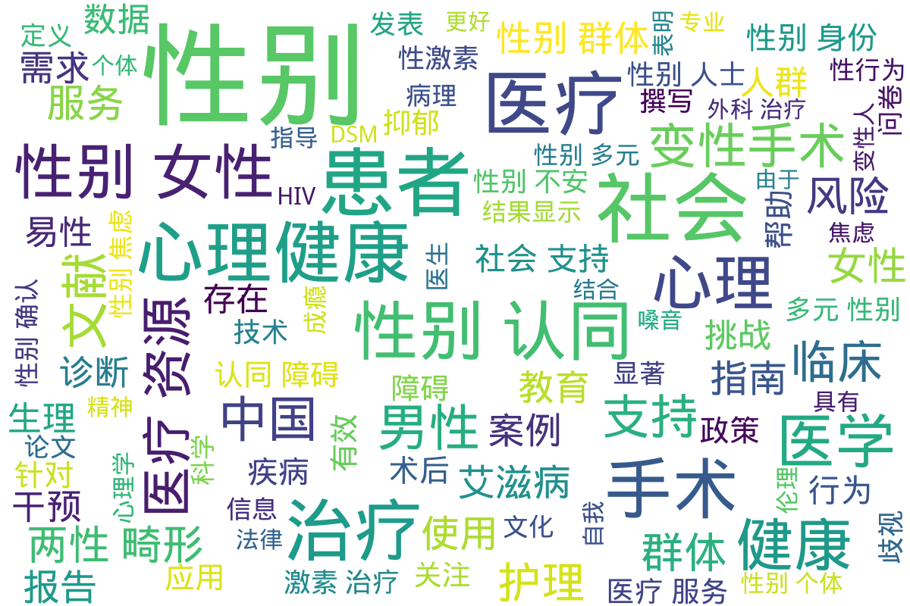

---
search:
  exclude: true
---

# 医学

!!! info

    该目录包含了多篇与跨性别和变性医疗相关的学术文献，主要涉及变性人与其所在社会的医疗、法律、伦理等多方面的互动与现状。这些研究揭示了跨性别群体在医疗过程中所遭遇的诸多挑战，包括医疗服务的质量、社会歧视、法律支持缺失等问题，强调了人性化医疗的重要性与必要性。
    
    冯泽永的研究文章深入探讨了变性人的手术态度以及手术后所面临的社会心理压力，强调了尊重变性人的自主选择与提供良好支持的重要性。医师报的文章则分析了变性手术领域内存在的法规与监管缺失问题，呼吁加强对变性者的合法权益保护。
    
    中国跨性别男男性行为者的HIV感染风险研究和2018年爱滋病预防项目调查报告中，进一步揭示了跨性别群体在性健康方面的脆弱性，暴露了社会支持体系的不完善及相关健康服务的缺失。整体上，这些文献不仅探讨了医学与伦理问题，还反映了法律和社会环境对跨性别群体生存现状的影响，提供了大量的数据支持和见解，期望改变现行医疗体系中的不足之处。
    
    本目录的文献涵盖了主题广泛的医疗研究，重复强调了多元性别友善医疗的重要性，以及法律和社会对跨性别身份的影响。这些研究为政策制定者提供了宝贵的数据，助力推动相关法律改进，实现对变性人和跨性别群体的全面支持与保障。

!!! note "📊 统计信息"

    总计内容：145 篇
    标签：`跨性别` `变性人` `医疗资源` `社会支持` `性健康` `法律政策` `心理健康` `人道主义医疗`

### 📄 文档

<table>
<thead><tr>
<th style="width: 40%" data-sortable="true" data-sort-direction="asc" data-sort-type="text">标题 ▲</th>
<th style="width: 15%" data-sortable="true" data-sort-direction="desc" data-sort-type="year">年份 ▼</th>
<th style="width: 45%">摘要</th>
</tr></thead>
<tbody>
<tr data-name="5医学与哲学6人文社会医学版2007_年_第28_卷_易性癖及其手术治疗的全面审视" data-year="2007" data-date="2024-11-02 02:46:09">
                <td><a href="5医学与哲学6人文社会医学版2007_年_第28_卷_易性癖及其手术治疗的全面审视_page" class="md-button">5医学与哲学6人文社会医学版2007_年_第28_卷_易性癖及其手术治疗的全面审视</a></td>
                <td class="year-cell">2007</td>
                <td class="description-cell">

                    
展开

                    

                        该文献为《医学与哲学（人文社会医学版）》2007年12月第28卷第12期的一个专辑，主要聚焦于医疗与社会的多重关系，特别是从人文社会医学的视角出发，探讨医疗改革、医学伦理及其他相关议题。论文中汇集了多位学者的研究成果，包括对中国人群死亡及其危险因素的流行水平、趋势和分布的深入分析。文中提到，医学专业面临一系列危机，特别是医生与药业的关系、医生职业的潜规则，以及医学伦理学的必要性和挑战。
                         年份：2007
                         收录日期：2024-11-02 02:46:09
                    

                
</td>
            </tr>
<tr data-name="2007年变性人及手术态度研究_冯泽永" data-year="2007" data-date="2024-11-23 06:51:59">
                <td><a href="2007年变性人及手术态度研究_冯泽永_page" class="md-button">2007年变性人及手术态度研究_冯泽永</a></td>
                <td class="year-cell">2007</td>
                <td class="description-cell">

                    
展开

                    

                        本文件为冯泽永在《医学与哲学（人文社会医学版）》第28卷第8期发表的一篇关于变性人及其手术态度的研究文章。文章的摘要指出，我们必须以人道主义的价值观为基础，来确立对变性人的态度，尊重变性人的理性自主选择，同时增强对变性人性别价值观的包容与理解。文件深入探讨了自1990年上海首次成功开展变性手术以来，变性医学在中国的迅猛发展，并强调了对变性人心理、伦理以及法律等方面的关注。

文中提到，社会对变性人的态度往往使得许多接受变性手术的人在术后感到更大的压力，这在一定程度上源于社会的误解和缺乏接纳。文章强调，变性人本身也应当明确自己的态度，做好手术带来的各种社会及心理挑战的准备。文章详细讨论了怎样通过家庭与社会的支持、法律保护、以及健康教育来改善变性人的生活与心理健康。

在论述中，冯泽永指出，对待变性手术和变性人应该以包容与和谐的态度为核心。这种态度的确立不仅反映了人性化的医学关怀，也是对人权尊重的一种体现。文章还强调了加强心理治疗和研究的必要性，指出目前尚无有效的心理治疗方案，因此在变性手术成为最后选择时，医务人员需对手术的可能后果进行全面评估与沟通。

作者还讨论了社会偏见对变性人的影响，指出需要通过法律法规来维护变性人的合法权益，同时全社会应提升人道主义精神，创造良好的发展环境。文章详细分析了变性人群体的生存现状以及医疗系统在帮助他们适应社会方面的角色，回应了这一领域在伦理和心理上的复杂性。
                         年份：2007
                         收录日期：2024-11-23 06:51:59
                    

                
</td>
            </tr>
<tr data-name="2014年变性手术问题分析_医师报" data-year="2014" data-date="2024-11-23 06:10:35">
                <td><a href="2014年变性手术问题分析_医师报_page" class="md-button">2014年变性手术问题分析_医师报</a></td>
                <td class="year-cell">2014</td>
                <td class="description-cell">

                    
展开

                    

                        在这篇名为《2014年变性手术问题分析》的文章中，主要探讨了我国变性手术领域内存在的一系列问题。其中提到的数据显示，我国的变性者数量已达40万，然而变性手术的门槛相对较高，加之监管缺失，导致了违法行为的滋生。文章指出，变性手术受限于现行法规，许多求助者因无法支付高额费用而寻求无执照诊所的服务，极有可能面临手术风险和后续的医疗问题。通过引用上海长征医院与上海交通大学医学院的数据，提到这两大手术中心在过去30年间已进行过至少800例变性手术。与此同时，李青峰教授及其团队在《柳叶刀》等国际期刊上发表了关于变性手术政策的相关研究。他们对现行的变性手术治疗标准提出质疑，强调这一政策并未全面反映国际变性手术的治疗指南，缺乏更新与修订，造成了对变性者的隐私与自主权的侵犯。 

文章的另一部分则涉及生理健康层面的讨论，提及对于变性者而言，内分泌治疗和手术后的医疗跟踪同样重要。特别是变性者在经历手术后，可能面临一系列身体和心理方面的挑战。李教授指出，现行法规的固守与人性化的医疗需求之间存在冲突，期待未来的法律和医疗政策能更好地兼顾变性者的需要，提高医疗服务的质量与可及性。 

同时，文章中引用若干医学研究的数据，尤其是有关乳腺癌预防及治疗的研究，进一步反映了变性者在医疗领域面临的差异及挑战。文章还讨论了有关变性手术的伦理、法律以及社会环境问题，透过具体的案例和数据，揭示了变性者所遭遇的种种困难与不平等待遇。
                         年份：2014
                         收录日期：2024-11-23 06:10:35
                    

                
</td>
            </tr>
<tr data-name="2016_蔡泳研究组_中国跨性别男男性行为者HIV感染风险研究" data-year="2016" data-date="2024-11-23 06:47:20">
                <td><a href="2016_蔡泳研究组_中国跨性别男男性行为者HIV感染风险研究_page" class="md-button">2016_蔡泳研究组_中国跨性别男男性行为者HIV感染风险研究</a></td>
                <td class="year-cell">2016</td>
                <td class="description-cell">

                    
展开

                    

                        《中国跨性别男男性行为者HIV感染风险研究》研究的主要内容是关于中国跨性别男男性行为者（transgender men who have sex with men, TGMSM）群体HIV/AIDS感染风险的深入分析。研究由上海交通大学公共卫生学院的蔡泳副教授及香港中文大学的刘德辉教授联合进行，聚焦于中国范围内这一边缘人群的病毒感染率及相关的社会心理因素。

该研究是首次有系统性地聚焦于中国跨性别男男性行为者，以及他们在HIV传播中处于高风险的情况。根据报告中提到的数据，跨性别男男性行为者的HIV感染率已经达到了超过16%，远高于普通男男性行为者群体的感染率8%至9%。不仅如此，研究团队发现，有26.8%的被调查者在过去一个月内经历过无保护的男男商业性行为。由于这个群体的特殊性，他们往往因社会边缘化而面临严峻的社会歧视，许多人被迫转向性工作，进一步增加了感染HIV的风险。

蔡泳研究组在研究中指出，与无保护商业性行为有关的因素主要包括自我使用安全套的自我效能感和对性别身份被揭露的恐惧。这些因素提示，需要从心理和社会的角度出发制定针对性的干预措施，以降低跨性别男男性行为者的HIV感染率，该研究为今后制定相关公共健康策略提供了重要依据。

该研究在2016年7月首先以在线形式发表在国际著名的公共卫生杂志《Journal of the International AIDS Society》中，且蔡泳副教授作为第一作者，刘德辉教授为通讯作者。该论文的引用链接为http://www.jiasociety.org/index.php/jias/article/view/20800。在2016年，《上海交通大学学报（医学版）》还荣获了“中国最美期刊”奖，这是对其学术质量和艺术设计的充分认可。

总而言之，该研究不仅揭示了跨性别男男性行为者在HIV/AIDS感染风险方面的严峻现状，也为未来的研究指明了方向。这一研究成果深刻体现在卫生政策的制定与执行上，强调了对这一群体的健康促进策略和措施的重要性，以期有效降低其HIV感染与传播的风险。
                         年份：2016
                         收录日期：2024-11-23 06:47:20
                    

                
</td>
            </tr>
<tr data-name="2018年愛滋病預防項目調查報告-男跨女跨性別人士" data-year="2019" data-date="2024-11-23 05:32:35">
                <td><a href="2018年愛滋病預防項目調查報告-男跨女跨性別人士_page" class="md-button">2018年愛滋病預防項目調查報告-男跨女跨性別人士</a></td>
                <td class="year-cell">2019</td>
                <td class="description-cell">

                    
展开

                    

                        这份文件是《2018年爱滋病预防项目调查报告—男跨女跨性别人士》的详细记录，发表于2019年5月，旨在探讨和分析香港男跨女跨性别人士在性爱行为和健康状况方面的现状和挑战。在这份调查中，男跨女跨性别人士作为一个往往被忽视和难以接触的社群，其艾滋病病毒感染率普遍较高。为了更好地了解这一群体的健康状况，调查团队于2014年将其纳入高危群体，并在2018年持续进行相关研究与数据收集。

调查采用了社区为基础的行为调查方法，主要通过在两间非政府机构的中心内进行自愿艾滋病病毒测试服务以及外展和网上活动来招募参与者。此次调查共访谈了41名男跨女跨性别人士，其中68.3%为菲律宾人，24.4%为华人，参与者年龄以20至29岁群体居多。调查结果显示，在过去六个月内，受访者中有58.5%与情感伴侣、41.5%与固定伴侣、56.1%与非固定伴侣发生过性交。相较于与不同伴侣的性交经历，参与者对于安全套的使用情况也有所不同，最近一次性交安全套的使用率分别为58.3%、76.5%和78.3%。73.2%的受访者表示曾与性工作者发生过性交，且最近一次性交的安全套使用率更高，达到了90.0%。

调查还重点记录了受访者在艾滋病病毒测试方面的行为，41名受访者中有37人（90.2%）曾接受过艾滋病病毒测试，且所有受测试者均知晓结果，同时65.9%的参与者在调查前一年内进行过测试。测试服务的主要提供方为私营医疗服务，其次是非政府机构和公营医疗服务，相应地，调查也发现了影响这些跨性别人士接受艾滋病防治服务的原因。

文中讨论了sexualité及chemsex（药物性行为）对跨性别人士群体造成的影响。具体来说，53.7%受访者在过去六个月内在性行为前或进行期间有使用酒精和药物的记录，其中芳香剂和勃起功能障碍药物的使用率较高。这些行为对个体及公共健康构成额外风险，使得推广艾滋病预防及测试服务变得尤为重要。因此，调查建议通过外展服务进一步接触及支持这一社群。

综上所述，这份报告不仅是对男跨女跨性别人士生活和健康现状的记录，也是呼吁社会关注和加强对这一群体的支持，尤其是在艾滋病病毒防治方面。通过了解他们的背景以及在性行为中的风险，能够为未来相关政策和项目的制定提供重要参考和依据。
                         年份：2019
                         收录日期：2024-11-23 05:32:35
                    

                
</td>
            </tr>
<tr data-name="2020_年美国内分泌协会临床实践指南_内分泌疾病患者的血脂管理" data-year="2021" data-date="2024-11-01 08:47:44">
                <td><a href="2020_年美国内分泌协会临床实践指南_内分泌疾病患者的血脂管理_page" class="md-button">2020_年美国内分泌协会临床实践指南_内分泌疾病患者的血脂管理</a></td>
                <td class="year-cell">2021</td>
                <td class="description-cell">

                    
展开

                    

                        该文档为2020年美国内分泌协会发布的《临床实践指南：内分泌疾病患者的血脂管理》解读，由邓臣前和陈树春共同撰写。文章详细阐述了近年来内分泌疾病患者血脂管理的重要性，指出血脂异常在这些患者中的普遍存在并提出针对性的管理建议。本文首先提到，在近些年，多个国家，包括中国相继发布了关于内分泌疾病的血脂管理指南，强调这一方面在治疗中的重要性。然而，大多数指南只针对单一内分泌疾病的管理，而未能对伴有多种内分泌疾病且存在血脂异常的患者进行系统性的阐述。这一背景下，2020年美国内分泌协会的指南首次综合地描述了内分泌疾病患者的血脂管理，为临床实践提供了重要的指导依据。
                         年份：2021
                         收录日期：2024-11-01 08:47:44
                    

                
</td>
            </tr>
<tr data-name="2021年UCSF环境调查报告" data-year="2022" data-date="2024-11-23 05:07:24">
                <td><a href="2021年UCSF环境调查报告_page" class="md-button">2021年UCSF环境调查报告</a></td>
                <td class="year-cell">2022</td>
                <td class="description-cell">

                    
展开

                    

                        本文件是由加州大学旧金山分校（UCSF）于2021年进行的环境调查报告，由Emma White Research实施。该调查旨在评估UCSF社区的工作和学习环境，尤其关注多元化、公平性和包容性。在问卷设计过程中，调查组参考了之前的多项调查，以确保能全面反映不同群体的体验与感受。调查从2021年10月11日至12月3日进行，收集了14,579份回应，包括教师、工作人员和学习者的数据。

调查结果显示，UCSF社区成员对其环境的整体评价较为积极。具体而言，70%的人表示他们对UCSF的环境感到满意，而仅有11%的人表达了不满。从不同角度来看，大多数人认为环境尊重、友好且包容。调查中提出的PRIDE价值观（专业精神、尊重、诚信、多元化、卓越）对社区成员的重要性也得到了普遍认可，其中94%的人认为专业精神极其重要。大多数受访者对UCSF在营造这样的环境方面表示积极评价，尤其是在推动性别认同和表达、种族与族裔等领域的公平性。

报告还详细探讨了不同角色（教师、工作人员、学习者）在校园环境中的具体体验。调查发现，女性和男性对环境评价略有不同，女性对环境的满意度相对较低，并认为在薪酬和职业机会等方面受到了不平等待遇。报告提到跨性别和非二元性别个体在环境中的体验普遍较为负面，显示出对于性别平等与包容性环境的持续挑战。

UCSF环境调查不仅展现了校园对多元化和包容性发展的努力，也揭示了仍需改进的领域和不同身份群体的真实感受。调查数据显示，虽然整体对环境持积极看法，但特定群体，如跨性别人士，仍然面临不平等的待遇和环境挑战。这些发现为今后制定相应的政策和改善措施提供了重要依据，促使UCSF在继续促进多元化、公平性和包容性方面迈出更大的步伐。
                         年份：2022
                         收录日期：2024-11-23 05:07:24
                    

                
</td>
            </tr>
<tr data-name="2023_國立臺灣大學_跨性別男性情慾與性風險研究報告" data-year="2023" data-date="2025-01-18">
                <td><a href="2023_國立臺灣大學_跨性別男性情慾與性風險研究報告_page" class="md-button">2023_國立臺灣大學_跨性別男性情慾與性風險研究報告</a></td>
                <td class="year-cell">2023</td>
                <td class="description-cell">

                    
展开

                    

                        该文件是由国立台湾大学医学院护理学系完成的关于跨性别男性情欲与性风险的研究报告。本研究旨在深入探讨跨性别男性（Transgender Male，TM）在情欲和性风险方面的经验。跨性别男性作为一个少数且难以触及的族群，相关的研究与数据十分匮乏，尤其是在他们的情欲文化与性风险行为方面。本报告详细描述了研究的背景、方法以及结果，试图为今后的性健康照护提供数据支持。

文件的摘要部分指出，研究第一阶段通过网络问卷的方式招募了321名跨性别男性，旨在了解他们的情欲文化、性风险现状，从而评估其性健康照护的需求。问卷调查的结果显示，受访者在情欲关系中的短版性幸福量表平均分数为20.42，而HIV、HPV、抹片和STI相关的筛查率非常低，仅在13.4%到21.5%之间，且仅有三位受访者在一年内使用过预防性药物PrEP。

在第二阶段，研究团队进行了焦点团体与半结构式深度访谈，聚焦于受访者的暴力经历，共招募29位参与者。这部分研究揭示了多达19项与受暴经历相关的主题及因应模式，包含61.9%的跨性别男性曾经历过暴力事件。这些发现旨在提升医学界对跨性别男性在性风险与暴力经历的认识，以便提供更适合他们的照护。研究结果为未来可能的政策制定提供了参考，尤其是在医疗与社会服务领域，强调了建立性别友好的医疗环境的重要性。

本研究还涉及政策应用的潜在价值，建议将结果提供给内政部、教育部和卫生福利部等相关机构，以支持相关政策的改进与实施。此项研究是针对跨性别族群，特别是跨性别男性，生存现状和性健康需求的重要学术贡献，意义深远。
                         年份：2023
                         收录日期：2025-01-18
                    

                
</td>
            </tr>
<tr data-name="2023_年兒童青少年精神科專科醫師繼續教育課程_跨性別與性別多元化" data-year="2023" data-date="2024-11-02 02:43:58">
                <td><a href="2023_年兒童青少年精神科專科醫師繼續教育課程_跨性別與性別多元化_page" class="md-button">2023_年兒童青少年精神科專科醫師繼續教育課程_跨性別與性別多元化</a></td>
                <td class="year-cell">2023</td>
                <td class="description-cell">

                    
展开

                    

                        本文件是2023年儿童青少年精神科专科医师继续教育课程的资料，主题为跨性别与性别多元化青年的整合性照护与精神健康。该文档详细列出了课程的日程安排及讲者信息，以帮助医师们深入了解如何为跨性别及性别多元的青少年提供全面的心理健康支持与照护。

课程于2023年11月26日进行，通过网络会议的形式呈现，涵盖了多个与跨性别群体及其精神健康相关的重要议题。会议开始前，参加者进行了注册。随后的开场致辞由儿童青少年精神医学会的理事长周文君负责，他强调了跨性别及性别多元化青少年照护的重要性。

演讲者包括安娜·伊雷亚·罗莎·范·德·米森（Anna Irea Rosa van der Miesen），来自加拿大多伦多的麦凯恩家庭心理健康中心，她分享了来自荷兰的跨性别与性别多元化人士照护的经验，并介绍了该国在此领域的实践与成效。这部分内容为医师提供了重要的国际视野，能够促进本地实践的发展。

之后，赖孟泉医师探讨了自闭症与性别多样性之间的关系，介绍了最新的证据基础及其复杂的临床影响。这些内容对于医师们理解性别多元青少年的心理健康需求意义重大，让他们在临床工作中更为敏感和知晓性别多样性背后所带来的不同挑战。 

午餐后，王雅青副教授则讲述了在台湾为LGBT患者提供文化适应性照护的经验，讨论了如何在本地社区和医疗环境中更好地支持多元性别群体。最终，徐志云医师分享了关于跨性别儿童及青少年的地方实践经验，探讨了临床、家庭以及社群文化对这些群体成长环境的重要影响，强调了专业人员、家庭与社区合作的重要性。

最后的问答环节让与会者有机会与演讲者进行更深入的交流，总结及鼓励医务工作者继续关心和支持跨性别与性别多元的青少年群体。整个课程不仅增进了医师们的专业知识，也提升了其对性别多元化问题的认识与同理心，为未来相关青年提供更好的医疗照护奠定了基础。
                         年份：2023
                         收录日期：2024-11-02 02:43:58
                    

                
</td>
            </tr>
<tr data-name="2023_杜思誠_多元性別友善醫療報告" data-year="2023" data-date="2025-01-18">
                <td><a href="2023_杜思誠_多元性別友善醫療報告_page" class="md-button">2023_杜思誠_多元性別友善醫療報告</a></td>
                <td class="year-cell">2023</td>
                <td class="description-cell">

                    
展开

                    

                        该文件为《多元性别友善医疗报告》，由杜思诚撰写，目的是为推动和改善对多元性别群体的医疗保障与支持。这份报告首先从作者杜思诚的背景出发，描述了其在同志性健康与艾滋病议题、职场多元性别平等、国际事务及婚姻平权推进方面的经验和贡献。作者强调，作为一位活跃的社群参与者，他对于多元性别的理解不仅是理论上的，更是亲身经历与长期关注的结果。

文件中详细介绍了诸如生理性别、性别认同、性别气质及性倾向等多元性别的概念，明确指出这些特征在个体中各自可能存在的多样性。作者引用了针对跨性别者就医过程中的调研数据，展示了该群体在寻求医疗帮助的过程中所遭受的困难和挑战。具体而言，文件中提到，高达25%的人在就医时会因为期待受到歧视而事先找寻友善医疗，而7%的受访者则在医疗过程中遇到过不友善的医疗人员。

报告进一步列出了6,436项同志友善医疗实践关键词，并指出医疗机构应如何设计友好的医疗环境以保护患者隐私与尊严。包括不预设患者性倾向和性别身份的原则、尊重患者称谓等。报告引用了世界各地专业机构对性倾向和性别身份的认可，强调这些多样性并不应被视为疾病，而是人类发展的正常表现。此部分为该报告的核心，力图反映科学界对待多元性别的认知与接受度。

值得注意的是，杜思诚在报告中也提到，在台湾推动的相关权利与法律政策，尤其是同性婚姻和跨国婚姻方面的进展。他讨论了人工生殖及跨性别医疗经验的实践问题，强调同性伴侣在医疗决策中的权利。同时，对于就医体验的具体问题，报告逐条列举了在实际医疗中跨性别者所遭遇的不适与困扰，譬如在就医过程中遭受误称、身份怀疑等情况，这些都是该群体在寻求健康服务时必须面临的障碍。

总体来看，这份报告不仅是医学领域的专业文件，更是多元性别友善医疗倡导的重要资料，通过丰富的数据和生动的案例彰显了多元性别患者所需的尊重与专业的医疗服务。
                         年份：2023
                         收录日期：2025-01-18
                    

                
</td>
            </tr>
<tr data-name="2023_腹腔镜手术在女性易性癖患者性再赋手术中的应用价值研究" data-year="2023" data-date="2024-11-23 06:48:06">
                <td><a href="2023_腹腔镜手术在女性易性癖患者性再赋手术中的应用价值研究_page" class="md-button">2023_腹腔镜手术在女性易性癖患者性再赋手术中的应用价值研究</a></td>
                <td class="year-cell">2023</td>
                <td class="description-cell">

                    
展开

                    

                        本研究文件名为《腹腔镜手术在女性易性癖患者性再赋手术中的应用价值研究》，主要探讨腹腔镜手术在女性易性癖患者进行性别再赋手术（也称为性别确认手术）中的实际应用及其效果。这项研究重点分析了腹腔镜手术方法的优势，包括其低侵入性、较短的恢复时间及减轻手术后并发症的风险等。由于传统的开放手术可能导致更长的恢复期和更高的感染风险，因此利用腹腔镜技术能够为患者提供更为人性化的医疗选择。

在论文的摘要部分，强调了研究的背景及临床意义，指出在当前对跨性别者的医疗需求日益增加的背景下，寻找更加高效、也更为安全的手术方法显得尤为重要。文中详细列出了研究选取的入组患者及手术实施细节，强调了手术操作中的每一个环节，并且通过统计数据对手术效果进行了量化分析，包括术后满意度、心理状态及身体恢复情况等。

研究还对腹腔镜手术与传统手术在术后效果上的差异进行了分析。结果显示，接受腹腔镜手术的患者在术后患有并发症的比率明显低于传统开放手术的患者，且术后的生活质量和性生活满意度均表现出更高的评分。研究还讨论了针对不同个体化需求，如何在术前对患者进行详尽的咨询，以确保手术方案的最佳匹配。这一部分为尿道再造、乳腺切除等具体技术实现和术后管理提供了参考。

综上所述，本项研究为易性癖患者提供了一种新的手术选择，强调了临床工作者在手术治疗中的重要责任，即不仅要关注医疗技术的实施，也要重视患者的心理需求与手术后的整合性照护。该文献能够为今后的相关研究和临床实践提供宝贵的参考资料，推动对性别多元性别手术领域的深入研究和医疗服务的发展。
                         年份：2023
                         收录日期：2024-11-23 06:48:06
                    

                
</td>
            </tr>
<tr data-name="2023年台灣性學會研究冊" data-year="2023" data-date="2024-11-23 02:48:07">
                <td><a href="2023年台灣性學會研究冊_page" class="md-button">2023年台灣性學會研究冊</a></td>
                <td class="year-cell">2023</td>
                <td class="description-cell">

                    
展开

                    

                        该文件为2023年台湾性学会研究册，是一份专注于性别多元性及相关领域的学术文献。由于从PDF中提取文本时出现错误，导致具体内容未能显示，但就一般而言，这类文献通常包括了关于性别研究的最新发现、案例分析、理论探讨、医疗资源、社会环境以及法律政策等方面的重要议题。虽然无法直接获取文本内容，预计文中可能包含台湾地区关于跨性别、多元性别群体的生命故事与过渡经历的具体案例，提供了许多第一手的研究数据与个体经验分享。文献还可能涉及到跨性别群体所面临的医疗挑战和资源，探讨了医疗体系对多元性别人士的支持及其不足之处，梳理了法律框架对这些群体的保护或者限制。另一个潜在的主题则是社会环境对于性别认同的接受度和支持程度，这在台湾社会的背景下更具现实意义。结合当前台湾对性别平等的推动以及反对歧视的立法进展，这份研究册无疑为了解性别多元性的问题提供了宝贵的视角和数据。文献可能还囊括一些重要的学术观点，提供有关生存现状的真实记录，以及相关的统计数据与社会研究成果，为读者揭示多元性别群体所经历的种种挑战与希望的变化。虽然无法提供具体的文本摘录，但文件的重要性在于其为性别研究领域提供了全面的学术贡献和实证数据，强调了学术界与社会对多元性别议题的重视与关注。
                         年份：2023
                         收录日期：2024-11-23 02:48:07
                    

                
</td>
            </tr>
<tr data-name="2023年鲁琳_双性人手术干预知情同意分析与后现代哲学思考" data-year="2023" data-date="2024-11-23 06:50:32">
                <td><a href="2023年鲁琳_双性人手术干预知情同意分析与后现代哲学思考_page" class="md-button">2023年鲁琳_双性人手术干预知情同意分析与后现代哲学思考</a></td>
                <td class="year-cell">2023</td>
                <td class="description-cell">

                    
展开

                    

                        这篇论文题为《双性人手术干预知情同意分析与后现代哲学思考》，由鲁琳博士撰写，刊登在2023年9月的《医学与哲学》杂志第44卷第18期。文中深入探讨了关于双性人手术干预的知情同意的伦理问题，并提出了三种不同的立场。肯定立场，即支持由医务人员作出手术决定，认为这符合社会主流性别规范的要求，但作者指出，这种立场并未考虑双性人自身对性别的感受，违反了知情同意原则的基本伦理。中间立场主张手术的必要性并强调父母的决定权，认为在某种程度上符合临床的知情同意伦理规范，但同样忽略了双性人个体的情感和需求。最后，否定立场提倡完全停止不必要的外科手术，认为应当在儿童认知能力足够的时候由其自行决定是否接受手术。这一立场得到了后现代哲学的支持，倡导多元性和对弱势群体的关注，为否定立场提供了更为充分的理论依据。论文引用了哥伦比亚法律的实践，探讨了手术知情同意应在法律监督下进行，以确保做出完全符合儿童利益的决定。这一系列分析不仅针对双性人医疗干预的伦理困境，也引发了对性别认同、身体自主权以及医疗伦理的更广泛思考。整体而言，这篇文章不仅具有理论深度，还对双性人群体的生存现状及其在医务系统中的地位提出了质疑和反思，呼吁在医学实践中更加关注双性人的个体化需求和人权。
                         年份：2023
                         收录日期：2024-11-23 06:50:32
                    

                
</td>
            </tr>
<tr data-name="2024年医学与哲学_跨性别技术的伦理困境_俞玲玲" data-year="2024" data-date="2024-11-23 06:49:43">
                <td><a href="2024年医学与哲学_跨性别技术的伦理困境_俞玲玲_page" class="md-button">2024年医学与哲学_跨性别技术的伦理困境_俞玲玲</a></td>
                <td class="year-cell">2024</td>
                <td class="description-cell">

                    
展开

                    

                        这篇文章的标题为《跨性别技术的伦理困境》，由俞玲玲撰写，发表于2024年11月的《医学与哲学》期刊。该文探讨了跨性别技术作为一种医学手段在实现跨性别者身心统一过程中所面临的伦理难题。文章首先明确跨性别技术的定义，包括性别确认激素疗法和性别确认手术，并指出随着社会的进步和大众对性别多样性认知的提升，这一医疗技术的合法性逐渐被认可。然而，尽管技术存在合法性，跨性别者在寻求治疗的过程中，依然面临严重的社会歧视和生存困境，这种困境在个体与社会的双重层面上显得尤为突出。

文中摘录了其摘要部分，指出跨性别技术的伦理困境包括存在的合法性、风险性及操作的可获取性与限制性。这意味着跨性别者在寻求医疗资源时，不仅要应对技术本身带来的风险与伦理问题，还要面对广泛存在的社会偏见及医疗资源的匮乏。文章强调，伦理与科技的分歧使得社会需在个人心理建设、公共知识普及和制度规范三方面共同努力，以帮助跨性别群体更好地融入社会，实现伦理意义上的“在一起”。

该文还讨论了技术实施的具体问题，如大多数跨性别者在满足手术条件方面存在困难，行业规范的缺乏导致乱象丛生，进一步加剧了跨性别者的生存挑战。作者在文中强调，基于跨性别者的性别身份与生理性别的不一致，面对现代社会对性别认同的重新审视，如何实现技术的平等使用及其可获得性，将是跨性别者一项重要的权益诉求。因此，跨性别技术的伦理困境不仅是一个医学问题，更是涉及社会、政治与法律的复杂话题。
                         年份：2024
                         收录日期：2024-11-23 06:49:43
                    

                
</td>
            </tr>
<tr data-name="A_cross-sectional_study_of_associations_between_casual_partner,_friend_discrimination,_social_support_and_anxiety_symptoms_among_Chinese_transgender_women" data-year="2016" data-date="2025-01-18">
                <td><a href="A_cross-sectional_study_of_associations_between_casual_partner,_friend_discrimination,_social_support_and_anxiety_symptoms_among_Chinese_transgender_women_page" class="md-button">A_cross-sectional_study_of_associations_between_casual_partner,_friend_discrimination,_social_support_and_anxiety_symptoms_among_Chinese_transgender_women</a></td>
                <td class="year-cell">2016</td>
                <td class="description-cell">

                    
展开

                    

                        该文件是发表在《情感障碍杂志》上的一篇学术论文，研究了中国跨性别女性的焦虑症状与随意伴侣、朋友歧视和社会支持之间的关系。文章指出焦虑症状是跨性别女性中常见的心理障碍，但目前有关中国跨性别女性的相关研究仍然较少。研究以中国辽宁省沈阳的209名跨性别女性为样本进行横断面研究，采用了自评焦虑量表(Zung Self-Rating Anxiety Scale, SAS)来评估参与者的焦虑症状。根据结果显示，34.5%的参与者被诊断为具有显著焦虑症状。

研究结果表明，随意伴侣关系、朋友歧视和社会支持与焦虑症状显著相关。具体来说，研究者发现焦虑症状的影响因素中，随意伴侣关系的缺乏和朋友歧视是对焦虑症状影响最大的因素，分别在最终模型中解释了19.2%和15.5%的总变异量。文章强调了跨性别女性所面临的严峻转型挑战，如高风险的性伴侣关系、显著的歧视以及社会支持的减少，指出这些因素在很大程度上助长了焦虑症状的发生。研究讨论了如何改善社会支持和减少朋友歧视，这对于缓解跨性别女性的焦虑症状、提升心理健康水平具有重要意义。

综上所述，该研究为中国跨性别女性的心理健康问题提供了重要的实证数据，指出焦虑症状在这一脆弱群体中的高发病率与多方面的社会支持缺失和歧视现象密切相关。文章最后呼吁社会各界关注并改善跨性别女性的社会支持系统，以更好地促进她们的心理健康和过渡过程。
                         年份：2016
                         收录日期：2025-01-18
                    

                
</td>
            </tr>
<tr data-name="Acceptability_of_Daily_Use_of_Free_Oral_Pre-exposure_Prophylaxis__PrEP__Among_Transgender_Women_Sex_Workers_in_Shenyang,_China" data-year="2017" data-date="2025-01-18">
                <td><a href="Acceptability_of_Daily_Use_of_Free_Oral_Pre-exposure_Prophylaxis__PrEP__Among_Transgender_Women_Sex_Workers_in_Shenyang,_China_page" class="md-button">Acceptability_of_Daily_Use_of_Free_Oral_Pre-exposure_Prophylaxis__PrEP__Among_Transgender_Women_Sex_Workers_in_Shenyang,_China</a></td>
                <td class="year-cell">2017</td>
                <td class="description-cell">

                    
展开

                    

                        本文件为一篇关于中国沈阳跨性别女性性工作者每日免费预防性暴露（PrEP）使用接受度的研究，发表于2017年。研究旨在调查跨性别女性性工作者对每日使用口服PrEP的接受度及相关因素。文件内容涉及到183名HIV阴性或HIV状态未知的参与者，参与者在接受PrEP的简报后完成了横断面调查。研究结果表明，接受每日免费PrEP的比例为61.2%。

文件的摘要部分指出，研究分析了关于接受PrEP的各种相关因素。例如，教育水平和月收入对接受度的影响被调整考虑，同时负面态度（例如对PrEP副作用的担忧）与接受度之间存在显著关联（调整后的优势比为0.26）。参与者认为男伴对使用PrEP的支持影响其接受度（调整后的优势比为2.08），以及参与者对使用PrEP的控制感知（优势比范围为2.10至16.72）也显著影响其对PrEP的接受度。

本文还探讨了跨性别女性性工作者所面临的独特环境，例如性工作中经历暴力、对客户的HIV感染风险的感知和焦虑等因素，这些因素也被证明与接受度显著相关。研究呼吁未来的PrEP推广活动应考虑这些影响因素，利用适当的策略提高该群体的PrEP接受度与使用。

研究的背景说明了跨性别女性在性工作领域的脆弱性以及HIV的高传播风险，尤其是在中国的情况。报告中提到，根据Meta分析，跨性别女性性工作者的HIV患病率达到27.2%，远高于男性和女性性工作者。尽管跨性别女性在性工作中面临更大的暴力和歧视，其对健康干预的接受度仍然是一个亟待关注的领域。综合来看，此研究为了解跨性别女性群体的健康需求提供了重要的数据支持，并为相关政策的制定提供了参考。
                         年份：2017
                         收录日期：2025-01-18
                    

                
</td>
            </tr>
<tr data-name="CCDM3_中国精神障碍分类及诊断标准_全文（易性症在74页）" data-year="None" data-date="2025-01-18">
                <td><a href="CCDM3_中国精神障碍分类及诊断标准_全文（易性症在74页）_page" class="md-button">CCDM3_中国精神障碍分类及诊断标准_全文（易性症在74页）</a></td>
                <td class="year-cell">None</td>
                <td class="description-cell">

                    
展开

                    

                        此文件为《中国精神障碍分类及诊断标准》（CCMD-3）的全文，内容涵盖了精神障碍的分类、诊断标准以及相关的背景信息。CCMD-3是中国特有的精神障碍分类系统，绘制的分类与国际通用的《国际疾病分类》（ICD-10）相关，但又有其独特性，特别是考虑到中国的社会文化和实际情况。文件中详细列出了各类精神障碍的诊断标准，分类的原则、具体项目以及编码等。在文件的开头部分，作者陈彦方指出了CCMD-3编写的原则，即遵循以病人为中心的服务理念，以更好地满足病人和社会的需求，强调具有中国特色。CCMD-3不仅承袭了先前版本的优点，还致力于与国际标准接轨，同时又保持一定的易于理解和操作性。文件对分类及诊断标准的制定经过了充分的科学研究和现场测试，与《ICD-10》的分类存在相对的兼顾与对应，诸如器质性精神障碍、情感性精神障碍等都有详尽的分类。在具体内容布局上，文件包括了各类精神障碍的多项分类，例如器质性精神障碍、心理因子相关生理障碍、人格障碍等。文件中针对每种障碍的具体症状和诊断标准进行了详细描述，如对精神分裂症的定义及其相应的临床表现，说明了不同类型的精神分娩可出现的症状以及诊断依据。这些指标和分类将为临床医生在精神卫生评估与干预提供模型和框架。在引言部分，文件的作者强调了药物或其他因素引发的精神障碍的重要性，着重指出了对发达国家和地区的诊断标准不应简单照搬，而是要因地制宜，考虑到中国的社会文化背景和特点。这种设计思路表明了对患者多元化需求的关注，尤其对心理健康的理解和干预也在不断演进。因此，在处理精神障碍值问题时，CCMD-3旨在提供更为科学的指导，减少社会对精神病患者的误解和偏见。文件的附录部分包含了一些精神障碍英文名称的翻译，以便于国际间的交流与比较，这无疑为在中国特色理论下开展心理健康问题的研究提供了便利。整体来看，CCMD-3作为中国精神卫生系统的重要部分，兼具了临床实用性和理论研究的必要性，为未来中国精神健康事业的发展打下了坚实基础。
                         年份：None
                         收录日期：2025-01-18
                    

                
</td>
            </tr>
<tr data-name="Depth_psychotherapy_with_transgender_people" data-year="2009" data-date="2025-01-18">
                <td><a href="Depth_psychotherapy_with_transgender_people_page" class="md-button">Depth_psychotherapy_with_transgender_people</a></td>
                <td class="year-cell">2009</td>
                <td class="description-cell">

                    
展开

                    

                        这篇论文的标题为《与跨性别者的深度心理治疗》，由林·弗雷泽（Lin Fraser）撰写，发表于2009年5月的《性与关系治疗》期刊中。文章探讨了为跨性别者提供深度心理治疗的初步转变和积极的治疗方法，结合了当代心理动力学、荣格理论及性别认同理论。弗雷泽在文章中指出，跨性别认同的发展过程是独特的，不应被视为固有的病理状态，而是一个涉及自我与外部现实之间关系的复杂过程。 文章的引言部分明确表示，这一模型的基础在于假设跨性别自我是一种合法和真实的自我，而不是早期理论所认为的虚假自我或防御机制。

在深度心理治疗的过程中，跨性别个体所面临的心理问题，如同其他人一样，是关于自我和自我关系的议题，这些问题涉及到自主性与连接性、身份与亲密关系。然而，跨性别者的困扰往往与身心失调和与社会污名化的冲突有关。由于性别构建的过程往往在一个二元性别的世界中进行，跨性别个体面临着渴望与真实之间的张力，尤其是在其身份的前期、阶段性及后期表达过程中，这种心理上的矛盾会进一步影响到他们的心理健康。

论文详细探讨了跨性别身份发展过程的複合轨迹，包括性别认同的自我认知阶段，治疗中的应对机制，以及我们如何能够在治疗中帮助他们解决所遇到的各种复杂心理问题。通过引入来自作者与跨性别者37年临床经验的诗篇，文章展示了这些挑战以及潜在解决方案。可见，跨性别者在身份认同上的发展包括前期、自我公开过程及后期的心理调适，这一过程始终伴随着心理上的问题，这些问题既包括内在的心理动力学问题，也涉及社会交往中的“出闷”的问题。

文章的核心在于为跨性别者提供一个非病理化、积极肯定的治疗模型，强调了跨性别发展过程的独特性及持续的社会文化环境对跨性别者的影响，提示我们在进行心理治疗时需考虑到这些复杂的问题。弗雷泽还提到，跨性别者的发展不仅是个体的内心挣扎，也是一场社会认同和文化转变的运动，说明了社会环境如何影响个体身份的认同。
                         年份：2009
                         收录日期：2025-01-18
                    

                
</td>
            </tr>
<tr data-name="Disclosure_of_Gender_Identity_among_Transgender_Individuals_to_Healthcare__Professionals_in_China" data-year="2022" data-date="2025-01-14 00:35:55">
                <td><a href="Disclosure_of_Gender_Identity_among_Transgender_Individuals_to_Healthcare__Professionals_in_China_page" class="md-button">Disclosure_of_Gender_Identity_among_Transgender_Individuals_to_Healthcare__Professionals_in_China</a></td>
                <td class="year-cell">2022</td>
                <td class="description-cell">

                    
展开

                    

                        本文件为一项名为《跨性别个体向医疗专业人员披露性别身份的情况：一项在线横断面研究》的学术研究预印本，发布于2022年8月26日，由Shamen Susan Chauma等人在中国大陆九个城市进行。研究的目的是评估影响跨性别个体向健康专业人员披露其性别身份的因素，探讨此次披露如何影响跨性别个体的健康服务获取，以及可能面临的文化和社会污名问题。研究的样本依据来自2019年12月至2020年6月间的问卷调查，包括324名跨性别参与者，其中277人符合参与研究的标准，平均年龄为29岁。  

在研究中，有效数据表明，278位跨性别参与者中，78%的人曾对他人透露自己的性别身份，而其中有56%的人向医疗专业人员进行过披露。关于健康行为，有79.4%的参与者曾进行过HIV检测，HIV感染率为9.1%，而47.3%的人曾检测其他性传播感染，42.6%的人使用过激素治疗，9.4%的人接受过性别确认手术。该研究通过多变量逻辑回归分析得出，披露性别身份的个体在接受STI检测的概率上有显著性提高（aOR=1.94, 95%CI: 1.12-3.39），而使用激素干预治疗（aOR=2.81, 95%CI: 1.56-5.05）和暴露前预防（PrEP）使用（aOR=3.51, 95%CI: 1.12-10.97）均与向健康专业人员披露性别身份显著相关。 

研究总结指出，在中国，跨性别个体向医疗专业人员披露性别身份的低比例可能源于对污名和被曝光风险的恐惧，因此更需创建包容的环境以促进跨性别健康服务的获取。研究呼吁需要深入了解披露行为在提高跨性别健康服务可及性中的重要性，以便在今后的研究与医疗政策中加以考虑。该预印本未经过同行评审，作者的版权受到保护，并允许展示在不进行商业再分发的情况下。
                         年份：2022
                         收录日期：2025-01-14 00:35:55
                    

                
</td>
            </tr>
<tr data-name="HIV_and_syphilis_among_men_who_have_sex_with_men_and_transgender_individuals_in_China" data-year="2016" data-date="2025-01-18">
                <td><a href="HIV_and_syphilis_among_men_who_have_sex_with_men_and_transgender_individuals_in_China_page" class="md-button">HIV_and_syphilis_among_men_who_have_sex_with_men_and_transgender_individuals_in_China</a></td>
                <td class="year-cell">2016</td>
                <td class="description-cell">

                    
展开

                    

                        该文件是关于在中国的男男性行为者（MSM）和跨性别个体中HIV和梅毒流行的综述研究，标题为《在中国，男男性行为者和跨性别个体中的HIV和梅毒：一个范围审查》，由Songyuan Tang等人撰写。文中首先介绍了背景，指出尽管政府进行了大量关注，HIV和梅毒在MSM群体中的流行现象仍持续增长。研究团队旨在通过文献综述整合HIV和梅毒流行及应对措施的主要特征，从而为政策制定者和项目管理者提供基于证据的推荐。

在这个综述研究中，作者们通过检索Medline、EMBASE、Cochrane图书馆及中国国家知识基础设施等数据库，收集了在过去六年内关于MSM和跨性别个体中HIV和梅毒传播情况及干预措施的文章。这些文章的定义范围包括HIV和梅毒的流行率、医疗干预以及在中国的相关健康服务。研究显示，2015年中国MSM的HIV流行率约为8%，而在中国西南五个省份则观察到三倍于全国平均水平的高发病率；跨性别个体则在国家HIV、性传播疾病或其他性健康监测系统中没有得到清晰识别。作者还提到中国的HIV检测、医疗链接及保持治疗等环节普遍不足，有必要加强公共卫生部门与社区组织间的数据共享。 

在结果部分，文中强调社区基础性健康项目，如CDC与社区组织的合作，有效推动了MSM群体中的HIV自测。在一项随机对照试验中，众包竞赛相较于社会营销更能有效促进MSM和跨性别个体的HIV检测。为了改进数据获取和社区参与，建议政策制定者增加社区组织与地方CDC之间的数据共享，利用在线调查收集未向医疗专业人士披露性取向的MSM与跨性别个体的数据，扩大MSM和跨性别个体的HIV自测项目，利用众包比赛及社交媒体推广HIV服务，以增强参与度与效果。

最后，研究得到了多项机构的资助支持，包括美国国家过敏与传染病研究所和北卡罗来纳大学等。文献末尾还提到感谢了参与本次研究回顾的众多组织与个人。
                         年份：2016
                         收录日期：2025-01-18
                    

                
</td>
            </tr>
<tr data-name="Hormone_overdose_and_misuse_in_Chinese_transgender" data-year="2022" data-date="2025-01-14 00:36:23">
                <td><a href="Hormone_overdose_and_misuse_in_Chinese_transgender_page" class="md-button">Hormone_overdose_and_misuse_in_Chinese_transgender</a></td>
                <td class="year-cell">2022</td>
                <td class="description-cell">

                    
展开

                    

                        这份论文题为《Chinese transgender and gender non-conforming population的激素过量和误用：混合方法研究方案》，主要探讨了在中国跨性别及性别非顺应人群中，激素过量和误用（Hormone Overdose and Misuse, HODM）的现象。通过这项研究，作者希望对HODM的定义和标准进行评估，调查在中国跨性别和性别非顺应者中HODM的发生率。同时，研究将探索与HODM相关的因素、行为风险，识别潜在原因，并探讨长期影响。该研究背景中提到，目前中国的文献中几乎没有关于HODM的研究，对于这一问题的了解非常有限。

论文的摘要中提到，该研究分为多个阶段，包括专家小组会议和利益相关者参与，以确定HODM的各类标准、类型和等级；随后进行横断面研究，以量化HODM发生率、相关因素及行为风险；作者还计划进行半结构化访谈和焦点小组，以探索HODM的动机及原因；最后则设置了一项前瞻性队列研究，以评估HODM的长期影响。如同许多学术研究一样，本研究也注重伦理问题，相关方案已经获得厦门大学医学伦理委员会的批准。

研究预计将于2023年9月完成，除了队列研究以外的其他部分。部分初步发现将在2026年3月之前公布。最终的研究结果将发表在国际同行评审的期刊中，并计划制作一个面向公众的主要研究发现版本，通过社交媒体和在线社区进行传播。这项研究对HODM的深入探讨将对了解中国跨性别及性别非顺应人群的健康现状提供重要依据，同时也为未来的相关研究指明方向。相关关键词包括：跨性别者、性别确认激素疗法、利益相关者参与、混合方法研究、中国等。这些关键词不仅概括了研究的核心内容，也展现了研究的多维度视角和社会影响力。
                         年份：2022
                         收录日期：2025-01-14 00:36:23
                    

                
</td>
            </tr>
<tr data-name="hormones_MTF" data-year="None" data-date="2025-01-18">
                <td><a href="hormones_MTF_page" class="md-button">hormones_MTF</a></td>
                <td class="year-cell">None</td>
                <td class="description-cell">

                    
展开

                    

                        该文件《Hormones: A guide for MTFs》是一本关于跨性别者特别是跨性别女性（MTF，Male to Female）在激素治疗方面的指南。本指南重点介绍了激素治疗的基本知识，包括激素的作用、MTF激素疗法的类型、治疗过程中可能发生的身体变化以及相关的健康风险等细节。文件指出，激素作为化学信使，由身体的某一部分产生，影响身体其他部分的功能，包括生长、分化等诸多生理反应。在跨性别女性的转变过程中，激素主要用于促进女性化特征的发育，从而使身体与个人性别认同更加契合。

文件详细说明了雌激素在激素疗法中的重要性，指出它是主要促进“女性”身体特征的激素。雌激素的作用包括促进乳房发育等，文件强调其在不同服用方式（如口服、皮肤贴片或注射）下的效果差异，尤其提到与血栓风险相关的考虑。文件还进一步探讨了其他激素（如抗雄激素）在转变过程中的辅助作用，以及这些药物如何联合作用以实现理想的身体变化。

在探讨药物时，文件指出，雌激素对身体各个方面的调节起着重要作用，包括脂肪分布、肌肉质量和身体的性别特征。如果激素治疗得当，这些变化能使跨性别女性的外观和身体感受与其性别认同更为一致。文中还提到，虽然激素治疗可以带来积极的效果，但也可能伴随一定的健康风险，因此了解治疗过程中的预期效果和可能副作用至关重要。

该文件的目的在于为考虑进行激素治疗的人士提供详尽的信息，帮助他们与医护人员有效沟通，以最大化治疗益处并最小化潜在风险。同时，这本指南也适用于这些人士的伴侣、家人和朋友，以帮助他们理解激素的作用及其影响。总体而言，这份文件不仅在医学层面提供了跨性别女性激素治疗的相关知识，也在人文关怀层面传递了对跨性别者生存现状的理解和支持。
                         年份：None
                         收录日期：2025-01-18
                    

                
</td>
            </tr>
<tr data-name="How_Chinas_Transgender_Sex_Workers_Cope_with_Intimate" data-year="2020" data-date="2025-01-18">
                <td><a href="How_Chinas_Transgender_Sex_Workers_Cope_with_Intimate_page" class="md-button">How_Chinas_Transgender_Sex_Workers_Cope_with_Intimate</a></td>
                <td class="year-cell">2020</td>
                <td class="description-cell">

                    
展开

                    

                        该文件为一篇名为《希望的姐妹情：如何应对中国跨性别性工作者的亲密伴侣暴力》的学术论文。文章主要探讨了跨性别性工作者（Transgender Sex Workers, TSW）在面对亲密伴侣暴力（Intimate Partner Violence, IPV）时所遭受的困境，以及她们通过非正式的社会支持网络来应对这些挑战的策略。文中提到，跨性别性工作者在中国社会中面临着极大的孤立和歧视，常常受到来自客户、警察及其他人的暴力，而估计有50%的暴力事件发生在亲密伴侣之间。这样的边缘化使得跨性别性工作者在寻求帮助时面临巨大障碍，导致她们很难通过法律或咨询服务获得支持。

在文章的摘要中，作者强调了跨性别性工作者心理健康面临的挑战，并指出她们的生存状况因歧视、厌女、厌男及跨性别恐惧而更加脆弱。这种权力结构隐性支持了对她们的暴力和虐待。为了生存，跨性别性工作者依赖于她们的社群关系，通过彼此的支持获取情感上的安慰和建议，这种非正式的支持方式被认为比法律制度和社会政策的努力更加有效。研究通过对25名跨性别性工作者的深度访谈，揭示了亲密伴侣暴力的现象以及如何通过姐妹情谊来缓解这些暴力带来的伤害，强调了这种关系在身体与心理健康管理中的重要性。

文章对有关中国跨性别性工作者及其生存现状的研究相对较少。作者援引的数据指出，国内尚无确切的跨性别人数估计，粗略估计约为40万。有数据显示，跨性别性工作者的艾滋病感染率是普通生育年龄成年人群的49倍，这一比例在跨性别性工作者中高达27.3%。在这份文献中，针对跨性别性工作者的亲密伴侣暴力现象的研究可谓稀缺，由于相关的法律和社会认可程度低，许多跨性别性工作者的人权和生存状况仍然未得到应有的重视。
                         年份：2020
                         收录日期：2025-01-18
                    

                
</td>
            </tr>
<tr data-name="ICD_Gender_Incongruence_中文" data-year="None" data-date="2025-01-18">
                <td><a href="ICD_Gender_Incongruence_中文_page" class="md-button">ICD_Gender_Incongruence_中文</a></td>
                <td class="year-cell">None</td>
                <td class="description-cell">

                    
展开

                    

                        此文档为《国际疾病分类（ICD-11）》中有关性别不一致的部分，引述了18章中与性健康相关的情况，并对不同年龄段的性别不一致进行了详细阐述。性别不一致（Gender Incongruence）被定义为个体的性别体验与被指派的性别之间显著且持续的不一致。文中明确指出，单纯的性别变异行为和偏好不足以作为该诊断的依据。接着，针对青少年和成年人的性别不一致，文件描述了个体在经历上所表现出的不适感，以及对性别特征的强烈期望，包括对自身性特征的强烈不满、渴望摆脱不符合自身性别体验的性特征，并希望被社会接受为其经历的性别。这种不一致的体验必须持续存在至少数月，且该诊断不适用于青春期开始之前。为了清晰起见，该文件列出了与性别不一致相关的排除责任，例如性倒错障碍等。对于儿童时期的性别不一致，文中指出，儿童时期表现出来的性别不一致特征包含强烈的性别改变欲望，以及对自身性器官或性征的不满。这种不一致的表现需持续大约两年时间，且同样，性别变异行为和偏好并不足以构成该诊断。文件还提及了一系列性别不一致的情况，包括未特定的性别不一致和其他与性健康相关的情况。整体来看，这份文档为理解性别不一致提供了科学的依据，明确了其各个阶段的标准与特征，有助于在医疗和社会服务中更好地为有需要的人群提供支持和帮助。
                         年份：None
                         收录日期：2025-01-18
                    

                
</td>
            </tr>
<tr data-name="Minority_Stress_and_Mental_Health_among_Transgender_Persons" data-year="2018" data-date="2025-01-14 00:26:59">
                <td><a href="Minority_Stress_and_Mental_Health_among_Transgender_Persons_page" class="md-button">Minority_Stress_and_Mental_Health_among_Transgender_Persons</a></td>
                <td class="year-cell">2018</td>
                <td class="description-cell">

                    
展开

                    

                        这篇名为《跨性别者的少数族裔压力与心理健康》的论文是由伊丽莎白·艾丽斯·萨帕雷托（Elizabeth Alice Sapareto）于2018年在沃尔登大学完成的博士学位论文。论文探讨了跨性别者这一少数群体面临的独特心理健康挑战，特别是少数族裔压力如何影响他们的心理健康。论文的摘要部分指出，跨性别者由于受到社会的深刻歧视和污名化，面临更高的健康和心理健康风险。现有的研究表明，少数族裔压力与心理健康之间存在强烈关联，但针对跨性别者群体的研究仍然很少。为此，该研究通过少数族裔压力理论、积极心理学、生物心理社会模型及跨性别模型为基础，试图阐明跨性别者群体心理健康与少数族裔压力之间的关系。论文中提出了四个研究问题，并最终招募了29名跨性别参与者完成了在线问卷，问卷内容包括3个少数族裔压力测量（内化的跨性别恐惧、污名化和偏见事件）和5个心理健康测量（抑郁、自杀、焦虑及药物和酒精的滥用）。结果表明，具有更高感知污名评分的参与者，自杀意念评分也较高。与预期相反，内化的跨性别恐惧与自杀意念评分之间并没有显著的正相关。研究结果表明，少数族裔的压力对于心理健康的影响是独立的，而当这些压力的影响合并在一起时，对心理健康的总体影响会大于其单独影响。这些研究结果为社会变革倡导提供了支持，意在为卫生保健机构、专业人士及跨性别客户营造一个更加友好的环境。整篇论文企图通过展示一个尚未被充分理解的少数群体的信息，来推动社会变革，尤其是在医疗环境中，为跨性别者提供更安全和有效的健康服务。研究所提到的少数族裔压力的来源包括社会的偏见和制度的障碍，这些因素共同作用使跨性别者在获取医疗资源时面临重重困难。论文的回顾性分析与心理健康变数间的关联，反映出跨性别者在日常生活中所承受的心理负担，这也促使该领域需要更多的深入研究和政策方面的关注。
                         年份：2018
                         收录日期：2025-01-14 00:26:59
                    

                
</td>
            </tr>
<tr data-name="Necessity_of_facial_contouring_in_feminization_surgery_for" data-year="2021" data-date="2025-01-14 00:16:02">
                <td><a href="Necessity_of_facial_contouring_in_feminization_surgery_for_page" class="md-button">Necessity_of_facial_contouring_in_feminization_surgery_for</a></td>
                <td class="year-cell">2021</td>
                <td class="description-cell">

                    
展开

                    

                        本文为一篇关于中国跨性别女性面部轮廓手术（FFS）的专业学术文章，标题为《女性化手术中面部轮廓成型的必要性》。文章由上海交通大学附属上海第九人民医院的重建与整形外科团队撰写，团队成员包括董丽、徐亮、余哲园、袁杰和魏敏。本研究的背景在于，越来越多的跨性别女性面临严重的性别认同障碍，这种障碍常常导致抑郁和自我伤害行为。面部女性化手术被认为是缓解性别认同障碍的一种有效方法，对于中国患者来说，其重要性可能甚至超过生殖器重置手术。 文章中指出，面部轮廓手术被视为改善面部外貌的普通FFS，颧骨和下颌是女性化面部轮廓的关键区域。 

在方法部分，作者对面部轮廓在FFS术前后的骨架和软组织进行了比较分析，以评估女性化效果。通过对术前和术后图像的评估，研究结果显示，所有患者对颌间宽度和中脸突出的减小表示满意。同时，手术后的面部轮廓比率在硬组织和软组织的所有相关方面均显著改变。 

这一研究的结论强调，面部轮廓手术对改变个体的面部外貌和性别印象至关重要，能够显著缓解性别认同障碍。在文中提到的关键词中有“面部女性化手术 (FFS)”、“中国跨性别女性”、“面部轮廓”，这些都说明了研究的焦点。文章的提交日期为2020年8月14日，并在2021年1月26日被接受发表，DOI为10.21037/atm-20-5887，提供了更便于查找和引用的依据。
                         年份：2021
                         收录日期：2025-01-14 00:16:02
                    

                
</td>
            </tr>
<tr data-name="PDF_2018年男同性戀雙性戀及跨性別女性的精神健康" data-year="2021" data-date="2024-11-07 19:37:49">
                <td><a href="PDF_2018年男同性戀雙性戀及跨性別女性的精神健康_page" class="md-button">PDF_2018年男同性戀雙性戀及跨性別女性的精神健康</a></td>
                <td class="year-cell">2021</td>
                <td class="description-cell">

                    
展开

                    

                        这份文件名为《2018年男同性恋/双性恋及跨性别女性的精神健康、物质使用及性健康调查》，由香港特区政府卫生署卫生防护中心发布，时间标注为2021年6月。该调查旨在了解男男性接触者（GBT社群）的生活风险因素和心理健康问题，探讨心理健康与物质使用及性健康之间的关系。调查的背景指出，尽管针对性行为风险因素进行过一系列监测，但针对GBT社群的精神健康问题与性健康风险之间的关联尚未得到充分研究，因此该项调查于2018年11月在香港同志游行期间进行。调查使用了一份由GBT社群自行填写的电子问卷，总共招募了504名男性受访者，其中93%为华人，涵盖了本地出生及在大陆或其他地区出生的受访者，年齡中位数为26岁。这些受访者中有73.4%自我认定为同性恋者，26.6%为双性恋或泛性恋者。

在调查中，受访者的健康相关行为受到了重点分析，例如吸烟与饮酒的情况。调查显示，15.1%的受访者正在吸烟，而在过去12个月中，47%的受访者在饮酒时保持了较低的饮酒量。进一步的分析指出，在精神健康方面，根据DASS-21量表，13.3%的受访者报告感受到严重的抑郁，而20.8%的受访者感到严重的焦虑。针对物质使用的调查显示，20.8%的受访者报告曾使用娱乐性药物，其中69.1%在性交阶段使用药物。有关性行为的调查结果显示，78.4%的受访者与男性或跨性别女性有过口交、肛交或阴道性交的经历，这些受访者中，很多人未能采取安全措施，表明在此群体内，有很高的性健康风险。

调查还探讨了社会支持的问题，有46.4%的受访者表明自己拥有情感支持的伴侣。调查结果指出，从朋友、家人及重要他人那里获取的社会支持对受访者的精神健康有积极的保护作用。该调查为进一步改善GBT社群的精神健康提供了重要数据，强调了在爱滋病预防及推动心理健康方需对该群体给予更多关注。

总而言之，这份文档详细记录了GBT社群的精神健康、物质使用和性健康状况，为理解这一特殊人群的特定需求提供了重要的基础，推动了对相应政策的关注和讨论。该调查的发现不仅在学术研究上具有重要价值，也对公共卫生策略和方案的设计有直接影响。
                         年份：2021
                         收录日期：2024-11-07 19:37:49
                    

                
</td>
            </tr>
<tr data-name="PDF_Medicare_和跨性别老年人" data-year="2023" data-date="2024-11-07 19:12:48">
                <td><a href="PDF_Medicare_和跨性别老年人_page" class="md-button">PDF_Medicare_和跨性别老年人</a></td>
                <td class="year-cell">2023</td>
                <td class="description-cell">

                    
展开

                    

                        本文件名为《Medicare 和跨性别老年人: 跨性别者需要知道的内容》，是关于美国 Medicare 系统如何满足跨性别老年人的独特医疗需求的详细指南。文件首先讨论了 Medicare 的历史背景，指出自卫生与公众服务部（HHS）改变长期政策，并开始承保必要的性别认同手术以来，已经过去将近十年。在这段时间内， Medicare 针对跨性别成年人所提供的许多服务进行了重要的澄清和更新。

文件中明确指出，跨性别老年人的性别不会出现在 Medicare 卡上，但其 Medicare 记录是基于社会保障记录的性别标识。文件详细列举了涉及性别认同手术过程的必要信息。例如，医务提供者在为跨性别患者申请 Medicare 承保时，需清楚阐明患者的情况符合世界跨性别健康专业协会（WPATH）的相关标准。在此过程中，所有关于医疗的必要标准需要进行具体案例的评估，而 Medicare 对于跨性别患者的医疗需求有着相对宽松的政策。

在谈到变性相关药物时，文件提到应对性别焦虑症的医疗上必要的激素通常会在 Medicare D 部分承保，且需要获得事先授权。针对特定性别的程序， Medicare 不会单纯因为 Medicare 记录中的性别标识符与患者的性别认同不一致而拒绝承保。这一部分还特别提到了一项条件代码 45，用于帮助避免因性别认同问题而导致的承保拒绝。

文件还介绍了关于政策观察的信息，提到 HHS 最近拟议的规则将进一步增强对跨性别者的反歧视保护。拟议的法规非常明确地解读了跨性别者的健康需求，并将禁止所有基于出生时性别或性别认同的歧视行为。在谈及如何选择 Medicare 保险时，文件强调跨性别者需要谨慎选择，以确保可以使用符合自己需求的医疗服务和药物。此部分内容提供了各类支持的资源和联系信息，帮助跨性别患者获取所需的医疗保障。

总体而言，此文件是为跨性别老年人提供的重要参考资料，涵盖了 Medicare 政策、医疗服务选择和社会支持资源的方方面面，旨在为跨性别老年人的医疗需求提供指导和支持。通过对这些政策和资源的梳理，跨性别老年人能够更好地理解和应对自己在增龄过程中的医疗挑战。
                         年份：2023
                         收录日期：2024-11-07 19:12:48
                    

                
</td>
            </tr>
<tr data-name="PDF_低剂量阴道雌激素治疗患者指南" data-year="2011" data-date="2024-11-07 20:03:14">
                <td><a href="PDF_低剂量阴道雌激素治疗患者指南_page" class="md-button">PDF_低剂量阴道雌激素治疗患者指南</a></td>
                <td class="year-cell">2011</td>
                <td class="description-cell">

                    
展开

                    

                        该文件是由国际妇科泌尿协会（IUGA）发布的《低剂量阴道雌激素治疗患者指南》，它主要针对女性在经历泌尿生殖道萎缩性变化时的治疗需求。本指南详细介绍了局部使用阴道雌激素的重要性，它用于治疗因绝经引起的阴道干燥、薄弱及不适等症状。文中提到，随着绝经后卵巢不再合成雌激素，女性会经历一系列生理变化，包括阴道及尿道的萎缩、干燥及痛感，而局部使用阴道雌激素能显著改善这些情况。该文开头就指出了局部雌激素的目的在于缓解泌尿生殖道的萎缩性皮肤变化，通过直接将雌激素涂抹到阴道内来改善皮肤质量，避免全身治疗对其他器官的不良影响。
                         年份：2011
                         收录日期：2024-11-07 20:03:14
                    

                
</td>
            </tr>
<tr data-name="PDF_先天性肾上腺增生症致女性假两性畸形1例" data-year="2020" data-date="2024-11-07 19:13:59">
                <td><a href="PDF_先天性肾上腺增生症致女性假两性畸形1例_page" class="md-button">PDF_先天性肾上腺增生症致女性假两性畸形1例</a></td>
                <td class="year-cell">2020</td>
                <td class="description-cell">

                    
展开

                    

                        本文件为一篇发表在《中国临床泌尿外科杂志》上的病例报告，题目为《先天性肾上腺增生症致女性假两性畸形1例》。文章主要记录了一个患有先天性肾上腺增生症（CAH）患者的具体病例，并详细分析了其临床表现、实验室检查、影像学结果和病理诊断等信息。病例中的患者为一名30岁的女性，进入医院时被诊断出存在左侧肾上腺区的病灶，表现为腹包块并伴有间断性四肢无力及肉眼血尿。通过CT扫描及其他影像学检查，发现了多发混杂密度的肿块，考虑到其生理特征，最终判定为先天性肾上腺增生症引发的假两性畸形。

文章进一步探讨了该患者的内分泌检查，显示其激素水平异常，且染色体核型分析结果确认患者为46,XX，明确了其女性性别。然而，患者在外生殖器的表现上却出现了男性化的特征，包括阴茎短小、尿道下裂以及乳晕明显等。这些症状与肾上腺的激素过多分泌有关，有文献指出，先天性肾上腺增生症引发的内分泌紊乱会导致外生殖器的发育出现性别特征的混淆。本文还详细描述了患者的手术过程及术后恢复情况，指出术后患者在心理和社会适应方面也得到了很好的支持。

本病例主要讨论了先天性肾上腺增生症对性发育的影响，尤其是在女性假两性畸形的例子中，强调了在胎儿发育早期接触雄激素的影响以及早期诊断和治疗的重要性。文章最后提供了相关参考文献，以便于深入了解该领域的研究动态。这种结合临床、影像学和病理学的详细病例报告，不仅丰富了当前对先天性肾上腺增生症的理解，也为相关治疗方案的探讨及改善患者生存质量提供了有益参考。
                         年份：2020
                         收录日期：2024-11-07 19:13:59
                    

                
</td>
            </tr>
<tr data-name="PDF_北京2019_年跨性别医疗学术研讨会_-_WPATH" data-year="2019" data-date="2024-11-07 20:02:10">
                <td><a href="PDF_北京2019_年跨性别医疗学术研讨会_-_WPATH_page" class="md-button">PDF_北京2019_年跨性别医疗学术研讨会_-_WPATH</a></td>
                <td class="year-cell">2019</td>
                <td class="description-cell">

                    
展开

                    

                        该文件为《北京2019年跨性别医疗学术研讨会》会议记录，详细介绍了于2019年11月29日在北京大学第三医院举办的第三届中国跨性别者医学研讨会的情况。这次会议邀请了来自两岸三地26位专业人士，重点在于交流和讨论如何提升中国跨性别人群的医疗服务。会议特邀世界跨性别健康专业协会（WPATH）的前主席盖尔·克努森医生（Dr. Gail Knudson）及跨性别全球培训项目负责人参与，会议的内容涵盖了跨性别医疗的多个重要方面，包括心理健康、声音调整、激素治疗和性别重置手术等。

会议中，来自不同地区的医疗专家发言，分享各自的研究成果和实践经验。北京友谊医院的侯倩医生主讲跨性别女性的声音调整策略及嗓音训练，强调声音是跨性别者身份认同的重要部分。吴任钢教授和胡佩诚教授探讨了跨性别者的心理健康与支持问题，而Sachi则关注于跨性别青少年的护理需求，指出在医疗过程中对年轻跨性别者的敏感和理解是至关重要的。同时，刘烨医生关于激素治疗的发言也引起了与会者的热烈讨论，提供了跨性别者在激素治疗过程中需要注意的事项和潜在的风险。

通过此次研讨会，与会专业人员深入讨论了跨性别者在医疗接受过程中的一些主要挑战，特别是家庭接受度的问题。会议指出，跨性别人群的医疗选择往往受到家庭意见的极大影响，而根据中国的法律规定，任何人要在获得跨性别医疗前，必须得到直系亲属的知情同意。这一法律规定使得跨性别人群在寻求医疗服务时面临更大的困难。为了改善这一现状，北京大学第三医院和北京同志中心对1304名跨性别人群进行了一项调查，结果显示这一人群在医疗服务方面的需求量大，但实际得到的帮助仍然不足。

会议的最后，盖尔·克努森医生对组织此次研讨会的主办方表示感谢，并指出WPATH GEI的使命在于提供全面的跨性别医疗支持，促进国际间的合作与交流。她强调了医疗专业人员与跨性别社群之间建立更强大联盟的重要性，以共同推动社会对跨性别的理解与支持，并希望未来能有更多的合作与发展。
                         年份：2019
                         收录日期：2024-11-07 20:02:10
                    

                
</td>
            </tr>
<tr data-name="PDF_性別意識與醫療現場" data-year="None" data-date="2025-01-18">
                <td><a href="PDF_性別意識與醫療現場_page" class="md-button">PDF_性別意識與醫療現場</a></td>
                <td class="year-cell">None</td>
                <td class="description-cell">

                    
展开

                    

                        本文件名为《性別意識與醫療現場》，由林口長庚紀念醫院精神科的陳姵蓉醫師撰寫，主要探討性別意識在醫療專業中的重要性。文件首先定義了性別意識（gender consciousness），即個人對性別差異的認知，並提到性別差異可以分為生理性別（sex）、社會性別（gender）和性傾向（sexual orientation）。陳醫師指出，醫療從業人員對這些不同層次的性別差異的理解，會直接影響到醫療處遇的精確度。為提升性別意識的敏感度，推廣性別主流化的策略尤其關鍵。1985年在肯亞奈洛比的第三屆世界婦女會議上首次提出性別主流化概念，自此成為推動性別意識和實現性別平等的重要手段。
                         年份：None
                         收录日期：2025-01-18
                    

                
</td>
            </tr>
<tr data-name="PDF_性别发育异常的评估诊断和治疗研究进展_-_SciEngine" data-year="2019" data-date="2024-11-07 19:55:14">
                <td><a href="PDF_性别发育异常的评估诊断和治疗研究进展_-_SciEngine_page" class="md-button">PDF_性别发育异常的评估诊断和治疗研究进展_-_SciEngine</a></td>
                <td class="year-cell">2019</td>
                <td class="description-cell">

                    
展开

                    

                        本文献为《浙江大学学报（医学版）》的一篇研究论文，题目为《性别发育异常的评估、诊断和治疗研究进展》，由陈光杰、王晓豪、唐达星等学者撰写，发表于2019年8月。文章的摘要指出性别发育异常（DSD）是一组因先天性染色体、性腺或性别解剖结构的发育异常而引发的疾病。这些异常可能导致广泛的临床表现，包括新生儿生殖器畸形，以及青少年在青春期表现出的性发育异常。近年来，随着对性别发育异常的研究深入，国际社会已经形成共识，认为对其评估、诊断和治疗需要多学科的协作。包括小儿内分泌科、小儿泌尿外科、临床心理科、遗传学科、影像学科等。文章详细回顾了性别发育异常的基本临床评估，包括内外生殖器及内分泌激素的检测、染色体和基因诊断、心理评估、治疗方案选择等。 文章强调，性别发育异常的研究和治疗是复杂的，需要综合考虑患儿及其家庭的心理与社会因素，并确保在评估和治疗过程中给予家庭充分的沟通和选择权。总之，此文献为了解性别发育异常的前沿研究与进展提供了重要的参考资料，并强调了多学科合作在现代医学中不可或缺的重要性。
                         年份：2019
                         收录日期：2024-11-07 19:55:14
                    

                
</td>
            </tr>
<tr data-name="PDF_性癖症之精神病理及治療相關議題" data-year="None" data-date="2024-11-07 19:58:08">
                <td><a href="PDF_性癖症之精神病理及治療相關議題_page" class="md-button">PDF_性癖症之精神病理及治療相關議題</a></td>
                <td class="year-cell">None</td>
                <td class="description-cell">

                    
展开

                    

                        该文档为一篇关于性癖症的论文，探讨了性癖症的精神病理及其相关的治疗问题。虽然从PDF文件中未能提取具体的文本内容，但根据文件标题和主题，我们可以推测这篇论文主要集中在两个方面：性癖症的定义及分类，以及对现有治疗方法的评估与探讨。性癖症，通常指的是一种对于特定对象或情境的强烈偏好或依恋，其在心理学上具有复杂的意义。论文可能会通过文献综述的方式，探讨其在治疗中的挑战与机遇，尤其是在多元性别和性取向愈发被社会重视的背景下。这篇论文的研究可能涉及对患者的临床案例分析，以及对不同治疗手段（如认知行为疗法、药物治疗等）的效果评估。作者可能会讨论性癖症患者在社会生活中面临的心理、情感及法律问题，并结合实际案例分析性癖症在生命故事及过渡经历中的表现。总的来说，该文档旨在为性癖症的研究提供重要的心理学视角，以及为临床实践中的治疗方案提供参考。
                         年份：None
                         收录日期：2024-11-07 19:58:08
                    

                
</td>
            </tr>
<tr data-name="PDF_真两性畸形1例_-_协和医学杂志" data-year="2011" data-date="2024-11-07 20:06:50">
                <td><a href="PDF_真两性畸形1例_-_协和医学杂志_page" class="md-button">PDF_真两性畸形1例_-_协和医学杂志</a></td>
                <td class="year-cell">2011</td>
                <td class="description-cell">

                    
展开

                    

                        该文档为《协和医学杂志》的一篇病例报告，题为《真两性畸形1例》，由刘思邈、张颖和田秦杰等医务人员撰写，主要讨论了一个罕见的性发育异常病例。文中详细介绍了真两性畸形的病理特点、临床表现及其治疗方案。本病例的患者为一名13岁的女性，因“月经从未来潮，发现无子宫、阴道7个月”于2010年10月25日入院。患者的出生史、体格检查和各项检查结果均表明其存在明显的性发育异常。根据报告，患者出生时即有阴蒂肥大，伴有内生殖器发育不全、月经失调等。这些表现提示患者体内存在有功能的睾丸组织，尽管染色体核型显示为46, XX。

在病例分析部分，文中探讨了真两性畸形的概念，指出这种病症是同时存在于一个人体内的睾丸和卵巢组织的混合体，其外观和功能受到雄激素的影响，并可能导致多种临床表现，例如外生殖器模糊不清等。患者在术前进行了系列的辅助检查，包括染色体核型鉴定、激素水平测定及超声检查，以确定其性腺组织的性质。手术如下：2010年11月5日，在全麻下进行腹腔镜及宫腔镜的手术治疗，包括右侧性腺切除和阴蒂整形。术后病理检查结果进一步验证了左侧性腺的卵巢组织和右侧性腺的睾丸样结构。

文中引用了多个相关文献，以增强病例报告的学术性和严谨性，并且通过对患者术后的随访，强调定期检查的重要性。作者强调了真两性畸形的临床及时诊断和手术干预对患者心理健康和生理功能的重要性，同时对这种复杂的病例进行深入的探讨。研究结果为未来类似病例的诊断和治疗提供了参考。
                         年份：2011
                         收录日期：2024-11-07 20:06:50
                    

                
</td>
            </tr>
<tr data-name="PDF_真两性畸形伴右侧睾丸异位一例" data-year="2015" data-date="2024-11-07 18:49:40">
                <td><a href="PDF_真两性畸形伴右侧睾丸异位一例_page" class="md-button">PDF_真两性畸形伴右侧睾丸异位一例</a></td>
                <td class="year-cell">2015</td>
                <td class="description-cell">

                    
展开

                    

                        本文记录了一例患有真两性畸形伴右侧睾丸异位的病例，发表于《放射学实践》2015年第30卷第2期，由赵志强和仲建全撰写。病例的详细内容包含患者的基本信息与临床表现：这位49岁的男性患者因持续20余年的左侧腹股沟疝而入院。入院时，医生观察到左侧腹股沟区有一个包块，大小约为2.0 cm × 3.0 cm，且质地稍硬，伴有压痛。术前超声检查显示左侧阴囊内存在异常回声，并且有左侧睾丸鞘膜腔积液的迹象。

在进行的腹、盆腔CT增强检查中，左侧阴囊内部显示出两粒睾丸样影像，而右侧阴囊则呈现为空虚状态。最终的诊断为左侧阴囊内有异常结构，并且经过手术后，病理结果表明左侧阴囊组织显示出符合真两性畸形的特征。真两性畸形是一种性别发育畸形，患者可能同时具备男性和女性的生殖特征，本例患者的病理结果显示其左侧阴囊送检组织的形态类似于子宫及输卵管的异型。

本病例及讨论部分涉及到真两性畸形的发病机制，包括性别决定机制的复杂性和与SRY基因相关的多基因参与机制。文章还提到真两性畸形的临床表现可能包括胸部发育、月经失调、不孕等症状。该文献强调了两性畸形的影像学难点，尤其是在CT与超声检查中的表现，可以通过详细的临床检查与内分泌的评估来确定其类型。

在讨论的最后，作者总结了真两性畸形在影像学上的特征，并进行了文献的回顾，以便为未来类似病例的诊断提供参考。文章还列出了相关的文献作为支持资料，提供了丰富的信息以补充研究不足和指导临床实践。
                         年份：2015
                         收录日期：2024-11-07 18:49:40
                    

                
</td>
            </tr>
<tr data-name="PDF_真两性畸形合并先天性无子宫1例" data-year="2008" data-date="2024-11-07 18:52:54">
                <td><a href="PDF_真两性畸形合并先天性无子宫1例_page" class="md-button">PDF_真两性畸形合并先天性无子宫1例</a></td>
                <td class="year-cell">2008</td>
                <td class="description-cell">

                    
展开

                    

                        这份文件的标题为《真两性畸形合并先天性无子宫1例》，是一篇有关真实病例的医学报告，主要通过对一名患者的详细病历分析，探讨了真两性畸形的诊断与鉴别。文章的作者包括甘肃省兰州市第一人民医院的多位临床医生，涉及普通外科、妇产科和病理科的专家。该病例报告的患者是一名72岁的已婚女性，入院原因是因右下腹的压痛并合并可复性肿块的症状。
                         年份：2008
                         收录日期：2024-11-07 18:52:54
                    

                
</td>
            </tr>
<tr data-name="PDF_睾酮真的能帮助我们吗" data-year="2019" data-date="2024-11-07 19:45:05">
                <td><a href="PDF_睾酮真的能帮助我们吗_page" class="md-button">PDF_睾酮真的能帮助我们吗</a></td>
                <td class="year-cell">2019</td>
                <td class="description-cell">

                    
展开

                    

                        本文件《睾酮真的能帮助我们吗》详细探讨了睾酮在女性健康中的作用，尤其是在更年期后女性症状缓解方面的影响。文中指出睾酮是男女体内都存在的一种激素，尽管女性体内的睾酮分泌量远低于男性。对女性来说，睾酮是调节性欲和性满足感的重要激素，尤其是在绝经后的女性中，适量的睾酮可能显著提升她们的性欲和性满足感。规定女性身体中睾酮的正常范围，以及低睾酮水平可能带来的性欲下降等健康问题，为女性特别是绝经后女性的健康管理提供了参考。

文中介绍了睾酮对女性性欲的影响及其背后的生理机制。例如，随着年龄增长，女性体内的睾酮水平会逐渐下降，绝经后的女性睾酮水平可降至高峰期的1/4。这种下降可能与性满足感的减少有关，但目前并没有确切的血液标准来判断女性睾酮水平是否偏低。同时，文件中提到了一些可能导致睾酮水平降低的因素，例如避孕药的使用、类固醇治疗、抗雄激素药物等。

文件进一步探讨了睾酮治疗的有效性。根据2019年的一篇综述，虽然睾酮治疗在绝经后女性中可能有助于缓解由于性欲降低而产生的痛苦，但对于绝经前女性来说，相关研究结果并不一致，尚缺乏足够的证据支持其使用。文中还提到，如果需要进行睾酮治疗，应避免口服给药的方式，而是建议使用经皮肤给药的方法，以减少对身体的负面影响。并且，目前针对女性的睾酮制剂较为稀缺，医生在必要时可使用男性制剂，但需在严格的监测下使用，以确保血液睾酮水平不高于正常女性的水平。

文件结尾提供了一些值得注意的问题，鼓励女性在体验性欲减退等相关症状时主动与医生沟通，获取适当的帮助。整体来看，本文件旨在为女性了解和使用睾酮提供科学指导，同时明确指出了其在不同情况下的适用性和负面影响的可能性。它不仅为患者和医疗保健专家提供了重要信息，也为多元性别和性别认同意识的提升助力。
                         年份：2019
                         收录日期：2024-11-07 19:45:05
                    

                
</td>
            </tr>
<tr data-name="PDF_罹患前列腺癌的LGBTIQA_人群" data-year="None" data-date="2024-11-07 19:54:12">
                <td><a href="PDF_罹患前列腺癌的LGBTIQA_人群_page" class="md-button">PDF_罹患前列腺癌的LGBTIQA_人群</a></td>
                <td class="year-cell">None</td>
                <td class="description-cell">

                    
展开

                    

                        本文件为《了解罹患前列腺癌的LGBTIQA+人群》医学指南，面向包括女同性恋者、男同性恋者、双性恋者、变性者、双性人、无性恋和疑性恋在内的LGBTIQA+人群，提供有关前列腺癌的诊疗建议。这一指南详细介绍了前列腺癌的基本知识、治疗选择及其副作用，并特别关注LGBTIQA+人群在诊断、治疗及情感支持方面的独特需求。前列腺位于男性膀胱下和直肠前方，受男性荷尔蒙的影响，其健康状况直接关系到男性的生殖及泌尿功能。文件分析了前列腺癌的类型，包括局限性前列腺癌及晚期或转移性前列腺癌，指出尽管大多数前列腺癌生长缓慢，但对患者的生活质量却有重大影响。

文中提到，研究显示LGBTIQA+人群在癌症治疗中的经历与异性恋人群可能存在显著差异，特别是在医护队伍针对性别认同和性取向的认知水平低，导致后者在医疗上的被忽视和排斥。文件详细列出了针对这一人群的具体挑战与心理应对，例如在寻求支持和获取相关信息上可能遇到的困难。治疗方面，指南提到了积极监测、手术治疗、放射治疗、激素疗法和化疗等多种选择，每种治疗方式都有其潜在的副作用，尤其是对性功能的影响。为了帮助患者应对这些挑战，文件提供了一系列应对方法与心理支持建议。

文中特别强调了伴侣关系、亲密行为与性生活在治疗过程中的重要性，呼吁患者充分利用医疗团队的支持，了解治疗对性生活的潜在影响。对LGBTIQA+人群而言，体察伴侣及家人在这一过程中的角色与重要性亦被深入探讨，文件鼓励家人和朋友为患者提供必要的后援支持。同时，指南还附上了可供参考的各类资源与支持团体的信息，以帮助患者与家人更好地应对前列腺癌及其带来的生理、心理与情感挑战。
                         年份：None
                         收录日期：2024-11-07 19:54:12
                    

                
</td>
            </tr>
<tr data-name="PDF_药物性女性假两性畸形9例临床分析" data-year="2006" data-date="2024-11-07 20:07:15">
                <td><a href="PDF_药物性女性假两性畸形9例临床分析_page" class="md-button">PDF_药物性女性假两性畸形9例临床分析</a></td>
                <td class="year-cell">2006</td>
                <td class="description-cell">

                    
展开

                    

                        本文为一篇关于药物性女性假两性畸形的临床分析，主要探讨了因药物使用导致女性假两性畸形的多种原因，包括临床特点、治疗方法及预后。该研究回顾了在1998至2004年间收治的9例患者，所有患者在外阴畸形手术矫正后均恢复了女性特征。文章开头明确了研究的目的，即探讨药物导致女性假两性畸形的原因以及相应的临床处理方案。文中提到，9名患者均因其母在怀孕期间服用“转胎药”而导致外生殖器出现部分男性化，出生时外生殖器模糊，部分患者在性成熟前容易发生心理性别的调适。手术后，所有患者均恢复正常的月经规律，结果显示了药物性女性假两性畸形的治疗价值。文章详细分析了在不同情况下进行的手术方法，包括如何重建外生殖器，以及手术时机的选择等。本文还特别强调，手术的基本原则是将性混淆的外生殖器重建为女性外生殖器，推荐在患者性成熟后进行这类手术。对于假两性畸形的形成原因，文中也有详细讨论，如来自母亲的雄激素影响以及用药时间、剂量对外生殖器发育的影响等，使得此研究在医学和社会性别认知方面具有一定的参考价值。文章阐明了存在的愈合状况与具体手术操作的关系，为今后类似病例的治疗提供了有效的指导。
                         年份：2006
                         收录日期：2024-11-07 20:07:15
                    

                
</td>
            </tr>
<tr data-name="PDF_荷尔蒙代替疗法_KK_Women’s_and_Children’s_Hospital" data-year="2023" data-date="2024-11-07 19:55:59">
                <td><a href="PDF_荷尔蒙代替疗法_KK_Women’s_and_Children’s_Hospital_page" class="md-button">PDF_荷尔蒙代替疗法_KK_Women’s_and_Children’s_Hospital</a></td>
                <td class="year-cell">2023</td>
                <td class="description-cell">

                    
展开

                    

                        本文件为一份关于荷尔蒙替代疗法（Hormone Replacement Therapy, HRT）的药物信息手册，来自KK妇女与儿童医院，旨在为女性在更年期期间提供必要的医学指导。文中详细介绍了荷尔蒙替代疗法的功用与适用人群，强调了在接受治疗时，女性体内荷尔蒙的变化可能带来的不适症状，如热潮红、盗汗、情绪焦虑及阴道萎缩等。这些症状通常是由于体内雌激素水平的下降所引起，HRT能够通过补充人造雌激素来缓解这些不适并减少其他健康问题，如骨质疏松症的风险。

文件还列出了可能出现的一些副作用，包括月经点状出血、情绪改变、乳房肿痛、轻微腹胀、恶心、呕吐等。文中警示患者需定期进行乳房自我检查，以便及时发现任何异常。如果出现严重副作用，如呼吸急促、胸痛、腿部肿胀等，需立即就医。安全使用HRT要求医生在给予治疗前进行全面的评估，包括询问病史和可能的过敏情况。

同时，文中对各种荷尔蒙替代疗法药物的分类进行了详细说明，包括单一雌激素疗法、连续联合疗法、雌孕激素序贯疗法、三相疗法等，每类疗法的用法和药品商名都有列举，帮助患者更好地理解自己所需的治疗。

在提醒患者对自身健康负责的同时，文件也列出了药品的存放方式与服用指南，确保患者能够安全地进行荷尔蒙替代疗法，是一个涵盖医学、护理和患者教育的综合性文档。这些详细的信息不仅为患者解答了在治疗中可能遇到的疑问，也为跨性别及多元性别者提供了关于荷尔蒙治疗的专业知识和支持。
                         年份：2023
                         收录日期：2024-11-07 19:55:59
                    

                
</td>
            </tr>
<tr data-name="PDF_變性之心理_-_高雄榮民總醫院" data-year="2018" data-date="2025-01-18">
                <td><a href="PDF_變性之心理_-_高雄榮民總醫院_page" class="md-button">PDF_變性之心理_-_高雄榮民總醫院</a></td>
                <td class="year-cell">2018</td>
                <td class="description-cell">

                    
展开

                    

                        该文件的标题为《變性之心理評估簡介》，由来自高雄荣民总医院的胡力予医生撰写。文件主要探讨了与性别变更相关的心理评估问题，强调了在处理性别变更议题时，心理学在医疗中的重要性和必要性。文中详细介绍了性别认同的成长过程，特别是个体如何意识到自己的性别身份与生理性别不相符，以及这一认知过程如何影响个体的情感与社交能力。在描述性别变更的心理评估时，作者提出评估通常分为三个主要方面：首先是自我及性别认同的评估，包括个人的成长背景以及他们在性别认同上的自我觉察，特别是个体在何时、何种情况下意识到生理性别与心理性别不符；第二方面重点是认知功能评估，涉及个案的智力水平和当前的职业功能表现；评估个体在情感调节与社交适应方面的能力也是不可或缺的。作者指出，尽管目前台湾在性别变更的行政和医疗措施上仍有待改进，但精神医学在这个领域还是扮演了非常重要的角色，尤其在评估过程中，临床医生必须以严谨的态度来面对变性者的需求。文件中提到，往往个案在评估时已经经历了很长一段自我探索的过程，因此当个案来到医院时，心理评估的旅程已经伴随他们数年。当评估期间，个案如有明显的情绪困扰或社交适应不良，医疗团队通常会优先处理这些问题，以确保个案在接受性别变更相关的治疗和支持时有良好的情绪基础。文件的结尾部分提到了评估时间的灵活性，医生强调评估并非只是简单地在个案抵达医院时开始，而是当个体开始认真面对自我性别议题时，评估的脚步就已悄然展开。因此，应着眼于个案的整体心理健康，而非时间的长短。通过这一系列的心理评估，不仅能够帮助个体更好地理解自己的性别认同，还能为他们的变性之路铺平健康的心理基础。
                         年份：2018
                         收录日期：2025-01-18
                    

                
</td>
            </tr>
<tr data-name="PDF_變性慾與性別認同障礙-_文榮光_-_長庚醫院" data-year="None" data-date="2025-01-18">
                <td><a href="PDF_變性慾與性別認同障礙-_文榮光_-_長庚醫院_page" class="md-button">PDF_變性慾與性別認同障礙-_文榮光_-_長庚醫院</a></td>
                <td class="year-cell">None</td>
                <td class="description-cell">

                    
展开

                    

                        该文件的名称为《变性欲与性别认同障碍》，由长庚医院的文荣光撰写。文中探讨了变性欲和性别认同障碍的相关主题，结合了医学背景与心理学理论。内容涵盖了变性人的生命故事、过渡经历以及随之而来的生理和心理变化，特别是在医疗资源和法律政策方面的影响。文中还提到了跨性别者面临的社会环境和生存现状，提供了真实的记录与经验分享。

该文献通过细致的医学解释和相关研究数据，深入分析了性别认同与性欲之间的复杂关系，探讨了不同性别身份对个体自我认知和社会互动的影响。文中或许会引用一些相关研究的统计数据，来支持其论点，例如变性人群体的心理健康状况、求医经历等。文荣光可能会提到在医疗过程中，性别认同对接受治疗的影响，以及跨性别者在社会上如何获得必要的支持和理解。

随着越来越多的跨性别和多元性别议题受到关注，该文献的价值在于它为相关的研究和社会政策提供了实证基础，也为医疗专业人士提供了在处理性别认同问题时的参考。
                         年份：None
                         收录日期：2025-01-18
                    

                
</td>
            </tr>
<tr data-name="PDF_變性者跨性別者_和非性別常規者的健康照護準則_-_AWS" data-year="2012" data-date="2024-11-07 18:54:25">
                <td><a href="PDF_變性者跨性別者_和非性別常規者的健康照護準則_-_AWS_page" class="md-button">PDF_變性者跨性別者_和非性別常規者的健康照護準則_-_AWS</a></td>
                <td class="year-cell">2012</td>
                <td class="description-cell">

                    
展开

                    

                        该文件为《变性者、跨性别者和非性别常规者的健康照护准备标准》第七版的中文翻译版，由世界跨性别健康专业协会（WPATH）发布，其主要目的是提供临床健康专业人员关于变性者与跨性别者在健康照护上的最佳实践指南。文件指出，WPATH致力于基于证据的照护、教育、研究、倡导与公共政策的推动，并寻求在所有文化背景下促进性别多样性的健康、尊重与平等。

在健康照护标准中，首先阐明了这些标准的目标和使用方法，强调了健康照护不仅依靠临床服务，更需要一个包容与公平的社会环境来保障个人的权利。文中提到，世界各地对性别不安的医疗措施有不同程度的推行，尤其北美和西欧的研究和经验比较丰富，因此在不同地域的适用性需要因文化背景进行调整。

文档详细划分了在性别不安、跨性别和非性别常规者的医疗照护的几个重要方面，包括心理健康、荷尔蒙治疗、生殖健康、手术治疗等。具体章节例如"性别不安的医疗措施"和"术后的照护与追踪"，为健康专业人员提供了关键的指导，帮助他们以安全、有效的方式协助这些个体，提升其整体健康与幸福感。

文件的最后部分包括了对各类健康照护的综合考虑，并指出，尽管标准严谨，但在执行时仍需具备灵活性，以适应不同患者的需求。比如，性别多样性的展现可能不需要进行心理、荷尔蒙或手术的治疗，因此健康专业人员在提供照护的时候也必须充分考虑患者的个人决定与情况。同时，文件也强调了知情同意的重要性，确保患者在接受不同治疗手段时拥有充分的信息来做出决定。

总而言之，这份文件为跨性别及非性别常规者的健康照护提供了重要的标准与指南，促进了这一群体的医疗服务质量，对变性者与跨性别者的未来健康提供了保障与支持。
                         年份：2012
                         收录日期：2024-11-07 18:54:25
                    

                
</td>
            </tr>
<tr data-name="PDF_认识性别认同障碍-_醫院管理局" data-year="None" data-date="2024-11-07 20:05:33">
                <td><a href="PDF_认识性别认同障碍-_醫院管理局_page" class="md-button">PDF_认识性别认同障碍-_醫院管理局</a></td>
                <td class="year-cell">None</td>
                <td class="description-cell">

                    
展开

                    

                        本文件为《认识性别认同障碍-医院管理局》一文的详细介绍，主要探讨了性别认同障碍（Gender Identity Disorder）这一心理健康问题的医学概念及治疗过程。性别认同障碍，亦称为性别不安症，是指个体对其生理性别与自我认同之间的强烈矛盾体验。文中提到，该疾病在《精神疾病诊断与统计手册》中有所定义，任何处于该状态的人，往往在心理上感受到极大的不安，并出现相应的心理症状。 

根据文件内容，性别认同障碍的确诊需要符合多项条件，包括：症状持续，跨性别角色的强烈渴望，并且此种不适感对于个人的社交、工作等重要功能产生严重影响。文件强调，性别认同障碍可能与先天基因、成长背景、家庭环境，以及社会文化因素密切相关。在这一背景下，许多患者可能会经历自我认同危机，面临来自社会的压力与歧视，甚至会因此产生自残或轻生念头。 

文件进一步介绍了医院针对性别认同障碍患者提供的医疗资源与治疗方案，如医院管理局在新界沙田威尔斯亲王医院设立的性别认同障碍诊所，接受医院心理学家和精神科医生的评估。治疗过程通常包括心理评估、荷尔蒙治疗、实地生活体验、心理治疗以及必要时的手术治疗。治疗的第一步通常是对患者进行精神及心理评估，以判断其是否适合荷尔蒙治疗与进一步的支持。在荷尔蒙治疗中，患者的体质会被仔细评估，并在患者同意的前提下进行荷尔蒙的开处方，以助其在身体上朝向自我认同的性别转变。 

文中明晰指出，患者在治疗过程中需要经历至少十二个月的实地生活体验，以便其能够适应并表现出选择性别角色的真正安排。这一经历能够帮助患者评估自己的内心感受，并为未来的生活做好相应的心理准备。通过与心理治疗师的交流，患者可深入探讨性别认同的情感，并为选择是否进行无法逆转的手术治疗做好决策。当前手术治疗需经医院管理局及外科医生的共同商议而定，并以患者的个人情况为判断依据。 

总结而言，本文件为希望了解性别认同障碍及其治疗流程的读者提供了详尽的医疗参考，突显了跨性别个体在生活中所面临的挑战与需求，同时也反映了医疗界在这一领域逐渐推动的科学认证与人文关怀。
                         年份：None
                         收录日期：2024-11-07 20:05:33
                    

                
</td>
            </tr>
<tr data-name="PDF_跨性別與教育社福醫療心理諮商的專業對話" data-year="2023" data-date="2024-11-07 19:57:14">
                <td><a href="PDF_跨性別與教育社福醫療心理諮商的專業對話_page" class="md-button">PDF_跨性別與教育社福醫療心理諮商的專業對話</a></td>
                <td class="year-cell">2023</td>
                <td class="description-cell">

                    
展开

                    

                        本文件为台湾民主基金会出版的报告，专注于跨性别与教育、社会福利、医疗及心理咨询领域的专业对话。该项目编号为G23057，由台湾伴侣权益推动联盟主持并执行，计划执行期间为中华民国112年5月1日至112年11月30日，印刷日期为112年11月30日。报告讨论了跨性别者在社会中所面临的歧视和排斥现象，指出跨性别者常常需要与医疗、心理咨询等专业人员进行互动，但却经常未能获得友好的对待，导致在寻求帮助时感到困难。

文中包含了多个领域的讨论，包括教育领域的教育工作者对跨性别学生的支持，提出建议如在校园内全面取消外显性别栏位，保障跨性别学生的隐私和权益；在医疗领域中，呼吁医护人员提高对跨性别者的理解，尊重他们的性别认同，改善医疗环境；在心理咨询和社福领域，强调专业人士需接受训练，能够提供正确的支持和指导。由此，报告认为提升专业人力对跨性别者的认识显得尤为重要，只有从政策层面进行改进，才能根本上改善跨性别者的处境。

摘要部分指出，由于跨性别者经历社会各界的排斥，导致他们在寻求医疗和心理支持时常遭遇不友好的对待，这一现象往往使他们陷入艰难的境地。报告总结了四场公共论坛的成果，并对未来的建议做出了详细的描述，包括消除校园内性别信息的显性标记、改善住宿安排、推进教师的性别平等培训等措施，以建立一个更友好的社会环境。总的来说，该报告是一份对台湾跨性别者现状深刻洞察的文献，对后续政策改善有着重要的引导作用。
                         年份：2023
                         收录日期：2024-11-07 19:57:14
                    

                
</td>
            </tr>
<tr data-name="PDF_雌二醇凝胶临床应用指导建议" data-year="2017" data-date="2024-11-07 18:47:05">
                <td><a href="PDF_雌二醇凝胶临床应用指导建议_page" class="md-button">PDF_雌二醇凝胶临床应用指导建议</a></td>
                <td class="year-cell">2017</td>
                <td class="description-cell">

                    
展开

                    

                        该文档是关于雌二醇凝胶临床应用指导建议的一项专家共识，发表于《中国实用妇科与产科杂志》2017年第33卷第7期，文章的目的是为临床医生提供有关雌二醇凝胶应用的详细指导和推荐。雌二醇在女性身体中发挥着多方面的生理作用，不仅影响生殖系统，同时也作用于骨骼、心血管及中枢神经系统等多个关键靶器官。随着老年女性群体的增多，绝经带来的雌激素缺乏症状日益显著，因此针对雌激素缺乏患者的治疗方案显得尤为重要。 

该文章介绍了雌二醇凝胶的组成及其在临床上的应用。雌二醇凝胶作为一种经皮给药的雌激素补充方式，其主要成分是天然雌二醇，具有较好的生物利用度，且能减少对肝脏的首过效应，适合一些因健康问题不适合口服雌激素的女性使用。文章中还提到，雌二醇凝胶的给药方式安全方便，使用后直接涂抹于身体皮肤，吸收良好，不会对日常生活造成影响。 

在应用人群方面，雌二醇凝胶适用于那些有雌激素缺乏且没有禁忌症的女性，包括经历自然绝经、下丘脑垂体性闭经或卵巢性闭经的患者。然而，文章同时强调了对于静脉栓塞高风险患者使用经皮雌激素治疗时的注意事项。文章还提供了详细的剂量调整方案，指引医生在治疗过程中根据患者具体情况合理用药。例如，推荐可以使用雌二醇凝胶进行辅助生殖中的胚胎冻融移植，同时满足激素补充治疗的需求。

最后，文中介绍了雌二醇凝胶在长期使用过程中的注意事项，例如避免使用含有酒精的清洁剂和护肤品，以降低皮肤反应的风险。整体来看，该指导建议为临床工作者使用雌二醇凝胶提供了全面的理论依据和实践指导，旨在帮助改善绝经后女性的生理健康。
                         年份：2017
                         收录日期：2024-11-07 18:47:05
                    

                
</td>
            </tr>
<tr data-name="PDF_香港愛滋病情況概覽-跨性別人士" data-year="2021" data-date="2025-01-18">
                <td><a href="PDF_香港愛滋病情況概覽-跨性別人士_page" class="md-button">PDF_香港愛滋病情況概覽-跨性別人士</a></td>
                <td class="year-cell">2021</td>
                <td class="description-cell">

                    
展开

                    

                        本文件为《香港爱滋病情况概览 - 跨性别人士》，由香港爱滋病顾问局制作，发布于2021年6月。文件的目的是为了调查和分析跨性别群体在暴露于爱滋病病毒方面的风险及相关的医疗资源与社会支持。这份概览着重讨论了跨性别人士在性别认同和性别表现方面的相关问题，并引用了若干研究数据以体现跨性别人士在爱滋病病毒感染风险方面的现实状况。文中提及，跨性别人士，特别是男跨女群体的爱滋病病毒感染风险极高，是其他15至49岁成年人感染风险的13倍。根据全球范围内的数据，男跨女群体的爱滋病病毒感染率大约在14.2%至19.1%之间。

随着对跨性别群体的深入调研，文件进一步指出，跨性别人士的人口估计在0.4%至1.3%之间，然而，由于社会对跨性别人士的污名化和低接受程度，许多跨性别人士并不愿意公开自己的性别身份，这使得人口统计变得尤为困难。该文件还提供了多项相关研究的参考，如香港大学于2011年进行的性取向社会学调查和其他相关的流行病学调査，显示跨性别者及其他性别多元人士在医疗资源利用时遭遇的歧视问题，造成了他们对于寻求医疗帮助的抵触。（在调查中，曾经历过歧视的跨性别人士比未经历的人更可能避免医治。）

文件不仅提供了关于跨性别人士在香港的生活经历的概述，还分析了他们对于各类医疗服务的需求、对爱滋病病毒的相关知识，以及检测和防范措施的知晓度和参与情况。个别调查显示，跨性别群体中有适当比例的人士在过去六个月内保持性活跃，并且安全性行为的实现率亟待提高，如一项调查显示，由于对跨性别人士认识不足与药物使用等因素，他们的安全套使用率与男男性接触者相当，但并未达到满意水平。

最后，文件提到香港地区面对跨性别人士面临的社会环境挑战，指出近60%被访者认同跨性别人士在香港面临歧视与偏见，同时还阐述了不同政府部门及非政府组织在提供爱滋病预防与健康推广活动方面的努力，包括发布安全套和润滑剂、开展电话热线支持和开展爱滋病病毒检测服务等。

综上所述，该文件为跨性别群体在香港的爱滋病防范和医疗资源请求提供了详尽且必要的信息，让大众对此问题意识到并引导社会在认知上有更深入的理解和支持。
                         年份：2021
                         收录日期：2025-01-18
                    

                
</td>
            </tr>
<tr data-name="Perceived_social_support_and_its_relationship_with" data-year="2020" data-date="2025-01-14 00:32:53">
                <td><a href="Perceived_social_support_and_its_relationship_with_page" class="md-button">Perceived_social_support_and_its_relationship_with</a></td>
                <td class="year-cell">2020</td>
                <td class="description-cell">

                    
展开

                    

                        本文件为一篇研究论文，题为《感知社会支持与曼谷跨性别女性抑郁症的关系》。研究者Pankaew Tantirattanakulchai和Nuchanad Hounnaklang来自泰国朱拉隆功大学公共卫生科学学院，研究的主要目的是评估抑郁症的流行程度，并确定社会支持与曼谷跨性别女性抑郁症之间的关系。论文的摘要提到，抑郁症是最常见的心理障碍之一，已成为全球重要的公共卫生问题。根据2015年的数据，全球大约有4.4%的人口遭受抑郁症，而跨性别女性的抑郁症发生率更是高于一般人群。根据该研究，280名参与者在2019年3月至2019年5月间参与了一项横断面调查，数据通过自我管理问卷收集。问卷包括人口统计问题以及对社会支持（MSPSS）和抑郁（CES-D）的测量。多变量逻辑回归分析显示，跨性别女性中抑郁症的发生率为58.2%，并且感知到的低社会支持显著与抑郁症相关。参与者信仰、收入水平及饮酒情况在统计学分析中也得到了控制。研究结果指出，跨性别女性较一般人口更容易经历抑郁，而社会支持的存在则可能减轻抑郁症的风险。因此，论文建议应该在有关组织中建立社会支持服务系统，以帮助跨性别女性应对各种心理健康问题。总体来看，这项研究揭示了跨性别女性在心理健康方面的高风险，同时也强调了社会支持的重要性。
                         年份：2020
                         收录日期：2025-01-14 00:32:53
                    

                
</td>
            </tr>
<tr data-name="Puckett_et_al._-_2019_-_Mental_health_and_resilience_in_transgender_indivi" data-year="2019" data-date="2025-01-18">
                <td><a href="Puckett_et_al._-_2019_-_Mental_health_and_resilience_in_transgender_indivi_page" class="md-button">Puckett_et_al._-_2019_-_Mental_health_and_resilience_in_transgender_indivi</a></td>
                <td class="year-cell">2019</td>
                <td class="description-cell">

                    
展开

                    

                        本文发表于《家庭心理学期刊》，标题为《跨性别个体的心理健康与韧性：哪种支持最有效？》由Jae A. Puckett、Emmie Matsuno、Christina Dyar、Brian Mustanski和Michael E. Newcomb共同撰写，首次在线出版于2019年7月18日。在这项研究中，作者探讨了不同类型的社会支持如何影响跨性别个体的心理健康和韧性，尤其是在面临生活压力的情况下。

研究表示，社会支持通常被认为可以缓解生活压力对个体的影响，但在针对跨性别群体的支持形式的实证研究却相对较少。通过对695名跨性别参与者的在线调查，研究者们考察了来自家庭的支持、来自朋友的支持以及与跨性别群体的联系感对心理健康的影响。参与者的平均年龄为25.52岁，其中75.7%为白人。在调查中，超过一半的参与者报告了中等到严重的焦虑和抑郁症状。

数据显示，家庭社交支持与焦虑和抑郁症状呈现出最强的负相关关系，分别为r=-0.31和r=-0.37，且家庭支持是唯一一种在控制其他支持形式后仍与韧性相关的支持来源。潜在轮廓分析显示，根据家庭、朋友的支持水平和社区相关性的不同，样本可划分为四个群体。其中，第一类(323人，占47.1%)表现出较高的家庭和朋友支持及高程度的社区联系，与其他类别相比，这类群体的抑郁和焦虑症状水平较低，而韧性水平较高。

研究结果强调了从更整体的视角来审视支持的重要性，并深入探讨了家庭社交支持与韧性之间的独特关联。跨性别个体经历强烈的心理健康问题，如抑郁、焦虑和自杀倾向，而这些问题的产生部分由于经历的污名化和边缘化，即所称的少数群体压力。虽然之前的研究为理解影响跨性别个体心理健康的负面因素提供了重要视角，但对支持性资源的深入理解仍显得尤为薄弱。

在总结性的阐述中，研究者指出，未来的研究应更加关注支持形式的多样性，以及如何优化这些支持以提升跨性别个体的心理健康。在文中，作者感谢了参与研究的个体及多方面的社会支持组织，显示出这种研究的深度与严谨。
                         年份：2019
                         收录日期：2025-01-18
                    

                
</td>
            </tr>
<tr data-name="Recommendations_for_Revision_of_the_DSM_Diagnoses_of_Gender_Identity_Disorders_Consensus_Statement_of_the_World_Professional_Association_for" data-year="2010" data-date="2025-01-18">
                <td><a href="Recommendations_for_Revision_of_the_DSM_Diagnoses_of_Gender_Identity_Disorders_Consensus_Statement_of_the_World_Professional_Association_for_page" class="md-button">Recommendations_for_Revision_of_the_DSM_Diagnoses_of_Gender_Identity_Disorders_Consensus_Statement_of_the_World_Professional_Association_for</a></td>
                <td class="year-cell">2010</td>
                <td class="description-cell">

                    
展开

                    

                        本文件为《国际跨性别主义杂志》上发表的文章，标题为《对性别认同障碍 DSM 诊断修订的建议：世界跨性别健康专业协会的共识声明》。文中的三位主要作者为 Gait Knudson、Griet De Cuypere 和 Walter Bockting，他们分别来自不同的学术和医疗机构。根据文章的摘要，此共识声明是基于2009年一个由九个工作组和37名来自世界跨性别健康协会(WPATH)的成员参与的合作过程，旨在对即将修订的DSM（美国精神障碍诊断与统计手册）提供有关性别认同障碍诊断的建议。
                         年份：2010
                         收录日期：2025-01-18
                    

                
</td>
            </tr>
<tr data-name="Reisner_-_Global_health_burden_and_needs_of_transgender_populations-_a_review" data-year="2016" data-date="2025-01-18">
                <td><a href="Reisner_-_Global_health_burden_and_needs_of_transgender_populations-_a_review_page" class="md-button">Reisner_-_Global_health_burden_and_needs_of_transgender_populations-_a_review</a></td>
                <td class="year-cell">2016</td>
                <td class="description-cell">

                    
展开

                    

                        这篇名为《跨性别群体的全球健康负担及需求：一项综述》的文献，详细探讨了跨性别族群在全球范围内面临的健康挑战和需求。论文中指出，跨性别者是一个多元化的人群，其健康状况受多种负面健康指标的影响，无论是在高收入、中等收入还是低收入国家，这些指标的高普遍性令人关注。根据2016年的研究，跨性别者群体普遍面临着诸如艾滋病毒和其他性传播感染、心理健康困扰、药物滥用等健康问题。尽管有少量的针对跨性别者的纵向研究和基于人群的代表性样本，但整体上，关于这一人群健康状况的研究仍显得不足。缺乏在一般调查中识别跨性别者的调查选项，限制了数据的可获得性，使得我们难以有效评估健康不平等的严重程度和跨性别群体的总体健康状况。

论文强调，尽管目前的数据有限，但现有研究已清晰地显示出跨性别者面临的独特生物、行为、社会及结构性健康风险及其复原力。这些风险与该群体的生理特性、社会环境、以及法律政策等方面的影响密切相关。为了降低这些健康风险并增强群体的复原能力，需要采取全面的公共卫生方法，具体来说，这包括将性别确认纳入公共卫生框架中，提高健康系统的效率和医疗机会，确保这些措施得到本地跨性别社区的参与和响应。

需特别提到的是，跨性别者在呈现其健康需求和接受医疗服务时，常常遭遇系统性的社会经济边缘化、病理化、污名化及暴力的风险。这篇研究通过对各个地区的数据进行综述，进一步详细阐述了影响跨性别者健康的具体因素和多重决定因素，特别是在当前依然存在的健康相关脆弱性问题上。

整体而言，这篇综述强调了：为应对跨性别者的健康问题，需要建立一个以证据为基础的医疗服务体系，创造多部门合作的环境，将健康与倡导、社会正义和人权相结合，以满足跨性别者的公共卫生需求。科学研究的未来应当考虑性别在流行病学研究和公共卫生监测中的重要性，确保相关数据的收集和研究能够真实反映这一群体的健康现状和需求。
                         年份：2016
                         收录日期：2025-01-18
                    

                
</td>
            </tr>
<tr data-name="Response_of_the_World_Professional_Association_for_Transgender_Health_to_the_Proposed_DSM_5_Criteria_for_Gender_Incongruence" data-year="2010" data-date="2025-01-18">
                <td><a href="Response_of_the_World_Professional_Association_for_Transgender_Health_to_the_Proposed_DSM_5_Criteria_for_Gender_Incongruence_page" class="md-button">Response_of_the_World_Professional_Association_for_Transgender_Health_to_the_Proposed_DSM_5_Criteria_for_Gender_Incongruence</a></td>
                <td class="year-cell">2010</td>
                <td class="description-cell">

                    
展开

                    

                        这篇文章是《国际跨性别主义期刊》上发表的一篇重要论文，标题为《世界跨性别健康专业协会对拟议的 DSM-5 性别不一致诊断标准的回应》。该论文的主要作者包括 Griet De Cuypere、Gail Knudson 和 Walter Bockting，发表于 2010 年 9 月 17 日。本文的目的是对 DSM-5 工作组提出的性别不一致诊断标准进行回应，针对当前 DSM-IV-TR 中的性别认同障碍诊断标准提出了一系列的改进建议和批评。
                         年份：2010
                         收录日期：2025-01-18
                    

                
</td>
            </tr>
<tr data-name="Russell_et_al._-_2018_-_Chosen_Name_Use_Is_Linked_to_Reduced_Depressive_Sy" data-year="2018" data-date="2025-01-18">
                <td><a href="Russell_et_al._-_2018_-_Chosen_Name_Use_Is_Linked_to_Reduced_Depressive_Sy_page" class="md-button">Russell_et_al._-_2018_-_Chosen_Name_Use_Is_Linked_to_Reduced_Depressive_Sy</a></td>
                <td class="year-cell">2018</td>
                <td class="description-cell">

                    
展开

                    

                        这篇名为《Chosen Name Use Is Linked to Reduced Depressive Symptoms, Suicidal Ideation, and Suicidal Behavior Among Transgender Youth》的研究文章发表于2018年，主要探讨了跨性别青少年使用选择名的情况，以及这种选择名的使用如何与他们的心理健康状况相关联。文章的作者包括来自德克萨斯大学奥斯汀分校、英属哥伦比亚大学以及纽约大学的多位研究人员。研究的目的是为了了解跨性别青少年在多种环境下使用选择名的情况，并分析这些使用情况与抑郁、外显自杀意念及自杀行为之间的关系。
                         年份：2018
                         收录日期：2025-01-18
                    

                
</td>
            </tr>
<tr data-name="Sex_Partnership_and_Self-Efficacy_Influence_Depression_in__Chinese_Transgender_Women" data-year="2015" data-date="2025-01-14 00:16:45">
                <td><a href="Sex_Partnership_and_Self-Efficacy_Influence_Depression_in__Chinese_Transgender_Women_page" class="md-button">Sex_Partnership_and_Self-Efficacy_Influence_Depression_in__Chinese_Transgender_Women</a></td>
                <td class="year-cell">2015</td>
                <td class="description-cell">

                    
展开

                    

                        本文档为一篇关于中国跨性别女性的研究文章，标题为《性伴侣关系及自我效能对中国跨性别女性抑郁症的影响：一项横断面研究》。该研究由多位作者完成，主要揭示了跨性别女性在性伴侣关系和自我效能与抑郁症之间的互动关系。

文章的摘要指出，跨性别女性常常面临与性别转变相关的歧视和社会支持的丧失，这可能对她们的心理健康造成重大影响并导致高比例的抑郁。研究表明，自我效能的提高可能是抵消性别转变对抑郁症影响的关键因素。然而，关于中国跨性别女性的自我效能与抑郁之间的研究相对稀缺。本研究旨在描述中国跨性别女性抑郁症的流行情况，并探讨相关因素。

在方法部分，研究通过便利抽样在中国辽宁省沈阳开展了横断面研究，研究时间为2014年1月至2014年7月，参与者为209名跨性别女性，采用面对面的方式进行访谈。调查内容包括抑郁自评量表（SDS）、人口学特征、过渡状态、性伴侣、感知到的跨性别相关歧视以及多维度感知社会支持量表（MSPSS）和适应性一般自我效能量表（GSES）。通过层次多元回归分析，研究探索了与抑郁自评得分（SDS）相关的因素。 

研究结果表明，跨性别女性的抑郁流行率达到了45.35%。与有固定伴侣或偶然伴侣的女性相比，没有性伴侣的跨性别女性的抑郁得分更低。回归分析显示，性伴侣关系对抑郁得分的变异性解释了多达16.6%，而自我效能与抑郁之间呈负相关。结论指出，中国跨性别女性的抑郁水平普遍较高，性伴侣关系的存在对于抑郁症状的预测更具影响力，而不是转变过程中遭遇的歧视和过渡状态。因此，研究建议应采取干预措施，注重提升跨性别女性的自我效能，以帮助她们更好地应对抑郁并识别高风险的性伴侣特征，尤其针对有规律和偶然伴侣的女性。

通过这项研究，可以看出中国社会中跨性别女性所面临的心理健康挑战，并为未来的相关研究提供了基础数据和理论支持。
                         年份：2015
                         收录日期：2025-01-14 00:16:45
                    

                
</td>
            </tr>
<tr data-name="Suicidal_ideation_and_attempted_suicide_amongst_Chinese_transgender" data-year="2019" data-date="2025-01-18">
                <td><a href="Suicidal_ideation_and_attempted_suicide_amongst_Chinese_transgender_page" class="md-button">Suicidal_ideation_and_attempted_suicide_amongst_Chinese_transgender</a></td>
                <td class="year-cell">2019</td>
                <td class="description-cell">

                    
展开

                    

                        该文献为一项关于中国跨性别群体的自杀意念与自杀尝试的全国性研究，首次深入探讨了这个在我国相对较少被关注的群体的心理健康现状。研究作者包括来自伯明翰大学的一组学者，如陈润森、朱学全、赖茜、德瑞舍等。文献发表于2019年，标题为《Suicidal ideation and attempted suicide amongst Chinese transgender persons: National population study》，它的DOI为10.1016/j.jad.2018.12.011，整篇研究基于对1309名跨性别者的横断面调查数据进行分析。

文献首先提供了研究背景，指出建立心理健康支持的必要性，尤其是在中国的跨性别者群体中。这项研究通过结构化问卷对参与者的各种信息进行了收集，包括人口统计信息、性别认同冲突、童年逆境和心理健康状况等。结果显示，在2060份有效问卷中，共有1309名参与者回答了问题，调研覆盖了中国的32个省和直辖市。调查结果令人震惊，56.4%的参与者报告有自杀意念，而16.1%有过自杀尝试。这一数据远高于其他中国社区样本的自杀率，反映出跨性别群体面临的巨大心理健康挑战。

该研究还通过逻辑回归模型分析了与自杀意念和自杀尝试相关的风险因素。调查结果显示，对生物性别的不满、寻求性别重置手术、父母间的强烈冲突、经历严重抑郁症史及近期抑郁的发生率显著增加了自杀意念的风险。同时，教育程度为高中或同等学历、已婚及分居或离婚、与父母间的剧烈冲突也是显著影响自杀尝试风险的因素。

文献结尾提出，尽管FTM（女性转男性）与MTF（男性转女性）群体的风险因素有一定的相似性，但在自杀意念和尝试方面的模型中存在差异。这一研究的局限在于其为横断面设计，缺乏后续数据进行比较，因此结果需谨慎解释。总体来说，研究为精神卫生专业人士提供了重要的临床启示，表明跨性别者需要得到更多的关注和支持，尤其是在中国这样一个对性别多样性认知较少的社会中。
                         年份：2019
                         收录日期：2025-01-18
                    

                
</td>
            </tr>
<tr data-name="The_relationship_between_non-suicidal_self-injury_and_childhood_abuse_in_transgender_people" data-year="2023" data-date="2025-01-14 00:33:19">
                <td><a href="The_relationship_between_non-suicidal_self-injury_and_childhood_abuse_in_transgender_people_page" class="md-button">The_relationship_between_non-suicidal_self-injury_and_childhood_abuse_in_transgender_people</a></td>
                <td class="year-cell">2023</td>
                <td class="description-cell">

                    
展开

                    

                        该研究论文题为《跨性别者非自杀性自伤与童年虐待的关系：一项横断面队列研究》，围绕跨性别群体中非自杀性自伤（NSSI）行为与童年虐待之间的关系展开。研究的目的是探讨童年虐待如何通过情感调节障碍Traits影响跨性别者的非自杀性自伤行为。文章指出，非自杀性自伤被定义为直接对身体组织的故意损害，且并非自杀意图。这种行为尽管不是致命的，但与临床紧急情况的发生密切相关。特别是在跨性别者中，由于在社会上往往受到歧视和排斥，他们面临更大的心理健康挑战，并更易出现自残行为。研究通过在广东省进行的匿名问卷调查，在2021年5月至10月期间招募了296名女性转男性（FTM）和675名男性转女性（MTF）参与者。研究团队使用了儿童虐待问卷（CTQ-SF）、人格诊断问卷（PDQ-4+）、情感调节能力量表及DSM-5临床检查等工具测量参与者的童年虐待经历、情感调节障碍特征以及自伤行为。 

研究结果表明，儿童虐待得分与情感调节障碍特征得分及非自杀性自伤行为均呈正相关（p < 0.01）。情感调节障碍特征得分亦与非自杀性自伤行为呈正相关。情感调节障碍特征在童年虐待与非自杀性自伤行为之间起到了部分中介作用，解释了23.23%的总效应。值得注意的是，在童年虐待的不同因素中，情感调节障碍特征显著中介了情感虐待、情感忽视、性虐待、身体虐待及身体忽视与非自杀性自伤行为之间的关系，其间接效应占总效应的22.48%至32.58%。

作者在结论中强调，跨性别者的非自杀性自伤行为与童年虐待及情感调节障碍特征存在显著关联，指出在跨性别者群体中对情感调节障碍特征的筛查以及及时干预是提升当前跨性别者生存状况的必要措施。这项研究为跨性别者群体的心理健康提供了重要的实证支持，并指出了未来干预的方向。
                         年份：2023
                         收录日期：2025-01-14 00:33:19
                    

                
</td>
            </tr>
<tr data-name="“性别不一致”去精神病化的思考" data-year="None" data-date="2025-02-05">
                <td><a href="“性别不一致”去精神病化的思考_page" class="md-button">“性别不一致”去精神病化的思考</a></td>
                <td class="year-cell">None</td>
                <td class="description-cell">

                    
展开

                    

                        这份文件探讨了关于跨性别者及性别不一致人士在医疗体系中去精神病化的趋势与挑战。性别不一致曾长期被视为一种精神病理现象，在许多国家的医疗诊断体系中被归类为精神疾病。然而，随着社会观念的逐步开放和对跨性别者权利的尊重，关于去精神病化的讨论愈发受到关注。本文无法从 PDF 中提取内容。
                         年份：None
                         收录日期：2025-02-05
                    

                
</td>
            </tr>
<tr data-name="两性畸形的超声特征_-_中国医学影像技术" data-year="None" data-date="2024-11-07 18:48:53">
                <td><a href="两性畸形的超声特征_-_中国医学影像技术_page" class="md-button">两性畸形的超声特征_-_中国医学影像技术</a></td>
                <td class="year-cell">None</td>
                <td class="description-cell">

                    
展开

                    

                        该文件为一篇关于两性畸形超声特征的学术论文，主要探讨了两性畸形患者的超声表现及其临床价值。论文首先明确了两性畸形的定义，即同一个体具有男女两性特征，临床上可分为真两性畸形与假两性畸形。本研究通过回顾性分析，收集了数例两性畸形患者的临床、超声和病理资料，旨在总结两性畸形的超声特征，推动相关领域的研究与临床实践。

论文的摘要部分指出，为了探讨两性畸形的超声特征，研究团队对多例患者进行了回顾性分析，结果显示，真两性畸形的超声表现多样，包括双侧卵睾、一侧卵睾及另一侧睾丸或隐睾等多种情况。假两性畸形的超声特征也被详细描述，男性假两性畸形患者的盆腔内未见子宫及卵巢的音像，而女性假两性畸形则表现为盆腔内阴囊或阴唇未见睾丸样回声。

研究团队还分析了超声在诊断两性畸形中的重要性，指出超声检查能够有效探查性腺及内生殖管道特征，对两性畸形的快速识别和治疗方案建议提供重要参考。文章中提到，通过掌握性腺的位置、形态、结构及其血供等影像学特征，可以为两性畸形的临床诊断与治疗提供重要的依据。除了超声检查，研究还涉及了染色体检测、内分泌激素测定等诊断手段，提出应联合多种检查手段为患者提供综合评估。

最后，作者讨论了一些临床案例，具体描述了真两性畸形与假两性畸形的不同超声表现，并强调了外生殖器的分化主要取决于性腺的组织形态和功能。研究中提到，真两性畸形患者可出现不同程度的男性或女性化外生殖器特征，造成临床上性别认同的复杂性。这一研究的结果不仅为临床医生提供了重要的诊疗参考，同时也为未来的相关研究奠定了基础。
                         年份：None
                         收录日期：2024-11-07 18:48:53
                    

                
</td>
            </tr>
<tr data-name="中国医患社会心态分问卷的跨性别测量等值性" data-year="2020" data-date="2024-10-29 06:01:27">
                <td><a href="中国医患社会心态分问卷的跨性别测量等值性_page" class="md-button">中国医患社会心态分问卷的跨性别测量等值性</a></td>
                <td class="year-cell">2020</td>
                <td class="description-cell">

                    
展开

                    

                        这篇论文题为《中国医患社会心态分问卷的跨性别测量等值性》，发表于2020年，属于心理技术与应用领域。文章的核心在于对中国医患社会心态分问卷的因子结构进行验证，并考察其在不同性别医患群体间的测量等值性。

在论文的摘要中，作者姜鹤和赵礼首先指出，为了进一步验证中国医患社会心态分问卷的因子结构，研究者选取了名医和名患两个样本，进行单组验证性因素分析和性别测量等值性检验。研究结果显示，该问卷的三因子结构以及患者医患满意度问卷和健康观问卷的二因子结构在总样本、男性样本与女性样本中均达到可接受的拟合标准。其中，患者满意度问卷和健康观问卷在跨性别形态上展现出等值性，包括弱等值性、强等值性和误差方差等值模型均被接受，从而为后续的医患关系研究和相关政策制定提供了坚实的理论基础。

文章详细探讨了医患关系的紧张问题，尤其在医患冲突频现的当今社会，如何理解性别差异在医患心态中的作用显得尤为重要。作者引入了医患社会心态的概念，并指出医患社会心态是社会中大多数成员之间共享的关于医患关系的基本认知和情感。这部分内容不仅涉及到医患信任、满意度等维度，也探讨了医患心理互动中性别角色的潜在影响。

在方法部分，作者详细阐述了研究对象的选择、问卷的发放和数据的分析流程。共发放了4671份患者问卷，回收有效数据2720份，医方问卷则回收1658份，研究样本具有较好的代表性。统计结果显示，在医方和患方的样本中，性别构成和教育背景各异，这为后续的分析提供了丰富的背景数据。

作者采用了吕小康等人编制的中国医患社会心态问卷，进行了正态性检验和多组验证性因素分析，以确保测量工具在不同性别间的适用性。研究结果表明，通过采用符合统计要求的方法，研究者能够有效地分析出医患关系中性别作为一个重要影响因子的作用。这项研究为医患关系研究提供了一种新的视角，强调了性别差异与医患之间关系的微妙性，进一步拓展了医患社会心态的测量工具的应用。

总体来看，这篇论文充分展现了医患关系中性别因素的重要性，并为相关领域提供了可行的研究方法和思路。通过对医患社会心态的深入研究，能够为改善医患关系、缓解医疗冲突提供理论依据和实践指导，为医疗改革的实施提供有力支持。
                         年份：2020
                         收录日期：2024-10-29 06:01:27
                    

                
</td>
            </tr>
<tr data-name="中国易性症多学科诊疗专家共识" data-year="2022" data-date="2025-01-18">
                <td><a href="中国易性症多学科诊疗专家共识_page" class="md-button">中国易性症多学科诊疗专家共识</a></td>
                <td class="year-cell">2022</td>
                <td class="description-cell">

                    
展开

                    

                        本文是《临床精神医学杂志》2022年第32卷增刊的一部分，主要讨论中国易性症的多学科诊疗专家共识。这一共识由中国心理卫生协会性心理健康专业委员会的多位专家共同制定，旨在规范和提升国内对易性症的评估、诊断和治疗标准，填补我国该领域的空白。易性症，又称跨性别，主要指个体的内在性别身份与其出生时的生理性别不一致，患者常常希望通过医治手段（如激素疗法或外科手术）使身体尽可能与其内心感觉认同的性别一致。

本文开篇引入了易性症在临床实践中面临的缺乏共识和规范化的问题，强调这直接影响了患者的治疗需求和专业者的诊疗质量。针对这一问题，研究小组在深入分析国内外相关指南、考虑国家法律法规的基础上，组建了一个包括精神科、内分泌科、外科和伦理学专家在内的多学科合作团队，制定了这一易性症诊疗共识，以期为临床医师提供可靠的依据和参考。

在文中，专家共识的主要内容包括易性症的定性、诊断标准及治疗方案等。作者指出，易性症患者通常伴随有其他精神障碍、存在病耻感，其自杀率往往高于普通人群。这显示了对患者心理健康的重视也是很有必要的重要一环。

关于易性症的诊断，本文提到采用国际疾病分类（ICD-10）作为基本框架，强调诊断要点是患者需有强烈且持续的性别身份不一致的体验，且该体验需持续至少两年。同时，还提出了在即将实行的ICD-11中，易性症将转为性别不一致（Gender Incongruence，GI），标志着对性别认同理解的发展。针对易性症的具体临床表现，作者首先介绍了性别角色的表现和患者在不同成长阶段的特征，艾略特青少年期在生理性别特征和社会文化影响下，易性症表现出不同的愿望和行为。

最后，文献还深入探讨了易性症的发病机制，涉及生物、社会和心理因素的综合。专家们呼吁进行更多的多学科交流，以加强对这一领域的理解与认知，从而提升临床治疗的效果和安全性。这项专家共识的首次发布不仅为临床工作提供了重要指引，也为今后的研究和政策制定奠定了基础。
                         年份：2022
                         收录日期：2025-01-18
                    

                
</td>
            </tr>
<tr data-name="中国跨性别者非自杀倾向自残行为研究——流行率和风险因素的横断研究" data-year="2022" data-date="2025-02-05">
                <td><a href="中国跨性别者非自杀倾向自残行为研究——流行率和风险因素的横断研究_page" class="md-button">中国跨性别者非自杀倾向自残行为研究——流行率和风险因素的横断研究</a></td>
                <td class="year-cell">2022</td>
                <td class="description-cell">

                    
展开

                    

                        《中国跨性别者非自杀倾向自残行为研究——流行率和风险因素的横断研究》是发表在《心理学进展》期刊上的一篇关于中国跨性别者的心理健康状况的研究文章。作者黄心蕊通过对703名年龄介于18至51岁的中国跨性别个体进行线上调查，以研究非自杀倾向自残行为（NSSI）的流行率和相关风险因素。根据调查结果，63%的参与者报告经历过NSSI，其中跨性别女性的发生率更高。她们通常还伴随着较高的焦虑水平，较低的身体满意度、社区归属感和自尊水平。研究指出，报告有NSSI经历的受试者表现出更多的心理症状，并感受到更高水平的社会歧视和内化的恐跨现象。低身体满意度和心理健康问题显著预测了跨性别者的NSSI行为历史。这项研究不仅突显了NSSI在中国跨性别群体中的普遍性，还强调了通过改善心理健康和提高身体接受度来降低NSSI的重要性。同时，研究呼吁社会应该采取措施消除社会歧视，提高跨性别者的自尊并缓解他们的内化恐跨感受。作者指出，全球范围内跨性别群体约占总人口的0.1%至0.5%，而在中国，这一数字可能达到40万。然而，对于这个群体的研究在中国却相对较少，这项研究试图填补这一空白。文章通过深入分析跨性别个体面临的社会和心理压力，特别是长期暴露于歧视和污名化的负面影响，帮助学术界和社会更好地理解并改善这一群体的生活质量和心理健康。
                         年份：2022
                         收录日期：2025-02-05
                    

                
</td>
            </tr>
<tr data-name="亚洲男性学杂志_2013年15卷2期_精子质量与男性生殖健康研究文献汇总" data-year="2013" data-date="2025-01-18">
                <td><a href="亚洲男性学杂志_2013年15卷2期_精子质量与男性生殖健康研究文献汇总_page" class="md-button">亚洲男性学杂志_2013年15卷2期_精子质量与男性生殖健康研究文献汇总</a></td>
                <td class="year-cell">2013</td>
                <td class="description-cell">

                    
展开

                    

                        本文件为《亚洲男性学杂志》2013年第15卷第2期的文献汇总，主要集中讨论男性生殖健康和精子质量的相关研究。该期特别聚焦于“精子数下降和全球雌激素污染”这一主题，汇集了诸多国际知名专家的观点和研究结果。文章通过多项研究证实和探讨了现代社会中可能影响男性生育能力的环境因素，包括内分泌干扰物及其对精子质量的潜在影响。

文件内容包括多篇研究报告的摘要，涉及不同地区（如芬兰、美国等）男性的精子质量变化情况和相关生殖健康问题。其中，芬兰的研究显示，在1998年至2006年间，芬兰年轻男性的精子质量呈现显著下降趋势，较之可育男性的平均水平低了三分之一。这一数据反映了芬兰的生育健康状况与全球趋势相似，表明男性生殖健康的关注值得加强。与此同时，该期还探讨了内分泌干扰物如何可能破坏男性的生育能力，以及对于精子质量变化的一些反驳性观点。

文中提到了一项关于全球精液参数值的变化趋势的研究，作者们通过对以往研究的综述发现，精液质量的下降并没有统一的科学依据。在审视了多达35篇相关文献后，结果显示各国男性的精子质量存在地域差异和时间上的不一致性，提示未来还需更多系统性的研究来厘清此变量的影响因素。文献中还讨论了基因及环境因素对精子数量的决定性影响，强调现有的精液分析方法可能存在局限性，未来需要开展大规模的精液质量研究以填补知识的空白。该期杂志包含的主题文章涵盖了生殖生物学、环境科学乃至公共健康诸多领域，充分展示了男性健康问题的复杂性及其研究的多样性。

总结来看，这份文件不仅为专业研究人员提供了相关趋势的综述摘要，还为广泛关注男性生殖健康的公众提供了有价值的信息，是研究和理解男性生殖健康不可或缺的资源。
                         年份：2013
                         收录日期：2025-01-18
                    

                
</td>
            </tr>
<tr data-name="例经腹腔镜下带血管蒂回肠段移植阴道再造术围手术期护理" data-year="2006" data-date="2024-11-02 02:55:19">
                <td><a href="例经腹腔镜下带血管蒂回肠段移植阴道再造术围手术期护理_page" class="md-button">例经腹腔镜下带血管蒂回肠段移植阴道再造术围手术期护理</a></td>
                <td class="year-cell">2006</td>
                <td class="description-cell">

                    
展开

                    

                        这份文件是来自于《实用临床医药杂志（护理版）》2006年第2卷第4期的一篇护理个案报告，主要介绍了经腹腔镜下带血管蒂回肠段移植阴道再造术的围手术期护理经验。该研究由南京医科大学第一附属医院的护理人员许腊梅、陈菊兰和林静共同撰写，聚焦于阴道再造手术中的护理过程，分析了患者在手术前后的护理要点、潜在并发症及其护理对策。报告指出，近年来外科学家将腹腔镜技术应用于阴道再造手术中，这一技术显著降低了手术的复杂程度，且由于回肠血运丰富、无异味且感染几率低，手术后的恢复情况相对良好。

文件详细描述了患者的基本情况，强调了在手术前进行的充分准备，包括术前的无渣饮食、心理疏导以及对手术过程的全面了解，以帮助患者消除顾虑，增强信心。术中监测、术后观察患者的生命体征、心理状态以及并发症的预防等方面均有深入探讨。护理过程中，护士不仅需要关注患者的生理指标，还需了解患者的心理变化，并给予及时的支持与指导。

报告还提到了术后的多个重要护理细节，例如对创口的关注与管理、观察患者的血尿情况、应对因手术可能引起的下肢深静脉血栓等并发症，确保患者在恢复过程中不会出现其他生理疾病。特别是在术后的饮食指导与活动安排上，护理团队细致入微，强调了高蛋白、低纤维饮食的重要性，以及恢复过程中适度的身体活动。

通过这一研究，可以看出专业护理在复杂手术后的恢复中扮演着至关重要的角色。文中引用了一些相关文献作为论据，显示出作者在做出护理建议时的学术基础，进一步提高了这篇护理报告的可信度和实用性。总之，这篇报告为医学领域尤其是跨性别护理提供了宝贵的临床经验与参考。
                         年份：2006
                         收录日期：2024-11-02 02:55:19
                    

                
</td>
            </tr>
<tr data-name="儿童及青少年精神心理异常问题" data-year="None" data-date="2024-11-01 08:49:12">
                <td><a href="儿童及青少年精神心理异常问题_page" class="md-button">儿童及青少年精神心理异常问题</a></td>
                <td class="year-cell">None</td>
                <td class="description-cell">

                    
展开

                    

                        该文档《儿童及青少年精神心理异常问题》详细探讨了性别烦躁（Gender Dysphoria）的多个方面，尤其是与儿童和青少年相关的情况。文中首先对性别烦躁的定义进行了深入分析，指出这种现象是指个体在心理上无法认同与其出生性别相符的身份，而坚持认为自己应属于另一种性别。根据DSM-IV-TR和DSM-5的分类标准，文献中介绍了性别烦躁的临床特征，并详细描述了儿童和青少年的性别烦躁表现尤为关键。

在儿童性别烦躁方面，文中列出了多个诊断标准，提出个体的体验或表达的性别与生理性别之间存在显著不一致，且持续时间至少六个月。具体症状包括对成为另一种性别的强烈渴望、对与生理性别相背的玩具、游戏或服饰的强烈偏好等。文中通过分析，指出此类情况在儿童中男女比例为2:1到4.5:1，强调了性别烦躁的多样化表现，是一种需要得到关注的心理状态。

对于青少年和成人，文中的讨论集中于他们面对的社会压力和临床痛苦，特别是由于性别认同不一致所导致的某些临床和社会功能障碍。此部分涉及的症状解析了经历到的性别与生理特征之间的不一致，可以导致情绪问题和社交障碍的产生，进而影响其生活的各个方面。

文中的一个重要部分讨论了性别烦躁的治疗策略，包括心理治疗和生理治疗两方面。心理治疗并不旨在改变个体的性别认同，而是帮助他们探索性别的相关问题，并试图减轻性别烦躁带来的痛苦，识别出适合的支持体系同时，文中强调家庭对于青少年心理健康的重要性。

在生理治疗方面，文中阐明了性激素和手术治疗的适应症，强调这些治疗应在合适的评估及程序下进行，以保证治疗的有效性与安全性。研究表明，适当的性别重置手术可以显著改善患者的生活质量，相关的满意度数据显示，男转女（MtoF）患者的满意度为87%，女转男（FtoM）患者的满意度高达97%。

总结来看，该文档全方位地探讨了儿童及青少年机制下的性别烦躁现象，以及如何通过适当的心理及生理治疗对他们的痛苦进行干预，具有极高的临床参考价值和实际指导意义。
                         年份：None
                         收录日期：2024-11-01 08:49:12
                    

                
</td>
            </tr>
<tr data-name="兒童及青少年性別不安文獻回顧" data-year="2021" data-date="2024-11-02 02:45:06">
                <td><a href="兒童及青少年性別不安文獻回顧_page" class="md-button">兒童及青少年性別不安文獻回顧</a></td>
                <td class="year-cell">2021</td>
                <td class="description-cell">

                    
展开

                    

                        本文文献回顾由鄭弋撰写，聚焦于儿童及青少年性别不安的相关研究与现状。现代医学领域中，性别不安（gender dysphoria）这一概念已由过去的「性别认同疾患」转变为一种更为科学和细致的描述，强调个体在性别表达及其出生时生理性别间的显著不一致，这种状况常在社会及职业功能上造成显著的困扰或痛苦。近年来，对于未成年性别不安的研究逐渐获得重视，统计显示，性别不安情形在青少年中呈上升趋势，这一点尤其在青春期的表现上更为显著。

在对未成年性别不安的分类上，文中指出可分为早发型（early-onset）与非典型表现的速发型（rapid onset gender dysphoria, ROGD）。早发型性别不安者大多是指在儿童时期就显现出性别不安现象，并且统计显示性别不安症状在进入青春期后，会有很大比例（约60%）的儿童症状会自然消失。然而，另一类急性出现性别不安的青少年却是在没有儿童期性别不安症状的情况下，于青春期开始表现出此问题，尤其见于女孩，且他们通常伴随其他心理健康问题如焦虑或抑郁。此类情况的出现增加了对青春期性别不安的关注与讨论。

文中进一步讨论了针对性别不安青少年的治疗方法，通常包括三种：第一种是‘忠于生理性别’，试图减少跨性别行为并鼓励孩子接受其原生理性别；其次是‘留心观察等待’，即鼓励自然探索性别认同的方式；最后是‘确认跨性认同’，支持孩子在情感及社交层面上进行性别的自我认同。此后提到的青春期阻断剂（puberty blockers），在某些情况下提供了可以帮助性别不安青少年减轻因生理变化所带来的困扰，但其使用仍缺乏广泛的共识，且关于其长期影响的研究仍在进行中。

最后，郑弋对当前未成年性别不安的研究指出，多学科团队在治疗过程中的重要性，以及因缺乏共识可能引发的社会辩论。文章全面反映了未成年性别不安在医学、心理及社会等多方面的复杂性与挑战，为未来研究提供了基础与参考。
                         年份：2021
                         收录日期：2024-11-02 02:45:06
                    

                
</td>
            </tr>
<tr data-name="全球范围内感染HIV的跨性别者数量在不断攀升" data-year="None" data-date="2024-11-07 19:22:56">
                <td><a href="全球范围内感染HIV的跨性别者数量在不断攀升_page" class="md-button">全球范围内感染HIV的跨性别者数量在不断攀升</a></td>
                <td class="year-cell">None</td>
                <td class="description-cell">

                    
展开

                    

                        该文档名为《全球范围内感染HIV的跨性别者数量在不断攀升》，虽然目前无法从PDF中直接提取文本内容，但这一主题显然聚焦于全球跨性别群体中HIV感染率的变化和影响。近年来，公众对跨性别者及其健康问题的关注逐渐增加，尤其是在HIV/AIDS预防和治疗领域。跨性别者由于社会歧视、医疗资源不足以及生理和心理健康问题，常面临较高的HIV感染风险。该文档可能会探讨与这方面相关的多种因素，包括性别认同对心理健康的影响、社会隔离对获取医疗资源的障碍以及针对LGBTQ+群体的公共卫生政策的有效性。
                         年份：None
                         收录日期：2024-11-07 19:22:56
                    

                
</td>
            </tr>
<tr data-name="内分泌协会指南2017" data-year="2017" data-date="2025-01-18">
                <td><a href="内分泌协会指南2017_page" class="md-button">内分泌协会指南2017</a></td>
                <td class="year-cell">2017</td>
                <td class="description-cell">

                    
展开

                    

                        《Hembree et al Guidelines on Gender-Dysphoric/Gender-Incongruent Persons》是由Wylie C. Hembree等人在2017年11月发表的一份关于性别焦虑/性别不一致人群的内分泌治疗的临床实践指南。该指南旨在更新2009年发布的《关于跨性别人群的内分泌治疗：内分泌学会临床实践指南》，并由多个医学和心理健康专业领域的专家参与指导。文件中的摘要说明了性别肯定治疗作为一种跨学科的治疗方法的重要性，强调内分泌医生在这一过程中扮演着关键角色。
                         年份：2017
                         收录日期：2025-01-18
                    

                
</td>
            </tr>
<tr data-name="医学教育中的跨性别健康政策与实践研究-汤米·哈纳" data-year="None" data-date="2024-11-23 04:33:16">
                <td><a href="医学教育中的跨性别健康政策与实践研究-汤米·哈纳_page" class="md-button">医学教育中的跨性别健康政策与实践研究-汤米·哈纳</a></td>
                <td class="year-cell">None</td>
                <td class="description-cell">

                    
展开

                    

                        该文档是由汤米·哈纳及其团队撰写的一项研究，探讨了医学教育中跨性别健康政策与实践的问题，旨在通过改善医疗教育来提升对跨性别和多元性别个体健康需求的关注。文中的摘要指出，全球的跨性别及多元性别个体在健康方面面临显著的不平等，包括负面的健康结果以及获取医疗服务的多重障碍。研究首先强调了跨性别与多元性别人士在全球范围内面临的健康不平等，并详尽描述了跨性别和多元性别健康护理的重要方面，包括医疗服务的设计和提供、流行病学考虑、过渡相关的护理、过渡目标的变化、文化考量以及政治和法律议题。
                         年份：None
                         收录日期：2024-11-23 04:33:16
                    

                
</td>
            </tr>
<tr data-name="医护患对优质护理服务工作评价的调查研究" data-year="2012" data-date="2025-01-18">
                <td><a href="医护患对优质护理服务工作评价的调查研究_page" class="md-button">医护患对优质护理服务工作评价的调查研究</a></td>
                <td class="year-cell">2012</td>
                <td class="description-cell">

                    
展开

                    

                        这篇名为《医护患对优质护理服务工作评价的调查研究》的文件，刊登在《中华护理管理》期刊上，主要探讨了中国医务人员及患者对优质护理服务的看法及其评价。文中，由肖晓玲、张东华、胡秋秋、高建智和吴小红等专业人士共同撰写，通过调查研究的方式，旨在了解医生、护士和患者对优质护理服务的整体认知和评价，以期为医疗服务的改进提供指导和支持。

文章首先明确了研究的目的和方法。为了收集关于优质护理服务的相关数据，作者们设计了一份调查问卷，涵盖医务人员和患者对优质护理服务的看法与评价，主要关注包括护士的服务态度、服务质量以及护患关系等方面。调查的对象包括来自不同科室的医生、护士及住院患者，历时两个月的调查过程中，研究者共发放了医生60份、护士90份、患者120份的问卷，最后回收了有效问卷数分别为60份、85份和116份。文中指出，调查的有效回收率相当高，分别为100%、94.44%、96.67%。

根据调查结果，医生、护士、患者对优质护理服务的整体评价都较高。其中，调查结果显示，在整体满意度方面，医生和患者的得分普遍高于护士的自评，显示出不同角色对服务质量的感知存在差异。医务人员和患者在对护理服务中存在的一些问题，如无陪伴管理和护士承担生活护理等方面，持有不同的看法。

结果部分深入探讨了各方对于影响优质护理服务深入开展的看法，情况表明，护士认知不足和护理人力资源短缺被认为是主要的制约因素。在调查过程中，医生、护士和患者在收费与护士付出不符的评价上也呈现了统计学差异。这一部分的数据分析采用了SPSS 13.0软件进行统计描述与检验，确保了结果的科学性和可信度。

文章最后讨论了优质护理服务的重要性，强调了基于调查结果的不同观点，意在推动优质护理服务的进一步发展。优质护理服务不仅提高了护理质量，也提升了患者的整体满意度以及改善了医患关系。这篇文章的调查结果为未来的护理管理、医疗政策的制定与优化提供了宝贵的参考依据和实践指导，同时也反映了当前医疗系统中亟待解决的问题。
                         年份：2012
                         收录日期：2025-01-18
                    

                
</td>
            </tr>
<tr data-name="医生与跨性别患者沟通的十个建议" data-year="None" data-date="2024-11-23 02:28:20">
                <td><a href="医生与跨性别患者沟通的十个建议_page" class="md-button">医生与跨性别患者沟通的十个建议</a></td>
                <td class="year-cell">None</td>
                <td class="description-cell">

                    
展开

                    

                        该文件《医生与跨性别患者沟通的十个建议》是由跨性别法律中心发布的一份指南，旨在为医疗工作者提供与跨性别患者沟通的策略和技巧。文件开头提到，跨性别者是指那些自我性别认同与出生时赋予的性别不符的人。该指南中详细描述了跨性别者所面临的独特医疗挑战，以及医疗提供者如何通过敏感和尊重的沟通方式改善跨性别患者的就医体验。

文中指出，根据世界跨性别健康专业协会（WPATH）发布的医疗标准，跨性别者在过渡过程中常常经历与性别认同不一致所带来的心理压力和焦虑，这些压力可能导致抑郁、自杀倾向、以及对药物和酒精的依赖性增加。为了缓解这些问题，许多跨性别者需要接受医学上的过渡治疗。文件强调，恢复为跨性别者提供必要的医疗服务对于避免负面健康后果至关重要，然而，大多数保险公司却排除了跨性别者所需的医学服务，包括心理健康治疗和激素治疗等。

文件列出了一系列的建议与原则，以帮助医生和医疗服务提供者更有效地与跨性别患者互动。比如，在与患者沟通时，使用患者自我认同的姓名和代词，尊重患者的隐私，在询问性别或者性别认同时保持礼貌并寻求明确的答复。重要的是，提供医疗服务时，不应提前假设患者的性别身份。同时，文件指出，提出与患者治疗无关的问题，比如患者的生殖器状况，是不合适的，因为这并不能确定患者的性别身份。为了更好地支持跨性别患者，医疗服务提供者要注意消除就医过程中的歧视行为，为跨性别者提供一个安全、友好的就医环境。

总结来说，这份文件强调了跨性别患者面临的医疗障碍，分享了专业的沟通技巧，并提供了有助于建立良好医患关系的原则，以确保跨性别者能够获得安全和尊重的医疗服务。
                         年份：None
                         收录日期：2024-11-23 02:28:20
                    

                
</td>
            </tr>
<tr data-name="变性人健康照护标准_WPATH_第七版" data-year="2011" data-date="2024-11-23 06:42:41">
                <td><a href="变性人健康照护标准_WPATH_第七版_page" class="md-button">变性人健康照护标准_WPATH_第七版</a></td>
                <td class="year-cell">2011</td>
                <td class="description-cell">

                    
展开

                    

                        本文件题为《变性人健康照护标准_WPATH_第七版》，由世界跨性别健康专业协会（WPATH）发布，文件中详细描述了变性人、跨性别者以及性别不符合者的健康照护标准。这是该标准的第七个版本，最早版本发布于1979年，此次更新版包含了在该领域的最新研究成果与专家共识，目的是为跨性别群体提供安全有效的医疗服务。文件开篇阐述了健康照护标准的主要目标和使用方法，强调了根据最佳可用科学和专业共识制定的标准能够促进跨性别者的健康和心理幸福感。

文件中详细说明了认知性别不相符与性别焦虑的区别，并就流行病学问题进行了概述，指出性别认同的复杂性，以及变性人在医疗服务中面临的障碍。接下来，文件介绍了各种治疗方法，包括针对儿童与青少年的评估与治疗，以及相关的心理健康支持。重点提到的内容包括荷尔蒙治疗、声乐与沟通治疗、以及变性手术等，文件对每种干预措施提供了详尽的实施指导和预期结果。

文件附录中包括激素治疗的医疗风险概述、荷尔蒙治疗和手术的标准、临床结果的证据总结等，为医疗专业人士在日常工作中提供了极大的便利和参考。学院还特别提到，跨性别者的医疗需求不仅仅限于良好的临床照护，还包括良好的社会与政治氛围，强调了社会包容性和公共政策在跨性别健康中的重要性。同时，文件指出，整个文件并非仅供医疗专业人士使用，跨性别者本人及其家庭、社会机构也应利用这些标准更好地了解如何支持跨性别群体的健康需求。
                         年份：2011
                         收录日期：2024-11-23 06:42:41
                    

                
</td>
            </tr>
<tr data-name="变性手术患者的心理护理" data-year="2002" data-date="2025-01-18">
                <td><a href="变性手术患者的心理护理_page" class="md-button">变性手术患者的心理护理</a></td>
                <td class="year-cell">2002</td>
                <td class="description-cell">

                    
展开

                    

                        该文件为一篇有关变性手术患者心理护理的医学文章，主要探讨了易性癖患者在经历变性手术前后的心理护理措施及其心理特点。作者王大方与曹艳以及扬国荣，就该领域的研究展开了深入的探讨。文章指出，易性癖患者在生物性别与心理性别之间存在明显的冲突，常常因为缺乏社会的认可而感受到孤独和焦虑。手术被认为是改善这类患者心理状态的有效措施，能够使他们的生物性别与心理性别协调一致。
                         年份：2002
                         收录日期：2025-01-18
                    

                
</td>
            </tr>
<tr data-name="变性手术的术中配合与护理" data-year="2006" data-date="2025-01-18">
                <td><a href="变性手术的术中配合与护理_page" class="md-button">变性手术的术中配合与护理</a></td>
                <td class="year-cell">2006</td>
                <td class="description-cell">

                    
展开

                    

                        本文档是关于变性手术的术中配合与护理的学术研究，主要由李秋明在北京大学深圳医院手术室撰写。其摘要部分提到，研究的目的在于总结复性手术术中配合和护理要点，以提高手术配合的质量。通过对8例变性手术的临床护理和资料的回顾性分析，得出了各项手术的细节、时间和出血量等临床数据。研究结果表明：8例患者的平均手术时间为5.5小时，平均出血量为500毫升，且未见术中并发症，全体患者顺利度过手术期。

文章详细描述了变性手术的进行过程，明确了手术的目的，即为了解决心理、药物等治疗无效情况下的外科治疗选择。特别强调了在手术过程中的心理护理和物品准备的重要性。文中提及“细致的心理护理，充分的物品准备，严格的无菌管理，以及娴熟的手术配合技巧，均为保障手术顺利完成的关键因素”。文中还特别注重建立良好的静脉通道和监测生命体征的重要性，这在不同术式中尤为明确。

在详细介绍术中护理配合方面，作者特别提到，应避免在患者面前表现出对其手术的好奇心，并应通过播放轻音乐来减轻患者的紧张情绪。护理人员需密切关注患者的身体反应，尤其是在麻醉和手术体位调整时，确保患者的舒适与安全。

最后，研究也对手术器械的管理和检查提出了具体要求，确保所有使用的器械处于良好的状态，并进行严格的无菌操作。整篇文章提供了变性手术实施过程中的丰富经验和细致的护理指导，为跨性别患者的手术护理提供了重要参考。

本文的发表时间为2006年，属于《广东医学》期刊。
                         年份：2006
                         收录日期：2025-01-18
                    

                
</td>
            </tr>
<tr data-name="变性手术道德三思_冯泽永" data-year="None" data-date="2025-01-18">
                <td><a href="变性手术道德三思_冯泽永_page" class="md-button">变性手术道德三思_冯泽永</a></td>
                <td class="year-cell">None</td>
                <td class="description-cell">

                    
展开

                    

                        本文档《变性手术道德三思》由冯泽永撰写，论述了变性手术的伦理和医学问题，探讨了变性手术的实施及其对患者及社会产生的影响。文章从历史角度回顾了变性手术在中国的发展，提到随着社会对变性问题重视度的提高，变性手术已成为讨论的热点，尤其是其对患者的心理性别和生理性的影响。在文中，作者引用了古人的名言，引发对性别认同问题的深思，指出许多患者在成长过程中因父母和社会的错误性别培养，导致他们形成病态的心理性别。在这一过程中，家长如果在关键时期未按照孩子的生理性别进行培养，可能会导致患者在成年后面临深刻的身份认同危机。

冯泽永在文中进一步分析了变性手术的“上策、中策、下策”三种选择，认为变性手术虽然是一种极端选择，但绝不是解决这一心理与生理冲突的最佳方案。在第一部分中，作者层次分明地介绍了变性手术在患者生活中所引发的种种问题，如重施生理性别与社会性别之间的矛盾。他指出，变性手术虽然能短暂满足患者的心理需求，但长远来看，却可能导致更为复杂的家庭及社会关系冲突。手术后的生理改变仅仅是外在的形式，难以满足患者内心深处的心理重建需求。

作者对变性手术的伦理讨论进行深入剖析，提到变性手术可能无法根本解决患者的心理疾病，并质疑医学界是否应当任意改变患者的生理性别而忽视潜在的伦理和社会责任。文章中还提到，在医疗层面，变性手术需谨慎选择，医疗团队要以患者的长期福祉为目标，进行心理治疗或行为矫正，探索其他帮助患者解决性别认同危机的方法。在探讨伦理问题时，冯泽永强调，变性手术不应被当作解决性别不和谐的单一方法，医学界更需要综合考虑患者的心理需求与生理特征，恰当引导患者重新认知自身。

最后，文中对变性手术的社会影响同样给予关注，强调社会应重视对变性群体的接纳与理解。作者提到，在传统观念扎根的环境中，变性人及其家庭面临着巨大的社会压力和挑战，倡导社会应在消除歧视、提供支持方面作出更多努力。变性手术并非简单的医疗行为，而是涉及伦理、法律与社会适应的重要议题，为此，全面的讨论与多方位的支持显得尤为重要。
                         年份：None
                         收录日期：2025-01-18
                    

                
</td>
            </tr>
<tr data-name="图解现代人心理新话题" data-year="2006" data-date="2024-11-02 02:29:36">
                <td><a href="图解现代人心理新话题_page" class="md-button">图解现代人心理新话题</a></td>
                <td class="year-cell">2006</td>
                <td class="description-cell">

                    
展开

                    

                        《图解现代人心理新话题》是一本由张明主编，围绕现代心理学问题展开深入探讨的书籍。本书是系列丛书中的一部分，旨在帮助读者理解和应对当今社会中人们普遍面临的心理问题，包括成瘾行为。书中详细分析了针对成瘾的各种心理机制，以及如何有效地识别、处理和克服这些心理困扰。

本书内容充满了图文并茂的呈现形式，力求以易懂的语言向读者传达心理学的基本概念。从第一章开始，书中对瘾与成瘾进行了系统的讲解，通过对“瘾”的心理、社会和生理影响的深入探讨，揭示了成瘾不仅仅是生理问题，更多的是心理依赖的表现。成瘾行为在现代社会愈发普遍，比如网络成瘾、毒品成瘾、烟酒成瘾等，每种成瘾都有其独特的背景和影响因素。

在第二章中，书中专门讨论了毒品成瘾，提供了大量相关的数据和案例，展示了吸毒行为如何从偶然演变为成瘾，以及这一过程中家庭、社会和个体心理的互动。书中提到：“毒与吸毒”这一章节，深刻阐释了毒品如何对青少年群体造成影响，青少年成瘾的主体性和社会家庭环境对于个体成瘾的作用。

第三章则聚焦于烟酒成瘾，以大量具体的案例和生动的语言帮助读者理解吸烟和饮酒的成瘾性，进而引导人们思考如何通过科学方法来戒除这些成瘾行为。每一章都以直观的图表和生动的案例，使得理论更加贴近生活，让普通读者易于理解与接受。

总体而言，这本书不仅适合心理学专业人员和学生，更加适合对心理学感兴趣的普通读者。它为那些在现代生活中感受到心理困扰的人们提供了理论支持与实用指导，鼓励他们通过掌握心理学知识，来理性看待自己的心理问题，逐步走出心理危机，获得更轻松快乐的生活状态。
                         年份：2006
                         收录日期：2024-11-02 02:29:36
                    

                
</td>
            </tr>
<tr data-name="基督徒医学联谊会_性别意识障碍" data-year="1999" data-date="2024-11-02 02:29:48">
                <td><a href="基督徒医学联谊会_性别意识障碍_page" class="md-button">基督徒医学联谊会_性别意识障碍</a></td>
                <td class="year-cell">1999</td>
                <td class="description-cell">

                    
展开

                    

                        这份文件是由基督徒医学联谊会于1999年发布的期刊文章，题目为《性别意识障碍》，作者为安德烈·西姆斯（Andrew Sims）。文中探讨了性别意识障碍（GID）这一概念，及其在后现代社会中的体现与法律上的影响。西姆斯在文章中指出，后现代的世界观使得每个人都有可能成为任何他们想成为的人，但这种认知也引发了一系列复杂的法律与伦理议题。在某些欧洲国家，法律允许人们在出生证上更改性别，这使得性别意识障碍者的生活发生了前所未有的变革，但这也提出了更深层次的问题：调整身体和法律身份是否真的可以解决内心的困扰？

文章详细述及了1998年英国法院的一项裁决，该裁决指出，政府应允许变性人根据个人的自我认同来更改出生证上的性别。西姆斯引述了对于性别障碍患者背景的不同观点，讨论了他们可能患有精神病的担忧，比如“估值过高的想法”，并质疑变性是否只是一种心理信念或有深层次的生物学根基。比如，文中提到，"易性症患者有‘估值过高的想法’，患者坚信他们属于另一种性别，即使所有物理证据表明他们不是。" 文章在探讨性别与性别角色的区别时，也提及了生物学的角度，比如染色体、内外生殖器的不同。

文件还提到了雌雄同体的定义及发生概率，从某种程度上反映出社会对于性别的多样理解以及相关医疗资源的不足。西姆斯分析了发育不良、激素失敏症等影响性别认同的问题，并指出了目前对这一领域的科学研究仍然相对有限。文中最后提及了基督教对性的问题，探讨了性别与信仰之间的关系，提出可以通过信仰帮助人们重新理解自我身份的问题。基督教的观点认为，性别的定义仅为男性与女性，这是神的一种创造，而性别意识障碍者的存在则可能被社会的法律和道德观念错位。整体而言，西姆斯在文章中对性别意识障碍的社会现实与科学研究之间的矛盾进行了深入探讨，并总结了在此过程中可能面临的伦理与法律挑战。
                         年份：1999
                         收录日期：2024-11-02 02:29:48
                    

                
</td>
            </tr>
<tr data-name="声带截短术用于跨性别女性音调提升的疗效分析" data-year="2023" data-date="2024-11-01 08:52:32">
                <td><a href="声带截短术用于跨性别女性音调提升的疗效分析_page" class="md-button">声带截短术用于跨性别女性音调提升的疗效分析</a></td>
                <td class="year-cell">2023</td>
                <td class="description-cell">

                    
展开

                    

                        该文件为一篇关于声带截短术在跨性别女性中用于音调提升的疗效分析的医学论文，发表于《中华耳鼻咽喉头颈外科》杂志。研究的主要目的是评估声带截短术对于跨性别女性的音高改善效果。在跨性别女性经历性别过渡的过程中，许多人寻求通过手术手段来提高其声音的女性化特征，以期更好地促进其在社会和日常生活中的性别认同和表达。

在文件的具体分析中，研究者介绍了声带截短术的基本原理和技术细节，包括术后恢复的注意事项和可能出现的并发症。这些信息对于潜在的接受手术的人士非常重要，他们需要在做出决策前充分了解手术的重要性和风险。研究还提到了一些与手术相关的病例分析，展示了手术前后音调的量化比较，指出手术能够显著提升跨性别女性的音调，使其更接近于生理女性的音高范围。

根据文献，通过对不同患者的声学分析，结果显示，手术后大多数患者的音调变化显著，部分患者的音调提高幅度达到了临床显著性。这一发现为治疗跨性别女性的声音问题提供了有力的临床依据，也为跨性别医疗提供了重要的实证数据。这项研究的结果对跨性别女性的治疗选择和生活质量的提升具有积极影响，这表明跨性别女性通过声带截短术不仅可以改善声音质量，还能在心理和社会适应上获得明显的提升。

文件中还包含了手术后患者的调查数据，以了解其对手术结果的满意度和生活质量的变化。调查结果显示，大部分患者对手术结果表示满意，认为声音的改善大大增强了自己在社会交往中的自信，这一反馈对于医生和社会工作者理解跨性别女性的需求和医疗服务的改进至关重要。
                         年份：2023
                         收录日期：2024-11-01 08:52:32
                    

                
</td>
            </tr>
<tr data-name="大学生性健康教育_江剑平_第二版" data-year="2011" data-date="2024-11-23 05:48:39">
                <td><a href="大学生性健康教育_江剑平_第二版_page" class="md-button">大学生性健康教育_江剑平_第二版</a></td>
                <td class="year-cell">2011</td>
                <td class="description-cell">

                    
展开

                    

                        《大学生性健康教育（第二版）》是由江剑平编著的一部重要性教育教材，旨在通过系统的性健康教育来提高大学生的性知识水平，促进性心理和生理的健康发展。本书详细阐述了生殖系统的结构与功能、性发育、性行为与性反应、性生活与性保健、性心理及其障碍、性功能障碍、计划生育与生育调节、性传播疾病、性道德与性法律以及性美学等多个方面的内容。该书的目标是消除性愚昧与性无知，帮助学生掌握基本性知识，预防性传播疾病，并为和谐的人际关系及未来的恋爱、婚姻生活做好准备。

在书的前言中提到，性是人类生命中不可回避的重要话题，不论男女老少，都应重视性教育。书中提到“食色，性也”，即性是人的基本需要之一，并引用多位名哲学家的观点强调了性知识教育的重要性。书中系统讲述了性生物学教育，涵盖了从男性与女性生殖系统的结构，到青春期的性发育，直到成年后的性生活与性心理。这部分内容有助于学生理解人体的性生理特征及其对人类行动态度的影响。

在性心理学部分，书中分析了不同年龄段人群的性心理特点，包括青年期的恋爱心理、婚前性行为心理等，指出理解和管理性心理对于健康人际关系的重要性。同时，针对性心理障碍如同性恋及其它性取向异常，书中提供了较为全面的解释，并结合现代心理学理论进行分析。此部分对于加深读者对性取向及其相关问题的理解具有积极作用。

书中细致讨论了性传播疾病及其预防措施，其中艾滋病等性传播疾病的传播途径被明确指出，并提供了大量实用的卫生知识帮助读者提高自我保护能力。同时，书中法律与道德的内容强调了社会对性的态度转变，倡导建立文明、健康的性观念，让性教育走出禁区，给予青少年所需的科学知识与指导。

本书适合作为高等院校的性健康教育教材，它不仅是学生的学习参考资料，也是家长和社会青年提升自身素养的重要读本。通过对书中内容的学习，读者可以培养健康的性观念、规范个人行为，为建立和谐的社会环境奠定基础。
                         年份：2011
                         收录日期：2024-11-23 05:48:39
                    

                
</td>
            </tr>
<tr data-name="天津市跨性别女性新型毒品使用现状与影响因素分析_龚卉" data-year="2023" data-date="2025-01-18">
                <td><a href="天津市跨性别女性新型毒品使用现状与影响因素分析_龚卉_page" class="md-button">天津市跨性别女性新型毒品使用现状与影响因素分析_龚卉</a></td>
                <td class="year-cell">2023</td>
                <td class="description-cell">

                    
展开

                    

                        本文件为2023年5月出版的学术论文，标题为《天津市跨性别女性新型毒品使用现状与影响因素分析》，其主要研究旨在深入了解天津市跨性别女性（TGW）在新型毒品使用方面的现状及影响因素，以为相关的防控策略提供数据支持与依据。该研究由龚卉、柳忠泉、杨杰联合撰写，发布于中国预防医学杂志第24卷第5期。文中提出的研究目标为通过对TGW群体的调查，揭示其新型毒品使用的程度和相关的行为特征，以便更加有效地进行艾滋病的防治和毒品教育。

研究过程中，作者在2019年7月至2021年9月期间，采用匿名问卷调查的形式，通过与社会组织合作在娱乐场所及网络招募了总共483名跨性别女性参与者。调查内容涵盖了受访者的一般人口学信息、近三个月的性行为及近六个月内的新型毒品使用情况。研究结果显示，在参与者中，近六个月内有46.17%的跨性别女性曾经使用过新型毒品，其中以Rush Poppers的使用最为普遍，有219名受访者（98.21%）报告使用该种类的毒品。

多因素logistic回归分析的结果显示，一系列的人口学特征与新型毒品使用行为显著相关。比如，年龄小于30岁（OR=1.65，95%CI：1.08~2.52）、高于大专学历（OR=2.60，95%CI：1.27~5.31）、自评HIV感染风险为中高风险（OR=1.65，95%CI：1.08~2.51和OR=2.31，95%CI：1.10~4.88）、首次性行为年龄小于18岁（OR=2.83，95%CI：1.84~4.35）、性取向为同性（OR=2.17，95%CI：1.02~4.63）和最近一个月与男性发生肛交或口交次数大于等于两次（OR=2.76，95%CI：1.75~4.36）的TGW，其使用新型毒品的风险均显著较高。

从结果中可以看出，天津市跨性别女性中使用新型毒品的比例较高，尤其是在自我评估为HIV感染风险较高的群体和参与多次偶发性性行为的个体中。在结论部分，作者呼吁要在这些高风险群体中加强艾滋病防控宣传和禁毒教育，特别是在学生群体当中。研究还强调了在商业性行为的TGW中推广暴露前和暴露后药物的必要性，以期减少新型毒品带来的危害及其对健康的影响。整篇论文以严谨的学术方式探讨了一个逐渐引起关注的公共卫生问题，为今后相关研究和政策制定提供了宝贵的数据支持和参考依据。
                         年份：2023
                         收录日期：2025-01-18
                    

                
</td>
            </tr>
<tr data-name="女同性恋与双性恋女性健康议题报告_国际同性恋者协会" data-year="None" data-date="2024-11-23 02:29:29">
                <td><a href="女同性恋与双性恋女性健康议题报告_国际同性恋者协会_page" class="md-button">女同性恋与双性恋女性健康议题报告_国际同性恋者协会</a></td>
                <td class="year-cell">None</td>
                <td class="description-cell">

                    
展开

                    

                        本报告由国际同性恋者协会（ILGA）发布，标题为《女同性恋与双性恋女性健康报告：共同的关切，各地的问题》。报告旨在阐述全球范围内女同性恋和双性恋女性面临的健康问题，旨在增加对此类问题的关注，并寻求改善她们的健康状况。文中提到，自1973年美国精神病学协会删除同性恋相关条目以来，女孩和女性的性别问题在国际场合中日渐受到重视，但与女同性恋和双性恋女性相关的健康问题仍未在研究和政策中得到应有的重视。  

报告包含了广泛且详细的信息，涉及健康问题，如性传播疾病、艾滋病以及性别暴力等，是根据来自全球不同组织和个人的意见及资料汇编而成。作者强调，常常缺乏特定针对女同性恋和双性恋女性的健康资源和政策。因此，报告试图通过数据和案例分析，向各国和国际组织提供实证基础，以促进在这些领域的有效行动。该文还包括了联合国健康问题特别监察员保罗·亨特的采访，指出这些问题在性别歧视与健康权利框架下的复杂性。  

在结尾部分，报告还提供了一系列建议和可用的资助者名单，以便在全球范围内推动女同性恋和双性恋女性的健康项目的进一步发展。这些建议明确了如何改善这些群体的健康状况，以及在面对纹理错综复杂的社会问题时，组织应如何制定有效的策略。国际同性恋者协会希望通过这个平台分享信息，促进地区间的经验交流和相互学习。健康的权利是每个人应有的，而这份报告正是对存在的差距的回应，希望能够激励更多的工作者和倡导者深入参与到改善女同性恋、双性恋女性健康领域的斗争中。
                         年份：None
                         收录日期：2024-11-23 02:29:29
                    

                
</td>
            </tr>
<tr data-name="女女性接触者群体及艾滋病相关危险行为" data-year="None" data-date="2024-10-29 06:57:44">
                <td><a href="女女性接触者群体及艾滋病相关危险行为_page" class="md-button">女女性接触者群体及艾滋病相关危险行为</a></td>
                <td class="year-cell">None</td>
                <td class="description-cell">

                    
展开

                    

                        本文件是一篇关于女女性接触者和艾滋病相关危险行为的研究文献，主要由曾春娥、黄水群、田利光、罗玫、汪宁等人合作完成。文章通过对女女性接触者（WSW）的特征及其艾滋病（AIDS）相关行为进行总结与分析，为深入探讨这一群体的健康风险和社会文化背景提供了基础素材。文中首先定义了女女性接触者的概念与分类，指出WSW并不仅限于女同性恋者，还包括了一部分非固定性别倾向的女性。根据2005年北京女同性恋社区的研究数据，文章提到了在华人社会中对WSW群体和艾滋病问题的关注程度相对较低，缺乏系统的调查和传播。文章中列举了包括但不限于接吻、手部刺激及其他多种性接触方式，并指出虽然女性之间的性接触相对危险较低，但WSW群体依旧面临多重艾滋病感染风险。

文中还呈现了WSW群体在中国的HIV流行状况，并探讨了其构成及与男性的交往情况。作者分析了这一群体的复杂性，指出即使是仅与女性发生性行为的女性，仍可能因伴随的高风险行为而感染HIV。文献中援引了多项国内外相关研究的数据，强调虽然社会文化对同性性行为的接受程度逐渐提高，但针对WSW的支持服务与医疗资源仍显不足，特别是在预防和诊断AIDS相关问题上。 

作者提到与其他国家相比，中国大陆对WSW及其相关健康行为的关注度较低，尤其在资金资源与政策宣传方面没有形成良好的支持机制。文中还涉及了WSW的性行为特点与早期接触情况的调查结果，表明很多女性在青春期后便开始接触同性关系，但社会性别期待及文化禁忌常使她们不愿公开自己的性倾向。整体来看，该文献为了解和关注女女性接触者群体所遇到的健康挑战提供了重要的第一手资料，引发了对提高该群体艾滋病预防意识及医疗服务的深思。
                         年份：None
                         收录日期：2024-10-29 06:57:44
                    

                
</td>
            </tr>
<tr data-name="女性生殖器整形美容_陈敏亮_主译_徐潇_副主译_Z_Library" data-year="None" data-date="2025-01-18">
                <td><a href="女性生殖器整形美容_陈敏亮_主译_徐潇_副主译_Z_Library_page" class="md-button">女性生殖器整形美容_陈敏亮_主译_徐潇_副主译_Z_Library</a></td>
                <td class="year-cell">None</td>
                <td class="description-cell">

                    
展开

                    

                        文件《女性生殖器整形美容》由陈敏亮主译，徐潇副主译，涵盖了多元性别在整形美容领域中的重要性。整形美容，尤其是针对女性生殖器的整形手术，近年来备受关注，尤其是在跨性别者和多元性别群体中。这项研究文献对该主题进行了深入探讨，结合了相关的医学知识、社会背景和个人经历。

文中首先介绍了女性生殖器整形美容的历史背景与发展，指出这一领域的整形手术不仅限于传统的审美需求，同时也是许多跨性别者为实现其性别认同而进行的必经之路。很多跨性别女性在进行转变时，求助于医疗手段来帮助她们缓解和修复在心理和生理上所经历的困扰。

在具体的临床实践中，文献详细描述了各种整形手术的方法及其术后效果，分析了手术的适应症与禁忌、可能的并发症及其管理。文中也包括了各类手术案例和患者们的自述，透过她们的声音，读者能够深入感受到多个层面的心理挣扎与期望，比如“希望能够拥有一个真正的自己”，“希望能够被他人认同”等情感诉说。

文件中引用了大量的统计数据，说明了这一整形手术的普遍性和增长趋势。同时，提及的医疗政策和法律环境对手术的开展与患者的选择有着重要影响，具体解析了不同地区对整形手术的法律支持和社会认知。

文献对整形美容的伦理问题进行了探讨，提出了在医学与个人尊严之间如何取得平衡。整形医生的责任不仅是手术的成功，同时也关乎患者的心理健康与个体权益，强调了尊重患者决定的重要性。

总的来说，《女性生殖器整形美容》的研究为跨性别与多元性别群体提供了有价值的医学资源，提醒人们关注这一领域的性别与医疗交叉问题，推动了对多元性别相关的医疗服务的理解与发展。
                         年份：None
                         收录日期：2025-01-18
                    

                
</td>
            </tr>
<tr data-name="彭晓辉_性科学概论_高等院校教材_2002" data-year="2002" data-date="2024-11-23 02:33:54">
                <td><a href="彭晓辉_性科学概论_高等院校教材_2002_page" class="md-button">彭晓辉_性科学概论_高等院校教材_2002</a></td>
                <td class="year-cell">2002</td>
                <td class="description-cell">

                    
展开

                    

                        本书《性科学概论》由彭晓辉主编，作为21世纪高等院校教材，由科学出版社于2002年出版。该书全面系统地阐述了性科学作为一门多学科交融的理论体系，其内容涵盖性生物学、性医学、性心理学、性伦理学、性美学、性法学、性社会学及性教育学等领域，致力于为教育和科研提供理论支持和实用参考。 

本书分为多个章节，具体内容从性科学的概念和学科体系入手，探讨性科学的发展历史和教育目的，强调了性文化在学校教育中的重要性。现代性科学研究经历了百余年的曲折过程，在我国逐渐发展成为多学科协作的有组织的专业领域。此书中的一些章节详细解析了两性差别、男性和女性生殖器官的结构及功能，提供了丰富的医学知识和心理学观察，旨在帮助读者科学地理解性行为和性健康问题。 

书中提到：“性的自然科学理论体系是性的社会科学和人文科学理论体系的基础，而后两者又是前者的灵魂。”这显示出性科学的复杂性和综合性，其教育目标不仅在于传播知识，还在于提高人们的性意识和文化素养。《性科学概论》还能够作为医务工作者、教师及社会性质咨询者的重要参考书籍，对提升社会对性相关法律政策的认知也具有重要价值。 

在法律和伦理层面，这本书为法务人员和政策制定者提供了必要的指导，确保处理涉性案件时的专业性及敏感性。综合各方学者的研究成果，该书不仅具备学术性，还为广大家长和社会青年提供了易于理解的教育资源，使其能够对性教育有更深刻的认识，树立正确的性价值观和家庭观念。 

《性科学概论》不仅为专业人士提供深入的知识，也是普通读者认识自我与他人，更好地参与社会活动的一本好书。对未能纳入的某些内容，如性功能障碍，书中也做到了告知，这反映了对读者需求的尊重和对信息准确性的追求。总体而言，本书为性科学教育开辟了一条新的道路，致力于推动社会对于性教育的认知与重视。
                         年份：2002
                         收录日期：2024-11-23 02:33:54
                    

                
</td>
            </tr>
<tr data-name="從「性別認同障礙」到「性別不安」" data-year="None" data-date="2025-01-18">
                <td><a href="從「性別認同障礙」到「性別不安」_page" class="md-button">從「性別認同障礙」到「性別不安」</a></td>
                <td class="year-cell">None</td>
                <td class="description-cell">

                    
展开

                    

                        本文件名为《從「性別認同障礙」到「性別不安」》，由醫師黃璨瑜撰寫，探討了性別認同及其在精神醫學中的診斷歷程，尤其是在《診斷與統計手冊》第五版（DSM-5）中對於性別相關診斷的重大變更。這篇論文深入分析了「性別不安」（gender dysphoria）這一概念的演變及其對多元性別認同的影響。

文件中指出，在DSM-5的修訂過程中，將「性別認同障礙」一詞改為「性別不安」，代表著對性別認同問題的重新思考與理解，強調性別認同的多元性不再被視為一種精神疾病。文中提及，過去將性別認同問題簡單歸納為「正常」與「不正常」的二元分類，已漸漸落入成見與污名之中。黃醫師強調，無論是男女性別的界定，還是非二元性別的存在，都是社會文化相互交織的結果，應予以充分的理解與接納。

文章提到專業機構的看法，世界跨性別健康專業學會（WPATH）對於性別認同的去病化予以肯定，認為去除「性別認同障礙」的診斷名稱，有助於推進社會對多元性別的接受與認可。這一觀點引發了醫療界對於性別概念重新的思考，改變了傳統醫學基於二元性別的觀點。報告提到，如何在臨床實務中應用新的診斷，對於照顧這類群體的醫療專業人員提出了更高的要求。

在對於兒童與青少年的性別不安診斷方面，文章指出，根據年齡對性別不安的診斷標準進行了區隔，並對過去診斷標準中的性別刻板印象提出了質疑。若在診斷中考量個體的性別身分時，醫療專業人員必須更加謹慎，以避免可能造成的情緒困擾與社會適應上的挑戰。

最後，文中強調了語言的重要性，建議中文翻譯名不必再加入「症」字，以反映性別少數群體在診斷上的去病化趨勢。整體而言，此文對於性別相關的醫學觀點與社會環境的關聯提供了豐富的見解，並促使業界反思如何改進對於多元性別群體的理解及支持。
                         年份：None
                         收录日期：2025-01-18
                    

                
</td>
            </tr>
<tr data-name="循证医学与性医学研究探讨" data-year="2014" data-date="2024-11-23 02:52:33">
                <td><a href="循证医学与性医学研究探讨_page" class="md-button">循证医学与性医学研究探讨</a></td>
                <td class="year-cell">2014</td>
                <td class="description-cell">

                    
展开

                    

                        本文件《循证医学与性医学研究探讨》发表于2014年，刊登在《中华性科学》杂志第23卷第1期，主要讨论了循证医学在性医学研究中的应用。文章由方俊和秦雪英两位作者撰写，方俊来自北京大学医学部性学研究中心，秦雪英来自北京大学公共卫生学院流行病与卫生统计学系。

文章以循证医学（Evidence-Based Medicine，简称EBM）为核心，强调循证医学是一种以科学证据为基础的现代医学研究方法。循证医学不仅关注医学实践中的问题解决，还通过系统文献检索和科学评估，获取最佳证据，为实际问题提供科学的解决方案。文章开篇介绍了循证医学和性医学的概念与相互关系，指出循证医学能够结合性医学的特点应用于学术研究和临床实践。

在摘要部分，文章总结了“循证医学是一种现代医学研究方法，强调以科学的证据为依据，通过对与医学相关问题的文献检索及评价，获取最佳解决方案。”此概念在性医学的研究和实践中同样重要，有助于推动性医学研究的科学性和严谨性。例如，在预防和控制性医学常见疾病的研究上，循证医学提供科学支持，从而能够提高诊疗的有效性和准确性。

文章还讨论了循证医学如何促进计划生育和生殖保健服务的技术发展，强调了一系列计划生育指南的形成过程，这些指南都是基于循证研究的结果而制定的。通过对不同国家的大型随机双盲临床试验，循证医学为各国紧急避孕的临床实践提供了科学依据。文章指出，由于社会禁忌和个人隐私等因素，性医学的研究面临诸多挑战，特别是在如何用传统的研究方法获取与性相关的临床数据方面。

在结论部分，文章总结了性医学与循证医学的辩证关系，强调了在性医学研究中灵活应用循证原则的重要性。鉴于性医学的学科特点，循证医学能够促进性医学相关研究和临床实践的提高，成为该领域不可或缺的一部分。作者认为，充实循证医学的研究方法，将极大地推动中国性医学的发展与进步，从而更好地服务于性健康的维护与促进。
                         年份：2014
                         收录日期：2024-11-23 02:52:33
                    

                
</td>
            </tr>
<tr data-name="心理实践指南_跨性别与性别多元" data-year="None" data-date="2024-11-23 05:35:52">
                <td><a href="心理实践指南_跨性别与性别多元_page" class="md-button">心理实践指南_跨性别与性别多元</a></td>
                <td class="year-cell">None</td>
                <td class="description-cell">

                    
展开

                    

                        《心理实践指南：跨性别与性别多元》，虽未能提取具体内容，但根据其标题可以推测，该文件旨在为心理健康专业人士提供有关跨性别及性别多元个体的心理支持和治疗的指导。这类文献通常包括对跨性别人士的心理健康需求的分析，强调理解性别认同的重要性，以及涵盖在心理咨询中应采取的敏感和包容的策略。该指南可能还会建议使用最优的沟通技巧，以促进跨性别患者在咨询环境中的舒适感和安全感，从而提高治疗效果。这个领域内的最佳实践，包含对跨性别者及性别多元群体的贡献、挑战及所需的心理服务的全面介绍。文件可能会探讨医疗健康系统中对跨性别者支持不足的问题，包含法律政策对其心理健康服务的影响，以及如何减少因此带来的心理健康障碍。相关的统计数据和实证研究可能会进一步支持上述论点，提供对跨性别者心理健康现状的真实记录。整体而言，该指南的目标似乎是填补医疗和心理健康领域对跨性别个体需求了解的空白，为专业人士提供逻辑和实用的工具，以更好地支持跨性别及非二元性别群体。
                         年份：None
                         收录日期：2024-11-23 05:35:52
                    

                
</td>
            </tr>
<tr data-name="急性氯化钡中毒致恶性心律失常、反复心脏骤停一例" data-year="2021" data-date="2025-01-18">
                <td><a href="急性氯化钡中毒致恶性心律失常、反复心脏骤停一例_page" class="md-button">急性氯化钡中毒致恶性心律失常、反复心脏骤停一例</a></td>
                <td class="year-cell">2021</td>
                <td class="description-cell">

                    
展开

                    

                        本文探讨了一例急性氯化钡中毒引起的恶性心律失常及反复心脏骤停的临床救治经过。氯化钡作为一种剧毒化合物，其口服中毒剂量令人担忧，约为0.2至0.5克，致死量为0.8至1.0克。文章首先交代了患者的基本信息：23岁男性，抑郁症患者，因在2019年12月5日口服200克氯化钡后出现恶心呕吐等症状被送至首都医科大学附属北京朝阳医院急诊，入院时表现为意识不清、全身大量出汗及流涎。入院后，医生立即开展急救措施，包括洗胃、吸氧和心电监护。

患者入院时心率达到120次/min，呼吸17次/min，血压154/120 mmHg，经过急救后，心电监护显示电机械分离、室性心动过速等恶性心律失常。尽管医生采取了同步电复律和药物治疗，但患者在后续治疗中多次出现心搏骤停，始终难以恢复稳定的生命体征。

在多次心肺复苏后，于19:45宣告患者临床死亡。尸检和毒物检测显示患者血液中的氯化钡含量微量，未能定量。这一病例强调了氯化钡中毒的严重后果，特别是其导致的低钾血症表现如何可引发多系统的临床症状，如恶性心律失常和呼吸衰竭等。

该文的结果要为临床救治工作提供宝贵经验，以期在未来的救治中能更好地处理类似病例。需要指出的是，急性氯化钡中毒在临床上并不常见，此次病例的记录旨在增强医务人员对此类中毒事件的认识以及提升救治效果。
                         年份：2021
                         收录日期：2025-01-18
                    

                
</td>
            </tr>
<tr data-name="性别不一致去精神病化的思考" data-year="2021" data-date="2024-11-02 02:34:00">
                <td><a href="性别不一致去精神病化的思考_page" class="md-button">性别不一致去精神病化的思考</a></td>
                <td class="year-cell">2021</td>
                <td class="description-cell">

                    
展开

                    

                        这篇论文题为《性别不一致去精神病化的思考》，收录于《医学与哲学》2021年6月第42卷第11期，作者包括贺莹、彭会清、崔夕龙和陈晓岗，主要探讨了“性别不一致”这一概念在医学和社会认知上的变化。随着社会对性别认识的逐步深化，性别认同的差异越来越不被视为一种精神疾病，反而被认为是多元性别身份的一部分。论文首先梳理了“性别不一致”在国内外的诊断变更历程，从以往的“性别身份障碍”到近期被逐步去除的精神病学诊断中，表明了社会对这一群体的理解渐趋理性。

在论文摘要中，作者指出，性别不一致的去病理化反映了对性别多维和非二元特征的认识增长。文中详细探讨了性生理与性心理的基础，强调性别并不是单一的生物学定义，而是一种多维的社会和文化构建。作者呼吁公众和相关从业者应当对性别不一致个体表现出理解与尊重，并在实际的医疗实践中提供尊重和专业的服务。

作者在文中指出，现代心理学研究表明，性别认同的形成与个体的性别角色模仿、行为习惯密切相关，而不是单一的生物性别所决定。传统上，社会对性别的理解往往局限于二元分类，但研究表明，性别的个体体验是多元的，存在着许多不同的表现形式。这篇论文还澄清了性别不一致与其他精神症状之间的区别，强调了原本被看作精神疾病的性别烦躁，实际上是应对性别不一致的情感痛苦，而非病态的心理状态。因此，去精神病化的进程在一定程度上提高了有关性别认同的社会接受度与理解。

论文还引用了一些统计和背景信息，如“性别不一致”这一概念在世界卫生组织的《国际疾病分类》中得到了重新定义，反映了国际上对待性别问题的态度转变。作者期待未来能够通过更深入的研究与教育，推动医学与社会对性别不一致个体的理解，消除偏见，确保他们能够在社会中获得必要的支持与服务。整体而言，这篇论文不仅为相关领域的学术研究提供了参考，也为实际的护理和治疗提供了理论依据，强调了尊重性别多样性的重要性。
                         年份：2021
                         收录日期：2024-11-02 02:34:00
                    

                
</td>
            </tr>
<tr data-name="性别危机何去何从_自闭症AD__性别焦虑GD_的真相" data-year="2023" data-date="2024-11-02 02:41:09">
                <td><a href="性别危机何去何从_自闭症AD__性别焦虑GD_的真相_page" class="md-button">性别危机何去何从_自闭症AD__性别焦虑GD_的真相</a></td>
                <td class="year-cell">2023</td>
                <td class="description-cell">

                    
展开

                    

                        本文件《性别危机何去何从？自闭症AD/性别焦虑GD的真相！》由Phillip Lowe博士撰写，探讨了自闭症(Spectrum Disorder, ASD)与性别焦虑(Gender Dysphoria, GD)之间的复杂关系，并提供了相关的统计数据、医疗资源以及性别认同的社会影响。文件开头引用了美国国家心理健康研究所(NIMH)的数据，指出自闭症的发病率在过去几十年里急剧上升。例如，2023年的调查显示，约每36名8岁儿童中有1名患有自闭症，而男孩的患病率为4.3%，女孩仅为1.1%。此现象显示出性别在自闭症领域中的重要性。

文件进一步详细叙述了性别焦虑的症状及其对个体心理健康的影响。性别焦虑通常表现为生理性别与性别认同的不匹配，导致个体产生强烈的不安和抑郁感。根据美国精神病学手册(DSM-5-TR)，性别不一致会导致显著的临床痛苦。文中指出，性别焦虑的患病率约为0.6%，而众多寻求医疗帮助的青少年则表现出更强烈的跨性别倾向。

文件也分析了近年来在性别确认(如激素替代疗法和性别确认手术)需求上升的趋势，强调了对年轻人进行性别确认治疗时需要进行心理评估的重要性。特别是，对于同时患有自闭症的个体，其性别身份的流动性可能与神经多样性密切相关。研究显示，8%至37%的性别多样化者同时也可能患有自闭症，而自闭症患者在性别认同上展现出更高的多样性。

在谈到性别焦虑与自闭症的联系时，文中提到了具体的案例研究，强调了在进行任何性别确认的医疗干预前，需充分评估该个体可能伴随的自闭症症状，以及性别身份变化对心理健康可能产生的长远影响。

最终，文件提出了对跨性别患者的护理和支持需求，指出在处理性别不安案例的过程中，需引导患者在接受任何不可逆转治疗之前，充分进行相关的心理和医学评估。这个全方位的分析不仅引起了对自闭症和性别焦虑症更多的关注，也促进了对跨性别者心理健康服务的深入探讨。
                         年份：2023
                         收录日期：2024-11-02 02:41:09
                    

                
</td>
            </tr>
<tr data-name="性别发育异常中国专家诊疗共识" data-year="2019" data-date="2025-01-19">
                <td><a href="性别发育异常中国专家诊疗共识_page" class="md-button">性别发育异常中国专家诊疗共识</a></td>
                <td class="year-cell">2019</td>
                <td class="description-cell">

                    
展开

                    

                        《性别发育异常中国专家诊疗共识》是一篇发表于《中华小儿外科杂志》2019年4月的学术论文，为中华医学会小儿外科学分会泌尿外科学纽发布的关于性别发育异常（DSD）的诊疗共识。该文件全面地总结了性别发育异常的定义、分类、病因及诊疗方法，并介绍了近年来在这一领域的重要研究成果及其临床应用。根据文件的介绍，性别发育异常是一种复杂的先天疾病，通常涉及染色体、性腺及表现型性别的不一致。文章指出，过去常用术语“两性畸形”现已被“性别发育异常”取代，这一术语更遵从于尊重患者的心理感受。自2006年芝加哥的共识会议后，DSD的命名和分类已标准化。在诊疗方面，本文详细描述了DSD的诊断流程，包括体格检查、基因学分析及各类内分泌检查，通过这些综合的诊断手段，能够准确地识别不同类型的DSD并采取适宜的治疗措施。文章还探讨了DSD相关的心理发育问题，强调人类性别心理发育的复杂性及多因素影响，提出社会习俗和环境对性别认同的潜在影响。该诊疗共识还介绍了DSM的各种分型及常见的病因，其中指出雄激素过多和染色体异常是一些典型类型的DSD。通过详细列出与DSD相关的基因突变及相关酶的缺陷，文章为临床医生提供了诊断和治疗DSD的指南和参考。文件还对现有的性别分类进行了调整，提出新的更具包容性的术语，以取代可能带有贬义的旧称。总之，这是一份综合了最新研究和临床经验的权威指南，旨在帮助医疗从业者更好地理解和管理性别发育异常患者。
                         年份：2019
                         收录日期：2025-01-19
                    

                
</td>
            </tr>
<tr data-name="性别烦躁的诊断和治疗" data-year="2019" data-date="2024-11-01 08:49:26">
                <td><a href="性别烦躁的诊断和治疗_page" class="md-button">性别烦躁的诊断和治疗</a></td>
                <td class="year-cell">2019</td>
                <td class="description-cell">

                    
展开

                    

                        该文件为一篇关于性别烦躁的诊断与治疗的学术文献，发表于2019年。论文作者肖茜和张道龙，属于中南大学湘雅医院心理卫生中心和美国伊利诺伊大学精神医学系。文中首先明确了性别烦躁（Gender Dysphoria）的概念，指的是个体与其生理性别不符的性别认同所引发的痛苦和不适。该文强调了性别烦躁病因的复杂性，并指出这一心理健康问题的发病年龄可能从儿童期起始，延续至青春期及成年期。 

在摘要中，作者提到，性别烦躁可在儿童期或成年期表现出来，儿童期的症状可能包括对生理性别的否认或希望成为相反性别的强烈愿望，这常伴随有情绪和行为上的困难，如焦虑和抑郁。对于治疗这一病症，作者提出了不同的治疗方法，孩子和青少年的治疗多采用心理支持和家庭治疗，而成年患者在不同情况下可以选择生活方式的调整、性激素治疗或手术治疗。 

文中详细讨论了性别烦躁的症状特征，对于儿童，性别烦躁患者常常坚定地认为自己是另一性别，表现出依赖动物等非传统性别的角色，比如希望穿上男孩的服饰或以女孩的身份参与男孩游戏。青少年及成年患者对于身体的变化以及自身性别与社会性别之间的显著差异感到更加烦躁。 

特别是字里行间提到，性别烦躁的儿童和青少年未能得到适当的确认或治疗时，可能导致更严重的心理症状，包括焦虑与抑郁等。文中还探讨了性别烦躁的两种发病模式，即早期起病和晚期起病，各有其独特的心理机制和需求。 

文章最后，针对不同阶段的患者，作者提出了一系列具体的治疗方式，例如，在儿童期，倾向于使用心理支持和家长的开放态度去应对孩子的性别认同问题，而在成年期则可能根据患者的具体情况进行激素治疗或手术干预。该文的研究有助于医务工作者更好理解性别烦躁这一疾病，以便提供更有效的医疗支持和心理辅导。
                         年份：2019
                         收录日期：2024-11-01 08:49:26
                    

                
</td>
            </tr>
<tr data-name="性别苦恼的临床研究新进展DSM-5_新标准" data-year="2015" data-date="2024-10-29 05:51:38">
                <td><a href="性别苦恼的临床研究新进展DSM-5_新标准_page" class="md-button">性别苦恼的临床研究新进展DSM-5_新标准</a></td>
                <td class="year-cell">2015</td>
                <td class="description-cell">

                    
展开

                    

                        该文件是一篇关于性别苦恼（gender dysphoria）更新临床研究进展的学术论文，文章由邓明昱博士撰写，原载于《国际中华性学杂志》2015年第15卷第1期，发表于2015年3月。在这篇论文中，邓博士深入探讨了性别苦恼这一心理现象的最新定义及临床特征。性别苦恼是指个体在心理上无法认同出生时被指派的性别，进而希望成为另一性别的状态，这一概念在2013年发布的《精神疾病诊断与统计手册》第五版（DSM-5）中，名称从性别认同障碍（gender identity disorder）变更为性别苦恼，标志着对性别认同的“去病化”过程。 

论文详细介绍了性别苦恼的病因和机制、临床表现及诊断标准。性别苦恼的原因尚不明确，目前存在多种假说，其中一些学者认为可能与胚胎期的激素异常有关。临床表现上，性别苦恼的患者往往从童年早期便表现出对自己性别的疑惑与不满，在青春期则愈加明显，部分患者甚至通过自我施药等方式试图改变自己的身体特征。诚信与生死的挣扎也在性别苦恼者的经历中扮演着重要角色，研究表明，约16%的性别苦恼者存在自杀企图。 

在治疗方面，邓博士指出，虽然很多性别苦恼患者在生命中的某个时间点经历过痛苦的性别认同危机，但经过合适的治疗后，许多患者能够找到令自己感到舒适的性别身份和社会角色。治疗方法包括激素治疗与手术等，随着专业知识的进步，这一过程变得越来越个性化。总体而言，该研究为我们理解性别苦恼提供了更为全面的视角，表明性别认同的多样性正逐渐被现代医学所接受与肯定。  

本研究的关键词包括性别苦恼、性别认同障碍、DSM-5与临床研究，为学术界关于性别认同领域的进一步探讨奠定了扎实的基础。
                         年份：2015
                         收录日期：2024-10-29 05:51:38
                    

                
</td>
            </tr>
<tr data-name="性别认同障碍" data-year="None" data-date="2025-01-18">
                <td><a href="性别认同障碍_page" class="md-button">性别认同障碍</a></td>
                <td class="year-cell">None</td>
                <td class="description-cell">

                    
展开

                    

                        该文件为一篇关于性别认同障碍的学术文献，深入探讨了这一主题的多方面内容。尽管无法直接读取文档，但根据文件标题，可以推测其内容涉及性别认同障碍的定义、病因、临床表现以及治疗方案等相关信息。性别认同障碍是一种影响个体性别认同的心理状态，通常使个体在其出生时被指定的性别与其自身认同之间产生冲突。此次文献有可能包含针对不同性别认同障碍者的案例研究、临床分析以及对现有医疗资源的评估。文章或许还涵盖了社会背景、文化因素对性别认同的影响和与社会偏见相关的讨论。在全球范围内，性别认同障碍逐渐受到更广泛的关注，许多国家和地区正在努力改善跨性别者的医疗和法律支持，推动对这一群体的理解和接纳。这篇文献的重点可能还在于提供科学数据和实践指导，以帮助医疗卫生专业人士更好地理解和治疗性别认同障碍的个体。综合来看，这是一份旨在促进公众对性别认同障碍认知的学术文献，帮助 creóper在相关领域的研究者和医疗从业人员更好地服务于这一群体的需求。
                         年份：None
                         收录日期：2025-01-18
                    

                
</td>
            </tr>
<tr data-name="性别认同障碍_人格_心理病理及社_省略_适应水平的术前术后变化的比较研究_Iris_Monteiro" data-year="2012" data-date="2025-01-18">
                <td><a href="性别认同障碍_人格_心理病理及社_省略_适应水平的术前术后变化的比较研究_Iris_Monteiro_page" class="md-button">性别认同障碍_人格_心理病理及社_省略_适应水平的术前术后变化的比较研究_Iris_Monteiro</a></td>
                <td class="year-cell">2012</td>
                <td class="description-cell">

                    
展开

                    

                        该文件为 Iris Monteiro 博士撰写的研究论文，标题为《性别认同障碍：人格、心理病理及社会适应水平的术前术后变化的比较研究》，于2012年1月发表在《中国性科学》期刊的第21卷第1期。本文重点探讨性别认同障碍的复杂性，及其在接受变性手术前后的人格特征、心理病理症状和社会适应水平的变化。研究者认为，性别认同障碍并非孤立出现的临床实体，而是涉及更广泛的心理健康问题。本文的摘要指出，性别认同障碍是一种尚未完全理解的复杂状况，并且近年来对变性手术后患者所经历的心理和社会变化逐渐有了更多的实证研究。然而，关于人格特征变化的研究仍然相对欠缺。因此，本文旨在填补这一领域的科学数据空白。  

该研究的对象为22名确诊为性别认同障碍的个体，采用了前瞻性与描述性研究方法。在临床评估时，设置了两个时间点进行评估：一个是患者确诊时（M1），另一个是患者经过变性手术后（M2）。研究者通过各类自我评估工具，如症状自评量表(SCL-90)、社会家庭生活问卷、Million临床多轴问卷-II（MCMI-II），以及明尼苏达多项人格问卷-2（MMPI-2），来综合分析受试者在两次评估之间的人格、心理病理和社会适应的变化。  

研究结果显示，在临床评估时，性别认同障碍个体的心理病理症状表现出显著性变化，且在变性手术后受试者的人格结构和基本人格模式也经历了相应的改变。作者指出，变性手术不仅导致个体的心理病理水平改善，同时也促进了在性别认同和社会适应方面的积极演变。研究提示，与性别认同一致的性别角色表现出更高的整体一致性，证明了个体在性别认同上获得了更好的平衡。  

文中提到的研究假设探讨了个体的人格障碍类型及性别差异，结果证实了不同性别的易性症患者在临床表现和社会适应方面的差异。最后，本文通过定量与定性的方法探讨了变性手术前后性别认同障碍患者的心理和社会适应特征，为性别认同障碍的临床治疗与护理提供了重要的科学依据。
                         年份：2012
                         收录日期：2025-01-18
                    

                
</td>
            </tr>
<tr data-name="性别重置术中阴蒂再造的临床研究_张连杰" data-year="2018" data-date="2025-01-18">
                <td><a href="性别重置术中阴蒂再造的临床研究_张连杰_page" class="md-button">性别重置术中阴蒂再造的临床研究_张连杰</a></td>
                <td class="year-cell">2018</td>
                <td class="description-cell">

                    
展开

                    

                        本文件为期刊文章《性别重置术中阴蒂再造的临床研究》的PDF文档，该文发表在《中华美容医学》上，记录了一个关于男转女（男复女）性别重置手术中阴蒂再造的新方法的临床研究。文章的作者包括张连杰等，来自上海海军军医大学附属长海医院的烧伤整形科。文中详细描述了设计和实施阴蒂再造术的过程、手术方法、结果以及随访情况。

根据文章摘要，研究旨在探讨一种新的男复女性别重置手术中应用的再造阴蒂的方法。作者们设计了一个带有部分包皮的"月牙形"龟头复合组织瓣，以阴茎背神经血管束作为蒂，采用缝合的方式形成新阴蒂的外观。研究纳入了68例男复女性别重置术中的患者，术后所有再造的阴蒂均完全成活，外观逼真且感觉敏锐。59例患者在术后6个月到3年的随访中，显示出再造阴蒂在性生活过程中的良好功能，能够无痛勃起。

在具体的手术方法中，麻醉采用硬膜外或全身麻醉，手术体位取膀胱截石位并预留导尿管。对阴囊皮瓣进行切开并创建再造阴蒂的空间。术后情况监测显示，所有患者的切口均愈合良好，外观和感觉上均达到理想效果。文章还提到，随着性别重置手术中对外观和感觉功能要求的提高，阴蒂再造术的研究日益受到重视。研究采用的技术方法959人随访期间均显示出令人满意的生活质量和自我感觉。
                         年份：2018
                         收录日期：2025-01-18
                    

                
</td>
            </tr>
<tr data-name="性及性身份识别障碍" data-year="None" data-date="2024-11-02 02:36:09">
                <td><a href="性及性身份识别障碍_page" class="md-button">性及性身份识别障碍</a></td>
                <td class="year-cell">None</td>
                <td class="description-cell">

                    
展开

                    

                        该文档是关于性及性身份识别障碍的学术研究，涉及多个诊断系统对这些障碍的分类及其演变。文件介绍了不同的诊断系统所采用的名称，例如 DSM-IV 中的“性及性身份识别障碍”、ICD-10 将其列于人格与行为障碍之下、以及 CCMD-3 对同性恋的定义。文中指出，在历史上，尤其是50年代之前，同性恋被视为一种变态的性行为，但随着时间的推移，对同性恋的看法发生了显著变化：美国精神病学会在1974年开始从 DSM-II 系统中删除同性恋的诊断，而1980年的 DSM-III 也不再将其视为一种心理障碍，1992年WHO更是将同性恋归为自然现象，不再将其列为心理障碍。

文档进一步详细阐述了性心理和性行为的异常，尤其是在临床类型上对各种性偏好障碍的定义。这些障碍包括恋物症、异性装扮症、恋童症等，以及它们在性快感来源上的变异情况。文件中还讨论了心理动力学和行为认知理论对这些障碍的解释，以及相应的治疗方法。治疗内容提到，不仅要与病人商讨治疗目标，尝试放弃异常性行为，还要鼓励正常的性关系，预防复发。

在性别认同障碍部分，文件分析了其临床表现、原因及治疗干预。患者通常会感受到对自己性别的持久不适，或认为当前性别角色不合适，这种对性别身份的强烈和持久的交换情感会导致内心的痛苦。统计数据显示，瑞士男性的发病率为1/37000，女性为1/103000，而英国的发病率略有不同。这部分的原因至今复杂且不明，涉及生物学解释和心理学解释等多个方面。文中进一步指出，在处理这些问题时，病人常常更希望通过改变身体来解决心理上的痛苦，而不是通过心理治疗。关于手术治疗，尤其是性别再造术的描述，文件指出需要在心理治疗师的帮助下分阶段进行评估与适应。

文档还提及了一些相关影视作品，比如《本能》、《我美好的生活》、《断背山》等，这些作品在某种程度上反映了性别认同和同性恋的社会文化现象。
整体来看，该文档提供了一份详尽的关于性及性身份识别障碍的综述，对这个领域的研究、历史变革、以及现代疗法提供了全面的视角。
                         年份：None
                         收录日期：2024-11-02 02:36:09
                    

                
</td>
            </tr>
<tr data-name="性发育异常儿童抚养性别再认识" data-year="2017" data-date="2025-02-05">
                <td><a href="性发育异常儿童抚养性别再认识_page" class="md-button">性发育异常儿童抚养性别再认识</a></td>
                <td class="year-cell">2017</td>
                <td class="description-cell">

                    
展开

                    

                        《性发育异常儿童抚养性别再认识》这篇文章发表在2017年10月的《中华实用儿科临床杂志》上，由来自上海交通大学附属儿童医院内分泌遗传代谢科的郭盛和李嫔撰写，文章的通信作者为李嫔，电子邮箱为lipin21@126.com。文章聚焦于性发育异常（Disorders of Sex Development, DSD）儿童的抚养性别选择这一复杂的医学和社会问题。DSD是一种生物医学状况，其特征是患者的染色体核型、性腺表型或性腺解剖结构不一致，通常表现为出生时难以识别的外阴性别或不典型性别特征。文章指出，这种情况给临床医师和患者的家庭带来了巨大的挑战。文章详细讨论了不同历史时期性别确定的标准的变化，包括早期着重外生殖表型和手术可行性，到后来性腺组织病理和性染色体等成为性别确定的主要依据。目前，通过分子基因诊断和内镜技术的发展，在这一领域的认识也在不断变化。文章特别强调了多学科团队合作在确定抚养性别中的重要性，并指出了涉及性别确认的一些争议，特别是在心理、行为和社会角色方面。文章提到在近10年间，这方面的生物医学观点和技术发生了显著进步，但有关性别确认及重置的问题仍存在多方争议和缺乏共识，特别是在面临不典型外生殖器的新生儿时，如何处理其抚养性别是一个举足轻重的事情。文章还评述了在现代医学发展背景下，如何在DSD患儿的抚养性别选择中应对这些挑战，尤其是在性别传统观念难以满足新医学发现的情况下，引起医学界对这一问题的重视。
                         年份：2017
                         收录日期：2025-02-05
                    

                
</td>
            </tr>
<tr data-name="性少数人群心理实践指南" data-year="2022" data-date="2025-01-18">
                <td><a href="性少数人群心理实践指南_page" class="md-button">性少数人群心理实践指南</a></td>
                <td class="year-cell">2022</td>
                <td class="description-cell">

                    
展开

                    

                        本文件为《性少数人群心理实践指南》的中文翻译版，由小悟生心理与北同文化志愿者团队共同编译，并得到美国心理学会（APA）的授权。原著由美国心理学会性少数人群心理实践特别工作组于2021年发布，旨在为从业者提供关于性少数人群（包括同性恋、双性恋、跨性别及其他性别少数认同者）的心理实践建议和理论支持。 该指南详细阐述了性少数人群的多样性和复杂性，并强调在心理咨询中对性少数来访者进行肯定性实践的重要性。 文件的引言部分提到，在过去的十年间，性与性别少数人群的心理健康问题逐渐被重视，尽管如此，当前国内心理咨询体系在处理性少数人群的咨询服务时仍显不足。文件中提到，现有的心理学从业者对性少数相关议题的知识仍十分有限，且缺乏针对性与性别少数人群的有效培训，这使得许多性少数者在寻求心理健康服务时面临重重挑战。 该指南依据性少数压力模型、多元交织性理论和肯定性咨询法编写，旨在帮助心理学从业者在实际工作中更加有效地支持性少数来访者。指南的主要内容涵盖了基本知识与意识、污名与歧视的影响、亲密关系与家庭、教育与职业问题、专业教育、培训及研究等多个方面，提供了有关心理咨询、研究和教育的指南与建议。文中强调了性别认同和性倾向去病理化的重要性，并指出了这种去病理化背景下对促进性少数者心理健康的积极作用。 该指南还附有实用的附录，详细列出了有关性少数人群心理健康领域研究的参考文献和资源，帮助心理咨询师在提供服务时能够参考和遵循最新的实践标准。文件最后呼吁未来中国心理学领域在性少数人群的心理健康服务上能有更为多元的视角和更本土化的指南，从而不断提升心理学从业者的专业能力与素养。
                         年份：2022
                         收录日期：2025-01-18
                    

                
</td>
            </tr>
<tr data-name="性激素与免疫系统关系的研究进展" data-year="None" data-date="2025-01-18">
                <td><a href="性激素与免疫系统关系的研究进展_page" class="md-button">性激素与免疫系统关系的研究进展</a></td>
                <td class="year-cell">None</td>
                <td class="description-cell">

                    
展开

                    

                        这篇综述文章主要探讨了性激素对免疫系统的影响，包括雌激素和雄激素在免疫应答中的角色与机制。文章首先介绍了性激素与免疫系统的历史研究背景，指出性激素对免疫系统的调节作用已逐渐受到重视，并得到了多项实验的支持。接下来，讨论了性激素受体及其作用机制，强调雌激素在影响胸腺细胞功能、Z淋巴细胞和巨噬细胞活性方面的重要性。例如，文中提到雌激素通过三种途径改变 Z 细胞和 # 细胞的表型及功能，影响细胞因子的合成，从而增强或削弱免疫应答。文章中还指出，雌激素不仅能增加胸腺的细胞数量，还能影响胸腺的淋巴和非淋巴区域的组分，改变细胞构成。另一方面，文中提到，雄激素对免疫系统有抑制作用，特别是怀孕期间和绝经后的女性，雌激素的变化与免疫反应的关系密切。因此，通过对雄激素和雌激素的作用的研究，可以对免疫相关疾病的治疗提供新的思路和方向。文中还讨论了孕激素的作用，包括其对淋巴细胞激活的抑制，以及对脾脏和胸腺细胞的影响。最后，文章总结了目前研究的现状和未来的研究方向，呼吁更多的研究深入了解性激素如何通过复杂的免疫调节网络影响健康和疾病。
                         年份：None
                         收录日期：2025-01-18
                    

                
</td>
            </tr>
<tr data-name="性激素免疫调节效应与疾病发生的关系" data-year="None" data-date="2025-01-18">
                <td><a href="性激素免疫调节效应与疾病发生的关系_page" class="md-button">性激素免疫调节效应与疾病发生的关系</a></td>
                <td class="year-cell">None</td>
                <td class="description-cell">

                    
展开

                    

                        本文件来自《中华预防医学杂志》，主要探讨性激素在免疫调节及疾病发生中的作用。作者包括孙凯、冯琦、窦科峰。文章首先综述了性激素的广泛作用，强调其对机体的生长、发育，以及男女在疾病发生率上的差异。具体而言，研究表明女性通常具有更高的自身免疫性疾病发病率，而男性则在肿瘤发病率方面更高，这一现象显示出性激素在免疫系统中的重要调节作用。文章进一步指出，以往的研究多集中在性激素对致病因素的影响上，而忽视了其对免疫系统的重要调节机制。针对这一现象，文章对现有文献进行了系统的回顾，特别是在神经内分泌免疫学领域，揭示了性激素与免疫系统交互的复杂关系。文献中提到，免疫细胞内也存在多种激素受体，这为性激素在免疫调节中的作用提供了物质基础。在接下来的部分，文章详细讨论了性激素对免疫应答的调节，包括不同性别小鼠在免疫功能上的表现差异。具体来说，绝经期女性的自身免疫性疾病发病率会有明显的下滑，说明性激素在免疫应答中的作用可能是双向的。文章中还提到，通过一些动物模型的研究，性激素能够影响免疫细胞凋亡，从而间接影响自身免疫性疾病的发生。文章中涉及到的实验结果显示，特定的性激素能够通过调节抗原提呈细胞的抗原呈递能力，而影响整个免疫反应，得出性激素在抗疾病中的关键作用。例如，睾丸酮在多种研究中被验证能够调节免疫细胞的活性，促进或抑制其功能，提示性激素的作用机制是复杂而多样的。文章最后通过解读多个相关领域文献，总结了性激素对疾病进展的影响，并呼吁进一步研究其机制以指导临床治疗。总之，该文献为理解性激素在免疫系统中的调节角色提供了新的视角和深入的了解。
                         年份：None
                         收录日期：2025-01-18
                    

                
</td>
            </tr>
<tr data-name="性激素对创伤-失血性休克后机体免疫功能的影响" data-year="2010" data-date="2025-01-18">
                <td><a href="性激素对创伤-失血性休克后机体免疫功能的影响_page" class="md-button">性激素对创伤-失血性休克后机体免疫功能的影响</a></td>
                <td class="year-cell">2010</td>
                <td class="description-cell">

                    
展开

                    

                        本文件为一篇关于性激素对创伤-失血性休克后机体免疫功能影响的研究论文。论文由刘晓东、王静和周其全三位作者撰写，发表于《西南国防医药》2010年第20卷第1期。文章主要探讨了性激素在创伤和失血性休克中的作用，尤其是其对免疫功能的影响。根据研究结果，细胞介导的免疫反应在一定程度上对机体的免疫保护功能具有重要作用，而这种免疫保护性受到性别差异的影响。研究表明在创伤-失血性休克后，宿主细胞介导的免疫功能会受到显著抑制，表现为脾细胞增殖能力的降低、巨噬细胞抗原提呈功能的减弱，以及细胞因子的释放被抑制等。这种抑制作用在男性中更为明显，与雄激素水平的变化密切相关。值得注意的是，文中提到，创伤和失血性休克后的免疫功能在恢复过程中，男性与女性的表现存在性二态性的差异。研究还提示，睾酮在创伤损伤之后，可能通过调节细胞因子的分泌来影响免疫功能，同时氟他胺等睾酮受体拮抗剂的应用可以在一定程度上维持免疫功能的稳定，从而有效预防休克后的炎症反应。总的来说，这项研究揭示了性激素在应对创伤-失血性休克期间的复杂作用，并为进一步的临床应用提供了理论支持和参考。
                         年份：2010
                         收录日期：2025-01-18
                    

                
</td>
            </tr>
<tr data-name="性激素对机体免疫系统功能的影响" data-year="None" data-date="2025-01-18">
                <td><a href="性激素对机体免疫系统功能的影响_page" class="md-button">性激素对机体免疫系统功能的影响</a></td>
                <td class="year-cell">None</td>
                <td class="description-cell">

                    
展开

                    

                        本论文题为《性激素对机体免疫系统功能的影响》，由牛建英撰写，刘志红审校，主要探讨了性激素在复杂的免疫应答中的作用，尤其强调了在临床研究中观察到的性别差异与自身免疫性疾病之间的关系。文中指出，性别是影响免疫功能的重要因素，尤其是在类风湿性关节炎和系统性红斑狼疮等自身免疫性疾病的发病率上，表现出明显的性别差异。比如，类风湿性关节炎在男性中的发病率较低，而系统性红斑狼疮则在女性中普遍高发，显示出性激素可能在这些疾病的发病机制中扮演关键角色。文章总结了目前关于性激素影响免疫系统功能的不同机制，包括性激素对免疫细胞的发育、成熟和活化的调节作用，进而影响机体整体的免疫免疫应答。特别提到，雌激素对把控免疫反应及增强抗体生成具有重要意义，同时在女性的免疫系统中，雌激素的水平变化能通过不同的机制影响自身免疫的发生，而雄激素则表现出相对的免疫抑制作用。这一发现对于理解多元性别在跨性别群体中如何体验不同的免疫状况具有指导意义，进一步的研究可能有助于改善临床治疗和个体化医疗策略。文章详细追溯了性激素影响免疫机制的最新研究成果，展示了性激素在调节各类免疫细胞功能中的复杂动态，提供了多样的视角，覆盖从分子生物学到临床应用的不同层面。这一文献将为交叉性别与激素治疗相关的免疫反应研究提供重要的理论基础和实践指导。
                         年份：None
                         收录日期：2025-01-18
                    

                
</td>
            </tr>
<tr data-name="患者满意度测评问题与治理路径思考" data-year="None" data-date="2025-01-18">
                <td><a href="患者满意度测评问题与治理路径思考_page" class="md-button">患者满意度测评问题与治理路径思考</a></td>
                <td class="year-cell">None</td>
                <td class="description-cell">

                    
展开

                    

                        本文件名为《患者满意度测评问题与治理路径思考》，是对医疗领域中特别是多元性别患者在医疗服务过程中所面临的满意度问题进行探讨的学术文献。文献从多个角度分析了影响患者满意度的因素，重点关注包括跨性别及多元性别患者在内的特殊群体的医疗体验。该论文首先明确了患者满意度的定义和重要性，指出良好的患者满意度不仅可以提高医疗服务质量，还能增强医院的社会责任感和公众形象。文中提到，尤其是在性别认同与性别表达多样化日益被社会关注的背景下，了解这些群体在医疗服务中的真实体验愈发重要。

接着，论文深入探讨了影响患者满意度的具体因素，如医疗设施、医务人员的专业素养及倾听患者需求的能力等。通过对多元性别患者的访谈与调查，作者收集了大量数据，显示出在就医过程中，这些患者常常感受到的歧视和偏见，进而影响了他们的满意度与健康结果。研究中还指出，医疗系统在培训医务人员时，需增强对多元性别问题的认识与理解，以确保所有患者能够在安全、尊重的环境中接受医疗服务。

论文最后提出了一些治理路径，以改善患者的满意度。这些治理路径包括建立多元文化的医疗环境、增强医务人员的敏感性与适应性、开展针对多元性别患者的专项研究等。通过这些措施，期望能够有效提升多元性别患者的医疗体验，提高其对医疗服务的整体满意度。该研究不仅有助于推动医疗服务的改进，也为政策制定者在相关领域的安排提供了宝贵的建议与数据支撑。
                         年份：None
                         收录日期：2025-01-18
                    

                
</td>
            </tr>
<tr data-name="成瘾_21_世纪的流行病" data-year="2004" data-date="2024-11-02 02:28:55">
                <td><a href="成瘾_21_世纪的流行病_page" class="md-button">成瘾_21_世纪的流行病</a></td>
                <td class="year-cell">2004</td>
                <td class="description-cell">

                    
展开

                    

                        本书《成瘾——21世纪的流行病》由师建国主编，内容涉及成瘾的多个方面，广泛参考国内外最新出版的著作与研究成果，结合心理学、社会医学、精神医学以及行为医学的理论与实践，通过通俗易懂的语言向广大读者详细介绍了成瘾的原因及其对社会与个人的危害。书中提到，当今世界，成瘾疾病正在全球范围内蔓延，形成了严峻的公共卫生问题。具体数据指出，2002年底中国登记在册的毒瘾患者已超过100万，而隐性吸毒者可能是其4至5倍，显示出成瘾行为的复杂性与广泛性。与成瘾相关的其他问题，如烟瘾、酒瘾、网络成瘾等同样严峻，烟瘾患者达到3.4亿，酒瘾患者3000万，网络瘾患者不少于360万，并且这些数字仍在快速增长。

书中分为多个章节，体系完整，首先从成瘾现象展开，回顾人类历史上的成瘾行为，并解析成瘾的基本概念，指出成瘾不仅是精神状态的问题，更是社会适应不良的表现。随后的章节则进一步聚焦到各类成瘾行为，包括药物成瘾、酒精成瘾和烟草成瘾等，逐一分析其成因、影响以及可能的治疗和戒除方法。尤其是在讨论药物成瘾时，本书不仅提及药物的种类及其对身体的危害，还探讨了社会因素和个人心理深层次的关系。

书中介绍了一些有效的治疗与康复措施，说明了成瘾问题的干预路径，包括心理辅导、行为治疗等。每个章节都力图让普通读者能理解和掌握成瘾知识，以达到预防与干预的效果。主编在前言中提到，希望通过这本书提高公众的意识，使每个人都能意识到成瘾是一个普遍且切实的问题，强调科学关怀的重要性，鼓励患者及其家庭不要仅仅依赖社会的偏见，而是应当寻求科学的帮助和治疗。
                         年份：2004
                         收录日期：2024-11-02 02:28:55
                    

                
</td>
            </tr>
<tr data-name="易性癖外科治疗三例_李宏生" data-year="None" data-date="2025-01-18">
                <td><a href="易性癖外科治疗三例_李宏生_page" class="md-button">易性癖外科治疗三例_李宏生</a></td>
                <td class="year-cell">None</td>
                <td class="description-cell">

                    
展开

                    

                        本文件名为《易性癖外科治疗三例》，由李宏生撰写，属于医学领域的学术文献。虽然我们无法提取出具体的文本内容，但根据文件的主题和题目，可以推测该文档探讨了关于易性癖患者的外科治疗案例，可能包括三个具体的病例分析。文件的主要目的是通过对这三例的回顾，提供易性癖相关的医学理解以及外科治疗在实际操作中的应用案例分析。

对于易性癖这一概念，通常是指个体在性别认同上与生理性别不一致，且可能对行为或心理状态产生影响。在医学上，外科治疗可能涵盖诸如性别再分配手术及相关的整形手术。文中可能详细阐述了手术前的评估过程、患者的心理与生理状态、手术实施细节、术后恢复过程等，这不仅是对医学技术的展示，更是对相关患者整个转变过程的深入分析。

在病例的处理上，从术前准备到术后随访，文件可能探讨了各类医学技术对于易性癖患者的适用性、有效性和必要性。易性癖患者在接受治疗时，可能会面临来自社会、文化及个体内心的压力，而外科手术作为一种治疗手段，虽然可以在生理上提供转变，但心理上也需要合适的支持与关注。因此，该文可能还会涉及患者的心理状态、治疗后的生活质量及其对个人身份认同的影响。

李宏生的工作在中国大陆的医学背景下也是具有重要意义的。当前，关于性别认同和性别非二元性别身份的认知仍在逐渐发展，外科医疗对于这些群体的支持和治疗方式对社会观念的影响也是值得关注的议题。通过这些案例分析，能够为同行提供参考，更好地理解和满足易性癖患者的医疗需求。本文件为该领域提供了真实的医疗记录与研究数据，具有一定的学术价值和临床实践意义。
                         年份：None
                         收录日期：2025-01-18
                    

                
</td>
            </tr>
<tr data-name="易性癖外科治疗八例_杨东" data-year="None" data-date="2025-01-18">
                <td><a href="易性癖外科治疗八例_杨东_page" class="md-button">易性癖外科治疗八例_杨东</a></td>
                <td class="year-cell">None</td>
                <td class="description-cell">

                    
展开

                    

                        在这篇名为《易性癖外科治疗八例》的研究文件中，主要探讨了八例接受易性癖相关外科治疗的个体案例。这些案例展示了不同患者在面临性别认同与生理性别不匹配时的医疗选择与心理历程。文中详细记录了患者在选择手术前后的感受、身体变化、以及手术对生活质量的影响。

原始摘要指出，该研究旨在评估易性癖患者接受外科治疗的成果与风险，并通过分析八个具体案例，展示现实医疗过程中的复杂性。研究中，患者对医疗体系、心理支持、家庭和社交环境的反应得到了充分探讨，显示了外科干预对于缓解性别焦虑和提升生活质量的潜在积极作用。

每个案例都包括了患者的背景信息、手术类型、术后反馈以及随访观察结果，通过这些细致入微的记录，研究试图为未来的易性癖外科治疗提供更全面的参考依据。例如，类似案例中，许多患者在术后表现出不同程度的满意度，反映了身体形象认知的显著改善。

此研究不仅是对个体经历的记录，更是对整体易性癖患者群体在医学领域需求的回应，强调了针对性别不一致背景下的医疗干预可能带来的积极反馈。同时，文中也指出，尽管手术能带来身体和心理上的积极变化，但患者在护理与支持体系中的长期需求也不容忽视。
                         年份：None
                         收录日期：2025-01-18
                    

                
</td>
            </tr>
<tr data-name="易性癖的外科治疗进展_章建林" data-year="None" data-date="2025-01-18">
                <td><a href="易性癖的外科治疗进展_章建林_page" class="md-button">易性癖的外科治疗进展_章建林</a></td>
                <td class="year-cell">None</td>
                <td class="description-cell">

                    
展开

                    

                        此文件《易性癖的外科治疗进展》由章建林撰写，深入探讨了近年来在易性癖（即跨性别）群体中的外科治疗进展。该文献主要集中在外科手术方法的演变、技术的更新、以及对手术后效果的评估等方面。虽然我们无法从PDF中直接提取文本内容，但可以推测，该文可能包含了对手术选择、术前评估的重要性，以及术后康复护理的强调。文件可能讨论了不同类型的外科手术，包括胸部重建、性别确认手术以及相关的心理评估和支持，以帮助跨性别患者顺利过渡。在全球范围内，跨性别群体对外科治疗的需求逐步提高，社会对这一话题的关注度也不断增强。此文献无疑为理解当今易性癖患者所面临的医疗挑战与希望提供了宝贵的见解。总之，此文件不仅是医疗领域的重要学术资料，更是跨性别健康政策与实践的一部分，能够为相关领域的研究者、医疗工作者及政策制定者提供重要参考。
                         年份：None
                         收录日期：2025-01-18
                    

                
</td>
            </tr>
<tr data-name="易性癖诊治前后的几点思考" data-year="2007" data-date="2025-01-14 00:09:57">
                <td><a href="易性癖诊治前后的几点思考_page" class="md-button">易性癖诊治前后的几点思考</a></td>
                <td class="year-cell">2007</td>
                <td class="description-cell">

                    
展开

                    

                        该文件为2007年发表在《医学与哲学（人文社会医学版）》的一篇研究论文，题目为《易性癖诊治前后的几点思考》。文章由梁晓琴、唐胜建、苗春雷和牟少春等人共同撰写。摘要中提到，该研究旨在探讨易性病的病因、诊断和治疗方法，以及由此引发的一些社会问题。近年来，随着易性病患者就诊数量的不断增加，如何正确处理该类患者不仅是一项医学挑战，甚至牵涉到法律和伦理等多方面的问题。

论文详细分析了易性癖患者的心理特点与病理机制，指出“性别自认”作为一个心理学概念，涉及一个人对自身性别身份的认识。文中提到，许多易性癖者从幼年便表现出明显的性别认同与生理性别不一致的特征，而这种病症往往伴随着巨大的心理痛苦。作者在引证相关研究的基础上认为，易性癖是一种病理状态，并不是患者的主观选择，其发病机制与遗传和生理因素密切相关，例如丘脑内的性别识别中心发育受损。

关于易性癖的治疗，文章总结了几种现有的方式，包括心理治疗、药物治疗与外科手术治疗等。作者指出，尽管多种治疗手段并存，但外科手术被认为是在某些案例中解决易性病痛苦的唯一有效方法。然而，鉴于手术是一项涉及个体生存与社会认可的重大干预措施，实施前需考虑病人的长期病史及其生活质量，避免一时冲动或误诊带来的严重后果。

文章也提醒患者在术后需面对法律与社会的挑战。中国的法律现状目前承认的仍是生理性别，患者在手术后需要经过繁琐的手续才能更改个人的性别证明，这意味着他们的法律权益在手术后可能并不能完全得到保障。文章最后呼吁社会对易性癖患者给予更多理解与人文关怀，并强调该领域迫切需要相关的法律和社会支持，以确保患者的权利与合法身份能够得到妥善保护，避免因性别认同和生理性别的冲突而导致的更大社会问题。
                         年份：2007
                         收录日期：2025-01-14 00:09:57
                    

                
</td>
            </tr>
<tr data-name="本港男跨女跨性別人士艾滋病疫情回顧" data-year="None" data-date="2024-11-02 02:40:12">
                <td><a href="本港男跨女跨性別人士艾滋病疫情回顧_page" class="md-button">本港男跨女跨性別人士艾滋病疫情回顧</a></td>
                <td class="year-cell">None</td>
                <td class="description-cell">

                    
展开

                    

                        本港男跨女跨性别人士艾滋病疫情回顾是对香港地区男跨女跨性别者所面临的艾滋病疫情情况的详细分析。文中首先引用世界卫生组织在2014年的一项声明，指出跨性别人士在全球范围内由于其独特的健康需求而需要受到更加关注与保护。数据显示，男跨女跨性别者，亦即跨性别女性，艾滋病病毒感染率高达17.1%至21.6%。此高感染率引发了对香港跨性别人群体的进一步研究与统计，尤其是针对这一群体的流行病学和社会行为的分析。文章提及香港大学在2011年的一项社会学调查，该调查共991名受访者中，仅有3名（0.3%）自称为跨性别人士。结合2015年的人口普查数据，计算得出香港约有8,250名男跨女跨性别人士，但其他研究则估计这一数字可能为5,900人，这显示出该人群的流动性及隐蔽性。

在艾滋病病毒感染率的具体情况方面，文章进一步分析了不同年龄段跨性别女性的感染率，发现30至39岁这一年龄组的感染率最高，超过30%。文中对跨性别女性的性行为模式进行了深入探讨，数据显示这些人群的性伴侣数量普遍较高，同时也涉及到性交易等复杂的情况。尽管66.1%的受访者认为使用安全套对于预防艾滋病有一定的效果，但仍有相当比例的跨性别女性在过去六个月内淫行时没有使用安全套，尤其是以非华裔为主的跨性别女性更为明显。

文章中还反映了跨性别女性在获取艾滋病相关信息和资源的渠道，强调大多数人通过非政府组织获取这些信息，而在提供艾滋病检测和相关服务时，大部分跨性别女性选择在非政府组织进行测试。对爱滋病病毒抗体的测试历史与心理动因也进行了探讨，比如部分跨性别女性因害怕了解自身状况而不愿意进行检测。

综上所述，该文为我们展示了香港男跨女跨性别者在艾滋病疫情下的生存现状，一方面描述了这一群体的健康挑战，另一方面也提供了潜在的社会支持及公共健康策略的参考。
                         年份：None
                         收录日期：2024-11-02 02:40:12
                    

                
</td>
            </tr>
<tr data-name="术语英文术语及背景知识存在年龄差异的关系Age-disparate" data-year="None" data-date="2024-10-29 05:51:25">
                <td><a href="术语英文术语及背景知识存在年龄差异的关系Age-disparate_page" class="md-button">术语英文术语及背景知识存在年龄差异的关系Age-disparate</a></td>
                <td class="year-cell">None</td>
                <td class="description-cell">

                    
展开

                    

                        该文件为一篇关于年龄差异关系及相关医学术语的学术文献，主要探讨在跨性别和性别多元领域中，一些特定英文术语的定义及其重要性。文中提到的 ‘年龄差异关系’ 通常指的是性伴侣之间至少存在五年及以上的年龄差距，这在 LGBTQ+ 社区中可能会影响两者的互动、关系建立与保持等方面。关于艾滋病（AIDS）及人类免疫缺陷病毒（HIV）的应对也被详细讨论，强调了谨慎使用战斗、斗争等词汇的重要性，以避免在对病毒侵害者的传播中引入污名化的观念。文中还明确提到抗逆转录病毒疗法及其功能，以及综合性性教育的重要性，特别是在年轻人群体中，提供有关安全性行为及其相关教育，能够有效降低性传播感染的风险。这些术语和背景知识不仅提供了医学研究中的概念框架，也为跨性别者和多元性别者在健康管理方面提供了参考。在数据统计方面，该文件还讨论了关键人群的重要性，其中包括同性恋男性、双性恋者、变性人等，他们在 HIV 的传播和防控中扮演了核心角色。文件还深入探讨了基于人权的做法以及如何积极消除对女性的歧视，确保所有群体，无论其性别和性取向，均能够平等享有健康权。这些信息的传递对政策制定者、社会工作者以及研究人员理解和改善当前的卫生政策具有重要意义。
                         年份：None
                         收录日期：2024-10-29 05:51:25
                    

                
</td>
            </tr>
<tr data-name="江苏省跨性别女性人群危险行_征和HIV检测影响因素分析_肖文静" data-year="2020" data-date="2025-01-18">
                <td><a href="江苏省跨性别女性人群危险行_征和HIV检测影响因素分析_肖文静_page" class="md-button">江苏省跨性别女性人群危险行_征和HIV检测影响因素分析_肖文静</a></td>
                <td class="year-cell">2020</td>
                <td class="description-cell">

                    
展开

                    

                        该文献分析了江苏省跨性别女性人群（MTF，male-to-female）的危险行行为特征及其对艾滋病病毒（HIV）检测的影响因素。本文由肖文静等人于2020年4月刊登于《中华艾滋病性病杂志》第26卷第4期，研究旨在为该人群的卫生干预提供理论依据。文中提到，研究采用了同伴推动抽样法在江苏省招募MTF人群，共招募到250名符合条件的参与者。文中详细列出参与者的社会人口学特征，包括年龄、教育水平、激素使用情况、性别重塑手术的经历及精神健康状况。

根据调查结果，有44%的参与者年龄在18至24岁之间，36.8%的参与者具有高中及以下学历，47.6%报告曾服用过激素，而18.0%接受过性别重塑手术。在心理健康方面，有34.4%的参与者曾被诊断为抑郁症，同时20.8%报告曾进行性工作。调查中还提到，过去一年内参与者在性行为前饮酒和吸毒的比例分别为37.6%和4.0%；在最近6个月内，有35.6%的参与者有2个或以上的性伴侣，而无保护性行为的发生率也被详细记录，其中无保护的肛交和阴道性交发生率为25.6%和5.2%。

调查中发现，HIV感染者占比为14.8%。在排除一年前已知感染者的情况下，232名HIV阴性或状态不明的参与者中，最近一年内HIV检测率为51.72%。根据多因素分析，与多种影响因素进行了相关性分析，结果显示，曾从事性工作、未服用激素以及未被诊断抑郁症的参与者更可能接受HIV检测。这一发现表明，尽管跨性别女性群体存在高感染风险，但他们的HIV检测率却较低，亟需加强对该人群的干预和健康服务。

总结来说，该研究首次在江苏省开展针对MTF人群的深入调查，显示出该人群在HIV感染的风险和检测方面的特殊情况，对今后的艾滋病防控政策和措施具有一定的指导意义。
                         年份：2020
                         收录日期：2025-01-18
                    

                
</td>
            </tr>
<tr data-name="生物医学研究伦理问题分析_关健_2011" data-year="2011" data-date="2024-11-23 06:46:28">
                <td><a href="生物医学研究伦理问题分析_关健_2011_page" class="md-button">生物医学研究伦理问题分析_关健_2011</a></td>
                <td class="year-cell">2011</td>
                <td class="description-cell">

                    
展开

                    

                        该文档为《协和医学杂志》上刊登的学术论文，主题集中于生物医学研究中的伦理问题及其审核要求。作者关健是中国医学科学院及北京协和医学院的科研人员。在文中，作者探讨了生物医学研究快速发展带来的伦理挑战，强调伦理争议和伦理审核的重要性，尤其在涉及性别选择和变性手术的问题上。 文章指出，随着生物医学技术如克隆技术、基因编辑等的进步，医学研究在提高人类对重大疾病的对抗能力的同时，也引发了一系列伦理问题。例如，变性手术不仅涉及医学和伦理，还挑战了家庭结构和社会关系，其中一个核心问题是是否应当赋予个体选择自己性别的权利。作者提到，在一些国家已经允许进行变性手术，但在中国，法律上并没有明确的规定。这表明在医学与伦理、法律之间，仍需更多的讨论和规范。 文章还讨论了克隆技术与安乐死的伦理争议，安乐死作为个体选择生命终结方式的权利，在医学伦理上同样存在巨大争议。作者探讨了支持与反对安乐死的不同观点，指出至今尚无一方能完全说服对方。文章强调生物医学研究在实际操作中必须进行伦理审核，以尽量避免对动物和受试者造成不应有的伤害，确保研究的科学性与伦理性。文章全面分析了伦理审核的必要性和意义，呼吁科研人员增强伦理审核意识，认识到保护受试者和自身的法律、伦理的重要性。总体来说，本篇论文不仅提供了生物医学研究中诸多伦理争议的问题探讨，也显示出在快速发展的医学科技背景下，社会对伦理问题的敏感性和关注度。
                         年份：2011
                         收录日期：2024-11-23 06:46:28
                    

                
</td>
            </tr>
<tr data-name="男_女易性癖外科治疗中具有性感觉功能的阴蒂再造_陈焕然" data-year="2015" data-date="2025-01-18">
                <td><a href="男_女易性癖外科治疗中具有性感觉功能的阴蒂再造_陈焕然_page" class="md-button">男_女易性癖外科治疗中具有性感觉功能的阴蒂再造_陈焕然</a></td>
                <td class="year-cell">2015</td>
                <td class="description-cell">

                    
展开

                    

                        本文选自《整形再造外科杂志》，由陈焕然和陈宗基于2015年所撰写，探讨了男-女易性癖患者阴蒂再造手术的研究与实践。文章的重点在于介绍了一种新型的阴蒂再造方法，旨在恢复再造阴蒂的良好形态与性感觉功能。研究的核心在于采用阴茎背血管及神经作为蒂的岛状部分龟头组织瓣来进行阴蒂的重建。这一方法自2013年开展以来，已成功治疗了数例男-女易性癖患者，其术后反响良好，患者在生活质量及婚姻稳定性上均显著提升。

文中详细描述了阴蒂在女性性器官中的重要性，指出大多数女性的性高潮都依赖于对阴蒂的持续刺激。因此，在男-女易性整形手术中，如何形成一个既具有美观又具备性感觉功能的阴蒂成为研究的重点。通过对龟头组织血管神经解剖特点的研究，作者们总结了阴茎背动脉和深动脉的走行特征，为手术提供了重要的解剖基础。

文章介绍了手术的具体步骤和实施细节，例如如何选择适宜的血管蒂，如何确保再造的阴蒂具有恢复性感觉的功能。作者提到，自从2013年启动相关研究以来，所用的方法在保障形态美观的同时，也确保了功能的良好恢复。对于术后随访的患者反映，所再造的阴蒂不仅能够提供满意的性快感，也促进了患者的心理健康与社交适应。文末总结了目前各类阴蒂再造实例，强调了阴蒂的形态和功能在手术中的重要性，指出有望在未来进一步改善该领域的医疗技术与手段。整篇文章严谨而深邃，体现了医学技术进步与人性关怀的结合。
                         年份：2015
                         收录日期：2025-01-18
                    

                
</td>
            </tr>
<tr data-name="男变女阴道成形术失败再行腹腔镜下回肠代阴道成形术1例" data-year="2011" data-date="2025-01-18">
                <td><a href="男变女阴道成形术失败再行腹腔镜下回肠代阴道成形术1例_page" class="md-button">男变女阴道成形术失败再行腹腔镜下回肠代阴道成形术1例</a></td>
                <td class="year-cell">2011</td>
                <td class="description-cell">

                    
展开

                    

                        该文档为一篇医学专业的研究论文，标题为“男变女阴道成形术失败再行腹腔镜下回肠代阴道成形术1例”，收录于《按摩与康复医学》。论文的主要内容聚焦于一个男变女变性手术患者的经历，该患者在2006年进行的阴道成形术后，因对手术结果不满意，再次要求进行手术，以改善其性别认同的身体状况。

在文中，作者首先提到，易性癖被认为是性别自我认知障碍的一种，变性手术是针对这类患者进行的性别重塑整形手术。目前，国际上普遍认可，对于真正的易性癖患者，变性手术是一种最有效的治疗方式。这种手术并非单一的程序，而是一个复杂的系列手术，涉及多个方面的医疗技术与术后护理。在2009年，文中提及的医院收治了该名患者，经过初步的阴道成形术后，不满意术后效果。

文中对这一案例进行了详细的临床分析，患者在经历了阴茎、阴囊及外阴的整形手术后，主诉阴道干涩并感觉狭小。经过术后多次的随访，医生和患者之间进行了多次沟通，最终决定采用腹腔镜技术实施回肠代阴道成形术。这一手术意在为患者创造出一个更加理想的阴道结构，改善其身体感受，并增加其与伴侣的性生活质量。

研究过程中，文中还探讨了一些医疗资源的使用，包括术后恢复方案、心理支持以及不同的医疗技术方案。术后评估显示，患者的阴道深度及宽度都有了明显改善，情绪状态也趋于稳定，满意度随之提升。临床资料的详细记录及实施过程中的观察，为今后的相似手术提供了宝贵的经验。

整篇文章的关键字包括“男变女阴道成形术”、“腹腔镜”、“回肠代阴道成形”，反映出医疗文档的专业性与科学性，并对性别重塑手术的复杂性进行了深刻的探讨。
                         年份：2011
                         收录日期：2025-01-18
                    

                
</td>
            </tr>
<tr data-name="男声女调患者与正常男性嗓音参数的对比分析及临床意义" data-year="2018" data-date="2025-01-18">
                <td><a href="男声女调患者与正常男性嗓音参数的对比分析及临床意义_page" class="md-button">男声女调患者与正常男性嗓音参数的对比分析及临床意义</a></td>
                <td class="year-cell">2018</td>
                <td class="description-cell">

                    
展开

                    

                        该文件的标题为《男声女调患者与正常男性嗓音参数的对比分析及临床意义》，发表于2018年10月，是《中华耳鼻咽喉颅底外科杂志》的第24卷第5期。本文的主要目的是探讨男声女调患者的嗓音参数与正常男性的差异，为临床诊疗提供参考依据。研究中收集了30名男声女调患者与30名正常男性的动态喉镜及嗓音资料，并对其嗓音参数进行了详细的对比分析。文章首先指出，男声女调是一种青春期变声障碍，其特点是发音音调较高，而患者通常在社交中遭遇困扰，可能导致心理健康问题。研究显示，男声女调患者在动态喉镜下大多数表现出声门闭合不全，发声时的基频显著高于正常男性。具体数据表明，男声女调患者的发音基频为243.3赫兹，明显高于正常男性的146.2赫兹。嗓音障碍指数（VHI）在男声女调患者中呈现显著的负值，相比之下，正常男性则达到正值，这说明男声女调患者在发音时存在更大的困难。根据研究结果，两组在发音响度、振幅微扰及基频微扰等参数上未发现显著差异，但男声女调患者的最长发音时间和音域范围均显著低于正常男性，分别为16.0秒和288.4赫兹，而正常男性的Longest Phonation Time约为32.0秒，音域范围约611.1赫兹。论文最终结论指出，大部分男声女调患者在发声中存在声门闭合不全的情况，且整体的声音质量与正常男性存在明显的差异。该研究为未来男声女调的临床干预提供了理论基础与实验数据，强调了在相关医疗实践中对嗓音功能的重视。
                         年份：2018
                         收录日期：2025-01-18
                    

                
</td>
            </tr>
<tr data-name="男女变性手术的护理15例" data-year="None" data-date="2025-01-18">
                <td><a href="男女变性手术的护理15例_page" class="md-button">男女变性手术的护理15例</a></td>
                <td class="year-cell">None</td>
                <td class="description-cell">

                    
展开

                    

                        该文档以《男女变性手术的护理15例》为主题，讨论了变性手术后患者的护理问题。文中指出，易性癖患者在心理上对自身性别的认定常常表现出强烈的渴望，而此类患者在接受男转女的变性手术后，护理工作显得尤为重要。文章的作者王大方和杨国荣来自中国医学科学院整形外科医院性别重塑中心，提供了15例患者的临床资料与护理经验。根据文中提到，所有患者在手术后平均住院时间较长，且不少患者经历了心理上的孤独与焦虑，护理人员应该增强与患者的沟通，以应对他们在手术前后的各种心理状态。

护理措施方面，文章详细列出了术前准备、术后护理及出院指导等环节，强调了心理护理的重要性。例如，在心理护理中，护士需要通过关心和沟通来安抚患者的情绪，同时在护理过程中保护他们的隐私与尊严。患者在手术后的饮食护理和生活环境安排上也应特别谨慎，例如术后应使用女卫生间，帮助患者适应新生活。同时，护士还要关注患者的身体健康，进行必要的观察和护理，以避免术后并发症的发生。

文章还提到了易性癖患者的护理应视情况而定，因为不同患者的背景与生活经历有所不同，这影响了他们的心理状态和对护理的需求。总结中指出，变性手术虽然在技术上已有所进展，但在护理实践中，依然需要进一步探索其具备的挑战与实践中的细节，以确保患者在手术后能够更好地融入社会，过上期望的生活。
                         年份：None
                         收录日期：2025-01-18
                    

                
</td>
            </tr>
<tr data-name="男性性别认同与心理健康研究_Pink_Therapy" data-year="None" data-date="2024-11-23 04:33:56">
                <td><a href="男性性别认同与心理健康研究_Pink_Therapy_page" class="md-button">男性性别认同与心理健康研究_Pink_Therapy</a></td>
                <td class="year-cell">None</td>
                <td class="description-cell">

                    
展开

                    

                        本论文《男性性别认同与心理健康研究》由 Pink Therapy 发布，探讨了男性性别认同如何影响心理健康的多重因素。它首先在新近的跨性别和多元性别研究背景下审视男性身份的构建，以及这些身份如何与个人的心理健康和幸福感相互作用。该研究的重点在于了解那些自我认同为男性，但同时又面临诸多心理健康挑战的个体，特别是在当今社会复杂的性别文化中。

在论文的摘要部分，研究者指出，男性性别认同常常被忽视与误解。个体在追寻自我认同的过程中，可能经历严重的社会压力和心理困扰。本文揭示了男性性别认同的流动性以及其在社会化中的多样性，做出了一个系统性的分析，提供了精彩的案例研究和统计数据，指出不同行为和情感状态之间的关联系。

通过查阅243例调查数据，研究表明，许多男性参与者报告其性别认同过程中的负面经历，包括歧视、内心冲突，以及与传统男性标准的不协调。这些因素显著影响了他们的心理健康，使得他们在短期内及长期内都可能遭遇困扰、焦虑和抑郁等问题。

本文还讨论了医疗资源的可及性对男性性别认同者心理健康的支持作用。强调了需要针对男性性别认同者的特定心理健康服务，并提出了改进这些服务的建议，以满足不同男性的需求。

论文通过质性研究和定量数据结合的方法，深入分析了文化因素对男性心理健康的影响，认为社会文化因素决定了男性在寻求帮助过程中的行为模式。在总结中，研究者呼吁建立更为包容的心理健康资源和政策，旨在支持每个性别认同的个体，并提升他们的整体心理健康水平。
                         年份：None
                         收录日期：2024-11-23 04:33:56
                    

                
</td>
            </tr>
<tr data-name="男性易性癖的心理护理探讨" data-year="None" data-date="2025-01-18">
                <td><a href="男性易性癖的心理护理探讨_page" class="md-button">男性易性癖的心理护理探讨</a></td>
                <td class="year-cell">None</td>
                <td class="description-cell">

                    
展开

                    

                        《男性易性癖的心理护理探讨》一文由广西医科大学一附院呼吸内科的唐志敏医生撰写，探讨了男性易性癖这一少见的心理障碍，及其对患者心理状态、生活质量的深远影响。文中指出，易性癖患者往往伴随严重的自卑感和心理痛苦，这些患者常常无法接受自身的性别身份，努力寻求转换为异性身份的过程充满了困难与挫折。文献中提到，轻度的患者可能会表现出性焦虑、抑郁以及孤独感等负面情绪，而重度的患者则可能出现自残或自杀的倾向。在治疗过程中，医生强调尊重患者的自我认同和接纳自我对于心理康复的重要性，主张通过心理疏导来改善患者的心理状态，帮助患者建立自尊心和对生活的信心。

文章还提及了国内外在治疗易性癖的不同方法。对于轻度症状的患者，药物治疗往往难以奏效；而国外的改性手术虽然在一定程度上解决了患者的身体与心理困扰，但此项治疗在中国社会文化环境下受到众多限制。作者结合两例男性易性癖患者的个案，采用长期的心理疏导与跟踪访视的方式，最終在心理护理下取得了较好的治疗效果，患者自述已完全放下过去的性别认同问题，重新找到生活的目标和信心。

重要的心理护理技术如倾听、同情理解以及人际关系的建立被细致阐述。患者在回忆以往的生活中，能够重新认识自我，接受新的身份。文中以一名17岁患者的案例为例，该名患者自幼受家庭文化影响，对自我性别产生了困惑，而后在接受护理和辅导中逐渐明白自己的身份，努力适应社会环境。整体而言，本文深刻揭示了性别认同障碍对患者心理健康的影响，并为相关心理护理提供了实践基础。对于未来的研究，文中提到需要在更为广泛的群体中探索易性癖的发生机制以及有效的社会支持系统，帮助更多的患者走出心理阴影。
                         年份：None
                         收录日期：2025-01-18
                    

                
</td>
            </tr>
<tr data-name="男男性服务群体的性_性网络艾滋风险" data-year="2012" data-date="2025-01-18">
                <td><a href="男男性服务群体的性_性网络艾滋风险_page" class="md-button">男男性服务群体的性_性网络艾滋风险</a></td>
                <td class="year-cell">2012</td>
                <td class="description-cell">

                    
展开

                    

                        本文件为2012年7月发布的学术论文，题目为《男男性服务群体的性、性网络及艾滋风险——以东北地区为例》，由富晓星、Lei Zhang、Eric P.F. Chow和马铁成共同撰写。本文聚焦于近年来在中国东北地区新兴出现的男男性服务者（Money Boys, MB），研究其性身份认同、服务分层以及艾滋病传播风险等方面。文章的摘要指出，男男性服务者是近年来地下性产业中的一个复杂且重要的群体，因其性别及性身份的多元性以及在性传播疾病，尤其是艾滋病在相应人群中日益增长的背景下，他们成为了艾滋病防治工作的重点干预对象。通过参与观察、个案深入访谈和专题小组讨论等定性研究方法，作者团队对男男性服务网络的隐秘特征及其运行机制进行了调研和分析，给与了不同性取向群体和服务种类的艾滋病风险因素的社会科学干预建议。

纸币男的概念代表了在同一地下性产业中不同性别和性取向的相互交织，使得研究者能够从不同的文化和社会背景理解这一群体的生存状态和风险因素。通过对具体案例和数据的分析，作者们指出男男性服务者不仅面临性别角色负担和社会认知，还在经济与社会地位的悬殊中形成了特有的性服务网络。研究还探讨了娱乐场所的文化与经营模式，他们在各类娱乐场所中的入行方式，及其与顾客之间的互动关系，这表现出男性性服务者在面对客群的性别和社会经济背景时的复杂情感和心理状态。文中提到，男男性服务的工作不仅是为满足经济需求，也体现了在性别流动性背景下的身份与权力的互动。

作者们对男男性服务者与女性性服务者之间的对比进行了跨文化的讨论，强调男男性服务者所承受的社会歧视及其不同于异性恋的生存生态。本文不仅丰富了对特定群体的理解，同时也呼吁社会各界关注这一群体的权益和健康问题。

本文在知识体系和政策干预方面的价值不可小觑，期待对未来的艾滋防治措施和社会支持系统提出更为准确和有效的建议，为男男性服务者、乃至更广泛的性少数群体探索可持续的生存与发展道路。
                         年份：2012
                         收录日期：2025-01-18
                    

                
</td>
            </tr>
<tr data-name="罹患前列腺癌的LGBTIQA_人群" data-year="None" data-date="2024-11-02 02:44:03">
                <td><a href="罹患前列腺癌的LGBTIQA_人群_page" class="md-button">罹患前列腺癌的LGBTIQA_人群</a></td>
                <td class="year-cell">None</td>
                <td class="description-cell">

                    
展开

                    

                        本文件为《罹患前列腺癌的LGBTIQA+人群指南》的中文翻译，专为女同性恋者、男同性恋者、双性恋者、变性者、双性人、同性恋者、无性恋和疑性恋（LGBTIQA+）人群设计，旨在提供有关前列腺癌的最新医疗信息和心理支持。文件详细阐述了前列腺的功能、前列腺癌的基本知识、治疗方式及其副作用，以及针对LGBTIQA+人群的特定建议与经验分享。前列腺癌是指前列腺中出现异常细胞，可能导致前列腺功能衰竭，严重影响生活质量。根据统计，预计在每年可能确诊风患前列腺癌的17000名澳洲人中，约有800人属于LGBTIQA+人群。然而，该人群在癌症诊治过程中的经历极为独特，存在诸多特定挑战，包括异性恋为常规的医疗系统对非异性恋者的忽视等。文件概述了不同治疗方法（如手术治疗、放射治疗、激素疗法及化疗）的适应症与副作用，特别提到性功能变化对治疗周期后的影响，并建议患者在治疗过程中开展心理与情感支持。文件还为伴侣和家庭成员提供了相关建议，以便他们更好地理解和支持患者在对抗癌症过程中可能面临的挑战与困难。重要的是，文件强调了在医疗系统中维护自身权益的必要性，并提供了相关支持团体的信息，以供患者及其亲友寻求帮助。整体而言，该指南是对LGBTIQA+人群、前列腺癌的完整解读，有助于患者更全面地理解自身病情，减轻因医疗与社会歧视带来的负担和压力。
                         年份：None
                         收录日期：2024-11-02 02:44:03
                    

                
</td>
            </tr>
<tr data-name="美国心理学会性少数人群心理实践指南" data-year="None" data-date="2024-11-02 02:40:40">
                <td><a href="美国心理学会性少数人群心理实践指南_page" class="md-button">美国心理学会性少数人群心理实践指南</a></td>
                <td class="year-cell">None</td>
                <td class="description-cell">

                    
展开

                    

                        《美国心理学会性少数人群心理实践指南》是一本重要的学术文献，旨在为心理健康专业人士提供有关性少数人群（如跨性别人士、酷儿等）心理健康服务的指导。这本指南的编制基于对现有研究的系统性回顾，涵盖了多元性别人群的心理需求、常见的心理问题及其背景因素，以及提供帮助时的重要考虑事项。该指南强调了对多元性别个体的理解，认为心理健康服务提供者应当具备对多元性别人士的敏感性和专业知识，以便更有效地满足他们的需求。

文件中讨论了诸多问题，包括性别认同、性别表达与心理健康之间的关系，以及在特定情况下（如过渡过程、社会支持缺乏等）提升心理健康的措施。指南还通过实证数据和案例研究，阐明了性少数人群普遍面临的挑战，例如社会歧视、内部认同冲突及其对心理状态的影响。因此，心理健康专业人士在开展相关工作时，需重视性别认同的复杂性。该文件同时提供了一些针对多元性别人群的资源推荐，包括支持小组、医疗机构和法律援助等，旨在引导专业人士在实践中更好地服务这些群体。

指南还提到了法律及社会环境对性少数人群心理健康的重要影响，指出了一些政策的缺失及其带来的负面后果。这一点对于在临床实践中考虑社会因素至关重要，特别是在涉及青少年和年轻成人的情况下。总之，这是一部重要的参考资料，为心理健康领域的专业人士提供了扎实的理论基础和实用的干预建议，以增强对性少数人群的支持和理解。
                         年份：None
                         收录日期：2024-11-02 02:40:40
                    

                
</td>
            </tr>
<tr data-name="脱细胞同种异体真皮与口腔黏膜及自体皮肤混合微粒移植再造阴道" data-year="2015" data-date="2024-11-02 02:29:40">
                <td><a href="脱细胞同种异体真皮与口腔黏膜及自体皮肤混合微粒移植再造阴道_page" class="md-button">脱细胞同种异体真皮与口腔黏膜及自体皮肤混合微粒移植再造阴道</a></td>
                <td class="year-cell">2015</td>
                <td class="description-cell">

                    
展开

                    

                        该文档为2015年6月发表在《中国修复重建外科杂志》上的一篇学术论文，题目为《脱细胞同种异体真皮与口腔黏膜及自体皮肤混合微粒移植再造阴道的疗效研究》。发文的主要目的是探讨在口腔黏膜以及自体皮肤混合微粒移植的基础上，联合脱细胞同种异体真皮进行阴道再造手术的效果。论文的摘要提到，通过对2006年至2013年期间收治的67例先天性无阴道患者进行回顾性分析，对比采用单纯口腔黏膜及自体皮肤混合微粒的对照组与联合脱细胞同种异体真皮的试验组的临床数据。结果显示，两组患者在手术时间、术中出血量等方面差异无统计学意义，但试验组的术後脱离模具时间显著短于对照组，表明联合脱细胞同种异体真皮技术能够有效改善手术后的恢复体验，减少术后需要持续佩戴模具的时间。

文中详细描述了两组的随访情况及结果，两组患者的随访时间为11至38个月，平均16.08个月。在试验组中，有15例患者以及对照组的29例患者术后能进行性生活，术后出血情况与再造阴道的狭窄问题在两组均无明显出现。通过追踪观察，发现再造阴道在功能和外观上都有了良好的恢复，最终结果显示这两组再造阴道的深度、周径及容积在统计上无显著差异，但FSFI评分（女性性功能指数）结果则显示所有患者的性功能均正常，除了一名对照组患者的FSFI评分低于23分，其余患者均在正常范围内。

该研究为阴道再造手术提供了新的思路和技术参考，强调了脱细胞同种异体真皮在手术中的应用，为先天性无阴道患者提供了安全有效的治疗方案，减少了患者的术后痛苦与恢复时间，值得在临床上广泛推广。此文献的重要性在于提供了系统的临床数据支持以及对手术技巧的总结，对于跨性别及多元性别群体的医疗服务具有一定的参考价值。
                         年份：2015
                         收录日期：2024-11-02 02:29:40
                    

                
</td>
            </tr>
<tr data-name="艾滋病与跨性别者及其它多元性别群体" data-year="None" data-date="2024-10-29 05:51:26">
                <td><a href="艾滋病与跨性别者及其它多元性别群体_page" class="md-button">艾滋病与跨性别者及其它多元性别群体</a></td>
                <td class="year-cell">None</td>
                <td class="description-cell">

                    
展开

                    

                        该文献以艾滋病与跨性别者及其他多元性别群体为主题，早期对这一群体的关注极为有限，尤其是在医疗卫生领域。艾滋病的流行与跨性别及多元性别群体的生活方式、社会接受度以及医疗资源的可及性息息相关。这篇文献通过多方面的数据和案例分析探讨了多元性别群体在面对艾滋病时所面临的独特挑战与困境。例如，文中提到，由于跨性别者在就医过程中常遇到的歧视和偏见，不少人选择隐藏自己的性别身份，导致他们在得到必要的医疗关怀时处于劣势。文献中详细分析了报告中提到的统计数据，包括艾滋病毒感染率在跨性别者，尤其是有过性工作经历的女性跨性别者中显著高于一般人群的现象。文中也列出了一些关键的研究，强调了跨性别者的社会和心理健康状态所面临的风险因素，指出了如何通过增强医疗服务的可及性来改善这一群体的健康预后。同时，文献对各地针对跨性别者的卫生政策进行了比较，展示了一些国家在保护跨性别者健康权益方面所取得的进展和成功案例。法律政策的变化、一系列针对预防艾滋病的公共卫生干预措施，均被视作支持多元性别群体的重要举措。这篇文献不仅仅是一个医学报告，也是一份深刻的社会分析，它揭示了社会与医疗体系在服务跨性别者及多元性别者过程中的诸多不足之处。通过对案例的讨论与分析，提醒政策制定者和医学工作者需要更加关注该群体的需求，尤其是在艾滋病的预防与治疗方面。
                         年份：None
                         收录日期：2024-10-29 05:51:26
                    

                
</td>
            </tr>
<tr data-name="艾滋病疟疾与公共健康对策报告" data-year="None" data-date="2024-11-23 06:37:56">
                <td><a href="艾滋病疟疾与公共健康对策报告_page" class="md-button">艾滋病疟疾与公共健康对策报告</a></td>
                <td class="year-cell">None</td>
                <td class="description-cell">

                    
展开

                    

                        该文件名为《艾滋病疟疾与公共健康对策报告》，其主要探讨了艾滋病与疟疾两种流行病在公共健康方面的影响以及相应的防治策略。尽管我们无法提取出该pdf文档的具体文本内容，但可以推测，该报告可能会从以下几个方面进行分析与讨论：报告将可能详细说明这两种疾病在传染过程中的生物学特点、传播途径以及受影响人群的特征，以便提供有效的预防与干预措施。报告有可能展示对艾滋病和疟疾在特定区域的流行病学数据分析，通过数据的呈现，强调目前公共卫生领域在处理这些疾病中的现状与挑战。这类统计数据通常包括感染率、发病率等，能够帮助政策制定者和公共健康机构理解疫情走向，合理配置医疗资源。
                         年份：None
                         收录日期：2024-11-23 06:37:56
                    

                
</td>
            </tr>
<tr data-name="论中跨性别者医疗保险保障体系的" data-year="2023" data-date="2025-01-18">
                <td><a href="论中跨性别者医疗保险保障体系的_page" class="md-button">论中跨性别者医疗保险保障体系的</a></td>
                <td class="year-cell">2023</td>
                <td class="description-cell">

                    
展开

                    

                        该文献《论中国跨性别者医疗保险保障体系的困境与对策》是刊登于《东南亚法研究》的学术文章，作者为赵鹏举和郑华。文章发表于2023年，围绕中国跨性别群体在医疗保险保障方面遇到的种种困境展开探讨。随着社会对性别多样性的认知不断深化，跨性别者的生存境况逐渐受到关注，但同时也面临着来自社会文化和法律政策的双重压迫。

文章开篇明确指出，尽管全球范围内对于跨性别者的接受度逐渐提升，越来越多的国家开始为跨性别者提供包括荷尔蒙治疗和性别置换手术等医疗保障，但中国的跨性别者依然遭受着普遍的歧视，且缺乏必要的医疗保障。根据作者的调研数据，目前中国跨性别群体的医疗保障现状堪忧，跨性别者的自我认同与社会接受之间存在巨大鸿沟。

文中提到，已经有研究估算出中国的跨性别者数量至少为400万，而有关跨性别者医疗需求及对医疗保险的需求的研究仍显不足。文章详细描述了中国跨性别者在医疗保险方面的现状，以及他们在寻求医疗服务时所遭遇的种种困扰，例如高昂的治疗费用和家庭、社会环境的压力。根据报道，在需要激素治疗的跨性别者中，只有9%可以方便地获取相关服务，显示出医疗资源的严重不足。

作者还探讨了中国现行医疗保险体系中的歧视现象与法律障碍，指出《中国人民共和国宪法》和《中华人民共和国民法典》中没有明确禁止对跨性别群体的歧视。文章认为，这导致了跨性别者在寻求医疗服务时经常遭遇障碍，甚至连基础的医疗保障都难以获得。为此，作者建议应当对中国的医疗保险体系进行必要的改革，以更好地保障跨性别者的合法权益，进一步推动社会对跨性别者的理解和接纳。

文章最后，作者提出了针对中国跨性别者医疗保障的改革方案，包括从法律层面去病理化性别转换治疗，加强医疗保险的覆盖，以及建立一个更为公平的医疗环境。这些建议反映出对跨性别者权益的重视和对人权保障的呼声，强调了通过社会和法律手段消除对跨性别者的歧视，提升医疗服务的可及性的重要性。文章不仅关注了跨性别者的医疗需求，还呼唤更为广泛的社会支持和政策变革，以实现真正的性别平等与社会公平。
                         年份：2023
                         收录日期：2025-01-18
                    

                
</td>
            </tr>
<tr data-name="走出性别困境_跨性别_与_性别焦虑_的医疗援助_潘柏林_Z_Library" data-year="None" data-date="2025-01-18">
                <td><a href="走出性别困境_跨性别_与_性别焦虑_的医疗援助_潘柏林_Z_Library_page" class="md-button">走出性别困境_跨性别_与_性别焦虑_的医疗援助_潘柏林_Z_Library</a></td>
                <td class="year-cell">None</td>
                <td class="description-cell">

                    
展开

                    

                        该文件题为《走出性别困境：跨性别与性别焦虑的医疗援助》，由潘柏林撰写，属于医学领域的一篇学术论文。本论文探讨了跨性别者和性别焦虑者在医疗援助过程中的挑战与需求，尝试为这一群体提供更为有效的医疗支持和社会保障。虽然文件的具体内容在这里未透露，但从题目可推测，这篇文章深入研究了跨性别个体在经历性别认同转变时所面临的心理和生理方面的问题。
                         年份：None
                         收录日期：2025-01-18
                    

                
</td>
            </tr>
<tr data-name="超声诊断小儿真两性畸形1例_-_中国医学影像技术" data-year="2007" data-date="2024-11-07 18:49:09">
                <td><a href="超声诊断小儿真两性畸形1例_-_中国医学影像技术_page" class="md-button">超声诊断小儿真两性畸形1例_-_中国医学影像技术</a></td>
                <td class="year-cell">2007</td>
                <td class="description-cell">

                    
展开

                    

                        此文件为2007年发表在《中国医学影像技术》期刊上的一篇学术论文，题为《超声诊断小儿真两性畸形1例》。文章详细介绍了一例真两性畸形的超声诊断案例，着重探讨其临床表现及影像学特征。文章开头提供了对真两性畸形的定义及其发生机制的背景资料，指出真两性畸形是一种性染色体异常综合征，其特征是同时具备男性和女性的生殖特征。作者提到在临床上，超声检查是诊断这种罕见畸形的重要工具，通过观察外生殖器、子宫、卵巢及其他生殖器官的发育状态来进行全面评估。文章中的病例报告描述了一名年仅三岁的小女孩，其外生殖器存在明显的畸形特征，具有两性化表现，如阴蒂肥大、阴毛分布异常等。文中详细列举了超声检查中观察到的各种特征，包括左侧卵巢发育不良、右侧卵巢具备一定生育功能的可能性。作者使用超声彩色多普勒技术，监测了患者的生殖系统发育状况，并结合临床病史进行综合判断。通过影像学表现，医务人员对该患儿进行了详尽的评估，并计划后续的治疗方案。文章还指出，由于患者居住在偏远山区，经济条件较为有限，因此在确诊时已是她三岁，而相较于疾病的发展，早期诊断对于后续的性别矫正和生育功能评估尤为重要。最终，该文献不仅为医学界提供了有价值的案例分析，也为研究真两性畸形的临床表现与影像学特征提供了重要参考。这种病例在小儿外科及相关领域具有较高的临床意义和研究价值。该研究强调了超声检查在两性畸形诊断中的关键作用，帮助医疗人员更好地理解和处理此类复杂的性别发育 disorders，为稀有病例的临床管理提供科学依据。
                         年份：2007
                         收录日期：2024-11-07 18:49:09
                    

                
</td>
            </tr>
<tr data-name="跨性别与顺性别大学生的心理健康状况" data-year="None" data-date="2025-01-18">
                <td><a href="跨性别与顺性别大学生的心理健康状况_page" class="md-button">跨性别与顺性别大学生的心理健康状况</a></td>
                <td class="year-cell">None</td>
                <td class="description-cell">

                    
展开

                    

                        《跨性别与顺性别大学生的心理健康状况》是一份讨论跨性别和顺性别大学生心理健康的学术文献，尽管文件内容在此处未能清晰显示，但根据标题中的关键词可以推测出，文件可能包含对两类大学生的心理健康状况的对比研究与分析。研究通常通过问卷调查和访谈的形式，收集了跨性别大学生在校园生活中所面临的独特挑战，例如社会接受度、心理适应问题以及医疗资源的可及性等，也可能探讨顺性别大学生对跨性别同学的态度及其对校园氛围的影响。尤其是对于跨性别大学生，报告可能会重点分析他们在性别认同、社交关系以及学习环境中的心理健康问题。

在心理学研究中，适应性和障碍对于个体的生活质量有显著的影响。本研究可能会使用心理健康量表，对两组学生的焦虑、抑郁水平等进行量化评估，并最终得出各自的心理健康状况。假设研究具体数据指出，跨性别学生在情绪方面的负担普遍高于顺性别同学，这样的发现有助于推动教育机构在政策和资源分配上进行相应的调整。

文件还有可能包含一些对健康干预措施的建议，例如心理咨询、支持小组等资源，这些对于跨性别学生的心理健康有积极的促进作用。这些措施能够帮助跨性别学生在面对社会偏见和自我认同困扰时，获得更好的心理支持与适应策略。同时，研究可能包含关于如何提高顺性别大学生的性别意识与包容性教育的讨论，以便营造一个更为友好的校园环境。

综上所述，这份文件通过对跨性别与顺性别大学生的心理健康状况进行深入探讨，为相关领域的研究提供了宝贵的数据和见解，有助于促进社会对多元性别的理解与尊重。
                         年份：None
                         收录日期：2025-01-18
                    

                
</td>
            </tr>
<tr data-name="跨性别女性_3_未治疗或治疗后未达到病毒抑制的_感染者" data-year="None" data-date="2024-10-29 05:52:27">
                <td><a href="跨性别女性_3_未治疗或治疗后未达到病毒抑制的_感染者_page" class="md-button">跨性别女性_3_未治疗或治疗后未达到病毒抑制的_感染者</a></td>
                <td class="year-cell">None</td>
                <td class="description-cell">

                    
展开

                    

                        该文档《跨性别女性_3_未治疗或治疗后未达到病毒抑制的_感染者》为研究跨性别女性在医疗过程中面临的挑战提供了深入的探讨。文中聚焦于一个重要而复杂的主题：在未接受治疗或治疗后未能达到病毒抑制状态的性别认同者群体，尤其是在跨性别女性中的发生率及其影响。文献中对该群体的生理及心理状况进行了详细分析，试图从多个角度揭示社会、文化及医学系统对这些个体的影响。因其内容尚处于医疗与社会学交汇的前沿，故需要引起研究者与社会的高度重视。

文中首先概述了跨性别女性的生理特征，指出该群体在接受医疗方面的障碍，比如缺乏针对性的健康服务、社会歧视等。作者针对数据进行了详细的统计分析，展示在未抑制病毒状态下的跨性别女性与传统性别认同者的感染率差异，并指出这可能与性别认同、自我接纳及社会支持的缺失有直接关联。

文中还附有相关的实证研究数据，这些数据来自多项针对跨性别女性群体的调查，内容包括其对医疗服务的需求、希望改善的医疗条件、以及实际获得的医疗服务情况等。一方面，这些数据为研究提供了实证依据，另一方面也揭示了亟待解决的医疗不平等问题。文中提到：“跨性别女性在获得有效的医疗服务时，常常面临来自社会各个方面的压力，这些压力显著影响了她们的健康结果。”这句话深刻地道出了医疗环境中存在的偏见与歧视。

最后，该文献不仅提供了医疗领域的见解，也涉及到法律政策背景的探讨，论述了在当前法律环境下，跨性别女性面临的制度性障碍和社会排斥。这些探讨为今后制定更为人性化的法律政策和跨性别健康服务政策提供了有益的参考。
                         年份：None
                         收录日期：2024-10-29 05:52:27
                    

                
</td>
            </tr>
<tr data-name="跨性别女性HIV感染情况及其危险因素研究进展" data-year="None" data-date="2024-11-07 18:43:42">
                <td><a href="跨性别女性HIV感染情况及其危险因素研究进展_page" class="md-button">跨性别女性HIV感染情况及其危险因素研究进展</a></td>
                <td class="year-cell">None</td>
                <td class="description-cell">

                    
展开

                    

                        这篇文献标题为《跨性别女性HIV感染情况及其危险因素研究进展》，旨在探讨跨性别女性群体在HIV感染方面的现状，以及相关的危险因素和研究进展。随着社会对多元性别群体认识的增强，跨性别女性作为一个特殊的群体，面临着一系列与性别认同及生理特征相关的健康风险，尤其是HIV感染的风险。

文献中提到，跨性别女性的HIV感染率相较于普通人群显著增加，许多因素均可能影响这一结果。这包括社会环境的歧视，健康资源的缺乏，以及个人的性活动模式等。从多个研究数据来看，跨性别女性由于在性别成员身份不被社会广泛接受，往往与男性或性工作者有较高的性接触率，这进一步增加了HIV传播的可能性。文献中详细介绍了不同地区的研究数据，显示了不同国家和地区的跨性别女性感染率的差异，以及相关的社会经济因素。

文件中还探讨了医疗资源在跨性别女性HIV预防和治疗中的重要性。许多跨性别女性因缺乏适合的医疗护理而无法有效获取HIV检测以及抗病毒治疗，这对她们的生存健康造成了极大的威胁。文献提醒卫生政策制定人员需要考虑跨性别女性的特定需求，提供相应的医疗支持和心理辅导，增强她们对健康服务的接受度。

同时，文献论述了各国不同的法律政策对跨性别女性防治HIV的影响。部分国家的法律并未提供充分保障，使得跨性别女性在接受医疗服务时遭遇歧视或暴力。这些社会心理及法律环境因素直接影响了她们健康行为的选择和HIV感染的风险。文献呼吁社会各界关注跨性别女性的生存状态和健康问题，以便采取有效措施改善她们的生活质量和健康水平。
                         年份：None
                         收录日期：2024-11-07 18:43:42
                    

                
</td>
            </tr>
<tr data-name="跨性别女性人群心理特征及相关行为分析" data-year="2018" data-date="2024-11-01 08:52:51">
                <td><a href="跨性别女性人群心理特征及相关行为分析_page" class="md-button">跨性别女性人群心理特征及相关行为分析</a></td>
                <td class="year-cell">2018</td>
                <td class="description-cell">

                    
展开

                    

                        本文件为《跨性别女性人群心理特征及相关行为分析》，发表于2018年12月的中国公共卫生杂志。本研究的目的是深入了解跨性别女性（MTF）人群的心理特征及相关行为，研究期间采用滚雪球抽样的方法，在2016年1月至2017年10月期间于山东省进行调查。研究涉及的调查对象为160名年龄在19至44岁之间的跨性别女性，其中93.1%为汉族，大部分受访者为未婚，且教育程度普遍较高，高中及以上文化程度占83.1%。

研究结果显示，调查对象中74.4%选择男性为其性取向，同时64.3%的人有过无保护性接受性行为，而16.3%的人曾接受变性手术。心理性别方面，51.2%被认为是完全女性心理性别，而48.8%的人心理性别处于模糊状态。研究发现，两者在婚姻状况、固定职业、社会活动装扮、性取向等方面均存在显著差异。特别地，完全女性心理性别者在感染艾滋病的风险上较高，研究建议针对该人群开展有针对性的宣传教育、干预和检测工作。

通过面对面的问卷调查，研究详细记录了调查对象的生活状况、心理状态、性相关行为以及过去一年中是否进行了艾滋病检测等信息。结果表明，跨性别女性人群面临诸多社会心理挑战，包括因性别身份受到暴力或虐待的风险。

在调查方法上，研究使用的问卷经过审查，涵盖了人口统计学特征、家庭情况、心理特征、行为表现和相关医疗状况。统计分析采用了SPSS软件，结果显示心理性别模糊者和完全女性心理性别者在多个方面存在统计显著性，使得此研究为推动跨性别女性的心理健康政策提供了数据支持。综上所述，该文不仅为理解跨性别女性的生活现状提供了实证基础，也为未来相关研究提供了方向.
                         年份：2018
                         收录日期：2024-11-01 08:52:51
                    

                
</td>
            </tr>
<tr data-name="跨性别女性嗓音问卷简体中文版信度和效度评价" data-year="2022" data-date="2025-01-18">
                <td><a href="跨性别女性嗓音问卷简体中文版信度和效度评价_page" class="md-button">跨性别女性嗓音问卷简体中文版信度和效度评价</a></td>
                <td class="year-cell">2022</td>
                <td class="description-cell">

                    
展开

                    

                        这篇论文标题为《跨性别女性嗓音问卷简体中文版信度和效度评价》，刊登在《中华耳鼻咽喉头颈外科杂志》，于2022年11月发布。作者包括王路、张嘉禾、王晨希等，研究主要围绕跨性别女性的嗓音评估展开。论文的目的在于汉化跨性别女性嗓音问卷（Trans Woman Voice Questionnaire，简称TWVQ）的简体中文版，并验证其信效度，以期为跨性别女性的嗓音治疗和临床评估提供有效工具。文中提到，汉化过程采用了跨文化适度法，进行了双向翻译和回译，确保问卷的科学性和文化适应性。该量表共含30个项目，旨在评估女性的嗓音功能认知、嗓音对心理社会的影响，以及嗓音对社会参与的限制程度。研究对象包括279名跨性别女性和128名顺性别女性，经过三轮调研收集了有效问卷数据。在统计分析方面，研究采用克朗巴哈系数和项总计相关系数（ITC）来检查问卷的内部一致性，结果显示TWVQ-SC的克朗巴哈系数为0.97，表明具有极高的内部一致性。采用组内相关系数（ICC）来检验重测信度，结果也显示出较好的信度。对于效度的考察，论文通过专家评判法确保内容效度，通过因子分析和斯皮尔曼等级相关性分析检验结构效度，最终结果表明该量表能够准确反映跨性别女性的嗓音特征。结论部分指出，TWVQ-SC不仅具有良好的信度和效度，能够有效作为跨性别女性嗓音自我评估工具进行临床应用，也为跨性别女性提供了更全面的嗓音治疗方案。此评估工具的成立有助于提升跨性别女性在嗓音治疗中的积极参与，使其在医疗服务中获得更多的认可和理解。
                         年份：2022
                         收录日期：2025-01-18
                    

                
</td>
            </tr>
<tr data-name="跨性别女性性别确认激素治疗策略_高绿芬" data-year="2022" data-date="2025-01-18">
                <td><a href="跨性别女性性别确认激素治疗策略_高绿芬_page" class="md-button">跨性别女性性别确认激素治疗策略_高绿芬</a></td>
                <td class="year-cell">2022</td>
                <td class="description-cell">

                    
展开

                    

                        本文的标题为《跨性别女性性别确认激素治疗策略》，主要针对跨性别女性（生理性别为男性但渴望身份为女性）进行性别确认的激素治疗进行探讨。研究指出，跨性别女性存在显著的性别焦虑，这种压力可能源自生理与社会性别的不匹配。性别确认激素治疗为这些女性提供了改变外貌的手段，从而缓解其焦虑。近年来，尽管身体与心理健康领域对跨性别者的关注增加，我国关于跨性别女性性别确认激素治疗的专业共识与指南却依然匮乏，因此本文旨在填补这一空白。报告中概述了国内外研究文献，提出了治疗原则，包括药物选择、用法用量和副作用监测等。具体来说，文中提及了在激素治疗前，跨性别女性需要被确诊为性别焦虑，并在治疗过程中保持知情同意，评估可能伴随的医疗及心理健康风险。

在治疗策略方面，本研究指出跨性别女性的激素治疗主要包括雌激素的补充，旨在调整体内的激素比例以实现向女性性别的转变。随着本治疗的展开，医生必须定期监测相关激素水平，以确保治疗的安全性和有效性。文中还提到跨性别女性的需求往往不被充分满足，据统计，目前我国从事跨性别医疗的专业人员及机构数量极为有限，造成跨性别者在获取所需治疗时面临巨大障碍。这种医疗资源的不均使得许多跨性别人士不得不选择非正规途径获取药物，进而可能导致健康风险增加。综上所述，本文提供了该领域的相关研究背景，介绍了现有治疗的原则与执行策略，并针对我国跨性别医疗资源的紧缺现象提出了深刻的反思和改进建议。
                         年份：2022
                         收录日期：2025-01-18
                    

                
</td>
            </tr>
<tr data-name="跨性别女性的特征及艾滋病相关知识行为调查" data-year="None" data-date="2024-10-29 05:51:18">
                <td><a href="跨性别女性的特征及艾滋病相关知识行为调查_page" class="md-button">跨性别女性的特征及艾滋病相关知识行为调查</a></td>
                <td class="year-cell">None</td>
                <td class="description-cell">

                    
展开

                    

                        本文档《跨性别女性的特征及艾滋病相关知识行为调查》旨在探索跨性别女性这一群体在艾滋病知识、态度及相关行为方面的特征。报告的撰写基于对跨性别女性的普遍情况以及与艾滋病相关的社会健康问题的关注，特别强调了跨性别女性在面临健康和社会保障方面的困难与挑战。文中探讨了一系列调查结果，揭示了跨性别群体在接受艾滋病知识教育及医疗服务时可能遇到的障碍，旨在为制定针对性的公共卫生政策提供依据。

文档中详细描述了研究的对象——跨性别女性，以及他们在社会中的生存现状。其中提及，跨性别女性通常面临更多的健康风险，包括但不限于更高的艾滋病感染率和心理健康问题。不过，尽管面临如此多的挑战，许多受访者仍对艾滋病有基本的了解，但在具体的防控知识方面却表现出明显的不足。例如，调查数据显示，多数跨性别女性对艾滋病传播途径的了解并不全面，对安全性行为的认知也存在偏差。这样的结果表明，现有的健康教育资源未能有效覆盖这一特定群体，亟需通过定制化的健康教育来增强他们的健康意识和自我防护能力。

报告中还涉及了样本选择的过程、数据的分析方法以及结果统计。通过量化分析与定性访谈相结合的方式，研究者获得了对跨性别女性群体的深入理解。这些调查数据不仅为理解跨性别女性的特征提供了实证依据，同时也为今后更精准的卫生健康政策的制定奠定了基础。调查也反映出社会对跨性别女性这一群体的偏见，表明社会环境的改善对于该群体的生存与发展有着重要的意义。

在总结部分，研究者强调了针对跨性别女性群体的健康教育与支持体系的建设，并提出了一系列政策建议，呼吁政府与社会各界共同为跨性别女性创造更加友好的公共卫生环境。希望通过本研究，能够引起社会对跨性别女性健康问题的更多关注与重视，推动更加完善的社会支持系统的建立。
                         年份：None
                         收录日期：2024-10-29 05:51:18
                    

                
</td>
            </tr>
<tr data-name="跨性别群体抑郁、焦虑与防御机制研究" data-year="2023" data-date="2025-01-18">
                <td><a href="跨性别群体抑郁、焦虑与防御机制研究_page" class="md-button">跨性别群体抑郁、焦虑与防御机制研究</a></td>
                <td class="year-cell">2023</td>
                <td class="description-cell">

                    
展开

                    

                        本研究论文题为《跨性别群体抑郁、焦虑与防御机制研究》，由王占强等人撰写，发表于2023年5月的《预防医学》期刊。研究的主要目的是了解跨性别群体的抑郁和焦虑状况及其与防御机制的关系，为改善跨性别群体的心理健康提供依据。研究对象为首次于2020年12月至2021年12月在北京回龙观医院性心理门诊就诊的126名跨性别者，其中95名为男性（占75.40%），31名为女性（占24.60%）。通过自编的调查表、抑郁自评量表（SDS）、焦虑自评量表（SAS）及防御机制问卷（DSQ），研究收集了参与者的人口学资料、抑郁、焦虑和防御机制类型的数据。

研究结果表明，参与者中抑郁的检出率为46.83%，其中轻度抑郁占44.07%，中度抑郁占30.51%，重度抑郁占25.42%；焦虑的检出率为26.19%，其中轻度焦虑占60.61%，中度焦虑占21.21%，重度焦虑占18.18%。特别值得注意的是，男性的抑郁检出率（54.74%）明显高于女性（22.58%），同时，存在自伤自杀行为者的抑郁和焦虑检出率也显著高于无这种行为者。通过多因素回归分析，研究发现，不成熟的防御机制显著增加了跨性别群体发生抑郁和焦虑的风险，而成熟的防御机制则能够有效降低这些风险。

总结来看，本研究结果强调了跨性别群体面临的心理健康困境和必要的干预措施，尤其是防御机制的成熟程度对心理健康的影响。论文通过严谨的科研设计和数据分析，为推动相关心理健康服务的改进提供了重要的数据支持和理论依据。
                         年份：2023
                         收录日期：2025-01-18
                    

                
</td>
            </tr>
<tr data-name="跨性别者的嗓音调整" data-year="2019" data-date="2025-01-18">
                <td><a href="跨性别者的嗓音调整_page" class="md-button">跨性别者的嗓音调整</a></td>
                <td class="year-cell">2019</td>
                <td class="description-cell">

                    
展开

                    

                        本文为《听力学及言语疾病杂志》上发表的一篇综述性文章，关注于跨性别者在性别过渡过程中所需的嗓音调整问题。文章由刘恒鑫、郝建萍和高立群共同撰写，旨在探讨跨性别者如何通过嗓音调整来实现其性别认同的表达。文献综述了跨性别群体的多样性，强调当前的社会规范主要遵循性别二元体制，对跨性别者、变性者以及非二元性别者的定义进行了详细说明。文章首先介绍了跨性别者的基本概念，指出他们可能更倾向于寻求多样化的跨性别医疗保健服务，其中嗓音调整是最为常见的选择之一。随着跨性别者对自身身份认同的追寻与日俱增，嗓音的调整被视为重要的支持性医疗措施。
                         年份：2019
                         收录日期：2025-01-18
                    

                
</td>
            </tr>
<tr data-name="运用捕获_再捕获方法估计天津市跨性别女性人群规模" data-year="2023" data-date="2025-01-18">
                <td><a href="运用捕获_再捕获方法估计天津市跨性别女性人群规模_page" class="md-button">运用捕获_再捕获方法估计天津市跨性别女性人群规模</a></td>
                <td class="year-cell">2023</td>
                <td class="description-cell">

                    
展开

                    

                        该研究论文名为《运用捕获-再捕获方法估计天津市跨性别女性人群规模》，发表在《中华流行病学杂志》的2023年第44卷第6期。这篇论文的主要目的是估计天津市跨性别女性（TGW）的人群规模，并分析该人群的性行为特征，以为性病特别是艾滋病的防控措施提供数据依据。论文由龚卉、于茂河、柳忠泉和杨杰共同撰写。研究者借助捕获-再捕获方法，通过定量调查要求收集有关跨性别女性的匿名问卷，并针对他们的性行为进行多因素分析。二者结合能够更准确地估算该人群的规模。

根据研究，研究者调查了213位跨性别女性，并估计天津市TGW的人口规模为599人，其中95%置信区间为407至792人。此项研究也显示，拥有固定性伴侣的TGW在使用安全套的比例上明显低于那些没有固定性伴侣者（aOR=0.44，95%CI：0.23~0.82），表明生活伴侣与安全性行为之间的联系。相反，那些最近一年内接受过艾滋病抗体检测的TGW在坚持使用安全套方面的比例较高（aOR=2.73，95%CI：1.06~6.99），表明知晓自己健康状况可能影响其保护行为。因此，作者建议需要对TGW人群和他们的固定性伴进行艾滋病抗体检测的宣传和动员，以提高其对安全套使用的认知。

该研究强调了跨性别人群中的艾滋病防控重要性，并呼吁政府与社会组织共同努力，增进对TGW的健康服务。调查的结果可为未来有关跨性别女性健康状态的研究及相关政策的制定提供参考。总的来说，这篇论文不仅揭示了天津市跨性别女性人群的健康特征，更为社会各界提供了关于如何改善TGW健康服务的重要见解。
                         年份：2023
                         收录日期：2025-01-18
                    

                
</td>
            </tr>
<tr data-name="阴囊皮瓣结合黏膜／皮肤微粒法再造阴道在男变女变性手术中的应用" data-year="2014" data-date="2025-01-18">
                <td><a href="阴囊皮瓣结合黏膜／皮肤微粒法再造阴道在男变女变性手术中的应用_page" class="md-button">阴囊皮瓣结合黏膜／皮肤微粒法再造阴道在男变女变性手术中的应用</a></td>
                <td class="year-cell">2014</td>
                <td class="description-cell">

                    
展开

                    

                        该文档标题为《阴囊皮瓣结合黏膜／皮肤微粒法再造阴道在男变女变性手术中的应用》，是关于变性手术中阴道再造技术的一篇学术文章。文章认为，变性手术作为一种有效的治疗手段，虽然具有不可逆的特征，但对易性癖患者而言，手术的必要性和积极性是显而易见的。在论文开头，作者详细引用了相关的法规与标准，并强调变性手术对于重塑患者生殖器的重要性。  

文章中辩述了阴道再造的多种方法，包括阴股沟皮瓣法、肠管法等，每种方法都有其优缺点。尤其强调了阴囊皮瓣法的优势，如供区血供丰富、成活率高等特点，非常适合于男变女变性手术中的阴道再造。作者还提出了手术的一些具体技术细节，将阴囊皮瓣与黏膜和皮肤微粒结合使用，以达到再造阴道宽敞、湿润的效果，同时强调保持阴道的性感觉和分泌功能。  

在研究中，作者注意到再造阴道后发生瘢痕、供区功能不良等问题，提出通过合理的手术设计和后期管理措施，可以最大限度地减轻这些并发症的风险。文中还提及术后需佩戴阴道模具长达半年，以促进良好的术后效果。通过对手术术式的反复实验，得出了能够达到满意效果的标准，强调了患者和医师之间的沟通与理解是成功手术的关键。

最后，文章结合手术的临床数据和案例，从患者和医护人员的双重视角对阴道再造的成效进行了详细的总结，并指出未来的应用前景值得期待。这一技术在提高患者生活质量及满意度方面显示出了良好的潜力。
                         年份：2014
                         收录日期：2025-01-18
                    

                
</td>
            </tr>
<tr data-name="阴茎阴囊皮瓣在男变女变性术中的应用" data-year="2012" data-date="2025-01-18">
                <td><a href="阴茎阴囊皮瓣在男变女变性术中的应用_page" class="md-button">阴茎阴囊皮瓣在男变女变性术中的应用</a></td>
                <td class="year-cell">2012</td>
                <td class="description-cell">

                    
展开

                    

                        本文件为2012年10月发表在《中国现代手术学杂志》上的一篇学术文章，题为《阴茎阴囊皮瓣在男变女变性术中的应用》。文章的主要目的是探讨阴茎阴囊皮瓣在男变女变性术中用于再造阴蒂、阴道和外阴的应用价值。文章的作者包括赵玉斌、赵少华、牟少春、杨彪炳及唐胜建，均来自于河南省郸城县人民医院和潍坊医学院整形外科医院。
                         年份：2012
                         收录日期：2025-01-18
                    

                
</td>
            </tr>
<tr data-name="阴蒂成形术11例报告_邢新" data-year="2001" data-date="2025-01-18">
                <td><a href="阴蒂成形术11例报告_邢新_page" class="md-button">阴蒂成形术11例报告_邢新</a></td>
                <td class="year-cell">2001</td>
                <td class="description-cell">

                    
展开

                    

                        这篇论文标题为《阴蒂成形术11例报告》，作者是邢新、欧阳天祥、李军辉、季正伦、宋建星、陈江萍和郭恩覃，发表于2001年5月的《中华整形外科杂志》第17卷第3期。文章的主要研究目标在于为严重男性化的女性假两性畸形、误养为女性的男性假两性畸形患者、男性易性癖患者以及Klinefelter综合征患者进行高质量的阴蒂重建手术，从而满足美学和功能上的双重需求。 

在文中，作者描述了11例患者的情况，包括3例严重男性化的女性假两性畸形患者、5例误养为女性的男性假两性畸形患者、2例男性易性癖患者，以及1例候选转变为女性的Klinefelter综合征患者。研究中采用了带阴蒂或阴茎背血管神经蒂的部分阴蒂头或阴茎头组织移植法进行阴蒂的再造和缩小。他们的手术方法均在全麻下进行，手术设计注重减小阴蒂体积、保留感觉、并获得良好的外观。根据观察结果，所有11例患者的手术都获得了成功，术后新阴蒂均完全成活，感觉敏锐，其外阴形态受到患者的高度满意，6名患者术后两个月开始性生活，并能够感受到良好的性快感。 

文章详细描述了手术过程，包括对身体各部分的剖析以及术后的恢复情况，具体涉及到阴茎或阴蒂海绵体的分离、组织瓣的设计和缝合等。同时，作者也指出在男转女性手术中重建阴蒂的重要性，因为阴蒂是女性生殖器官的一个重要组成部分，具有丰富的神经末梢，因此在女性生理活动中起着重要作用。文中强调，阴蒂的整复或重建不仅具备美学价值，也对功能恢复至关重要。 

从数据来看，参与手术的患者中，年龄最小者为5岁，最大者为22岁，手术取得了令人满意的效果。总结而言，这是首次将阴蒂成形术运用于多种假两性类型及性别转变患者的系统研究。
                         年份：2001
                         收录日期：2025-01-18
                    

                
</td>
            </tr>
<tr data-name="雌二醇成膜凝胶的制备及其药代动力学的初步研究_潘悦" data-year="2021" data-date="2025-02-05">
                <td><a href="雌二醇成膜凝胶的制备及其药代动力学的初步研究_潘悦_page" class="md-button">雌二醇成膜凝胶的制备及其药代动力学的初步研究_潘悦</a></td>
                <td class="year-cell">2021</td>
                <td class="description-cell">

                    
展开

                    

                        这篇论文题为《雌二醇成膜凝胶的制备及其药代动力学的初步研究》，由作者潘悦在吉林大学完成。论文研究的核心是开发一种新的雌二醇外用制剂，即成膜凝胶，并对其药代动力学进行初步探讨。雌二醇作为一种甾体激素药物，常用于缓解女性更年期综合症、预防心血管疾病及骨质疏松症，并在治疗早期老年痴呆方面也具有一定效果。传统的口服或注射给药方式存在药物吸收不佳和不便的缺点，论文提出的成膜凝胶通过外用涂抹于皮肤，不仅减少了胃肠道副作用，还避免了口服药物所引起的肝首过效应。研究的起点是开发出药效良好且外观特征优良的凝胶，并包括以下几个方面的内容：

研究首先详细论述了雌二醇的体外质量分析方法，依据《中国药典》，采用高效液相色谱法（HPLC）进行验证。实验结果显示，雌二醇在 0.5~200 μg/mL 范围内具有良好的线性关系，实验方法的精密度与重复性较高，适合用于雌二醇的检测。接下来，论文描述了雌二醇成膜凝胶的制备过程，通过建立评分标准和材料用量的合理选择，经过多因素实验优化，得到了最终的最佳凝胶处方。

论文还评估了成膜凝胶的质量标准和其物理化学特性，结果表明，凝胶成膜迅速，粘度适中，并且具备良好的稳定性和适宜的 pH 值范围。在药代动力学研究部分，论文研究了该凝胶在雄性大鼠体内的雌二醇浓度变化，结果体现了成膜凝胶能有效保持血药浓度的稳定性和延长给药效果。

总之，这项研究为雌二醇成膜凝胶的开发与应用提供了重要的科学基础，有助于提高雌二醇在临床中的应用效果。
                         年份：2021
                         收录日期：2025-02-05
                    

                
</td>
            </tr>
<tr data-name="雌性与草药治疗_林从欣_Patrick_动态研究" data-year="None" data-date="2024-11-23 05:46:26">
                <td><a href="雌性与草药治疗_林从欣_Patrick_动态研究_page" class="md-button">雌性与草药治疗_林从欣_Patrick_动态研究</a></td>
                <td class="year-cell">None</td>
                <td class="description-cell">

                    
展开

                    

                        该文件为《雌性与草药治疗》的研究论文，作者林从欣与Patrick Staff之间的对话记录，探讨了植物药物在跨性别和性别过渡中的作用及其文化意涵。论文开头提到史蒂芬·布纳的书《神圣的和草药疗愈的啤酒》，其中讨论了一种以啤酒花和黑升麻为成分的草药啤酒，指出其中高含量的植物雌激素可能会影响男性的身体，导致不适症状如乳房敏感。文中提到减少摄入量可减轻这些副作用。随后，P.与一位医师朋友分享了保罗·格兰特与沙敏·拉玛萨米的研究，表明“天然”化合物如何影响我们荷尔蒙的复杂性。两位作者还讨论了草药医术与性别转换之间的古代和现代性，提出了关于荷尔蒙如何改变身体以及植物成分如何与生物体和细胞的受体相互作用的科学理解。

在理论构建中，文中提到芍药的芳构化过程，表明其分子结构可以让睾酮转变为雌二醇的功能，类似于“锁与钥匙”的比喻，强调了分子形状对其功能的极端重要性。P.提到一种来自亚马逊的昆虫Neotrogla，这种昆虫的生殖器在雌性中具有雌性特征，反映出性别的流动性以及生物体内复杂的性别表现。

文中还具体讨论了草药在性别医疗中的多样性和历史，包括关于堕胎的植物用途及其社会、政治背景。通过回顾历史案例，探讨了在社会和法律环境下，植物作为药物的地位变化，尤其是在不同文化背景下对女性生育的控制与堕胎权的争议。文中提到的叉子圆柏的历史背景与纳粹政策的压制行为可以看作是植物与政治之间复杂关系的一个缩影。

最后，P.言及烟雾的象征意义与生物状态之间的联系，提出对云朵的装置性解读，连接自然界与人类情感，对环境变化的感知等。文中以生动的比喻和科学观察结合的方式，从多元性别的视角审视草药治疗及文化历史，反映了学术研究如何交织于日常生活与性别认同之中。
                         年份：None
                         收录日期：2024-11-23 05:46:26
                    

                
</td>
            </tr>
<tr data-name="青少年性别确认护理研究报告" data-year="None" data-date="2024-11-23 04:25:23">
                <td><a href="青少年性别确认护理研究报告_page" class="md-button">青少年性别确认护理研究报告</a></td>
                <td class="year-cell">None</td>
                <td class="description-cell">

                    
展开

                    

                        《青少年性别确认护理研究报告》是关于青少年群体在性别确认及相关医疗护理方面的研究成果。研究的主要目的是评估当前青少年性别确认的医疗实践、患者的需求，以及面临的挑战和障碍。报告内容结合了大量的临床数据，通过对不同医疗机构的案例研究，探讨了青少年在接受性别确认护理过程中所经历的重要阶段，包括心理辅导、激素治疗以及手术干预等方面。报告指出，青少年在性别确认过程中，除了生理上的适应和治疗外，心理支持和社会环境的认可同样至关重要。它强调了多学科团队合作的重要性，团队成员不仅包括医生和护士，还应有心理医生、社工以及家庭成员的参与，以提供一个全面、系统的护理方案。
                         年份：None
                         收录日期：2024-11-23 04:25:23
                    

                
</td>
            </tr>
</tbody>
</table>

### 🖼️ 图片

<table>
<thead><tr>
<th style="width: 40%" data-sortable="true" data-sort-direction="asc" data-sort-type="text">标题 ▲</th>
<th style="width: 15%" data-sortable="true" data-sort-direction="desc" data-sort-type="year">年份 ▼</th>
<th style="width: 45%">摘要</th>
</tr></thead>
<tbody>
<tr class="image-row">
                <td colspan="3">
                    

                        
                        
变性术典型病例_-_美容与再造整形手术实例彩色图谱·躯干、会阴及四肢分册_-_中国工具书网络出版总库_20170326044255

                    

                </td>
            </tr>
</tbody>
</table>

## 📊 词云图 { data-search-exclude }

 

=== "最多访问"

    * 94 访问 [男声女调患者与正常男性嗓音参数的对比分析及临床意义](/学术文献/医学/男声女调患者与正常男性嗓音参数的对比分析及临床意义_page)
    * 32 访问 [阴茎阴囊皮瓣在男变女变性术中的应用](/学术文献/医学/阴茎阴囊皮瓣在男变女变性术中的应用_page)
    * 28 访问 [PDF_真两性畸形1例_-_协和医学杂志](/学术文献/医学/PDF_真两性畸形1例_-_协和医学杂志_page)
    * 27 访问 [hormones_MTF](/学术文献/医学/hormones_MTF_page)
    * 26 访问 [男女变性手术的护理15例](/学术文献/医学/男女变性手术的护理15例_page)
    * 23 访问 [PDF_先天性肾上腺增生症致女性假两性畸形1例](/学术文献/医学/PDF_先天性肾上腺增生症致女性假两性畸形1例_page)
    * 22 访问 [PDF_荷尔蒙代替疗法_KK_Women’s_and_Children’s_Hospital](/学术文献/医学/PDF_荷尔蒙代替疗法_KK_Women’s_and_Children’s_Hospital_page)
    * 21 访问 [阴蒂成形术11例报告_邢新](/学术文献/医学/阴蒂成形术11例报告_邢新_page)
    * 20 访问 [2024年医学与哲学_跨性别技术的伦理困境_俞玲玲](/学术文献/医学/2024年医学与哲学_跨性别技术的伦理困境_俞玲玲_page)
    * 19 访问 [性别重置术中阴蒂再造的临床研究_张连杰](/学术文献/医学/性别重置术中阴蒂再造的临床研究_张连杰_page)

!!! note "自动生成说明"
    目录及摘要为自动生成，仅供索引和参考，请修改 .github/ 目录下的对应脚本、模板或对应文件以更正。
