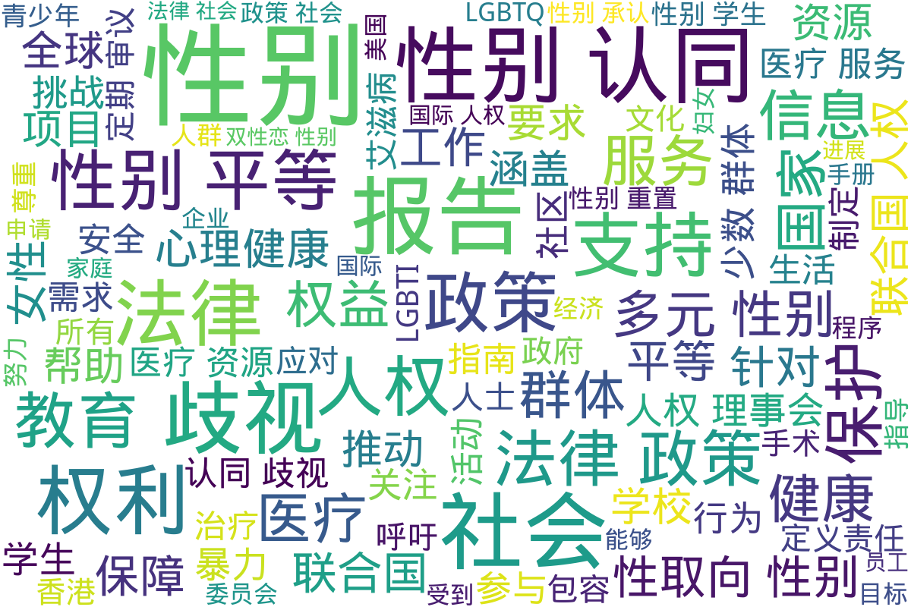

---
search:
  exclude: true
---

# 政府及官方组织文件

本目录收录了与跨性别相关的政府及官方组织文件，包括中国大陆、加拿大、港澳台、美国以及联合国等地区和组织的相关政策和文件。「官方组织」指拥有接近「政府」地位和影响力，但不属于「政府」的国际性组织，在本版块中只指代联合国及其下属机构。这些资料为跨性别群体提供了法律政策、社会环境的背景信息，帮助人们理解不同地区的现状和对跨性别者的支持程度。

标签: `政府文件`, `政策`, `法律`, `跨性别`, `社会环境`, `中国大陆`, `加拿大`, `港澳台`, `美国`, `联合国`

总计 227 篇内容

### 📁 子目录

- [中国大陆](中国大陆) (42 篇内容)
  

内容简介

  目录路径为“./政府及官方组织文件/中国大陆”的档案汇集了一系列与中国大陆的法律法规、政策规范和管理文件有关的内容。这些文件中涉及的主题多样，包括婚姻法在跨性别议题上的适用性、精神卫生管理规范、中国精神卫生法的具体内容、多学科诊疗共识及标准、中国大陆的精神障碍分类与诊断标准、以及公安机关在居民身份证与户籍管理中的操作规范。这些内容揭示了跨性别者在家庭和法律背景下遭遇的复杂挑战，也展示了中国在精神卫生、医疗管理和户籍政策方面的制度演变。一个重要的讨论点是跨性别者在面对婚姻法局限性的故事记录。一位女性发现丈夫未经同意进行了变性手术，引发了对婚姻关系法律地位的质疑，这反映了性别认同对婚姻制度的冲击和法律的局限性。另一份文件，则是公安部关于如何变更公民性别登记的文件，根据手术后的性别变更要求提供法律路径，标志着在中国大陆政策层面变性人的地位变迁。
关于精神卫生管理及法律，文件详细探讨了精神疾病的管理规范和法律条文，强调了提高患者跟踪和服务质量的重要性，明确了精神卫生领域的法律保障框架以及精神健康工作的社会责任。这些文件说明了中国在精神卫生领域的关注和努力提升管理标准及服务水平的国家意图。总览这些档案，可见中国大陆在面对社会多元性别、精神健康和法治完善方面的长期发展和政策变化。
  

- [其他地区](其他地区) (23 篇内容)
  

内容简介

  该目录包含与跨性别政策和法律相关的政府及官方组织文件，旨在为跨性别者提供合法权益方面的指导和支持，特别是在其他地区的实施情况和伴侣制度的适用性。
  

- [加拿大](加拿大) (9 篇内容)
  

内容简介

  本目录收录有关加拿大的政府及官方组织对跨性别者的政策、法律及其相关文件，旨在提供关于跨性别者权益保障、健康医疗服务以及社会支持等方面的官方信息和资源。
  

- [港澳台](港澳台) (29 篇内容)
  

内容简介

  该目录收录了来自香港与多元性别相关的政府及官方文件，其内容涉及跨性别者的权利、法律政策、医疗资源及社会环境记录。在《性别承认咨询文件》的意见书中，关注女性暴力协会提出性别承认应该是一项基本人权，强调跨性别者的选择权应当受到尊重，并详细讨论香港是否应设立性别承认制度。文中提到香港的性别问题并非二元对立，亟需关注性别少数群体的权利。该文件中提出的在法律上保护跨性别者的建议，强调应当设立新法规以确保其权利被充分保障，并提出了对性别认可的多样性的理解。

另一个文件关于2014年婚姻修订条例草案的公听会，记录了针对变性手术及跨性别人士的讨论，揭示了公众对变性手术的误解与关注。袁维昌医生在会上阐述了变性手术的重要性与合理性，同时也讨论了变性人士面临的法律与社会压力。

此外，关于全国大专院校运动会的跨性别学生运动员参与政策，目录中提供了一份政策草案，强调了保障跨性别运动员权益的重要性，主要内容围绕参与资格的标准及保障机制，以确保参与者能够在公平与尊重的环境中参赛。

目录中还包含了匹兹堡警察局与LGBTQIA性少数族群的互动记录，揭示社区对警方的失望及对性工作者和跨性别者权益的迫切关注。同时还有关于性别不安的治疗方法的讨论，探讨心理健康和医疗资源的现状。
该目录还收录了香港性文化学会关于性别承认的公众咨询问答，阐释了性别承认的法律问题，并提供了社会对变性人的接受度的分析，通过这些文件，展示了香港在跨性别法律承认与医疗支持方面的努力与挑战。
  

- [美国](美国) (53 篇内容)
  

内容简介

  本目录收录了来自美国的政府及官方组织关于跨性别相关政策和法律的文件，旨在提供对跨性别者权益和法律保护的官方信息和指南。
  

- [联合国](联合国) (71 篇内容)
  

内容简介

  本目录收录了与联合国相关的官方文件，旨在提供跨性别人士在全球范围内受到的法律保护和人权关注的资讯。这些文件将有助于了解各国在跨性别相关议题上的政策和承诺。
  

### 词云图 { data-search-exclude }

> 本内容为自动生成，请修改 .github/ 目录下的对应脚本或者模板
