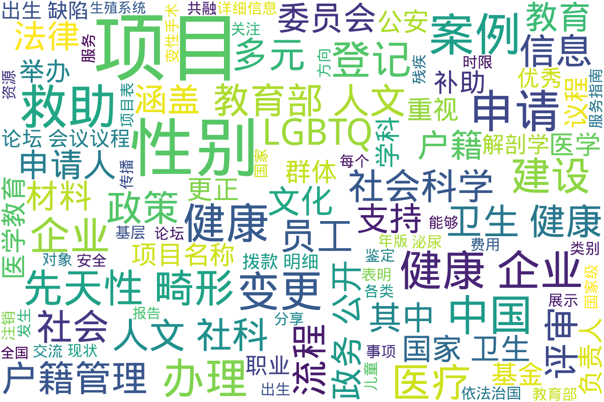

---
search:
  exclude: true
---

# 其他文件

这个目录位于政府及官方组织文件的中国大陆部分，属于其他文件的分类，包含了多份与政府和公共事务相关的文档。这些文件涵盖了各种不同的主题，如科研项目评审结果、社会科学研究拨款细节、促进多元性别与LGBTQ群体交流的论坛会议、医疗救助项目指南、国家级医学教育项目清单、企业健康建设优秀案例，以及有关性别变更服务的指南和户籍管理公开标准目录。\n\n例如，在目录中可以找到2018年度教育部人文社会科学研究项目的评审结果和拨款细节。这类文件详尽地描述了各个科研课题的审核、评估过程，以及政府对这些人文及社会科学研究所给予的财政支持。另一方面，备受关注的2019中国多元与共融论坛会议则提供了丰富的LGBTQ相关主题的探讨，促进多元化表达和跨领域的合作。\n\n此外，目录中还包括国家层面的医学教育计划，展现了各种医学领域的教育内容及其教学安排，这为专业人员的继续教育提供了广泛的学习可能。性别变更办理服务的指南为跨性别人士提供了详细的行政操作流程，确保其在进行合法性别更改时获得准确的信息和支持。同时，户籍管理领域的政务公开标准目录则详细列举了涉及性别变更在内的各类户籍事务的办理流程，为公民提供了透明的政府服务指南。

标签: `政府文件`, `科研项目`, `教育部`, `社会科学`, `LGBTQ`, `跨性别`, `医疗救助`, `医学教育`, `性别变更`, `户籍管理`

总计 8 篇内容

### 📄 文档

#### 2022

[健康企业建设优秀案例报告_国家卫生健康委员会_2022](健康企业建设优秀案例报告_国家卫生健康委员会_2022_page.md)

查看摘要

本文件为《健康企业建设优秀案例报告》，由中华人民共和国国家卫生健康委员会发布，旨在总结和推广健康企业建设的成功经验。文件中详细介绍了全国范围内7715家健康企业的发展情况及评选出的100个优秀案例。这些案例覆盖了多种行业，包括水泥、汽车、食品等领域，所有企业都通过特定的健康管理措施提升了员工的职业健康水平。案例内容包括企业基本情况、健康管理组织、实施策略及其效果分析。不同企业的实践表明，通过建立职业健康管理体系、开展健康活动和改善工作环境，能有效提升员工的幸福感和工作积极性。案例还涉及政府政策的支持、企业的社会责任以及对员工身心健康的重视等方面，为全国范围内推动健康企业创建提供了有效的借鉴和参考。

#### 2021

[PDF_先天性结构畸形救助项目_2021年版_](PDF_先天性结构畸形救助项目_2021年版__page.md)

查看摘要

本文件是《先天性结构畸形救助项目(2021年版)》的概述，旨在加强出生缺陷防治，特别是针对先天性结构畸形所致的残疾问题。这一救助项目自2017年由国家卫生健康委员会启动后，已覆盖全国31个省（区、市）及新疆生产建设兵团。文件详细介绍了项目的背景、救助对象、实施区域、定点医院以及补助标准等内容。

文件指出，先天性结构畸形是以婴儿出生前发生身体结构异常为主要特征的一组出生缺陷疾病，其中包括马蹄内翻、唇腭裂等。这项救助项目为18岁以下的患儿提供医疗费用补助，旨在促进患者及时接受治疗，从而减少儿童残疾的发生。自2019年起，该项目实施了覆盖性的医疗救助，并在2021年进行了优化，例如推行在线预审措施，简化了救助流程，使申请变得更加便利。

文件还列出了项目涉及的74种先天性结构畸形和补助标准，确保不同级别的医疗自费部分能够获得相应的资金支持。同时提供了详细的申请流程和所需资料，以确保申请人能够顺利获取救助。

[PDF_附件_2021年国家级继续医学教育项目表](PDF_附件_2021年国家级继续医学教育项目表_page.md)

查看摘要

该文档为2021年国家级继续医学教育项目表，包含了各种医学相关项目的详细信息，包括学科名称、项目编号、项目名称、申办单位、负责人、举办期限、举办地点以及授予的学分等。根据文档信息，具体项目涵盖了基础机能和多种性腺功能损伤等相关内容，涉及到的学科范围广泛，涵盖了泌尿生殖系统、解剖学、神经解剖学等多个领域。文档详细列出了相关机构及项目负责人联系方式，以及拟招生人数和备注信息，显示了对各类医学继续教育项目的系统化整理和管理。

#### 2019

[2019中国多元与共融论坛会议议程](2019中国多元与共融论坛会议议程_page.md)

查看摘要

《2019中国多元与共融论坛会议议程》文件展示了在2019年于上海举办的LGBTQ相关论坛的详细议程安排，旨在促进多元性别与LGBTQ群体的交流与合作。文中列出了多个重要的议程内容，包括签到时间、开场致辞以及主题演讲，其中‘中国LGBTQ进程与现状’是关键讨论之一，着眼于当前中国LGBTQ群体的发展现状。议程还包含了多个分开讨论的主题，如‘企业如何创意地推进变革’和‘为跨性别和多元性别员工营造友善空间’，表明论坛不仅关注学术讨论，也重视企业界的实践与经验分享。每个环节后还安排了社交午餐和闭幕酒会，以促进与会者之间的相互联系和交流，这反映出对社交互动的高度重视。

#### 2018

[2018教育部人文社会科学研究基金项目评审结果](2018教育部人文社会科学研究基金项目评审结果_page.md)

查看摘要

该文件是2018年度教育部人文社会科学研究规划基金、青年基金、自筹经费项目评审结果的公示文档，其中包含了关于多个项目的评审结果的详细信息。文件中列出了参与评审的各个项目的序号、学科门类、项目名称、项目类别、申请人及其所属学校等信息。具体项目包括诸如“全面依法治国思想的传播环境研究”、“新时代中国共产党意识形态话语能力建设研究”等，反映了当年度科研项目的多样性及其在社会与文化领域的探讨。这些研究涵盖了包括法治、文化安全、国家认同等诸多主题，是对中国各类人文学科和社会科学研究方向的重要总结和指导。

[2018教育部人文社科项目拨款明细](2018教育部人文社科项目拨款明细_page.md)

查看摘要

该文件是关于2018年教育部人文社科一般项目一期经费拨款明细的PDF文档。文件详细列出了教育部批准的多项人文社科项目及其拨款金额，包括项目的批准号、项目名称、项目类别、项目负责人以及依托高校等信息。其中，项目涵盖了多个研究领域，如全面依法治国思想的传播、国家文化安全的历史经验、新时代中国特色社会主义文化建设等，为学术研究提供了资助支持。每个项目都附有具体的拨款金额，反映了教育部对人文社科研究的重视，同时也为未来的研究方向和趋势提供了参考。文档长达108页，内容丰富，适合相关领域的研究人员和学者参考。

#### 时间未知，按收录顺序排列

[性别变更更正办理服务指南](性别变更更正办理服务指南_page.md)

查看摘要

该文件为《性别变更更正办理服务指南》，主要内容包括性别变更更正的适用范围、申请条件、申请材料目录以及办理流程等信息。文件说明适用对象为辖区内的常住户籍人口，并指出申请人因实施变性手术后，要求变更本人户籍登记性别项目的，可以提出申请。申请需向公安派出所提交书面申请和相关证明材料，如公安颁发的性别鉴定证明等，且文件中详细列出了申请所需的材料清单，包括申请人的户口簿、身份证、性别鉴定证明等，准备齐全后可享现场或网上申请服务。办理时限也有所说明，符合条件的申请将即刻处理，且不收取任何费用。

[户籍管理领域基层政务公开标准目录](户籍管理领域基层政务公开标准目录_page.md)

查看摘要

该文件为《户籍管理领域基层政务公开标准目录》，主要详述了中国大陆在户籍管理领域的各项政务公开事项。文件中列出了与户籍登记相关的多个公共事务，包括新生儿出生登记、死亡注销、服役注销、户口迁移、姓名变更及性别变更等，并详细解释了每项业务的受理部门、办理条件、所需材料、办理流程以及办理时限。文件中提到关于变性手术后的性别登记问题，明确指出申请者需提交相关证明材料。这些内容为公民了解他们在户籍管理方面的权利和流程提供了重要参考，尤其是对于关注跨性别群体的事项，文件展示了法律和政策的支持与约束。

### 词云图 { data-search-exclude }

> 本内容为自动生成，请修改 .github/ 目录下的对应脚本或者模板
