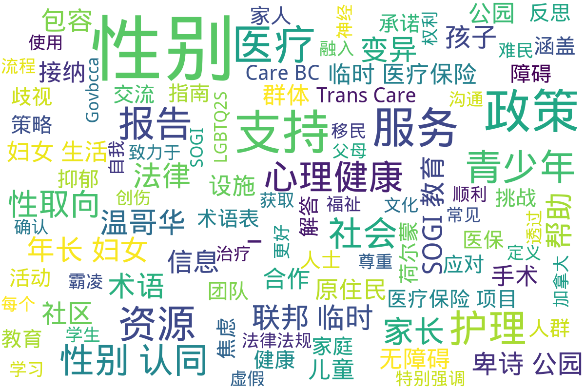

---
search:
  exclude: true
---

# 加拿大

!!! info

    本目录收录有关加拿大的政府及官方组织对跨性别者的政策、法律及其相关文件，旨在提供关于跨性别者权益保障、健康医疗服务以及社会支持等方面的官方信息和资源。

!!! note "📊 统计信息"

    总计内容：9 篇
    标签：`加拿大` `政府文件` `法律政策` `跨性别` `官方组织` `权益保障`

### 📄 文档

<table>
<thead><tr>
<th style="width: 40%" data-sortable="true" data-sort-direction="asc" data-sort-type="text">标题 ▲</th>
<th style="width: 15%" data-sortable="true" data-sort-direction="desc" data-sort-type="year">年份 ▼</th>
<th style="width: 45%">摘要</th>
</tr></thead>
<tbody>
<tr data-name="PDF_心理健康及福祉资源和支持_-_Govbcca" data-year="None" data-date="2024-11-07 20:05:11">
                <td><a href="PDF_心理健康及福祉资源和支持_-_Govbcca_page" class="md-button">PDF_心理健康及福祉资源和支持_-_Govbcca</a></td>
                <td class="year-cell">None</td>
                <td class="description-cell">

                    
该文件为一份关于心理健康及福祉的资源和支...

                    

                        该文件为一份关于心理健康及福祉的资源和支持指南，旨在为儿童和青少年提供相关信息和支持，以应对常见的心理健康挑战。文件内容集中于不同人群（包括LGBTQ2S+人群和原住民群体）所面临的心理健康问题，提供多种资源和服务供青少年及其家长使用。文件中提到的资源包括心理健康服务中心、网络支持、热线服务及应对青少年焦虑和抑郁的具体方法和建议。特定章节详细介绍了心理健康的相关挑战，如焦虑、抑郁和神经多样性等，并提供了应对这些挑战的实用策略。该指南还讨论了饮食和身体活动对心理健康的影响，以及针对那些经历自我伤害和创伤的人所能获得的支持和资源。
                         年份：None
                         收录日期：2024-11-07 20:05:11
                    

                
</td>
            </tr>
<tr data-name="PDF_性取向和性别认同SOGI_事实是什么_-_Govbcca" data-year="None" data-date="2024-11-07 20:04:49">
                <td><a href="PDF_性取向和性别认同SOGI_事实是什么_-_Govbcca_page" class="md-button">PDF_性取向和性别认同SOGI_事实是什么_-_Govbcca</a></td>
                <td class="year-cell">None</td>
                <td class="description-cell">

                    
该文件主要讨论了性取向和性别认同（SOG...

                    

                        该文件主要讨论了性取向和性别认同（SOGI）在教育中的重要性，致力于消除关于SOGI包容教育的虚假信息。文件强调了实施SOGI教育的原因，包括防止霸凌和为学生提供一个包容的学习环境。它详细介绍了SOGI教育的目标是让每个学生都能感受到安全和归属，进而提高他们的学习表现和幸福感。同时，文件中列出了几个常见误解并逐一进行了澄清，比如SOGI教育并不是强迫孩子改变性别，而是创造一个包容的环境来反对任何形式的歧视和霸凌。文件还提到SOGI教育不会剥夺家长了解孩子所学内容的权利，家长仍然可以与教师交流沟通。
                         年份：None
                         收录日期：2024-11-07 20:04:49
                    

                
</td>
            </tr>
<tr data-name="PDF_透过联邦临时医疗保险项目Interim_-_Trans_Care_BC" data-year="2024" data-date="2024-11-07 19:57:50">
                <td><a href="PDF_透过联邦临时医疗保险项目Interim_-_Trans_Care_BC_page" class="md-button">PDF_透过联邦临时医疗保险项目Interim_-_Trans_Care_BC</a></td>
                <td class="year-cell">2024</td>
                <td class="description-cell">

                    
该文件为《透过联邦临时医疗保险项目获取性...

                    

                        该文件为《透过联邦临时医疗保险项目获取性别肯定护理》的指南，介绍了加拿大联邦临时医疗保险项目（IFHP）对新移民、难民和寻求庇护者提供的医疗保障，特别是针对性别肯定医疗的相关内容。文件详细说明了联邦临时医保提供的基本保障服务，包括全科医生和专科医生如何提供荷尔蒙治疗、手术评估和处方荷尔蒙。特别强调了联邦临时医保对性别肯定手术的保障限制，以及申请资格和流程。文件中提及如何通过Trans Care BC获得支持，以及面对可能的医疗费用问题时应采取的步骤，帮助跨性别人士在加拿大顺利获得所需的医疗服务。
                         年份：2024
                         收录日期：2024-11-07 19:57:50
                    

                
</td>
            </tr>
<tr data-name="不列颠哥伦比亚省跨性别护理提供的服务" data-year="None" data-date="2024-11-02 02:45:13">
                <td><a href="不列颠哥伦比亚省跨性别护理提供的服务_page" class="md-button">不列颠哥伦比亚省跨性别护理提供的服务</a></td>
                <td class="year-cell">None</td>
                <td class="description-cell">

                    
该文件详细介绍了不列颠哥伦比亚省的跨性别...

                    

                        该文件详细介绍了不列颠哥伦比亚省的跨性别护理提供的服务，着重于帮助双灵、跨性别以及性别非二元人士获取适合他们的医疗和护理方案。文中提到，该护理导航团队提供多种服务，包括帮助用户寻找健康保健资源，探索各种就医选择和流程，以及提供性别肯定医疗护理的信息。服务对象涵盖了各个年龄段的人群，包括青少年、成人和儿童，以及他们的看护人、伴侣和亲友。文中还指出，服务团队与其他服务人员合作，以推广以就医者为中心的性别肯定护理最佳实践。该文件体现了对提供公平、无障碍护理的承诺，并强调采用“反压迫”与“创伤知情”的方法，以人为本的原则。
                         年份：None
                         收录日期：2024-11-02 02:45:13
                    

                
</td>
            </tr>
<tr data-name="卑诗公园局包容性承诺报告" data-year="None" data-date="2024-11-23 04:23:32">
                <td><a href="卑诗公园局包容性承诺报告_page" class="md-button">卑诗公园局包容性承诺报告</a></td>
                <td class="year-cell">None</td>
                <td class="description-cell">

                    
该文件是卑诗公园局关于包容性承诺的报告，...

                    

                        该文件是卑诗公园局关于包容性承诺的报告，内容旨在展示卑诗省在保护区和公园内所作的努力，确保每个游客都能感到欢迎并能够顺利使用公园设施。文件首先明确了卑诗省内的省级公园和保护区的重要性，以及这些区域的多样性和原住民文化背景。包括政府官员的致辞，强调了包容性和无障碍设施的重要性，以确保所有人，无论身心能力或身份如何，都可以在公园中受到尊重并有意义地进行活动。文件详细列出了卑诗公园局的愿景，包括将包容性原则融入到政策和实践中，强调与社区组织的合作，借此征求反馈并加强对重要议题的意识。同时，本报告还提出了具体措施，例如无障碍设施的建设、数字服务的优化、与社区的合作计划，以及生态系统保护与利用的结合。卑诗公园局正在不断致力于消除各种障碍，确保所有人能享受到自然带来的益处。
                         年份：None
                         收录日期：2024-11-23 04:23:32
                    

                
</td>
            </tr>
<tr data-name="年长妇女生活改善策略报告_2017" data-year="2017" data-date="2024-11-23 05:37:00">
                <td><a href="年长妇女生活改善策略报告_2017_page" class="md-button">年长妇女生活改善策略报告_2017</a></td>
                <td class="year-cell">2017</td>
                <td class="description-cell">

                    
这份报告名为《改善低陆平原年长妇女生活的...

                    

                        这份报告名为《改善低陆平原年长妇女生活的主要法律、政策及服务提供策略》，旨在探讨并提出改善年长妇女生活质素的相关法律及社会政策。从2014年至2016年，通过在温哥华低陆平原的14个咨询活动，研究团队收集了162位年长妇女的经验，值得注意的是，这些妇女中包括了被政治边缘化的群体，如残疾妇女和原住民妇女。报告总结了影响年长妇女生活的主要障碍，包括贫穷、各种形式的歧视、取得医疗和家居支援的难度以及暴力与虐待的经历。
                         年份：2017
                         收录日期：2024-11-23 05:37:00
                    

                
</td>
            </tr>
<tr data-name="性别变异和跨性别青少年父母和家人的疑问解答_-_VSB_BLOGS" data-year="2011" data-date="2024-11-02 02:33:36">
                <td><a href="性别变异和跨性别青少年父母和家人的疑问解答_-_VSB_BLOGS_page" class="md-button">性别变异和跨性别青少年父母和家人的疑问解答_-_VSB_BLOGS</a></td>
                <td class="year-cell">2011</td>
                <td class="description-cell">

                    
该PDF文档为温哥华教育局于2011年发...

                    

                        该PDF文档为温哥华教育局于2011年发布的《性别变异和跨性别青少年父母和家人的疑问解答》小册子，旨在为跨性别和性别变异青少年的家长及家庭成员提供支持和指导。文件内容包括如何识别性别变异儿童的行为、家长如何支持孩子发展健康自我形象、如何处理社区与家族的不同观点和接纳等多方面的信息。文中提供了对常见问题的解答，例如如何处理孩子的性别认同、该如何给与积极支持、家人如何在社会上维护跨性别孩子的权利等。小册子还特别强调了家庭接纳的重要性，以及社会对性别变异青少年的期望与压力。文件还包含一些词汇表，帮助家长理解相关的性别和性倾向术语，以便于更好地进行交流和沟通。文中还推荐了一些相关支持资源，帮助家庭找到必要的外部支持。
                         年份：2011
                         收录日期：2024-11-02 02:33:36
                    

                
</td>
            </tr>
<tr data-name="术语表_–_性取向、性别认同与表达以及性别特征" data-year="None" data-date="2024-11-02 02:37:56">
                <td><a href="术语表_–_性取向、性别认同与表达以及性别特征_page" class="md-button">术语表_–_性取向、性别认同与表达以及性别特征</a></td>
                <td class="year-cell">None</td>
                <td class="description-cell">

                    
该文件是一个跨性别术语表，涵盖了与性取向...

                    

                        该文件是一个跨性别术语表，涵盖了与性取向、性别认同、性别表达及性别特征相关的多个术语。内容包括这些术语的英文、法文和中文对照，提供了清晰的定义和术语解释，便利于跨性别人士及其支持者更好地理解和交流。例如，术语如 "性别焦虑症"、"性别确认手术"、"无性恋"、"双性人" 等都有详尽的定义。此资料旨在增加对性别及性取向多样性的认识与理解，帮助推广对性别少数群体的尊重与包容。术语表的内容对于从事相关领域研究的学者、法律及社工专业人士以及普通公众都有重要的参考价值，为相关政策的制订与实施提供了基础。
                         年份：None
                         收录日期：2024-11-02 02:37:56
                    

                
</td>
            </tr>
<tr data-name="温哥华跨性别政策反思报告" data-year="None" data-date="2024-11-23 06:26:53">
                <td><a href="温哥华跨性别政策反思报告_page" class="md-button">温哥华跨性别政策反思报告</a></td>
                <td class="year-cell">None</td>
                <td class="description-cell">

                    
本报告是对温哥华市跨性别政策的反思与评估...

                    

                        本报告是对温哥华市跨性别政策的反思与评估，旨在分析当前政策的实施效果及其对跨性别群体的影响。文件详细列出了温哥华市在实践中遇到的问题，包括政策实施的不足之处、跨性别个体在获得医疗和社会支持方面的障碍，以及政策如何未能全面反映跨性别者的实际需要。报告中还涵盖了对相关法律法规的分析，以及如何在政策制定中融入跨性别者的意见和建议。通过对各项措施的实证研究，报告为改善跨性别者的生活状况、提升政策的有效性提供了切实的建议和对策。
                         年份：None
                         收录日期：2024-11-23 06:26:53
                    

                
</td>
            </tr>
</tbody>
</table>

## 📊 词云图 { data-search-exclude }

 

=== "最多访问"

    * 3 访问 [术语表_–_性取向、性别认同与表达以及性别特征](/政府及官方组织文件/加拿大/术语表_–_性取向、性别认同与表达以及性别特征_page)
    * 1 访问 [温哥华跨性别政策反思报告](/政府及官方组织文件/加拿大/温哥华跨性别政策反思报告_page)

!!! note "自动生成说明"
    目录及摘要为自动生成，仅供索引和参考，请修改 .github/ 目录下的对应脚本、模板或对应文件以更正。
