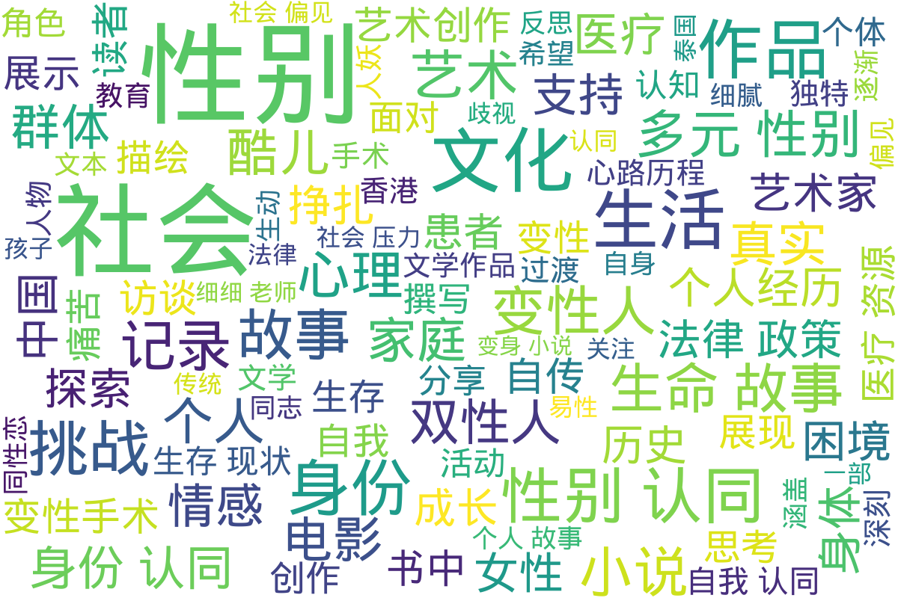

---
search:
  exclude: true
---

# 文学作品和艺术创作

本部分收录一切形式的跨儿文学艺术创作。无论是发布于互联网某个阴暗角落的「变性人」自传，还是形式晦涩、发人深省的诗歌电影，均可收录在本版块。，涵盖了多种形式的表达，包括小说、漫画、纪实作品、自传和诗歌等。

标签: `跨性别`, `文学作品`, `艺术创作`, `自传`, `小说`, `漫画`, `纪实作品`, `诗歌`

总计 192 篇内容

### 📁 子目录

- [其他](其他) (8 篇内容)
- [图像](图像) (2 篇内容)
- [小说](小说) (94 篇内容)
- [纪实作品](纪实作品) (24 篇内容)
- [自传](自传) (56 篇内容)
- [诗歌](诗歌) (3 篇内容)
- [音频影像](音频影像) (5 篇内容)

### 词云图

> 本内容为自动生成，请修改 .github/ 目录下的对应脚本或者模板
