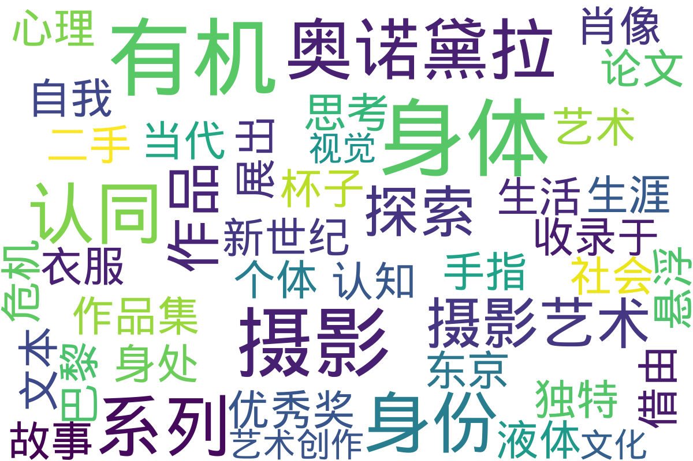

---
search:
  exclude: true
---

# 图片

该目录收录了与跨性别主题相关的摄影、绘画等图片作品。

标签: `跨性别`, `艺术`, `图片`, `创作`, `身份表达`

总计 2 篇内容

### 📁 子目录

- [限制级内容](限制级内容) (1 篇内容)
  

内容简介

  本目录收录了限制级内容的跨性别相关图像，特别聚焦于表达和反映跨性别者的身体表现与身份认同。
  

### 📄 文档

#### 2014

[PDF_有机奥诺黛拉](PDF_有机奥诺黛拉_page.md)

查看摘要

此文件为有机·奥诺黛拉的摄影作品集及其相关论文，收录于‘11根手指’系列的第24期，主要探讨有机·奥诺黛拉的摄影艺术，尤其是她对身体性和身份认同的深入思考。文中详细介绍了有机的艺术生涯，尤其是其在1991年获得摄影新世纪优秀奖后，如何借由独特的表现方式探索摄影、认知和身体性的关系。文本提到有机如何通过摄影呈现身处其心理状态的身体，以及对自我身体意识的探索。作品集中包含她在巴黎和东京展出的多个系列作品，包括《液体与杯子》、《二手衣服的肖像》和《鸟》等，并分析了这些系列如何反映出个体在当代社会中的悬浮及身份认同危机。

### 词云图 { data-search-exclude }

> 目录及摘要为自动生成，仅供索引和参考，请修改 .github/ 目录下的对应脚本、模板或对应文件以更正。
