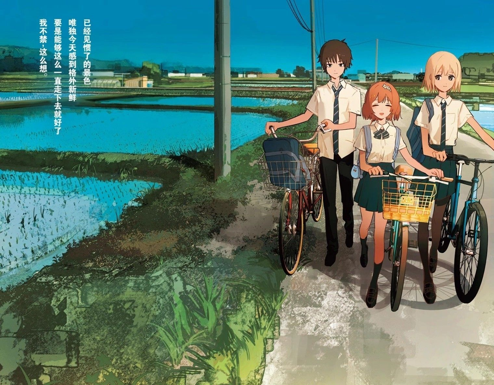
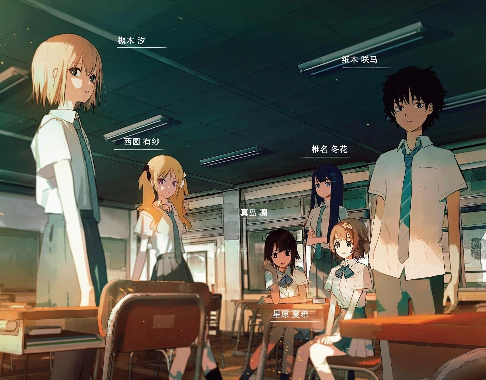
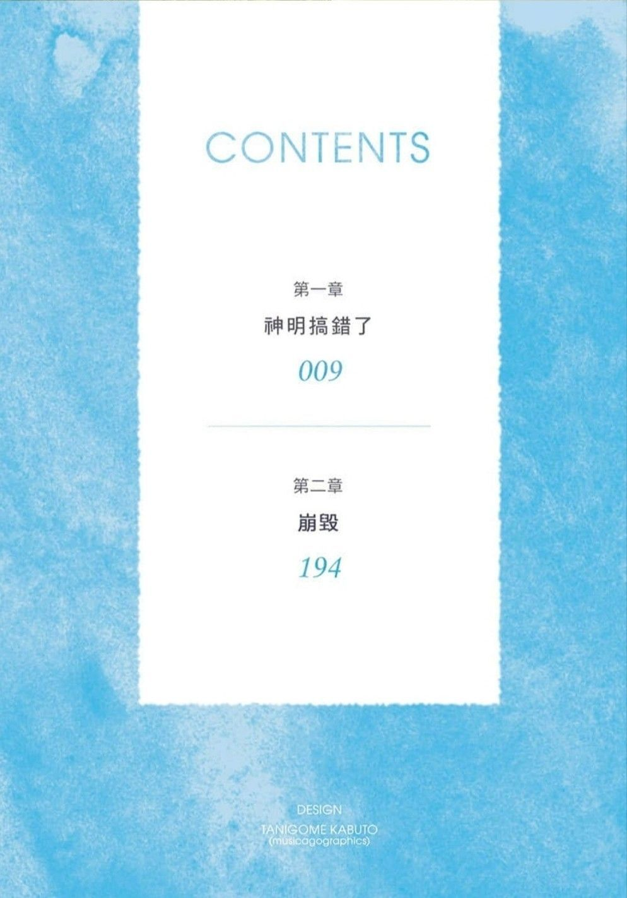
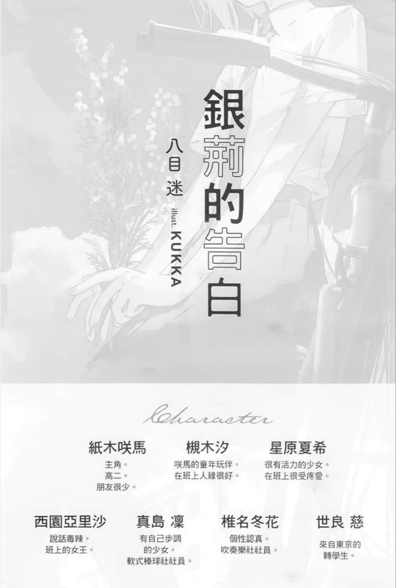
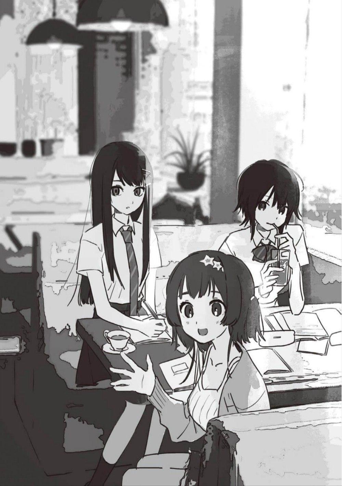

# 第一卷

这一目录包含了《银荆的告白》第一卷的插画，这部作品通过生动的图像和故事情节，展现了跨性别群体的情感与生活体验。这些插画不仅丰富了小说的叙事，也为读者提供了深入理解角色内心世界的可能。

总计 18 篇内容

### 🖼️ 图片

[Image_1720745829699](Image_1720745829699.jpg)

[Image_1720745847670](Image_1720745847670.jpg)

[Image_1720745849415](Image_1720745849415.jpg)

[Image_1720745851154](Image_1720745851154.jpg)

[Image_1720745852727](Image_1720745852727.jpg)

[Image_1720745856090](Image_1720745856090.jpg)

[Image_1720745860370](Image_1720745860370.jpg)

[Image_1720745866484](Image_1720745866484.jpg)

[Image_1720745870695](Image_1720745870695.jpg)

[Image_1720745872383](Image_1720745872383.jpg)

[Image_1720745873960](Image_1720745873960.jpg)

[Image_1720745875465](Image_1720745875465.jpg)

[Image_1720745877020](Image_1720745877020.jpg)

[Image_1720745878662](Image_1720745878662.jpg)

[Image_1720745880176](Image_1720745880176.jpg)

[Image_1720745881744](Image_1720745881744.jpg)

[Image_1720745883141](Image_1720745883141.jpg)

[Image_1720745885103](Image_1720745885103.jpg)

> 本内容为自动生成，请修改 .github/ 目录下的对应脚本或者模板
