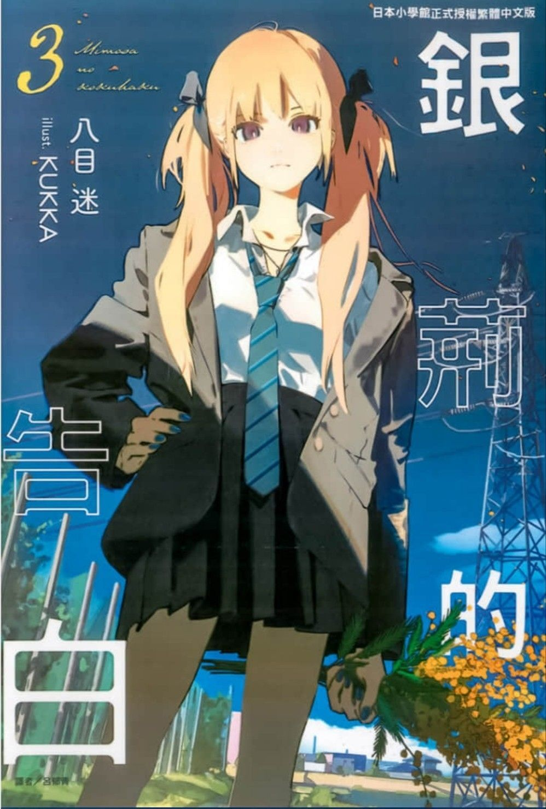
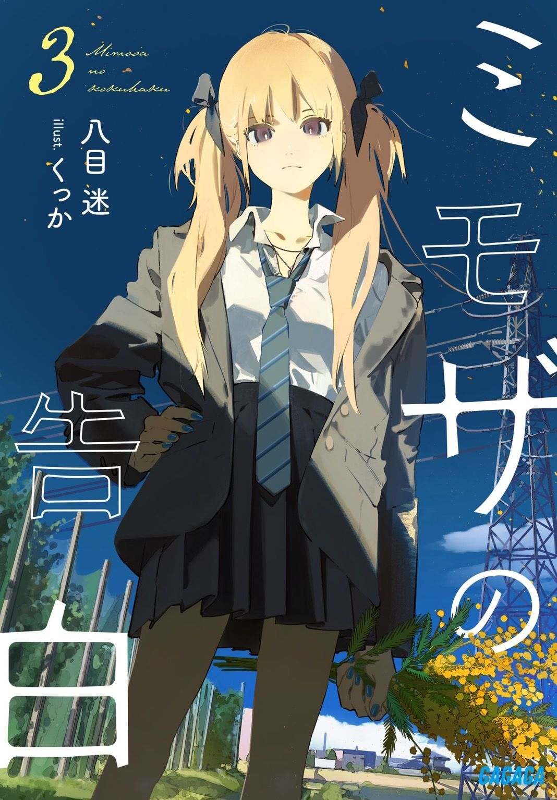
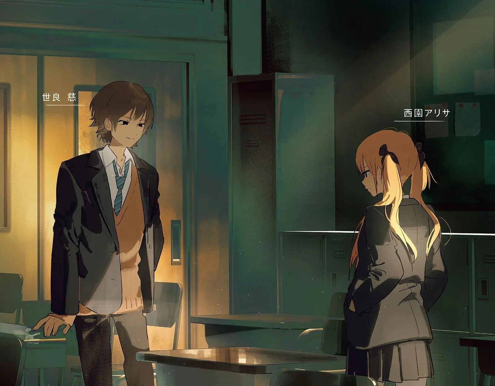
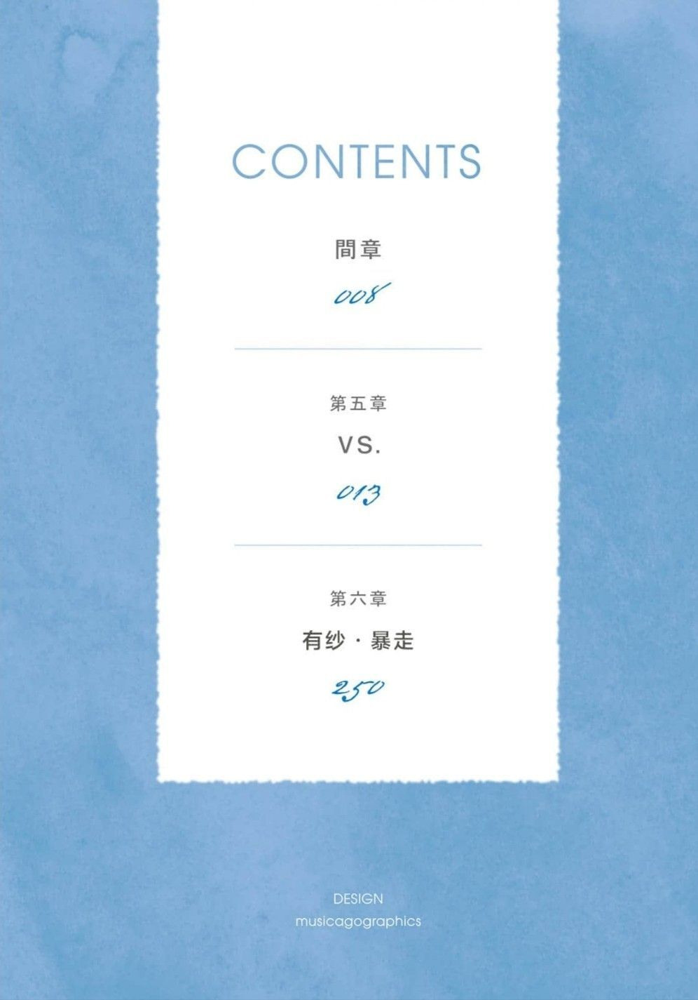
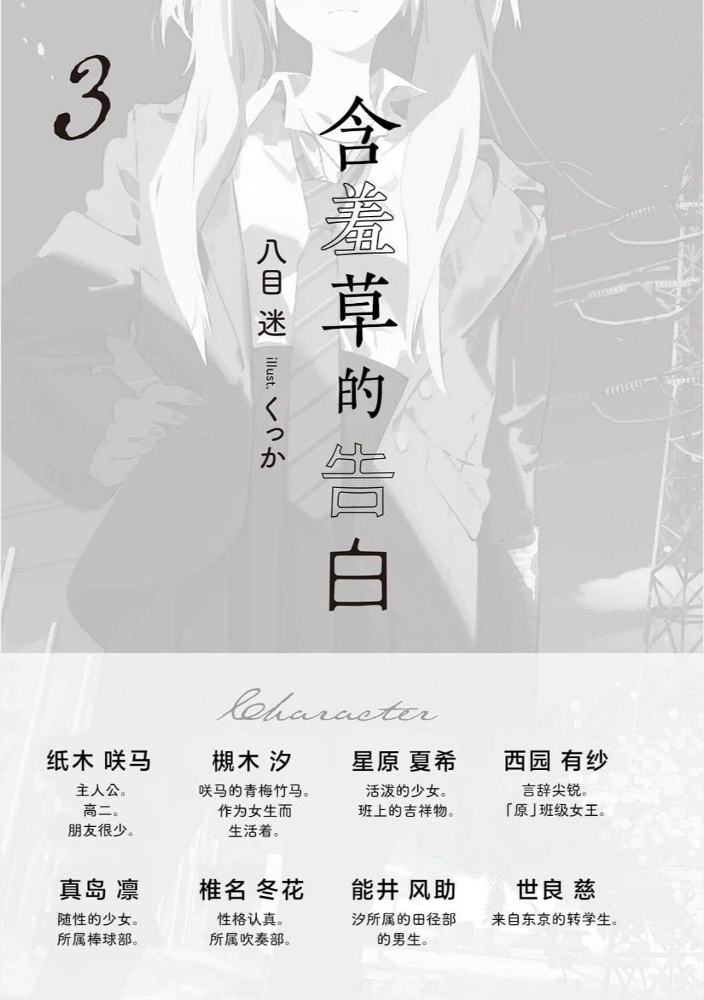
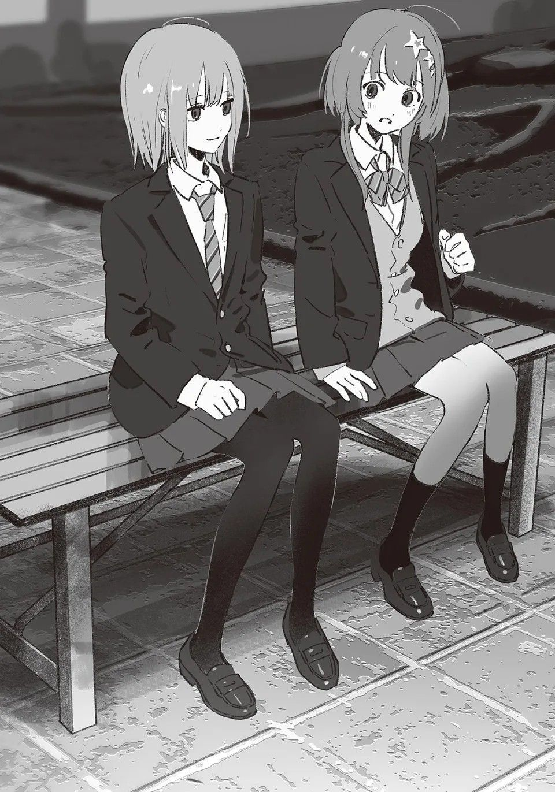

---
search:
  exclude: true
---

# 第三卷

本目录收录了《银荆的告白》第三卷的插画作品，展现了跨性别主题在文学艺术创作中的表达。插画作品通过艺术形式传递了生存体验与情感，鼓励公众对跨性别群体的理解与尊重。

标签: `文学作品`, `艺术创作`, `插画`, `跨性别主题`, `情感表达`

总计 16 篇内容

### 🖼️ 图片

#### 时间未知，按收录顺序排列

> 本内容为自动生成，请修改 .github/ 目录下的对应脚本或者模板
