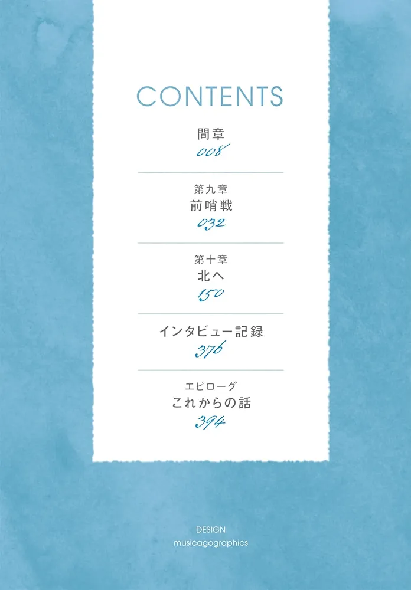

---
search:
  exclude: true
---

# 第五卷

!!! info

    此目录包含《银荆的告白》第五卷的插画，展现了小说中的角色与情节，强调了跨性别主题的艺术表现和文学创作。

!!! note "📊 统计信息"

    总计内容：13 篇
    标签：`文学艺术` `跨性别小说` `插画` `艺术创作` `《银荆的告白》`

### 🖼️ 图片

<table>
<thead><tr>
<th style="width: 40%" data-sortable="true" data-sort-direction="asc" data-sort-type="text">标题 ▲</th>
<th style="width: 15%" data-sortable="true" data-sort-direction="desc" data-sort-type="year">年份 ▼</th>
<th style="width: 45%">摘要</th>
</tr></thead>
<tbody>
<tr class="image-row">
                <td colspan="3">
                    

                        
                        
4c58523ca3616ffd

                    

                </td>
            </tr>
<tr class="image-row">
                <td colspan="3">
                    

                        
                        
9745ac2f12b49057

                    

                </td>
            </tr>
<tr class="image-row">
                <td colspan="3">
                    

                        
                        
276264dd52cf63c0-1

                    

                </td>
            </tr>
<tr class="image-row">
                <td colspan="3">
                    

                        
                        
20240702_145140

                    

                </td>
            </tr>
<tr class="image-row">
                <td colspan="3">
                    

                        
                        
20240702_145155

                    

                </td>
            </tr>
<tr class="image-row">
                <td colspan="3">
                    

                        
                        
20240702_145215

                    

                </td>
            </tr>
<tr class="image-row">
                <td colspan="3">
                    

                        
                        
20240702_145221

                    

                </td>
            </tr>
<tr class="image-row">
                <td colspan="3">
                    

                        
                        
20240702_145228

                    

                </td>
            </tr>
<tr class="image-row">
                <td colspan="3">
                    

                        
                        
20240702_145236

                    

                </td>
            </tr>
<tr class="image-row">
                <td colspan="3">
                    

                        
                        
20240702_145258

                    

                </td>
            </tr>
<tr class="image-row">
                <td colspan="3">
                    

                        
                        
c3f76cae49fcbef7

                    

                </td>
            </tr>
<tr class="image-row">
                <td colspan="3">
                    

                        
                        
c9993f4b162ded53-1

                    

                </td>
            </tr>
<tr class="image-row">
                <td colspan="3">
                    

                        
                        
Image_1720746194767

                    

                </td>
            </tr>
</tbody>
</table>

 

!!! note "自动生成说明"
    目录及摘要为自动生成，仅供索引和参考，请修改 .github/ 目录下的对应脚本、模板或对应文件以更正。
