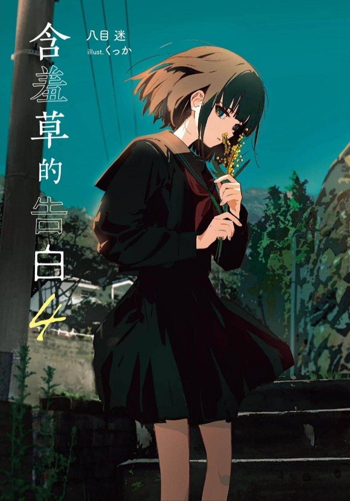
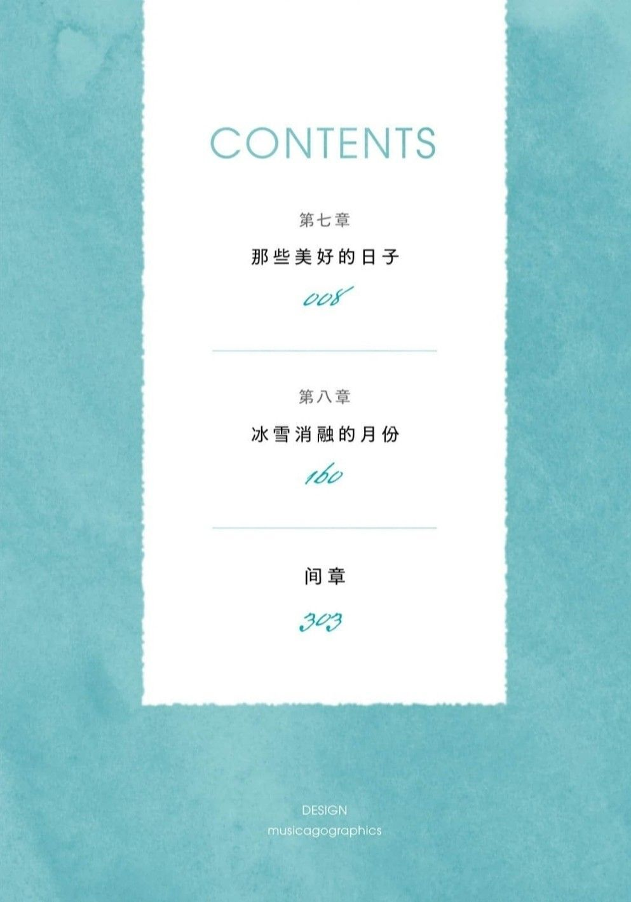
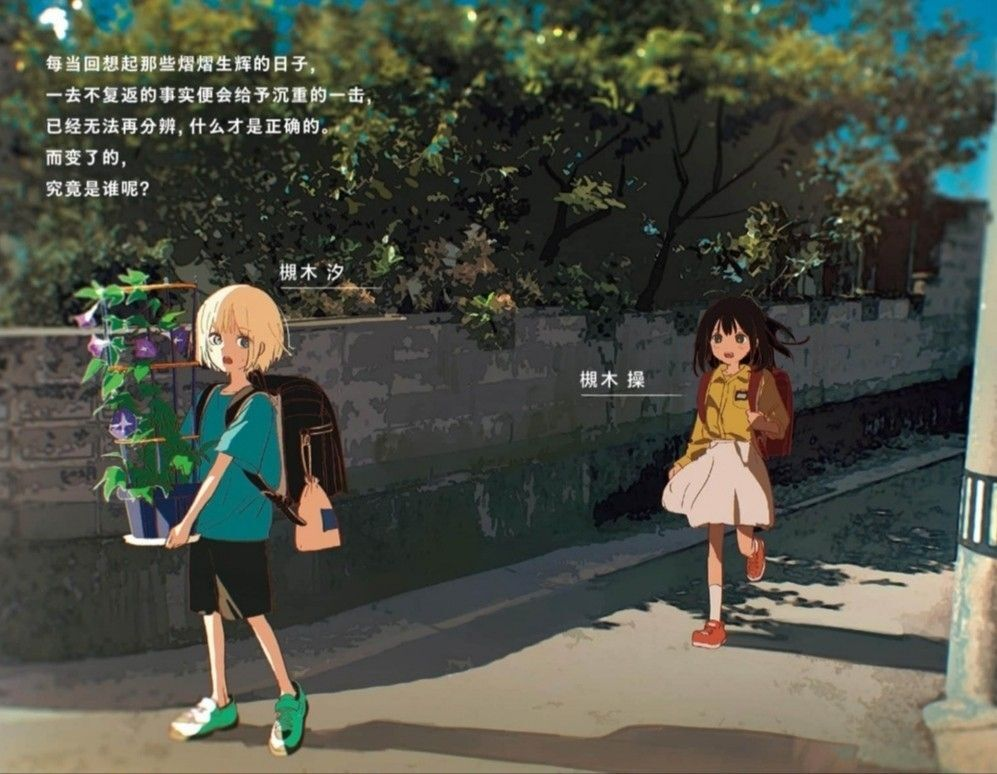
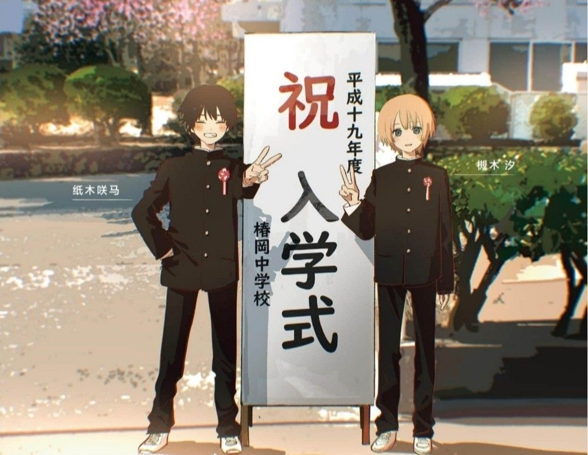
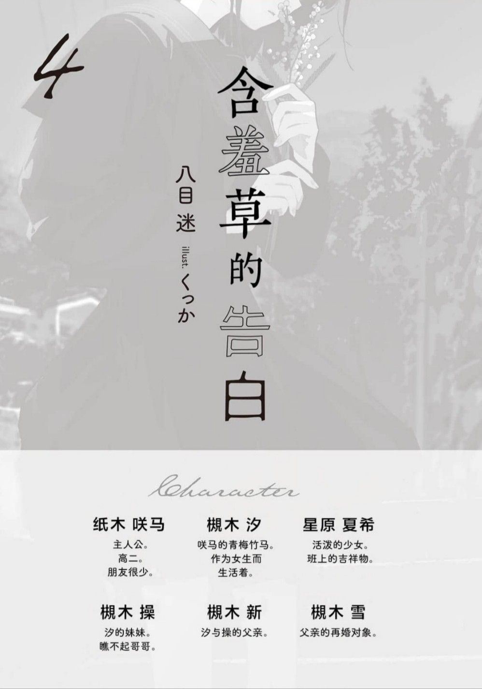

---
search:
  exclude: true
---

# 第四卷

本目录收录了《银荆的告白》第四卷的插画作品，展示了跨性别主题下的文学艺术创作，体现了跨性别群体的情感与身份探索。

标签: `跨性别`, `文学`, `艺术`, `插画`, `银荆的告白`, `小说`, `情感表达`

总计 15 篇内容

### 🖼️ 图片

#### 时间未知，按收录顺序排列

> 本内容为自动生成，请修改 .github/ 目录下的对应脚本或者模板
