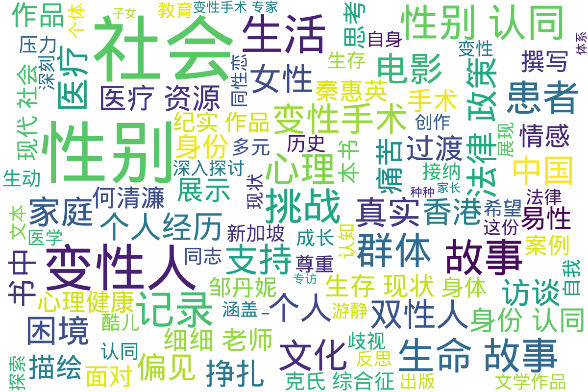

---
search:
  exclude: true
---

# 纪实作品

该目录收录与跨性别相关的纪实作品，展现跨性别者的真实生活与经历。这些作品不仅反映了个人故事，还呈现了对于社会现象的深刻洞察，包括对身份认同、过渡过程及社会接受度等话题的探索。

标签: `跨性别`, `纪实文学`, `社会现象`, `身份认同`, `真实故事`

总计 24 篇内容

### 📄 文档

#### 2023

[潘柏林,_刘烨,_韩萌,_陈冰锐_走出性别困境：“跨性别”与“性别焦虑”的医疗援助_上海科学技术文献出版社_2023](潘柏林,_刘烨,_韩萌,_陈冰锐_走出性别困境：“跨性别”与“性别焦虑”的医疗援助_上海科学技术文献出版社_2023_page.md)

查看摘要

这是一部由潘柏林等人撰写的综合性医疗著作，主要聚焦于跨性别者在面对性别焦虑时所需的医疗支持和服务。书中详细论述了跨性别者的心理、生理、生存现状和法律政策，强调了医疗支持对他们的重要性，并介绍了跨性别医疗的流程和所面临的挑战。特别是对跨性别青少年的青春期抑制治疗，作者指出其能够暂时缓解性别焦虑，并给予青少年必要的探索时间。此外，书中还涉及了如何在家庭和社会环境中接纳跨性别者，以及家长需要如何理解和支持他们的孩子。这本书不仅为医务人员提供了专业知识，也为跨性别者及其家庭提供了必要的心理支持和理解。

#### 2021

[坪上村传_彭东明_2021年1月22日](坪上村传_彭东明_2021年1月22日_page.md)

查看摘要

《坪上村传》是作家彭东明于2021年1月22日出版的长篇小说，该小说通过传记的方式描绘一个村庄的历史与现状，意在为本土文化的传承与发扬贡献力量。彭东明在书中记录了村庄中普通人如村支书老万、长贵及他的六个孩子等人的生活故事，体现了他们在现代转型社会中所承受的种种困境与挑战。通过真实生活的细腻描绘，作者不仅关照了历史，也反映了乡村教育扶贫的现状与困境，让读者感受到乡村教育对未来的重要性。小说在结构上包含了八个篇章，总字数达26万，字里行间透露着彭东明对农村教育以及农耕文明的深刻思考与细腻观察。此外，该书还交织了诸多乡村故事与文化资源，展示出对当地历史及人文关怀的深刻理解。

#### 2018

[PDF_專訪雙性人細細老師](PDF_專訪雙性人細細老師_page.md)

查看摘要

本文件为对双性人细细老师的专访，详细记录了她的成长经历、身份认同及面临的挑战。细细老师（本名陆月明）从小到大经历了多次医疗手术，因医生误判断其性别，导致她在儿童时期便被迫接受了一系列身体上的改造。在访谈中，她描述了自己出生时医生无法判断性别的情形，以及在接受手术过程中所经历的痛苦与挣扎。她指出，香港的医疗系统对双性人缺乏理解，常将其视为病理化的个体，强迫其选择性别，这使得双性人的人生充满困惑与痛苦。尽管经历重重困难，细细老师坚韧不拔，现任注册中医、注册社工及临床催眠治疗师，她还积极参与双性人支援组织的工作，帮助他人并呼吁社会对双性人群体的理解和接受。访谈中，她表达了希望双性人能得到尊重和基本人权的愿望，向社会传达双性人并非病态特殊。如细细老师所言：“与他人的目光与朋辈欺凌确是很难受，但我希望仍在暗处的双性人知道他们并不孤单。”

#### 2015

[PDF_醫生說是陰莖其實是一條肉_專訪雙性人細細老師](PDF_醫生說是陰莖其實是一條肉_專訪雙性人細細老師_page.md)

查看摘要

该文件为《立场新闻》的一篇专访，采访对象为双性人细细老师，详细记录了她的生命故事与过渡经历。细细老师在访谈中分享了自己出生时的性别不确定性，以及如何被社会和医疗体系强迫接受手术，以符合传统的性别角色。她描述了自己在医治过程中遭遇的痛苦与困扰，并坦言自己身体的真实状况与身份认同的挣扎。在她的故事中，双性人在医疗、家庭及社会中面临的困难一一浮现。细细老师还指出，尽管她经历了许多手术，仍然发现自己体内有未发育的子宫，进一步揭示了社会对双性人群体的忽视与偏见。她的经历不仅反映了个人的困境，同时也触及了社会政策对双性人的歧视和缺乏认可。细细老师在访谈中强调了爱和接纳的重要性，并倡导社会应当对双性人及性别多样性有更深入的理解与尊重。

#### 2013

[KS_故事-_克氏综合征](KS_故事-_克氏综合征_page.md)

查看摘要

本书《克氏综合征的故事》是一份关于克氏综合征（Klinefelter Syndrome，KS）患者及其家属的详尽信息指南。由Iain W McKinlay编纂的这本书为克氏综合征患者、家属、医疗工作者和公众提供了对该病症的基础知识、症状表现、影响、及医学干预的全面介绍。内容涵盖克氏综合征的遗传机制、临床表现、心理影响、医疗资源、患者故事、研究进展等，甚至包括对克氏综合征的社会认知和法律政策等方面的探讨。书中强调，克氏综合征患者并不孤单，号召公众关注与支持这一特殊群体。同时，书中还穿插着来自医学专家的观点与建议，以及志愿者们的努力与奉献。通过详细的讨论，读者可以了解到患者往往面临的生理和心理挑战，以及应对这些挑战的可能途径。此外，更有助于克氏综合征患者及其家庭了解到如何在生活中寻找支持和信息的资源。

#### 2009

[生命故事与现代社会探讨_书季_张小娜_2009](生命故事与现代社会探讨_书季_张小娜_2009_page.md)

查看摘要

这份文件是由张小娜撰写的，标题为《生命故事与现代社会探讨》，发表于2009年，属于文学作品和艺术创作范畴。文件内容涵盖了生命故事、个人经历以及与现代社会互动的思考，逐渐阐述了在现代社会中面临的多元性别挑战和生活体验。文章中引用了各种文化与思想，对跨性别及多元性别问题展开了深入探讨，涉及了个人感受与社会环境的碰撞，例如通过生活细节描绘了个体情感与社会认知之间的关系。此外，记录了一些对话和故事片段，反映了在现代社会中生存的复杂性，充满了对生活哲理的思考和个人对多元性的承认。

#### 2007

[Les+双月刊_2007年5月_果米的苦乐生活](Les+双月刊_2007年5月_果米的苦乐生活_page.md)

查看摘要

该文件为《Les+双月刊》2007年5月刊的PDF文档，主要探讨了与女性同性恋（拉拉）、跨性别及多元性别相关的生活、情感与社会活动。内容涵盖了多个主题，包括人物访谈、社会运动、文化活动和相关法律政策等，旨在记录女性同性恋者的生活状态与挑战。该期刊特定地介绍了参与《Les+》工作的成员果米的个人经历，包括她在杂志发放中面临的艰辛与快乐，努力提高女性同性恋者的可见性和团体凝聚力。文章提到从网络生成的拉拉社群如何逐渐发展成为一个支持与分享的空间，并强调了在社会压力下同性恋者所遭受的精神困扰与旁观者的恐同心理。通过访聊与个人叙述，体现了拉拉群体的多样性与他们对于社会认可与爱情的向往。

#### 2005

[纠正上帝的错误_“中国变性手术之父”何清濂的非常记忆_吴兴人_2005_上海文艺出版社](纠正上帝的错误_“中国变性手术之父”何清濂的非常记忆_吴兴人_2005_上海文艺出版社_page.md)

查看摘要

该文件为《纠正上帝的错误：“中国变性手术之父”何清濂的非常记忆》，由吴兴人于2005年出版，隶属于上海文艺出版社。内容涉及了何清濂医生的个人经历和在变性手术领域的贡献，生动地记录了变性人群体在中国所面临的挑战与困境。书中以何清濂的视角，揭示了医疗界如何看待跨性别者的身体和身份，回顾了多年来的医患关系，以及他在推动相关医疗技术和法律政策方面所做的努力。作品还结合社会背景、个人故事和真实案例，向读者展示了跨性别者的生存现状和内心挣扎，是一部重要的文献和真实记录，值得关注和反思。

#### 2002

[阴阳大裂变——变性人的故事_杨昆_健康生活_2002](阴阳大裂变——变性人的故事_杨昆_健康生活_2002_page.md)

查看摘要

《阴阳大裂变——变性人的故事》是杨昆在2002年撰写的一部纪实作品，探讨了变性人群体的生活经历与心理状态。文本通过真实的访谈和案例，展现了变性人在社会中面临的挑战与困境，包括身份认同、情感关系以及社会接纳度等方面的议题。作者通过生动的故事，揭示了变性人如何在传统观念与现代社会之间找到自己的位置，展现出他们在过渡过程中所经历的痛苦与成长。这部作品旨在提高社会对跨性别群体的理解与尊重，同时也是对相关法律政策不完善情况下，生命故事与医疗资源的真实记录。

#### 1998

[蝶变_一个变性丽人的心灵纪实_隋易_1998_内蒙古人民出版社](蝶变_一个变性丽人的心灵纪实_隋易_1998_内蒙古人民出版社_page.md)

查看摘要

本文件为纪实作品《蝶变：一个变性丽人的心灵纪实》，由隋易撰写，出版于1998年，由内蒙古人民出版社出版。该书详细记录了一位跨性别女性的生命故事与心灵变化，描绘了她在性别认同过渡过程中的挣扎与成长。书中通过真实的生活记录，展示了跨性别者在家庭、社会以及自身内心深处所面临的挑战与困境，展现了强烈的个体性与情感深度。隋易通过如诗的语言生动地描绘了主人公的心路历程和对自我的探索，提供了对跨性别议题的深入思考与理解，尤其是女性身份的重构以及社会对这一身份的认知偏差。本书不仅是对个人经历的记录，也是对跨性别群体共同经历与生存现状的反思与呼吁。

#### 1996

[中国“变性人”现象_方刚_1996_广州出版社](中国“变性人”现象_方刚_1996_广州出版社_page.md)

查看摘要

本文件是由方刚撰写，出版于1996年的《变性人现象》一书，主要探讨了中国的变性人群体及其社会处境。文中详细记录了跨性别者的生命故事和过渡经历，揭示了他们在社会、家庭及医疗体系中所面临的挑战与困境。方刚通过对个人案例的引用，展示了变性人如何寻求自我认同，以及在法律和医疗资源方面存在的不足。此外，书中对变性人的社会认知进行了反思，强调社会对性别认同的理解和接受程度对跨性别者生存状况的重要影响。这本书不仅是对当时中国变性人现状的深刻记录，也为后续的学术研究和社会讨论提供了宝贵的第一手资料。

#### 1992

[一个精神病医生的手记_-_钟健夫_-_1992](一个精神病医生的手记_-_钟健夫_-_1992_page.md)

查看摘要

《一个精神病医生的手记》是一本深入探讨精神疾病与性别身份的书籍，由精神病医生钟健夫所著。本书共分为九个章节，涵盖从医院案例到文化背景的多个方面，包括性别认同、性行为的多样性以及精神病患者的真实经历。书中提到了一些令人深思的议题，例如对女乒乓球员的性错位的分析，以及对自认为是女性的男性的描述。

该书详细介绍了患者在精神病院的生活，并对杀人犯罪案例进行探讨，揭示了心理健康与社会规范之间的复杂关系。通过这些故事，作者不仅讲述了患者的痛苦经历，还反映出社会对精神疾病和性别多样性的不理解与偏见，展示了这一领域的法律与道德困境。

书中的附录部分也提供了有关精神病学历史及相关研究的参考资料，使得这一素材对学者、研究者及公众都有很高的参考价值。

#### 时间未知，按收录顺序排列

[跨越兩代的性別鴻溝](跨越兩代的性別鴻溝_page.md)

查看摘要

该文件名为《跨越兩代的性別鴻溝》，是一本针对跨性别者及其家庭关系的纪实性作品，深刻探讨了跨性别子女和父母之间的沟通障碍及情感认知。书中通过问卷调查的形式，记录了数十位跨性别子女及其家长的亲身经历与心路历程，内容涵盖他们对性别认同的思考、对过渡过程的应对及家庭关系的影响。文中不仅探讨了子女如何面对自身性别身份的挣扎，也呈现了父母对性别认同的理解与接受过程的挑战。书中多次提到跨性别子女希望能得到更多的理解与支持，同时也希望家长能够耐心倾听、信任和尊重他们的感受。记录中的一句话“期待踏上蛻变之路的同時，卻往往被父母的不理解和否定冲击得七零八落”，反映出许多跨性别者在获得自我认同过程中的困境与痛苦。总体而言，这本书旨在促进跨性别者与家长之间的相互理解和尊重，帮助社会更好地认识和关心跨性别人士的心理需求。

[PDF_酷儿城市在中国_电影人专访](PDF_酷儿城市在中国_电影人专访_page.md)

查看摘要

该文件名为《酷儿城市在中国：电影人专访》，是关于中国电影人如何在酷儿文化中探索和表达自身身份的纪实作品。文中通过对多位电影人的深入访谈，揭示了他们在创作过程中的思想历程以及面对社会偏见时的挑战与坚持。作品中涉及了跨性别和酷儿群体在中国社会中的生存现状，讲述了这些电影人如何通过艺术来发声和影响社会对性别多样性的理解。

文中有诸如“我的电影不仅是个人的故事，更是整个群体的声音”的表述，展现了电影人在创作中体现的使命感。这部作品不仅描绘了各位电影人的创作经历，也反映了他们对性别认同与社会接受度之间矛盾的深刻思考。

[捕捉香港酷儿地景中的女性访谈_马兰清著](捕捉香港酷儿地景中的女性访谈_马兰清著_page.md)

查看摘要

该文件是对香港女性电影创作者游静的访谈作品，主要探讨她的影片《好郁》的创作背景及影响。游静的《好郁》是第一部从女性主义视角出发，聚焦于香港女同性恋生活的叙事电影。在访谈中，游静分享了她的电影制作经历，包括她如何从英国教育体系中受到影响，如何发现自己的性取向，以及面对电影行业中存在的性别与性取向的偏见。她也谈及了在影片制作中面临的挑战，如审查制度对作品自由表达的压制，以及香港社会对同性恋议题的接受程度与变化。游静强调了电影不仅是个人创作，也是对社会环境的反思，展示了在一个空间狭小且充满矛盾的城市中，女性之间情感交流和身份认同的重要性。访谈清楚地描绘出游静如何通过自己的作品探索历史、文化和阶级关系，特别是在香港的社会脉络中展现LGBTQ群体的真实经历與生存状况。

[一个变性手术专家的手记](一个变性手术专家的手记_page.md)

查看摘要

本文件为《一个变性手术专家的手记》，由著名变性手术专家何清旅撰写，详细描述了变性手术的医疗过程与社会反响。该文通过记录多位易性癖患者的真实故事，揭示了他们在性别认同上的痛苦经历与追求变性的决心。内容涉及易性癖的医学定义、手术实践的伦理考量，以及手术对患者生活的深远影响。其中，专家亲历的多个手术案例，体现了变性手术在中国的发展历程与挑战。文中还提及了患者们在求医过程中的心理挣扎，他们的信件暴露出社会对跨性别群体的偏见与误解，呼吁社会对于易性癖患者的理解与同情。

[一个变性手术专家的手记_何清濂](一个变性手术专家的手记_何清濂_page.md)

查看摘要

这篇文档是何清濂作为变性手术专家的个人见证与感悟，记录了他在进行诸多变性手术后，与患者之间的感人故事和心理历程。文件中提及了易性癖与变性人的困扰，以及社会对他们的偏见和误解。何清濂详细描述了第一位接受手术的变性人秦惠荣的经历，并透过法律和医学的视角探讨了变性手术的复杂性和必要性。他提到许多易性癖患者从小便感到自己的内心与身体相悖，生活在极大的痛苦与绝望中，渴求被理解与接纳。文中不仅介绍了手术的医学过程，还叙述了患者在手术后的新生活，如秦惠荣告别之前的生活，重塑自己及融入社会的挑战。此外，文件也提醒了众多患者在追求变性手术的同时，心理辅导和社会支持的重要性，以及如何在社会环境中找到自己的位置。

[今后的路并不平坦——记“变性人”邹丹妮_王莉](今后的路并不平坦——记“变性人”邹丹妮_王莉_page.md)

查看摘要

本文件《今后的路并不平坦——记“变性人”邹丹妮》由王莉撰写，主要讲述了跨性别者邹丹妮的个人经历和她在社会中所面临的挑战与困境。文本描绘了邹丹妮的生命故事，从她的性别认同的觉醒，到在社会、家庭和医疗体系中所经历的多重压力。作者通过生动的叙述展示了邹丹妮如何勇敢面对歧视与偏见，同时也反映了她对未来的期待与不安。文章中的一些句子深入人心，如邹丹妮表达了对自身身份的渴望与挣扎，以及在转型道路上遇到的种种阻碍。这不仅是一个个体的故事，也是对整个跨性别群体生存现状的真实记录。

[从一个变性人的痛苦说起……_储兆瑞](从一个变性人的痛苦说起……_储兆瑞_page.md)

查看摘要

这篇纪实作品由储兆瑞撰写，深入探讨了作为变性人所经历的种种痛苦与挑战。文中以第一人称视角，生动描绘了作者的生命故事，包括自我认同的挣扎、社会偏见的冲击及在变性过程中面临的种种困难。作者详细回忆了过渡过程中的心路历程，特别是面对社会与家庭的反应、心理上的孤独与挣扎，以及对于身体和身份的自我认同。作品还充满了对人性和情感的反思，展现了变性人面临的心理困境与生存斗争。通过个人经历，作者希望引发社会对跨性别群体的理解与关注，并呼吁更多人能够对这群体给予支持与尊重。

[变性人生活辛酸](变性人生活辛酸_page.md)

查看摘要

这份名为《变性人生活辛酸》的文档深入探讨了跨性别个体的生活经历与艰辛。文中呈现了一段惊险的历程，主人公经历了法律困境、家庭挑战与社会偏见。文中提及，主角在经历困难后与其心爱的小猫“萨里”结成伴侣，并进行了象征性的婚礼，反映出其在面对社会压力与个人身份认同的复杂感受。此文档中，作者通过讲述具体的故事和人物来揭示变性人在现代社会中的艰辛境遇，包括相关的法律和社交障碍，强调了变性人群体所面对的就业歧视和社会排斥现象。整体上，这份文档不仅提供了生动的个案研究，同时也为理解跨性别者的生活现状提供了重要的视角。

[同聲同氣_香港年長女同志口述史_鄧芝珊_伍詠欣Chinese_手民出版社](同聲同氣_香港年長女同志口述史_鄧芝珊_伍詠欣Chinese_手民出版社_page.md)

查看摘要

《同聲同氣：香港年長女同志口述史》是一本记录了多位香港年长女同志生活和过渡经历的纪实作品。书中通过阿安和阿宝等人的生命故事，展示了她们从青春到老年的爱情与孤独、奋斗与牺牲，讨论了跨性别与女性主义在香港社会中的地位与挑战。作品中阿安出生于1958年，成长于文化氛围浓厚的香港，经历了许多与性同恋相关的社会禁忌与个人情感的纠葛，以及在传统家庭中的挣扎。她的故事为我们呈现了女同志在历史变迁中的记忆及身份认同的问题。而阿宝作为一位跨越不同年代与社会环境的女性，通过她与其他女性的恋爱经历，探讨了爱情与社会对女性及其性向的期待和压力。书中不仅展示了个人的成长与情感，还有港英政府对同性恋的法律政策的变化及其对群体生存状况的影响。

[姜昆与我巧遇变性人_吴钢](姜昆与我巧遇变性人_吴钢_page.md)

查看摘要

这份文件名为《姜昆与我巧遇变性人_吴钢》，内容为一篇纪实作品，结合了个人经历与新加坡特殊的社会文化现象。作者通过与一位变性人小蓝的偶然相遇，深入探讨了新加坡华人社会中的性别认同与文化冲突。文本描绘了新加坡的多元文化环境，特别是涉及华人的生活方式。文章中提到的小蓝表明了转变过程中的身体与心理变化，以及在社会中作为“人妖”所面临的现状，既有对外界的适应与反抗，也涉及到对自身身份认同的追寻。作者在描述中融合了新加坡的社会政策、经济现象及个体生命故事，带读者了解了在异国其境中，华人如何创造出一片生存的天地。文中提到的“小蓝的当铺”，映射出社会底层人们的生存状态，同时对新加坡的景观及人际关系具有无可替代的观察与思考。

[我的性别我做主_夏日艳阳](我的性别我做主_夏日艳阳_page.md)

查看摘要

这份文件是一篇关于变性人的个人经历与身份认同的纪实作品，讲述了刘晓晶的成长故事及其变性手术的经历。刘晓晶从小就感受到性别认同的冲突，她在家人支持下勇敢追求自己的真实身份。在接受了变性手术后，刘晓晶从一个生理上的男性成功转变为女性，她的身体和心理都经历了深刻的蜕变。文件中不仅展示了她在手术过程中的痛苦经历，还提到她参与的变性人美丽大赛以及所获奖项，说明了她在社会中的转变与接受度。文本还探讨了社会对变性人与人妖、同性恋、异装癖等的不同理解，试图厘清各者之间的区别。整份文件不仅反映个人的生存现状，也引发对跨性别群体在社会中地位的思考。

[秦惠英，你在哪里？_方刚](秦惠英，你在哪里？_方刚_page.md)

查看摘要

《秦惠英，你在哪里？》是一篇以纪实方式记录中国首位变性人秦惠英的生平与过渡经历的文档。文件详细叙述了秦惠英的求学经历、对自己性别认同的探索、以及在进行变性手术后的生活挑战。文本指出，秦惠英自小在一个农民家庭长大，并在复旦大学完成学业，期间逐渐觉醒对性别认同的渴望。她经历了重大的心理挣扎和社会压力，同时也勇敢地决定向社会公布自己的身份，成为变性人的代表之一。

文件中提到，秦惠英在变性手术前后面临家庭、社会和职场的多重压力，而她的自我曝光不仅是个人的选择，也是希望能为更多易性癖者带来社会的理解与支持。秦惠英的真实经历反映了当时中国社会对变性人和易性癖者的偏见与歧视，记录了她在追求身份认同和社会接纳过程中的艰辛与坚韧。

### 词云图

> 本内容为自动生成，请修改 .github/ 目录下的对应脚本或者模板
