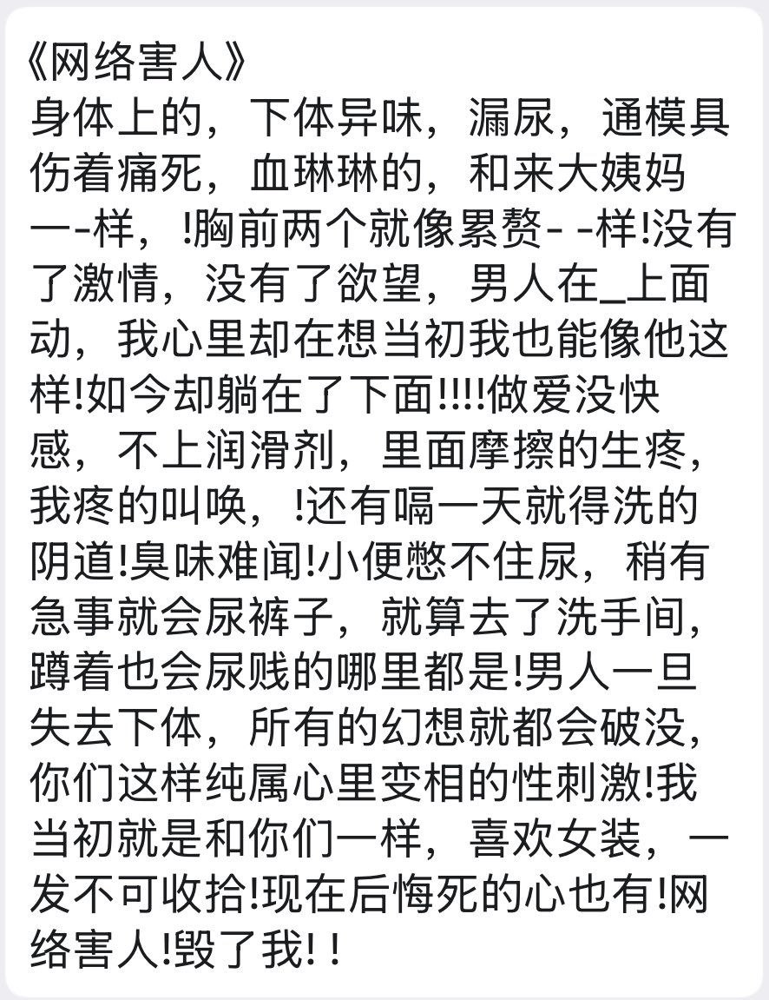

# 自传

该目录收录与跨性别相关的自传性文学作品，展示跨性别者的生命故事与过渡经历。自传不仅反映个人的成长与探索，还记录了在社会环境中的真实挑战与心路历程，具有重要的文学价值和社会意义。

总计 50 篇内容

### 📁 子目录

- [一个阉人的真实故事](一个阉人的真实故事) (40 篇内容)

### 📄 文档

- [PDF_我的雙性人生_-_OII_Europe_歐洲雙性人自我敘說](PDF_我的雙性人生_-_OII_Europe_歐洲雙性人自我敘說_page.md)
- [PDF_跨性別學生母親的心路歷程與對性平教育的期許](PDF_跨性別學生母親的心路歷程與對性平教育的期許_page.md)
- [一个阉人的真实故事](一个阉人的真实故事_page.md)
- [从变装到变性_-_他（她）的真实自述](从变装到变性_-_他（她）的真实自述_page.md)
- [女人梦——中国变性第一人](女人梦——中国变性第一人_page.md)
- [我在泰国做“人妖”_尼莎](我在泰国做“人妖”_尼莎_page.md)
- [我的一生_刘培麟日记_-_刘培麟_唐冠华_-_2019](我的一生_刘培麟日记_-_刘培麟_唐冠华_-_2019_page.md)
- [我认为我可能会是跨性别者](我认为我可能会是跨性别者_page.md)
- [泰国“人妖”是这样“炼”成_子——一名广西男青年的自述_杜启荣](泰国“人妖”是这样“炼”成_子——一名广西男青年的自述_杜启荣_page.md)

### 🖼️ 图片

[AG手术后悔-网络害人](AG手术后悔-网络害人.jpg)

> 本内容为自动生成，请修改 .github/ 目录下的对应脚本或者模板
