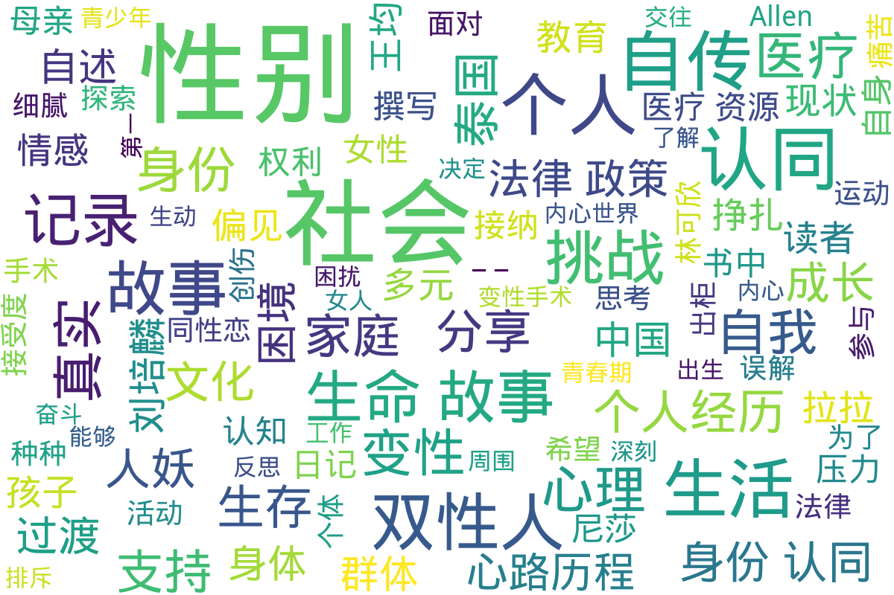

---
search:
  exclude: true
---

# 自传

该目录收录与跨性别相关的自传性文学作品，展示跨性别者的生命故事与过渡经历。自传不仅反映个人的成长与探索，还记录了在社会环境中的真实挑战与心路历程，具有重要的文学价值和社会意义。

标签: `跨性别`, `自传`, `文学`, `生命故事`, `过渡经历`

总计 56 篇内容

### 📁 子目录

- [一个阉人的真实故事](一个阉人的真实故事) (40 篇内容)
  

内容简介

  一个阉人的真实故事，手术过后后悔的一些远古记录
  

### 📄 文档

#### 2024

[一个阉人的真实故事](一个阉人的真实故事_page.md)

查看摘要

《一个阉人的真实故事》是一本讲述个人生命故事的自传文献，聚焦于一位跨性别者的真实过渡经历以及其生活中的挑战与心路历程。书中详尽描述了作者在性别认同与身体转变过程中的各种感受，包括对自身身份的探索、社会接纳度的感受以及个人在医疗上所经历的各种挑战。作者通过细腻的笔触传达了对生存的思考，积极应对身体与心理上的变化，同时也反映了社会对跨性别者的偏见和接受度，揭示了人性与社会的复杂交织。整本书不仅是对个人经历的记录，也是对社会环境的深刻反思，旨在引导读者理解跨性别者所面临的现实困境与挣扎。

#### 2023

[2023_多元性别_性别小熊_故事分享](2023_多元性别_性别小熊_故事分享_page.md)

查看摘要

本文件为《性别小熊》的自传分享，通过作者的个人故事，展示了跨性别者在寻找自我认同过程中所经历的挑战与成长。文中详细讲述了作者从童年到成人的性别认同历程，包括面临的家庭压力、社会歧视，以及在过渡过程中的心理与身体变化。作者通过生动的叙述表达了对多元性别认同的思考，强调了自我接纳的重要性。此外，文件中还分享了一些与医疗资源相关的经验，帮助其他有类似经历的人们获得更好支持。整体上，这篇作品是一种对生命故事的真挚记录，能够激励和鼓舞那些正在经历类似旅程的人们。

[2023年5月多元性别生命故事与过渡经历](2023年5月多元性别生命故事与过渡经历_page.md)

查看摘要

该文件收录了多元性别个体的生命故事与过渡经历，内容深入探讨了跨性别者在生活和身份认同过程中遇到的挑战与成长。文中包括个人叙述，反映了各种生存经历和过渡阶段的情感波动，同时也分享了一些关于医疗资源、法律政策的个人经验和看法。这些故事不只是个人的叙述，也是对社会环境的真实反馈，展示了多元性别群体在面对困境与寻找自我过程中的坚韧与勇气。文件中提及了医疗资源的可获取性、心理支持的重要性，以及在法律和政策环境下生活的体验。

#### 2019

[PDF_我的雙性人生_-_OII_Europe_歐洲雙性人自我敘說](PDF_我的雙性人生_-_OII_Europe_歐洲雙性人自我敘說_page.md)

查看摘要

这份文件名为《我的双性人生》, 由Janik Bastien Charlebois撰写，涉及双性人身份及其相关的个人经历和探讨。文件中包含了多篇由不同人士撰写的生命故事、医疗经验分享、法律政策探讨和社会环境记录，聚焦于双性人在生活中面临的困境与挑战。内容涵盖了从出生开始的医疗介入、亲人的反应、个人的心理斗争，以及社会对双性人身份的误解和偏见。书中反映出在医疗和家庭背景下，双性人常常遭受的各种不公正待遇与心理创伤，例如接受多次不必要的手术、受到医疗暴力等。作者强调，真正需要修复的不是双性人的身体，而是整个社会对他们的认知和接受度。通过对不同双性人故事的汇集，文件有助于提供对双性人身份更深刻的理解和支持。

[我的一生_刘培麟日记_-_刘培麟_唐冠华_-_2019](我的一生_刘培麟日记_-_刘培麟_唐冠华_-_2019_page.md)

查看摘要

该文件是刘培麟的自传及日记，记录了他自1956年出生以来的生活经历与心理变化。刘培麟自幼便立志写日记，记录下自己的点滴，以此作为生活的精神支柱。自述中提到，刘培麟为男性，但其内心深处渴望以女性身份生活，经历了许多社会的不理解与排斥。在文件中，他详细回顾了自己的成长历程，从养父母的抚养、青少年时期的困扰、参与社会政治活动，到后来经历的种种磨难，包括1993年因自身性别认同问题经历的种种心理与社会上的挑战。刘培麟藉由写作与日记记录他对生活的反思和对未来的希望，尤其是对自己身份的探索与自我接受。此外，文件中提及了其与周围人物的交往、对家庭的责任感、以及在社会变迁中的孤独感和奋斗精神，生动地呈现出一名跨性别者的生活现状与内心世界。

#### 2017

[2017_林可欣_孤獨平權路：還雙性孩子自主性別權](2017_林可欣_孤獨平權路：還雙性孩子自主性別權_page.md)

查看摘要

本文件为林可欣的自传《孤獨平權路：還雙性孩子自主性別權》，记录了她作为双性人面对的痛苦与挑战，以及对双性人权利的呼吁与倡导。文章详细描述了她在50岁出柜的心路历程，回忆起自己在儿童时期因为性别身份遭受的手术和身体上的创伤。林可欣在文中提到，自己在童年时期曾接受多次手术，由于缺乏知情同意，父母在医生的引导下被迫做出选择，造成了她一生的痛苦。她强调，双性人的性别选择权应获得尊重，现有医疗系统仍把双性人视为病症。文件中还提到，尽管社会对双性人逐渐有所了解，林可欣依然感受到来自社会的误解与排斥，尤其在法律上对双性人的认知与权益保障尚未到位。她希望通过自身的经历推动更多的人关注双性人权利，并为双性孩子争取自主选择性别的权利。

#### 2012

[2012年10月_Lesplus杂志_生命故事与跨性别经历](2012年10月_Lesplus杂志_生命故事与跨性别经历_page.md)

查看摘要

该文件是2012年10月出版的《Lesplus》杂志中的一篇关于跨性别经历的自传性文章。文章通过一个名为“软嘴唇”的跨性别者的个人故事，探讨了她的身份认同、情感经历以及与女友的关系。文中描述她在青少年时期对性取向的困惑，涉及到她与异性恋社会及家人的关系。具体案例包括她与女友的首次交往、出柜经历，以及在同性恋社群中成立小组进行活动的过程。文章还讨论了跨性别者的社会认同问题、家庭支持、身体认同等多个层面，结合了个人背景与社会环境，展现了跨性别者在自我认同与社会压力之间的挣扎。整体上，文件不仅记录了个人故事，也反映了更广泛的跨性别文化与社会问题。

#### 时间未知，按收录顺序排列

[我认为我可能会是跨性别者](我认为我可能会是跨性别者_page.md)

查看摘要

本文件为一篇自传性质的文档，讲述了作者的个人经历和对跨性别身份的探索。通过作者的第一人称叙述，读者能够更加深入地了解到跨性别者在生活中的挑战与成长过程。文件中提到了一些个人经历如自我认同的觉醒、过渡过程中面临的医疗和社会问题，以及对未来的希望与期待。此文档不仅展现了个人的心理变化，也反映出跨性别群体在当今社会中的生存现状和对平等权利的渴求。

[PDF_跨性別學生母親的心路歷程與對性平教育的期許](PDF_跨性別學生母親的心路歷程與對性平教育的期許_page.md)

查看摘要

本文件是《跨性别学生母亲的心路历程与对性平教育的期许》的自传性质的文章。作者简丽娟作为一位母亲，分享了她的孩子Allen在青春期出柜的经历以及作为家长的感受与挣扎。文件描述了Allen自我认同为跨性别后所经历的内心冲突与痛苦，以及母亲在支持孩子身份认同过程中的心理变化。文章中提到母亲最初接到Allen的求助信息时的震惊与担忧，以及与丈夫的沟通如何帮助缓解了家庭的紧张气氛。简丽娟还分享了对自身教育经验的反思，强调家庭教育在性别认同问题上的重要性，并呼吁社会对性别平等教育的重视，指出“我们自己摸索出来的知识可能会有不正确的认知。”整体而言，文章体现了亲子关系的紧密以及社会教育缺失对个体成长的影响。

[王均_腐女子的彩虹长征_生命故事分享](王均_腐女子的彩虹长征_生命故事分享_page.md)

查看摘要

本文件为王均撰写的自传，记录了作为一名腐女子从青春到成年过程中参与同志运动的心路历程。王均分享了自己是如何从初中时对BL文化的初步接触，到逐步意识到同性恋群体所面临的挑战和社会压力，并最终决定投入到同运的事业中。文中提及了个人在家庭和社会中遭遇的恐同及歧视，例如在家庭聚会上与亲戚的冲突以及在学校中回应对同性恋的偏见。王均也讲述了她在国立中山大学担任性别友善社社长期间的经历，包括积极组织校园活动，以提升同学们对性少数群体的认知和支持。文件最后强调了尽管社会有所进步，但仍需继续努力推动平权，确保每一个人都能不因性别或性取向而受到歧视。王均相信参与和表达对LGBT+权益的支持，能够带来积极的社会变革。

[拉拉的故事与经历](拉拉的故事与经历_page.md)

查看摘要

《拉拉的故事与经历》是一部记录个人真实经历的自传性文学作品。在这篇文章中，作者深入探讨了自己作为拉拉的身份认同与成长过程中的挑战与奋斗。作者通过自己的故事，分享了在成长过程中面对社会偏见的真实感受，以及在自我接纳和寻求认同的过程中所经历的情感波动。作品中包括了与家庭关系、友谊及对爱的理解等方面的生动描写，为读者提供了一个多元化的视角，帮助读者更好地理解拉拉群体的内心世界和独特经历。此外，文中还可能谈及反抗传统性别角色的勇气，以及如何在文化背景中找到自我。

[从变装到变性_-_他（她）的真实自述](从变装到变性_-_他（她）的真实自述_page.md)

查看摘要

该文件是一本跨性别者的自述，详细记录了作者在变性过程中的心路历程以及术后的现实困境。文中描述了变性前的经历，包括穿着束裤、手法使用等，作者分享了多年来的变装经验与个人感受。作者提到，变性带来的不仅仅是身体上的变化，更多的是社会与人际关系的挑战。术后，作者直面了来自社会、家庭和朋友的拒绝，工作与生活的困扰，以及对自我身份认同的深刻反思。内容中提到作者在泰国进行变性手术后的后悔，以及与前女友与女性朋友之间复杂的互动关系，描述了现今的生活状态与为了生存而接纳的角色。文中还包括作者对其他想要变性的人的警示，建议他们在做出选择之前好好思考。

[女人梦——中国变性第一人](女人梦——中国变性第一人_page.md)

查看摘要

《女人梦——中国变性第一人》是一本关于中国第一位变性女性的自传，详细记录了她的生命故事和过渡经历。书中通过细腻的文字呈现了作者从青春期到决定变性手术的心路历程，涉及到的内心挣扎、社会压力以及在家庭、工作中面临的各种挑战。这位变性女性分享了她的真实感受，描述了对于身份认同的追寻以及在变迁过程中所获得的支持与反对。书中也探讨了跨性别运动在中国的发展和面临的法律、社会环境问题，为读者提供了关于跨性别群体在中国生存现状的深刻见解。

[我在泰国做“人妖”_尼莎](我在泰国做“人妖”_尼莎_page.md)

查看摘要

该文件是尼莎的自传，记录了她作为一名跨性别者（“人妖”）在泰国的生活与经历。文件中描述了尼莎从小在农村的生活背景，以及为了生存而走上成为“人妖”的道路。她详细叙述了自己在父亲的陪伴下前往泰国求生的艰辛，提到为了达到理想的女性外形，她不得不注射激素并接受体形与舞蹈训练。尼莎反映了作为跨性别者的社会压力，描述了在演艺圈的竞争与艰难，同时也揭露了经济困境对她及她周围人的深远影响。整篇记录不仅提供了个人的自述，也映射了跨性别者在社会中生存的真实现状和挑战。

[泰国“人妖”是这样“炼”成_子——一名广西男青年的自述_杜启荣](泰国“人妖”是这样“炼”成_子——一名广西男青年的自述_杜启荣_page.md)

查看摘要

这篇自述文章由广西男青年杜启荣撰写，讲述了他在泰国性别认同和人妖文化体验的心路历程。作者详细描绘了自己的生活、挣扎和对性别身份的思考，透过个人故事展示了跨性别者在社会中的种种挑战与追求。他描述了自己如何在传统观念和个人认同之间找到平衡，并以“人妖”身份在泰国的生活经历为切入点，探讨了跨性别访客在文化适应和自我认同中的复杂情感。文中不仅有对个人过渡经历的细腻描写，也反映出社会对跨性别者的误解与接受，展现出生存现状的真实记录。

### 🖼️ 图片

#### 时间未知，按收录顺序排列

### 词云图

> 本内容为自动生成，请修改 .github/ 目录下的对应脚本或者模板
