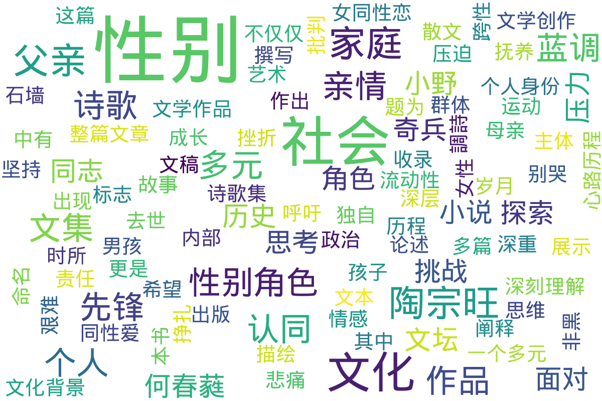

---
search:
  exclude: true
---

# 诗歌

!!! info

    本目录收录与跨性别主题相关的诗歌作品，旨在通过文学的方式表达跨性别人群的内心世界与情感历程。这些作品反映了跨性别个体在社会、文化背景下的经历和感受，展示了多样的艺术表现形式。

!!! note "📊 统计信息"

    总计内容：3 篇
    标签：`文学` `艺术` `诗歌` `跨性别` `情感表达`

### 📄 文档

<table>
<thead><tr>
<th style="width: 40%" data-sortable="true" data-sort-direction="asc" data-sort-type="text">标题 ▲</th>
<th style="width: 15%" data-sortable="true" data-sort-direction="desc" data-sort-type="year">年份 ▼</th>
<th style="width: 45%">摘要</th>
</tr></thead>
<tbody>
<tr data-name="2024年8月田小野文集" data-year="2024" data-date="2024-11-23 02:51:45">
                <td><a href="2024年8月田小野文集_page" class="md-button">2024年8月田小野文集</a></td>
                <td class="year-cell">2024</td>
                <td class="description-cell">

                    
展开

                    

                        该文件是田小野于2024年8月出版的文集，其中包含了一系列与多元性别相关的文学作品，包括小说、散文及诗歌。文集中有很多关于家庭、亲情，以及个人身份的探索，特别是在面对社会压力和个人情感时的挣扎。小说《红父亲》讲述了一位父亲在经历母亲去世后的深重悲痛与独自抚养孩子的故事，描绘了父亲在艰难岁月中如何坚持与家庭的联系，以及对于爱与责任的深刻理解。本书还探讨了亲情与个人意识之间的复杂关系，展示了父亲作为一个多元角色，在社会与家庭之间的平衡中所经历的挫折与成长。
                         年份：2024
                         收录日期：2024-11-23 02:51:45
                    

                
</td>
            </tr>
<tr data-name="PDF_T婆的跨性別藍調詩" data-year="2000" data-date="2024-11-07 19:21:51">
                <td><a href="PDF_T婆的跨性別藍調詩_page" class="md-button">PDF_T婆的跨性別藍調詩</a></td>
                <td class="year-cell">2000</td>
                <td class="description-cell">

                    
展开

                    

                        《Ｔ婆的跨性别蓝调诗》这篇文稿是由何春蕤所撰写，旨在讨论T婆这一跨性别角色的重要性及其在女性同性爱中的历史和文化背景。文中提到，T婆这一角色的出现不仅仅是性别认同的标志，更是女同性恋群体内部多样性的体现。论述指出，T婆的命名和表现方式，为女同志文化的历史作出了重要贡献。同时，文中探讨了性别角色与性别表现的复杂性，批判了将性别非黑即白的思维方式。何春蕤通过引用《蓝调石墙T》和《男孩别哭》等文本，阐释了跨性别主体在面对性别政治和社会压迫时所经历的挑战与心路历程，强调了跨性别运动的重要性以及对文化和社会的影响。整篇文章不仅是对跨性别文化和艺术表达的阐述，也是一种呼吁，希望能引发对性别流动性及复杂性的更深层思考与讨论。
                         年份：2000
                         收录日期：2024-11-07 19:21:51
                    

                
</td>
            </tr>
<tr data-name="陶宗旺_文坛奇兵_先锋诗人_创建年份" data-year="None" data-date="2024-11-23 03:25:07">
                <td><a href="陶宗旺_文坛奇兵_先锋诗人_创建年份_page" class="md-button">陶宗旺_文坛奇兵_先锋诗人_创建年份</a></td>
                <td class="year-cell">None</td>
                <td class="description-cell">

                    
展开

                    

                        本文件为陶宗旺的诗歌集，题为《文坛奇兵》，收录了他在先锋诗歌领域的多篇重要作品。陶宗旺选取了多样的主题，通过奇特的意象和深刻的社会观察，探讨了个体的存在、性别与身份的复杂关系，以及社会对非主流性别者的认知与偏见。作品风格独特，语言生动，具有启发思考的力量，并且反映了当代社会对多元性别的逐渐接受与探索。陶宗旺在其作品中表达了对性别多样性的肯定与支持，多次提到对传统性别观念的挑战与反思。
                         年份：None
                         收录日期：2024-11-23 03:25:07
                    

                
</td>
            </tr>
</tbody>
</table>

## 📊 词云图 { data-search-exclude }

 

=== "最多访问"

    * 13 访问 [PDF_T婆的跨性別藍調詩](/文学作品和艺术创作/诗歌/PDF_T婆的跨性別藍調詩_page)
    * 10 访问 [2024年8月田小野文集](/文学作品和艺术创作/诗歌/2024年8月田小野文集_page)
    * 5 访问 [陶宗旺_文坛奇兵_先锋诗人_创建年份](/文学作品和艺术创作/诗歌/陶宗旺_文坛奇兵_先锋诗人_创建年份_page)

!!! note "自动生成说明"
    目录及摘要为自动生成，仅供索引和参考，请修改 .github/ 目录下的对应脚本、模板或对应文件以更正。
