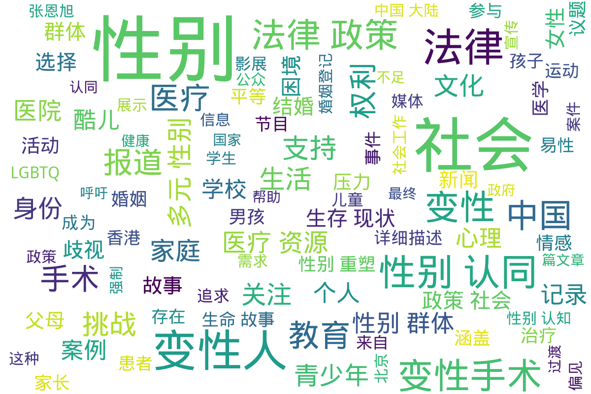

---
search:
  exclude: true
---

# 杂志及新闻报道

本目录包含关于中国大陆、海外及港澳台地区的跨性别相关杂志与新闻报道，二级分类按照发布的报纸杂志所在地区区分。旨在汇集各地对跨性别话题的不同视角与声音，提供相关信息和资源。此处主要收集传统媒体以及 PDF 文档或图片形式的新闻报道，例如杂志、剪报等。网页新闻报道请访问 <https://news.transchinese.org>，包含数千个相关网页。

标签: `跨性别`, `杂志`, `新闻报道`, `生命故事`, `社会环境`

总计 59 篇内容

### 📁 子目录

- [中国大陆](中国大陆) (42 篇内容)
  

内容简介

  这一目录收录了来自中国大陆的杂志和新闻报道，涵盖了跨性别群体的各种生活与社会现象，提供了真实的视角和声音，展示了跨性别者在社会中所面临的挑战与成就。
  

- [海外](海外) (6 篇内容)
  

内容简介

  此目录包含与跨性别相关的国际杂志和新闻报道，旨在分享海外跨性别群体的生活、挑战和成就。这些报道和文章提供了宝贵的视角，加深公众对跨性别议题的理解，促进社会包容。
  

- [港澳台](港澳台) (11 篇内容)
  

内容简介

  本目录收录与港澳台地区相关的跨性别报道与杂志内容，包括对跨性别者的生活、法律、医疗等多方面的报道，旨在宣传和提高社会对跨性别问题的认知与理解。
  

### 词云图 { data-search-exclude }

> 目录及摘要为自动生成，仅供索引和参考，请修改 .github/ 目录下的对应脚本、模板或对应文件以更正。
