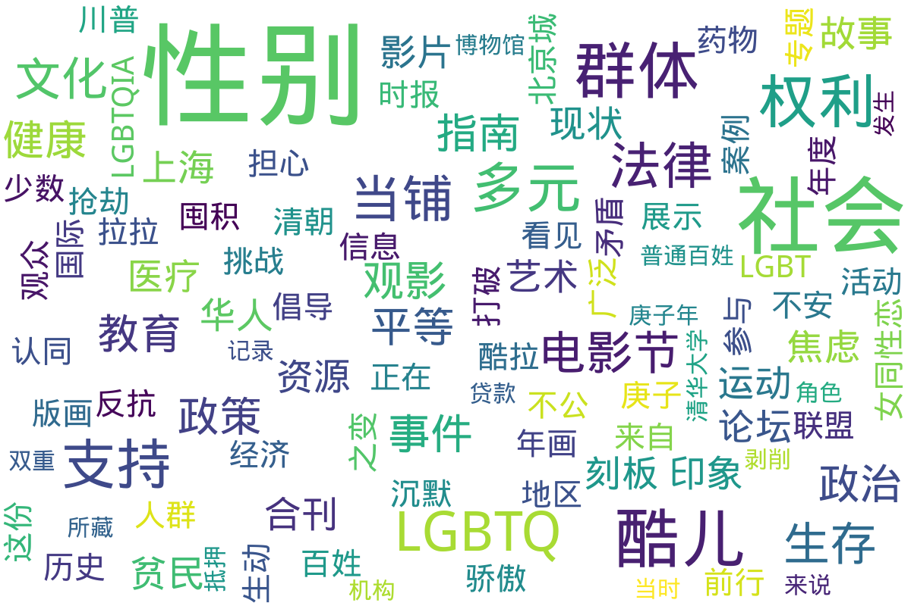

---
search:
  exclude: true
---

# 海外

此目录包含与跨性别相关的国际杂志和新闻报道，旨在分享海外跨性别群体的生活、挑战和成就。这些报道和文章提供了宝贵的视角，加深公众对跨性别议题的理解，促进社会包容。

标签: `跨性别`, `海外报道`, `国际新闻`, `生存现状`, `公共理解`, `社会包容`

总计 6 篇内容

### 📄 文档

#### 2024

[相约自杀、囤积药物、计划搬家…川普胜选令LGBTQ+群体焦虑，担心权利被剥夺](相约自杀、囤积药物、计划搬家…川普胜选令LGBTQ+群体焦虑，担心权利被剥夺_page.md)

查看摘要

本文讨论了川普在2024年总统选举中胜选对LGBTQ+群体的影响，描述了许多人由于对未来的不确定感而感到焦虑、不安及恐惧。文章提到，一些跨性别者和LGBTQ+成员正在计划搬迁到其认为能提供更好保护的州，如加拿⼤，以逃避未来可能遭遇的法律限制与政策打压。报道中有一位中学管理员佐伊·蒙哥马利担心川普的政策会影响到他们的性别确认医疗护理，表示她正在囤积药物。还有人倾向于结婚及领养孩子，以此来增强自己的法律保障。同时，文章引用了社会调查数据显示，55%的选民认为对变性人权利的支持过于宽泛，显示出社会对LGBTQ+权利的分歧。许多人在面对即将来临的政治变化时表达了无助和害怕，认为他们的生存权利将受到威胁。整体情况下，文件深刻反映了LGBTQ+群体在政治和社会环境变化下的恐慌与不安，强调了为了生存而不得不做出的困境选择。

#### 2020

[PDF_看见性别_观察家](PDF_看见性别_观察家_page.md)

查看摘要

这份PDF文件名为《看见性别》，由新纪元大学学院出版，收录了与性别教育和LGBTQIA相关的多篇文章和访谈，探讨了性别的多样性和社会对性别与性取向的刻板印象。文件中引述了多位性别教育工作者如杨洁和蔡佩娟的观点，她们强调性别与性别教育的重要性，指出性别教育应涉及更广泛的社会问题，包括性别歧视、性别刻板印象等。文件还从多个案例中透露了马来西亚对性少数群体的态度，及其面临的法律和社会挑战，如跨性别者的权利问题和LGBT群体的生存现状。

[517酷儿论坛打破沉默继续前行_2020](517酷儿论坛打破沉默继续前行_2020_page.md)

查看摘要

该文件是517酷儿论坛的特别企划，标题为《打破沉默，继续前行》。文件内容主要探讨了多元性别与健康平等的议题，呼吁社会公众对酷儿群体的关注与理解。文中提及了‘多元×健康×平等’的公式，强调在性别多样性和性别认同方面，需要提供更多的支持和资源，以促进这一群体的健康与权利。内容具有很强的社会倡导性质，旨在提升人们对酷儿问题的认识与敏感度。

#### 2017

[2017上海骄傲电影节观影指南](2017上海骄傲电影节观影指南_page.md)

查看摘要

这份文件是关于2017年上海骄傲电影节的观影指南，旨在为观众提供电影节期间放映的各类影片的详细信息和推荐。文件中列出了来自不同国家和地区的多元性别、跨性别和酷儿相关影片，突出了电影的主题、导演及主演，以及影片所传递的信息和社会背景。指南还提供了观影的地点、时间安排、购票方式及相关活动的信息，以便观众充分了解电影节的安排，参与到这场文化盛宴中。该guide特别强调了对多元性别群体的支持，并提倡对跨性别与酷儿文化的理解与接受。

#### 2015

[酷拉时报年度合刊_2015_华人拉拉联盟](酷拉时报年度合刊_2015_华人拉拉联盟_page.md)

查看摘要

《酷拉时报》年度合刊2015由华人拉拉联盟出品，旨在为华人及华语地区的女同性恋、女双性恋、跨性别者、间性人等性别少数群体提供一个交流和支持的平台。本期合刊汇聚了多个专题，反映了当前国际和国内LGBTQ+运动中的最新动态，以及关于性别和性向话题的深入讨论与反思。文章涉及了多样的主题，如国际同运趋势的观察、酷儿政治在中国的探讨、跨性别权利的现状与发展，以及女性主义在LGBT运动中的表现等。每个专题不仅为相关领域提供了理论基础，还结合了生动的案例和个人故事，强调了多元性别体验的复杂性和多样性。特别是在如今的社会环境中，这本刊物呼唤广泛的理解与支持，以促进性别和性向的平等权利与表达，并挑战现有的社会结构和观念。

#### 1902

[2023年抢当铺事件观察](2023年抢当铺事件观察_page.md)

查看摘要

该文件为清华大学艺术博物馆所藏的《北京城百姓抢当铺》版画，详细记录了庚子年（1900年）北京城发生的一次贫民抢劫当铺的事件。通过艺术的形式，版画生动地反映了当时的社会现实，揭示了当铺在清朝时期对普通百姓经济支持与剥削的双重角色。当铺作为一种抵押贷款的机构，对于贫民来说是一种急需的经济支持，但高利贷的存在又加重了他们的经济负担。这幅年画展示了劫掠场面的混乱，反映了社会的不公与贫富差距，是百姓对不公社会的直接反抗。从画中可见，参与抢劫的人群来自各个阶层，包括手工业工人和低收入者，画面中贫弱的人群满载而归，体现出社会矛盾的尖锐。通过对这一历史事件的描绘，作品展示了庚子之变背景下民众的觉醒与抵抗。

### 词云图 { data-search-exclude }

> 本内容为自动生成，请修改 .github/ 目录下的对应脚本或者模板
