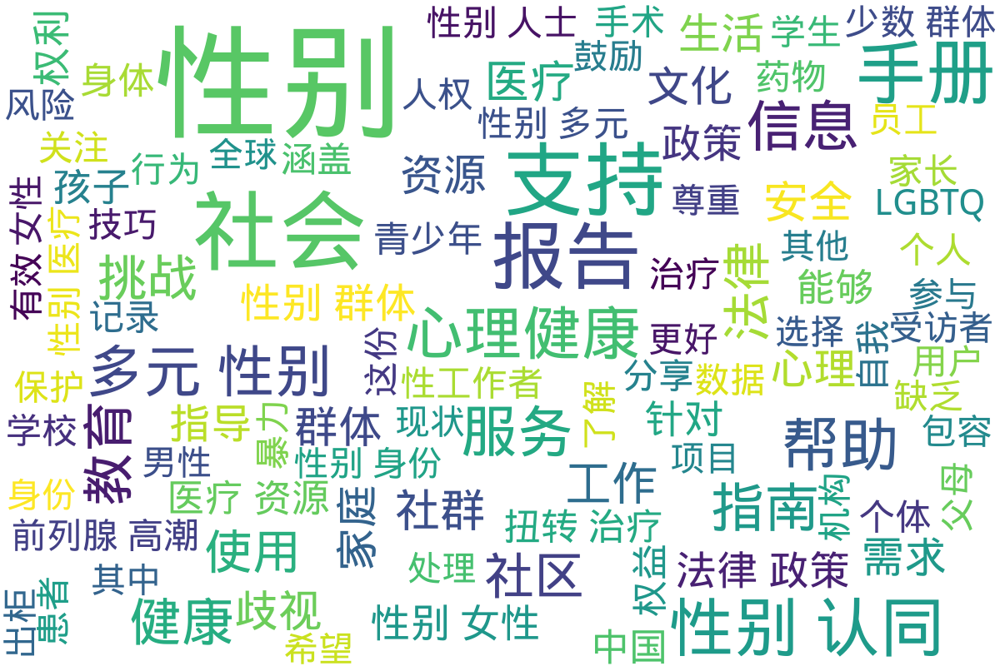

---
search:
  exclude: true
---

# 社群及NGO文件

本部分可收录的内容较为广泛。无论是如北京同志中心、同语这样的 NGO 出具的调查报告、教程指南，还是跨儿社群某论坛上由志愿者写作的 HRT 指南、出柜指南等，甚至是「女装」或自我探索类教程，均可收录在本版块内。这一目录也包括各类医疗体系、学校和社群的相关资料。这些信息有助于了解支持跨性别人士的组织资源及环境。

标签: `跨性别`, `社群`, `NGO`, `医疗资源`, `教育`, `组织`

总计 452 篇内容

### 📁 子目录

- [其他组织文件](其他组织文件) (37 篇内容)
  

内容简介

  这一目录包含关于跨性别群体的统计报告和资料指南，旨在提供有效的资源和数据支持，帮助人们更好地理解和关注跨性别群体的需求与现状。
  

- [医院和医疗体系](医院和医疗体系) (65 篇内容)
  

内容简介

  此目录收录了与跨性别相关的医院及医疗体系信息，例如医疗资源、医院政策及医疗经验分享等。这些资料可帮助跨性别者了解医疗服务的可获得性和具体体验。
  

- [学校](学校) (26 篇内容)
  

内容简介

  该目录包含与学校及教育相关的跨性别社群和非政府组织的文件。这些文件可能涵盖学校内的支持资源、跨性别学生的权益保护信息、教育政策的变革等内容，以推动对跨性别群体的理解和接纳。
  

- [手册指南](手册指南) (55 篇内容)
  

内容简介

  该目录包含跨性别相关的非政府组织（NGO）手册指南，旨在为社区成员提供资源和支持，帮助他们了解可用的服务与信息。
  

- [生活与性体验](生活与性体验) (193 篇内容)
  

内容简介

  该目录包含关于生活与性体验的多个文件，旨在为跨性别者提供实用的知识与技能，促进性健康与身体认知。文件内容涵盖了肌肉控制、性愉悦技巧、身体认知、心理适应等方面。具体来说，包括PC肌的收缩分解、如何进行会阴按摩、乳首的开发技巧以及伪声与伪娘训练的方法。这些内容不仅帮助跨性别者了解和掌控自己的身体，还提供了一系列实践指导，旨在支持他们的生活质量与性体验。此外，其中还涉及如何理解和参与性愉悦的多样性实践，秉持对个人身体和性别身份的尊重与认同。
  

- [社群讨论](社群讨论) (24 篇内容)
  

内容简介

  该目录包含了与跨性别社群相关的组织和非政府组织（NGO）的信息，包括中国大陆及海外的社群动态和资源。
  

- [统计报告](统计报告) (52 篇内容)
  

内容简介

  此目录包含与跨性别群体相关的统计报告，为研究人员和政策制定者提供有关跨性别者生存现状和需求的数据支持。这些报告致力于反映跨性别者在社会中的真实情况，包括人口统计、健康状况和社会接纳度等方面的信息。
  

### 词云图

> 本内容为自动生成，请修改 .github/ 目录下的对应脚本或者模板
