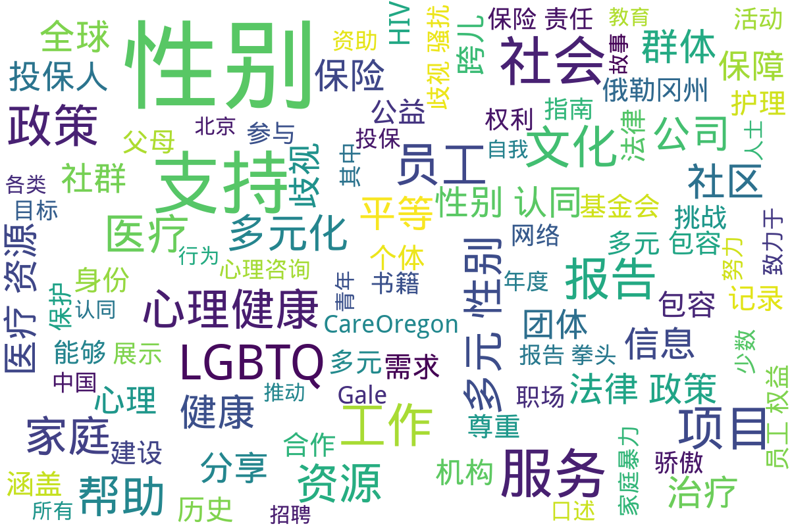

---
search:
  exclude: true
---

# NGO

这一目录包含关于跨性别群体的统计报告和资料指南，旨在提供有效的资源和数据支持，帮助人们更好地理解和关注跨性别群体的需求与现状。

标签: `跨性别`, `统计报告`, `资料指南`, `资源支持`, `社群`, `NGO`

总计 35 篇内容

### 📄 文档

#### 2024

[中国跨性别口述史项目计划书-20240122](中国跨性别口述史项目计划书-20240122_page.md)

查看摘要

本文件是《中华跨性别口述史项目计划书》，由跨性别学术小组（Trans in Academia，简称 TiA!）于2024年初发起。该项目旨在记录、保存并分享来自中国跨性别者对自身经历、经验和历史的叙述。口述史不仅是一种记录和保存口头证词的方法，也是这个过程的产物，通过采访和记录能够反映那些被官方历史叙事所排斥的个人与集体的生命体验。项目希望深入挖掘并讲述跨性别者在交叉性压迫下的生活故事，特别是那些被边缘化的声音。计划包括多个阶段，从对个体进行深入采访到将记录公之于众，强调尊重叙述者的身份和隐私。项目也意识到跨性别者在分享经历时的敏感性，并提供相应的伦理指导原则，以确保叙述的真实性与尊严。同时，文件还说明了信息公开和隐私保护措施，确保参与者的安全与权益。该计划书的内容包括项目的目的、研究对象、工作流程及项目的伦理指导原则等。

#### 2023

[PDF_环球尊尚医疗计划指南_-_永诚保险](PDF_环球尊尚医疗计划指南_-_永诚保险_page.md)

查看摘要

本文件是《环球尊尚医疗计划指南》，由美国网络供应方和永诚保险公司联合发布，旨在为中国用户提供跨性别者的全球医疗保险服务信息。指南详细介绍了保险计划的保障范围、理赔程序、医疗服务网络以及如何申请赔付的步骤等重要信息。文件内容指出，通过此医疗计划，用户可以在全球范围内找到适合的医疗服务提供者，并能享受由美国、保柏环球以及蓝十字蓝盾所覆盖的优质医疗资源。此外，文件中还涵盖了承保范围，包括慢性病、先天性病以及重大疾病的治疗费用，而对于相关的医疗标准和理赔程序，也进行了详细描述。该指南旨在帮助被保险人充分理解其医疗计划，以便于在需要医疗服务时能够顺利获得帮助与支持。

[团体咨询服务会面记录_多元性别支持_2023](团体咨询服务会面记录_多元性别支持_2023_page.md)

查看摘要

该文件记录了多元性别支持团体在2023年进行的一次咨询服务会议的详细情况。会议中讨论了多元性别群体在社会中的需求，以及如何通过社区支持和资源共享来帮助这一群体。与会者包括多元性别人士、社工、心理咨询师和相关领域的专业人士。文件中提到，为了更好地理解多元性别人士的具体状况，团体重点关注了医疗、法律和社会环境等方面的议题。具体内容包括与会者的分享、针对内外部资源的讨论、以及未来活动的规划等。在会议中，参与者还讨论了如何提升社会对多元性别群体的接纳与理解，并就当前的政策环境进行了反思和评估。整体来看，此文件为理解多元性别群体面临的挑战及支持网络提供了重要的信息与见解。

[了解多元化家庭_资源书籍_2023_威利和伊莱恩奥利弗](了解多元化家庭_资源书籍_2023_威利和伊莱恩奥利弗_page.md)

查看摘要

这本资源书籍《了解多元化家庭》由威利和伊莱恩·奥利弗编辑，旨在为信仰群体提供对多样化家庭结构的理解与支持。书中集合了来自不同领域的贡献者们的智慧与经验，讨论了如何更好地理解和支持跨性别、多元性别个体及其家庭。此外，书中还包含了一些有价值的资源和实践建议，帮助家庭事工和教会社区有效地支持多元化家庭。内容涵盖了婚姻、家庭心理健康、社区团结等主题，也提供了关于如何与儿童讨论同性恋、跨性别等敏感话题的指南。书籍强调了爱与团结的重要性，鼓励家庭在信仰与支持中成长，使每个家庭都能成为一个积极且包容的支持体系。

[2023_陪伴支持与多元文化社区服务报告](2023_陪伴支持与多元文化社区服务报告_page.md)

查看摘要

该报告是由位于新南威尔士州的主要卫生组织ACON Hunter发布，旨在为LGBTI社群，包括同性恋、双性恋、跨性别者和双性别者，提供支持与服务。文件中强调了在性健康、HIV预防、精神健康及家庭暴力等多方面为亨特地区的LGBTI社群成员提供安全的生活环境和全面的支持。特别提到，他们通过各种项目来帮助这些社群成员有效应对生活中的挑战，确保他们的健康和安全。此外，文件提供了组织的联系信息，以便需要帮助的人能够方便地获得服务。

[GALE精选图书目录_2023-2024](GALE精选图书目录_2023-2024_page.md)

查看摘要

本文件为2023-2024年度GALE精精选图书目目录，主要涵盖Gale公司出版的各类参考书籍和学术资源。Gale公司与全球图书馆合作，提供原始和精选的学术出版物，致力于支持学习者在各个学科领域的研究和学习。该目录展示了最新出版书目，包括获奖和专业书评机构认可的经典作品，覆盖人文社科、医学、科学技术等多个学科。目录中涉及的书籍主题多样，如法律与政治学、医学与健康科学、艺术与人文等，且每本书均附有ISBN和出版时间。特别推荐的书籍如《Gale护理和综合健康百科全书》以及《全球LGBTQ历史百科全书》，进一步展示了Gale在多元性别和社会科学领域的重视。整个目录致力于为研究人员和学生提供权威、易于使用的参考资源，强调知识的重要性与获取的途径。

[药明生物员工多元化政策_2023](药明生物员工多元化政策_2023_page.md)

查看摘要

本文件为药明生物技术有限公司（WuXi Biologics）员工多元化政策，旨在促进企业文化的发展，重视多元化，创建一个平等、包容的职场环境。政策的总则部分明确了其目的在于确保员工不受种族、肤色、性别、宗教、国籍等法律保护身份的影响，增强员工的归属感和尊重感。此外，文件详细描述了反歧视、平等、多元和包容政策，以及多元化人才招聘政策，其中强调了公司在招聘过程中需要采取的重要行动，以公平、公正地考虑不同背景的候选人。

#### 2022

[-最新的HIV_临床研发数据驱动新一轮针对治疗预防和治愈的创新](-最新的HIV_临床研发数据驱动新一轮针对治疗预防和治愈的创新_page.md)

查看摘要

该文件为关于2022世界艾滋病大会的资料，主要讨论了吉利德科学在HIV治疗、预防和治愈方面的最新研究与成果。文件中详细介绍了吉利德在大会上所参与的各项活动，包括其关键研究项目和合作，助力终结全球HIV流行的长期承诺。文件提到，吉利德科学希望通过以人为本的医疗创新，针对HIV受影响个体和社区不断变化的需求，进行深入研究与合作。文件还列举了多个研究项目的最新数据，探讨了HIV治疗和预防的科学进展，强调了医疗不均衡对健康影响的复杂性。此外，该文件还包括HIV临床研发的新疗法、治疗效果和相关数据分析，展示了在推动健康平等方面的努力。

[迈瑞_多元化平等与包容性政策](迈瑞_多元化平等与包容性政策_page.md)

查看摘要

该文件为迈瑞公司发布的《多元化、平等与包容性政策》，旨在促进公司内部的多元化和包容性，消除歧视。文件开头介绍了迈瑞对于员工组成的多样性、平等机会的承诺，并明确了反对歧视的原则，特别是针对年龄、残疾、变性等受保护的特征。政策内容详尽地阐述了各类具体措施，包括创造开放的工作环境、招聘多样化人才、培养管理层的包容性、提供支持网络和实施平等机会原则等。文件还强调了对员工投诉的认真对待及保护措施，确保无论是在工作活动中遭遇任何形式的歧视或骚扰，都能够有合理的申诉渠道和保护。文件规定自2022年9月1日起生效，体现了公司对多样性和包容性的重视及建设氛围。

[种族平等和多元化声明](种族平等和多元化声明_page.md)

查看摘要

该文件为Verisk公司发布的《种族平等和多元化声明》。文中详细阐述了公司对种族平等和多元化的承诺，强调了在工作场所建立包容性文化的重要性，倡导在全球范围内尊重和支持多样化的身份和经历。声明中提到，Verisk致力于构建一个反映全球社会的多元化工作环境，鼓励员工间存在的各种差异，并强调公司绝不容忍任何形式的种族主义。文中还列出了多项行动责任，包括促进跨文化能力、员工相互尊重的交流与合作、弹性工作制等，以支持员工和社区。此声明的目标是为所有员工创造平等机会，强调包容性和公平性，并强调严格遵守相关的法律法规。声明最后由首席执行官Lee Shavel和董事长Bruce Hansen签署，并于2022年11月8日获得董事会采纳。

[PDF_为青年跨性别女权运动筹措资源并参与其中](PDF_为青年跨性别女权运动筹措资源并参与其中_page.md)

查看摘要

该文件为FRIDA发布的一份关于如何为青年跨性别女权运动筹措资源并参与其中的策略指南，旨在提高跨性别者在女权运动中的地位与权利。文中强调了跨性别行动者面临的边缘化和压迫，尤其是在全球范围内越来越多的反跨性别言论和行为影响下。描述FRIDA如何通过资助和支持由跨性别者领导的团体来改善现状，同时反映出跨性别者在女权运动中不可或缺的角色和重要性。根据文中所述，FRIDA识别出跨性别社群的历史贡献，并努力确保其在资助过程中能够得到平等的资源，文件还对跨性别及相关术语的使用作了说明，力图建立更加包容和理解的环境。策略中细分了对跨性别团体的资助、传播与倡导、能力建设等多个重点领域，旨在提高跨性别议题在女权主义中的特殊关注与支持。

[跨儿心理-跨儿心理工作手册](跨儿心理-跨儿心理工作手册_page.md)

查看摘要

《跨儿心理工作手册》是一本专注于跨性别者（跨儿）及非性别常规者心理健康的公益手册，旨在提升心理工作者对跨儿群体的理解与支持。本手册详细介绍了跨儿的定义、分类及其与顺性别者的区别，同时强调了社会对跨儿的偏见与污名如何影响其心理健康。手册中提到，跨儿不仅包括传统意义上的跨性别者，也涵盖非二元性别、性别酷儿等多样性别认同的个体。通过公众教育、社群服务等方法，小组希望改善跨儿的福祉以及促进性别多元平等。此外，文中还讨论了跨儿的自我认同、社群认同和心理工作者在实践中应持的态度与方法。手册的许多内容参考了美国心理学会的指导，提供了与跨儿工作相关的实用指南。

#### 2021

[项目名项目合作协议](项目名项目合作协议_page.md)

查看摘要

该文件为《项目资助与合作协议》，主要涉及福建省正荣公益基金会与北京同声异响文化发展有限公司之间的合作协议。该项目名为‘为梦想而战的兄弟’，旨在支持和发展中国跨性别兄弟社群，提升其公众可见度与权利意识。文件详细列出了合作内容，包括资金管理方案、项目进展及监督检查的权利与义务、项目宣传及信息披露的要求等。同时也规定了双方在项目实施过程中的权利义务及违约责任等重要事项。合作的期限为2021年1月至2021年12月，并预计受益人数达到3000。项目资金的具体管理及使用方式也在协议中得以明确，确保资助款项被合理有效使用。

[对歧视骚扰零容忍政策报告](对歧视骚扰零容忍政策报告_page.md)

查看摘要

本文件是关于】对歧视、骚扰或报复零容忍政策的报告，以保障工作环境的公平与尊重。文件中详细列出了禁忌的行为和受保护的特征，包括种族、性别、性别认同、性取向、婚姻状况等。文件强调了建立无歧视和无骚扰的工作环境的重要性，并明确规定了对违反政策的处罚措施。特别提到，任何基于上述受保护特征的非法歧视和骚扰行为都将导致雇佣关系的终止。此政策适用于所有员工、求职者、实习生及相关的第三方，包括客户与供应商。并且，鼓励员工在遇到歧视与骚扰行为时主动报告，以便进行迅速处理和调查。

[北京病痛挑战公益基金会2020年度工作报告](北京病痛挑战公益基金会2020年度工作报告_page.md)

查看摘要

该文件为北京病痛挑战公益基金会2020年度工作报告，详细记录了基金会在2020年期间的运营情况及业绩。报告由多个部分组成，包括机构建设、公益事业支出、财务会计报告、接受监督管理情况等。报告中指出，基金会的宗旨是帮助罕见病患者，支持相关组织的发展，并提升社会对罕见病的认知。此外，文件还提到在COVID-19疫情期间，基金会积极协调资源，帮助罕见病患者解决药物短缺等问题。报告总结了各类公益项目，包括医疗援助工程、教育支持计划和“声声不息”公益培训计划等，强调了在年度内帮助了众多急需支持的病友。

[2021年度多元与包容报告_拳头公司](2021年度多元与包容报告_拳头公司_page.md)

查看摘要

本文件为《拳头公司2021年度多元与包容报告》，报告详细阐述了拳头公司在过去一年中如何应对全球疫情和社会动荡，努力创造一个包容的工作环境与文化。报告中提到，拳头致力于培养一个让所有员工，都可以投射自我与热情的工作场所，特别注重多元性和包容性的提升，以及如何在产品、文化、流程等方面进行创新。报告总结了一系列成就和未来的目标，其中包括提升女性与少数族群的比例、加强多元团队的对话与协作、改善薪酬和晋升体系的公平性等。值得一提的是，该报告也反映了拳头在人才发展、领导力项目和社会责任方面的努力，体现了该公司在多元化和包容性上的长期承诺。

[2021年拳头游戏多元与包容进展报告](2021年拳头游戏多元与包容进展报告_page.md)

查看摘要

这份《2021年拳头游戏多元与包容进展报告》详细阐述了拳头游戏在多元性别与包容性方面的努力和进展。报告回顾了组织在过去一年中所做的工作，强调了建立包容文化的重要性以及如何在全球范围内促进多样性。通过描述内部团队的组成、政策的调整、培训的实施以及员工的反馈，报告展示了拳头游戏在加强性别平等、文化代表性、以及提供支持给少数族裔员工方面所作出的努力。报告中提到，今年公司与专业第三方合作，持续进行薪酬平等审查，并在招聘过程中专注于多元化，力求为各类背景的员工提供平等的机会。还特别指出，拳头游戏在游戏产品开发中融入多元文化意识，通过全球各地的不同团队共同创造可以引起当地文化共鸣的角色与故事。此外, 报告提到了一系列旨在提升员工归属感的活动，强调了未来进一步改进和推进多元与包容工作的决心。

#### 2020

[PDF_国内LGBTQ社区建设经验分享](PDF_国内LGBTQ社区建设经验分享_page.md)

查看摘要

该文件名为《国内LGBTQ社区建设经验分享》，主要记录了一场于2020年6月14日的网络讲座，主持人是林健一，本次讲座分享了他与LGBTQ社区的经历、身份认同及基督教信仰的交织。内容包括个人故事的分享、LGBTQ社区颇具特色的建设实践、在社区中常见的议题与需求，以及志愿者和社区建设者所面临的挑战与工作经验。讲座中提到参与的社区，如基督徒的LGBTQ团体、朋辈支持小组等，同时记录了关于社群资源、服务需求与建设策略的探讨。文中强调了社区成员之间的相互支持与心理辅导的重要性，并提出了在法律、政策、资源与伦理意识等方面的挑战。

[PDF_中意综合保障团体医疗保险条款](PDF_中意综合保障团体医疗保险条款_page.md)

查看摘要

该文件是中意人寿保险有限公司发布的《中意综合保障团体医疗保险条款》，内容详尽地说明了该保险计划的基本条款、投保条件、保险合同的成立与生效、保险责任及其免除等各个方面的规定。文件第一章介绍了保险合同的构成，如投保单、保险计划明细和被保险人清单等。详细描述了投保条件，指出合法团体可以为其成员及家属投保。后续章节还涉及合同的续保、保险费用的支付、被保险人信息的变更以及合同解除的相关规定，确保投保人了解其权利与义务。同时，文件明确了保险责任的范围，包括住院和门诊特定项目、特殊药品及生育保险责任等。重要的是，文件中列出了各项保险责任的豁免条款，如精神疾病、先天性疾病等不在保障范围内。这一条款的清晰度对于投保人选择相应的保险计划极为重要。

#### 2018

[我骄傲我奉献真色彩_麦肯锡](我骄傲我奉献真色彩_麦肯锡_page.md)

查看摘要

本文件标题为《我骄傲我奉献——真色彩骄傲庆典》，详细介绍了全球各城市为LGBTQ社群争取权益和社会认可的骄傲庆典活动。内容中提到了麦肯锡公司在近年来的骄傲之行，以及他们通过社交媒体平台展示对多元文化的支持，尤其在2018年6月13日获得Trevor计划的20/20远见奖所作出的贡献。此外，文件还提到Trevor计划为LGBTQ青年群体提供心理危机咨询和帮助的工作，尤其是在自杀预防方面的成就，同时强调了麦肯锡在月处理LGBTQ问题上所起到的积极作用。麦肯锡通过志愿服务与Trevor计划保持紧密合作，为该组织提供咨询服务并帮助制定战略，极大推动了其对LGBTQ群体的支持。文件最后提及在2019年纽约TrevorLIVE慈善晚会上，麦肯锡的领导人鲍达民亦因其创新性领导而获奖，表明了公司对多元包容文化的长期承诺。

#### 时间未知，按收录顺序排列

[全国心理援助热线机构联系信息心理服务与援助机构](全国心理援助热线机构联系信息心理服务与援助机构_page.md)

查看摘要

本文件包含全国各地心理援助热线和机构的联系信息，细致介绍了多家心理服务及援助机构的性质、联系方式、服务内容和开通免费的心理咨询服务。文件中提到的心理援助热线服务旨在帮助不同人群，特别是心理创伤、抑郁症患者以及青少年的心理健康，提供法律及情感支援。这些机构包括‘12355’青少年服务台、‘阳光工程心理互助论坛’、‘春风网’等，涵盖全国范围内的心理健康资源。其中各机构的简介说明了提供的服务类型，如心理咨询、危机干预、法律援助等，反映了对抗性别暴力和心理健康危机的重要性。文中还列出了电话和网络平台供有需要的用户联系，并提供具体的服务时间和内容。

[CareOregon_性別確認照護](CareOregon_性別確認照護_page.md)

查看摘要

该文件由CareOregon发布，主要介绍了性别确认照护的相关内容。性别确认照护是指尊重和承认跨性别者、非二元性别者或双性人的经验的医疗照护。文件详细列出了受保范围内的服务，包括荷尔蒙治疗、心理健康护理、各种手术以及其他相关治疗。根据俄勒冈州的法律，性别确认治疗涉及由医疗保健服务提供者开立的针对性别不一致性的诊疗程序、服务和药物等内容，文件中提供了获取这些服务的步骤和注意事项。同时，CareOregon提供了一些联系信息，以帮助需要支持的个人。

[CareOregon_性别认定护理](CareOregon_性别认定护理_page.md)

查看摘要

该文件为《CareOregon性别认定护理》手册，详细介绍了跨性别者、非二元性别者或双性人所需的性别认定护理。文件首先阐述了什么是性别认定护理，强调这种护理旨在尊重和证实个体的性别身份和体验。它涵盖了与性别转换相关的各种治疗方法，包括手术、药物、心理健康服务等。文件还说明了CareOregon医疗计划如何承保这些服务，以及居民在俄勒冈州获得性别认定护理的步骤和注意事项。通过对文件内容的细致梳理，可以帮助跨性别者了解其权利和能够获得的医疗资源。同时，文件还提供了联系客户服务部获取更多信息的联系方式。

[PDF_與人士相遇於工作間_-_Gender_Empowerment_性別空間](PDF_與人士相遇於工作間_-_Gender_Empowerment_性別空間_page.md)

查看摘要

此文件名为《与人士相遇于工作间 - 性别赋权》，旨在探讨性别多样性及其在职场中的影响。本文件涉及跨性别者在工作环境中所遇到的挑战和经验，包括对性别认同的尊重、平等机会的提供、以及职场中的性别包容政策的实施。文中可能会提及不同组织如何推动性别赋权，帮助跨性别者在职场中获得支持。同时，这份文件可能包含案例研究，展示跨性别者在工作场所所做的努力和所取得的成就，以及对企业文化的积极影响。通过与多元性别人士的互动，这份文件意在强调创建一个更具包容性的职场环境的重要性。

[PDF_招商信诺附加家庭住院手术医疗保险条款阅读指引](PDF_招商信诺附加家庭住院手术医疗保险条款阅读指引_page.md)

查看摘要

本文件是《招商信诺附加家庭住院手术医疗保险条款阅读指引》的PDF格式说明文档，旨在帮助投保人理解与家庭住院手术医疗保险相关的条款与条件。文件详细阐述了保险合同的构成、保障范围、不保事项、合同的犹豫期以及投保人的权利与义务。例如，在犹豫期内，投保人若对合同不满意，可请求退还已交保险费。此外，文件特别强调了保险金的申请程序及必要文件，例如医疗证明、身份证明等。该保险自投保人签收之日起生效，特别适用于因意外伤害或保障疾病住院施行手术的情况。文件还列举了保险责任的免除条款，包括具有已知既往症、妊娠及意外伤害等特定情形。为确保投保人得到全面保障，文件建议投保人详细阅读并理解保险条款中的各种定义和规定。

[PDF_国华华宝无忧个人税收优惠型健康保险万能型B款产品说明书](PDF_国华华宝无忧个人税收优惠型健康保险万能型B款产品说明书_page.md)

查看摘要

本文件为《国华华宝无忧个人税收优惠型健康保险（万能型）B款产品说明书》，详细介绍了该保险产品的特点、投保条件、保险责任及费用结构。该产品旨在为投保人提供财务保障，特别是在医疗费用方面，允许投保人享受个人所得税优惠。文件中详细列出了保险的主要功能，涵盖医疗保险金的给付比例、个人账户的累积机制、以及保障续保的方法。同时，文件指出了投保时的注意事项和投保人及被保险人的条件，包括年龄、健康状况、既往病症等。此外，文件还列举了一系列风险提示，提醒投保人在选择保险时应谨慎考虑的情形。

[PDF_LGBTQ_History_and_Culture_Since_1940_-_Gale](PDF_LGBTQ_History_and_Culture_Since_1940_-_Gale_page.md)

查看摘要

《性与性别档案：1940年以来的LGBTQ历史与文化》是一个开创性项目，汇集了大量珍贵的一次文献资料，涵盖了LGBTQ群体自1940年以来的发展与斗争。该档案库由数百个国际和地方组织的文件构成，呈现了美国和全球LGBTQ社群的多样经历，包括同性恋和变性人群体的权利运动、文化表现和法律政策等方面。文中提及近三百万页可全文检索的资料，涉及文化研究、法律、社会运动及人权问题等多个学科。这项档案库的重要性在于为研究者提供跨文化视角，发表重要人物及事件的记录，同时也保存了大量的口述历史、私信及日记等个人解读资料，从而为研究LGBTQ历史和文化提供了深厚的基础和丰富的视角。

[科克地区LGBTQ服务与支持资源汇编](科克地区LGBTQ服务与支持资源汇编_page.md)

查看摘要

该文件是关于科克地区LGBTQ服务与支持资源的汇编，包含了各种面向LGBTQ社区的服务组织和支持项目的信息。这些资源涉及女同性恋、男同性恋、双性恋、跨性别者及非常规性别者群体的福利与需求，提供的服务包括性健康中心、求助热线、跨性别亲属支援、青年团体、家长信息群等。举例来说，科克LGBT+骄傲节和LINC等组织致力于为社区提供各种形式的支持和服务，如抗击歧视活动、社交活动和健康咨询。此外，文件中还提到了一些专为跨性别者及其家庭准备的支持团体，诸如“Transformers”青少年团体和“TransParenCI”父母支持团体，体现了对跨性别者的关怀与帮助。通过这些资源，可以帮助LGBTQ个体及其家人获得必要的信息、支持和社交网络，以促进心理健康与幸福。

[跨性别子女父母心声分享——后同盟提供的支持](跨性别子女父母心声分享——后同盟提供的支持_page.md)

查看摘要

该文件是由后同盟提供的关于跨性别子女父母心声的分享，旨在为跨性别者及其家庭提供支持与理解。在过去的三年里，后同盟的团队服务了超过三十位家长，成立了家长互助小组，以应对父母对于子女性别认同为他们带来的复杂情感，包括孤单、痛苦和内疚。文件中介绍了几个父母的故事，其中包含他们对孩子性别认同变化的震惊和无助，以及在接受孩子跨性别身份过程中面临的情感挑战。通过亲身经历的分享，这些父母希望能够鼓励其他面临相似情况的家庭，帮助他们从痛苦中走出，并在照顾自己与支持跨性别儿女之间找到平衡。与医生和心理专家的咨询相结合，父母们透过加入互助小组，感受到了被理解和支持，从而缓解了自身的情绪纠结。

[远大医药集团人权与多元化政策报告](远大医药集团人权与多元化政策报告_page.md)

查看摘要

本文件是《远大医药集团有限公司人权与多元化政策报告》的内容，详细列出了远大医药集团为保障劳工和员工权益而制定的政策及原则。文件首先明确了适用范围，包括所有下属企业的员工，强调了遵守法律法规和平等包容的工作原则。政策涵盖了多个方面，如禁止童工及强制劳动、同工同酬原则、支持员工的结社自由及言论自由、构建零歧视的职场环境等。文件还指出公司将定期进行人权与多元化培训，设有相应的申诉渠道以保障员工的权益，并要求公司董事会进行政策执行的监督与审核。整体上，这份政策报告的目的是通过建立一个多元、平等和包容的工作环境，来提升员工的幸福感与工作满意度，同时确保不同背景员工的合法权益。

[oneamongus](oneamongus_page.md)

查看摘要

该文件名为《Transgender Day of Remembrance》，内容涉及对跨性别群体的纪念与社会现象的反思。文件记录了一些悲惨事件，包括武汉天街谋杀案、一名跨性别女性从太和站桥上坠落，以及第一起跨性别就业歧视案件的失败，与2021年夏季跨性别媒体帐户的大规模关闭。这些事件反映了跨性别群体在中国面临的严重歧视和困境。文中提到，尽管社会普遍认为中国没有跨性别者，但实际上存在许多跨性别者，他们正遭受重重困扰，甚至有生命的危险。文件还提到了个人故事与家庭关系对跨性别者的深刻影响，例如一个人对自身身份的抗争，以及各类网络暴力对跨性别者及其家人的持续伤害。这是一个关于悼念、团结与抗争的强烈呼吁，展现了跨性别者在面对恶意时展现出的真实存在与反叛精神。

[寒涟漪庇护所介绍第一版](寒涟漪庇护所介绍第一版_page.md)

查看摘要

该文件为《寒涟漪庇护所介绍第一版》，详细介绍了寒涟漪庇护所的服务对象、工作目标、工作方式、人员准入标准、风险行为及外部压力等多方面内容。庇护所的主要目标是为面临生存困境和生命危险的人群提供包括住宿、情绪疏导、就业能力培训、医疗资源链接等救助支持。文件中提到，庇护所特别关注那些受到家庭暴力影响的未成年人，以及在互联网危机干预中无法得到有效帮助的个体。文件也详细讨论了未成年人在遭遇家庭暴力及校园欺凌时的处境与困境，以及缺乏适当支持的影响，特别是在精神健康和法律保护上的难点。此外，文件还关注到庇护所的工作目标及其面临的各种外部压力，尤其是如何应对社会对于精神疾病的偏见和对跨性别者的歧视。

[跨性别组织或机构](跨性别组织或机构_page.md)

查看摘要

该文件详细介绍了多个跨性别及性少数群体相关的组织和机构，包括其成立背景、主要活动、服务对象及联系信息。文件中提到的组织包括但不限于北京同志中心、跨性别生活社、武汉同行同志中心等。这些组织致力于提供心理咨询、医疗资源、社群活动、性别教育等服务，推动性少数群体的权利和社会认知。文件强调了这些组织的普遍目标，即为所有性别认同和性取向的人提供平等、尊重和包容的环境。

[跨性别者生存现状](跨性别者生存现状_page.md)

查看摘要

本文件为《跨性别者生存现状》研究报告，深入探讨了跨性别者在家庭、校园、法律政策、心理健康及医疗支持等多个层面的生存状况。报告由北京同志中心跨性别部主管核桃撰写，内容包含了对跨性别者生理性别、指派性别、社会性别等多种名词的解释，以及跨性别者面临的家庭暴力、强制扭转治疗及心理健康问题的真实案例。研究指出，超过80%的跨性别者在18岁前对自身性别身份有自我觉察，但家庭支持的缺失往往导致个体抑郁、辍学甚至自杀。与此同时，许多跨性别者在接受正规医疗过程中面临重重挑战，常通过非正规途径获取所需药物，结果带来安全风险。此研究旨在提高对跨性别者现状的理解，以促进社会支持和制度改善，推动跨性别友好的环境。

### 🖼️ 图片

#### 时间未知，按收录顺序排列

### 词云图

> 本内容为自动生成，请修改 .github/ 目录下的对应脚本或者模板
