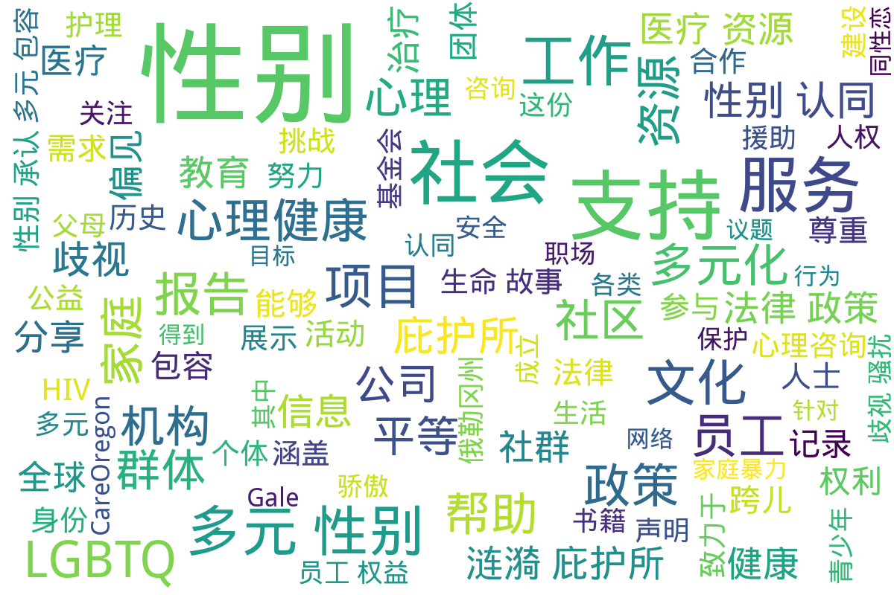

---
search:
  exclude: true
---

# NGO

!!! info

    这一目录包含关于跨性别群体的统计报告和资料指南，旨在提供有效的资源和数据支持，帮助人们更好地理解和关注跨性别群体的需求与现状。

!!! note "📊 统计信息"

    总计内容：39 篇
    标签：`跨性别` `统计报告` `资料指南` `资源支持` `社群` `NGO`

### 📄 文档

<table>
<thead><tr>
<th style="width: 40%" data-sortable="true" data-sort-direction="asc" data-sort-type="text">标题 ▲</th>
<th style="width: 15%" data-sortable="true" data-sort-direction="desc" data-sort-type="year">年份 ▼</th>
<th style="width: 45%">摘要</th>
</tr></thead>
<tbody>
<tr data-name="1997_關注婦女性暴力協會_性別承認諮詢意見書" data-year="2017" data-date="2024-11-23 03:01:44">
                <td><a href="1997_關注婦女性暴力協會_性別承認諮詢意見書_page" class="md-button">1997_關注婦女性暴力協會_性別承認諮詢意見書</a></td>
                <td class="year-cell">2017</td>
                <td class="description-cell">

                    
本文件为《性别承认咨询文件》的意见书，由...

                    

                        本文件为《性别承认咨询文件》的意见书，由关注女性暴力协会提交，以回应政府对于性别承认的咨询。文件指出，性别承认是一项基本人权，强调跨性别者的选择权应当受到尊重。关注女性暴力协会成立于1997年，致力于促进性别平等与对抗性暴力，这份意见书是在2005年成立的Anti-480反性暴力资源中心的背景下提出的。文件中提到，香港的性别问题并非简单的二元对立，而是涉及到社会文化和个人心理，因此，不能忽略那些性别少数群体的权利被剥夺这一现实。

文件详尽地讨论了关于香港是否应设立性别承认制度的看法，认为认同和尊重性别的多样性是社会的基本要求。具体而言，文件中提到“性别不安并非一种疾病”。通过逐条回应16个咨询问题，文件明确表示，任何医疗程序不应作为变更性别的先决条件，个人的医疗选择权应得到保障。意见书中对性别承认过程的具体规定进行了说明，包括针对“实际生活体验”的要求，建议应改为“冷静期”，以便人们在申请后有一定时间进行反思，而不应强加具体的生活标准。同时，文中认为，将性别认可与家庭、婚姻状况捆绑在一起是不合理的，已婚跨性别者应保留继续婚姻的权利。

此外，对于性别承认制度的成立过程，文件建议香港应当设立新法例来系统化这一过程，以确保跨性别者的权利能够在法律上得到充分保障。文件认为，英美等国的性别承认机制在某种程度上可以为香港提供参考，但同时也指出，应当摒弃列出入侵性医疗程序的要求。最后，文件强调，性别承认应承认各地的性别改动，并且各相关机构和专业人士需参与创建一个公正、透明的制度，以保障所有人的基本权利。
                         年份：2017
                         收录日期：2024-11-23 03:01:44
                    

                
</td>
            </tr>
<tr data-name="2021年度多元与包容报告_拳头公司" data-year="2021" data-date="2024-11-23 06:24:24">
                <td><a href="2021年度多元与包容报告_拳头公司_page" class="md-button">2021年度多元与包容报告_拳头公司</a></td>
                <td class="year-cell">2021</td>
                <td class="description-cell">

                    
本文件为《拳头公司2021年度多元与包容...

                    

                        本文件为《拳头公司2021年度多元与包容报告》，报告详细阐述了拳头公司在过去一年中如何应对全球疫情和社会动荡，努力创造一个包容的工作环境与文化。报告中提到，拳头致力于培养一个让所有员工，都可以投射自我与热情的工作场所，特别注重多元性和包容性的提升，以及如何在产品、文化、流程等方面进行创新。报告总结了一系列成就和未来的目标，其中包括提升女性与少数族群的比例、加强多元团队的对话与协作、改善薪酬和晋升体系的公平性等。值得一提的是，该报告也反映了拳头在人才发展、领导力项目和社会责任方面的努力，体现了该公司在多元化和包容性上的长期承诺。
                         年份：2021
                         收录日期：2024-11-23 06:24:24
                    

                
</td>
            </tr>
<tr data-name="2021年拳头游戏多元与包容进展报告" data-year="2021" data-date="2024-11-23 06:24:57">
                <td><a href="2021年拳头游戏多元与包容进展报告_page" class="md-button">2021年拳头游戏多元与包容进展报告</a></td>
                <td class="year-cell">2021</td>
                <td class="description-cell">

                    
这份《2021年拳头游戏多元与包容进展报...

                    

                        这份《2021年拳头游戏多元与包容进展报告》详细阐述了拳头游戏在多元性别与包容性方面的努力和进展。报告回顾了组织在过去一年中所做的工作，强调了建立包容文化的重要性以及如何在全球范围内促进多样性。通过描述内部团队的组成、政策的调整、培训的实施以及员工的反馈，报告展示了拳头游戏在加强性别平等、文化代表性、以及提供支持给少数族裔员工方面所作出的努力。报告中提到，今年公司与专业第三方合作，持续进行薪酬平等审查，并在招聘过程中专注于多元化，力求为各类背景的员工提供平等的机会。还特别指出，拳头游戏在游戏产品开发中融入多元文化意识，通过全球各地的不同团队共同创造可以引起当地文化共鸣的角色与故事。此外, 报告提到了一系列旨在提升员工归属感的活动，强调了未来进一步改进和推进多元与包容工作的决心。
                         年份：2021
                         收录日期：2024-11-23 06:24:57
                    

                
</td>
            </tr>
<tr data-name="2023_多元性别_性别小熊_故事分享" data-year="2023" data-date="2024-11-23 04:09:19">
                <td><a href="2023_多元性别_性别小熊_故事分享_page" class="md-button">2023_多元性别_性别小熊_故事分享</a></td>
                <td class="year-cell">2023</td>
                <td class="description-cell">

                    
本文件为《性别小熊》的自传分享，通过作者...

                    

                        本文件为《性别小熊》的自传分享，通过作者的个人故事，展示了跨性别者在寻找自我认同过程中所经历的挑战与成长。文中详细讲述了作者从童年到成人的性别认同历程，包括面临的家庭压力、社会歧视，以及在过渡过程中的心理与身体变化。作者通过生动的叙述表达了对多元性别认同的思考，强调了自我接纳的重要性。文件中还分享了一些与医疗资源相关的经验，帮助其他有类似经历的人们获得更好支持。整体上，这篇作品是一种对生命故事的真挚记录，能够激励和鼓舞那些正在经历类似旅程的人们。
                         年份：2023
                         收录日期：2024-11-23 04:09:19
                    

                
</td>
            </tr>
<tr data-name="2023_陪伴支持与多元文化社区服务报告" data-year="2023" data-date="2024-11-23 05:30:38">
                <td><a href="2023_陪伴支持与多元文化社区服务报告_page" class="md-button">2023_陪伴支持与多元文化社区服务报告</a></td>
                <td class="year-cell">2023</td>
                <td class="description-cell">

                    
该报告是由位于新南威尔士州的主要卫生组织...

                    

                        该报告是由位于新南威尔士州的主要卫生组织ACON Hunter发布，旨在为LGBTI社群，包括同性恋、双性恋、跨性别者和双性别者，提供支持与服务。文件中强调了在性健康、HIV预防、精神健康及家庭暴力等多方面为亨特地区的LGBTI社群成员提供安全的生活环境和全面的支持。特别提到，他们通过各种项目来帮助这些社群成员有效应对生活中的挑战，确保他们的健康和安全。文件提供了组织的联系信息，以便需要帮助的人能够方便地获得服务。
                         年份：2023
                         收录日期：2024-11-23 05:30:38
                    

                
</td>
            </tr>
<tr data-name="-最新的HIV_临床研发数据驱动新一轮针对治疗预防和治愈的创新" data-year="2022" data-date="2024-10-29 06:03:39">
                <td><a href="-最新的HIV_临床研发数据驱动新一轮针对治疗预防和治愈的创新_page" class="md-button">-最新的HIV_临床研发数据驱动新一轮针对治疗预防和治愈的创新</a></td>
                <td class="year-cell">2022</td>
                <td class="description-cell">

                    
该文件为关于2022世界艾滋病大会的资料...

                    

                        该文件为关于2022世界艾滋病大会的资料，主要讨论了吉利德科学在HIV治疗、预防和治愈方面的最新研究与成果。文件中详细介绍了吉利德在大会上所参与的各项活动，包括其关键研究项目和合作，助力终结全球HIV流行的长期承诺。文件提到，吉利德科学希望通过以人为本的医疗创新，针对HIV受影响个体和社区不断变化的需求，进行深入研究与合作。文件还列举了多个研究项目的最新数据，探讨了HIV治疗和预防的科学进展，强调了医疗不均衡对健康影响的复杂性。该文件还包括HIV临床研发的新疗法、治疗效果和相关数据分析，展示了在推动健康平等方面的努力。
                         年份：2022
                         收录日期：2024-10-29 06:03:39
                    

                
</td>
            </tr>
<tr data-name="CareOregon_性別確認照護" data-year="None" data-date="2024-11-02 02:33:40">
                <td><a href="CareOregon_性別確認照護_page" class="md-button">CareOregon_性別確認照護</a></td>
                <td class="year-cell">None</td>
                <td class="description-cell">

                    
该文件由CareOregon发布，主要介...

                    

                        该文件由CareOregon发布，主要介绍了性别确认照护的相关内容。性别确认照护是指尊重和承认跨性别者、非二元性别者或双性人的经验的医疗照护。文件详细列出了受保范围内的服务，包括荷尔蒙治疗、心理健康护理、各种手术以及其他相关治疗。根据俄勒冈州的法律，性别确认治疗涉及由医疗保健服务提供者开立的针对性别不一致性的诊疗程序、服务和药物等内容，文件中提供了获取这些服务的步骤和注意事项。同时，CareOregon提供了一些联系信息，以帮助需要支持的个人。
                         年份：None
                         收录日期：2024-11-02 02:33:40
                    

                
</td>
            </tr>
<tr data-name="CareOregon_性别认定护理" data-year="None" data-date="2024-11-02 02:40:48">
                <td><a href="CareOregon_性别认定护理_page" class="md-button">CareOregon_性别认定护理</a></td>
                <td class="year-cell">None</td>
                <td class="description-cell">

                    
该文件为《CareOregon性别认定护...

                    

                        该文件为《CareOregon性别认定护理》手册，详细介绍了跨性别者、非二元性别者或双性人所需的性别认定护理。文件首先阐述了什么是性别认定护理，强调这种护理旨在尊重和证实个体的性别身份和体验。它涵盖了与性别转换相关的各种治疗方法，包括手术、药物、心理健康服务等。文件还说明了CareOregon医疗计划如何承保这些服务，以及居民在俄勒冈州获得性别认定护理的步骤和注意事项。通过对文件内容的细致梳理，可以帮助跨性别者了解其权利和能够获得的医疗资源。同时，文件还提供了联系客户服务部获取更多信息的联系方式。
                         年份：None
                         收录日期：2024-11-02 02:40:48
                    

                
</td>
            </tr>
<tr data-name="GALE精选图书目录_2023-2024" data-year="2023" data-date="2024-11-23 05:51:58">
                <td><a href="GALE精选图书目录_2023-2024_page" class="md-button">GALE精选图书目录_2023-2024</a></td>
                <td class="year-cell">2023</td>
                <td class="description-cell">

                    
本文件为2023-2024年度GALE精...

                    

                        本文件为2023-2024年度GALE精精选图书目目录，主要涵盖Gale公司出版的各类参考书籍和学术资源。Gale公司与全球图书馆合作，提供原始和精选的学术出版物，致力于支持学习者在各个学科领域的研究和学习。该目录展示了最新出版书目，包括获奖和专业书评机构认可的经典作品，覆盖人文社科、医学、科学技术等多个学科。目录中涉及的书籍主题多样，如法律与政治学、医学与健康科学、艺术与人文等，且每本书均附有ISBN和出版时间。特别推荐的书籍如《Gale护理和综合健康百科全书》以及《全球LGBTQ历史百科全书》，进一步展示了Gale在多元性别和社会科学领域的重视。整个目录致力于为研究人员和学生提供权威、易于使用的参考资源，强调知识的重要性与获取的途径。
                         年份：2023
                         收录日期：2024-11-23 05:51:58
                    

                
</td>
            </tr>
<tr data-name="oneamongus" data-year="None" data-date="2024-12-13 05:32:01">
                <td><a href="oneamongus_page" class="md-button">oneamongus</a></td>
                <td class="year-cell">None</td>
                <td class="description-cell">

                    
该文件名为《Transgender Da...

                    

                        该文件名为《Transgender Day of Remembrance》，内容涉及对跨性别群体的纪念与社会现象的反思。文件记录了一些悲惨事件，包括武汉天街谋杀案、一名跨性别女性从太和站桥上坠落，以及第一起跨性别就业歧视案件的失败，与2021年夏季跨性别媒体帐户的大规模关闭。这些事件反映了跨性别群体在中国面临的严重歧视和困境。文中提到，尽管社会普遍认为中国没有跨性别者，但实际上存在许多跨性别者，他们正遭受重重困扰，甚至有生命的危险。文件还提到了个人故事与家庭关系对跨性别者的深刻影响，例如一个人对自身身份的抗争，以及各类网络暴力对跨性别者及其家人的持续伤害。这是一个关于悼念、团结与抗争的强烈呼吁，展现了跨性别者在面对恶意时展现出的真实存在与反叛精神。
                         年份：None
                         收录日期：2024-12-13 05:32:01
                    

                
</td>
            </tr>
<tr data-name="PDF_LGBTQ_History_and_Culture_Since_1940_-_Gale" data-year="None" data-date="2024-11-07 19:42:34">
                <td><a href="PDF_LGBTQ_History_and_Culture_Since_1940_-_Gale_page" class="md-button">PDF_LGBTQ_History_and_Culture_Since_1940_-_Gale</a></td>
                <td class="year-cell">None</td>
                <td class="description-cell">

                    
《性与性别档案：1940年以来的LGBT...

                    

                        《性与性别档案：1940年以来的LGBTQ历史与文化》是一个开创性项目，汇集了大量珍贵的一次文献资料，涵盖了LGBTQ群体自1940年以来的发展与斗争。该档案库由数百个国际和地方组织的文件构成，呈现了美国和全球LGBTQ社群的多样经历，包括同性恋和变性人群体的权利运动、文化表现和法律政策等方面。文中提及近三百万页可全文检索的资料，涉及文化研究、法律、社会运动及人权问题等多个学科。这项档案库的重要性在于为研究者提供跨文化视角，发表重要人物及事件的记录，同时也保存了大量的口述历史、私信及日记等个人解读资料，从而为研究LGBTQ历史和文化提供了深厚的基础和丰富的视角。
                         年份：None
                         收录日期：2024-11-07 19:42:34
                    

                
</td>
            </tr>
<tr data-name="PDF_为青年跨性别女权运动筹措资源并参与其中" data-year="2022" data-date="2024-11-07 20:08:07">
                <td><a href="PDF_为青年跨性别女权运动筹措资源并参与其中_page" class="md-button">PDF_为青年跨性别女权运动筹措资源并参与其中</a></td>
                <td class="year-cell">2022</td>
                <td class="description-cell">

                    
该文件为FRIDA发布的一份关于如何为青...

                    

                        该文件为FRIDA发布的一份关于如何为青年跨性别女权运动筹措资源并参与其中的策略指南，旨在提高跨性别者在女权运动中的地位与权利。文中强调了跨性别行动者面临的边缘化和压迫，尤其是在全球范围内越来越多的反跨性别言论和行为影响下。描述FRIDA如何通过资助和支持由跨性别者领导的团体来改善现状，同时反映出跨性别者在女权运动中不可或缺的角色和重要性。根据文中所述，FRIDA识别出跨性别社群的历史贡献，并努力确保其在资助过程中能够得到平等的资源，文件还对跨性别及相关术语的使用作了说明，力图建立更加包容和理解的环境。策略中细分了对跨性别团体的资助、传播与倡导、能力建设等多个重点领域，旨在提高跨性别议题在女权主义中的特殊关注与支持。
                         年份：2022
                         收录日期：2024-11-07 20:08:07
                    

                
</td>
            </tr>
<tr data-name="PDF_国内LGBTQ社区建设经验分享" data-year="2020" data-date="2024-11-07 18:53:13">
                <td><a href="PDF_国内LGBTQ社区建设经验分享_page" class="md-button">PDF_国内LGBTQ社区建设经验分享</a></td>
                <td class="year-cell">2020</td>
                <td class="description-cell">

                    
该文件名为《国内LGBTQ社区建设经验分...

                    

                        该文件名为《国内LGBTQ社区建设经验分享》，主要记录了一场于2020年6月14日的网络讲座，主持人是林健一，本次讲座分享了他与LGBTQ社区的经历、身份认同及基督教信仰的交织。内容包括个人故事的分享、LGBTQ社区颇具特色的建设实践、在社区中常见的议题与需求，以及志愿者和社区建设者所面临的挑战与工作经验。讲座中提到参与的社区，如基督徒的LGBTQ团体、朋辈支持小组等，同时记录了关于社群资源、服务需求与建设策略的探讨。文中强调了社区成员之间的相互支持与心理辅导的重要性，并提出了在法律、政策、资源与伦理意识等方面的挑战。
                         年份：2020
                         收录日期：2024-11-07 18:53:13
                    

                
</td>
            </tr>
<tr data-name="PDF_與人士相遇於工作間_-_Gender_Empowerment_性別空間" data-year="None" data-date="2024-11-07 19:07:26">
                <td><a href="PDF_與人士相遇於工作間_-_Gender_Empowerment_性別空間_page" class="md-button">PDF_與人士相遇於工作間_-_Gender_Empowerment_性別空間</a></td>
                <td class="year-cell">None</td>
                <td class="description-cell">

                    
此文件名为《与人士相遇于工作间 - 性别...

                    

                        此文件名为《与人士相遇于工作间 - 性别赋权》，旨在探讨性别多样性及其在职场中的影响。本文件涉及跨性别者在工作环境中所遇到的挑战和经验，包括对性别认同的尊重、平等机会的提供、以及职场中的性别包容政策的实施。文中可能会提及不同组织如何推动性别赋权，帮助跨性别者在职场中获得支持。同时，这份文件可能包含案例研究，展示跨性别者在工作场所所做的努力和所取得的成就，以及对企业文化的积极影响。通过与多元性别人士的互动，这份文件意在强调创建一个更具包容性的职场环境的重要性。
                         年份：None
                         收录日期：2024-11-07 19:07:26
                    

                
</td>
            </tr>
<tr data-name="中国跨性别口述史项目计划书-20240122" data-year="2024" data-date="2024-12-13 05:32:01">
                <td><a href="中国跨性别口述史项目计划书-20240122_page" class="md-button">中国跨性别口述史项目计划书-20240122</a></td>
                <td class="year-cell">2024</td>
                <td class="description-cell">

                    
本文件是《中华跨性别口述史项目计划书》，...

                    

                        本文件是《中华跨性别口述史项目计划书》，由跨性别学术小组（Trans in Academia，简称 TiA!）于2024年初发起。该项目旨在记录、保存并分享来自中国跨性别者对自身经历、经验和历史的叙述。口述史不仅是一种记录和保存口头证词的方法，也是这个过程的产物，通过采访和记录能够反映那些被官方历史叙事所排斥的个人与集体的生命体验。项目希望深入挖掘并讲述跨性别者在交叉性压迫下的生活故事，特别是那些被边缘化的声音。计划包括多个阶段，从对个体进行深入采访到将记录公之于众，强调尊重叙述者的身份和隐私。项目也意识到跨性别者在分享经历时的敏感性，并提供相应的伦理指导原则，以确保叙述的真实性与尊严。同时，文件还说明了信息公开和隐私保护措施，确保参与者的安全与权益。该计划书的内容包括项目的目的、研究对象、工作流程及项目的伦理指导原则等。
                         年份：2024
                         收录日期：2024-12-13 05:32:01
                    

                
</td>
            </tr>
<tr data-name="了解多元化家庭_资源书籍_2023_威利和伊莱恩奥利弗" data-year="2023" data-date="2024-11-23 03:42:03">
                <td><a href="了解多元化家庭_资源书籍_2023_威利和伊莱恩奥利弗_page" class="md-button">了解多元化家庭_资源书籍_2023_威利和伊莱恩奥利弗</a></td>
                <td class="year-cell">2023</td>
                <td class="description-cell">

                    
这本资源书籍《了解多元化家庭》由威利和伊...

                    

                        这本资源书籍《了解多元化家庭》由威利和伊莱恩·奥利弗编辑，旨在为信仰群体提供对多样化家庭结构的理解与支持。书中集合了来自不同领域的贡献者们的智慧与经验，讨论了如何更好地理解和支持跨性别、多元性别个体及其家庭。书中还包含了一些有价值的资源和实践建议，帮助家庭事工和教会社区有效地支持多元化家庭。内容涵盖了婚姻、家庭心理健康、社区团结等主题，也提供了关于如何与儿童讨论同性恋、跨性别等敏感话题的指南。书籍强调了爱与团结的重要性，鼓励家庭在信仰与支持中成长，使每个家庭都能成为一个积极且包容的支持体系。
                         年份：2023
                         收录日期：2024-11-23 03:42:03
                    

                
</td>
            </tr>
<tr data-name="俄勒冈州中老年LGBTQ+健康需求调查" data-year="None" data-date="2024-11-23 03:54:31">
                <td><a href="俄勒冈州中老年LGBTQ+健康需求调查_page" class="md-button">俄勒冈州中老年LGBTQ+健康需求调查</a></td>
                <td class="year-cell">None</td>
                <td class="description-cell">

                    
该文件为俄勒冈州中老年LGBTQ+和双灵...

                    

                        该文件为俄勒冈州中老年LGBTQ+和双灵人群体健康需求的调查项目的宣传材料。邀请居住在俄勒冈州的55岁或以上的多元性别成年人参与项目，内容涉及养老、健康和服务的需求。文件中明确列出了可参与者的性别和性取向身份，如女同性恋、男同性恋、双性恋、跨性别者、酷儿和双灵人。调查的方式为填写保密的匿名问卷，并且参与者还有机会通过随机抽奖赢得100美元的礼品券。文件还提供了参与调查的链接和联系方式，鼓励受众帮助宣传这一项目。
                         年份：None
                         收录日期：2024-11-23 03:54:31
                    

                
</td>
            </tr>
<tr data-name="全国心理援助热线机构联系信息心理服务与援助机构" data-year="None" data-date="2024-11-01 08:53:37">
                <td><a href="全国心理援助热线机构联系信息心理服务与援助机构_page" class="md-button">全国心理援助热线机构联系信息心理服务与援助机构</a></td>
                <td class="year-cell">None</td>
                <td class="description-cell">

                    
本文件包含全国各地心理援助热线和机构的联...

                    

                        本文件包含全国各地心理援助热线和机构的联系信息，细致介绍了多家心理服务及援助机构的性质、联系方式、服务内容和开通免费的心理咨询服务。文件中提到的心理援助热线服务旨在帮助不同人群，特别是心理创伤、抑郁症患者以及青少年的心理健康，提供法律及情感支援。这些机构包括‘12355’青少年服务台、‘阳光工程心理互助论坛’、‘春风网’等，涵盖全国范围内的心理健康资源。其中各机构的简介说明了提供的服务类型，如心理咨询、危机干预、法律援助等，反映了对抗性别暴力和心理健康危机的重要性。文中还列出了电话和网络平台供有需要的用户联系，并提供具体的服务时间和内容。
                         年份：None
                         收录日期：2024-11-01 08:53:37
                    

                
</td>
            </tr>
<tr data-name="北京病痛挑战公益基金会2020年度工作报告" data-year="2021" data-date="2024-11-23 04:47:22">
                <td><a href="北京病痛挑战公益基金会2020年度工作报告_page" class="md-button">北京病痛挑战公益基金会2020年度工作报告</a></td>
                <td class="year-cell">2021</td>
                <td class="description-cell">

                    
该文件为北京病痛挑战公益基金会2020年...

                    

                        该文件为北京病痛挑战公益基金会2020年度工作报告，详细记录了基金会在2020年期间的运营情况及业绩。报告由多个部分组成，包括机构建设、公益事业支出、财务会计报告、接受监督管理情况等。报告中指出，基金会的宗旨是帮助罕见病患者，支持相关组织的发展，并提升社会对罕见病的认知。文件还提到在COVID-19疫情期间，基金会积极协调资源，帮助罕见病患者解决药物短缺等问题。报告总结了各类公益项目，包括医疗援助工程、教育支持计划和“声声不息”公益培训计划等，强调了在年度内帮助了众多急需支持的病友。
                         年份：2021
                         收录日期：2024-11-23 04:47:22
                    

                
</td>
            </tr>
<tr data-name="团体咨询服务会面记录_多元性别支持_2023" data-year="2023" data-date="2024-11-23 03:10:08">
                <td><a href="团体咨询服务会面记录_多元性别支持_2023_page" class="md-button">团体咨询服务会面记录_多元性别支持_2023</a></td>
                <td class="year-cell">2023</td>
                <td class="description-cell">

                    
该文件记录了多元性别支持团体在2023年...

                    

                        该文件记录了多元性别支持团体在2023年进行的一次咨询服务会议的详细情况。会议中讨论了多元性别群体在社会中的需求，以及如何通过社区支持和资源共享来帮助这一群体。与会者包括多元性别人士、社工、心理咨询师和相关领域的专业人士。文件中提到，为了更好地理解多元性别人士的具体状况，团体重点关注了医疗、法律和社会环境等方面的议题。具体内容包括与会者的分享、针对内外部资源的讨论、以及未来活动的规划等。在会议中，参与者还讨论了如何提升社会对多元性别群体的接纳与理解，并就当前的政策环境进行了反思和评估。整体来看，此文件为理解多元性别群体面临的挑战及支持网络提供了重要的信息与见解。
                         年份：2023
                         收录日期：2024-11-23 03:10:08
                    

                
</td>
            </tr>
<tr data-name="寒涟漪庇护所五年工作简报" data-year="None" data-date="2025-01-18">
                <td><a href="寒涟漪庇护所五年工作简报_page" class="md-button">寒涟漪庇护所五年工作简报</a></td>
                <td class="year-cell">None</td>
                <td class="description-cell">

                    
该文件《寒涟漪庇护所五年工作简报》详细记...

                    

                        该文件《寒涟漪庇护所五年工作简报》详细记录了寒涟漪庇护所自成立以来的五年工作成果与发展历程。寒涟漪庇护所是专门为跨性别及多元性别人士提供支持和庇护的机构，旨在创造一个安全、包容的环境，让这一群体能够获得必要的资源与帮助。文件具体阐述了庇护所的服务内容，包括心理辅导、法律咨询、医疗资源的获取等方面。五年来，庇护所通过开展各类活动，帮助无数在社会中遭遇歧视与排斥的跨性别者和多元性别者，提升了他们的生存质量与社会参与度。

在服务成果方面，简报中列举了若干重要的统计数据，比如庇护所所接待服务的人数、参与活动的社区成员数量以及在心理辅导与法律咨询中取得的积极反馈。具体的数据如：“在过去五年中，寒涟漪庇护所接待了超过1200名来访者，其中80%的人在接受服务后表达了对庇护所支持的满意度。”此外，文件还提及了与其他NGO组织的合作，共同开展的各类项目，加强了整个社区的互助共赢与资源整合。

此外，简报还重点关注了庇护所如何在社交活动中促进跨性别者与公众之间的理解与接受。例如，通过举办主题讲座、艺术展览等方式，增强了社会大众对多元性别群体的关注与认知，缓解了社会偏见。通过真实的生命故事与见证，寒涟漪庇护所希望能够传达出这些经历背后的困境与斗争。该文件不仅是寒涟漪庇护所过去工作的总结，也是对未来的展望与希望。特别提到：“我们相信，通过持续的努力与创新，能够进一步改变社会对多元性别群体的态度，实现更加广泛的社会接受和支持。”
                         年份：None
                         收录日期：2025-01-18
                    

                
</td>
            </tr>
<tr data-name="寒涟漪庇护所五年工作简报补充说明" data-year="None" data-date="2025-01-18">
                <td><a href="寒涟漪庇护所五年工作简报补充说明_page" class="md-button">寒涟漪庇护所五年工作简报补充说明</a></td>
                <td class="year-cell">None</td>
                <td class="description-cell">

                    
寒涟漪庇护所五年工作简报补充说明是一个致...

                    

                        寒涟漪庇护所五年工作简报补充说明是一个致力于支持多元性别人士的社会服务机构在过去五年中的工作总结和反思性文件。这份工作简报详细回顾了该庇护所自成立以来所开展的各项活动、获得的成果以及所面临的挑战。通过对不同群体的个案分析和数据整理，报告中展示了庇护所如何为跨性别和其他多元性别人士提供安全的支持环境，以及在焦虑、抑郁等心理健康问题方面的干预措施。文件中引用了一些服务对象的真实案例，生动描绘了庇护所如何影响了他们的生活轨迹，特别是在经历过性别认同的困扰和社会歧视之后得到的帮助。可以看到，庇护所开展了一系列的心理咨询、医疗资源链接、法律援助以及生涯规划等服务，这些服务显著提升了服务对象的生活质量和社会融入度。此外，简报中也详细列出了庇护所在公共宣传和教育工作方面的努力，强调了通过社区活动，加强社会对多元性别群体的理解与接纳的重要性。该文件还包含了一些统计数据，例如庇护所接待的服务对象数量、性别比例、主要年龄段分布等，这些数据为理解该群体的需求和服务效果提供了重要依据。整体而言，这份工作简报不仅是对过去五年工作的全面回顾，也是对未来工作的展望和计划。
                         年份：None
                         收录日期：2025-01-18
                    

                
</td>
            </tr>
<tr data-name="寒涟漪庇护所介绍第一版" data-year="None" data-date="2024-12-13 05:32:01">
                <td><a href="寒涟漪庇护所介绍第一版_page" class="md-button">寒涟漪庇护所介绍第一版</a></td>
                <td class="year-cell">None</td>
                <td class="description-cell">

                    
该文件为《寒涟漪庇护所介绍第一版》，详细...

                    

                        该文件为《寒涟漪庇护所介绍第一版》，详细介绍了寒涟漪庇护所的服务对象、工作目标、工作方式、人员准入标准、风险行为及外部压力等多方面内容。庇护所的主要目标是为面临生存困境和生命危险的人群提供包括住宿、情绪疏导、就业能力培训、医疗资源链接等救助支持。文件中提到，庇护所特别关注那些受到家庭暴力影响的未成年人，以及在互联网危机干预中无法得到有效帮助的个体。文件也详细讨论了未成年人在遭遇家庭暴力及校园欺凌时的处境与困境，以及缺乏适当支持的影响，特别是在精神健康和法律保护上的难点。文件还关注到庇护所的工作目标及其面临的各种外部压力，尤其是如何应对社会对于精神疾病的偏见和对跨性别者的歧视。
                         年份：None
                         收录日期：2024-12-13 05:32:01
                    

                
</td>
            </tr>
<tr data-name="寒涟漪庇护所后续工作计划声明" data-year="None" data-date="2025-01-18">
                <td><a href="寒涟漪庇护所后续工作计划声明_page" class="md-button">寒涟漪庇护所后续工作计划声明</a></td>
                <td class="year-cell">None</td>
                <td class="description-cell">

                    
寒涟漪庇护所后续工作计划声明是一份针对多...

                    

                        寒涟漪庇护所后续工作计划声明是一份针对多元性别群体及其支持者的重要文件，致力于提供一系列的服务与支持方案，以增强社群的生存和发展能力。该文件详细阐述了庇护所在未来一段时间内的工作规划，包括资源配置、服务扩展和社区参与。本声明强调了多元性别人士在面临社会歧视和不平等待遇时，寒涟漪庇护所所做出的努力，通过建立更安全、更有支持性的环境，帮助这些人士实现自我价值和社会认同。
                         年份：None
                         收录日期：2025-01-18
                    

                
</td>
            </tr>
<tr data-name="对歧视骚扰零容忍政策报告" data-year="2021" data-date="2024-11-23 03:40:13">
                <td><a href="对歧视骚扰零容忍政策报告_page" class="md-button">对歧视骚扰零容忍政策报告</a></td>
                <td class="year-cell">2021</td>
                <td class="description-cell">

                    
本文件是关于】对歧视、骚扰或报复零容忍政...

                    

                        本文件是关于】对歧视、骚扰或报复零容忍政策的报告，以保障工作环境的公平与尊重。文件中详细列出了禁忌的行为和受保护的特征，包括种族、性别、性别认同、性取向、婚姻状况等。文件强调了建立无歧视和无骚扰的工作环境的重要性，并明确规定了对违反政策的处罚措施。特别提到，任何基于上述受保护特征的非法歧视和骚扰行为都将导致雇佣关系的终止。此政策适用于所有员工、求职者、实习生及相关的第三方，包括客户与供应商。并且，鼓励员工在遇到歧视与骚扰行为时主动报告，以便进行迅速处理和调查。
                         年份：2021
                         收录日期：2024-11-23 03:40:13
                    

                
</td>
            </tr>
<tr data-name="我们内心的偏见展览脚本" data-year="2017" data-date="2024-11-23 03:07:57">
                <td><a href="我们内心的偏见展览脚本_page" class="md-button">我们内心的偏见展览脚本</a></td>
                <td class="year-cell">2017</td>
                <td class="description-cell">

                    
本文件为“我们内心的偏见”展览脚本，由史...

                    

                        本文件为“我们内心的偏见”展览脚本，由史密森尼学会旅行展览服务组织，主要得到奥托·布雷默信托的支持。该展览旨在探讨人类内心深处的偏见及其影响，内容涵盖偏见的名称、心理学定义，及其普遍存在性和社会后果。文件详细探讨了偏见在各个层面的表现及其形成原因，强调每个人在社会中可能持有的隐性和显性偏见，尤其是在教育、法律、和日常生活中的影响。通过对偏见科学的深入分析以及各个案例的列举，展示了偏见的复杂性及克服偏见的重要性。展览还提供了相关的媒体材料和互动元素，以提高观众对这一社会问题的认识和理解。
                         年份：2017
                         收录日期：2024-11-23 03:07:57
                    

                
</td>
            </tr>
<tr data-name="我骄傲我奉献真色彩_麦肯锡" data-year="2018" data-date="2024-11-01 08:52:44">
                <td><a href="我骄傲我奉献真色彩_麦肯锡_page" class="md-button">我骄傲我奉献真色彩_麦肯锡</a></td>
                <td class="year-cell">2018</td>
                <td class="description-cell">

                    
本文件标题为《我骄傲我奉献——真色彩骄傲...

                    

                        本文件标题为《我骄傲我奉献——真色彩骄傲庆典》，详细介绍了全球各城市为LGBTQ社群争取权益和社会认可的骄傲庆典活动。内容中提到了麦肯锡公司在近年来的骄傲之行，以及他们通过社交媒体平台展示对多元文化的支持，尤其在2018年6月13日获得Trevor计划的20/20远见奖所作出的贡献。文件还提到Trevor计划为LGBTQ青年群体提供心理危机咨询和帮助的工作，尤其是在自杀预防方面的成就，同时强调了麦肯锡在月处理LGBTQ问题上所起到的积极作用。麦肯锡通过志愿服务与Trevor计划保持紧密合作，为该组织提供咨询服务并帮助制定战略，极大推动了其对LGBTQ群体的支持。文件最后提及在2019年纽约TrevorLIVE慈善晚会上，麦肯锡的领导人鲍达民亦因其创新性领导而获奖，表明了公司对多元包容文化的长期承诺。
                         年份：2018
                         收录日期：2024-11-01 08:52:44
                    

                
</td>
            </tr>
<tr data-name="种族平等和多元化声明" data-year="2022" data-date="2024-11-02 02:45:42">
                <td><a href="种族平等和多元化声明_page" class="md-button">种族平等和多元化声明</a></td>
                <td class="year-cell">2022</td>
                <td class="description-cell">

                    
该文件为Verisk公司发布的《种族平等...

                    

                        该文件为Verisk公司发布的《种族平等和多元化声明》。文中详细阐述了公司对种族平等和多元化的承诺，强调了在工作场所建立包容性文化的重要性，倡导在全球范围内尊重和支持多样化的身份和经历。声明中提到，Verisk致力于构建一个反映全球社会的多元化工作环境，鼓励员工间存在的各种差异，并强调公司绝不容忍任何形式的种族主义。文中还列出了多项行动责任，包括促进跨文化能力、员工相互尊重的交流与合作、弹性工作制等，以支持员工和社区。此声明的目标是为所有员工创造平等机会，强调包容性和公平性，并强调严格遵守相关的法律法规。声明最后由首席执行官Lee Shavel和董事长Bruce Hansen签署，并于2022年11月8日获得董事会采纳。
                         年份：2022
                         收录日期：2024-11-02 02:45:42
                    

                
</td>
            </tr>
<tr data-name="科克地区LGBTQ服务与支持资源汇编" data-year="None" data-date="2024-11-23 03:47:56">
                <td><a href="科克地区LGBTQ服务与支持资源汇编_page" class="md-button">科克地区LGBTQ服务与支持资源汇编</a></td>
                <td class="year-cell">None</td>
                <td class="description-cell">

                    
该文件是关于科克地区LGBTQ服务与支持...

                    

                        该文件是关于科克地区LGBTQ服务与支持资源的汇编，包含了各种面向LGBTQ社区的服务组织和支持项目的信息。这些资源涉及女同性恋、男同性恋、双性恋、跨性别者及非常规性别者群体的福利与需求，提供的服务包括性健康中心、求助热线、跨性别亲属支援、青年团体、家长信息群等。举例来说，科克LGBT+骄傲节和LINC等组织致力于为社区提供各种形式的支持和服务，如抗击歧视活动、社交活动和健康咨询。文件中还提到了一些专为跨性别者及其家庭准备的支持团体，诸如“Transformers”青少年团体和“TransParenCI”父母支持团体，体现了对跨性别者的关怀与帮助。通过这些资源，可以帮助LGBTQ个体及其家人获得必要的信息、支持和社交网络，以促进心理健康与幸福。
                         年份：None
                         收录日期：2024-11-23 03:47:56
                    

                
</td>
            </tr>
<tr data-name="艾滋病与性别议题书目" data-year="None" data-date="2024-11-23 04:12:51">
                <td><a href="艾滋病与性别议题书目_page" class="md-button">艾滋病与性别议题书目</a></td>
                <td class="year-cell">None</td>
                <td class="description-cell">

                    
本文件是有关艾滋病与性别议题的书目和参考...

                    

                        本文件是有关艾滋病与性别议题的书目和参考资料列表，涵盖了多个领域的相关文献，包括艾滋病、性别、同性恋以及相关社会文化研究。它汇总了多位作者的作品，并对每本书籍进行了详细的分类，比如书名、作者以及备注等信息。书目中提到了一些关于HIV/AIDS、性别差异、文化以及同性恋文学等的研究，显示了在东南亚尤其是马来西亚的多元性别和性取向问题的学术研究现状。文献范围从医学、社会学到文学分析，呈现出对性与性别问题的多维度探讨，意在提高公众对这些问题的认识和理解。文件中也提到了相关的影视作品，为研究提供了更广泛的视角。
                         年份：None
                         收录日期：2024-11-23 04:12:51
                    

                
</td>
            </tr>
<tr data-name="药明生物员工多元化政策_2023" data-year="2023" data-date="2024-11-23 06:43:53">
                <td><a href="药明生物员工多元化政策_2023_page" class="md-button">药明生物员工多元化政策_2023</a></td>
                <td class="year-cell">2023</td>
                <td class="description-cell">

                    
本文件为药明生物技术有限公司（WuXi ...

                    

                        本文件为药明生物技术有限公司（WuXi Biologics）员工多元化政策，旨在促进企业文化的发展，重视多元化，创建一个平等、包容的职场环境。政策的总则部分明确了其目的在于确保员工不受种族、肤色、性别、宗教、国籍等法律保护身份的影响，增强员工的归属感和尊重感。文件详细描述了反歧视、平等、多元和包容政策，以及多元化人才招聘政策，其中强调了公司在招聘过程中需要采取的重要行动，以公平、公正地考虑不同背景的候选人。
                         年份：2023
                         收录日期：2024-11-23 06:43:53
                    

                
</td>
            </tr>
<tr data-name="跨儿心理-跨儿心理工作手册" data-year="2022" data-date="2025-01-10">
                <td><a href="跨儿心理-跨儿心理工作手册_page" class="md-button">跨儿心理-跨儿心理工作手册</a></td>
                <td class="year-cell">2022</td>
                <td class="description-cell">

                    
《跨儿心理工作手册》是一本专注于跨性别者...

                    

                        《跨儿心理工作手册》是一本专注于跨性别者（跨儿）及非性别常规者心理健康的公益手册，旨在提升心理工作者对跨儿群体的理解与支持。本手册详细介绍了跨儿的定义、分类及其与顺性别者的区别，同时强调了社会对跨儿的偏见与污名如何影响其心理健康。手册中提到，跨儿不仅包括传统意义上的跨性别者，也涵盖非二元性别、性别酷儿等多样性别认同的个体。通过公众教育、社群服务等方法，小组希望改善跨儿的福祉以及促进性别多元平等。文中还讨论了跨儿的自我认同、社群认同和心理工作者在实践中应持的态度与方法。手册的许多内容参考了美国心理学会的指导，提供了与跨儿工作相关的实用指南。
                         年份：2022
                         收录日期：2025-01-10
                    

                
</td>
            </tr>
<tr data-name="跨性别子女父母心声分享——后同盟提供的支持" data-year="None" data-date="2024-11-23 03:58:53">
                <td><a href="跨性别子女父母心声分享——后同盟提供的支持_page" class="md-button">跨性别子女父母心声分享——后同盟提供的支持</a></td>
                <td class="year-cell">None</td>
                <td class="description-cell">

                    
该文件是由后同盟提供的关于跨性别子女父母...

                    

                        该文件是由后同盟提供的关于跨性别子女父母心声的分享，旨在为跨性别者及其家庭提供支持与理解。在过去的三年里，后同盟的团队服务了超过三十位家长，成立了家长互助小组，以应对父母对于子女性别认同为他们带来的复杂情感，包括孤单、痛苦和内疚。文件中介绍了几个父母的故事，其中包含他们对孩子性别认同变化的震惊和无助，以及在接受孩子跨性别身份过程中面临的情感挑战。通过亲身经历的分享，这些父母希望能够鼓励其他面临相似情况的家庭，帮助他们从痛苦中走出，并在照顾自己与支持跨性别儿女之间找到平衡。与医生和心理专家的咨询相结合，父母们透过加入互助小组，感受到了被理解和支持，从而缓解了自身的情绪纠结。
                         年份：None
                         收录日期：2024-11-23 03:58:53
                    

                
</td>
            </tr>
<tr data-name="跨性别组织或机构" data-year="None" data-date="2025-01-10">
                <td><a href="跨性别组织或机构_page" class="md-button">跨性别组织或机构</a></td>
                <td class="year-cell">None</td>
                <td class="description-cell">

                    
该文件详细介绍了多个跨性别及性少数群体相...

                    

                        该文件详细介绍了多个跨性别及性少数群体相关的组织和机构，包括其成立背景、主要活动、服务对象及联系信息。文件中提到的组织包括但不限于北京同志中心、跨性别生活社、武汉同行同志中心等。这些组织致力于提供心理咨询、医疗资源、社群活动、性别教育等服务，推动性少数群体的权利和社会认知。文件强调了这些组织的普遍目标，即为所有性别认同和性取向的人提供平等、尊重和包容的环境。
                         年份：None
                         收录日期：2025-01-10
                    

                
</td>
            </tr>
<tr data-name="跨性别者生存现状" data-year="None" data-date="2025-01-10">
                <td><a href="跨性别者生存现状_page" class="md-button">跨性别者生存现状</a></td>
                <td class="year-cell">None</td>
                <td class="description-cell">

                    
本文件为《跨性别者生存现状》研究报告，深...

                    

                        本文件为《跨性别者生存现状》研究报告，深入探讨了跨性别者在家庭、校园、法律政策、心理健康及医疗支持等多个层面的生存状况。报告由北京同志中心跨性别部主管核桃撰写，内容包含了对跨性别者生理性别、指派性别、社会性别等多种名词的解释，以及跨性别者面临的家庭暴力、强制扭转治疗及心理健康问题的真实案例。研究指出，超过80%的跨性别者在18岁前对自身性别身份有自我觉察，但家庭支持的缺失往往导致个体抑郁、辍学甚至自杀。与此同时，许多跨性别者在接受正规医疗过程中面临重重挑战，常通过非正规途径获取所需药物，结果带来安全风险。此研究旨在提高对跨性别者现状的理解，以促进社会支持和制度改善，推动跨性别友好的环境。
                         年份：None
                         收录日期：2025-01-10
                    

                
</td>
            </tr>
<tr data-name="迈瑞_多元化平等与包容性政策" data-year="2022" data-date="2024-11-02 02:43:15">
                <td><a href="迈瑞_多元化平等与包容性政策_page" class="md-button">迈瑞_多元化平等与包容性政策</a></td>
                <td class="year-cell">2022</td>
                <td class="description-cell">

                    
该文件为迈瑞公司发布的《多元化、平等与包...

                    

                        该文件为迈瑞公司发布的《多元化、平等与包容性政策》，旨在促进公司内部的多元化和包容性，消除歧视。文件开头介绍了迈瑞对于员工组成的多样性、平等机会的承诺，并明确了反对歧视的原则，特别是针对年龄、残疾、变性等受保护的特征。政策内容详尽地阐述了各类具体措施，包括创造开放的工作环境、招聘多样化人才、培养管理层的包容性、提供支持网络和实施平等机会原则等。文件还强调了对员工投诉的认真对待及保护措施，确保无论是在工作活动中遭遇任何形式的歧视或骚扰，都能够有合理的申诉渠道和保护。文件规定自2022年9月1日起生效，体现了公司对多样性和包容性的重视及建设氛围。
                         年份：2022
                         收录日期：2024-11-02 02:43:15
                    

                
</td>
            </tr>
<tr data-name="远大医药集团人权与多元化政策报告" data-year="None" data-date="2024-11-23 05:55:32">
                <td><a href="远大医药集团人权与多元化政策报告_page" class="md-button">远大医药集团人权与多元化政策报告</a></td>
                <td class="year-cell">None</td>
                <td class="description-cell">

                    
本文件是《远大医药集团有限公司人权与多元...

                    

                        本文件是《远大医药集团有限公司人权与多元化政策报告》的内容，详细列出了远大医药集团为保障劳工和员工权益而制定的政策及原则。文件首先明确了适用范围，包括所有下属企业的员工，强调了遵守法律法规和平等包容的工作原则。政策涵盖了多个方面，如禁止童工及强制劳动、同工同酬原则、支持员工的结社自由及言论自由、构建零歧视的职场环境等。文件还指出公司将定期进行人权与多元化培训，设有相应的申诉渠道以保障员工的权益，并要求公司董事会进行政策执行的监督与审核。整体上，这份政策报告的目的是通过建立一个多元、平等和包容的工作环境，来提升员工的幸福感与工作满意度，同时确保不同背景员工的合法权益。
                         年份：None
                         收录日期：2024-11-23 05:55:32
                    

                
</td>
            </tr>
<tr data-name="项目名项目合作协议" data-year="2021" data-date="2024-10-29 06:01:41">
                <td><a href="项目名项目合作协议_page" class="md-button">项目名项目合作协议</a></td>
                <td class="year-cell">2021</td>
                <td class="description-cell">

                    
该文件为《项目资助与合作协议》，主要涉及...

                    

                        该文件为《项目资助与合作协议》，主要涉及福建省正荣公益基金会与北京同声异响文化发展有限公司之间的合作协议。该项目名为‘为梦想而战的兄弟’，旨在支持和发展中国跨性别兄弟社群，提升其公众可见度与权利意识。文件详细列出了合作内容，包括资金管理方案、项目进展及监督检查的权利与义务、项目宣传及信息披露的要求等。同时也规定了双方在项目实施过程中的权利义务及违约责任等重要事项。合作的期限为2021年1月至2021年12月，并预计受益人数达到3000。项目资金的具体管理及使用方式也在协议中得以明确，确保资助款项被合理有效使用。
                         年份：2021
                         收录日期：2024-10-29 06:01:41
                    

                
</td>
            </tr>
</tbody>
</table>

### 🖼️ 图片

<table>
<thead><tr>
<th style="width: 40%" data-sortable="true" data-sort-direction="asc" data-sort-type="text">标题 ▲</th>
<th style="width: 15%" data-sortable="true" data-sort-direction="desc" data-sort-type="year">年份 ▼</th>
<th style="width: 45%">摘要</th>
</tr></thead>
<tbody>
<tr class="image-row">
                <td colspan="3">
                    

                        
                        
第五届中国性别肯定医疗论坛照片

                    

                </td>
            </tr>
</tbody>
</table>

## 📊 词云图 { data-search-exclude }

 

=== "最多访问"

    * 22 访问 [跨性别者生存现状](/社群及NGO文件/其他组织文件/跨性别者生存现状_page)
    * 21 访问 [寒涟漪庇护所介绍第一版](/社群及NGO文件/其他组织文件/寒涟漪庇护所介绍第一版_page)
    * 18 访问 [中国跨性别口述史项目计划书-20240122](/社群及NGO文件/其他组织文件/中国跨性别口述史项目计划书-20240122_page)
    * 11 访问 [PDF_国内LGBTQ社区建设经验分享](/社群及NGO文件/其他组织文件/PDF_国内LGBTQ社区建设经验分享_page)
    * 10 访问 [GALE精选图书目录_2023-2024](/社群及NGO文件/其他组织文件/GALE精选图书目录_2023-2024_page)
    * 10 访问 [跨性别组织或机构](/社群及NGO文件/其他组织文件/跨性别组织或机构_page)
    * 9 访问 [1997_關注婦女性暴力協會_性別承認諮詢意見書](/社群及NGO文件/其他组织文件/1997_關注婦女性暴力協會_性別承認諮詢意見書_page)
    * 9 访问 [-最新的HIV_临床研发数据驱动新一轮针对治疗预防和治愈的创新](/社群及NGO文件/其他组织文件/-最新的HIV_临床研发数据驱动新一轮针对治疗预防和治愈的创新_page)
    * 9 访问 [寒涟漪庇护所五年工作简报](/社群及NGO文件/其他组织文件/寒涟漪庇护所五年工作简报_page)
    * 8 访问 [跨儿心理-跨儿心理工作手册](/社群及NGO文件/其他组织文件/跨儿心理-跨儿心理工作手册_page)

!!! note "自动生成说明"
    目录及摘要为自动生成，仅供索引和参考，请修改 .github/ 目录下的对应脚本、模板或对应文件以更正。
