---
search:
  exclude: true
---

# 激素相关图片资料

!!! info

    该目录收录了与跨性别者相关的激素治疗过程中的图片资料，目的是为跨性别群体提供视觉参考和经验分享，让人们更好地理解激素治疗的影响和变化。

!!! note "📊 统计信息"

    总计内容：34 篇
    标签：`跨性别` `激素治疗` `医疗资源` `经验分享` `视觉资料` `医生指导`

### 🖼️ 图片

<table>
<thead><tr>
<th style="width: 40%" data-sortable="true" data-sort-direction="asc" data-sort-type="text">标题 ▲</th>
<th style="width: 15%" data-sortable="true" data-sort-direction="desc" data-sort-type="year">年份 ▼</th>
<th style="width: 45%">摘要</th>
</tr></thead>
<tbody>
<tr class="image-row">
                <td colspan="3">
                    

                        
                        
1526426092294

                    

                </td>
            </tr>
<tr class="image-row">
                <td colspan="3">
                    

                        
                        
1526426111749

                    

                </td>
            </tr>
<tr class="image-row">
                <td colspan="3">
                    

                        
                        
1526426113788

                    

                </td>
            </tr>
<tr class="image-row">
                <td colspan="3">
                    

                        
                        
1526426127004

                    

                </td>
            </tr>
<tr class="image-row">
                <td colspan="3">
                    

                        
                        
1526426154814

                    

                </td>
            </tr>
<tr class="image-row">
                <td colspan="3">
                    

                        
                        
1526426157939

                    

                </td>
            </tr>
<tr class="image-row">
                <td colspan="3">
                    

                        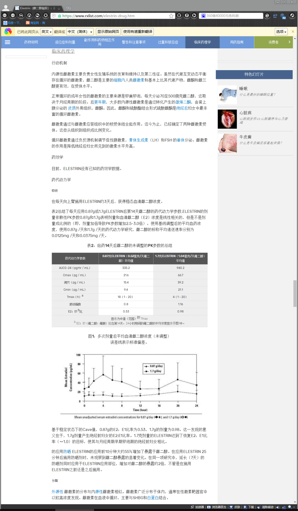
                        
1526426162001

                    

                </td>
            </tr>
<tr class="image-row">
                <td colspan="3">
                    

                        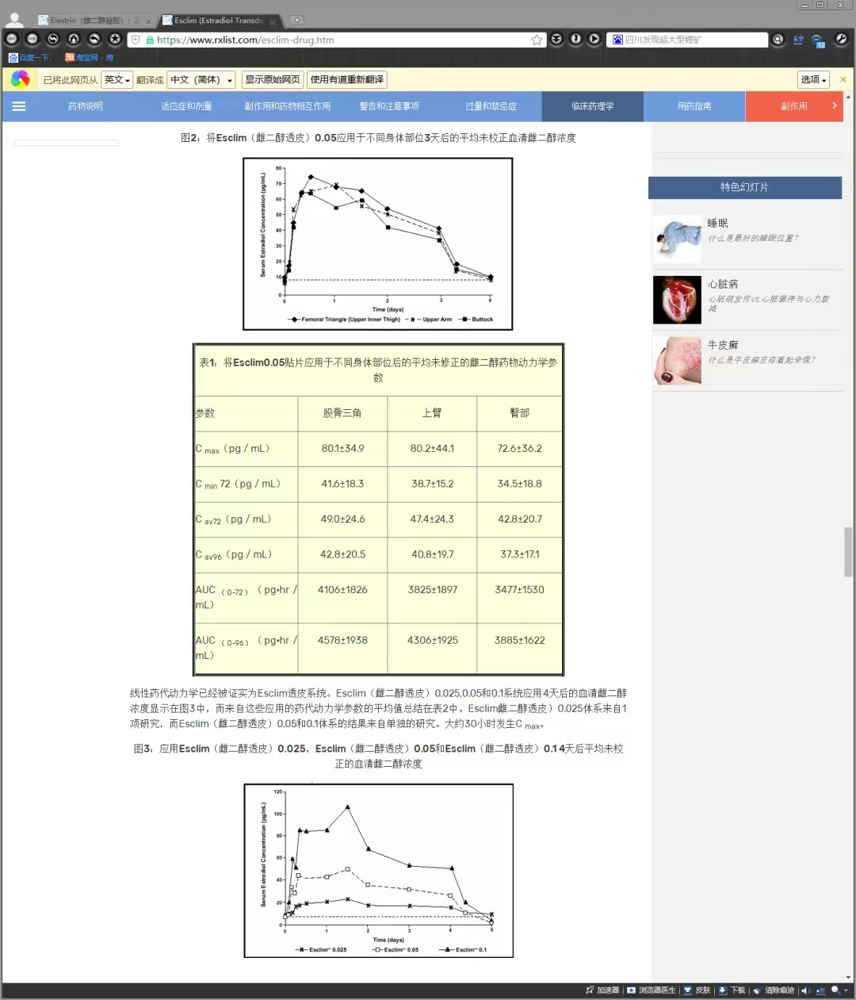
                        
1526426175586

                    

                </td>
            </tr>
<tr class="image-row">
                <td colspan="3">
                    

                        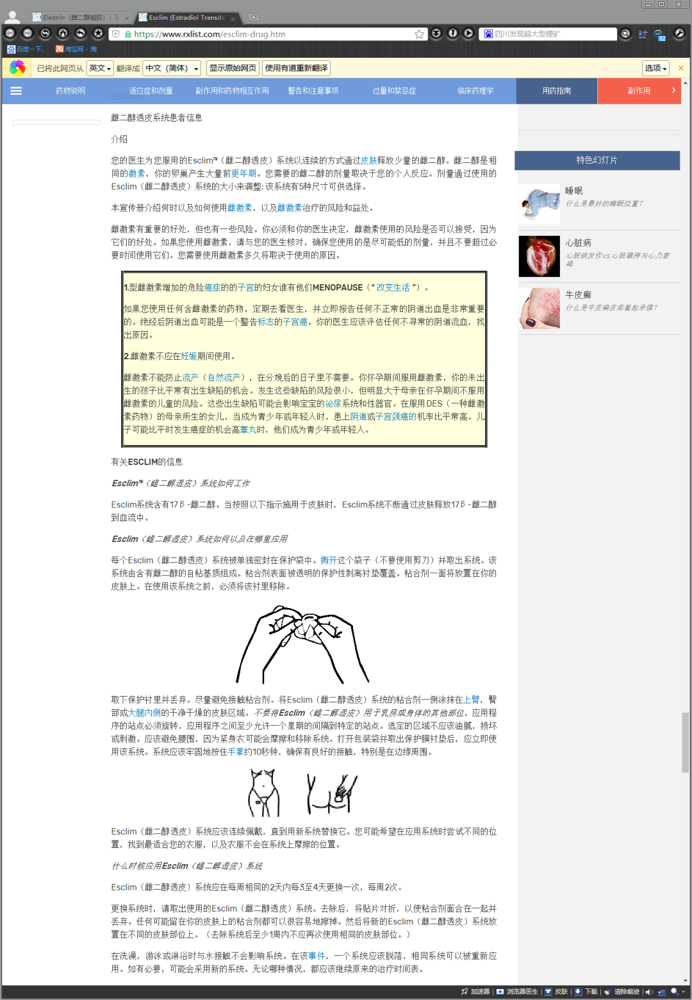
                        
1526426186219

                    

                </td>
            </tr>
<tr class="image-row">
                <td colspan="3">
                    

                        
                        
1526427703899

                    

                </td>
            </tr>
<tr class="image-row">
                <td colspan="3">
                    

                        
                        
1526427706959

                    

                </td>
            </tr>
<tr class="image-row">
                <td colspan="3">
                    

                        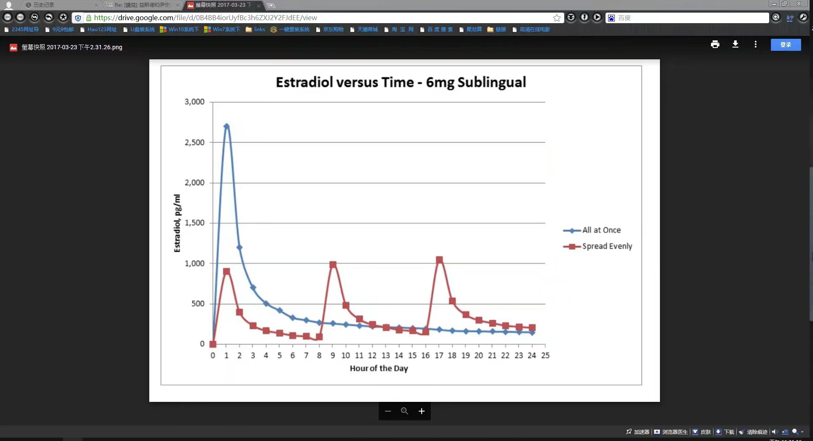
                        
1526427715724

                    

                </td>
            </tr>
<tr class="image-row">
                <td colspan="3">
                    

                        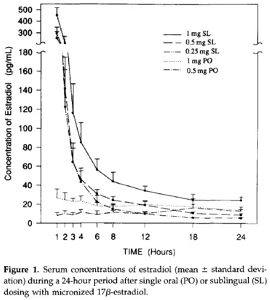
                        
1526427718296

                    

                </td>
            </tr>
<tr class="image-row">
                <td colspan="3">
                    

                        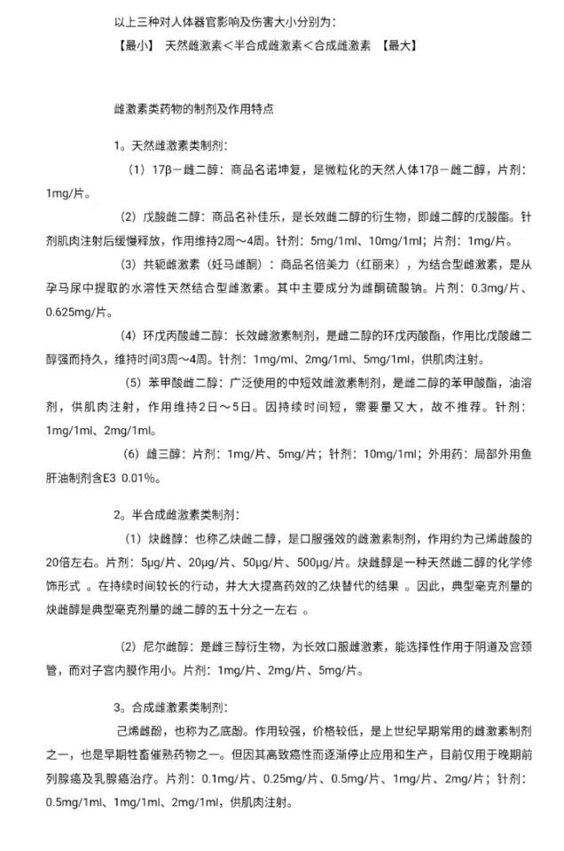
                        
1526427723238

                    

                </td>
            </tr>
<tr class="image-row">
                <td colspan="3">
                    

                        
                        
1526427732850

                    

                </td>
            </tr>
<tr class="image-row">
                <td colspan="3">
                    

                        
                        
1526427745255

                    

                </td>
            </tr>
<tr class="image-row">
                <td colspan="3">
                    

                        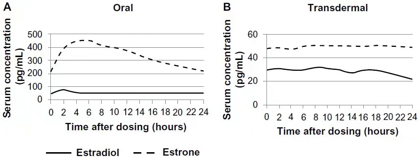
                        
1526427759136

                    

                </td>
            </tr>
<tr class="image-row">
                <td colspan="3">
                    

                        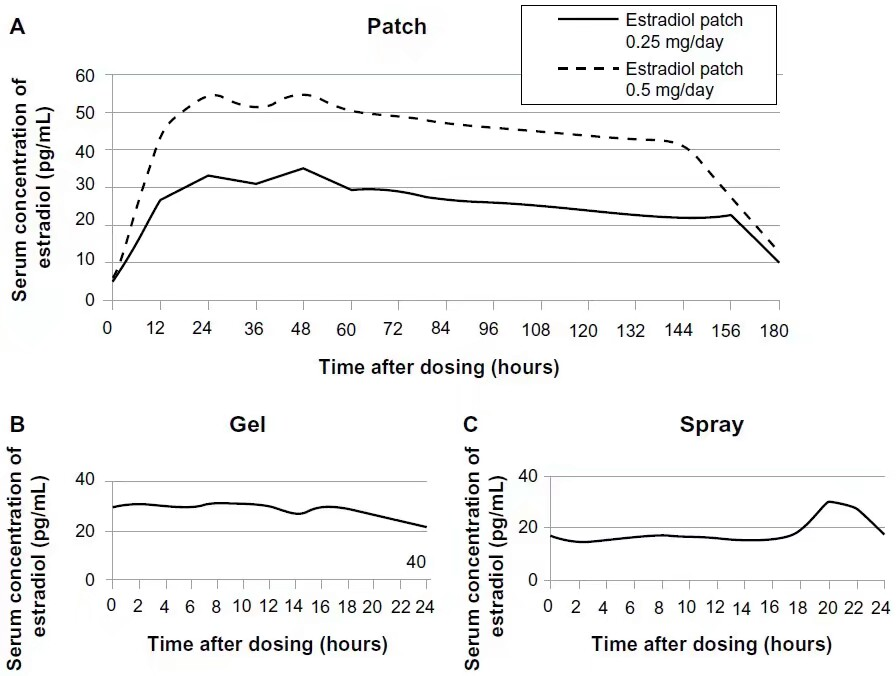
                        
1526427762624

                    

                </td>
            </tr>
<tr class="image-row">
                <td colspan="3">
                    

                        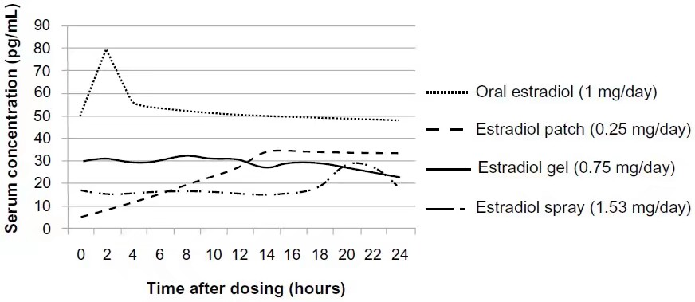
                        
1526427769871

                    

                </td>
            </tr>
<tr class="image-row">
                <td colspan="3">
                    

                        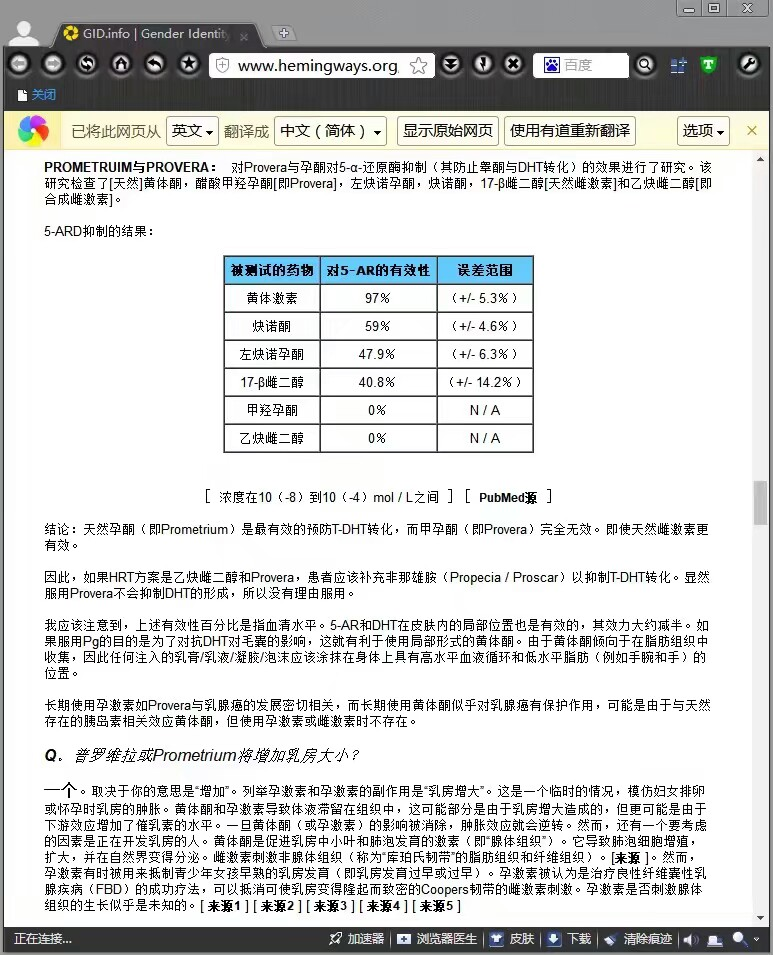
                        
1526427772589

                    

                </td>
            </tr>
<tr class="image-row">
                <td colspan="3">
                    

                        
                        
1526427775284

                    

                </td>
            </tr>
<tr class="image-row">
                <td colspan="3">
                    

                        
                        
1526427810918

                    

                </td>
            </tr>
<tr class="image-row">
                <td colspan="3">
                    

                        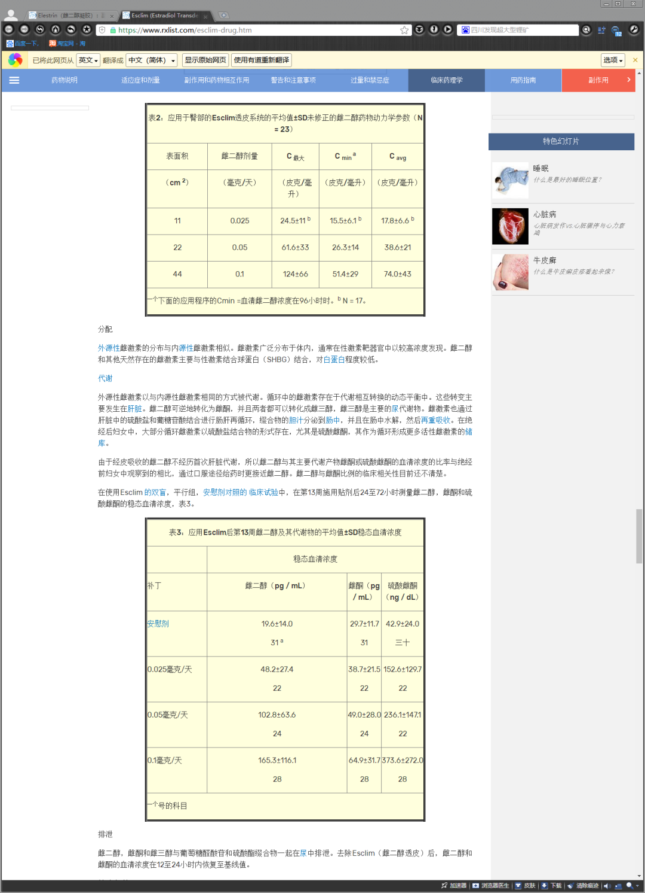
                        
1526427816985

                    

                </td>
            </tr>
<tr class="image-row">
                <td colspan="3">
                    

                        
                        
1526427822404

                    

                </td>
            </tr>
<tr class="image-row">
                <td colspan="3">
                    

                        
                        
1526427824640

                    

                </td>
            </tr>
<tr class="image-row">
                <td colspan="3">
                    

                        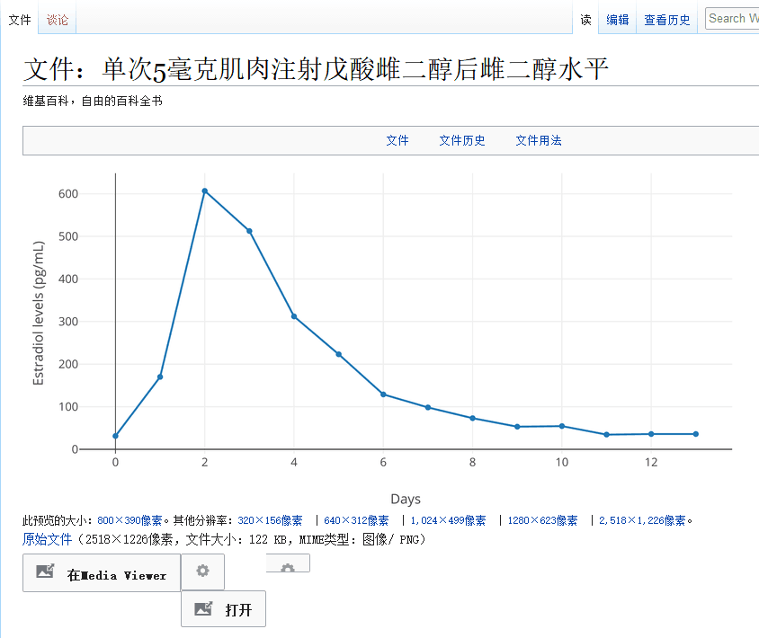
                        
1526427827672

                    

                </td>
            </tr>
<tr class="image-row">
                <td colspan="3">
                    

                        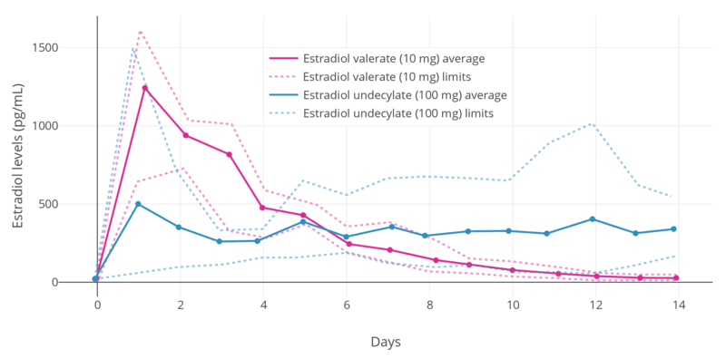
                        
1526427833528

                    

                </td>
            </tr>
<tr class="image-row">
                <td colspan="3">
                    

                        
                        
1526427836274

                    

                </td>
            </tr>
<tr class="image-row">
                <td colspan="3">
                    

                        
                        
1526483860457

                    

                </td>
            </tr>
<tr class="image-row">
                <td colspan="3">
                    

                        
                        
1526483916423

                    

                </td>
            </tr>
<tr class="image-row">
                <td colspan="3">
                    

                        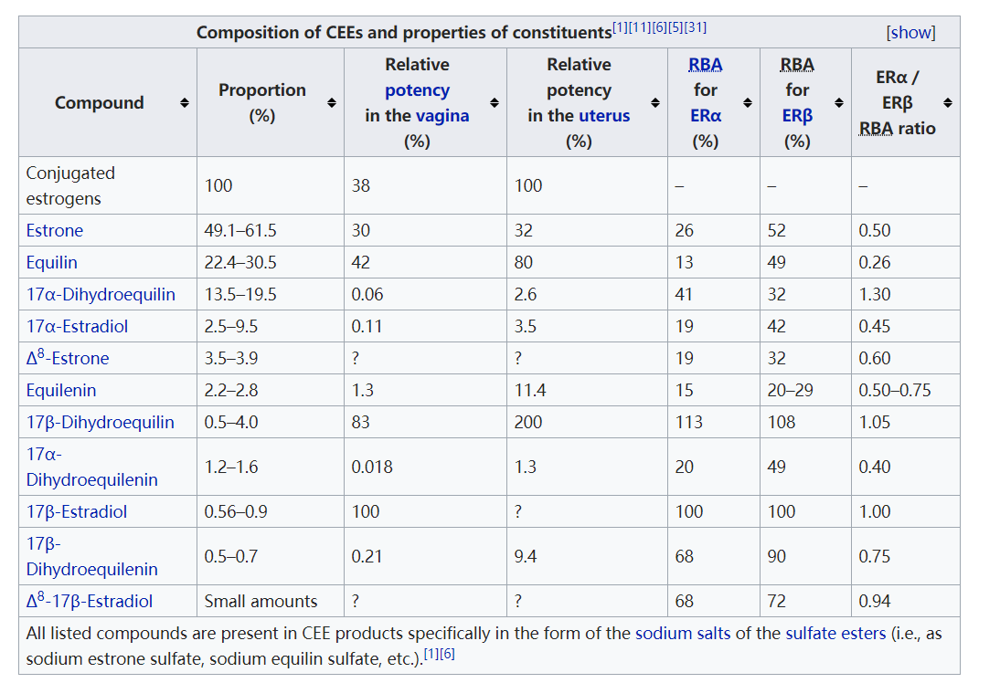
                        
1526483920787

                    

                </td>
            </tr>
<tr class="image-row">
                <td colspan="3">
                    

                        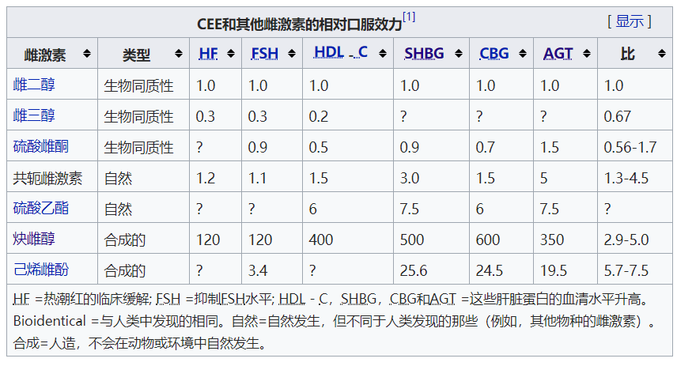
                        
1526483925359

                    

                </td>
            </tr>
<tr class="image-row">
                <td colspan="3">
                    

                        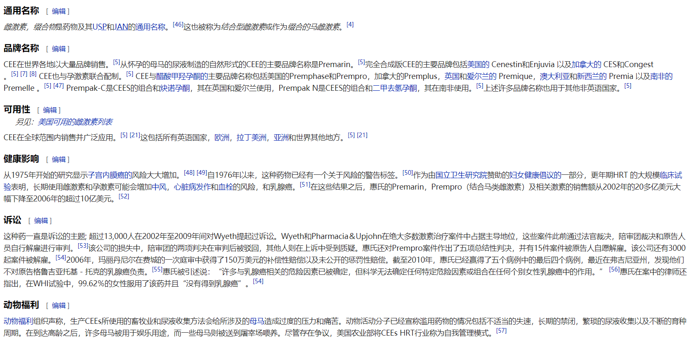
                        
1526483954945

                    

                </td>
            </tr>
<tr class="image-row">
                <td colspan="3">
                    

                        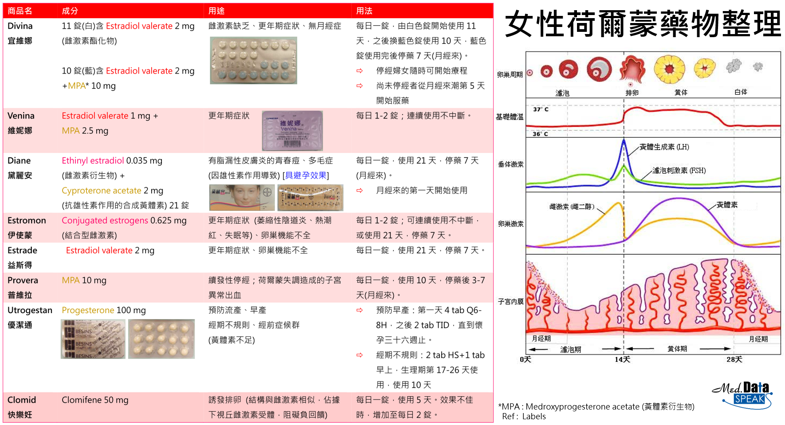
                        
1526484057156

                    

                </td>
            </tr>
</tbody>
</table>

 

=== "最多访问"

!!! note "自动生成说明"
    目录及摘要为自动生成，仅供索引和参考，请修改 .github/ 目录下的对应脚本、模板或对应文件以更正。
