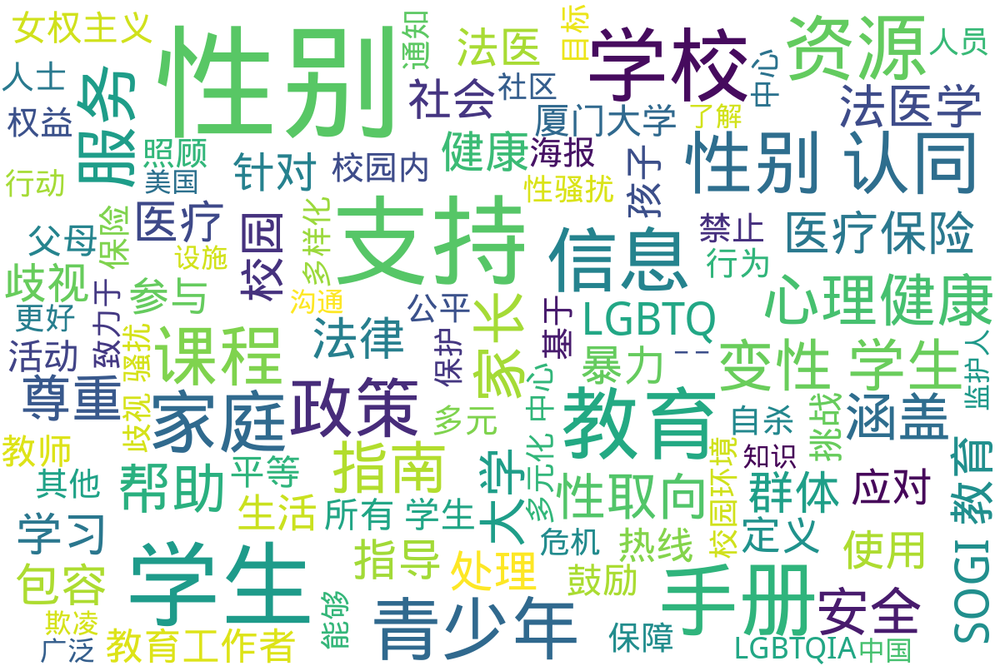

---
search:
  exclude: true
---

# 学校

该目录包含与学校及教育相关的跨性别社群和非政府组织的文件。这些文件可能涵盖学校内的支持资源、跨性别学生的权益保护信息、教育政策的变革等内容，以推动对跨性别群体的理解和接纳。

标签: `跨性别`, `学校`, `教育`, `社群支持`, `权益保护`, `非政府组织`

总计 26 篇内容

### 📄 文档

#### 2024

[性别手册学生版](性别手册学生版_page.md)

查看摘要

《性/别手册学生版》是为中央大学全体学生准备的一本详尽手册，主要围绕性和性别相关知识进行阐释和教育，旨在提升学生对LGBTQ群体及其社会环境的理解。手册由中央大学多元化中心于2024年发布。内容涵盖与性/别相关的基本用语、学生生活中的性别处理、有关校园设施的使用及多元化中心的服务。手册中强调了性别认同、性别表达等重要概念，并通过举例阐述如何在校园环境中更好地理解和支持性别少数群体。此外，手册提供了出柜的过程和意义，指导学生如何尊重他人的性别认同与性取向，同时也列举了咨询和支持的渠道，以确保每名学生能够在一个舒适和包容的环境中学习和生活。

[性别手册教职员工版关怀和应对_中央大学多元化中心](性别手册教职员工版关怀和应对_中央大学多元化中心_page.md)

查看摘要

《性/别手册教职员工版－关怀和应对》是由中央大学多元化中心于2024年发布的文件，目的是为学校的教职员工提供关于性别多样性的知识和信息，帮助他们创建一个包容和关爱所有学生的校园环境。手册的内容包含了对学生生活中可能涉及的性别问题的处理指导，诸如如何处理姓名和性别的使用、如何利用校园内的各种设施、以及教育实习和留学的相关指导等。手册中还详细探讨了相关法律政策、社会氛围，以及如何应对校园内的性别歧视和歧视性语言等重要问题。此外，手册引用了一些关键事件作为案例分析，如一桥大学的出柜事件，提醒教职员工避免替他人出柜的行为可能带来的严重后果。本手册不仅是对多样化环境的响应，还强调了教师在促进和谐校园文化中的重要角色。

[PDF_性取向和性别认同SOGI_给家长和监护人的信息__SOGI_包容性教育](PDF_性取向和性别认同SOGI_给家长和监护人的信息__SOGI_包容性教育_page.md)

查看摘要

该文件为《性取向和性别认同 (SOGI): 给家长和监护人的信息》的资料，旨在为父母和监护人提供关于跨性别及性别多元化的教育支持与信息。它涵盖了SOGI包容性教育的概念与重要性，强调教育工作者致力于创造一个公平、多样性和包容性的学习环境。文中指出，SOGI包容性教育并非单独课程，而是一套工具和资源，旨在减少校园中的欺凌和歧视，并支持所有学生，尤其是2SLGBTQ+社群成员。文件中列举了相关政策链接及对SOGI教育的误解与真相，强调资源的适合性以及家长在教育中所扮演的重要角色。

[PDF_性別手冊學生版](PDF_性別手冊學生版_page.md)

查看摘要

本文件为中央大学提供的《性别手册学生版》，旨在为该校全体学生提供与性别和性取向相关的知识和信息的汇总。手册的内容涵盖了性别和性取向的基本概念，包括性别认同、性别表达、性取向等，旨在提高学生对性别与性取向问题的认识和理解。从‘与性别的相关用语’到‘学生生活’的各项制度，手册详细列出了如何在校内安全、平等地处理性别问题的指南。手册中特别强调了多样性的重要性，向学生传达了多元、流动的性别认同和表达的概念以及‘出柜’这一过程的复杂性，且提供了中央大学多元化中心的咨询服务信息。此外，手册还包含了一些实际的校园政策，包括如何处理姓名和性别信息的更改，以及设施的使用，如洗手间和更衣室的安排。这本手册不仅是一个知识性的工具，也是促进校园内各性别与性取向群体相互理解和尊重的重要资源。

#### 2023

[PDF_LGBTQ_青少年资源_-_Fairfax_County_Public_Schools](PDF_LGBTQ_青少年资源_-_Fairfax_County_Public_Schools_page.md)

查看摘要

该文件是《LGBTQ+ 青少年资源》的指南，由费郡公立学校家庭资源中心发布。文件中提供了多种资源，帮助LGBTQ+青少年及其家庭找到所需的信息和支持，包括卫生与保健、精神健康和药物滥用、法律服务、互助小组及教育等方面。内容涵盖了全国自杀预防热线、特雷弗计划、青少年骄傲门诊和其他行动团体与服务提供者的信息，致力于帮助年轻的LGBTQ人群应对心理健康问题、法律权益、医疗保健等方面的挑战。文件中还列出了多家机构的联系方式及其服务内容，确保这些资源能为青少年及其家庭提供必要的支持和协助。该文件于2023年更新，显示了信息的时效性和适用性。

#### 2022

[PDF_费郡家庭生活教育](PDF_费郡家庭生活教育_page.md)

查看摘要

本文件为费郡公立学校七年级家庭生活教育课程的相关信息，涵盖情感与社交健康、青少年发展及家庭关系等多个主题。文件提及如学生需选择不参加课程的表格，提供了相应的填写说明和课程内容概述。课程内容包括理解中学期间身体、情感和性别认同的发展变化，强调使用尊重和包容的语言以促进无偏见和歧视的环境。此外，部分课程内容涉及互联网安全、个人隐私保护以及积极自我形象的培养。所有课程均为男女分班进行，并要求家长在希望孩子不参与特定课程时进行书面说明。

#### 2021

[密歇根州立大学禁止歧视反骚扰和禁止报复通知](密歇根州立大学禁止歧视反骚扰和禁止报复通知_page.md)

查看摘要

该文件为密歇根州立大学于2021年6月9日发布的通知，详细阐述了大学在各种项目和活动中对歧视、骚扰及报复行为的零容忍政策。文件指出，该校禁止基于多种因素（包括种族、性别认同、性取向等）对任何人进行歧视或骚扰，同时强调对举报者及参与调查的人员不予报复。大学公平办公室负责处理所有相关投诉，并会为受影响者提供必要的支持措施。文件中还列出了相关的法律法规，如美国残疾人法、消费者保护法等，以确保校园环境的公正与安全。此外，文件还提供了具体的举报途径和联系信息，确保大学社区成员能够方便地报告任何违反政策的行为。

#### 2020

[康涅狄格大学_包括性骚扰和基于性别的骚扰性侵犯性剥削亲密伴侣暴力政策](康涅狄格大学_包括性骚扰和基于性别的骚扰性侵犯性剥削亲密伴侣暴力政策_page.md)

查看摘要

本文件是康涅狄格大学（University of Connecticut）关于反歧视、反骚扰和相关反人际暴力的政策。文件详细阐述了校园内针对性骚扰、基于性别的骚扰、性侵犯、性剥削、亲密伴侣暴力、缠扰、报复等行为的禁止政策，以及相关的举报程序和调查流程。文件中的政策旨在创建一个安全且无歧视的学习与工作环境，让所有学生、员工和访问者都能在尊重和平等的氛围中生活和学习。具体包括政策声明，适用对象，隐私与机密的定义，员工的举报责任，禁止行为的定义，以及大学提供的资源与支持措施。政策明确规定了对违反上述禁止行为的人员可能采取的纪律处分，以及大学在处理这些报告时将采取的具体步骤。

[青少年面对COVID___LGBTQIA__健康和心理健康资源_NYC](青少年面对COVID___LGBTQIA__健康和心理健康资源_NYC_page.md)

查看摘要

此文件是一个关于青少年在COVID-19大流行期间所面临健康和心理健康挑战的综合资源指南，特别关注LGBTQIA群体。文件详细描述了青少年可能在隔离期间遇到的一系列问题，如情绪低落、家庭关系紧张，以及对健康信息的疑虑。它提供了纽约市各种可用的支持和服务资源，包括心理健康服务、远程医疗、家庭暴力支持、物质滥用预防和治疗等。

文件中明确指出，虽然大流行给青少年带来了许多困扰，但纽约市的多个机构和组织仍然为青少年提供了多种帮助。比如，Mount Sinai青少年健康中心为10-22岁的青少年提供全面的医疗和心理健康服务。此外，各种热线和在线支持资源，像NYC Well和Trevor Project等也为青少年提供情感支持和危机干预。

文件特别强调了确保心理健康的重要性，并鼓励青少年在面临困难时寻求帮助。针对心理健康、教育支持、家庭暴力、自杀预防等主题，文件一一描述了可用的具体资源，强调在疫情期间保护自身安全和心理健康的必要性。

#### 2018

[海华郡公立学校学生与家长手册_2018-2019](海华郡公立学校学生与家长手册_2018-2019_page.md)

查看摘要

本文件为海华郡公立学校2018-2019学年学生与家长手册。手册中详细列出了学校的各项服务、使用设备的政策、学生的行为规范、帮助家长理解学术要求和参与学生教育的方式。手册包括重要的联系信息，如学校的总机号码、各部门的电话以及青少年危机热线等。这本手册还强调学校致力于创造一个安全、包容、多元的学习环境，并鼓励各类背景的家庭参与到学校生活中。具体内容涵盖了学校安全条例、特教服务、餐饮服务、家庭作业指导、校规、投诉程序等，整体体现了对学生尤其是边缘群体如跨性别者等的支持与照顾。

[校园性别暴力预防教学手册](校园性别暴力预防教学手册_page.md)

查看摘要

《校园性别暴力预防教学手册》是由联合国教育、科学及文化组织（UNESCO）发布的一份教育资源，旨在为教师和学校领导提供针对中学生（适合11-14岁）关于预防校园性别暴力的指导。手册的内容涵盖了性别暴力的定义、背景、影响及其与生理性别和社会性别的关系。通过细致的术语表，手册为教师提供了有关性别认同、性别表现、性别暴力及其应对策略的深入理解。手册强调，教师在创建文明关系和预防校园暴力方面的重要角色，且提供了多个可行的课堂活动，帮助学生理解性别平等的重要性，并培养相应的沟通和处理暴力的技能。该手册还特别指出，跨性别、同性恋等群体在校园中可能面临的特殊挑战，鼓励教师通过教育来增进学生对性别多样性的理解和尊重。

#### 2016

[PDF_厦门大学学生医疗保险手册](PDF_厦门大学学生医疗保险手册_page.md)

查看摘要

该文件为《厦门大学学生医疗保险手册》，由厦门大学学生工作处于2016年7月编制，旨在为厦门大学的全日制学生提供详细的医疗保险信息。手册中介绍了厦门大学的学生医疗保险制度，包括基本医疗保险、补充医疗保障、补充商业保险的定义、参保范围、就医医院范围、转外就医的办理程序及保险待遇等方面的内容。手册详细解释了大学生医疗保险的基本定义及其重要性，并强调了医疗保险对于保障大学生的医疗卫生权益的重要作用。此外，手册还包括针对新生和老生的参保和缴费流程，以及需要注意的特殊问题和相关开药指南。该文件对了解和使用厦门大学医疗保险制度至关重要，是参保学生的实用手册。

#### 2007

[社会性别与社会_复旦密西根大学课程概况_2007](社会性别与社会_复旦密西根大学课程概况_2007_page.md)

查看摘要

本文件是复旦大学与密西根大学合作开设的社会性别学博士课程的课程概况，授课时间为2007年8月11日至8月21日。该课程由美国女权主义社会学家朱迪斯·斯泰西教授主讲，主要内容涵盖了西方社会学界女权主义学术的发展以及相关的学术探讨。此外，课程还邀请了若干中国学者就其研究和行动开设专题讲座，旨在帮助学员理解和思考西方女权主义与中国女权主义的关系。课程设置多样，学生需完成三篇基于选定主题的短评，讨论女权主义研究面临的挑战及其对中国社会性别研究的启示。

#### 时间未知，按收录顺序排列

[跨性別和性別多樣化青少年父母和照顧者的](跨性別和性別多樣化青少年父母和照顧者的_page.md)

查看摘要

该文件为温哥华教育局发布的小册子，旨在为跨性别和性别多样化青少年的父母和照顾者提供疑问解答和相关支持信息。内容包括对跨性别和性别多样化青少年的介绍，强调每个年轻人都应该有良好的自我感觉，获得支持和安全感。文件中指出，父母和照顾者的支持对孩子的心理健康至关重要，提供了如何与孩子沟通性别认同、如何理解和尊重孩子的性别表达的具体建议。此外，文本还涵盖了对性别多样化的定义、父母如何应对偏见和歧视、以及可用的医疗资源与法律保护等重要信息。解决了许多家长可能会面临的常见问题，例如孩子如何确定自己的性别认同，何时应寻求专业人员的帮助，如何在家庭内部建立正面的讨论氛围等。同时，本小册子还提供了丰富的资源链接，帮助父母和照顾者找到相关的支持和教育信息。

[主题变性学生支持指南_关键术语定义](主题变性学生支持指南_关键术语定义_page.md)

查看摘要

这份《变性学生支持指南》旨在帮助学校社区更好地支持变性学生。这本指南提供了针对变性学生的基本定义和关键术语，例如"性别认同"、"性别表达"、"出生指定性别"等，为教育者和学校管理人员提供在处理与变性学生相关问题时的参考。文中强调，变性学生的需求是个性化的，学校需根据实际情况与学生及其家长共同探讨并制定适合的支持方案。

文件中提到，变性学生在校园内应被尊重性别认同，包括使用与其性别认同相符的更衣室和洗手间。此外，学校不得基于出生性别对变性学生进行歧视，具体法律条款也在文中详细列举，说明了变性学生在使用设施、参加体育活动以及其他基于性别的活动中所享有的权利。

特别提到的支持措施包括学校向所有学生（及其家长）发放年度通知，详细告知变性学生相关的权利与请求支持的方式，利用多种方式促进校园内的理解与包容。此指南将有助于教育工作者创建一个更包容、安全的校园环境，让所有学生可以真实表达自我，保证他们的安全与尊重。

[PDF_教育工作者看如何關顧跨性別人士](PDF_教育工作者看如何關顧跨性別人士_page.md)

查看摘要

该文件为PDF格式的指南，标题为《教育工作者看如何照顾跨性别人士》，旨在为教育工作者提供有关如何更好地支持跨性别学生的建议和策略。尽管我们无法提取文件内容，但可以推测文件中可能包含的要点包括如何创造安全和包容的学习环境，理解跨性别群体所面临的特定挑战，以及教育工作者在促进性别平等和尊重多样性方面的角色。此外，文件可能会涉及跨性别人士在学校中可能遭受的歧视、情感支持的方法、如何与家长沟通等议题。这种支持不仅对于跨性别学生的成长和学习至关重要，还帮助整个学校社区培养尊重与理解。

[PDF_STUDENT_-_SECURE_-_cdninternationalstudentcom](PDF_STUDENT_-_SECURE_-_cdninternationalstudentcom_page.md)

查看摘要

该文件是关于ISI留学医疗保险计划的介绍手册，主要为留学生提供医疗保险相关信息。手册详细列出了如何就医、保险计划的保障内容、计划费用、理赔信息及其保障条款等。内容包括一卡通的优缺点、如何处理与医疗网络内外就医的索赔，以及不同保险计划的费用范围等。例如，手册提到，在美国，组合医疗保险提供不同的保障类型，包括Smart、Budget、Select和Elite四个等级，每个等级的费用和保障限额各不相同。此外，手册中强调了隐私政策，并提供了联系信息以便留学生在需要时寻求帮助。

[PDF_国立大学咨询辅导中心](PDF_国立大学咨询辅导中心_page.md)

查看摘要

该文件是来自澳大利亚国立大学咨询辅导中心的资源指导，专为男同性恋、女同性恋、双性恋、变性人、跨性别者和其他性别认同与性取向群体提供支持与帮助。文件详尽列出了多项支持服务，包括大学的酷儿部门与学生平权小组，提供社交活动及心理支持等。内容强调人们有权决定自己的性行为，呼吁对跨性别和酷儿群体的尊重与包容，并列举了多个具体的外部支持资源与服务机构，如堪培拉艾滋病行动委员会和性别中心等。最后，文件提供广泛的联系信息，包括电话、邮箱和网站，方便读者寻求帮助。

[PDF_協助同志與多元性別兒童及青少年建立健康未來的家人接纳计划海报_sfsu.edu](PDF_協助同志與多元性別兒童及青少年建立健康未來的家人接纳计划海报_sfsu.edu_page.md)

查看摘要

该文档是关于家人接纳计划（Family Acceptance Project®, FAP）的海报，旨在教育家庭成员、医疗人员及宗教信仰领袖更好地理解家庭的接纳对于同志儿童及青少年的健康成长的重要性。文中强调，家人的支持能够显著降低同志儿童和青少年自杀和其他健康问题的风险。海报提供了减少排斥性言行的建议，并指导家长如何通过爱与支持来改善孩子的自尊心和未来展望。此外，文档详细介绍了海报的使用潜径，包括学校、诊所、社区活动和家庭等各种场合。该计划自2002年起就致力于支持多元文化家庭，在心理健康、初级医疗、学校服务等多个领域广泛应用。

FAP海报的内容通过研究证实，有助于提升社会对同志群体的理解与尊重，并促进家庭对儿童及青少年的健康影响。语言适用性也多样，涵盖中文、英文、西班牙文等多种语言，目标是服务更广泛的群体。

[PDF_Cover_Page_校长致辞作为学校的家人保持联系_-_Mason_Families](PDF_Cover_Page_校长致辞作为学校的家人保持联系_-_Mason_Families_page.md)

查看摘要

本文件是乔治梅森大学为新学年准备的欢迎信，主要内容为校长Gregory Washington致家长和家庭的致辞以及学校新生和家庭计划（NSFP）的介绍。校长在信中对新学年表示欢迎，并强调了梅森大学在多样性和创新方面的成就，以及家长和家庭在学生成功中的重要作用。他鼓励家庭积极参与学校活动，促进与学生的联系，并提供了多种资源和支持渠道，包括家长和家庭委员会的介绍、家庭支持系列、家庭周末和其他活动的日期和信息。此外，文件还列出了2024年学年重要日期，提供了学生和家庭保持联系的多种方式，以及如何在梅森大学的环境中促进学生的学业与成长。

[PDF_性取向和性别认同](PDF_性取向和性别认同_page.md)

查看摘要

该文件是关于性取向和性别认同（SOGI）的包容性教育的综合介绍，详细阐述了这些主题在学校教育中的应用和重要性。文件首先定义了SOGI教育，并强调它并不只是一门独立课程，而是融入了更广泛的性教育中，涵盖了身份和包容性等诸多主题，旨在减少校园内的欺凌和歧视。其内容提供了针对SOGI教育的一些常见误解与相应事实，目标在于教育师生理解多样性，创造一个支持和包容所有学生的安全环境。

此外，文件指出SOGI教育致力于为所有学生提供支持，并强调其重要性，尤其是对于那些面对独特挑战的2SLGBTQ+学生。通过使用丰富的教学资源，SOGI教育帮助教师在各学科中促进尊重和包容的环境，反映出一个多元文化的学校氛围。同时，文本还强调与家庭的沟通，为家长和监护人提供信息，确保他们了解SOGI教育的价值与目标，鼓励他们参与孩子的教育，确保孩子在学习过程中感到安全和受尊重。

[PDF_主題變性學生支持指南_關鍵術語定義_-_Hawaii_DOE](PDF_主題變性學生支持指南_關鍵術語定義_-_Hawaii_DOE_page.md)

查看摘要

《变性学生支持指南》是针对学校如何支持变性学生的具体指导文件，旨在为学校和教育工作者提供对变性学生的基本理解以及最佳实践。这份指南详尽地阐述了与变性学生相关的关键术语，例如‘性别认同’、‘性别表达’和‘性别不确定’等，并强调了变性学生在学校环境中所面临的挑战与需求。文中提到，变性学生的需求高度个性化，因此学校工作人员需关注每名学生的具体情况，尽可能尊重其性别认同和表达。此外，指南中阐述了如何在学校内营造一个安全的学习环境，确保变性学生能够在不受歧视的情况下参与所有学校活动。相应的法律法规也被纳入讨论，确保学生在学校中享有平等待遇。

[PDF_心理健康资源_portland_public_schools](PDF_心理健康资源_portland_public_schools_page.md)

查看摘要

该文档是由俄勒冈州的波特兰公立学校（Portland Public Schools）提供的心理健康资源指南，旨在帮助那些有自杀倾向或者心理健康问题的人及其家属，提供各种求助热线的信息。文中列出了一系列热线和服务，包括针对成年人的Call to Safety、俄勒冈州的DHS热线、危机服务热线以及支持跨性别者的专门热线等。每项服务都清晰地标注了是否提供口译服务，以确保不同语言背景的人都能获得支持。此外，该资源文本强调了心理健康的重要性及可用的支持选项，并鼓励人们在面临心理困扰时，不要犹豫地寻求帮助。

[Laurel_Ridge小学社区利益相关者论坛倡议](Laurel_Ridge小学社区利益相关者论坛倡议_page.md)

查看摘要

该文件是关于Laurel Ridge小学公平团队筹办的一个社区利益相关者论坛的通知，旨在邀请学生家长、照顾者及社区成员分享他们在学校的多元化和公平经历。论坛特别关注来自不同背景的意见，包括双语人士、特殊教育需求的家庭、LGBTQIA+社群（包括同性恋、双性恋、变性人等），以及黑人、土著、有色人种（BIPOC）家庭。此外，文件提到将进行匿名访谈，以更好地倾听这些声音。论坛的目标是增进社区成员之间的交流与理解，促进更加公平和包容的学校环境。该通知中涵盖了参与方式及联系人信息，以便家庭能够参与到这一重要的对话中。

[学校性骚扰应对指南](学校性骚扰应对指南_page.md)

查看摘要

本文件《学校性骚扰应对指南》提供了针对学校内性骚扰和性侵犯的应对措施与法律保护信息，旨在帮助学生了解他们在面对性骚扰或性侵犯时的权利和可采取的措施。文件强调，学生有权在一个没有性骚扰和性侵犯的环境中上学，学校有责任保护学生免受骚扰，包括在校内和校外的环境。

指南中详细说明了如何保存证据，包括在遭遇袭击后应尽量保留相关物证，以及如何处理电子证据等。文件建议在受到性骚扰或侵犯后联系RAINN（国家性侵犯网络）获取专业支持，提供24小时的咨询服务。同时，文件还列出了多个重要的资源和求助热线，包括为青少年和LGBTQ+群体提供危机干预的资源，强调维权人士如何帮助受害者安全回到学校并维护其隐私权。

[人權教育教案_性別與職業影響](人權教育教案_性別與職業影響_page.md)

查看摘要

该文件为《人权教育（含转型正义）教案征件竞赛》的投稿，标题为「性」你一回，「别」和我说你不行动。文件详细介绍了一系列为国中三年级学生设计的教案，旨在引导学生理解性别刻板印象及其对职业选择的影响。教案强调通过桌游等互动形式，使学生在轻松的氛围中学习性别议题，培养其性别意识和人权意识。内容涵盖了课程的设计理念、学习情境、教学目标与评量标准。课程涉及多元性别的探讨，试图让学生认识性别与职业选择之间的复杂关系，同时鼓励他们通过实际行动反思与改变自己的环境。文件还讨论了如何通过具体的教学活动帮助学生认识到社会中的性别不平等，并最终设计出自己的倡议行动。

### 词云图

> 本内容为自动生成，请修改 .github/ 目录下的对应脚本或者模板
