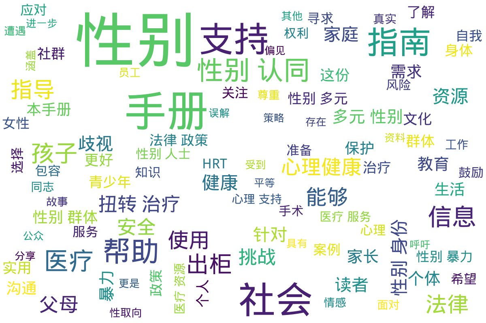

---
search:
  exclude: true
---

# 手册指南

!!! info

    该目录下收录的资料主要是关于跨性别医疗照护、法律政策和社会环境的内容，致力于为跨性别群体提供实用信息与支持。，《2022版跨性别医疗照护手册》是一份综合性的指南，为跨性别个体在医疗体系中的经历提供了详细的理解，并涵盖激素治疗、手术选择及法律权益等方面的重要信息。手册通过多位跨性别人士的真实故事，揭示了他们可能面临的现实挑战，借此希望提高医疗界的敏感性和包容性。该手册汇集了多个医疗资源链接，帮助跨性别个体更好地获得所需的支持与服务。
    
    《Gossip Boys and Girls》则为香港的跨性别人士提供了丰富的文化与社会环境探讨，强调跨性别者身份与性倾向的复杂性，并反映了他们在传统文化下所遭遇到的挣扎与误解。它不仅试图促进对跨性别群体的理解，还讨论了相关个案以展示文化背景对跨性别个体的影响。《BSA指南：有关性别认同问题的投诉》为公众和媒体提供了关于性别认同的重要指导，指明媒体在报道相关话题时需保持敏感与谨慎，确保不再中伤或误解跨性别群体。
    
    文献中频繁提及的激素替代疗法（HRT）相关资料则深入探讨了为跨性别女性提供的激素治疗方式与考虑事项，确保患者在接受治疗时能具备充分的知识与准备。而数字暴力的报道指南则着重于如何在新闻报道中处理针对性别群体的暴力问题，强调了媒体在面对这些敏感话题时的道德责任。
    
    从《社群指南：性少数性工作者经历的恐同与恐跨性别》到《反暴力手册》，目录内容涵盖了跨性别者所面临的多重社会问题与健康挑战，明确了法律改革与社会支持的重要性。整体而言，该目录不仅着眼于医疗与法律的交集，更强调跨性别群体在社会环境中的生存状况，通过各种手册与指南促进理解与积极变革，为跨性别个体提供支持与希望。

!!! note "📊 统计信息"

    总计内容：58 篇
    标签：`跨性别医疗照护` `跨性别故事` `法律与政策` `激素替代疗法` `数字暴力` `健康指南` `跨性别权益` `性别认同` `社会环境` `支持资源`

### 📄 文档

<table>
<thead><tr>
<th style="width: 40%" data-sortable="true" data-sort-direction="asc" data-sort-type="text">标题 ▲</th>
<th style="width: 15%" data-sortable="true" data-sort-direction="desc" data-sort-type="year">年份 ▼</th>
<th style="width: 45%">摘要</th>
</tr></thead>
<tbody>
<tr data-name="2022版跨性别医疗照护手册" data-year="2022" data-date="2025-01-18">
                <td><a href="2022版跨性别医疗照护手册_page" class="md-button">2022版跨性别医疗照护手册</a></td>
                <td class="year-cell">2022</td>
                <td class="description-cell">

                    
展开

                    

                        《2022版跨性别医疗照护手册》是一本专为跨性别群体设计的实用指南，旨在提升跨性别人士在医疗系统中的获得感和满意度。本手册涵盖跨性别医疗照护的方方面面，包括医学知识、心理健康支持、法律权益、以及如何选择合适的医疗服务等内容。手册的主要目标是帮助跨性别个体更好地理解自己的医疗需求，同时为医疗工作者提供指导，帮助他们更好地支持跨性别患者。手册中详细描述了跨性别个体可能面临的医疗挑战，包括激素治疗的副作用、手术选择的利弊、以及健康检查的必要性等。手册还加入了多位跨性别人士的真实生命故事，展示了他们在医疗过程中所经历的各种情况，这些故事既有积极的成功案例，也有一些令人痛心的遭遇，体现了在医疗环境中缺乏包容性的现状。通过这些真实的记录，读者能够获得更深刻的理解以及更多的共情。

该手册也提供了一些重要的资源链接，包括跨性别友好的医疗机构名单、心理咨询服务的信息，以及相关的法律援助资源。手册在编写过程中咨询了多位医疗专业人士及跨性别权益倡导者，确保所提供的信息准确且具有针对性。在法律政策方面，手册讨论了当前针对跨性别人士的相关法律法规，以及如何在法律框架内维护自身权益。

整体而言，《2022版跨性别医疗照护手册》不仅是一本临床指导手册，更是一本关怀与支持的资料，通过综合的医疗、法律与情感支持信息，为跨性别群体提供一个全面的参考。这本手册在保证医学信息科学性的同时，也注重情感支持的具体措施，确保跨性别人士在医疗过程中能够获得全方位的关怀与帮助。
                         年份：2022
                         收录日期：2025-01-18
                    

                
</td>
            </tr>
<tr data-name="Gossip_Boys_and_Girls_-_跨性別資源中心" data-year="2012" data-date="2024-11-02 02:39:31">
                <td><a href="Gossip_Boys_and_Girls_-_跨性別資源中心_page" class="md-button">Gossip_Boys_and_Girls_-_跨性別資源中心</a></td>
                <td class="year-cell">2012</td>
                <td class="description-cell">

                    
展开

                    

                        《是非男女：Gossip Boys and Girls》是一本面向香港本土跨性别人士的阅读手册，旨在提供有关跨性别身份及其社会环境的深入理解。该手册通过多元的视角，探讨了跨性别人士在社会主流文化下的挣扎与无奈，揭示了跨性别者与社会之间的隔阂和误解。手册开篇主旨明确，突出跨性别者的性别身份与性倾向的复杂性以及在社会上受到的困扰，其中提到：\"跨性别人士的性别身份，和其性倾向的挣扎与含糊，都容易挑动普遍社会价值观人士的神经。\"这句话深刻指出了社会对于跨性别群体的偏见与无知，从而引发的质疑与争议。进一步地，手册不仅仅是为了解释跨性别的概念，更是为了促进社会对这一群体的理解和包容。书中有提到的个案故事，如Mandy的故事，通过真实个人经历展现了性别认同的流动性与多样性，挑战了传统的性别二元论。

在书中，还探讨了跨性别与同性恋的关系，同时指出跨性别群体的多样性和复杂性，包括性别认同的流动特性。正如手册所言，跨性别现象并不单一，它广泛存在于不同文化与地区中。作者讨论了如何打破对于性别的固有理解，认为性别是一个流动的且可变的特征，跨性别人士的经历正是这一点的最佳证明。

该手册不仅是为了记录跨性别者的现状，更是一种呼声，提醒我们去重视并关心这些被边缘化的个体。作者通过自己的经历和跨性别资源中心的努力，期望能在社会中创造一个更为平等与包容的氛围。最后，手册呼吁社会各界更加重视跨性别者的权利与需求，强调了教育的重要性，以消除歧视与误解。\"希望这本书能够提供一个平易的管道，让人们认识与理解跨性别群体。\"这样的理念将成为本手册的核心精髓，激励着每一个读者去反思并行动。
                         年份：2012
                         收录日期：2024-11-02 02:39:31
                    

                
</td>
            </tr>
<tr data-name="PDF_BSA_指南有关性别认同问题的投诉" data-year="2023" data-date="2025-01-18">
                <td><a href="PDF_BSA_指南有关性别认同问题的投诉_page" class="md-button">PDF_BSA_指南有关性别认同问题的投诉</a></td>
                <td class="year-cell">2023</td>
                <td class="description-cell">

                    
展开

                    

                        该文件为《BSA指南：有关性别认同问题的投诉》，是由某主管机构发布的指导性文件，专门探讨了性别认同问题在社会和媒体中所引发的投诉及其相关背景。这份指南强调了性别认同这一问题在社会中的重要性，并揭示了公众对这一问题的高度分化和争议。文件中提到，随着社会对性别认同的理解不断深化，相关的投诉快速增加，尤其是在跟踪和评估广播电台及其他媒体关于性别认同的播出节目时。

文件开始阐述什么是性别认同，指出其是一个人对自身性别的内在感受。BSA的指南明确了性别认同的问题并非现代现象，指出在一些文化中，性别的多样性得到了接受和认可。例如在新西兰，特定的土著人民拥有独特的性别身份认同。通过这样的信息，该指南强调了多元性别者在公共话语中的重要性和合法性。

文件还明确指出，跨性别人士作为一个受保护的社群，享有与其他社会群体一样的法律保护，但同时也存在受到歧视的风险。指南提醒媒体和公众在描述相关问题时，需保持敏感和谨慎，避免造成针对跨性别者的潜在伤害。性别错称和弃名错称被特别提及为对跨性别和非二元性别人士的普遍伤害，而管理局也将基于具体情况对相关播出内容做出评估，以维护言论自由与个人权利的平衡。

指南也探讨了语言随着时间的变化而不断演化的重要性，鼓励与时俱进，接受和融入包容性语言的使用，并且在报告中提到，包容性语言在一定情况下不太可能违反播放标准，这体现出对性别多样性的尊重与理解。这一部分对于如何处理相关话题提供了现实的指导，并在一定程度上帮助消解社会中的偏见与误解。最后，文件总结了大量的案例决策，作为未来投诉的参考依据，在系统性与科学性上为管理局的决策提供了支撑。
                         年份：2023
                         收录日期：2025-01-18
                    

                
</td>
            </tr>
<tr data-name="PDF_HRT_激素替代疗法HRT_NHS_SCOTLAND" data-year="None" data-date="2024-11-07 18:54:42">
                <td><a href="PDF_HRT_激素替代疗法HRT_NHS_SCOTLAND_page" class="md-button">PDF_HRT_激素替代疗法HRT_NHS_SCOTLAND</a></td>
                <td class="year-cell">None</td>
                <td class="description-cell">

                    
展开

                    

                        该文件为《激素替代疗法HRT的手册指南》，旨在为那些经历绝经的女性提供有关激素替代疗法（HRT）的详细信息。文件内容涵盖了HRT的基本知识，包括其作用、适用人群、不同类型的HRT、用法和剂量等。激素替代疗法是通过补充体内雌激素和孕激素，来缓解绝经带来的多种不适症状，如潮热、情绪波动和阴道干燥等。通过血液检测，可以判断是否适合开始HRT，尤其对40-45岁之间的女性来说，可能会进行相关测试以评估激素水平。文件进一步说明了HRT的两种主要类型：复方HRT和单药雌激素HRT，适用于不同的健康状况和病史的女性。疗法的起始剂量通常较低，根据个人需要可能会逐步增加。文件也提到出现副作用的可能性，如腹胀、情绪波动等，建议患者在开始治疗后观察几个月以评估疗效，如有不适应与医疗专业人员沟通，以便做出适当的调整。

文件中提供了多种给药方式，包括药片、皮肤贴片、植入剂等，方便用户根据个人情况选择适合的使用方法。对于一些患者来说，由于健康历史或其他原因，HRT可能并不适合，这种情况下，医疗服务提供者会推荐其他的替代方案来帮助患者管理绝经症状。总体来说，该文件不仅提供了HRT的相关信息，也强调了与医疗专业人员沟通的重要性，以达到最佳的治疗效果。
                         年份：None
                         收录日期：2024-11-07 18:54:42
                    

                
</td>
            </tr>
<tr data-name="PDF_数字暴力报道提示单记者和媒体的实用参考指南" data-year="2021" data-date="2024-11-07 20:01:27">
                <td><a href="PDF_数字暴力报道提示单记者和媒体的实用参考指南_page" class="md-button">PDF_数字暴力报道提示单记者和媒体的实用参考指南</a></td>
                <td class="year-cell">2021</td>
                <td class="description-cell">

                    
展开

                    

                        本文件是《数字暴力报道提示单：记者和媒体的实用参考指南》的PDF文档，出版于2021年11月25日，旨在为记者及媒体提供在报道数字暴力时的实用指导。数字暴力，包括在线骚扰和仇恨言论等，是一个日益严重的问题，尤其在随着技术发展而日益扩大的网络环境中更为突出。指南中明确了数字暴力的定义，即“技术促成的性别暴力”，并强调这类暴力行为根植于性别不平等和性别规范之中，通常通过信息和通信技术得以实现。这样的暴力不仅对个人造成心理和职业上的影响，还会在更广泛的社会中导致对性别平等的损害，增加对性别化暴力的容忍度。

文件中提到，数字暴力的施害者可以是个体、国家或其他团体，其行为往往针对女性和女童，但同时也对有色人种、LGBTQI群体等边缘化社群构成威胁。值得注意的是，数字暴力的幸存者面临失业、名誉受损、心理健康问题等一系列负面后果，而施害者的行为则致使幸存者被排除在公共生活和政治参与之外，进一步加深了性别歧视和不平等的现象。

在文件中，记者在报道数字暴力时应避免将其简单化为“网络喷子”或“欺凌”，而应视其为一种更为复杂的社会问题。指南提到，记者要追究权力者的责任，而不是将责任归咎于幸存者。文件提供了多项原则，比如在采访中确保悲剧幸存者的知情同意，使用恰当的语言表述暴力行为，并强调数字暴力的解决方案和对抗网络暴力的努力。此提示单还强调，不应通过报道仇恨言论而助长更多的暴力行为。

最后，文件还列出了其他相关资源，提供了科学研究的结果与案例，表明数字暴力在各国女性和女童群体中的影响，尤其是在疫情期间，网络暴力的情况有恶化的趋势。总之，这份指南不仅为媒体工作者提供了理论框架与实践指导，同时也希望通过提高公众意识，促使社会与政府采取必要的措施，来抵制和消除数字暴力现象。
                         年份：2021
                         收录日期：2024-11-07 20:01:27
                    

                
</td>
            </tr>
<tr data-name="PDF_社群指南_性少数性工作者经历的恐同与恐跨性别" data-year="None" data-date="2024-11-07 19:50:12">
                <td><a href="PDF_社群指南_性少数性工作者经历的恐同与恐跨性别_page" class="md-button">PDF_社群指南_性少数性工作者经历的恐同与恐跨性别</a></td>
                <td class="year-cell">None</td>
                <td class="description-cell">

                    
展开

                    

                        《社群指南：性少数性工作者经历的恐同与恐跨性别》是一份针对性少数性工作者面临的恐同和恐跨性别问题的详细文档。该手册深入探讨了性少数群体的生活现实，尤其是男同性恋、女同性恋、双性恋以及跨性别者在社会和法律框架下遭遇的歧视与暴力。顾名思义，性少数性工作者在其身份和职业中常常面临双重的边缘化，他们不仅受到性工作者身份的歧视，还受到社会对性取向和性别身份偏见的影响，导致更高的权利侵害风险与医疗歧视。

文件中指出，性少数性工作者的经历通常受到法律、政治和社会环境的深刻影响。例如，许多国家仍将同性关系和跨性别身份的行为刑事化，这种基于过时道德宗教信仰的法律惩罚加剧了社会对性少数群体的恐惧和歧视。该指南强调了法律改革对改善性少数性工作者生活条件的重要性，指出即使法律已去罪化，针对这些群体的恐同和恐跨性别的观念仍根深蒂固，需要几代人的努力才能改变。

在医疗服务方面，性少数性工作者常常面临医疗人员的歧视、羞辱甚至拒绝服务，这种情形不仅由于他们的性取向和性别身份，还包括性工作这个身份。文中引用一项研究指出，如果性工作被去罪化，未来十年可能避免33%到46%的艾滋病毒感染。该指南还探讨了暴力对性少数性工作者的影响，暴力不仅限制了他们在医疗服务上的接触，还加剧了对艾滋病毒的脆弱性。

文章提出需要各国政府采取具体措施来确保性少数性工作者的基本人权，包括全面去罪化性工作及相关行为，关注和改善针对这一群体的法律保护和服务。同时，文件呼吁社会各界提高对性少数社群的认知和理解，以减少污名化现象，并改善医疗和司法服务的可及性。换句话说，文件强调性少数性工作者不仅需要接受医疗与法律服务，更需在社会和文化层面得到认可和尊重，以改善他们的生活和工作条件。
                         年份：None
                         收录日期：2024-11-07 19:50:12
                    

                
</td>
            </tr>
<tr data-name="PDF_跨性別者的日常生活_跨性別QA_大臺北跨性別友善資源_-_臺北市首座" data-year="None" data-date="2024-11-07 19:35:00">
                <td><a href="PDF_跨性別者的日常生活_跨性別QA_大臺北跨性別友善資源_-_臺北市首座_page" class="md-button">PDF_跨性別者的日常生活_跨性別QA_大臺北跨性別友善資源_-_臺北市首座</a></td>
                <td class="year-cell">None</td>
                <td class="description-cell">

                    
展开

                    

                        该文件《跨性别者的日常生活：跨性别QA——大台北跨性别友善资源》为大台北地区提供的跨性别者相关的生存指南，旨在提升对跨性别群体日常生活的认识与理解。此文档不仅探讨了跨性别者在日常生活中所面对的挑战，也提供了可利用的资源和支持系统，帮助跨性别者改善生活质量与心理健康。这份文件涵盖的主题包括法律支持、医疗资源、社会接纳程度等，以确保跨性别者在各个层面都能获得关怀与尊重。

在文件中，具体分析了跨性别者在工作、教育和医疗等领域中的困境。其中提到： ‘跨性别者在医疗体系中经常遭遇偏见和歧视，这使得许多人无法获得所需的医疗服务’，这样的表述强调了社会对于跨性别者权利认知的重要性。同时，文件也罗列了大台北地区的友善资源，包括能够提供法律咨询的非政府组织、心理辅导机构和医疗服务单位，帮助跨性别者在必要时获得可靠的支持。

不仅如此，文件还通过问答形式解答很多跨性别者在生活中频繁遇到的问题，例如如何处理与家庭的关系、如何在职场中寻求合理的支持，以及如何通过合法的途径变更个人资料等。这种格式使其容易被理解和实施，是极具实用性的指南。

该文档还包含了对大台北地区的跨性别者生存现状的统计数据与研究资料，为相关政策的制定及社会舆论的引导提供了重要的参考依据。这些数据生动地展现出跨性别者的生活状态与面临的挑战，为社会公众的教育与认知提供了基础。最后，文件呼吁公众与政府共同努力，消除对跨性别者的歧视与偏见，创造一个更加包容与友善的社会环境，以便为跨性别人士的生活提供持续的支持和理解。
                         年份：None
                         收录日期：2024-11-07 19:35:00
                    

                
</td>
            </tr>
<tr data-name="PDF_跨性别_反暴力_手册_跨青年教育中心" data-year="None" data-date="2024-11-07 18:58:36">
                <td><a href="PDF_跨性别_反暴力_手册_跨青年教育中心_page" class="md-button">PDF_跨性别_反暴力_手册_跨青年教育中心</a></td>
                <td class="year-cell">None</td>
                <td class="description-cell">

                    
展开

                    

                        本文件名为《跨性别反暴力手册（社群版）》，由跨青年教育中心出版，出品方为跨青年，该手册的目标是为跨性别社群提供一份参考资料，以应对可能遭遇的暴力和歧视。这本手册强调其内容并不具备专业指导性，而是借鉴各类已有资料和社群故事，旨在提供对跨性别者有实际帮助的信息与资源。

手册分为多个章节，其中第一章介绍了跨性别相关知识的名词解释，包括性别认同、性别表达和性倾向等基本概念。手册中详细解释了跨性别、跨性别女性、跨性别男性以及其他多元性别身份的定义，力求使更多人了解跨性别的多样性和复杂性。例如，手册提到“跨儿”是国内社群对于跨性别者的新译词，强调了这一群体所面临的非二元性别挑战。

接下来的章节则以社群故事为例，分享了多个真实案例，展示跨性别者在生活中可能面临的困境以及求助过程中的挑战。文件中列举了一些受害者的实际经历，如小王因被认为是自愿接受治疗而遭受的强制扭转以及小闵在机场被家人扣留的痛苦经历。这些案例不仅反映了社会认知的缺失，也突显了跨性别者在家庭、法律和公共安全中所遭遇的困扰和危险。

手册还特别强调了法律法规对此类情况的相关内容，厘清跨性别者的合法权益与社会责任。该部分内容提供了法律条款的引用，并鼓励跨性别者在遇到暴力或刑事事件时采取法律行动而非单独面对，增强社群的互助意识和安全感。

最后，手册提供了关于如何预防暴力和寻求帮助的建议，号召社群内部形成支持网络，共同抵制暴力与歧视，促进对跨性别群体的理解与接纳。综合来说，该手册不仅是对跨性别者的求助指导，也是对社会各界呼吁关注和理解跨性别问题的一份重要资料。
                         年份：None
                         收录日期：2024-11-07 18:58:36
                    

                
</td>
            </tr>
<tr data-name="q-a-for-parents-family-of-transgender-2011-simplified-chinese" data-year="2011" data-date="2025-01-18">
                <td><a href="q-a-for-parents-family-of-transgender-2011-simplified-chinese_page" class="md-button">q-a-for-parents-family-of-transgender-2011-simplified-chinese</a></td>
                <td class="year-cell">2011</td>
                <td class="description-cell">

                    
展开

                    

                        该文件为《跨性别青少年父母和家庭成员常见问题与解答》手册的简体中文版，由温哥华教育局于2011年发布。文件的目的在于帮助父母和家庭成员更好地理解和支持跨性别及性别多样化青少年，确保他们能够在一个安全、健康的环境中成长。手册的开头强调，每一个孩子和青少年都需要一种健康的自我形象，而这一点对于跨性别的孩子和青少年来说尤为重要，因为他们面临着来自社会方面的固有期望和要求，这种情况常常导致他们受到欺凌和歧视。因此，家长与照顾者的支持显得十分重要。文件中提到，鼓励孩子做真实的自己是父母的责任。家长和家庭成员通过理解孩子的性别认同、倾听他们的感受来提供支持是手册的一个核心主题。手册小节中提出了一些常见的问题，例如如何识别孩子可能是性别变异的，如何与孩子进行关于性别的话题等。同时，文中还提供了一些实用的建议，帮助家长识别这些表现并理解其重要性。父母被鼓励要构建一个开放、无偏见的对话空间，使孩子感到能够自由表达自己的性别认同。手册还介绍了一些应对跨性别青少年在学校和社交环境中可能面临的挑战，包括如何与学校员工沟通，确保孩子的个人安全与心理健康。手册后面还附有词汇表，帮助读者理解一些相关的术语和概念。这一部分对很多家长来说是非常实用的，因为它能够帮助他们更好地理解关于性别多样性的讨论及教育。总体来看，文件既是对家长的教育手册，也是对提高公众对跨性别青少年需求认识的一种努力，推动社会对这一群体的理解和包容。它强调了支持和理解的重要性，并通过温暖和鼓励的语气，试图消除关于性别认同的误解和偏见。
                         年份：2011
                         收录日期：2025-01-18
                    

                
</td>
            </tr>
<tr data-name="SG出柜指南_去风险删减版" data-year="2022" data-date="2025-01-18">
                <td><a href="SG出柜指南_去风险删减版_page" class="md-button">SG出柜指南_去风险删减版</a></td>
                <td class="year-cell">2022</td>
                <td class="description-cell">

                    
展开

                    

                        《伴您同行》是由新加坡的多个跨性别组织及其成员共同撰写的一本指南，旨在为跨性别儿童的父母提供信息和支持。这本书的内容针对那些面对孩子出柜挑战的父母，尤其是对跨性别儿童的肯定和支持十分重要。书籍的前言部分提到，随着社会对性别认同的认知逐渐提高，家长们可能会面临许多不安和困惑，因此本指南旨在为他们答疑解惑，帮助他们学会应对孩子在身份认同过程中的各种问题和情感。

这本指南分为多个部分，并以问答的形式呈现，为父母们提供了信息和解决方案，从如何理解孩子的性别认同，到如何支持他们的转变过程，再到关于转换的风险与注意事项。书中明确指出，家长不需要为孩子的跨性别身份感到愧疚或焦虑，因为的确没有任何证据表明这是父母的过错。同时，作者强调，父母应当保持开放的心态，通过沟通了解孩子的真正感受，给予他们爱的支持与肯定。

书中还探讨了性别认同的多样性，包括非二元性别和流性别等概念，帮助家长理解这些身份。这些内容不仅与自我认同相关，也会影响孩子的情感和社会生活。文件还讨论了跨性别者在社会中面临的挑战，如心理健康问题和社会接纳等，强调跨性别身份的多样性并非一种选择，而是人性的本质。还有关于性别转换过程的解释，包括法律转换和医疗步骤等，提供了实用的指导信息。

总的来说，这本指南不仅帮助家长理解跨性别身份认同的基本知识，还为他们提供了实际的问题解决方案和支持措施，以帮助他们更好地陪伴自己的孩子度过这一重要的人生阶段。通过这本书籍，父母可以学习到如何与孩子进行有效的对话、关注孩子的需要、以及如何支持他们的性别认同之旅，从而增进亲子之间的信任与理解。
                         年份：2022
                         收录日期：2025-01-18
                    

                
</td>
            </tr>
<tr data-name="shizu's_跨性别女性HRT资料兼指南__v1.0_" data-year="None" data-date="2025-01-18">
                <td><a href="shizu's_跨性别女性HRT资料兼指南__v1.0__page" class="md-button">shizu's_跨性别女性HRT资料兼指南__v1.0_</a></td>
                <td class="year-cell">None</td>
                <td class="description-cell">

                    
展开

                    

                        这份名为《跨性别女性HRT资料兼指南》的PDF文档，旨在为中国及亚洲的跨性别女性群体提供关于跨性别激素治疗(HRT)的详细信息和实用指南。它的作者shizu是一位来自日本的女性，意识到在亚洲地区尤其是中国，关于跨性别激素治疗的知识普遍缺乏，因此编写了此资料，希望可以为有需要的姐妹们提供帮助。虽然作者的中文表达可能不够流利，但其内容的丰富性和专业性不容忽视。

该文件详细介绍了跨性别激素疗法(HRT)的目的及重要性，特别是其在女性化和去男性化方面的作用，帮助缓解性别焦虑症(gender dysphoria)。文中涉及了不同类型的性激素及其作用，包括雌激素、孕激素和雄激素，以及它们对身体的影响。作者对HRT的效果进行了深入分析，特别是各类药物的给药途径、剂量推荐和使用注意事项等。为了让读者能够更好地理解HRT，文中还附加了网络链接，允许读者获取进一步的信息和交流。

在内容结构方面，文档分为多个部分，包括HRT介绍、雌激素与孕激素的详细说明，以及对各类药物作用的分析。文件中不仅提供了激素的正常水平范围和影响，还涉及了HRT对身体变化的时间表，如乳房发育、皮肤和脂肪分布的变化等，详细阐述了这些变化的起效时间、完成时间和持久性。作者还提及一些药物对健康的潜在风险，如血栓等，并提供了相关的统计数据和研究结果，以便读者能明白HRT的复杂性和个体差异。

总的来说，这份资料为渴望了解和实施激素治疗的跨性别女性提供了宝贵的信息，着重强调了在治疗过程中所需的自我监测和专业医疗的指导，以及对健康风险的充分认识。通过这份资料，跨性别女性能够获取关键的医学知识和支持，以便更好地进行自己的性别过渡过程。无论是初次接触HRT的用户，还是希望深入了解的专业人士，此文档都具有极高的参考价值。
                         年份：None
                         收录日期：2025-01-18
                    

                
</td>
            </tr>
<tr data-name="WPATH_SOC_V7" data-year="None" data-date="2024-11-02 02:29:56">
                <td><a href="WPATH_SOC_V7_page" class="md-button">WPATH_SOC_V7</a></td>
                <td class="year-cell">None</td>
                <td class="description-cell">

                    
展开

                    

                        本文件为《变性者、跨性别者和非性别常规者的健康照护准则》（Standards of Care，SOC）第七版的中文版，由世界跨性别健康专业协会（WPATH）发行，并由窦秀兰译注，吴敏伦进行校阅。该文档的主要目的是为变性者、跨性别者和非性别常规者提供科学依据的健康照护标准。自1979年首次发布以来，该准则经过多次修订，本版根据当前的科学研究和专家共识，对照护标准进行了全面更新，旨在反映全球的文化背景及相关健康照护的差异性。文件开篇详细介绍了WPATH的愿景与功能，强调健康不仅依赖于临床照护，还需在社会和政治上促进包容与平等，包括公共政策和法律改革。

该文件分为多个章节，涵盖了照护的目标和使用方法、全球适用性、性别不安和非性别常规的差异、流行病学及医疗措施等。通过这些章节，读者可以了解到在进行跨性别健康照护时需要考虑的各种因素。譬如，在心理健康方面的章节提到了对患者心理状态的全面评估，以及如何提供个性化的心理支持与治疗。荷尔蒙治疗和手术治疗的标准也在文件中得到了详细的说明，强调在确保患者知情同意的前提下，医疗专业人士应提供科学依据和灵活的照护方案。

文件还讲述了儿童和青少年的性别不安的评估与治疗，指出在这个特殊族群中，医疗专业人员需给予更多的关注与支持。每一章节都致力于为医疗专业人员提供全面、最新的知识，使其在实际操作中能够帮助患者实现心理和生理的自我认同。

最后，文末附有参考文献和附录，包括对荷尔蒙疗法的风险评估及其临床结果证据的汇总。在文化相对性和能力的背景下，该文件强调了全球各地在实施这些健康照护标准时应依据本地文化进行调整，以确保照护的有效性和适宜性。
                         年份：None
                         收录日期：2024-11-02 02:29:56
                    

                
</td>
            </tr>
<tr data-name="《跨性别者购药反诈防骗指南_V2.0》" data-year="2021" data-date="2025-01-18">
                <td><a href="《跨性别者购药反诈防骗指南_V2.0》_page" class="md-button">《跨性别者购药反诈防骗指南_V2.0》</a></td>
                <td class="year-cell">2021</td>
                <td class="description-cell">

                    
展开

                    

                        《跨性别者购药反诈防骗指南_V2.0》是一份专门为跨性别者群体而编写的指南，旨在提供有关购药过程中的诈骗和假药风险的预防措施和应对方案。该指南的作者为跨性别相关的社群组织，内容丰富而详尽，特别针对中国大陆的自用药跨性别者提供了非常实用的信息。指南首先对跨性别者面临的购药困境做了简单的背景陈述，自新冠疫情以来，药物供应链受到严重影响，导致跨性别者在药品购买上面临较大的困难，甚至出现了普遍的断药现象。此情形引发了某些不法分子乘机而动，针对跨性别者进行诈骗与假药贩卖。

指南的第一部分详细讲述了“纯骗子”的特征和惯用伎俩，包括一些特征，如账号等级低、信息缺失以及常见的诈骗行为，例如以低价吸引顾客，或通过种类繁多的手法来伪装成正常药商。作者强调，跨性别者在购药时应保持高度警惕，比如要注意检查药商的账号信息、了解他们的信誉以及仔细核实药品来源等。

指南的第二部分重点阐述了假药和假药贩子的危害。假药的存在不仅会导致经济损失，更可能对使用者的生命安全造成威胁。因此，指南特别强调了对于假药的辨识技巧，例如留意包装是否正规、是否缺乏合法的注册信息及有效成分，还有伪劣药物常见的包装劣质等特征。作者对市场上的假药进行了分类，分别对男性和女性跨性别者可能面临的假药进行了辨识特征的详细介绍。这种类别的划分旨在帮助不同身份的用户更好地自我保护。

指南在结尾部分提出了希望，通过不断更新和完善指南内容，能够提升不同群体的预防意识以及识别能力，营造一个更加安全的药品交易环境。文中也提醒大家，诈骗手段及药物欺诈的形式多样，无法一一列举，因此需提高警惕并适时应变。整体而言，该指南不仅仅是一份防骗手册，更是对跨性别者在药物购买过程中遭遇的多重挑战的一次全面的反思与回应。
                         年份：2021
                         收录日期：2025-01-18
                    

                
</td>
            </tr>
<tr data-name="中国跨性别出柜指南" data-year="None" data-date="2025-01-18">
                <td><a href="中国跨性别出柜指南_page" class="md-button">中国跨性别出柜指南</a></td>
                <td class="year-cell">None</td>
                <td class="description-cell">

                    
展开

                    

                        这份名为《跨性别出柜指南》的文档是对跨性别者在中国出柜时所面临挑战与建议的综合性指南。文档强调出柜的对象可以是朋友、家人以及其他亲密的关系，指出在出柜之前，跨性别者需要确保自己处于一个安全的环境中。针对中国社会的现状，文中提到，一般来说，女性相较于男性更容易接受跨性别者的出柜。对此，文档中提到，“出柜真的不一定你要成年”，说明青春期接受治疗的重要性和急迫性。在讨论出柜的策略时，文档强调出柜的方式没有绝对的对与错，每个跨性别者的环境与经历都是独特的，因此需要根据自身情况来选择。
                         年份：None
                         收录日期：2025-01-18
                    

                
</td>
            </tr>
<tr data-name="亚太跨性别健康蓝图" data-year="2015" data-date="2024-11-02 02:45:22">
                <td><a href="亚太跨性别健康蓝图_page" class="md-button">亚太跨性别健康蓝图</a></td>
                <td class="year-cell">2015</td>
                <td class="description-cell">

                    
展开

                    

                        《亚太跨性别健康蓝图》是为亚洲和太平洋地区跨性别者及其社群提供的一份重要的健康照护文件，旨在改善跨性别群体的健康状况和生活质量。该文献由多个来自卫生政策项目、亚太跨性别网络和联合国开发计划署的机构合作撰写，发表于2015年。文档中开篇即阐明了该蓝图的重要性，强调跨性别群体面临的健康挑战和社会排斥的现状。这份蓝图不仅是对跨性别者健康问题的总结和概述，还提供了一系列可实施的建议和推荐，以推动跨性别者在医疗服务、安全和法律承认等多方面的权益。

蓝图的内容涵盖了人权、健康权的重要性，以及跨性别者在面对暴力、歧视和社会排斥时的生存现状。在人权部分，文件详细讨论了根据国际人权法的承诺，以及各国对这些义务的监督和执行。同时，对暴力和歧视的种类进行了探讨，包括针对跨性别者的性别暴力和各种社会歧视现象。蓝图指出跨性别者在教育、就业及社会保护等领域面临的种种挑战，并呼吁各国采取措施改善法律保护，确保跨性别者不受歧视。

在医疗健康部分，文件提出了许多针对跨性别者的医疗互动的改进建议，包括如何提升对跨性别者友好的健康照护服务以及心理健康支持。同时，蓝图中还建议对卫生保健工作者进行培训，以提高他们对跨性别者需求的敏感性和理解。整份文件力求强调医务人员在提供服务时应采纳跨性别者的意见和需求，并考虑不同性别认同者的生理和心理健康需求。

蓝图的最后部分则聚焦于性别多元儿童及青少年的相关工作，阐述了针对这些群体的初步临床评估、医学干预和保密措施。对于推动性别认同的法律承认和环境保护，蓝图也做出了具体建议，呼吁立法和政策的改进，以促进跨性别人士的权利与社会融合。整份蓝图不仅提供了理论基础，还力求通过实际案例和数据支持其论点，成为推动区域性健康政策变化的重要参考文献。
                         年份：2015
                         收录日期：2024-11-02 02:45:22
                    

                
</td>
            </tr>
<tr data-name="伴您同行_专为跨性别儿童的父母准备的指南_SG出柜指南_原版_" data-year="2022" data-date="2024-11-02 02:39:15">
                <td><a href="伴您同行_专为跨性别儿童的父母准备的指南_SG出柜指南_原版__page" class="md-button">伴您同行_专为跨性别儿童的父母准备的指南_SG出柜指南_原版_</a></td>
                <td class="year-cell">2022</td>
                <td class="description-cell">

                    
展开

                    

                        【伴您同行】专为跨性别儿童的父母准备的指南，旨在为那些有跨性别孩子的父母提供信息与帮助，使他们能够更好地支持孩子在性别认同历程中的需求和困惑。该指南由新加坡的 Oogachaga、X计划、T计划以及新加坡跨性别小组的跨性别员工和志愿者共同撰写，并得到了英国政府的资助。这本指南力求在父母和孩子之间架起沟通的桥梁，让家长能够理解跨性别的概念，克服面对孩子性别认同时可能产生的恐惧和疑虑。文中指出，父母对于孩子出柜所带来的情感反应如恐惧、困惑以及不安都是可以理解的，而这种情绪的应对方式就是保持冷静，认真地阅读相关的指导内容。

指南采用问答的形式，从多个方面探讨了关于跨性别儿童的常见问题，如：我的孩子何时适合进行性别转换？我该怎样支持孩子面对性别角色的认同？在社交和医疗上需要考虑哪些关键因素？这些问题的解答不仅针对父母的疑惑，还提供了具体的行动建议，帮助他们了解如何成为孩子的支持者与朋友。特别是在讲解到性别角色认同和非二元性别的议题时，文中详细阐述了许多术语的定义，包括生物性别与性别角色之间的差异，以及跨性别身份的各种形式。

该指南还探讨了跨性别者在新加坡的法律及社会环境，重点强调家长对孩子身份认同的理解与支持能够显著提高孩子的幸福感。指南中有对跨性别儿童的普遍误区进行澄清，并强调出柜的时机因人而异，而出柜是孩子信任父母的重要表现。同时，文中还提及如何应对孩童的性别角色焦虑，指出这种焦虑往往来源于外部环境对跨性别身份的不理解与误解。

总的来说，这份指南不仅是对家长的一本实用书籍，更是在尊重与爱中促进家长与孩子之间沟通的一次探索。它用温暖的语言与清晰的观点，鼓励父母成为孩子自我认同旅程中的忠实伙伴，帮助更多跨性别儿童在社会中找到自己的立足点、真实的自我。
                         年份：2022
                         收录日期：2024-11-02 02:39:15
                    

                
</td>
            </tr>
<tr data-name="关于LGBTQ群体的倡导与支持建议" data-year="None" data-date="2025-01-18">
                <td><a href="关于LGBTQ群体的倡导与支持建议_page" class="md-button">关于LGBTQ群体的倡导与支持建议</a></td>
                <td class="year-cell">None</td>
                <td class="description-cell">

                    
展开

                    

                        该文件是关于LGBTQ群体的倡导与支持建议的手册，内容详细地阐述了LGBTQ这个具有多重含义的群体的定义，主要包括女同性恋、男同性恋、双性恋、跨性别者、泛性恋者、酷儿等一系列身份。从文献中引用的数据来看，全世界性少数人群约占总人口的5%；而在中国的 LGBTQ 人群约有7000万。尽管国际上性少数群体的平权运动逐渐兴起，但在生活中，他们仍面临着严峻的生存现状，工作、学习、生活中更容易遭受暴力和不公正。因此，相关的权益保障政策以及社会支持显得尤为重要。文件中提到，我国通过多项法律政策保障性少数群体的选举权、劳动就业等多个方面的权益，但在有关教育、健康及社会环境改善方面仍存在较大进步空间。

文中还详细描述了国际基因工程机器大赛（iGEM）的背景，并介绍了该团队在癌症治疗过程中对LGBTQ群体的关注和相关调查，通过138份针对30岁以下学生的问卷，分析了大众对LGBTQ群体的了解情况及其在癌症治疗中的特殊需求。调查显示，56.83%的人了解性少数群体，同时对他们存在的态度主要是支持与包容，但在癌症筛查和心理支持以及医疗保险方面，LGBTQ群体仍面临诸多挑战。

为改善性少数群体的生存现状，文件提出了一系列具体建议，包括扩大对LGBTQ癌症患者的教育、创造安全的医疗环境、加强癌症筛查和预防等。文件强调，医疗提供者应增加文化能力的培训，了解LGBTQ患者的特殊需求，以便为他们提供适当的支持。针对性的预防和指导措施，对提高LGBTQ学生的身心健康保障及其适应社会的能力都具有深远的影响。文章也反映出中国社会对LGBTQ群体的态度相对包容，但目前仍需广泛进行主题教育与相应政策的完善，以构建更加强有力的支持系统。综上，这份手册不仅是呼吁关注LGBTQ人群情况的一份倡议，亦是指导在医疗、教育、社会政策等方面探讨和应对LGBTQ群体特有需求的参考资料。
                         年份：None
                         收录日期：2025-01-18
                    

                
</td>
            </tr>
<tr data-name="关于跨性别者个⼈人身份信息的更更改经验分享" data-year="None" data-date="2025-01-18">
                <td><a href="关于跨性别者个⼈人身份信息的更更改经验分享_page" class="md-button">关于跨性别者个⼈人身份信息的更更改经验分享</a></td>
                <td class="year-cell">None</td>
                <td class="description-cell">

                    
展开

                    

                        《关于跨性别者个人身份信息的更改经验分享》是一份由酷儿论坛收集归档的重要文件，重点分享了一位跨性别朋友在更改个人身份信息时的亲身经历与实用建议。这份经验分享为那些希望更改身份信息的跨性别者提供了宝贵的信息和指导，涵盖了从公证到身份证、护照、学籍及银行账号等多个方面的具体流程和所需材料。

文中详细描述了在不同机构间奔波所需的程序。例如，在申请身份证转变的过程中，文件中说明了需要原身份证、户口本、公证书，以及医院的医疗诊断和三甲证明等原件。各类申请的时序也是文中一大重点，作者提到初次申请身份证时，被告知须提供医疗诊断书，但因为之前已提交给公证处等因素，造成了需要重新跟医院沟通的复杂过程。

作者在文中以自身经历为例，描述了处理过程中可能遇到的困难，包括在公安局和学校对相关材料的要求，特别是在更改学籍信息的麻烦与挑战。对于护照的更改部分，则是相对顺利的经历，展示了一些政策执行的便利性。同时，作者也提到了在某些平台（如支付宝和银行）更改信息的程序和注意事项，让读者可以更全面理解这一过程。

最后，作者总结了整个更改身份信息的流程，并附上了所需材料的汇总，以供后来的跨性别者参考。这份文件不仅记录了个人的具体经历，还反映出社会对跨性别者身份认同与法律保护的现状，具有重要的教育和启发意义。文末同样提供了与作者联系的邮箱，让有需要的人可以进一步交流和获取帮助。
                         年份：None
                         收录日期：2025-01-18
                    

                
</td>
            </tr>
<tr data-name="关于跨性别者和性别非二元_人群的初级和性别肯定护理_指南_UCSF" data-year="2016" data-date="2024-11-02 00:19:03">
                <td><a href="关于跨性别者和性别非二元_人群的初级和性别肯定护理_指南_UCSF_page" class="md-button">关于跨性别者和性别非二元_人群的初级和性别肯定护理_指南_UCSF</a></td>
                <td class="year-cell">2016</td>
                <td class="description-cell">

                    
展开

                    

                        该文件标题为《关于跨性别者和性别非二元人群的初级和性别肯定护理指南》，由加州大学旧金山分校跨性别者健康促进中心于2016年6月17日发布，旨在为跨性别者与性别非二元人群提供初级和性别肯定的医疗护理指导。这一文献是针对当前医疗服务中跨性别者所面临的种种挑战而撰写的，它重点强调了跨性别者在进入医疗保健服务时可能遇到的障碍，包括由于以往的歧视经历而导致的医疗服务延误。文件指出，约有30%的跨性别者因为遭遇不尊重或歧视推迟寻求医疗服务，而有些人甚至直接拒绝了医疗服务。调查还显示，50%的受访者需要向医疗提供者解释他们的医疗需求，显示出医疗服务提供者在跨性别护理知识方面的缺乏。文件中引用的数据包括对加州600多名跨性别者的调查，强调了改进医疗服务以满足跨性别者和性别非二元人群需求的重要性。

指南的结构由医疗咨询委员会协商制定，这些委员会成员来自各个学术领域与社区医疗服务领域，确保了文件内容的广泛适用性。文件也提及了与世界跨性别健康专业协会的照护准则以及内分泌学会指南的衔接，显示出这篇指南的科学性与规范性。

该指南还列出了具体的工具和知识，旨在帮助初级卫生保健提供者理解跨性别者的健康需求，并提供相应的护理方案。原文中提到：“希望您认为本指南富有实用性，并欢迎任何反馈或问题，这将有助于制定未来的修订版本。”这一句话不仅表达了对使用者反馈的重视，也反映出研究者们希望通过持续改进迅速回应社会不断变化的需求。

在这份文献中，编辑Madeline B. Deutsch博士强调了跨性别者在获取医疗保健时所面临的重要问题，并希望通过这份指南来消除医疗服务中的不平等现象。该指南的撰写虽然基于美国的经验，但其内容与方法在全球范围内都有借鉴意义，尤其是在提供跨性别者护理的过程中。通过这份指南，能够为医疗服务提供者提供必需的知识基础，从而促进跨性别者和性别非二元人群能够获得更全面的医疗护理，提升他们的生活质量与健康水平。
                         年份：2016
                         收录日期：2024-11-02 00:19:03
                    

                
</td>
            </tr>
<tr data-name="出柜手册-620" data-year="None" data-date="2025-01-18">
                <td><a href="出柜手册-620_page" class="md-button">出柜手册-620</a></td>
                <td class="year-cell">None</td>
                <td class="description-cell">

                    
展开

                    

                        本手册是专为年满16周岁及以上的跨性别者与性别酷儿群体而编制，旨在为他们提供出柜过程中的指导和建议，帮助他们更好地理解自我认同，以及如何以有效的方式与父母及周围人沟通。手册中首先强调了自我认同的重要性。它指出，在出柜之前，跨性别者需要具备清晰且积极的自我认同，并积累相关知识，如性别认同和性取向的独立性，以及不同的性别身份概念，例如“性别酷儿”和“泛性恋”等。建议出柜者在出柜前能够联系权威的医疗机构和专业人员，以获得必要的支持和信息。这种准备不仅有助于个人在面对父母的疑问时提供理据，更能减轻父母的不安感。

手册进一步阐述了出柜过程中的思想准备和情感支持。跨性别者在出柜时往往面临来自父母的负面反应，手册建议出柜应当采取循序渐进的方法，逐步向父母介绍有关跨性别的信息，并通过讨论相关的社会新闻和公众人物，帮助父母了解并接受跨性别者的存在。特别是在与父母的关系良好且适当的时机出柜尤为重要，因为心理状态良好时能更好地照顾父母的感受。

手册还有一节强调了出柜后的应对策略，鼓励跨性别者在出柜后要主动照顾父母，表达对家庭关系的珍视。出柜不仅是个人的自我实现过程，也是与家庭和亲人建立更深亲密关系的机会。跨性别者在出柜后应该更加积极地面对自己的生活，关注学业、工作和身心健康，并在情绪低落时寻求专业帮助。

整体而言，本手册不仅提供了具体的出柜步骤和建议，更是为跨性别者提供了心理上的支持，强调家庭间的爱与理解最终能克服偏见，促进彼此间的信任与联系。手册通过强调知识储备、思想准备及有效沟通等，帮助跨性别者在出柜时更具有信心，从而提升他们的生活质量与心理健康。
                         年份：None
                         收录日期：2025-01-18
                    

                
</td>
            </tr>
<tr data-name="出柜指南_来自UCSB_RCSGD_2023" data-year="2023" data-date="2024-11-23 04:37:51">
                <td><a href="出柜指南_来自UCSB_RCSGD_2023_page" class="md-button">出柜指南_来自UCSB_RCSGD_2023</a></td>
                <td class="year-cell">2023</td>
                <td class="description-cell">

                    
展开

                    

                        该文件为《出柜指南》，是由美国加州大学圣巴巴拉分校（UCSB）性别与性取向多样性支持中心（RCSGD）的工作人员撰写，旨在为正在探索性取向及性别身份的人士提供支持和指导。出柜，或称为向他人分享自身的性取向和性别身份，是一个极为个人且重要的过程。文件中明确指出出柜没有对与错的标准，每个人的经历都是独特的。指南结合了多个资源，包括The Trevor Project、Human Rights Campaign和Trans Student Educational Resources等，提供了一些实用的建议和资源，帮助人们在出柜过程中感到更加自信和安全。

文件首先解释了出柜的定义和意义，强调每个人都有权选择何时、如何以及向谁出柜。出柜的过程可能会受到多种因素的影响，如指派性别、性别身份、性别表达、情感倾向等。接下来，指南提供了一些活动和资源，帮助个体探索自己的身份和取向，其中“性别独角兽”这个活动被认为是一个非常实用的工具，通过视觉上的箭头和标记帮助人们理解性别和性向的流动性，鼓励受众在箭头上选择最符合他们自身感受的位置。

指南还包括如何评估出柜对象的反应、选择合适的环境以及如何进行自我照顾等实用建议。例如，文件提到：\"想想看你自己认为最好的时机。\"在强调规划的同时，文件也不失温情地提醒人们在出柜过程中一定要考虑自身的安全问题，特别是当可能遇到意外反应时。指南也指出，每个人的出柜过程都是循序渐进的，可能需要在不同的时间向不同的人进行出柜，反复的出柜过程是正常且常见的现象。

最后，该指南还向读者提供了一些资源链接，包括Pacific Pride Foundation、Santa Barbara Trans Advocacy Network等支持组织，帮助人们在需要时寻求专业的辅导和支持，同时也鼓励出柜后继续与支持者保持联系，共同应对情感上的波动和挑战。总的来说，这份《出柜指南》是一个极为有用的工具，为需要支持的个体提供了宝贵的经验分享和实用的信息。
                         年份：2023
                         收录日期：2024-11-23 04:37:51
                    

                
</td>
            </tr>
<tr data-name="北同跨性别医疗照护手册" data-year="None" data-date="2025-01-18">
                <td><a href="北同跨性别医疗照护手册_page" class="md-button">北同跨性别医疗照护手册</a></td>
                <td class="year-cell">None</td>
                <td class="description-cell">

                    
展开

                    

                        《北同跨性别医疗照护手册》是一份为跨性别及多元性别人士提供综合医疗资源的指南。该手册由中国的跨性别组织北同编辑，旨在为跨性别者及其支持者提供必要的医疗信息和服务框架。手册中的内容涵盖了跨性别者在生命的不同阶段中可能会遇到的医疗需求，包括心理健康支持、身体转变过程中的医疗安排、激素治疗的细节、以及手术选择与护理等方面。手册强调医生和医疗机构在提供照护时应尊重跨性别者的身份认同，并建议如何改善医疗环境，以消除对跨性别群体的歧视和偏见。

手册中不仅包含实用的医疗信息，还提出了一些建议，旨在提升公众对跨性别者需求的认识。例如，对于寻求激素治疗的跨性别者，手册说明了不同类型激素的作用、副作用以及如何安全使用，还提供了关于转变期间心理支持的重要性的信息。手册中包含的个人故事和专业建议，使得内容更具亲和力和可信度，强调了在医疗照护中倾听服务对象声音的必要性。

手册还根据现行法律政策，讨论了跨性别者在医疗系统中所面临的潜在障碍与应对策略。这些内容为希望寻求医疗服务的跨性别者提供了宝贵的参考和指引。手册对不同地方、不同水平的医疗机构提出了量身定制的建议，旨在推动整个社会对跨性别者医疗需求的关注和理解。

手册的出版背景与当前社会状况密切相关，特别是在医疗服务还未普及至所有跨性别者时，如何保障这一群体的健康权益显得格外重要。该手册是北同致力于倡导并推动跨性别平等医学照护的一部分，强调了社区组织在促进意识与改变医疗体系中的关键角色。这本手册不仅是一本实用的指导书，更是希望借助知识的传播来推进社会对跨性别医疗照护的整体认识和接受。
                         年份：None
                         收录日期：2025-01-18
                    

                
</td>
            </tr>
<tr data-name="反扭转治疗内部工作手册" data-year="None" data-date="2025-01-18">
                <td><a href="反扭转治疗内部工作手册_page" class="md-button">反扭转治疗内部工作手册</a></td>
                <td class="year-cell">None</td>
                <td class="description-cell">

                    
展开

                    

                        反扭转治疗内部工作手册是一份强调保护跨性别个体特别是在遭遇困境时应采取的步骤和措施的文件。手册的开头列出了在个体可能面临的生存威胁时应如何通过合法手段保护他们的权利和安全。这不仅是针对性别认同者的重要指南，也反映出社会中对跨性别和多元性别人群的特殊需求。在手册中，首先提出了在个体尚未被抓走的时候，该如何准备和规划一些必要的法律文件。此时，建议案主打印四份空白的劳动合同，并在其中一份上签名。这份劳动合同的目的是将案主合法纳入类似北同这类公益组织的框架，以便为其提供支持和保护。通过这种方式，案主将能够在法律上获得与父母相同的权利，这在处理社会服务机构或报警时能够提供更强的法律支持。手册中明确指出：“合同将会被立刻销毁，当案主被成功解救的时候”，此句强调了保护隐私与信息安全的重要性。

如果案主已经被抓走，文件中提供了一系列应对此情况的具体步骤。手册明确指示应该通过拨打110报警，而不是前往派出所。因为通过110报警会留下记录，这在法律上是非常必要的。如果警察不立案或不出具回执，案主应当拨打12345进行投诉，追求有效的法律保护。文件总结了在没有得到良好回应的情况下，如何通过法律手段施压，包括提出起诉以解决派出所的行政不作为问题。这里提到的“碰瓷”是指需要有人作为证人来提升案件的可信度，这样的策略在处于危机情况下的个体确实能够提供某种程度的保护。

总体来看，这份手册意在为遭受任何形式侵犯的跨性别个体提供一个操作指南，使他们能够在面对法律和社会障碍时，拥有更多的支持与保护。这种做法不仅体现了对跨性别者生存现状的关心，也呼应了社会对多元性别群体支持政策的迫切需求。手册充满了实用的信息，为可能处于危难中的个体提供了切实可行的操作步骤，还提醒个体在面临社会与法律挑战时，如何自我保护、寻求合法帮助。
                         年份：None
                         收录日期：2025-01-18
                    

                
</td>
            </tr>
<tr data-name="嗓音训练指南" data-year="2024" data-date="2025-1-10">
                <td><a href="嗓音训练指南_page" class="md-button">嗓音训练指南</a></td>
                <td class="year-cell">2024</td>
                <td class="description-cell">

                    
展开

                    

                        本文档专为跨性别女性（MtF）设计，旨在帮助从零基础开始的学习者在日常生活中有效地进行嗓音训练。与市面上常见的伪声教学和声乐练习不同，本文档中的嗓音训练方法对天赋几乎没有要求，确保几乎所有人都能达到女性化的音高。此外，本文档中教授的方法更适合在长时间的日常生活中使用，不会对声带造成伤害。然而，相较于其他方法，本文档中的方法训练周期较长，需要系统的、计划性的练习。  

在编写本文档的过程中，跨性别言语训练研究小组的成员（以下简称“我们”）系统学习和研究了言语训练，结合相关的医学资料、互联网上的公开资源以及多位学习者的个人体验，通过汇总这些经验和心得，完成了这份嗓音训练教学文稿。本文档的主要练习思路与大部分医院的嗓音训练方法基本一致，旨在为那些因各种条件限制而无法参加医院嗓音训练的跨性别女性，提供基础性的嗓音训练指导，帮助她们达到与医院训练相近的效果。  

嗓音训练的练习思路为，先进行音高部分的练习（约为3周），再进行音色部分的润色（3周-更长时间）。其中音高部分的练习为必修课程，音色部分的练习为选修课程。  

音高的Pass有一个相对具体的衡量标准，为185-220+之间，练习的目标也是达到这个音高。音色并没有Pass的标准，音色因人而异，也因每个人的个人喜好不同而存在差异，并没有“一定pass”的音色，在音色练习板块中，提供了3种方法供大家选择练习。  

因为本文档的定位属于自学指南，文中尽可能多的提供可以量化的练习标准，辅助大家尽可能的在没有指导的情况下完成嗓音女性化的练习。
                         年份：2024
                         收录日期：2025-1-10
                    

                
</td>
            </tr>
<tr data-name="坦荡出柜_亚太裔LGBTQ人群生活指南" data-year="None" data-date="2024-11-23 02:14:09">
                <td><a href="坦荡出柜_亚太裔LGBTQ人群生活指南_page" class="md-button">坦荡出柜_亚太裔LGBTQ人群生活指南</a></td>
                <td class="year-cell">None</td>
                <td class="description-cell">

                    
展开

                    

                        该文件名为《坦荡出柜：亚太裔 LGBTQ 人群生活指南》，它探讨了亚太裔 LGBTQ（男女同性恋、双性恋、跨性别者及酷儿）群体在出柜过程中的独特挑战和重要性。文件的核心主题是关于真实生活和身份认同，强调每个人都有权以真实的方式生活，不论其性取向或性别身份是什么。出柜不仅是个人的选择，也是许多人寻求接受和支持的重要步骤。尽管出柜的经历因人而异，但对于亚太裔 LGBTQ 群体而言，这一过程可能会更加复杂，因为他们需要面临文化和家庭的期望。

文件中提到，出柜前需先创建一个安全的空间，以评估个人的特殊情况，寻找可以在需要时提供支持的人。特别提到，在许多地方，公开身份的 LGBTQ 人士常常会遭遇歧视和暴力，因此在选择出柜的时间和地点时，应避免可能的冲突和伤害。在谈及家庭接受度时，文件引用了来自实际案例的感人故事，例如 Prateek Choudhary 分享了他与母亲出柜的经历，强调了家庭成员之间的爱与支持。

文件详细探讨了亚太裔人群的文化背景如何影响他们的出柜经历，指出许多来自移民家庭的年轻人可能会因家庭责任和文化期望而感到难以出柜。尤其是在强调整体和社会一致性的家庭环境中，亚太裔 LGBTQ 群体常常承受着来自家庭、社会以及文化的巨大压力。文件最后提供了一些建议，包括如何在出柜过程中寻求帮助、沟通以及增强自我的信心，从而成功地走出隐秘的生活，迎接真实的自我。

综上所述，这一资源为亚太裔 LGBTQ 人士提供了指导和支持，鼓励他们在出柜的道路上勇敢前行，寻求社会的认同与接纳，并促进家庭之间的理解与沟通。
                         年份：None
                         收录日期：2024-11-23 02:14:09
                    

                
</td>
            </tr>
<tr data-name="如何应对扭转治疗——李晓晨" data-year="None" data-date="2025-01-18">
                <td><a href="如何应对扭转治疗——李晓晨_page" class="md-button">如何应对扭转治疗——李晓晨</a></td>
                <td class="year-cell">None</td>
                <td class="description-cell">

                    
展开

                    

                        该文件由李晓晨撰写，出自北京同志中心公众号，深刻探讨了扭转治疗的相关问题。扭转治疗是试图通过各种心理咨询或治疗方式来改变个体的性取向，包括试图改变其性行为和性别表达。作者在文中详细列举了扭转治疗所使用的多种方法，如精神分析疗法、认知疗法、激素治疗和电击治疗等，并指出这些方法的非科学性以及其对LGBT群体的伤害。

文件中强调，扭转治疗侵犯了个体的基本权利，指出同性恋并非精神疾病，而其本质上是对人性的否定和对多元性别身份的歧视。李晓晨提到，医院或诊所宣称提供扭转治疗的行为属于虚假宣传，可能导致被治疗者的身体和心理健康受到严重损害。作者指出，尽管法律可以作为权利被侵犯后的救济途径，重要的是提升自我保护意识，以防止被迫接受扭转治疗。

针对如何应对扭转治疗，文件提供了一系列实用的建议，包括加强与家人的沟通，做好紧急自助准备、了解救助组织以及在被迫治疗时的自我保护措施。这些措施涵盖了逃脱准备、联系紧急联系人、了解社群组织的资源等，强调了在危机情况下的自助能力。

在文中，李晓晨也提到被扭送后的维权方法，包括在医院或诊所时的应对策略，如保留证据、拒绝签署不合理的文件，并寻求社群的帮助。文件还列举了可能的法律诉由及适用的法律，如虚假宣传、侵犯身体权和非法限制人身自由等，以帮助被害人更好地寻求法律救济。这篇文章不仅是一份指南，更是对扭转治疗深刻的反思，呼吁社会对多元性别群体的尊重与理解。
                         年份：None
                         收录日期：2025-01-18
                    

                
</td>
            </tr>
<tr data-name="幫助家裡有同志_（女同性戀、男同性戀、雙性戀、跨性別）成員的家庭指南" data-year="2009" data-date="2025-01-18">
                <td><a href="幫助家裡有同志_（女同性戀、男同性戀、雙性戀、跨性別）成員的家庭指南_page" class="md-button">幫助家裡有同志_（女同性戀、男同性戀、雙性戀、跨性別）成員的家庭指南</a></td>
                <td class="year-cell">2009</td>
                <td class="description-cell">

                    
展开

                    

                        这本名为《帮助家里有同志（女同性恋、男同性恋、双性恋、跨性别）成员的家庭指南》的PDF文档，旨在为家庭提供支持和信息，帮助家庭成员接受与理解自己的同志子女。该项目由Caitlin Ryan博士领导，基于对同志群体的深入研究，特别是对子女性别和性倾向认同的探讨。

文中提到，家庭的接受和支持对于孩子们身心健康的成长至关重要。若未能给予足够的爱与支持，同志孩子在成长过程中将面临严重的身心健康问题，因此需要家庭公开讨论和接受同志身份。Caitlin Ryan博士在文中引述道：“我们必须从家人开始。”这句话强调了家庭的支持在同志青少年生活中的重要性。

这份指南不仅讨论了社会对同志身份的普遍看法，还深入剖析了家庭中的温暖和支持直至孩子成年后的健康心理发展。报告指出，家庭的接受与否对孩子的自尊和心理健康有着深远的影响。根据研究，若家庭成员接受孩子的同志身份，将大大降低孩子的抑郁、自杀以及药物滥用等风险。

文件中提供了许多实用的信息和建议，家长们可通过学习和理解来更好地支持自己的同志孩子。它强调与孩子的沟通以及支持的重要性，促使家庭为孩子创造一个充满关爱和支持的环境。研究表明，被接受的同志青少年相比被排斥者，生活得更加幸福，心理健康状况也更佳。

文中还包含了一些真实的家庭经历，展现了不同家庭对待同性恋和跨性别子女的态度及对孩子心理的影响。最后，文末附上了该指南的引用和相关资助者的信息，并提供了访问其官方网站的联系方式，以便家庭获得更多资源与支持。
                         年份：2009
                         收录日期：2025-01-18
                    

                
</td>
            </tr>
<tr data-name="应对扭转治疗手册" data-year="None" data-date="2025-01-18">
                <td><a href="应对扭转治疗手册_page" class="md-button">应对扭转治疗手册</a></td>
                <td class="year-cell">None</td>
                <td class="description-cell">

                    
展开

                    

                        《“遭遇扭转治疗怎么办”——应对扭转治疗手册》是由多位作者共同完成，旨在为遭遇或即将遭遇扭转治疗的性别少数群体提供切实可行的应对策略和保障。手册的主要作者包括匡匡、FanFan、楷楷、陈军米、晓宇，在撰写过程中得到了众多老师和机构的编辑与指导，体现了集体智慧的结晶。

本手册分为上下两部分，上篇对“扭转治疗”的概念、历史起源、现状以及相关案例进行了全面的介绍。手册开头提到：“扭转治疗”是指旨在压制或改变一个人的性倾向、性别认同或性别表达的一系列实践和方法。该手册强调，长期以来，性别少数群体受到了以“治疗”为名的暴力和伤害，而这些“不正常”的说法则是社会的偏见和误解所致。通过回顾案例，例如纪录片《晓迪》中描述的跨性别女孩被父母绑架送进扭转治疗机构的经历，编者呼吁读者关注这一人权问题，强调“扭转治疗”的无效性和有害性。

下篇中，手册结合了一线反家暴服务经验和中国现行法律，提供了一系列防范和应对扭转治疗的建议和工具。这包括识别扭转治疗的风险、应对强制治療的心态与基本原则、应对不同阶段的行动建议以及可以求助的对象等。同时，对于那些主动寻求“扭转治疗”的读者，手册也提供了相关建议，以帮助读者更好地认识自我，做出明智选择。附录中还提供了可用资源、量表、法律文书模板和案例库，便于读者进一步了解相关内容和保护自己的权利。

手册还提到，随着越来越多的幸存者勇敢地发声，反对和消除扭转治疗的呼声不断增强。国际人权组织和医学权威纷纷要求停止此类侵犯人权的做法。中国代表在联合国人权理事会的发言也表明，反对针对性取向的任何形式的歧视和暴力。在这个背景下，手册的发布显得尤为重要，它希望能够为性别少数群体提供更加坚实的支持与帮助，助力社会的变革和进步，改变当前的生存现状。可见，《应对扭转治疗手册》不仅具有学术价值，亦承载着社会责任，同时它也是对未来的展望与希望。
                         年份：None
                         收录日期：2025-01-18
                    

                
</td>
            </tr>
<tr data-name="应对扭转治疗手册_-_同志亦凡人" data-year="None" data-date="2024-11-07 18:59:42">
                <td><a href="应对扭转治疗手册_-_同志亦凡人_page" class="md-button">应对扭转治疗手册_-_同志亦凡人</a></td>
                <td class="year-cell">None</td>
                <td class="description-cell">

                    
展开

                    

                        本文件名为《应对扭转治疗手册 - 同志亦凡人》，是一份关于跨性别及多元性别者如何面对和抵抗扭转治疗（Conversion Therapy）的指南。这份手册详细阐述了扭转治疗的危害，及其对跨性别者及酷儿群体心理和生理健康的负面影响。文中提到，扭转治疗是一种试图通过心理、药物或其他方法改变个体性取向或性别认同的做法，此类做法不仅缺乏科学依据，更有可能导致严重的心理创伤和社会孤立。手册开篇对此进行了背景阐述，强调了扭转治疗在历史上的存在以及现代社会对此的广泛反对。

手册还提供了第一手资料和经历分享，特别从跨性别者的视角讲述他们如何在家庭和社会中应对这些无理的压迫。这个部分细致入微，展示了真实的生活故事，这些故事体现了在接受扭转治疗压力下，个体的真实感受与挣扎。例如，个别案例中提到了一名跨性别者曾经在家庭成员的强烈期望下接受扭转治疗，所遭受的心理痛苦与人际关系破裂的悲惨后果。

手册还提供了一些关于如何找到支持资源的信息，包括心理健康服务、社区支持小组和法律援助等。尤其重视向读者传达勇于站出来反对扭转治疗的重要性，并鼓励他们寻找志同道合的人一起行动。文中反复强调集体力量的重要性，希望读者们能够不再孤独，勇敢面对挑战。

手册中的一部分专门针对医疗保健专业人士，呼吁他们在治疗和咨询中尊重个体的性别认同与性取向，严禁实施扭转治疗。这不仅是对跨性别者的保护，也是对所有人权的保障。

本文件是一个综合性的指南，防止扭转治疗对个体的潜在危害，并逐步提升社会对性别多样性的尊重和理解。其目标是通过教育和支持，帮助跨性别者及其周边的人建立良性的支持网络，从而促进心理健康和生命质量的提升。
                         年份：None
                         收录日期：2024-11-07 18:59:42
                    

                
</td>
            </tr>
<tr data-name="性侵害幸存者自助手册2.0" data-year="None" data-date="2025-01-18">
                <td><a href="性侵害幸存者自助手册2.0_page" class="md-button">性侵害幸存者自助手册2.0</a></td>
                <td class="year-cell">None</td>
                <td class="description-cell">

                    
展开

                    

                        本文件《性侵害幸存者自助手册2.0》是为经历过强暴或性虐待的幸存者所编写的旨在帮助他们理解和处理创伤反应的指导性手册。手册由Somerset and Avon Rape and Sexual Abuse Support（SARSAS）支持，经过阿猎、气泡等人的翻译和排版，并给予了文化适应性与易读性的考量，内容涵盖了对于创伤反应的全面解读，提供了多种自助建议与实际操作技巧。

手册的内容分为多个部分，通过导言引入了性侵害后可能产生的各种情绪反应，包括困惑、愤怒、不安以及焦虑。特别指出“每个人的经历都不一样”，这个理念鼓励幸存者去了解适合自己的应对策略。文中详细讲述了创伤后可能出现的思想、情绪、身体上的反应，提及了诸如恐惧、自责、无助等典型思维模式，帮助幸存者意识到这些反应都是正常的，且长久以来未能发声的创伤经历都需要被重视。 

手册中探讨了如何借助具体技巧来管理情绪和反应，包括脚踏实地的身体感知方法、如何寻找倾诉对象、以及通过写作和艺术表达来释放内心的想法和情绪。针对常见问题提供了应对机制的建议，并鼓励幸存者与他人建立支持网络。

最为重要的是，本手册强调了疗愈过程中的自我温柔与耐心，即使不适与痛苦长期滋扰，只要勇于面对，寻找适合自己的方法，幸存者最终都能走出阴影，重获新生。手册末尾附有检测自助包与寻求支持的资源链接，确保幸存者能够找到适合自己的帮助。其目的在于让幸存者意识到：他们并不孤单，能够获取支持，并且恢复是一个逐步的过程。
                         年份：None
                         收录日期：2025-01-18
                    

                
</td>
            </tr>
<tr data-name="性别友善语言与服务关系建立指导" data-year="2024" data-date="2025-01-18">
                <td><a href="性别友善语言与服务关系建立指导_page" class="md-button">性别友善语言与服务关系建立指导</a></td>
                <td class="year-cell">2024</td>
                <td class="description-cell">

                    
展开

                    

                        该文件《性别友善语言与服务关系建立指导》是一个重要的参考资料，旨在帮助服务提供者与多元性别人士建立友好、包容的关系。文件着重强调使用性别友好的语言，目的是让服务对象意识到服务的包容性，从而建立起信任感。

在文件的开篇部分，介绍了性别友善语言的概念以及其在与服务对象互动中的重要性。通过避免使用性别代词或性别称呼，服务者能够尊重服务对象的性别认同。当服务者了解到服务对象对自己的称谓后，应该以专业的态度使用对方认可的称谓。文中提出了具体的称呼示例，例如，对于配偶的称谓可以使用“伴侣”或“重要的另一位”，而非直接使用“丈夫”或“妻子”，以避免因性别固化带来的误解。

文件中进一步解析了不同场景下的称谓使用方法，提到在第一次见面时应尽量避免使用性别的人称来形容对方及其家庭成员，这样可以有效地打破性别刻板印象，形成更加温和友好的互动氛围。文件还强调，在沟通中可以使用中性的代词“他们”（they）或中文的“TA”，以使语言更具包容性。这些方法不仅可以帮助性别非二元或跨性别者在交流中感到更加舒适，也为所有服务对象创造了一个更为友善的环境。

文中还提供了一些具体的交流表达建议，比如在询问服务对象需求时，可以使用更中性、包容的问法，而不是习惯性的假设某种性别。同时，文件建议在正式文档中添加中性称谓“Mx”作为新的称谓选项，以适应更广泛的性别认同。  

该文件不仅在字面上为服务提供者提供了具体的用词指南，同时也反映了社会对于性别多元性和包容性的逐渐认识与重视。它是一个号召全社会关注和理解多元性别群体，以及提升服务质量的重要文献。总之，该文件为服务提供者提供了宝贵的指导，帮助他们在服务中体现尊重和包容，这对于推动社会整体的性别友善文化具有重要意义。
                         年份：2024
                         收录日期：2025-01-18
                    

                
</td>
            </tr>
<tr data-name="性别暴力分析与应对策略" data-year="None" data-date="2025-01-18">
                <td><a href="性别暴力分析与应对策略_page" class="md-button">性别暴力分析与应对策略</a></td>
                <td class="year-cell">None</td>
                <td class="description-cell">

                    
展开

                    

                        这份文件名为《性别暴力分析与应对策略》，主要讨论性别暴力的定义、类型以及对受害者的影响，并提供了一些应对策略。性别暴力（gender-based violence, GBV）是一种基于个人性别、性别表达、性别身份或性别认知而发生的暴力行为，每天都有许多人遭受这种形式的暴力。它不仅包括身体暴力，还有情感暴力、性暴力和经济暴力等多种形式。根据文件的描述，性别暴力的表现可能超出人们的想象。许多人往往只考虑亲密伴侣之间的身体暴力而忽视了其他类型的暴力。

在文件中，情感暴力被解释为用于控制或恐吓他人的言语和行为，包括威胁、侮辱和羞辱等行为。身体暴力则包括推搡、击打等直接的身体伤害。性暴力则是指未经同意的性行为或性的侵犯，而经济暴力则涉及使用金钱和资源进行控制和剥削，比如不让伴侣工作或使用其财务资源。文中指出，跨性别者、性多元群体和女性尤其容易成为性别暴力的受害者，这些人群因历史和社会的压迫而面临更高的风险。

该文件还强调了性别暴力对所有人的影响，它不仅对直接受害者产生伤害，还会在家庭和社区中产生跨代际的影响，使暴力循环继续。为了应对这一问题，文中呼吁人们识别和学习性别暴力的各种形式，增强对受害者的支持和倾听，以共同抵制性别暴力。文件陈述：“性别暴力绝不是正当的，它是暴力。”

这一统计报告详细分析了性别暴力的现状，并为政策制定者和社会各界提供了一些应对性别暴力的策略，鼓励共同努力消除这一社会问题。
                         年份：None
                         收录日期：2025-01-18
                    

                
</td>
            </tr>
<tr data-name="我的跨性别孩子-_父母手册上册" data-year="None" data-date="2024-11-02 02:33:45">
                <td><a href="我的跨性别孩子-_父母手册上册_page" class="md-button">我的跨性别孩子-_父母手册上册</a></td>
                <td class="year-cell">None</td>
                <td class="description-cell">

                    
展开

                    

                        《我的跨性别孩子——父母手册（上册）》是一部专为家长们设计的跨性别孩子指导手册，由卓卉莐和梦怡共同撰写，发布机构为跨儿文化。这本手册深入探讨了与跨性别儿童有关的种种问题，旨在帮助家长更好地理解和支持其跨性别孩子。手册的内容包括对跨性别的定义、社会对性别认同的误解、父母常见问题的解答等。手册还强调，跨性别并不是一种疾病，社会对跨性别者的认知与相关法律政策的滞后，才是需要改善的方向。手册中提到，正式的心理疾病分类标准也已经修订，不再将跨性别视为一种病态。在第一章中，手册介绍了性别认同与被指配性别的区别，并进一步阐述了性别认同理论与传统观念的反思，解释了跨性别的历史背景及其在中国的语境。除了对跨性别的基本认识，手册还针对父母可能面临的常见疑问进行了详细解答，涵盖诸如如何判断孩子是否是跨性别者、跨性别与性倾向的区别、跨性别身份对未来家庭和伴侣关系的影响等诸多实际问题。特别地，手册强调了家长在面对孩子的性别认同时，首先应该给予理解和支持，避免带有偏见和压力的态度，这对孩子的心理健康至关重要。通过提供参考文献和实践案例，手册为家长提供了切实的建议与知识，以帮助他们更好地克服教育和沟通中的困难，从而与孩子建立更加信任和开放的关系。这部手册不仅是一份指导，更是推动社会对跨性别认知进步的重要资料。
                         年份：None
                         收录日期：2024-11-02 02:33:45
                    

                
</td>
            </tr>
<tr data-name="支持新西兰的彩虹人群性少数人群：精神心理健康专业_人员实用指南" data-year="None" data-date="2024-11-02 02:39:17">
                <td><a href="支持新西兰的彩虹人群性少数人群：精神心理健康专业_人员实用指南_page" class="md-button">支持新西兰的彩虹人群性少数人群：精神心理健康专业_人员实用指南</a></td>
                <td class="year-cell">None</td>
                <td class="description-cell">

                    
展开

                    

                        本文件为《支持新西兰的彩虹人群（性少数人群）：精神心理健康专业人员实用指南》的PDF文档。该指南为心理健康专业人员提供在新西兰支持性少数人群的具体方法和建议，旨在提升对这些群体的理解与支持。文件首先以「Kia ora, nau mai, haere mai,」欢迎读者，随后概述了指南的目标受众，包括心理咨询师、心理学家、精神病学家、社会工作者等，强调他们在日常工作中可能与性少数人群接触，并需具备相关的专业知识和敏感度。
                         年份：None
                         收录日期：2024-11-02 02:39:17
                    

                
</td>
            </tr>
<tr data-name="是非男女-1" data-year="2012" data-date="2024-11-02 00:19:20">
                <td><a href="是非男女-1_page" class="md-button">是非男女-1</a></td>
                <td class="year-cell">2012</td>
                <td class="description-cell">

                    
展开

                    

                        《是非男女》是一本面向香港地区的本土跨性别阅读手册，旨在为社会大众提供关于跨性别人士的理解和支持。该书的自序部分，作者梁詠恩，深刻地描绘了跨性别者在性别身份与性倾向之间经历的挣扎与困惑。书中提到，性别与性倾向的定义常常受到社会主流价值观的挑战，跨性别群体的性别身份，常常被外界以是非之心所评判，这反映了社会对这一群体的误解与不理解。

作者在书中提到，他起初只是想写几页关于香港跨性别群体的现状，以期消除社会误解，但随着写作的深入，文章逐渐扩展成一部几万字的作品。这部书不仅依托作者本人四十多年的经历，也包括许多参与者的故事，旨在呈现跨性别人士的真实生活。梁詠恩希望读者在阅读后，能够以开放的心态去认识那些独特的跨性别朋友，与他们的生命故事产生共鸣。

书中也包含跨性别资源中心的简介，介绍了何为跨性别，跨性别与变性、同性恋的关系，以及香港跨性别族群的历史与现状。通过这些内容，读者可以了解到跨性别群体在社会中面临的种种挑战，包括生活中的困境和心理上的压力。书中引用了许多统计数据以及专家的建议，号召公众正视和理解跨性别现象，特别是在香港这个多元文化的环境中。

书中，作者特别指出，全球有大量的跨性别者，他们需要得到社会的关注和支持。只有通过教育和公众的参与，才能够逐渐消除对跨性别群体的偏见和歧视。书中提到的多位跨性别朋友的故事，展现了这一群体如何在逆境中坚持自我、追求平等与尊严的历程。希望本书能够成为公众认识跨性别的桥梁，帮助消除误解，促成更包容的社会氛围。
                         年份：2012
                         收录日期：2024-11-02 00:19:20
                    

                
</td>
            </tr>
<tr data-name="是非男女-2" data-year="2014" data-date="2025-01-18">
                <td><a href="是非男女-2_page" class="md-button">是非男女-2</a></td>
                <td class="year-cell">2014</td>
                <td class="description-cell">

                    
展开

                    

                        《是非男女》第二册为跨性别家长手册，主要为跨性别孩子的父母提供指导和支持。在这本手册中，作者梁咏恩深入探讨了跨性别者的身份认同及其生存经历，同时也为家长们提供了实用的资源和信息，帮助他们理解和接受跨性别孩子。手册的内容包括自序、序、引言、导读，及对性别、性别认同、跨性别概念等基本概念的详细介绍，内容不仅丰富而且富有教育意义。

书中的自序部分充满感情，作者回顾了跨性别资源中心的成长历程，并表达了对支持和帮助跨性别者的坚定决心。梁咏恩提到：“这一年，我又带着天真烂漫的任性，为跨性别孩子的家长们写下了这二万字！”这一句话概括了她的初心与信念。同时，书中包含的具体案例和相关的法律政策也为父母们提供了有价值的信息。例如，作者提到的“家长关心的问题”问答环节，旨在帮助家长更好地与孩子沟通，理解孩子的心理需求和现实挑战。 

手册中还对跨性别资源中心的简介以及相关性别重置手术的介绍为家长们提供了更全面的视角。内容提到的“跨性别资源中心”正是为跨性别者及其家庭提供支持与资讯的重要机构，已帮助许多家庭在面临困惑与挑战时获得了所需的资源与指导。手册的结尾部分，梁咏恩与其他性别研究学者的思考交融在一起，发出了呼吁社会更多地理解和支持跨性别群体的声音。

这本手册不仅是为家长准备的，亦是对社会大众的呼吁，它希望能够唤起人们对跨性别议题的关注和理解，打破偏见，推动更为包容与平等的社会氛围。通过细致入微的内容布局，真正实现了知识的传递与心灵的沟通，具有重要的教育与社会意义。
                         年份：2014
                         收录日期：2025-01-18
                    

                
</td>
            </tr>
<tr data-name="是非男女-3" data-year="2016" data-date="2024-10-29 06:02:53">
                <td><a href="是非男女-3_page" class="md-button">是非男女-3</a></td>
                <td class="year-cell">2016</td>
                <td class="description-cell">

                    
展开

                    

                        《是非男女》（第三册）是一本专门为跨性别者及其朋友、家人、支持者所编写的手册，其中文版由跨性别资源中心出版。这本手册旨在为人们提供关于跨性别的理解和支持，并倡导社会对这一群体的接纳与尊重。本册手册的主要内容包括跨性别的基本概念、跨性别者在社会上所面对的挑战、如何成为跨性别的盟友以及对跨性别者的法律权益的认识等。

手册的自序部分可以看出作者对于制作这一系列手册的深切期待与情感。作为作者，梁咏恩提到"《是非男女》系列就像是我的孩子，每次生产时都让我痛不欲生"，表达了她在创作过程中的艰辛和对这项工作的投入。

在引言中，手册指出“谁为男女定分界”，并探讨了性别不仅仅是由生殖器官决定的事实。这让读者开始理解性别的多元性和复杂性，帮助他们认识到跨性别者的存在并非近年来才有的概念，而是随着社会的演变和人们认知的拓展而逐渐被接受的。手册通过探讨社会如何接纳跨性别者，从而呼吁社会各界共同努力，营造和谐的氛围，使得每一个人都能在性别表达上自由自在，无需担忧社会的偏见与歧视。

本手册特别强调如何成为跨性别的同盟，包括接纳不同的性别身份、包容与理解的态度等，内容涉及如何在校园、宗教、工作场所及日常生活中减少对跨性别者的歧视，促进他们融入社会。它还提供了一些关于如何应对歧视的具体建议，帮助跨性别者在社交中更为安心。手册中对于“跨朋友（守护天使）”的讨论，展示了跨性别者与其他人之间建立互助关系的重要性。

香港的跨性别法律权益及倡导时间轴的介绍，使得读者能够更深入了解跨性别者在法律上的保护和挑战，并为他们在社会环境中争取权益的运动提供背景支持。手册配合实例与实际情况，旨在消除社会的误解，促进对跨性别人士的理解与支持。整体而言，这本手册不仅是对跨性别者及其环境的探索，也是对社会公众的一次深刻启示，期待能够推动社会向更包容的方向发展。
                         年份：2016
                         收录日期：2024-10-29 06:02:53
                    

                
</td>
            </tr>
<tr data-name="智同跨性别性健康手册2022年第一版" data-year="2022" data-date="2024-11-07 19:04:18">
                <td><a href="智同跨性别性健康手册2022年第一版_page" class="md-button">智同跨性别性健康手册2022年第一版</a></td>
                <td class="year-cell">2022</td>
                <td class="description-cell">

                    
展开

                    

                        《跨性别性健康手册》是针对跨性别及性别多元群体的第一次专门性健康教育手册，旨在提升跨性别个体的性健康意识和知识，以便更好地保护自己和他人的健康。这本手册的编写目的在于弥补目前性健康宣传中对跨性别和性别多元人群的忽视，手册详细讲述了性健康的基础知识，例如与性伴侣的沟通、知情同意、心理健康以及安全与健康的性行为等。同时，手册也探讨了跨性别群体在性健康方面面临的特有风险及传播疾病的感染风险，并提供了相关的医疗资源和求助热线信息，使跨性别者能在遇到性健康问题时能够得到及时的帮助。手册强调了性健康和心理健康之间的关系，提醒跨性别者关注自我心理健康和寻求专业支持。
                         年份：2022
                         收录日期：2024-11-07 19:04:18
                    

                
</td>
            </tr>
<tr data-name="泰国手术指导" data-year="None" data-date="2025-01-18">
                <td><a href="泰国手术指导_page" class="md-button">泰国手术指导</a></td>
                <td class="year-cell">None</td>
                <td class="description-cell">

                    
展开

                    

                        本文件为《泰国手术指导》PDF文档，是针对前往泰国进行性别重置手术的小伙伴们提供的实用指南。文件开头提到，鉴于之前的文档用词有些过激，且费用信息有所更新，因此对其进行了重置和修订。在文中，作者没有表达对国内现状的观点，主要偏重于为即将前往泰国接受手术的人们提供必要的信息。文档详细列出了进行手术前需要准备的物品，其中包括至少需六个月有效期的护照和相应的现金。提到如果是单独前去，需要携带1万泰铢的现金，如果家人陪同则需准备2万泰铢以备不时之需，且有可能在入境时被抽查。 
 
文件中还介绍了落地签证的相关要求，强调了要提前准备符合要求的照片。建议在抵达曼谷后，向Dr Thep医生发邮件，说明个人情况。虽然这位医生能够使用简单的中文进行交流，但文件建议在邮件中使用英语沟通，以避免可能的误解。接下来，文档提供了一些关于如何从机场前往诊所的实用信息，包括购买上网卡和乘坐地铁的信息，确保大家能够顺利抵达目的地。酒店预定方面，作者推荐了几家合适的酒店，写道可通过如agoda.com等网站进行预订，以获得更好的价格与优惠。

有关手术的安排，文中提到通常情况下，最短逗留时间为一个晚上，建议在赶往诊所进行初步诊断后，若没有其他特殊要求，当天即可接受手术。手术后的安排也有涉及，文件指出，手术后通常需要休息，必要时应在第二天进行简单的复诊。最后，文档介绍了诊所的收费标准，切dd手术费用为6000泰铢。值得注意的是，作者特别提醒，存在一种性别重置手术的形式可能是针对当地经济条件较差的人妖，效果与原本的手术相差无几，因此建议大家对此做出谨慎评估。如果缺乏心理医生的证明，作者提示务必要小心处理相关事宜，并送上了祝福，祝愿每位读者好运。
                         年份：None
                         收录日期：2025-01-18
                    

                
</td>
            </tr>
<tr data-name="港澳知识分子专题杂志新闻_跨性别者抗争_2016年9月" data-year="2016" data-date="2025-01-20">
                <td><a href="港澳知识分子专题杂志新闻_跨性别者抗争_2016年9月_page" class="md-button">港澳知识分子专题杂志新闻_跨性别者抗争_2016年9月</a></td>
                <td class="year-cell">2016</td>
                <td class="description-cell">

                    
展开

                    

                        这份文件是关于港澳地区跨性别者在社会变革中所进行的抗争行动的专题杂志新闻。港澳地区作为一个多元文化交汇的地方，其社会环境对性别多样性的话题有着复杂而独特的反应。该文件详细记录了2016年在港澳地区发生的一系列跨性别者为争取权利和社会认同而进行的抗争活动。这些抗争活动包括不同形式的抗议、公开演讲、与政府部门或立法机构的谈判以及各种社群活动。

文件中报道了几位重要的跨性别活动家的个人故事和他们的抗争经历。这些活动家通过各自的声音和行动，不断推动社会对跨性别群体的理解和包容。他们呼吁公众关注跨性别群体在生活、工作和法律上的困境，同时也指出现行法律和政策中的性别歧视问题。文件中还提到了一些知名的跨性别人士在香港和澳门的公共活动，诸如组织工作坊、开办公益讲座和参与学术研讨会。

此外，该文件分析了当时的社会环境，包括媒体对跨性别话题的报道态度，以及公众和政府对跨性别议题的反应。这些报道显示出港澳社会在性别多样性方面政策和社会态度的提升，同时也指出仍然存在的挑战和需要改进的地方。文件中引用了多项研究和数据，展示了跨性别群体在健康、教育、就业等领域遭遇的不平等待遇和挑战，这些数据支持了跨性别权利运动的必要性和紧迫性。
                         年份：2016
                         收录日期：2025-01-20
                    

                
</td>
            </tr>
<tr data-name="自切教程萱酱版" data-year="None" data-date="2025-01-18">
                <td><a href="自切教程萱酱版_page" class="md-button">自切教程萱酱版</a></td>
                <td class="year-cell">None</td>
                <td class="description-cell">

                    
展开

                    

                        文件名为《自切教程萱酱版》的文档，属于社群及非政府组织（NGO）文件的一部分，显然是与多元性别相关的资源之一。尽管我们未能直接读取该文档的具体内容，但从文件的标题可以推测出，它涉及到自切（即性别过渡中可能面临的自我身体处理）相关的指南或教程。这类文档在多元性别、跨性别社区中具有重要的意义。自切的过程通常是跨性别者为了能够更好地认同自己的性别而进行的一种身体及心理的转变。该手册可能详述了自切的准备、实施和恢复过程中的注意事项，以及可能使用的方法与操作指南。这样的内容能够为在过渡过程中寻找信息的个体，尤其是经济条件受限的个人，提供必要的支持和指导。考虑到性别转变的复杂性，该手册可能还会探讨自切的心理准备与情感支持，强调个体在身体转变过程中的心理健康和安全。因此，这份资料不仅是技巧与步骤的传授，更是一种关怀与支持的信息传递。值得注意的是，相关的术语及步骤，在不同文化和法律环境中可能会存在差异，因此该指南也可能包含对地区性法律政策的参考。通过这份手册，希望能够提高跨性别者对自身身体和心理过程的认知，促进安全、支持的环境下进行自我认同与表达。
                         年份：None
                         收录日期：2025-01-18
                    

                
</td>
            </tr>
<tr data-name="评估职场中LGBTQI_的包容性" data-year="2023" data-date="2024-11-02 02:38:46">
                <td><a href="评估职场中LGBTQI_的包容性_page" class="md-button">评估职场中LGBTQI_的包容性</a></td>
                <td class="year-cell">2023</td>
                <td class="description-cell">

                    
展开

                    

                        本份文件标题为《评估职场中LGBTQI+的包容性》，由Out & Equal发布，旨在帮助企业和组织评估和提升职场中的LGBTQI+包容性。这一评估工具不仅反映了全球LGBTQI+社群的进展和面临的挑战，同时也提供了企业在快速变化的商业环境中应对这些挑战的具体方法和策略。文件的前言部分指出，全球范围内，LGBTQI+社群的平等状况正在迅速发展，一些国家实施了法律保护，但也有国家面临法律上的反制和社会歧视。因此，企业在员工的保护方面已经成为吸引和留住优秀人才的核心要素之一。

在文件的主体部分，Out & Equal提供了一系列经过验证的最佳实践和策略，帮助企业构建和维护包容的企业文化。文中强调了实施无歧视政策的重要性，明确规定员工的性取向和性别认同不会影响到他们的就业或升迁机会。文件详细解释了如何通过伴侣和家庭福利的平等对待，保障所有员工在关爱和支持下的平等权利，特别是在婚姻平等尚未普遍认同的地区。

文件还提供了一些相关数据和案例。例如，提到有124个联合国成员国将成年人之间的同性关系合法化，而全球财富500强企业中有93%实施了包括性取向的无歧视政策。报告进一步指出，2021年记录到的跨性别者被杀害的案件数达375起，显示出当前社会对LGBTQI+人群安全的严峻形势。

本文件不仅是理论上的指导，也是实践工具，提供了自我评估工具，可以帮助企业了解自身在包容性方面的优劣势。最后，Out & Equal鼓励企业与其团队分享评估结果，进一步推进多元性、平等性和包容性（DEIB）的理念，确保LGBTQI+共融在职场能够持续得到重视和执行。
                         年份：2023
                         收录日期：2024-11-02 02:38:46
                    

                
</td>
            </tr>
<tr data-name="跨儿的性别困惑与身份认同" data-year="None" data-date="2024-11-02 02:29:46">
                <td><a href="跨儿的性别困惑与身份认同_page" class="md-button">跨儿的性别困惑与身份认同</a></td>
                <td class="year-cell">None</td>
                <td class="description-cell">

                    
展开

                    

                        该文件《跨儿的性别困惑与身份认同》是由心理学硕士欢喜讲授的，专注于探索跨性别者及非性别常规者在性别认同和表达方面的心理健康问题。内容涵盖了跨性别者的身份认同、性别困惑、社会文化影响等多个维度。文中提到，许多跨儿在生活中面临的困惑包括对自己性别身份的认知以及与社会性别规范之间的矛盾。众多案例提供了对不同性别认同者的真实内心感受的剖析，包括生为男性或女性的跨性别者所经历的困惑和期望。
                         年份：None
                         收录日期：2024-11-02 02:29:46
                    

                
</td>
            </tr>
<tr data-name="跨性別社福醫護手冊" data-year="None" data-date="2025-01-18">
                <td><a href="跨性別社福醫護手冊_page" class="md-button">跨性別社福醫護手冊</a></td>
                <td class="year-cell">None</td>
                <td class="description-cell">

                    
展开

                    

                        跨性别社福医护手册是一个专门针对跨性别者及其医疗需求而制定的指南。本手册提供了全面且详细的信息，旨在帮助医疗专业人员更好地理解和满足跨性别者的健康与社福需求。手册中包含了跨性别者在医疗过程中常遇到的问题及其需要的支持，尤其是在性别过渡、心理支持和生理健康方面的具体需求。在手册的开头部分，明确指出每位跨性别者的身份和需求都是独特的，医疗从业人员必须尊重并理解这一点。手册中包括了如何进行有效的沟通和建立信任关系的方法，这对于跨性别者与医务工作者之间的互动尤为重要。具体来说，手册提到在询问病史和身体健康情况时，要注意用词的敏感性，避免使用可能让病人感到不适的术语。手册还详细描述了一系列的医疗流程，包括性别确认手术、激素替代疗法（HRT）等，提供了最新的医学研究成果和最佳实践指导。各个部分不仅涵盖了基本的医疗知识，还包括了医疗、心理支持、法律问题等多方面的综合知识，确保医务工作者能够为跨性别者提供切实可行的建议和支持。手册强调，医疗服务的提供不仅限于身体健康的评估，心理健康同样是不可忽视的方面。手册中还包含了许多跨性别者个人的生命故事与过渡经历，这些故事既真实又感人，展示了在社会中寻求平等权利和尊重的努力。这样的叙述有助于医务工作者更深刻地理解跨性别者的处境和挑战，从而能够提供更有针对性的支持。总体来看，跨性别社福医护手册不仅是一本理论指导手册，更是一部实践指南，为医疗领域的专业人士提供了跨性别者医疗和社福支持的全景视图。它倡导以患者为中心的护理理念，强调尊重、理解和支持的重要性，促进跨性别者在医疗体系中的公平对待。
                         年份：None
                         收录日期：2025-01-18
                    

                
</td>
            </tr>
<tr data-name="跨性別者自助手冊" data-year="None" data-date="2024-11-02 02:36:25">
                <td><a href="跨性別者自助手冊_page" class="md-button">跨性別者自助手冊</a></td>
                <td class="year-cell">None</td>
                <td class="description-cell">

                    
展开

                    

                        这本《跨性别者自助手册》旨在为跨性别者（包括跨女性、跨男性及非二元性别人士）提供实用的支持与信息。手册的引言部分强调了性别的丰富与多元，指出虽然性别认同的过程可能会面临挑战，但每个人都可以忠于自我，活出独特的人生。

手册分为五个单元，系统地探讨性别认同及过渡的不同方面。首个单元涉及性别认同，为读者提供有关猎奇的理解，帮助他们梳理自己的性别认同感。接下来的单元分别聚焦于社会、身体和法律相关的性别过渡，提供实用的建议与资源。比如在社交篇中，手册讨论如何在职业环境中进行性别过渡，以及如何在恋爱关系中表达性别认同。在身体篇中，具体讲述了荷尔蒙治疗和性别肯定手术的相关知识，帮助跨性别者了解不同的医疗选择和身体转换过程。

在法律篇中，提及的是跨性别者如何进行法定名字更改与身份证性别更改的详细步骤，帮助个人理解法律承认的重要性。在法定承认的部分，手册进一步探讨了法律政策对跨性别者的影响，包括婚姻权、国际性别承认制度等复杂问题。为使手册更具实用性和针对性，除了科普知识外，手册还提供了许多生活中的实际案例，鼓励读者在亲密关系中分享自己的经历，并寻求支持。

整体而言，这本手册不仅是对跨性别者的支持工具，更是一幅生动的当代社会对性别认同逐步接纳之路的缩影，旨在帮助个体在不断变化的环境中找到自我，同时汇聚力去推动社会的包容与理解。通过这样的资源，跨性别者能够在多样的生活场景中找到共鸣与指引，更好地进行自我认同与社会融入。
                         年份：None
                         收录日期：2024-11-02 02:36:25
                    

                
</td>
            </tr>
<tr data-name="跨性别_如何安全注射激素" data-year="None" data-date="2024-10-29 06:02:49">
                <td><a href="跨性别_如何安全注射激素_page" class="md-button">跨性别_如何安全注射激素</a></td>
                <td class="year-cell">None</td>
                <td class="description-cell">

                    
展开

                    

                        本文件是由爱白文化教育中心发布的《跨性别：如何安全注射激素》手册，旨在为希望通过激素替代疗法进行身体过渡的跨性别者提供安全和有效的激素注射指导。文件开头强调了本手册的使用限制，特别是该手册仅限成年人阅读，不可作为医疗建议，确保读者在使用内容时谨慎，并遵守当地法律与习俗。

文件详细介绍了激素注射的必要性以及注射过程中的安全须知。例如，痛感通常发生在刺破皮肤和皮下组织的阶段，而当针头进入肌肉时，通常不会产生明显的痛觉。手册提到注射的肌肉部位主要选择股外侧肌和臀大肌，并详细阐述了针对不同注射部位的具体定位方法，以及不同情况下的注射体积和频率。

在内容中，作者特别提醒有关注射器和药品的使用注意事项，强调所有注射器和针头必须为一次性使用，不可与他人共用，以减少传播病毒的风险。手册对注射前的准备工作包括消毒和检查血常规进行了详细解释，确保身体在进行激素注射前，处于一个安全的状态。同时，详细列出了一系列的注射步骤，从吸取到实际注射过程，其中包括如何判断是否打到血管等重要安全提示。

该手册不仅提供了技术性的指导，还关注到由于激素过量使用可能导致的严重后果，如肝脏损伤与血栓风险等，并给出相应的警告，以提高跨性别者的自我保护意识和安全注射的能力。总的来说，本手册是跨性别者实行激素替代疗法过程中重要的实践工具，为其提供了安全的注射知识，促进了跨性别群体的身体健康与自我认同。

最后，文件呼吁读者与爱白文化教育中心保持联系，及时反馈信息和提出问题，以完善相关资源。同时，文件提示即将推出的《跨性别手术康复系列手册》，鼓励关注和学习，这表明爱白文化教育中心对跨性别者在各种情况下的支持与关注。整体而言，该手册是资源丰富且实用的指导，为跨性别者提供重要的信息和支持。
                         年份：None
                         收录日期：2024-10-29 06:02:49
                    

                
</td>
            </tr>
<tr data-name="跨性别ABC" data-year="2012" data-date="2024-10-29 07:25:55">
                <td><a href="跨性别ABC_page" class="md-button">跨性别ABC</a></td>
                <td class="year-cell">2012</td>
                <td class="description-cell">

                    
展开

                    

                        《跨性别ABC》是一本为跨性别者及其支持者提供重要信息的手册，该书由Cherry Q、郭亚楠、Ian及无机酸编译，由Damien、江华等人校对，并由Joyotone设计，首次出版于2012年7月。该手册的内容涵盖了跨性别相关的基本概念和术语，包括性别认同、性别表达、跨性别的定义、性倾向等内容。它探讨了跨性别这一复杂的身份认同，帮助读者了解跨性别者在社会中的多样性以及所遭遇的挑战。手册中解释了许多与跨性别相关的重要术语，例如 "变性欲者" 是指那些通过生理手段使身体与其性别认同相符合的人，而 "变装者" 则是指那些穿着异性服装仅作为一种性别表达的个体。手册还提到了一些与跨性别现象相关的心理状态，如性别焦虑、性别过渡的过程等。
                         年份：2012
                         收录日期：2024-10-29 07:25:55
                    

                
</td>
            </tr>
<tr data-name="跨性别出柜手册" data-year="None" data-date="2025-01-18">
                <td><a href="跨性别出柜手册_page" class="md-button">跨性别出柜手册</a></td>
                <td class="year-cell">None</td>
                <td class="description-cell">

                    
展开

                    

                        该文件名为《跨性别出柜手册》，主要旨在为跨性别者提供在出柜过程中所需的指导和支持。手册中详细记录了跨性别者在出柜过程中可能面临的情感、社会和法律挑战，以及如何有效地应对这些挑战。它不仅仅是一个简单的指南，更是一个全面、深入的支持系统，帮助跨性别者建立自信，找到合适的资源，更好地融入社会。手册中包含了多个真实案例，展示出柜过程中的不同场景和应对策略。手册还提供了关于如何选择合适的语言与他人沟通的建议，以及与家人、朋友和同事讨论自己性别认同时的注意事项。

在内容的组织上，手册分为多个章节，其中一个重要的章节专注于心理准备，强调跨性别者在决定出柜之前，需要对自己的性别认同有清晰的认识。同时，该部分还建议读者在出柜时，尽量选择一个安全的环境，确保讨论的氛围是理解和支持的。另一个章节则着重介绍了法律和社会的支持网络，包括如何寻求法律帮助、心理支持，以及相关医疗资源。这些信息对于跨性别者在极大程度上帮助他们理解自己的权利，增强自我保护意识。

手册的结尾部分还提供了一些实用的资源链接和联系方式，方便跨性别者在需要时能够快速获取帮助。整体上，这本手册不仅具有极高的实用价值，也传达了对跨性别者的深切理解和关怀，展现了一个更加包容的社会对于多元性别的支持与接纳。
                         年份：None
                         收录日期：2025-01-18
                    

                
</td>
            </tr>
<tr data-name="跨性别和多元性别人群健康照护指南（第八版_" data-year="2022" data-date="2024-11-02 02:13:15">
                <td><a href="跨性别和多元性别人群健康照护指南（第八版__page" class="md-button">跨性别和多元性别人群健康照护指南（第八版_</a></td>
                <td class="year-cell">2022</td>
                <td class="description-cell">

                    
展开

                    

                        跨性别和多元性别人群健康照护指南（第八版）是由多个领域的专家共同撰写的一份重要文献，旨在为健康照护提供标准化的指导，以满足跨性别及多元性别群体的特殊需求。该指南涵盖了跨性别和多元性别个体在医疗保健中所面临的多种挑战，包括生理、心理和社交层面的健康问题。文档中详细讨论了医疗服务的内容，推荐了与性别不一致的患者进行积极而富有同情心的沟通实践。这一版本的指南基于最新的研究成果，目的是为了改善跨性别和多元性别个体获得健康服务的可及性和质量。
                         年份：2022
                         收录日期：2024-11-02 02:13:15
                    

                
</td>
            </tr>
<tr data-name="跨性别安全指南" data-year="None" data-date="2025-01-18">
                <td><a href="跨性别安全指南_page" class="md-button">跨性别安全指南</a></td>
                <td class="year-cell">None</td>
                <td class="description-cell">

                    
展开

                    

                        《跨性别安全指南》是一份极为重要且详细的文件，旨在为跨性别者提供关于安全保护和日常生活中可能遇到风险的应对策略。文件的内容紧密围绕如何保护自身，包括在使用技术设备时的安全措施、如何保持匿名，以及在与家人沟通时的心理分析等方面进行了深入探讨。

文中明确了在选用手机和软件时的建议，尤其强调了“抵制国产软件”的原则。从保护隐私的角度出发，指南特别建议使用Telegram等国际通讯工具，并提及了密码安全的重要性，包括使用不重复且包含字母和数字的复杂密码。文件还讨论了如何准备匿名手机卡，以增加个人隐私和安全防护，这是很多跨性别者在面临家庭压力时的一种有力工具。

指南里还提供了针对Android与iOS系统的详细操作步骤，例如如何刷机和使用加密保护等。这些措施对于防止被家庭成员或他人监控至关重要，同时也帮助跨性别者在生活中的不安全因素面前采取主动防护。文件还强调了与父母或家庭成员的互动方式，建议跨性别者在与家人沟通时要学会分析和评估对方的心理状态，以避免潜在的情感操控和不必要的危险。

在文件的后半部分，提供了关于如何寻求外部援助的建议，包括联系NGO组织和其他安全网络的措施。这些信息旨在帮助跨性别者在紧急情况下能够寻找到可靠的支持，从而提前避免可能的风险。在提供逃跑策略的同时，指南也强调了对安全环境的重视，提醒跨性别者在租房时选择安全性高的住宅区以及必要时的安全装置，甚至包括使用监控设备等。

整份指南的信息极其丰富且直指跨性别者在生活中的切实困境，显然是针对当前社会环境所作出的反思与应对。它不仅是技术层面上的指导，也是精神和情感上的支持，体现了对跨性别者安全与尊严的重视。
                         年份：None
                         收录日期：2025-01-18
                    

                
</td>
            </tr>
<tr data-name="跨性别工作者厕所通行指南" data-year="None" data-date="2025-01-18">
                <td><a href="跨性别工作者厕所通行指南_page" class="md-button">跨性别工作者厕所通行指南</a></td>
                <td class="year-cell">None</td>
                <td class="description-cell">

                    
展开

                    

                        这份名为《跨性别工作者厕所通行指南》的文档主要是为跨性别员工提供有关厕所使用的最佳实践和指导，确保所有员工（包括跨性别员工）都能使用与其性别认同相符的卫生设施。文件引言提到，跨性别个体在日常生活中可能会经历社会变革（如使用新名字、进行医疗步骤和改变身份文件），而这些变革能否顺利进行往往依赖于工作环境是否支持他们的性别认同。美国劳工部的职业安全与健康管理局（OSHA）要求雇主为员工提供卫生与可用的厕所设施，以避免在工作场所缺乏厕所而导致的健康问题，如尿路感染和其他身体伤害。文中强调，跨性别者的性别认同是他们身份的内在部分，并且与日常生活息息相关。

文档中提到，根据加州大学洛杉矶分校Williams研究所的数据，美国约有70万名成年人是跨性别者，意味着他们的内在性别认同与出生时的性别不同。这些个体在职场中的卫生设施使用权利受到法律保护，例如1964年民权法第七条禁止基于性别的歧视，且该条款的适用范围已扩展至性别认同或跨性别状态。2015年4月美国劳工部的联邦合同合规项目办公室（OFCCP）宣布将要求联邦承包商允许跨性别员工使用与其性别认同相符的卫生设施。

文件还讨论了许多公司如何实施书面政策，以确保所有员工，包括跨性别员工，能及时使用适当的卫生设施。这些政策的核心信念是所有员工应被允许使用与其性别认同一致的设施。最佳政策还提供额外的选择，例如性别中立卫生间，以确保跨性别员工的安全和舒适。跨性别员工应有权选择对自己而言最合适和安全的选项文中提醒，单靠生理特征来限制厕所使用是对跨性别员工的歧视，可能会导致这些员工采取逃避策略，从而影响其健康。
                         年份：None
                         收录日期：2025-01-18
                    

                
</td>
            </tr>
<tr data-name="跨性别证件修改手册" data-year="2019" data-date="2024-11-02 02:13:37">
                <td><a href="跨性别证件修改手册_page" class="md-button">跨性别证件修改手册</a></td>
                <td class="year-cell">2019</td>
                <td class="description-cell">

                    
展开

                    

                        跨性别证件修改手册是一本由彩虹律师团所编写的重要文件，旨在帮助跨性别者了解和办理证件修改的相关程序与要求。手册的创建日期为2019年9月28日，提供了详细的信息和实用的指南，是跨性别社群中不可或缺的资源之一。手册的第一部分对术语进行了定义，例如对学历证书、学信网和学位网的解释，以帮助读者理解后续内容。

在手册的用途与说明部分，明确了该指南的主要目标，即帮助跨性别者顺利修改身份证、户口本及学历证书等各类证件中的性别信息。对于如何修改身份证及户口本的性别信息，手册提供了合法的权利依据、所需提交的材料、具体的申请程序，并且对申请被拒绝后的应对措施进行了详细阐述。这些内容不仅帮助跨性别者了解自身的权利，还指导他们在实际操作中能有效应对各种可能遇到的问题。

手册中针对学历证书和资格证书的修改同样给予了详细的说明，包括所需材料的具体清单、向谁申请修改以及修改之后的注意事项。手册还列举了一些成功修改学历证书的案例，如邓小姐和C小姐的故事，这部分内容通过实例展示了修改过程中的实际挑战和应对策略，让读者获得更直观的理解。对于那些犹豫是否出柜的跨性别者，手册在最後提供了一些心理支持的建议，以及处理费用和赔偿等实际问题的说明。

这本手册不仅是一份实用的法律文件，它象征着对跨性别权利的重视和认可。完整的修改流程和案例分享，为跨性别者在追求认同和法律支持的过程中提供了宝贵的参考资料。本书旨在消除跨性别者在法律身份上面临的障碍，为实现他们的平等权利而努力。手册的存在增强了大家对跨性别议题的关注，并在社会中推动了更广泛的理解与包容。
                         年份：2019
                         收录日期：2024-11-02 02:13:37
                    

                
</td>
            </tr>
<tr data-name="针对戒网瘾学校非法绑架未成年人的逃生方法解析" data-year="2023" data-date="2025-01-18">
                <td><a href="针对戒网瘾学校非法绑架未成年人的逃生方法解析_page" class="md-button">针对戒网瘾学校非法绑架未成年人的逃生方法解析</a></td>
                <td class="year-cell">2023</td>
                <td class="description-cell">

                    
展开

                    

                        这份名为《针对戒网瘾学校非法绑架未成年人的逃生方法解析》的手册，旨在为面临可能被相关机构绑架风险的未成年人提供实用的逃生指导和防身策略。该文件开头以悼念十余年来在戒网瘾学校事件中遇难的受害者，并强调该手册的内容是基于大量关于防身、格斗、逃生以及反追踪等主题的研究，所引用的文献包括多位国际认可的专家如Rory Miller和Tim Larkin等人的重要著作。手册下设多个章节，系统地分析了未成年人在面对突发绑架事件时应做的准备，其中涉及事发前、事发时及逃生后的反应准备。

在第一章节中，文件详细阐述了事发前应采取的反应准备措施，包括如何为自身安全提供保障。例如，针对房间入口的加固和简易警铃的安装可显著提高自我防护能力，建议在夜间加强房间的防护措施，避免绑架者的突袭。在白天时则建议对环境的警觉与逃生准备对抗潜在的绑架威胁。强调事发前的反应能力和预先准备的重要性，是最大程度上保护未成年人生命安全的关键。

文件的后续章节进一步细化了对突发情况的应对措施，特别是出行安全的指导，提供了详细的防范策略以避免在公共场所遭受绑架。这些策略包括避免固定行程、增强隐私保护和保持高度的环境警觉，切实提高了未成年人的防范意识与能力。作者也呼应了当前社会中常出现的绑架案例，警示未成年人在面对潜在威胁时应如何作出有效应对。本文件强调，所有的逃生策略都是为了帮助未成年人在危急情况下能够掌握逃生的主动权，并在专业人士的指导下合理使用这些策略。

这份手册的创作时间跨度为2022年2月至2023年6月，作者为暮光计划全体成员，该计划聚焦于提升社会对未成年人保护的意识与能力，强调法律社会环境对于未成年人的影响。文件特别注明仅供学术研究使用，鼓励未成年人在专业人士的指导下进行合理的操作与防护。无论在法律，医学，还是社会环境的背景下，本文件所展现的深度与视角都为多元的社会提供了有价值的参考和指导。
                         年份：2023
                         收录日期：2025-01-18
                    

                
</td>
            </tr>
<tr data-name="青少年'性与生殖健康咨询技能手册" data-year="2013" data-date="2025-01-18">
                <td><a href="青少年'性与生殖健康咨询技能手册_page" class="md-button">青少年'性与生殖健康咨询技能手册</a></td>
                <td class="year-cell">2013</td>
                <td class="description-cell">

                    
展开

                    

                        《青少年性与生殖健康咨询技能培训手册》是一本由耿玉田主编，旨在提升青少年性与生殖健康咨询技能的辅导手册。该手册于2013年7月由科学技术文献出版社出版，依据世界卫生组织的非正式出版物进行翻译，意在为一线的咨询人员提供系统的培训资源。手册中提到，自20世纪90年代以来，国际关注到生殖健康成为青少年基本权益的一部分。随着社会的进步与青少年性观念的改变，日益增高的青少年生育率及未婚人工流产现象引起了广泛关注，探讨如何降低这些问题成为本手册的重要目的之一。

手册首先强调了正确的性与生殖健康教育对降低青少年非意愿妊娠和人工流产率的重要性和必要性。具体而言，手册提出了“四道防线”的综合干预策略，其中包括开展符合青少年生理心理特点的性与生殖健康教育，提供避孕知识，宣传紧急避孕措施，以及提升流产后的计划生育服务能力等。通过这些措施，旨在增强青少年自我保护意识，构建有效的生殖健康咨询服务。

更进一步，手册在其内容中也细致地讨论了如何针对青少年提供合适的咨询服务，包括咨询技巧与方法、性健康知识的传播等。有数据显示，在所有人工流产中的未婚者比例超过30%，而在一些大城市，未婚青少年女性的重复流产比例甚至高达26.9%。因此，各种咨询措施的实施迫在眉睫，手册的培训内容及实践案例为此提供了可行的指导。手册的编撰团队在翻译过程中，于北京市一些社区进行实地试用与反馈，最终形成符合中国国情的训练手册。

在全球范围内，该手册的咨询技能和方法已在超过60个国家和地区的培训项目中被广泛应用，尤其是在发展中国家。通过参与培训的多国学员反馈，对咨询中的微技能和交流技巧的部分内容进行了验证与改进，以此确保提供给青少年的咨询服务更加专业和有效。受到联合国人口基金的支持，手册中提出的观点和方法不仅具有学术意义，还具有实际应用价值。综上所述，本手册成为了提升青少年性与生殖健康咨询服务质量的重要参考资料，也为相关领域的专业人员提供了坚实的理论与实践基础。
                         年份：2013
                         收录日期：2025-01-18
                    

                
</td>
            </tr>
</tbody>
</table>

## 📁 子目录

<table>
<thead><tr>
<th style="width: 30%" data-sortable="true" data-sort-direction="asc" data-sort-type="text">目录名 ▲</th>
<th style="width: 20%" data-sortable="true" data-sort-direction="asc" data-sort-type="text">文件数量 ▲</th>
<th style="width: 50%">简介</th>
</tr></thead>
<tbody>
<tr data-name="雌二醇凝胶自制方法" data-count="4" data-date="0000-00-00">
                <td><a href="雌二醇凝胶自制方法" class="md-button">雌二醇凝胶自制方法</a></td>
                <td class="count-cell">4 篇</td>
                <td class="description-cell">

                    
展开

                    

                        本目录提供了雌二醇凝胶的自制方法，帮助跨性别者获取激素治疗的知识与资源，促进自我过渡。
                         文件数量：4 篇
                    

                
</td>
            </tr>
</tbody>
</table>

## 📊 词云图 { data-search-exclude }

 

=== "最多访问"

    * 166 访问 [雌二醇凝胶自制方法](/社群及NGO文件/手册指南/雌二醇凝胶自制方法/雌二醇凝胶自制方法)

!!! note "自动生成说明"
    目录及摘要为自动生成，仅供索引和参考，请修改 .github/ 目录下的对应脚本、模板或对应文件以更正。
