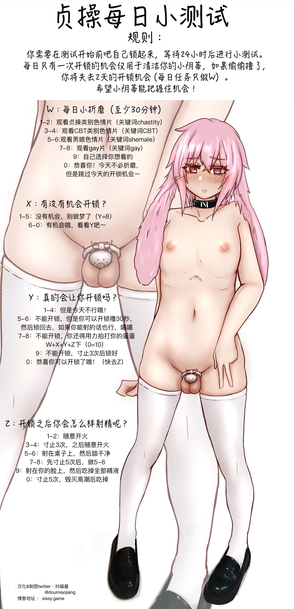

---
search:
  exclude: true
---

# 生活与性体验

该目录包含关于生活与性体验的多个文件，旨在为跨性别者提供实用的知识与技能，促进性健康与身体认知。文件内容涵盖了肌肉控制、性愉悦技巧、身体认知、心理适应等方面。具体来说，包括PC肌的收缩分解、如何进行会阴按摩、乳首的开发技巧以及伪声与伪娘训练的方法。这些内容不仅帮助跨性别者了解和掌控自己的身体，还提供了一系列实践指导，旨在支持他们的生活质量与性体验。此外，其中还涉及如何理解和参与性愉悦的多样性实践，秉持对个人身体和性别身份的尊重与认同。

标签: `生活体验`, `性体验`, `跨性别支持`, `身体认知`, `性健康`, `技巧指导`, `自我探索`, `心理适应`

总计 193 篇内容

### 📁 子目录

- [乳首开发](乳首开发) (2 篇内容)
- [伪声](伪声) (81 篇内容)
- [伪娘教程或训练](伪娘教程或训练) (7 篇内容)
- [前列腺高潮](前列腺高潮) (79 篇内容)
- [女性化生活](女性化生活) (9 篇内容)
- [如何玩弄男娘](如何玩弄男娘) (4 篇内容)
- [详细的灌肠方法](详细的灌肠方法) (4 篇内容)
- [隐藏男性生殖器](隐藏男性生殖器) (3 篇内容)

### 📄 文档

#### 2010

[SM_手册_我的身体我的心](SM_手册_我的身体我的心_page.md)

查看摘要

本文件为《我的身体，我的心》的翻译版本，内容主要讨论了SM（施虐与受虐）文化的基础知识及其在情侣关系中的应用。文件由一位热爱SM文化的翻译者根据原版进行翻译，旨在为初学者提供一个相对易懂的SM指南。内容涵盖了SM的定义、目的、规则、以及具体的玩法和注意事项等。翻译者提到，SM并不仅仅是冷冰冰的施虐行为，而是建立在双方相互爱护和理解的基础之上。尤其强调了在SM过程中保护对方安全、心理感受的重要性，同时也提醒初学者应注意可能的危险和过于激烈的行为带来的后果。文本中详细介绍了轻度SM的各种方法，包括语言虐待、轻度束缚、遮眼睛等，并指导如何创造有利于双方都能接受的氛围。同时，其中包含了对于SM社会认知的探讨，反映了人们对于这种行为的多元态度与看法。整体文件不仅提供了丰富的实操技巧，也传达了对情感和信任建立的重视。

#### 时间未知，按收录顺序排列

[PC肌收缩分解教程](PC肌收缩分解教程_page.md)

查看摘要

该文件是关于PC肌收缩分解教程的PDF文档，针对盆底肌肉的锻炼提供了详细的说明和训练计划。文件首先分析了PC肌的解剖结构与功能，指出PC肌在性功能中的重要性，并介绍了BC肌和IC肌这两个相对较少被提及的肌肉。接着，文件详细阐述了不同阶段的训练计划，包括从入门到高级的多种分解练习，旨在提升盆底肌的灵活性、持久性和力量，最终改善性功能。

文中排除了许多误导信息，鼓励读者采取科学有效的锻炼方法，并强调训练过程的重要性，同时对每个阶段的要求和目标进行了清晰的说明。不同等级的训练计划包含了具体的练习数量和注意事项，帮助练习者逐渐掌握肌肉的控制能力。整篇文档不仅适合想要改善性功能的人群，也展示了对盆底肌肉研究的严谨态度和科学基础。

[会阴按摩与正确的认知方法](会阴按摩与正确的认知方法_page.md)

查看摘要

该文件标题为《会阴按摩与正确的认知方法》，是一份针对会阴按摩及其相关性体验的指导文档，主要提供了一系列关于如何进行会阴按摩的详细步骤和技巧。文中首先强调了进行此类按摩所需的心理状态与环境准备，指出需要在足够放松和刺激的氛围中进行操作，以便提升体验的快感。文中逐步引导读者如何进行会阴部位的触碰和按摩，并详细描述了在此过程中可能获得的不同类型的快感，如前列腺高潮的概念以及对此感受的引导。

此外，文件还提供了多条分支情况，描述在不同情况下的体验和感受，包括在高潮中的继续刺激和余韵的感受等，进而交代如何提高敏感度与兴奋度的关系。支持性地进行的是，文中对身体的认知与心理准备给予了充分重视，帮助读者建立起完整的认知框架，以实现更好的性体验和解放自我。整体而言，此文件为广大跨性别及性少数群体提供了有价值的性知识和生活技巧。

### 🖼️ 图片

#### 时间未知，按收录顺序排列

> 本内容为自动生成，请修改 .github/ 目录下的对应脚本或者模板
