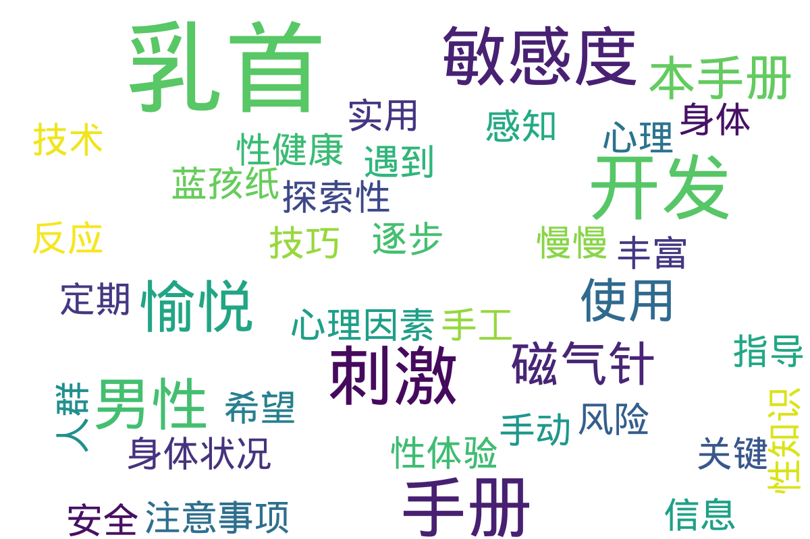

---
search:
  exclude: true
---

# 乳首开发

该目录涉及“乳首开发”主题，为跨性别人士提供相关的介绍和指导。内容包括专门为蓝孩纸（即跨性别男性或非二元性别者）编写的乳首开发手册，旨在帮助那些希望通过乳首开发来增强自身形象认同的人士。手册中可能包含实用的建议、经验分享、各类技术和方法等信息，帮助使用者理解乳首开发的过程及注意事项。这一资料旨在支持和引导跨性别人群探索自我认同，改善自我身体形象，并促进他们对生理变化的理解。

标签: `乳首开发`, `跨性别`, `生活经验`, `蓝孩纸`, `乳首手册`, `身体认同`, `性别表达`

总计 2 篇内容

### 📄 文档

#### 时间未知，按收录顺序排列

[蓝孩纸乳首开发手册](蓝孩纸乳首开发手册_page.md)

查看摘要

该文件是一本关于男性乳首开发的手册，详细地探讨了乳首在性愉悦中的作用以及如何通过不同的方法提升乳首的敏感度。这本手册提供了各种乳首开发的技巧，包括安全的乳首提高技术、风险注意事项以及乳首刺激时可能产生的身体反应和心理变化。内容中提到，通过定期刺激乳首，男性可以逐步增加对乳首的性感知，从而实现更丰富的性体验。手册详细介绍了使用磁气针贴的方法，以及如何在不使用工具的情况下，通过手工刺激慢慢提升乳首敏感度。此外，手册还提供了关键信息，如在进行开发时可能遇到的身体状况变化，以及心理因素如何影响敏感度的发展。总的来说，这本手册为希望探索性愉悦的人群提供了实用的指导与建议。

### 🖼️ 图片

#### 时间未知，按收录顺序排列

### 词云图

> 本内容为自动生成，请修改 .github/ 目录下的对应脚本或者模板
