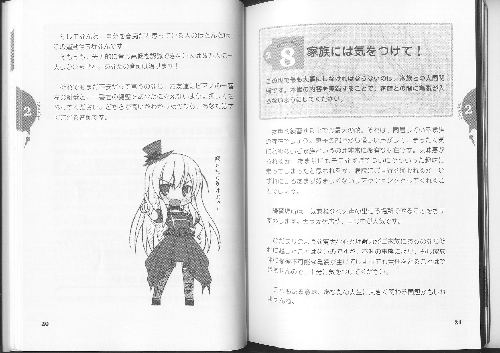

---
search:
  exclude: true
---

# 女の子の声になろう!

本目录收录了关于跨性别者声音转变的资源，尤其是提升女性化声音的技巧与经验分享。这些文件包括各种阶段的声音练习和技巧，以帮助跨性别女性实现声音上的过渡。

标签: `跨性别`, `声音转换`, `女性化`, `技巧分享`, `过渡经历`

总计 66 篇内容

### 🖼️ 图片

#### 时间未知，按收录顺序排列

> 目录及摘要为自动生成，仅供索引和参考，请修改 .github/ 目录下的对应脚本、模板或对应文件以更正。
