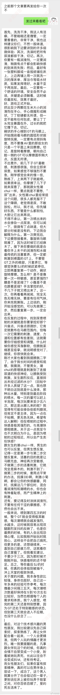
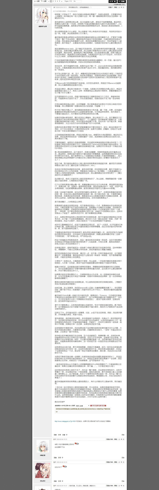
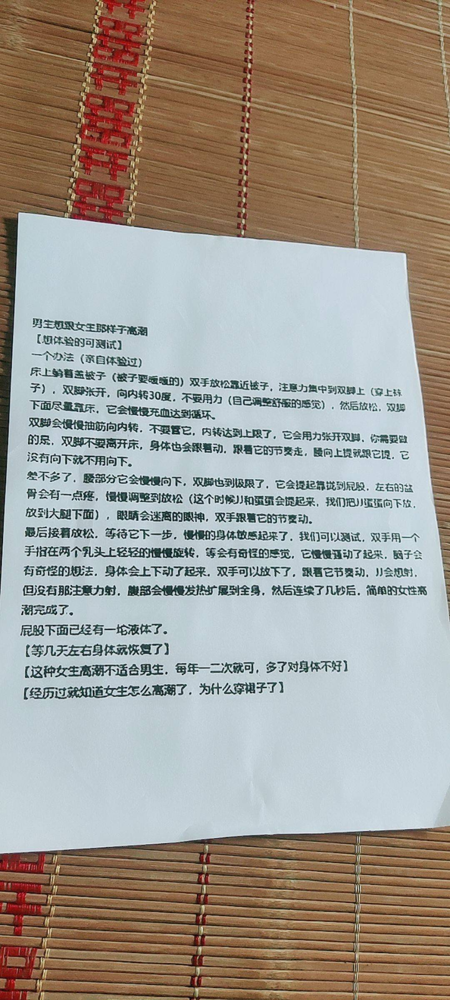

---
search:
  exclude: true
---

# 前列腺高潮

此目录专注于探索前列腺高潮的相关主题，涵盖了各种与前列腺刺激和高潮体验相关的知识和分享。内容包括前列腺高潮的基本概念、入门指南、使用工具、以及男人在前列腺高潮方面的不同体验和境界。目录中包含了多篇经验分享和教程，帮助新手深入了解如何实现前列腺高潮及其所带来的独特快感。目录还提供了一些先进的前列腺高潮技术和方法，以及许多个人的实践经验。这些资料不仅为新手提供了系统的教育，也为有经验的玩家提供了更高阶的技巧和建议，促进了对这一主题的理解和接受。在这个领域中，前列腺高潮被视为一种独特的生活体验，它在性健康和性快乐方面，拥有重要的地位和意义。

标签: `前列腺高潮`, `性体验`, `男性性健康`, `性知识`, `高潮技巧`, `个人经历`, `经验分享`, `性教育`

总计 79 篇内容

### 📁 子目录

- [《给男孩子的慰菊指导丛书》ひとりでできるもん～アナニー入门](《给男孩子的慰菊指导丛书》ひとりでできるもん～アナニー入门) (57 篇内容)
  

内容简介

  该目录包含与前列腺高潮相关的性体验和技巧，特别适合男生了解如何在性行为中探索和享受这一体验。书名《给男孩子的慰菊指导丛书》暗示了它的指导性质，内容以通俗易懂的方式介绍了前列腺的生理结构、刺激方法以及相关的心理准备，帮助读者克服羞耻感，勇于尝试。章节内容不仅有实用的技巧，还可能涉及性别身份、身体认同和个人历史背景的探讨，适合对性开放和探索感兴趣的读者。
  

### 📄 文档

#### 2024

[初次前高体验分享](初次前高体验分享_page.md)

查看摘要

该文档记录了一个人初次体验前列腺高潮（前高）的详细过程与感受。作者在文中分享了自己从2024年初次接触高岛、Aneros及无接触高潮的经历开始，经历了多个尝试的阶段，描述了心跳加速、全身出汗等身体反应以及高潮体验的过程。作者提到，在初次尝试中虽然没有达到前高，但通过对群里资料的信任与不断的尝试，逐渐靠近了这一体验。文中详细描述了每次尝试的时间、方法与感受，尤其强调了放松、强大的PC肌、安静环境及适当的心态对体验的影响。最终，作者分享了在2024年3月27日达成前高的瞬间，描述了高潮的生理感受并反思了这些体验。

#### 2018

[4.6_前高经验分享](4.6_前高经验分享_page.md)

查看摘要

这份文件是对探索前列腺高潮（前高）经验的详细分享，作者主要是在一个专门讨论前高的群体中进行交流后，整理出自己的探索历程。文中介绍了作者首次成功达到前高的过程及其感受，包括身体的准备、技巧的运用、身体感触的变化等。作者强调了身体感受中的“花屏感”以及如何通过呼吸和注意力控制来达到高潮，描述了在过程中所使用的方法和工具，包括轮动和腹部收缩的结合。作者也分享了自己在前高探索之路上的坎坷经历，从最初的粗略尝试，到后来通过群体交流获得系统知识，再到最终实现成功。文中还提供了一些建议给其他希望探索前高的人，强调信心和耐心的重要性。

#### 时间未知，按收录顺序排列

[4.1_前列腺高潮的概念](4.1_前列腺高潮的概念_page.md)

查看摘要

该文件为一份关于前列腺高潮的详细指南，说明其概念和体验。文中指出，前列腺高潮是通过直接刺激前列腺位置所引发的一种快感，强调前列腺高潮与阴茎高潮的不同之处，同时也描述了前列腺高潮的生理反应及心理状态。文件详细解释了前列腺的解剖结构，高潮的产生过程中的感觉变化，以及高潮后可能的身体反应，如颤抖和唧唧反应。内容中提到的技巧和锻炼方法，鼓励读者通过放松和专注于身体感受，通过一系列的刺激与收缩来更好地体验高潮，强调“释放强烈的快感波动”，同时给出使用成人玩具时的安全警告。总之，这是一本提供实用技巧和情感建议的文献，帮助读者理解并探索前列腺高潮带来的愉悦体验。

[4.2_给小白的前高完全入门指南__Ver_0.1](4.2_给小白的前高完全入门指南__Ver_0.1_page.md)

查看摘要

本文是针对前列腺高潮（简称前高）入门者的一份详细指南。它提供了简单易懂的语言，帮助初学者理清前高的概念和实现步骤。文中定义了“前高”的体验标准，强调其与传统射精的区别，并为初学者提供了一系列有效的练习方法，旨在帮助用户全面认识前列腺的作用及其健康益处。内容包括前高的基础知识、目标达成方法及一些注意事项，例如正确的探索频率和手法。法律声明部分指明了本文为原创，并提醒未经许可不可转载。

[4.3_男人前高的几种境界](4.3_男人前高的几种境界_page.md)

查看摘要

该文档讨论了男性在前列腺高潮中的不同体验，划分为五个境界，每个境界具有不同的生理和心理状态。文中提到，第一级高潮是通过简单的按摩感到的愉悦，而第三级和第四级则涉及到身体的紧绷和意识状态的变化，伴随着前列腺液、尿液和精液的释放。最高境界的体验被描述为一种几乎无意识的状态，身体其他部位的感受消失，只剩下前列腺带来的纯净愉悦。这种体验强调了男性的身体感受和自我满足，提出了及时行乐的生活哲学。

[4.4_前高工具介绍](4.4_前高工具介绍_page.md)

查看摘要

该文档分享了个人的前列腺高潮体验以及相关的自慰工具使用心得。作者在文中详细描述了其从尝试第一次前列腺高潮到成功经历这一过程的感受，强调了前列腺高潮与传统射精的区别及其独特快感。文中提到的不同后庭玩具如SU双环、雷沃二代和百乐后生至爱等被一一介绍，详细说明了使用这些工具的体验、效果与注意事项。作者还分享了进行前列腺自慰前的准备工作，包括灌肠、扩肛和润滑等，以帮助后续的高潮体验。结尾提及个人出售未用的后庭玩具，并表示欢迎交流前列腺高潮的相关问题，整个文档致力于提供对这一主题的深入理解与实践经验。

[4.5_前高基础知识](4.5_前高基础知识_page.md)

查看摘要

该文件探讨了男性前列腺高潮（即“前高”）的基础知识，旨在帮助男性理解和探索自己的身体，对前列腺进行有效的刺激以达到增强性快感的目的。文中首先定义了男人的‘G点’（即前列腺），并提供了详细的操作步骤和技巧，帮助读者找到并刺激这个区域。作者介绍了多种性姿势和技巧，包括按摩手法、使用情趣用品等，以增加刺激的强度和愉悦感。文件也提到高岛前列腺按摩器的相关知识，讨论了其对男性性生活的积极影响以及如何在不同情况下使用该按摩器。文中强调，享受前列腺刺激并不意味着性别取向的改变，提醒男性放下心理障碍，尝试新的性体验。与之相关的健康益处，亦被一并列出，为关注前列腺健康的男性提供了实用建议。这项内容对性教育、性健康和性别多样性认同都提供了新的视角和理解。

[4.8_超级前列腺高潮，昏天暗地的快感](4.8_超级前列腺高潮，昏天暗地的快感_page.md)

查看摘要

该文档详细记录了一位直男的个人体验，描述了他在追求前列腺高潮过程中的探索与感受。文中提到，作者由于性欲旺盛，抱着强烈的好奇心，尝试了几种姿势与器具，通过特定的准备，如清洗和使用水性润滑剂，来达到更好的体验。他总结了要体验真正前列腺高潮的关键点，包括不要触碰阴茎，采用侧躺姿势，使用较粗的器具等。文中生动描绘了高潮的感受及身体反应，流露出对这种体验的热情和渴望，且强调体验过程中的“疼痛”是高潮即将来临的预兆，令人感受到前所未有的快感和满足。整体文风直白、真实，作者希望以此经验分享给更多有兴趣的朋友，并鼓励他们探索自己的身体感受。

[4.9_无器具前高（前高高级阶段）](4.9_无器具前高（前高高级阶段）_page.md)

查看摘要

该文件是关于男性前列腺高潮（SuperO）体验的详细分享，作者分享了个人在无器具情况下获得前列腺快感的过程和感受。文件内容分多段叙述，从热身开始，作者描述了怎样通过收缩肛门和PC肌，以达到特定的快感，强调了在不同阶段的体会和感受。作者也提到了一些练习过程中的技巧，例如主动收缩、集中精神和调整力度，推荐在睡眠前练习，以便更好地集中注意力。这些经验记录包括了作者与其他群友的交流，彼此分享提肛练习及前列腺快感的体会，显示出一种探索和共同学习的氛围。整体而言，这份文档不仅提供了个人经验，也能为其他寻求前列腺高潮实践的人提供启发和帮助。

[Super-O个人体验整理分享](Super-O个人体验整理分享_page.md)

查看摘要

该文件为一份个人经验分享，详细记录了一位跨性别人群成员在前列腺高潮（Super-O）方面的探索与体验。内容分为多个部分，包括个人初体验的描述、不同高潮类型的分类、以及前列腺高潮五个阶段的深入解析。作者在文本中提到，初体验的关键在于对肌肉的控制，通过无器具的方式进行PC肌收缩，最终实现全身的酥麻感和极致的愉悦。这份文档还探讨了不同类型的高潮，并提出了"轮动收缩"的理念，强调对身体的感知与训练。整体上，文件不仅分享了个人的感受，也提供了对如何获得此类高潮的训练和建议，适合有兴趣深入了解这一主题的读者。

[个人前高经历](个人前高经历_page.md)

查看摘要

文件记录了一位个人的前列腺高潮体验和探索历程。作者在文本中讲述了他作为一名喜欢女装的男孩的成长故事，描述了自己对伪娘文化的接触，以及在这一过程中所产生的迷惑与兴奋。通过一些偶然的机会，他开始尝试探索前列腺高潮的体验，记录了从第一次尝试的不安与困惑，到逐渐掌握技巧后所获的满足感。文中幽默而细腻地表达了他对于身体探索的思考与成长，提及了使用各种工具和玩具进行自我探索的经验，同时强调了安全性和身体健康的重要性。整个文本传递了一种鼓励和支持的情感，帮助其他人理解前列腺高潮的探索过程。

[从零开始的前列腺高潮_苦来,_叁水halls_z_lib_org](从零开始的前列腺高潮_苦来,_叁水halls_z_lib_org_page.md)

查看摘要

本文件为一篇关于男性前列腺高潮的教程，详尽介绍了如何获得和体验前列腺高潮的不同方法。文中首先阐述了前列腺快感的基础知识，讨论涴肠（腔内灌注）在前列腺快感获得过程中的重要性，并给出了不同的涴肠方法。接着，作者分享了如何利用视觉刺激和自我暗示来帮助达到前列腺快感，深入探讨了前列腺高潮的不同阶段，包括通过刺激前列腺射精的第一阶段、达成干潮的第二阶段以及彻底剥离前列腺快感和阴茎快感的第三阶段。文章还提到了乳头刺激的重要性，以及如何通过催眠音声辅助达到更深入的快感体验。该文内容适合对前列腺快感有兴趣的男性读者，尤其是希望提升个人性体验和探索新快感方式的群体。整体内容直接，涉及许多实际操作的细节与个人体验，具有教育性和探索性。

[前列腺高潮新方法1](前列腺高潮新方法1_page.md)

查看摘要

该文件详细介绍了前列腺高潮的方法和注意事项，强调精准找到前列腺位置的重要性，并且批评了某些关于前列腺的常见误解。文件中提到每个人的前列腺位置各不相同，有的人可能深达8-9厘米，最浅也可能仅有2-3厘米，不应简单依赖网络上的标准。文件提供了多种开发前列腺快感的方法，包括通过空模拟排尿和射精的动作、提肛运动技巧以及使用马眼棒和前列腺高潮液等产品来增强快感。特别强调前列腺的快感与射精的关系，并警告潜在的安全风险。文中还提到微电流电击刺激作为一种方法，并称它在某些保健领域效果显著。全篇旨在帮助读者了解和探索前列腺高潮的体验，强调快感的重要性。

[前高](前高_page.md)

查看摘要

本文件是关于前列腺高潮（Prostate Orgasm）的详细介绍，旨在为读者提供有关这一性体验的知识和实践指导。文件开头部分阐明了前列腺高潮的概念，强调其与阴茎高潮的不同，并描述了通过直肠刺激前列腺所带来的愉悦感受。内容中提到，前列腺高潮的第一个迹象是PC肌肉的收缩，伴随着身体各部分的快感波动和颤抖反应。文件逐步引导读者如何练习以提高前列腺高潮的体验，包括放松技巧、适合的姿势、和刺激方法等。值得注意的是，文件中还描述了在刺激过程中会面临的不适感和其所需的耐心与时间。整体上，本文件为希望了解和实践前列腺高潮的读者提供了有价值的见解和建议。

[屁穴高潮方法__2_](屁穴高潮方法__2__page.md)

查看摘要

此文档详细介绍了屁穴高潮的技巧和原理，提供了关于如何达到此类快感的具体步骤和注意事项。文中提到屁穴高潮的原理是通过在直肠内快速、大力的抽插，诱发直肠的自主收缩，这一过程也会影响膀胱，从而产生‘插尿’的效果。对于想要尝试屁穴高潮的人，文中推荐使用炮机进行最大化抽插，尽管这种方法的快感相较于前列腺高潮较低。文档还提及此方法的潜在风险，包括可能导致直肠和泌尿系统的伤害。强调了灌肠的必要性，以及在高潮过程中的身体反应，如流前列腺液或尿液，提醒用户需小心操作，避免过度伤害或漏屎现象。整体上，此文档旨在提供技术性的指导与个人体验分享。

[慰菊丛书](慰菊丛书_page.md)

查看摘要

《慰菊丛书》是一部针对跨性别及性少数群体在生活中经历的性体验的汇编资料，重点探讨前列腺高潮的医学和心理层面。文件可能包含从个人故事到临床经验等多种内容，致力于揭示跨性别人士在性体验中的独特视角及其情感层面的复杂性。这本书的章节或许会通过个人案例分享前列腺高潮在性快感中的角色，探讨该体验对身体认知和性自我认同的影响。同时，文件中也会涉及相关的医学知识，以帮助跨性别人士更好地理解和探索自身的身体反应及情感需求。该书的目标是增进社会对跨性别群体性体验的了解与接纳，倡导更健康的性教育与开放的性讨论。

[爽的极限（含目录）](爽的极限（含目录）_page.md)

查看摘要

该文件名为《爽的极限》，主要内容是关于前列腺刺激及相关快感的详细探讨，分为多个部分。文件一开始探讨了爽感的来源及其错觉，分析了在不同刺激下，快感如何被大脑辨别处理以及每种快感形式的差异。接着，探讨了前列腺的各种玩法，包括阴茎玩法、后庭玩法和无器具玩法，分别讲述了不同方法的技巧和效果。同时，还详细讨论了各种快感的类型，如出液型、紧涨型、波浪型等，描述了每种快感的特征以及如何在体验中提升和选择爽感。最后对于潜意识对快感体验的影响进行了深入分析，提供了可能的突破方向与方法，探讨如何才能实现更高层次的快感体验。整篇文字涉及个人观点与实践，内容丰富、生动，适合对前列腺刺激和快感探索感兴趣的读者。

[肛门扩张_–_最有效的指南和练习（一）](肛门扩张_–_最有效的指南和练习（一）_page.md)

查看摘要

本文件是关于肛门扩张技巧和信息的详细指南，旨在帮助读者了解如何安全且愉快地进行后庭游戏。文件开篇描述了肛门作为一种肌肉组织的特性，重点强调通过适当的训练（如使用拳交假阳具）来逐渐适应更大尺寸的被物体进入。文中提到，放松括约肌是享受肛交乐趣的关键，错误的方法可能导致不适或疼痛，因此在练习之前必须做好充分准备和正确的信息以确保安全。文件还介绍了与肛交相关的生理学知识，包括肛门、直肠以及结肠的解剖结构，以及在实践肛交过程中伴侣之间信任和沟通的重要性。还详细描述了肛交的不同形式和技巧，强调需要遵循的基本规则来避免伤害。文件不仅为经验丰富的实践者提供深度信息，也为新手提供安全练习的必要指导。

### 🖼️ 图片

#### 时间未知，按收录顺序排列

### 词云图 { data-search-exclude }

> 目录及摘要为自动生成，仅供索引和参考，请修改 .github/ 目录下的对应脚本、模板或对应文件以更正。
