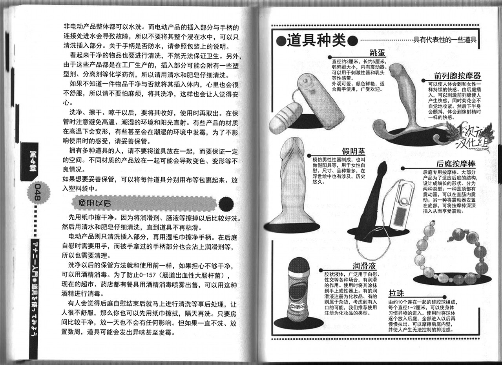

# 《给男孩子的慰菊指导丛书》ひとりでできるもん～アナニー入门

该目录包含与前列腺高潮相关的性体验和技巧，特别适合男生了解如何在性行为中探索和享受这一体验。书名《给男孩子的慰菊指导丛书》暗示了它的指导性质，内容以通俗易懂的方式介绍了前列腺的生理结构、刺激方法以及相关的心理准备，帮助读者克服羞耻感，勇于尝试。章节内容不仅有实用的技巧，还可能涉及性别身份、身体认同和个人历史背景的探讨，适合对性开放和探索感兴趣的读者。

总计 57 篇内容

### 🖼️ 图片

#### 时间未知，按收录顺序排列

> 本内容为自动生成，请修改 .github/ 目录下的对应脚本或者模板
