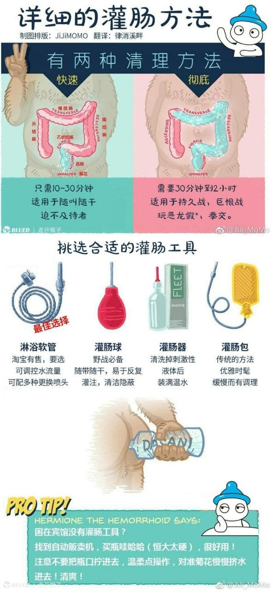
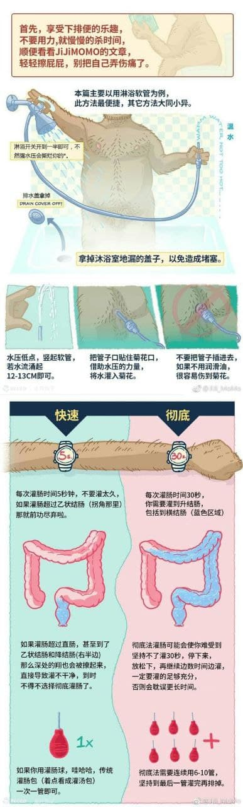
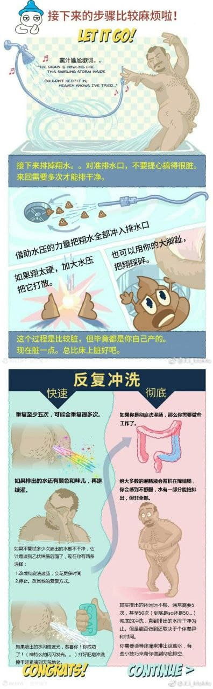
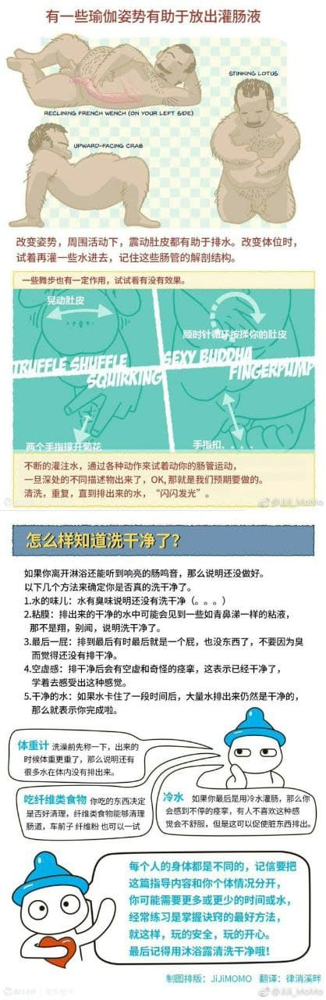

---
search:
  exclude: true
---

# 详细的灌肠方法

本目录收录的是关于灌肠方法的详细说明和技巧，主要针对希望了解或尝试灌肠的人士。文件中包含了多种灌肠方法的步骤描述，适用者群体以及可能需要注意的事项。文章具体讲解了不同灌肠工具的使用方法，以及在使用过程中的注意事项，例如卫生、剂量和水温等。这些内容对于跨性别人士在进行相关身体护理时具有重要参考价值，尤其是在过渡期间关注身体健康和生理需求的情况下。

标签: `跨性别`, `生活技巧`, `生理经验`, `医疗资源`, `灌肠方法`, `身体护理`

总计 4 篇内容

### 🖼️ 图片

#### 时间未知，按收录顺序排列

> 本内容为自动生成，请修改 .github/ 目录下的对应脚本或者模板
