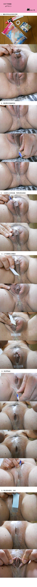
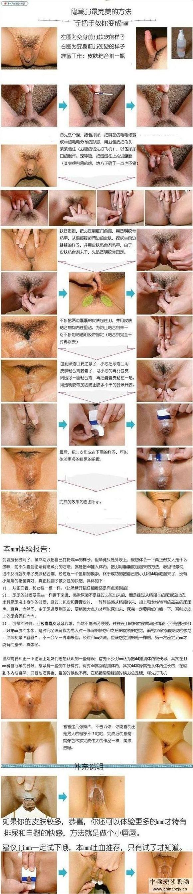

---
search:
  exclude: true
---

# 隐藏男性生殖器

!!! info

    该目录涵盖了隐藏男性生殖器的一系列资源与教程，主要集中在性别表达和生活体验的实践方面。文件中包含压枪教程及其详细步骤，为需要进行身体性别表达调整的跨性别者提供实际的帮助与指导。这类教程对于那些希望通过非手术方式达到身体表达效果的人尤为重要，内容涉及如何选择合适的材料和技巧，确保使用过程的安全和舒适。通过这些资源，跨性别者能够更好地理解和调整自身的性别表现，以提升生活质量和心理健康。

!!! note "📊 统计信息"

    总计内容：3 篇
    标签：`隐藏男性生殖器` `性别表达` `压枪教程` `跨性别资源` `生活体验` `身体调整`

### 📄 文档

<table>
<thead><tr>
<th style="width: 40%" data-sortable="true" data-sort-direction="asc" data-sort-type="text">标题 ▲</th>
<th style="width: 15%" data-sortable="true" data-sort-direction="desc" data-sort-type="year">年份 ▼</th>
<th style="width: 45%">摘要</th>
</tr></thead>
<tbody>
<tr data-name="压枪详细教程" data-year="None" data-date="2024-12-13 05:32:01">
                <td><a href="压枪详细教程_page" class="md-button">压枪详细教程</a></td>
                <td class="year-cell">None</td>
                <td class="description-cell">

                    
这份《压枪详细教程》的文件为跨性别人士提...

                    

                        这份《压枪详细教程》的文件为跨性别人士提供了详细的压枪（将男性生殖器隐藏）方法，旨在帮助需要此技术的用户在日常生活中更舒适与自信。文件中详细列出了所需材料，包括医用透明敷料胶布、双面胶、剪刀及吹风机等，强调了制作过程的注意事项和技巧，例如如何剪裁敷料和正确贴合。教程中提到，压枪的整个流程应在生殖器处于放松状态时进行，并提供了每一步操作的具体指导，确保用户能有效和安全的完成操作。文中还提到，虽该方法经过了亲身测试并认为在正常情况下无较大影响，但建议用户不要长期使用，以避免对身体的潜在风险。最后，作者还鼓励用户分享自己的经验以改进方法。
                         年份：None
                         收录日期：2024-12-13 05:32:01
                    

                
</td>
            </tr>
</tbody>
</table>

### 🖼️ 图片

<table>
<thead><tr>
<th style="width: 40%" data-sortable="true" data-sort-direction="asc" data-sort-type="text">标题 ▲</th>
<th style="width: 15%" data-sortable="true" data-sort-direction="desc" data-sort-type="year">年份 ▼</th>
<th style="width: 45%">摘要</th>
</tr></thead>
<tbody>
<tr class="image-row">
                <td colspan="3">
                    

                        
                        
20240222_013450

                    

                </td>
            </tr>
<tr class="image-row">
                <td colspan="3">
                    

                        
                        
压枪教程二

                    

                </td>
            </tr>
</tbody>
</table>

 

=== "最多访问"

    * 1,236 访问 [压枪详细教程](/社群及NGO文件/生活与性体验/隐藏男性生殖器/压枪详细教程_page)

!!! note "自动生成说明"
    目录及摘要为自动生成，仅供索引和参考，请修改 .github/ 目录下的对应脚本、模板或对应文件以更正。
