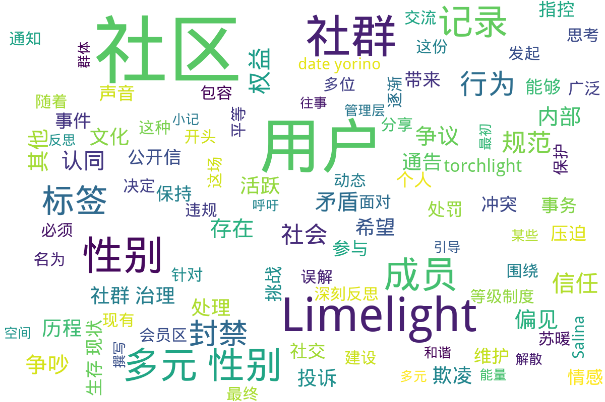

---
search:
  exclude: true
---

# Limelights社区

Limelights社区是一个以跨性别者及多元性别群体为核心的在线社群，在这一目录下，记录了多个关于社群内部事务的讨论和故事，这些文档反映了社区在发展过程中的各种挑战和成长：

目录下的某些文件揭示了社群成员对社区内部治理及动态的探讨和反思。例如，凌子卿的记录文档深入分析了Limelight社区作为一个跨性别群体聚集地，在开放性与安全性之间的矛盾以及社群信任机制的重要性。记录中提及的社群内部关于用户偏见投诉及站外争议的处理显示了社区内成员间关系的微妙及与管理层的互动。

目录中的文件如《Artrs_2023年Limelight欺凌社区公开信》和《Limelight 往事小记》表明社区内的复杂历史。这些文档揭示了高等级用户对新用户监视控制的问题，以及社群从初期虚拟乌托邦演变为挑战的权力斗争场所，尤其是在秋橙事件中的处理经过披露。

关于多元性别标签的讨论展示了社群成员们对标签现象的复杂态度，以及这种现象在成员身份认同中的作用与争议，反映了社区中自我身份认同的挑战。最后，通过猛烈争议及骚动的记录，例如关涉秋橙的处罚通知，这些文本勾勒出了一个努力维护包容与安全的社群，却同样面对内外矛盾的动态图景。

标签: `跨性别`, `多元性别`, `社群治理`, `偏见投诉`, `标签争议`, `社区动态`, `内部冲突`, `用户权利`, `信任机制`

总计 12 篇内容

### 📄 文档

#### 2023

[Artrs_2023年Limelight欺凌社区公开信](Artrs_2023年Limelight欺凌社区公开信_page.md)

查看摘要

这份文件是一封公开信，主要揭露了名为 Limelight 的在线社区所存在的欺凌行为。公开信的作者 Arts 通过详细的描述和分析，展示了 Limelight 社区从起源到发展的阶段，以及与用户之间的信任等级制度相互作用下，如何形成了一个隔离和压迫的新环境。文件指出，Limelight 最初被视为一个倡导平等与解放的多元社区，然而随着时间的推移，这个社区却逐渐演变成一个以特权和等级制度为基础的结构。在这种结构中，高等级用户对新用户进行监视和控制，新用户在社区中的声音受到压制，形成了用户之间的不信任和对立。公开信中也提到了关于秋橙的事件，她作为一名新用户，勇敢提出对现有制度的质疑和建议，但最终遭到老用户的强烈抵制和欺凌。文件通过描述这场矛盾的爆发和管理者对秋橙的“公审”，揭示了 Limelight 社区内潜藏的权力斗争以及对新用户的压迫，这让更多人意识到自己并不是孤立无援，从而增加了对抗不公的勇气。

#### 2022

[2022年4月13日_苏暖暖偏见投诉讨论](2022年4月13日_苏暖暖偏见投诉讨论_page.md)

查看摘要

该文档记录了在Limelights社区内关于用户苏暖暖的偏见和投诉讨论。文件中包含了用户Kennket1（可甜）在2022年4月13日发起的投诉，指控苏暖暖对其进行偏见、不合理的指责、以及可能的诽谤与欺凌。Kennket1 对苏暖暖的行为表示强烈的不满，认为其对自己态度恶劣，甚至暗示苏暖暖故意误解其意图，给其带来了严重的情绪影响。这种投诉引发了社区其他用户的讨论，不同声音在各个评论中争论，关于misgender行为的正确性被广泛探讨，一些用户对如何使用合适的代词表示关切，而另一些用户则围绕该事件的诽谤性质展开了辩论。文中展示了这些对话不仅涉及个人情感的纠纷，还有关于社区内对跨性别认同的敏感性以及如何处理人际关系中误解和冲突的问题。讨论中也出现了对于管理层行为的质疑，以及对偏见和抨击的反思，显示出社群内在多元性别问题上的复杂性与挑战。总之，这个文档呈现了一场围绕性别认同与社群规范的深入讨论，突显了在跨性别社群中维护个人权利与相互理解的重要性。

[2022年5月21日_雪乃_关于站外争议的讨论](2022年5月21日_雪乃_关于站外争议的讨论_page.md)

查看摘要

该文件是关于Limelights社区内，针对站外争议进行讨论的文档，由雪乃于2022年5月21日发布。文中明确指出，Limelights并不是一个社群争吵的平台，不应承载任何形式的个人攻击或争吵。文中提到，为了维护社区的秩序，任何针对特定对象的争议内容，可能将会被隐藏或删除。该决定在相关争吵发酵后制定，参与争吵的用户可能会面临禁言或封禁的处罚。

文件中提到的具体案例包括对参与争吵的特定用户采取的纪律措施，例如对@上坂桜介因发布私人矛盾和账户争用进行禁言的处罚，以及另一名用户因个人动机扩大社区矛盾而面临永久封禁。这一系列措施旨在保护社区的和谐氛围，让用户能够更加安心地在此进行积极的交流，而不是陷入无谓的争执中。

从其他用户的反馈来看，社区成员对于维护团结和相互支持的价值观有着共识。不少用户在讨论中呼吁大家要保持希望和正能量，尤其是在面临社会歧视的情况下，团结显得尤为重要。他们强调，单个个体无法扭转社会的歧视，唯有通过团结才能继续向前。这些讨论反映了跨性别及多元性别群体在面对困难时的心声，也表现出社区成员之间的关怀与支持。

[20220330_凌子卿_关于limelight的用户视角讨论](20220330_凌子卿_关于limelight的用户视角讨论_page.md)

查看摘要

该文档是关于Limelight社群的一份讨论记录，主要由凌子卿于2022年3月30日撰写，文中探讨了Limelight社区作为跨性别者为核心建立的社群的内部动态与挑战。记载了社群用户的经验和他们对社群未来发展的看法。在此文中，凌子卿从多个角度分析了Limelight的开放性与安全性之间的矛盾，指出由于外部环境的恶化，社群必须保持一定的防范措施，这对新用户构成了不平等的局面。文中提到：“limelight的活跃并不是说明环境友善”，这是因为社群的访问者中存在着反对跨性别人士的声音。进一步探讨中，凌子卿强调了社区内信任机制的重要性，指出“一个信任机制必须是存在且有效的”，与此同时需要更广泛的包容与理解，以避免社区内部产生不必要的斗争。此文不仅涉及社群的治理与管理，还深入讨论了成员的生存现状，反映出跨性别社群在面对压迫时的复杂情感与思考，是对多元性别社群问题的一次重要记录。

[关于社区事务规范讨论的通知_2022年7月11日_雪乃](关于社区事务规范讨论的通知_2022年7月11日_雪乃_page.md)

查看摘要

该文件是来自Limelights社区的关于社区事务规范的通知，发布时间为2022年7月11日，由社区成员雪乃发布。二是由一系列对社区相关事务进行管理和规范的讨论和规定，旨在维护社区的健康氛围，避免不必要的争吵和冲突。文件开头，雪乃表达了对社区成员讨论热情的肯定，随后确立了一些明确的规则，确保所有与小组事务相关的讨论能够在合理和有依据的情况下进行。文件中提到，对于任何相关的指控，只有当事人可以直接向管理人员提出，任何不实指控都将受到处罚。文件也强调了在讨论中必须提供必要的依据,以避免无证据的指控带来的影响。

[关于秋橙的讨论记录](关于秋橙的讨论记录_page.md)

查看摘要

本文件记录了Limelights社区中关于成员秋橙的讨论，围绕其在社区内的行为引发的争议进行了深入分析与探讨。讨论者们在文本中表达了对秋橙某些行为的不同看法，如如何理解她的推测行为，以及社群在引导与规范方面的不足。讨论的开始是由用户雪乃发起，她透露自己曾与秋橙产生交流，并注意到她在多项话题上与其他用户的立场存在差异。文件的内容直面秋橙的社交能力，以及社区规则的模糊性所带来的冲突。参与讨论的用户们提出了对社区规范的多种看法，有些认为需要更明确的规则来引导新旧用户的行为，而另一些则表达了对跨越情感与社交能量的理解与包容。整个记录流露出对社群互助与和谐的期望，同时也凸显了社交中的复杂性与人际间沟通的微妙。

记录中提到了一些具体例子和建议，例如由用户Wing綝酱が提出，希望社区能够强化对建议的管理与审核，以改善当前的互动状态，同时强调开放性与情感交流的重要性。文末的讨论还包含了对未来可能的社群治理模式及规范的探讨，表明用户们对有效管理与共存的关切。“社区的问题，社区在这方面缺乏说明，会让新用户难以理解。”这一句表达了用户对社群治理的深切思考与希望。

[关于秋橙被封禁的讨论记录_2022年](关于秋橙被封禁的讨论记录_2022年_page.md)

查看摘要

该文件记录了2022年7月4日Limelights社区关于用户@秋橙被封禁的讨论。这场讨论引发了社区成员对封禁原因、程序正义和社区管理规则的深刻反思。文件中，有用户提到“秋橙作为ll的一个用户，为ll的建设提供了大量宝贵意见”，可见@秋橙在社区中的影响力和贡献。在多位用户的发言中，有人认为封禁的处理程序不正义，且缺乏透明度。一位用户指出，“之前封禁都要记录的”，反映了一些成员对于社区治理规则的期待与不满。

[多元性别标签讨论记录_2022年7月5日_Salina](多元性别标签讨论记录_2022年7月5日_Salina_page.md)

查看摘要

这份文件是《多元性别标签讨论记录》，记录了名为Limelights社群中成员对多元性别标签的讨论情况。这场讨论发生在2022年7月5日及其后几天，由Salina发起，包含多位成员的实时聊天记录。文件开头提到有人对“贴标签”的感慨，Salina以‘吵架吵不过就说别⼈不正常’引入了对标签现象的思考，显示出社群内部对于标签的复杂看法和争议。

在讨论中，Chikage提及‘moer，含糖，这都算标签吗’，穷极了对标签界限模糊的调侃，而Senioria则表达了对标签的反对，认为很多因为标签而生的误解和偏见需要被消除。多位成员在此过程中分享了自己的看法，抒发了对自身认同感的体验与困惑，反映出了多元性别社群在面对外界标签化时的脆弱与不安。

这种深入的社群讨论不仅代表了多元性别者对自我身份和社会认同的追寻，也体现了社群内对彼此支持与理解的渴望。随着对标签现象的探讨逐渐深入，成员之间开始分享对自身的认同感，表现出社群在寻找共同体感及对抗标签带来的压力时的显著动态。值得注意的是，有成员表示对自我的认同与标签之间存在着较大的矛盾，不同的声音展现出社群中的多元化与复杂性。

[秋橙_20220329_关于增强torchlight用户权益的建议](秋橙_20220329_关于增强torchlight用户权益的建议_page.md)

查看摘要

该文件名为《关于增强torchlight用户权益的建议》，由秋橙于2022年3月29日创作。文件主要讨论了如何保护参与torchlight社区的用户权益，尤其针对现有关于会员区的管理问题，提出了一系列意见和建议。在文件中，秋橙首先指出现有的权限管理和分类存在不合理之处，强调了保持社区的私密性与用户之间的信任关系的重要性。秋橙提到，某些已经不活跃的用户希望保护过去的讨论内容，应当严谨处理会员区和开放区的主题。在讨论中，她提到需要分类会员区的主题，并对其中一些主题进行重新评估，以确保不会因为不合理的管理影响到用户的体验。秋橙还提到由于社区管理人员的变动，导致用户对于其未来的发展方向感到不安，她希望能够通过严格的管理措施，让活跃用户与不活跃用户的讨论空间保持清晰的边界。最终，秋橙的主张意在提高用户的权益与社区活跃度，同时探索一种更加公平与合理的管理机制，以应对社区内产生的种种矛盾与问题。

[秋橙违规处理通告_2022年8月13日_雪乃](秋橙违规处理通告_2022年8月13日_雪乃_page.md)

查看摘要

本文件是关于Limelights社区在处理用户@秋橙因一系列违规行为而作出的通告。通告由雪乃发布，日期为2022年8月13日。根据社区的讨论以及对各方意见的了解，社区决定对秋橙的行为进行处罚，封禁期限至2023年1月2日。文中列举了秋橙的具体违规情形，包括使用虚假信息造成公众恐慌、擅自公开其他用户的隐私、对其他用户骚扰、拒绝遵守社区管理规定等。这份通告的目的在于维护社区的正常秩序，强调了对违规行为的零容忍以及社区内部应有的自律与诚实。同时，通告也表达了对所有社区成员相互包容与尊重的期望，并提到对4月26日之前的相关问题将进行调查。文中还提及了一些社区成员对封禁决定的不同看法，显示出社区内部关于这一问题的广泛讨论与不同的意见。

#### 2019

[limelight社群历程与发展记录](limelight社群历程与发展记录_page.md)

查看摘要

本文记录了Limelight社区的发展历程，包含了该社区自成立以来的多个重要里程碑。文中提到，2014年6月5日，百度药娘吧被封禁，促使社区创始人misaka4e21与其他成员联合启动了名为date-yorino的计划，旨在推进跨性别权益并建立一个有支持性的社区。2014年11月1日，date-yorino正式成立，随后在技术和社区建设上经历了许多挑战，包括技术故障和用户访问问题。2016年，date-yorino更名为{{原跑路站}}，并引入了全新的Discourse论坛系统，标志着社区管理架构的一个重要转变。随着时间的推移，社区逐渐扩大并开始推出各种服务和社交平台，包括Mastodon实例和微信群聊。2018年12月8日，社区经历了震惊的‘12·08’管理员人身攻击事件，导致Telegram群传奇解散。在2019年，该社区发布了停止运营的通知，并在后续改名为Limelight。文中总结了该社区的发展历程，强调了建立平等和解放的使命，以及对文化和社会进步推动的承诺。这些记录不仅是过去一段艰辛历程的见证，也是未来继续前行的动力。

### 🌐 网页

#### 2023

[Limelight_往事小记](Limelight_往事小记.md)

查看摘要

《Limelight 往事小记》是一篇深刻反思社区内外部冲突的纪实文章，讲述了Limelight社区的兴衰与发展历程。文章由一位曾在该社区活跃的成员撰写，他亲历了社区的繁荣与最终的解散。开头，作者表达了对“星星陨落”和社区葬礼的哀悼，反映了其对这片空间的深厚感情和依依不舍。文章分为多个部分，详细叙述了自己与Limelight的初次邂逅及其积极参与翻译医学文献的经历，展现了社区最初所营造的友好氛围。该篇章也探讨了社区内部管理的动态变化，从管理层的频繁更迭到社区规则的调整，揭示了这些变化如何影响成员之间的关系和整体氛围。最后，作者总结了在此过程中所感悟的教训，包括对小圈子内的局限性的警惕，呼吁对社会各类群体的理解和共容。整篇文章不仅是对社区文化的回顾，也是对多元性别社群内挑战与悲剧的深刻反思。

### 词云图 { data-search-exclude }

> 本内容为自动生成，请修改 .github/ 目录下的对应脚本或者模板
