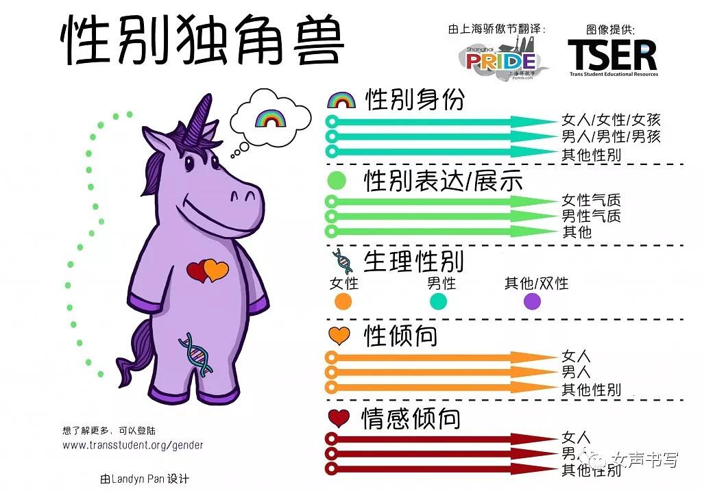
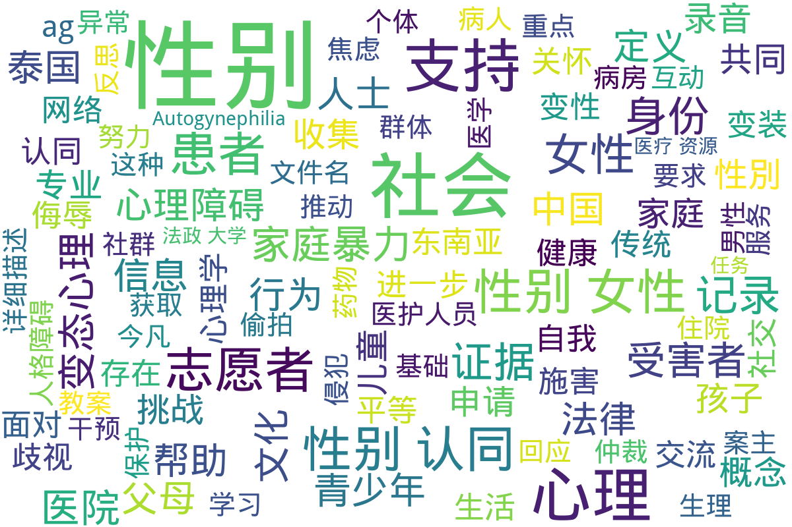

---
search:
  exclude: true
---

# 社群

该目录包含了与跨性别社群相关的组织和非政府组织（NGO）的信息，包括中国大陆及海外的社群动态和资源。

标签: `跨性别`, `社群`, `NGO`, `中国大陆`, `海外`, `港澳台`

总计 36 篇内容

### 📁 子目录

- [Limelights社区](Limelights社区) (12 篇内容)
  

内容简介

  Limelights社区是一个以跨性别者及多元性别群体为核心的在线社群，在这一目录下，记录了多个关于社群内部事务的讨论和故事，这些文档反映了社区在发展过程中的各种挑战和成长：

目录下的某些文件揭示了社群成员对社区内部治理及动态的探讨和反思。例如，凌子卿的记录文档深入分析了Limelight社区作为一个跨性别群体聚集地，在开放性与安全性之间的矛盾以及社群信任机制的重要性。记录中提及的社群内部关于用户偏见投诉及站外争议的处理显示了社区内成员间关系的微妙及与管理层的互动。

目录中的文件如《Artrs_2023年Limelight欺凌社区公开信》和《Limelight 往事小记》表明社区内的复杂历史。这些文档揭示了高等级用户对新用户监视控制的问题，以及社群从初期虚拟乌托邦演变为挑战的权力斗争场所，尤其是在秋橙事件中的处理经过披露。

关于多元性别标签的讨论展示了社群成员们对标签现象的复杂态度，以及这种现象在成员身份认同中的作用与争议，反映了社区中自我身份认同的挑战。最后，通过猛烈争议及骚动的记录，例如关涉秋橙的处罚通知，这些文本勾勒出了一个努力维护包容与安全的社群，却同样面对内外矛盾的动态图景。
  

- [中国大陆](中国大陆) (20 篇内容)
  

内容简介

  这一目录包含了有关中国大陆的跨性别社群及非政府组织（NGO）的信息和资源，旨在为跨性别者提供一个互助与支持的平台。
  

- [海外](海外) (1 篇内容)
  

内容简介

  该目录包含海外跨性别社群与非政府组织（NGO）的相关文件和信息，旨在介绍和记录这些社群如何支持跨性别人士及其所面临的挑战与机遇。
  

- [港澳台](港澳台) (2 篇内容)
  

内容简介

  该目录收录有关港澳台地区跨性别社群及非政府组织的信息和资源，旨在为研究和了解这一人群的现状和需求提供支持。
  

### 🖼️ 图片

#### 时间未知，按收录顺序排列

### 词云图 { data-search-exclude }

> 本内容为自动生成，请修改 .github/ 目录下的对应脚本或者模板
