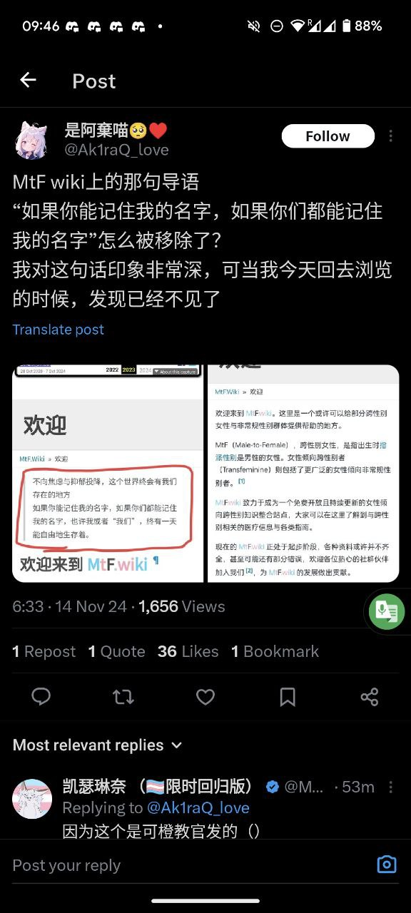
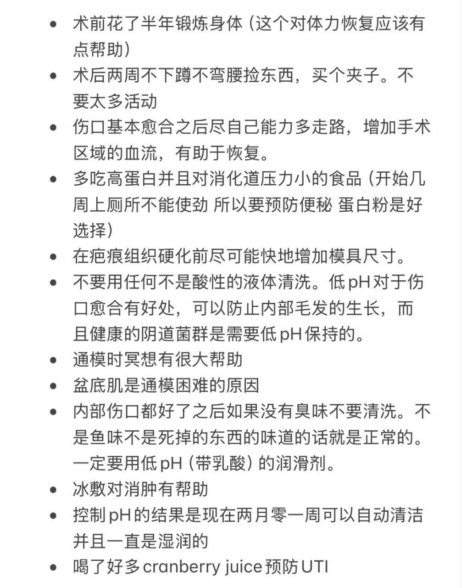

---
search:
  exclude: true
---

# 中国大陆

这一目录包含了有关中国大陆的跨性别社群及非政府组织（NGO）的信息和资源，旨在为跨性别者提供一个互助与支持的平台。

标签: `社群`, `NGO`, `跨性别`, `中国大陆`, `支持`, `互助`

总计 33 篇内容

### 📁 子目录

- [自行去势手术（切除睾丸）全过程分析总结](自行去势手术（切除睾丸）全过程分析总结) (12 篇内容)
  

内容简介

  本目录详细记录了自行去势手术（切除睾丸）的全过程，旨在为有类似经历或正在考虑此类手术的多元性别个体提供参考和支持。文件内容包括术前的准备工作、医疗资源的整理、术中的注意事项以及手术后的生活经历分享。通过这些记录，读者能够更全面地了解这一过程的各个环节，从术前的心理和身体准备，到手术当天的实际体验，再到术后恢复和生活的调整。这样的信息分享不仅体现了个人经历的多样性，也为其他正在经历或即将经历同样情况的人提供了宝贵的第一手资料。文档中包含的观察记录和注意事项尤其重要，帮助减少前往手术过程中可能面临的焦虑和不安，同时提供了专业护理的建议，确保在特殊情况下能够得到适当的照顾。
  

### 📄 文档

#### 2024

[致函于贵院，关于一位患者在贵院西城院区住院期间的举报_北京友谊医院](致函于贵院，关于一位患者在贵院西城院区住院期间的举报_北京友谊医院_page.md)

查看摘要

该文件是一封致首都医科大学北京友谊医院管理团队的正式信函，主要投诉一名叫史尧的患者在医院住院期间对其他病人实施的多种不当行为，以及相关医护人员可能的协助。在信中，举报者详细描述了史尧在医院中对隔壁病床的病人进行了侮辱、偷拍和侵犯隐私等行为，尤其提到他在社交平台上的公开内容显示其与医护人员密切互动，并对受害者实施了网络暴力和死亡威胁。信中呼吁医院对此事展开调查，以维护患者的权益和医院的声誉，并确保患者及工作人员的安全。

#### 2023

[妇女权益保障法修订草案意见征集指南_2023_Rachel](妇女权益保障法修订草案意见征集指南_2023_Rachel_page.md)

查看摘要

该文件为《妇女权益保障法（修订草案）》意见征集指南，旨在向全社会公开征求对该修订草案的意见。文件阐述了法律对女性权益的重要性，尤其是如何影响多元性别群体的权益，包括女同性恋者和跨性别女性的权益。内容涵盖了性别平等、性教育、性侵害和非歧视原则等多个方面，指出这些内容与多元性别群体的权益密切相关。文中强调如果关注多元性别群体权益，应充分利用这次意见征集的机会表达自己的声音，并提供了具体的意见提出步骤。文件最后还提供了针对多元性别群体的具体法律建议，如在法律条款中加入性别平等评估，删除可能加强性别刻板印象的条款，以及对非婚生育女性的权益进行保护等。

#### 2018

[2017秋季泰国法政大学交流心得](2017秋季泰国法政大学交流心得_page.md)

查看摘要

本文件是关于作者在2017年8月至2018年期间在泰国法政大学（Thammasat University）进行为期半年的交流学习的心得体会。作者详细描述了在泰国的学习经历、生活适应以及与来自不同国家的朋友们的交流互动。文件中提到了泰国的高等教育体制，法政大学的校区、科系设置及其历史背景，强调了东南亚性别议题的重要性与复杂性。

作者在交流过程中选修了基础泰语、东南亚性别研究及东南亚企业社会责任课程，分享了自己在课堂上及课外活动中的见闻和感悟，特别指出了性别平等及女性地位的相关讨论，以及东南亚地区“变性人”文化的独特现象。作者还描述了在清迈、孔敬府、普吉岛等地的旅行经历，感受到了泰国丰富的文化和温暖的人情，表达了对这片土地及其人民的深厚情谊。 

文中提到的部分观点，如关于女性在家庭中的话语权和东南亚国家父权制的挑战，深刻反映了当代性别议题的现实。作者最后对自己的交换生活表示留恋，期待未来再次与泰国相见。

#### 2008

[向死去的志愿者致哀！](向死去的志愿者致哀！_page.md)

查看摘要

本文件为《向死去的志愿者致哀！》，记录了大连彩虹工作组对一名志愿者不幸遇害的哀悼与反思。该志愿者是一名30多岁的跨性别性工作者，生活在经济条件较差的地区。他不顾家庭的压力与贫困，依然积极参与为社区提供安全套和润滑剂等服务，努力为需要帮助的人群提供支持。文章详细描述了这名志愿者在2008年4月23日的遇害经过，包括他在“点”上的工作、求救电话的情况，以及志愿者们对此事件的反应与处理。同时，该工作组呼吁社区朋友们共同协助善后，照顾遇害者的母亲，体现了对这位普通而伟大的志愿者的深切怀念与支持。

#### 时间未知，按收录顺序排列

[第四章变态心理教案授课时间](第四章变态心理教案授课时间_page.md)

查看摘要

该文件为一份关于变态心理学授课的教案，具体内容涵盖了变态心理的定义、判断标准、常见的性心理障碍、人格障碍及其分类等多个方面。教案的主要目的是使医学心理学专业的学生掌握变态心理的基本概念及其分类，了解心理障碍的干预方法。文件中详细介绍了变态心理的四种主要判断标准：经验标准、统计学标准、医学标准和社会适应标准，并将心理障碍按照WHO的分类法分为十大类，重点讨论了性心理障碍与人格障碍的特点。文中还提到了一些理论模式，如心理生物学理论、心理动力学理论、行为理论及人本主义理论，分别从不同的角度探讨变态心理的成因和发展。同时，内容中也提供了一些该领域的参考资料，便于学生进行深入学习。

[不知道哪里来的课件_第四章变态心理](不知道哪里来的课件_第四章变态心理_page.md)

查看摘要

该文件名为《变态心理第一节 总论》的课件，涉及变态心理学的基本概念、判断标准以及分类等多个方面。内容阐述了异常心理和心理变态的相对性，强调了心理变态不仅是医疗问题，更是社会问题。文件中详细介绍了异常心理的判断标准，包括经验、统计学、医学和社会适应等多个维度，并且进行了异常心理的理论模式分类。进一步探讨了焦虑性障碍和抑郁性神经症的成因、分类和心理干预方法，包括生物学、心理分析、学习理论等多种理论角度的解释。文件还涉及到人格障碍和性心理障碍的定义、特征与分类，探讨了这些障碍与社会环境的关系，强调了心理健康干预的重要性。文中提及的内容适用于心理学研究、心理健康教育及社会工作等多个领域，对理解跨性别个体及其心理状态具有提示意义。

[TERF问答](TERF问答_page.md)

查看摘要

该文档探讨了跨性别女性（MTF）在中国社会中所面临的刻板印象与社会期待，反思了跨性别女性对传统性别角色的挑战及其对女性共同经验的理解。文中指出，一部分跨性别女性在社会中可能呈现出对女性刻板印象的迎合，这部分现象与她们自身身份的认同与社会认可的缺乏有关。同时，也提到了一些跨性别女性在传统男性主导的行业（如科学和电子竞技）中的贡献，展现出她们如何通过自己的存在冲击性别刻板印象。文章还辩论了性别认同与女性共同经历之间的关系，以及跨性别女性是否会挤占顺性别女性的生存空间。文末强调，顺性别女性与跨性别女性共同面对的职业歧视问题更应当成为关注重点，而非内讧争夺空间。

[关于在住院期间某位患者的言论情况整理](关于在住院期间某位患者的言论情况整理_page.md)

查看摘要

该文件记录了在中国大陆某医院病房中发生的严重事件，涉及对一位患者的偷拍及恶意侮辱行为。文件中 detail 了施害者在病房内偷拍其他病人并在网上发布对受害者的侮辱言论，进一步侵犯其隐私。在详细情况中提到，施害者不仅贬低受害者的家庭，还发表有关受害者的性幻想，甚至对受害者提出死亡威胁，声称与医院医护人员存在串通关系。施害者通过网络社交媒体对受害者进行暴力威胁，称自己已掌握受害者的私人信息，并在病房内对患者进行群体性侮辱，将这位患者称为‘楼管’。文件进一步指出，这种行为不仅侵犯了患者的隐私权，还反映出医院环境中存在的对患者的不公正对待和医务人员与施害者之间的不当交流。

[完全变装手册最后5章部分翻译](完全变装手册最后5章部分翻译_page.md)

查看摘要

该文件是对《完全变装手册》最后五章的翻译，翻译者为@shiiny_kitty，在百度变装吧发布。该手册主要涉及跨性别及变装文化，具体包括了一系列的任务和指导，旨在帮助变装者更好地体验和融入女性身份。文件中的任务包括化妆、穿衣、在公共场合被女性化妆、接受雇佣等，这些任务不仅强调了外表的女性化标准，也触及了心理和社交层面的挑战。文件通过一系列幽默而露骨的指令，鼓励参与者逐步接受和拥抱他们的变装身份。这些内容展现了变装者在过渡过程中所面临的各种情感和社会因素，以及他们努力融入女性化生活的决心和挣扎。

[搞事情](搞事情_page.md)

查看摘要

该文件探讨了中国跨性别女性在医疗资源方面遇到的挑战，特别是与荷尔蒙替代疗法 (HRT) 有关的药物获得问题。文件中提到，由于在中国医疗资源稀缺，跨性别女性即使持有医生开具的诊断信和处方，仍需在灰色或地下市场购买必要的药物。政府对灰色市场采取了打压措施，这可能导致跨性别女性在没有任何合法途径获取药物的情况下，面临致命风险。文中引用了2018年11月6日中国代表在联合国的讲话，声称中国保护LGBT群体的健康权，承诺向所有公民提供免费基本卫生服务，但现实情况显然与这一承诺大相径庭。文件还提及社交媒体上的帖子和相关法律活动，反映了社会对LGBT话题的宽容度以及言论自由的现状。

[劳动仲裁](劳动仲裁_page.md)

查看摘要

本文件讨论了跨性别人士在面对劳动仲裁时的准备工作及注意事项，内容详细列出了收集证据的步骤与方法。文件强调收集录音与聊天记录的重要性，建议在录音前明确身份，并注意录音不能被编辑或转录。提出若跨性别人士在职场中遭遇解聘，需要为自己收集充分的证据，包括离职通知、邮件记录与考勤表等。针对有公务员身份的跨性别人士，文中警示道流程会更为复杂。文件还建议进行自查，判断是否违反公司规章及解除劳动合同的相关条款，确保在仲裁过程中处于有利地位。同时，联系专业法律人士获取建议也是必要的，提到可以联系“北同跨儿小助手transbjlgbt”获取支持与帮助。

[我们是跨别的孩子——献给一位故去的跨性别志愿者](我们是跨别的孩子——献给一位故去的跨性别志愿者_page.md)

查看摘要

本文件《我们是跨别的孩子——献给一位故去的跨性别志愿者》旨在缅怀一位对跨性别群体做出贡献的志愿者，表达对其生命的尊重与怀念。尽管正文为空，文件标题本身传达了对跨别者的关怀与同情，暗示了志愿者在推动跨性别权利与福祉方面的努力和影响。可能包含社群对逝者的共同回忆、对其倡导活动的总结，以及对跨性别群体尚存挑战的反思。此文件为社群措施和支持的重要记录，反映了多元性别社群的团结与悼念文化。

[授权委托书_民事自然人_](授权委托书_民事自然人__page.md)

查看摘要

本文件为一份授权委托书，适用于在法律事务中委托代理人处理相关事宜。授权委托书包含委托人的基本信息如姓名、地址与联系电话，以及受委托人的信息。文件中规定了委托的权限，包括进行和解、辩论、申请回避、提供证据、代收诉讼文书、代交诉讼费、接收款项、提起上诉等多项法律行为的权利。这种特殊授权的定义，反映了法律程序中的正式性与严谨性，适用于涉及法律纠纷情况下的专业代理需求。

[某个网友对ag的看法，原名《何为ag》](某个网友对ag的看法，原名《何为ag》_page.md)

查看摘要

该文件名为《何为ag》，讨论了一个名为Autogynephilia的性心理概念，该概念由加拿大性学家Ray Blanchard提出。文件中详细阐述了Autogynephilia这一现象的定义及其与跨性别（TS）的关系，试图分类与描述这一现象的多样性和复杂性。文中指出，Autogynephilia是指男性通过想象自己成为女性而获得性兴奋的现象，并与变装癖（CD）和传统跨性别者的体验进行了比较。作者提到此类现象可能导致个体的性别认同困扰和术后后悔，同时引用了一些相关的真实案例和叙述，探讨了相关的心理过程和社会认知。此文通过对AG现象的深入分析，意在减少对变装和跨性别者的误解，并激发对这一复杂主题的进一步研究与讨论。

[申请人身保护令](申请人身保护令_page.md)

查看摘要

该文件是关于申请人身安全保护令的指导文档，旨在帮助遭受家庭暴力或面临家庭暴力危险的个体申请法律保护。文件中详细说明了申请人身保护令的个案背景，以及申请的法律依据，引用了《中华人民共和国反家庭暴力法》的相关条款，包括申请的条件、流程和期限。特别强调了申请人在遭遇家庭暴力时，需要提供的证据材料，以及要求法院在72小时内作出裁定或驳回的法律规定。文件还提供了申请书的模板，帮助申请人清楚地列出个人信息、被申请人信息及具体申请事项，确保申请材料齐全，以提高申请成功的可能性。

[跨性别基础关怀与心理支持](跨性别基础关怀与心理支持_page.md)

查看摘要

此文件《跨性别基础关怀与心理支持》由潘柏林主编，展现了跨性别者的健康照护和心理支持的重要性。文件中详细定义了跨性别的概念，包括跨性别者与其出生时指定的生理性别不符的性质，并阐述了对跨性别者及其家庭的关爱表达。文中提到，跨性别者并非心理障碍，而是经历了社会环境和自我认同的冲突。在内容中，作者引述了凯特·伯恩斯坦关于性别认同的深刻反思，并提供了跨性别医疗的资源与支持结构，包括“性别工程”的治疗序列和专业的心理支持服务。文件中还列出了社会支持的需，强调了良好的社会环境对减轻焦虑的重要性，以及如何通过科学的解释推动社会对跨性别者的理解。同时，资料中附带了关于父母与家属如何理解和支持跨性别孩子的相关信息，帮助他们在经历身份转变时获得必要的理解与关怀。

[钱今凡回应网络对跨性别人士的谩骂](钱今凡回应网络对跨性别人士的谩骂_page.md)

查看摘要

该文档为钱今凡对网络对跨性别人士谩骂的回应，详细表达了他在面对社会歧视时的个人经历和观点。作者引用了《南方都市报》的报道，回应了对他变性决策的误解与攻击，并深入探讨了变性、性别不平等及社会观念的联系。文中指出，变性这一现象是人类本性的一部分，历史上性别不平等的根源在于封建专制的男权统治，而现代社会的进步需要颠覆这些陈旧观念，推动平等与尊严的实现。钱今凡还强调，他的变性决策是基于个人内在的必然要求，而非外部压力或社会追求，反映了他对自我身份认同的坚定追求。文中也提到社会对于变性人的偏见和歧视，以及如何看待和解释这些现象的重要性。

[限制人身自由案_证据清单](限制人身自由案_证据清单_page.md)

查看摘要

本文件为有关限制人身自由案件的证据清单，主要用于记录和收集与家庭暴力及非法拘禁相关的证据材料。文件中详细列举了案主在遭受父母限制自由及家庭暴力时所需收集的证据，包括录音、报警回执、街道调解记录、伤情照片以及受殴打记录等。案主在尝试与父母沟通外出问题时，录音能够记录父母的反对声音，并要求警方出具回执，以备后续申请人身保护令时使用。文件还提醒案主在面对家庭暴力时应保持安全，准备好逃生的资金。并且在采取措施时，要做好与父母关系可能恶化的心理准备。

### 🖼️ 图片

#### 时间未知，按收录顺序排列

### 📎 其他

#### 时间未知，按收录顺序排列

[学历修改](学历修改.pptx)

### 词云图 { data-search-exclude }

> 本内容为自动生成，请修改 .github/ 目录下的对应脚本或者模板
