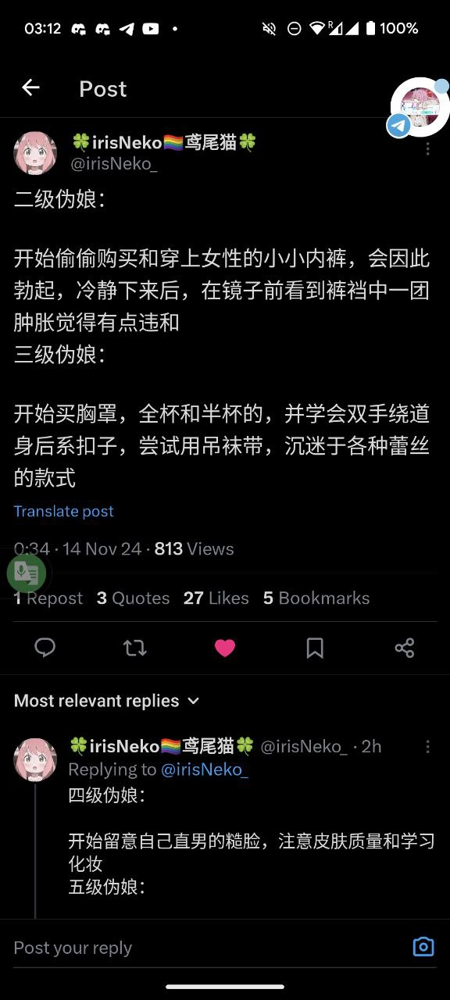
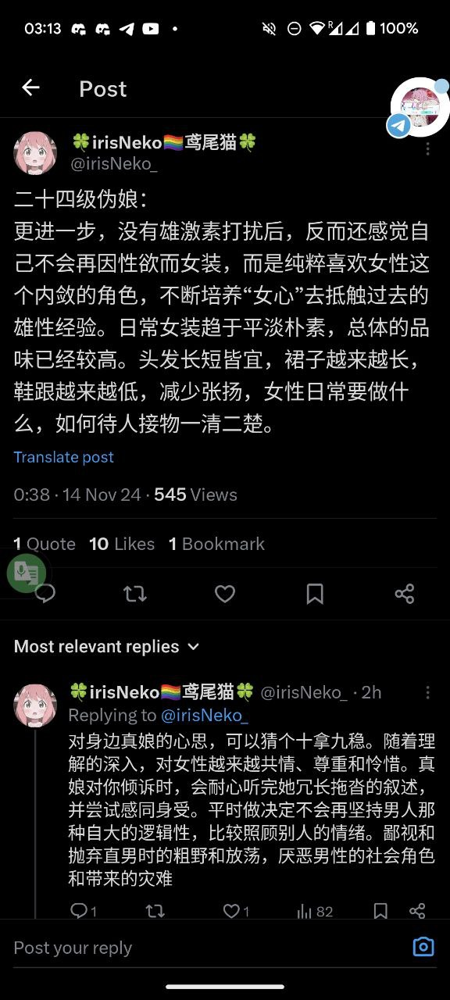
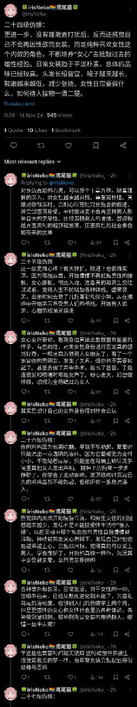
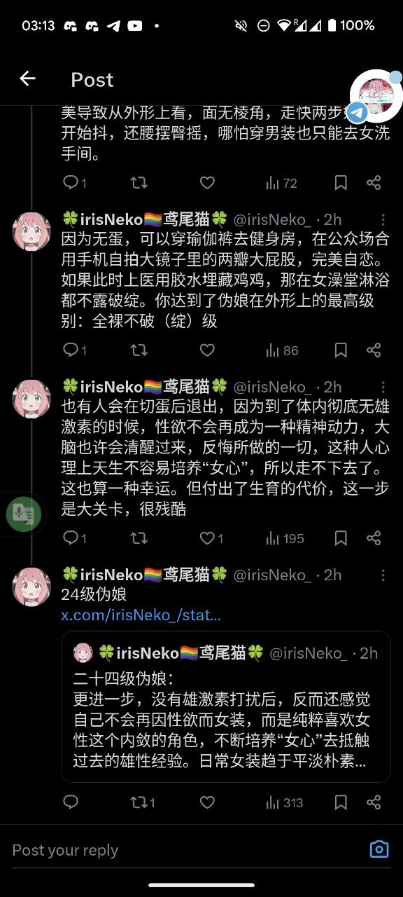
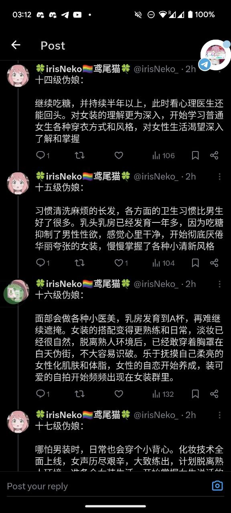
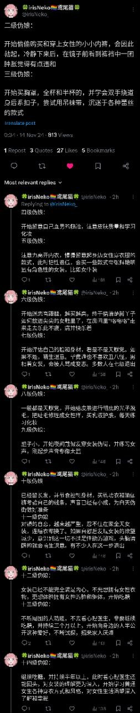
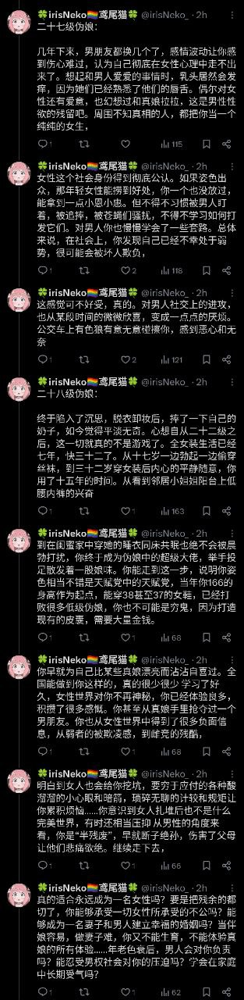
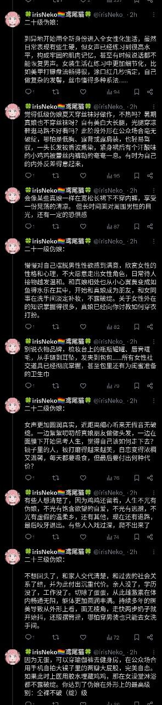
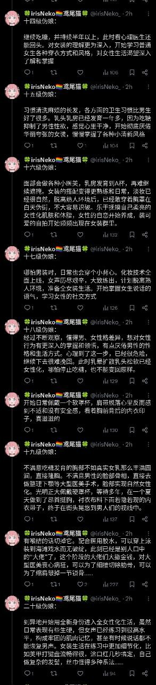
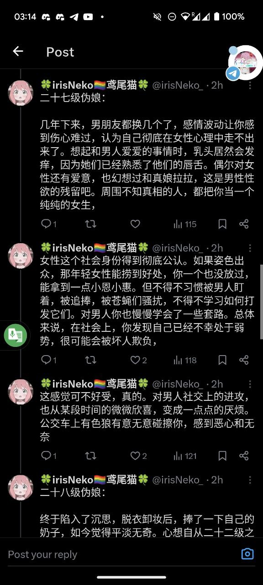

# 伪娘分级（来自推）

该目录名为“伪娘分级（来自推）”，主要收录与中国大陆地区的伪娘文化相关的讨论和资料。从文件名称中可以看出，这些资料可能涉及到伪娘的身份认同、社群构建以及在社会中面对的挑战和经历。目录内包含多张照片，这些照片可能展示了伪娘群体的日常生活、形象展示或者参与社群活动的瞬间。通过这些视觉资料，可以更直观地了解到伪娘文化的丰富性以及背后所承载的情感和故事。这一目录试图为跨性别及伪娘群体提供一个展示自我的平台，同时也可能涉及对伪娘身份和形象的剖析，以及社会对这一群体的认知和反馈。

总计 12 篇内容

### 🖼️ 图片

[photo_1_2024-11-14_12-05-29](photo_1_2024-11-14_12-05-29.jpg)

[photo_2_2024-11-14_12-05-29](photo_2_2024-11-14_12-05-29.jpg)

[photo_3_2024-11-14_12-05-29](photo_3_2024-11-14_12-05-29.jpg)

[photo_4_2024-11-14_12-05-29](photo_4_2024-11-14_12-05-29.jpg)

[photo_5_2024-11-14_12-05-29](photo_5_2024-11-14_12-05-29.jpg)

[photo_6_2024-11-14_12-05-29](photo_6_2024-11-14_12-05-29.jpg)

[photo_7_2024-11-14_12-05-29](photo_7_2024-11-14_12-05-29.jpg)

[photo_8_2024-11-14_12-05-29](photo_8_2024-11-14_12-05-29.jpg)

[photo_10_2024-11-14_12-05-29](photo_10_2024-11-14_12-05-29.jpg)

[photo_11_2024-11-14_12-05-29](photo_11_2024-11-14_12-05-29.jpg)

[photo_12_2024-11-14_12-05-29](photo_12_2024-11-14_12-05-29.jpg)

[photo_13_2024-11-14_12-05-29](photo_13_2024-11-14_12-05-29.jpg)

> 本内容为自动生成，请修改 .github/ 目录下的对应脚本或者模板
