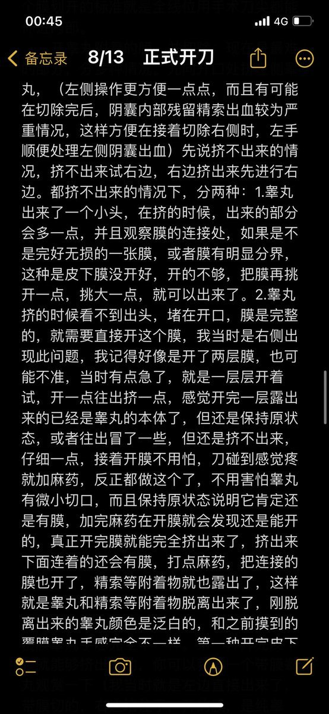

---
search:
  exclude: true
---

# 自行去势手术（切除睾丸）全过程分析总结

本目录详细记录了自行去势手术（切除睾丸）的全过程，旨在为有类似经历或正在考虑此类手术的多元性别个体提供参考和支持。文件内容包括术前的准备工作、医疗资源的整理、术中的注意事项以及手术后的生活经历分享。通过这些记录，读者能够更全面地了解这一过程的各个环节，从术前的心理和身体准备，到手术当天的实际体验，再到术后恢复和生活的调整。这样的信息分享不仅体现了个人经历的多样性，也为其他正在经历或即将经历同样情况的人提供了宝贵的第一手资料。文档中包含的观察记录和注意事项尤其重要，帮助减少前往手术过程中可能面临的焦虑和不安，同时提供了专业护理的建议，确保在特殊情况下能够得到适当的照顾。

标签: `跨性别`, `多元性别`, `酷儿`, `自行去势`, `去势手术`, `医疗资源`, `个人经历`, `护理注意事项`

总计 10 篇内容

### 🖼️ 图片

#### 时间未知，按收录顺序排列

> 本内容为自动生成，请修改 .github/ 目录下的对应脚本或者模板
