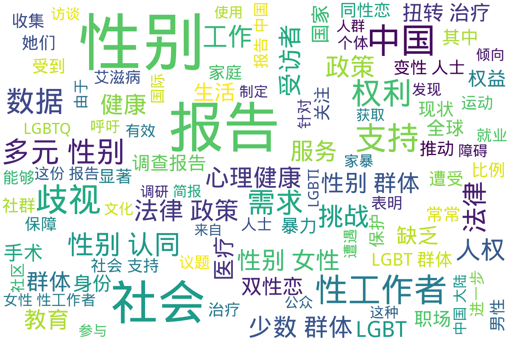

---
search:
  exclude: true
---

# 统计报告

此目录包含与跨性别群体相关的统计报告，为研究人员和政策制定者提供有关跨性别者生存现状和需求的数据支持。这些报告致力于反映跨性别者在社会中的真实情况，包括人口统计、健康状况和社会接纳度等方面的信息。

标签: `跨性别`, `统计报告`, `社会研究`, `生存现状`, `数据分析`

总计 53 篇内容

### 📄 文档

#### 2024

[PDF_中国大陆对LGBTQ_群体的正面态度](PDF_中国大陆对LGBTQ_群体的正面态度_page.md)

查看摘要

本文件为有关中国大陆对LGBTQ群体态度的统计研究报告，报告涵盖了中国大陆地区对LGBTQ群体的接纳程度及政策影响。调查中收集了来自2926名受访者的反馈，研究内容重点包括对工作场所歧视、同性婚姻、同性伴侣子女抚养等问题的态度。整体来看，结果显示大部分受访者对LGBTQ群体持正面看法，特别是在保护LGBTQ学生和职场公平方面，受访者普遍认为其应当享有平等的权利与保护。数据结果还表明，不同的年龄、性别及教育程度会影响受访者的态度。例如，年轻、女性以及高学历受访者对LGBTQ群体的接纳程度普遍较高。文件详细介绍了调查方法、样本特征以及结果分析，并提供了关于公众态度变化的深入讨论。

#### 2023

[中国多元性别女性的生活与权益_研究报告（2023_年_第一版）](中国多元性别女性的生活与权益_研究报告（2023_年_第一版）_page.md)

查看摘要

该研究报告由中国跨性别及多元性别权益倡导组织"同语"出品，作者包括小芦、阿醒，研究顾问刘明珂与望舒。报告在2023年第一版中探讨了中国多元性别女性（包括跨性别女性）在生活和权益方面的状况，聚焦家庭暴力、校园暴力、平等就业和心理健康等多个关键议题。通过数据和案例分析，报告揭示了多元性别女性在家庭、校园等环境中所遭受的各种形式的暴力，以及相关法律保障的不足之处。

报告开篇概述了中国社会中的多元性别群体的基本情况与法律环境，指出该群体在《妇女权益保障法》等法律框架下的特殊需要未能得到根本性保护。在暴力部分，报告详细分析了多元性别女性在原生家庭中、校园中及伴侣关系中遭遇的暴力问题，强调了其面对的双重歧视和多元性别身份造成的特殊脆弱性。

同时，报告针对多元性别女性在教育、就业、身心健康等领域面临的挑战逐一进行分析，并提出了相应的政策建议，包括加强法律认知、完善反歧视立法、提高教育与医疗系统的性别敏感性等。该报告旨在通过呈现多元性别女性的生存现状，推动公众和决策者对相关问题的关注与重视，是一部重要的政策倡导研究文件。

[2023_行政院多元性别生活状况调查研究报告](2023_行政院多元性别生活状况调查研究报告_page.md)

查看摘要

这份报告是由台湾彩虹平权大平台协会及相关学术机构委托研究的《我国内多元性别（LGBTI）者生活状况调查研究报告》。报告详细探讨了台湾多元性别者的生活状况，包括其面临的主要生活面向、健康与福祉、社会支持及歧视经历等。整个研究的时间跨度是从2022年至2023年，涵盖了对社会文化、法律政策变迁、以及多元性别者在生活各方面的深度分析。通过文献回顾和数据统计、问卷调查，该报告呈现了多元性别者的生存经验与挑战，强调了家庭、教育、医疗、职场及社会支持网络对多元性别者生活的影响。此外，报告提出了针对多元性别者权利保障的具体建议，呼吁建立更加友好的社会环境和政策实践，促进性别平等与人权保障。

#### 2022

[中国多元性别未成年人的生活与权益](中国多元性别未成年人的生活与权益_page.md)

查看摘要

本研究报告关注中国多元性别未成年人，即未满十八岁的跨性别、同性恋、双性恋、间性等群体的生活与权益，旨在填补这一领域内缺乏专门研究的空白。报告分析了中国法律政策的进展，如2021年修订的《未成年人保护法》和《中国儿童发展纲要（2021-2030年）》对未成年人的保护措施，尤其是针对性与性别少数群体的权益保障不足。研究发现，尽管法律政策在不断完善，多元性别未成年人在遭受家庭暴力、校园欺凌、健康权和教育权等方面仍面临多重挑战。报告提供了重要的数据，显示57.2%的多元性别未成年人曾遭受家庭暴力，40.2%在学校经历过歧视与暴力。针对这些问题，报告还提出了一些建议，如增强法律保护、加大社会支持、教育大众等，以推动中国多元性别未成年人权益的实现。

[多元性別統計報告_澳洲與加拿大人口普查_2022](多元性別統計報告_澳洲與加拿大人口普查_2022_page.md)

查看摘要

该文件是关于澳大利亚和加拿大人口普查中多元性别（LGBTI）相关统计的报告，主要探讨如何通过统计数据来了解跨性别和非二元性别人群在这两个国家的人口比例，以及相关的法律和政策背景。文件详细介绍了澳大利亚和加拿大的性别分类标准，包括生理性别和性别认同的区别。通过对人口普查数据的分析，该报告揭示了在2021年调查中，澳大利亚和加拿大跨性别和非二元性别者的比例及其变化，特别是在年轻一代中，跨性别和非二元性别的比例有所上升。报告指出，2021年的统计显示，澳大利亚同居的同性伴侣达78,425对，其中三分之一已婚，而加拿大的跨性别和非二元性别者已突破10万人，占15岁以上人口的0.33%。此外，该报告也提到我国在性别统计方面的现状，强调政策制定者需要更清晰掌握不同性别群体的处境与需求。

#### 2021

[2021全国跨性别健康调研报告](2021全国跨性别健康调研报告_page.md)

查看摘要

《2021全国跨性别健康调研报告》是对中国跨性别群体进行的第二次大规模定量调查，紧随2017年的生存现状调查之后。报告通过网络问卷的方式，覆盖医疗服务、精神健康、家庭关系、公共空间、校园与工作经历等多个重要方面，并于2021年5月6日至12月26日完成数据收集。本报告旨在全方面收集有关中国跨性别群体生存现状的基础数据，以促进相关政策和标准的完善，最终改善跨性别群体的健康状况和生活环境。报告提出了对社会、法律、医疗、身份证件及公共空间的政策建议，并提供了社群服务资源的信息，旨在提升公众对跨性别群体及其生存现状的理解，支持跨性别者的权利与尊严。从数据中可以看出，样本中大多数跨性别者在18岁之前就开始觉察到性别认同的不同，这一报告为相关领域的研究和实践提供了重要的参考。

[公众对变性人士权利的看法_中国_-_Williams_Institute](公众对变性人士权利的看法_中国_-_Williams_Institute_page.md)

查看摘要

本报告研究了中国公众对变性人士权利的看法，基于2017年全球对变性人士态度调查的数据分析。调查结果揭示了公众对变性人士及其权利、社会地位等问题的态度。约73.7%的被调查者表示支持保护变性人士免受歧视，同时，66.2%的人同意应允许变性人士进行手术以使其身体与性别身份相符。调查还显示，家庭接受度低是变性人士面临的主要困境。研究指出，在中国，变性人士在家庭、学校和工作场所中遭受巡视和歧视，尤其是在家庭中，90%的家庭不接受变性人士的身份。报告还提到，与香港的情况相比，中国大陆对变性人士的接受程度相对较低，但社会对变性人士的包容度似乎有所提升。总的来说，该报告为制定更加包容性法律政策提供了数据支持，并反映了社会对变性群体的普遍态度和洞察。

[LGBTQ+_老年人调查报告](LGBTQ+_老年人调查报告_page.md)

查看摘要

本文件为《俄勒冈州 LGBTQ+ 老年人调查报告》的 PDF 格式论文，旨在分析和审视俄勒冈州老年 LGBTQ+ 人群的多样性、需求及所面临的挑战。报告指出，尽管老年人群体人数稳步增长，然而，关于 LGBTQ+ 老年人的需求和资源却知之甚少。该调查由俄勒冈州公众服务部委托，利用俄勒冈行为风险因素监测系统（OR-BRFSS）数据和社区调查，研究年满 55 岁的 LGBTQ+ 俄勒冈人所面临的风险与需求。关键发现包括，俄勒冈州的 LGB 老年人群体与异性恋人群相比在年龄、社会经济状况、医疗获得情况等方面存在显著差异。此外，报告强调 LGBTQ+ 老年人常常经历歧视与社会孤立，并提供了紧迫的政策建议以改善这一弱势人群的生活质量，包括社会支持、心理健康服务和医疗等多方面的需求。报告提供了数据及研究背景，以引导对 LGBTQ+ 老年人群体的更好支持和政策制定。

[犹他州药物滥用治疗系统健康差异报告_2021](犹他州药物滥用治疗系统健康差异报告_2021_page.md)

查看摘要

该报告旨在探讨犹他州公共心理健康和药物滥用治疗系统中的健康差异，特别关注处于过渡年龄段的青年（16-24岁）、黑人、原住民和有色人种LGBTQ+群体（BIPOC）以及有发展障碍人员等群体。报告主要通过调研数据分析这些群体在职场中所遇到的歧视和贬损经历，以及管理层级的人员比例。同时，报告提出了几个关键建议，例如需要聘请青年协调员来改善社会联系，并强调了减少客户和警方之间矛盾的必要性。文中提到，工作场所中大约80%的受访者曾经历过歧视，这反映了当前社会环境中存在着严重的隐性偏见。因此，实施更多元化的招聘及员工发展战略，以支持BIPOC群体顺利过渡到医疗服务结构中，将是至关重要的。这些研究数据为制定更为包容的公共政策提供了依据，并对提升治疗服务的可及性和有效性具有重要影响。

#### 2020

[探讨LGBT群体的权_利_骄傲与偏见](探讨LGBT群体的权_利_骄傲与偏见_page.md)

查看摘要

本文件是由经济学人智库（Economist Intelligence Unit）发布的报告，题为《探讨LGBT群体的权利：骄傲与偏见》。该报告主要关注LGBT群体在亚洲尤其是中国大陆、印度以及台湾地区的权利与工作场所包容性状况，反映了近年来LGBT平权相关斗争的进展与挑战。报告中提到，美国最高法院在2015年合法化同性婚姻的决定是一个重要的里程碑，同时也强调了台湾在LGBT权利方面的推进。此外，文件详细讨论了LGBT群体在企业中的多元化和包容性问题，调查显示许多企业在这方面的实践仍然有待改进。受访者对公开LGBT身份的担忧，特别是在亚洲的职场环境中，表明LGBT员工在职业发展上面临障碍。文件通过数据分析了亚洲各经济体在LGBT权利方面的进展以及企业在倡导LGBT友好政策中的角色，总体上反映出尽管面临社会保守力量的压力，LGBT群体的平权争取仍在不断推进。报告还提供了诸如调查结果的附录，展示了各地区对LGBT多元化认知的差异。

[2020年《跨性別就業與職場調查》報告.docx](2020年《跨性別就業與職場調查》報告.docx_page.md)

查看摘要

本文件是由台灣同志運動發展協會跨性別小組於2020年發起的《跨性別就業與職場調查報告》。該報告基於對跨性別者的問卷調查，旨在深入了解跨性別者在台灣的就業狀況和職場挑戰。報告中分析了196份問卷的數據，包括有效問卷191份，從而勾勒出跨性別者的職場經驗和主觀感受。調查顯示，多數受訪者為跨性別女性，且77.43%的參與者尚未更換證件，這對他們的求職和職場生活造成了影響。本報告涵蓋了跨性別者的性別組成、教育程度与薪资分布、職業類型，以及他們在求職面試、職場生活與待業中的困境，並對性別友善企業的期望進行了探討。報告最後針對未來的研究和政策建議提出了詳細見解，希望促進更友善的工作環境。

該報告深入分析了跨性別者在求職面試時所遭遇的困境，主要包括外顯性別特徵與原生性別社會期待不符等問題。此外，報告也探討了職場生活中遭遇的言語騷擾及同事不融洽等情況，並提出了需改善性別友善企業特徵的建議。對於跨性別者的生存現狀，報告中提到跨性別者的失業率高達14.8%，其中有超過23%的跨性別者的月收入未達法定基本薪資，顯示出他們在職場中面臨的挑戰與困難。

#### 2019

[中国跨性别者寻求性别确认医疗程序时遇到的障碍_国际特赦组织](中国跨性别者寻求性别确认医疗程序时遇到的障碍_国际特赦组织_page.md)

查看摘要

本文件由国际特赦组织撰写，标题为《我需要家长同意才能做自己： 中国跨性别者寻求性别确认医疗程序时遇到的障碍》。文件内容深入探讨了中国跨性别者在寻求性别确认医疗程序过程中的各类障碍与挑战。这些挑战主要包括缺乏医疗信息、社会歧视以及法律要求如必须获得家属同意等，导致许多跨性别者需通过高风险方式寻求激素疗法或手术。根据报告，多名受访者分享了他们在当前中国医疗体系中的真实经历，表现出对性别认同的深切渴望与社会对他们的误解与歧视。报告强调中国的跨性别者在性别确认手术及激素疗法的高门槛，使得他们在接受医疗服务时面临重重困难。整体而言，文件以案例为基础，结合数据与研究方法，分析了该群体的生存现状及需改善的政策建议。

[PDF_中国跨性别者受教育权状况研究报告_201903_v10pdf](PDF_中国跨性别者受教育权状况研究报告_201903_v10pdf_page.md)

查看摘要

本报告是由联合国开发计划署与亚太跨性别网络共同撰写，主要探讨中国跨性别者的受教育权状况。内容涉及跨性别在医学上的定位变化、法律承认及相关政策，重点分析了教育环境对跨性别者身份认同的影响以及跨性别群体在校园面临的挑战。报告指出，跨性别者在中国仍被认为是一种精神疾病，并且法律承认及受教育权的保障不足，许多跨性别人士因其性别表达而遭受歧视、欺凌和教育机会的剥夺。调查结果显示，参与调研的1640名跨性别者中，约11.9%被强迫接受“扭转治疗”。本研究还通过焦点小组访谈的方式获取了全国多地跨性别人士的真实经历，以揭示他们在教育系统中的生存现状与需求。

#### 2018

[全球跨性别健康与幸福指数议题](全球跨性别健康与幸福指数议题_page.md)

查看摘要

此文档是由TvT社群发布的报告，专注于全球跨性别者的健康与幸福指数的议题。报告通过大量的数据和案例分析了跨性别者在全球南方和东方面临的各种挑战，包括医疗保障的缺乏、歧视和暴力行为的影响，以及法律保护的不足。文中详细列出了在过去十年里因跨性别身份而发生的谋杀案件数据，指出在72个国家中有2982起报告的谋杀案件，显示出跨性别者的身份所面临的极端暴力。在报告中，作者呼吁社会对跨性别者的健康问题给予更多关注，并提供了相关的政策建议。此外，报告还探讨了跨性别者面临的健康不平等和经济困境，强调了跨性别者的抗争与行动主义，及其在寻求更好生活条件方面的努力。

[跨性别者性别认同的法律承认_中国相关法律和政策的评估报告](跨性别者性别认同的法律承认_中国相关法律和政策的评估报告_page.md)

查看摘要

该报告由联合国开发计划署和中华女子学院共同撰写，旨在全面评估中国关于跨性别者性别认同的法律承认与保障人权的相关法律政策。报告通过分析现有法律与政策的缺失，指出跨性别者在法律性别身份、医疗服务、就业和教育等方面所面临的巨大挑战。报告发现，跨性别者的性别标记变更被强制与性别肯定手术相挂钩，导致许多潜在手术者无法满足苛刻的条件。此外，跨性别者在获取医疗服务时面临病态化的标签及高昂的手术费用。报告还详细分析了中国各项法律与政策，提出了促进跨性别者权利的具体建议，包括废除将变性手术作为性别变更前提的法律要求，制定专门的反歧视法，并合理化医疗程序以保障跨性别者的权益。该报告的完成标志着对中国跨性别者法律认同的深入实证研究，是推动社会变革的基础文献之一。

[香港男跨女跨性別人士愛滋病風險及流行情況調查2017](香港男跨女跨性別人士愛滋病風險及流行情況調查2017_page.md)

查看摘要

本文件为关于2017年香港男跨女跨性别人士（跨性别女性）爱滋病风险及流行情况的调查报告。文件中提到，由于该群体一直被忽视，自2014年起，香港卫生署将跨性别女性列入爱滋病预防项目的高危人群。这项名为PRiSM的调查旨在了解香港跨性别女性的爱滋病流行情况，并为爱滋病和性病的预防措施提供参考数据。调查于2017年4月26日至9月30日期间进行，共104名跨性别女性参与，填写了中英双语的网上问卷，并提供尿液样本进行HIV抗体测试。结果显示，性活跃跨性别女性的爱滋病毒流行率为5.11%，低于2014年HARiS调查的18.6%。同时，69.4%的受访者表示为性活跃，且在性伴侣中使用安全套的比率较低。调查结果还涉及毒品使用情况和爱滋病传播预防的信息接触情况，建议加强对安全性行为的教育和爱滋病毒检测的宣传。

[PDF_中国大陆跨性别群体激素干预获取情况调查报告](PDF_中国大陆跨性别群体激素干预获取情况调查报告_page.md)

查看摘要

本文件为《中国大陆跨性别群体激素干预获取情况调查报告》，旨在分析中国大陆跨性别群体在激素干预方面的获取情况及相关问题。报告由复旦大学的研究团队与跨儿文化共同完成，依据对684份问卷的统计分析，收录了跨性别人士在激素使用过程中面临的障碍、获取途径及使用效果等多方面的信息。内容涵盖激素干预的基本知识、安全有效的方法、样本描述及未来展望，指出目前国内对激素干预的重视程度不足，并提出应通过政策和社会倡导改善跨性别群体的医疗环境。此外，报告还包括了近年跨性别群体在激素使用过程中的真实反馈和案例，以数据和调查结果反映生存现状。

[骄傲与偏见-变革的动力-经济学人智库报告-2018](骄傲与偏见-变革的动力-经济学人智库报告-2018_page.md)

查看摘要

《骄傲与偏见：变革的动力》是经济学人智库于2018年发布的一份报告，围绕LGBT（男同性恋、女同性恋、双性恋和跨性别者）在商业和经济领域的多元化与包容性问题进行了深入分析。报告通过全球范围内的调查问卷，收集了来自82个国家共1043位高管的反馈，探讨了管理层对LGBT群体的文化态度、潜在的障碍及推动变革的策略。报告指出，尽管许多高管表示支持LGBT权利，但在实际工作场所中，歧视仍然普遍存在。年轻一代和女性在推动LGBT权益方面表现出更强的支持态度，而现金化LGBT友好的公司政策能够带来商业收益。报告还强调了领导层的表率作用，以及企业文化在促进多元化方面的重要性。通过这些数据，报告的核心目的是希望推动企业在工作场所的包容性与多元化变革，实现积极的社会影响。

[跨性别者性别认同的法律承认-中国相关法律和政策的评估报告-中华女子学院-UNDP](跨性别者性别认同的法律承认-中国相关法律和政策的评估报告-中华女子学院-UNDP_page.md)

查看摘要

《跨性别者性别认同的法律承认——中国相关法律和政策的评估报告》是由联合国开发计划署（UNDP）和中华女子学院共同撰写的一份报告。该报告系统分析了中国关于跨性别者性别认同的法律、法规和政策，并提出了具体的建议和行动方案，以促进跨性别者的法律承认与保护。报告指出，跨性别者在中国面临巨大的法律挑战和社会歧视，缺乏法律承认使他们更容易受到伤害和边缘化。报告中详细讨论了中国现行法律框架及相关政策，包括变更性别标记和姓名的规定，性别肯定手术的医疗条件和费用，以及跨性别者在就业和教育等方面的法律保障。报告强调，减少性别不平等和为弱势群体赋权是实现可持续发展目标的重要组成部分，呼吁社会各界共同努力，推动跨性别者的包容和权利保障。

#### 2017

[中国跨性别群体-_生存现状调查报告](中国跨性别群体-_生存现状调查报告_page.md)

查看摘要

本文档是《2017中国跨性别群体生存现状调查报告》，该报告由北京大学社会学系主办，旨在为政府部门、国际机构、营利和非营利组织提供中国大陆地区跨性别群体的基础性数据。报告通过线上问卷的形式对跨性别者的生存状况进行定量调查，共收集到5677份问卷，保留有效问卷2060份，研究涵盖了跨性别男性、跨性别女性、性别酷儿和易装者等多种身份。

此调查不仅细致地分析了跨性别者在多个方面的挑战，包括心理健康（例如抑郁和焦虑状况）、激素治疗需求与满意度、性别重置手术的需求与障碍、以及家庭和社会支持的缺乏等。报告中的数据表明，有62%的受访者对激素治疗有需求，但仅有6%的受访者对此表示满意，75.7%的调查对象在遇到心理问题时未寻求心理咨询。

此外，报告总结了跨性别者的求助渠道稀缺，尤其在遭遇家庭或伴侣的暴力时，跨性别者往往缺乏必要的支持和资源，导致心理健康问题的普遍存在。文件最后提出了一系列政策建议和改进措施，促进跨性别者的生存环境改善，呼吁社会对跨性别群体的理解和接受。

[PDF_我想保留天生的模样_美国双性儿童遭受的非医疗必要手术](PDF_我想保留天生的模样_美国双性儿童遭受的非医疗必要手术_page.md)

查看摘要

本报告《我想保留天生的模样》由人权观察和双性行动（interACT）共同发布，探讨了美国双性儿童在医疗行为中面临的非医疗必要手术的问题。报告指出，许多双性儿童从婴儿时期起就受到医疗行为的干预，包括不必要的手术，这些手术常常是为了使孩子的外观符合社会对性别的预期，而这些干预可能导致一生不可逆转的生理及心理创伤。该文件详细分析了双性人的情况，强调生物性别并非简单的二元分类，而是一个光谱；并指出大约1.7%的婴儿出生时具有双性特征，这意味着他们的性腺、染色体或生殖器组织与传统的男孩或女孩的标准有所不同。

[2016年愛滋病預防項目指標調查報告-男跨女跨性別人士](2016年愛滋病預防項目指標調查報告-男跨女跨性別人士_page.md)

查看摘要

本文件为《2016年爱滋病预防项目指标调查报告 - 男跨女跨性别人士》，由香港中文大学何鸿燊防治传染病研究中心进行。报告主要目的是通过社区行为调查，评估男跨女跨性别人士的艾滋病相关风险行为及测试行为，确保与健康推广和监测计划的覆盖率和成效相符。调查在2016年4月至6月期间进行，涵盖87名受访者，受访者的基本人口信息显示，60.9%为华人，27.6%为菲律宾人，5.7%为泰国人，其中51.7%的年龄在20至29岁之间。调查结果显示，多数受访者在性行为中使用安全套的比例有所减少，且接受艾滋病病毒测试的比率较2015年有所下降，需要加强对此群体的教育与服务。建议在推广艾滋病防治过程中，应重点关注非华裔社群并以外展服务为主。

[2017_Chinese_Transgender_Population_General_Survey_Report](2017_Chinese_Transgender_Population_General_Survey_Report_page.md)

查看摘要

本报告为中国跨性别群体的首次全国性量化调查，旨在为政府部门、国际机构及非营利和营利组织提供统计基础，以更好地了解中国的跨性别人口。该调查涉及性别认同、性别表达、性别不合群体等多个概念，用于提高社会对中国跨性别群体问题的关注，并推动与跨性别社区相关的法律政策的倡导。报告中提到的性别不合群体包括跨性别男女、酷儿及异装者等，所有参与者在完成的问卷中对性别认同和表达进行了详细的描述。调查通过线上问卷进行，主要通过社交媒体平台如微博、微信等进行宣传，并收集了来自全国各地的有效问卷。调查结果显示参与者有明显的地理分布差异，东部地区的参与者占大多数。

[反家暴法_在跨性别群体中的应用实况_及跨性别群体对反家暴法的_改进建议2017](反家暴法_在跨性别群体中的应用实况_及跨性别群体对反家暴法的_改进建议2017_page.md)

查看摘要

本报告由跨儿中心编制，聚焦于《反家暴法》在跨性别群体中的应用现状和面临的挑战。报告首先对性别概念进行了详细解释，包括性别认同、被指配性别、以及跨性别的定义，认为跨性别的性别认同可能与出生时被分配的性别不同。接着，报告总结了自2016年《反家暴法》实施以来，跨性别群体所遭受的暴力事件，尤其是家暴情况的严重性。根据跨性别中心的调查，跨性别群体遭受极端暴力的比例显著高于其他性少数群体，施暴者大多为家庭成员，尤其是父母。报告指出，跨性别家庭暴力的主要诱因为当事人被出柜，强调了跨性别人士在寻求自我认同与家庭接受之间面临的艰难境地。同时，报告提出了对《反家暴法》改进的建议，以更好地保护跨性别群体的权益。此文档对于了解跨性别群体在家庭暴力中的特殊需求及现存法律的不足有重要价值。

[同语《多元性别权益：从草根到联合国》](同语《多元性别权益：从草根到联合国》_page.md)

查看摘要

这份文件为同语发布的《多元性别权益：从草根到联合国》统计报告，旨在提升公众对多元性别（LGBTI）权益的认识。文件首先概述了多元性别运动自二战后在人权机制形成过程中的历史背景，强调全球范围内对多元性别群体权益的关注与推动。报告提及，自2005年起，大量国家开始逐步承认和支持LGBTI群体的权益，并在联合国中取得了一系列重要进展。例如，2011年6月通过的17/19号决议首次为SOGIE（性倾向、性别认同与性别表达）问题设立了正式的国际性框架。然而，伴随可见性的提升，同时也滋生了对LGBTI群体的反对与 violence。文件还指出，尽管LGBTI群体取得了一定的进展，许多地方仍然存在强烈的恐同现象以及法律和社会环境的压制。最后，报告提倡借助国际人权机制来推动和保护多元性别群体的权益，尤其是对于中国的民间组织来说，深入理解和参与国际人权领域的活动变得更加重要。

[跨性别校园与证件修改调查报告](跨性别校园与证件修改调查报告_page.md)

查看摘要

该文件是关于跨性别者在校园中面临的困境和证件修改的调查报告，主要是通过政府信息公开与问卷调查相结合的方式进行收集和分析的结果。由北京影响力律师事务所、广州性别与性教育中心与广州跨性别中心等机构共同发布，旨在揭示跨性别群体在教育和法律身份方面遇到的障碍。在每一节中，文件深入探讨了校园环境的友好程度、就学情况以及性别改变手术后身份及证件的修改难题。调查显示，尽管有些高校允许跨性别学生在进行性别重塑手术后更新学籍信息，大多数大学对文凭上的性别信息不作记录修改，造成很多学生在社会及职场中面临身份认同的困扰。此外，报告指出大约47%的受访者经历了校园欺凌，尤其是与身体性别不符的跨性别者面临的挑战更为严峻。总体而言，该报告不仅提供跨性别者面临的生存现状，也提出了政策建议，旨在改善跨性别者在教育领域的处境。

[Chinese_Transgender_Population_General_Survey_Report](Chinese_Transgender_Population_General_Survey_Report_page.md)

查看摘要

此文件为《2017年中国跨性别人口一般调查报告》，由北京大学社会学系提供。该报告通过问卷调查的方式，旨在为政府部门、国际组织、非营利和营利机构提供关于中国跨性别群体的统计基础，使其能够更好地理解中国跨性别群体的现状，并倡导与跨性别群体需求相关的法律和政策。调查内容涵盖跨性别及性别表现不符合传统社会期待的个体，包括性别酷儿、变装者及跨性别男女，并对这些群体的性别认同、性别表达及性取向等方面进行了定量分析。整体而言，此报告不仅为跨性别群体提供了可见性，还为社会上跨性别者的权利倡导设立了基础。其调研样本来自全国各地，尤其主要集中在东部地区，包括北京、广东、上海、山东和浙江。这是中国首个全国性定量调查，提交有效问卷2060份，比例为36.3%。调查的有效性标准包括答题完整性、独特IP地址、完成时间和受访者自我报告的性别身份等。

#### 2016

[跨性别组织现状第二版](跨性别组织现状第二版_page.md)

查看摘要

本文件为《跨性别组织现状（第二版）》的执行摘要，报告由美国犹太人世界服务组织、爱斯翠雅正义女神女同性恋基金会和跨性别平权全球行动组织联合发布。该报告对全球455个从事跨性别相关工作的组织进行了调研，揭示了这些组织面临的资金与组织层面的挑战。这份报告说明了跨性别人士在日常生活中面临的歧视、边缘化与人权侵犯的问题，以及这些组织在提供医疗保健和法律支持方面的需求。报告强调，尽管跨性别相关工作的资助有所进展，获得的资源仍极其有限，74.8%的跨性别组织年预算低于50,000美元。报告意在促进跨性别活动家与资助者之间的沟通，以增加对国际跨性别运动资源的数量和质量支持。

[PDF_阴阳人双性人间性人组织现状1](PDF_阴阳人双性人间性人组织现状1_page.md)

查看摘要

本文件是关于阴阳人、双性人和间性人组织现状的详细研究报告，主要由2016年美国犹太人世界服务组织、爱斯翠雅正义女神女同性恋基金会及全球跨性别平权行动组织共同发布。报告调研了全球54个从事相关议题的组织。通过调研，揭示了这些组织在资金、资源获取及服务提供等方面面临的重大挑战与需求。调查的主要发现指出，不同地域的阴阳人和双性人组织在促进人权和社会意识提升方面展示了积极的努力，但由于社会及文化环境的歧视与污名，这些组织经常遭遇很大的资金不足、雇佣困难和资源获取不平等等问题。报告还详细说明了这些组织在医疗、教育、身份认同及社会服务方面所面临的人权侵犯，并强调需要提升这些组织的资金支持，使其能可持续运行并满足不断增长的需求。报告进一步呼吁捐赠方关注并资助这些被边缘化的群体和组织，以改善他们的生存现状和权益。

[SOGIE_Report_-_Being_LGBTI_in_China](SOGIE_Report_-_Being_LGBTI_in_China_page.md)

查看摘要

该文件为联合国开发计划署（UNDP）发布的关于中国的性别与性取向少数群体的国家调查报告。报告通过调研及数据分析，探讨了中国社会对性取向、性别身份与性别表现的态度，并提供了对性别与性取向少数群体生活现状的全面了解。内容涵盖了社会环境、日常生活、公众舆论、健康与社会服务环境、法律政策环境等多个方面。报告指出，性别与性取向少数群体在日常生活中面临歧视与不公正对待，特别是在家庭、学校、工作场所和医疗护理环境中。报告还提供了一系列数据统计，揭示了不同年龄群体对少数群体接受度的差异，以及少数群体在中国社会中的可见性，并对此提出了改进建议。

[中国性少数群体生存状况（中文版）](中国性少数群体生存状况（中文版）_page.md)

查看摘要

本文件是由联合国开发计划署于2016年发布的《中华人民共和国性少数群体生存状况：基于性倾向、性别认同及性别表达的社会态度调查报告》。本报告是对中国性少数群体（包括LGBTQI人士）在社会中所面临的挑战和生存状态进行的全面调查，涵盖了性少数群体的基本社会人口特征、所处的社会环境、生活状况及遭受的歧视等方面。报告指出，性少数群体在家庭、学校及职场中遭遇的排斥和歧视尤为严重。在调查中，超过一半受访者表示遭遇过歧视，并提到工作单位是最尴尬的出柜场所。虽然性少数群体的受接纳程度在逐步变化，特别是年轻一代对多元性别的接纳度更高，但整体上该群体仍面临显著的社会压力和不平等待遇。报告也给出了多项建议以帮助消除对性少数群体的误解和偏见，并提高政府和社会服务机构的平等意识。

#### 2015

[北京上海跨性别女性性工作者生存状况调查](北京上海跨性别女性性工作者生存状况调查_page.md)

查看摘要

本报告《暗不见光的日子》对2014年在北京和上海两地的跨性别女性性工作者的生存状况进行了深入的调查与研究。报告的核心目的是探讨这一群体的生活条件、工作环境、健康服务的获取情况以及所面临的法律与社会歧视问题。调查结果显示，跨性别女性性工作者在就业和生活中受到严重的污名和歧视，教育水平普遍较低，经济机会稀缺，导致其生活在社会边缘。报告强调，跨性别女性是艾滋病高风险群体，她们的艾滋病感染率远远高于一般人群，并阐述了这一现象的原因与影响；此外，报告还提出了对中国政府的多项政策建议，旨在改善跨性别女性的生活与健康状况。报告包含多个章节，从调查方法、背景到具体发现和法律框架，系统全面。

[PDF_跨性別人士在保安部門遇到的性騷擾](PDF_跨性別人士在保安部門遇到的性騷擾_page.md)

查看摘要

这份报告来自于平等机会委员会，目的是探讨和记录跨性别人士在香港保安部门（警务处、入境事务处和惩教署）遭遇的性骚扰问题。报告通过对17位受访者进行深入访谈，详细分析了跨性别者在与保安人员互动时的经历，以及这些经历对他们心理和社会身份的影响。文件首先介绍了跨性别人士的定义及其与社会环境之间的关系，紧接着总结了研究的背景、方法和限制。受访者的经历表明，保安部门工作人员对跨性别人士的性别认同的误解、缺乏相关培训，导致了不少不公正和令人不适的对待。特别是报告中提到了一些具体的案例，包括在搜身时的不当行为和言语上的侮辱，以及如何这些经历对受访者的情感和自我认同产生了深远的影响。此外，报告还提出了改善现行政策及指引的建议，旨在提高对跨性别人士的理解和尊重。

[2015年亚太催化剂-北京上海跨性别女性性工作者生活状况调查](2015年亚太催化剂-北京上海跨性别女性性工作者生活状况调查_page.md)

查看摘要

该报告名为《我的生活太黑暗，以至于看不到光明》，由Asia Catalyst发布，基于对2014年在北京和上海的跨性别女性性工作者的生活状况的调查。报告详细探讨了跨性别女性性工作者在中国的日常生活、工作条件、服务获取以及法律框架。、调查通过与70名在公共场合提供性服务的跨性别女性性工作者进行深入访谈，揭示了这一群体所面临的歧视和社会阻碍，导致她们接触医疗和法律保护的机会极为有限。报告指出，尽管在中国不存在对跨性别者的明确法律制裁，但缺乏反歧视法和对医疗服务获得的有效保障，使得这一群体的生存和健康状况非常脆弱。报告同时提供了关于增强跨性别者的法律保护、减少污名化以及提供针对性医疗支持的若干建议。该文档不仅是对一个边缘化群体的生存状况的真实记录，也是对改善他们生活条件的迫切呼吁。

[Report_-_Awareness_and_Attitudes_towards_GenderSexual_Minority_among_Psychiatry_and_Psychological_Counseling_Practitioners](Report_-_Awareness_and_Attitudes_towards_GenderSexual_Minority_among_Psychiatry_and_Psychological_Counseling_Practitioners_page.md)

查看摘要

该文件是由北京LGBT中心发布的报告，名为《心理学和心理咨询从业者对性别/性少数群体的认知与态度研究报告》。这份报告旨在探讨心理健康和心理咨询从业者对性别和性少数群体，包括跨性别和同性恋者的态度，特别是他们对于转变疗法（即试图改变个体性取向的疗法）的看法。通过对2015年收集的1188份问卷的调查，该研究揭示了许多数据，包括大约37%的受访者考虑寻求心理服务，而55%的人表示他们虽然知道自己需要服务但未能主动寻求。这表明，许多人因对咨询师的负面反应担忧，不敢向专业人士求助。报告还指出，绝大多数心理咨询师对性少数群体持欢迎态度，但仍存在对性少数群体的误解和偏见。尤其数据显示，了解性别和性少数群体相关知识的水平是影响心理咨询师态度的关键因素。通过本报告，作者希望能够改进心理健康服务，为性少数群体提供更多支持，并解除“病态化”的标签。

[精神卫生与心理咨询从业人员对性少数的态度调查报告（中文版）](精神卫生与心理咨询从业人员对性少数的态度调查报告（中文版）_page.md)

查看摘要

该文件为《精神卫生与心理咨询从业人员对性少数群体态度调查报告》，由北京同志中心发布，主要由张领豪和蔡瑶撰写，申强负责统筹，辛颖担任顾问。本报告旨在探讨中国精神卫生与心理咨询从业人员对性少数群体的认知、态度及接纳程度，涉及的主题包括性倾向扭转治疗的态度、对性少数群体的接待意愿以及可能影响这些态度的因素。研究显示，尽管大多数从业人员对性少数表现出良好的接待意愿，但仍存在一定程度的歧视观念。

报告中提到，调查通过纸质和线上问卷的方式，共收集到996份有效问卷，参与者覆盖28个省市，主要为精神卫生和心理咨询领域的从业者。研究发现，许多受访者对性倾向的知识掌握不够，且在接受心理咨询时，性少数群体由于对是否会遭受歧视而不敢寻求帮助。报告结论强调，开展多元性别培训是提升从业者对性少数群体认知与改善其态度的重要举措。

[MY_LIFE_IS_TOO_DARK_TO_SEE_THE_LIGHT](MY_LIFE_IS_TOO_DARK_TO_SEE_THE_LIGHT_page.md)

查看摘要

该文件是关于中国北京和上海的跨性别女性性工作者的生活状况调查报告，标题为《我的生活太黑暗，以至于无法看到光明》。该报告研究了这一高度边缘化群体的日常生活、工作条件、服务获取与法律框架。报告指出，跨性别女性性工作者面临广泛的歧视，特别是在社会和政策环境中，导致她们在获得广泛的服务和法律保护时面临巨大障碍。这些女性在寻求公共服务时常会遭遇耻辱和孤立，尤其在医疗环境中。由于缺乏有效的非歧视法律及医疗服务的护理保障，她们不得不使用自我药疗和参与危险的转型实践，包括自行使用激素。此外，本报告还提到性工作在中国是非法的，因此跨性别性工作者受到更多来自警方的压迫，并且由于社会因素，她们的活动风险更高，容易感染HIV和其他性传播疾病。现今，考虑到中国正在起草新的HIV/AIDS行动计划，这是一个制定针对跨性别社群的HIV预防和护理具体策略的良机。

#### 2013

[2013年扭转治疗调查报告](2013年扭转治疗调查报告_page.md)

查看摘要

该报告由北京同志中心扭转治疗调研组撰写，旨在调查和研究扭转治疗对同性恋者的影响与现实情况。报告详细介绍了扭转治疗的定义及其历史研究背景，阐述了扭转治疗在中国的发展历程，包括关键的研究案例和不同的治疗方法。尤其指出了在中国知网和万方数据库中，针对同性恋治疗的相关文献，以及对过去研究的评估。分析了同志群体寻求扭转治疗的多种原因和治疗的具体影响，提供了来自访谈对象获得的真实案例分析，讨论了治疗的效果与社会环境之间的关系，提出了对主管部门和心理卫生从业者的建议，以及对同性恋人群的相关建议。此外，附录中讨论了同性恋的去病理化过程及全球同志权益的概况。

#### 2012

[2012年父母对跨性别青少年的支持影响报告](2012年父母对跨性别青少年的支持影响报告_page.md)

查看摘要

该报告详尽探讨了父母对跨性别青少年支持的重要性，研究了父母接纳与拒绝对这些青少年健康和幸福感的预测效果。报告收集了来自安大略省433名跨性别参与者的数据，探讨父母支持程度与青少年的生活满意度、心理健康、抑郁和自杀倾向之间的关系。结果显示，父母如果对孩子的性别认同和表达表示强烈支持，约92%的跨性别青少年会报告自己对生活感到满意，而那些支持不力的家庭中，只有33%的青少年有类似感受。同时，强烈支持的父母群体中，只有4%的青年曾试图自杀，而不支持的家庭中，这一比例高达75%。该报告强调了家庭支持在青少年心理发展中的关键作用，并提供了多种资源以帮助跨性别青少年及其家庭改善相应的社会服务与支持系统。

[全球性工作项目网络2012年度报告](全球性工作项目网络2012年度报告_page.md)

查看摘要

这份题为《全球性工作项目网络2012年度报告》的文件由全球性工作项目网络（NSWP）发布，专注于全球性工作者尤其是跨性别者和性工作者的权利与人权状况。报告详细记录了NSWP的目标与核心价值，包括承认性工作作为一项工作，反对对性工作的所有形式刑事化，以及支持性工作者的自我组织和自决。报告强调了2012年全球性工作者在健康与福祉需求方面的倡导活动，包括呼吁医疗服务普遍可及的权利、反对人权侵害以及挑战针对性工作者的污名和歧视。该报告介绍了2012年组织的一系列活动，包括在加尔各达举行的性工作者自由节，以及与艾滋病相关的研究和政策倡导，通过这些活动促进了性工作者的权益。报告还讨论了关于阳性性工作者的权利和需求，特别是治疗的可及性，以及成立新平台以捍卫阳性性工作者的权益的必要性。

#### 时间未知，按收录顺序排列

[T_S_W简报09_跨性别性工作者的需求与权利](T_S_W简报09_跨性别性工作者的需求与权利_page.md)

查看摘要

该文件是由全球性工作项目网络发布的简报#09，专注于跨性别性工作者（TSW）在全球范围内面临的需求与权利问题。文件详细探讨了TSW在生活与工作中所遭受的法律和社会环境的交叉压迫，分析了暴力、歧视与法律制裁如何影响他们的生存状况。文中指出，通过问卷和焦点小组讨论，揭示了跨性别性工作者在遭受暴力和歧视时的困境及他们对法律支持的缺乏。具体案例展示了全球各地区对TSW的政策缺失和不公，尤其是在医疗、住房和就业等基本领域。这份简报还呼吁政策制定者重视TSW的声音，提出了针对法律和政策的具体建议，以改善跨性别性工作者的生活与工作条件。

[PDF_中国彩虹媒体奖2018-2019_年度彩虹媒体监测报告](PDF_中国彩虹媒体奖2018-2019_年度彩虹媒体监测报告_page.md)

查看摘要

本文件为《中国彩虹媒体奖2018-2019年度彩虹媒体监测报告》，对中国大陆2018年期间的LGBTQ媒体报道进行全面的量化和质性分析。报告探讨了媒体在LGBTQ群体生存状况及身份呈现中所起的重要作用。文中指出，自1983年‘同性恋’一词首次出现在《新闻联播》后，三十余年的时间里，同志社群仍面临诸多挑战，包括法律政策的缺失与文化上的偏见。报告分析了2018年同志议题的总体报道数量及主题变化，发现以跨性别群体作为报道对象的比例在不断上升。通过量化统计，监测到762则与同志相关的原创报道，尤其强调网络媒体在此类报道中发挥的重要作用。报告同时关注了媒体报道的内容分布，包括法律政策、文化娱乐、健康及HIV等主题，以及例如‘名人与LGBTI’、‘LGBTI权利与反歧视’等专题报道，并指出男同性恋、女同性恋与其他性别少数群体在媒体中的可见度差异。最后，报告提出了同志社群组织在推动公共讨论中的参与和影响，以及媒体报道中呈现的同志群体新形象和多面貌。

[PDF_反人权运动对性工作者的影响简报](PDF_反人权运动对性工作者的影响简报_page.md)

查看摘要

该文件是关于反人权运动对性工作者影响的简报，深入探讨了全球范围内反对边缘群体和被刑事定罪群体权利的运动所造成的种种挑战。简报中指出，近年来，反移民权利、反性与生殖健康权利（SRHR）和反性少数群体的运动不断升温，这些运动严重侵犯了女性、跨性别者和性别多元群体获得健康服务的机会。文中详细描述了各国反人权运动的不同意识形态、目标以及主要策略，强调了反权利运动对性工作者和性工作者主导组织的威胁，以及如何通过策略进行反击。同时，该简报也提及了反人权运动如何利用“保护弱势群体”的叙事掩盖歧视，并从公共卫生政策、性与生殖健康权利的角度分析这些影响，提出性工作者全面免除定罪的建议及其他重要策略。

[PDF_性工作者经济赋权简报](PDF_性工作者经济赋权简报_page.md)

查看摘要

本文件为一份关于性工作者经济赋权的统计报告，深入探讨了全球范围内性工作者在经济、社会及法律方面面临的重大挑战。报告指出，在许多国家，性工作被刑事定罪，导致性工作者缺乏基本的劳动权益，面临财务排斥和暴力、歧视等多重困境。通过收集在不同国家的400多名性工作者的访谈数据，文件展示了性工作者如何在项目中寻求经济独立，强调了性工作者主导的项目和基于权利的经济赋权模式的重要性。报告提出的建议包括非刑罪化性工作，确保性工作者在经济赋权项目的设计和实施中发挥主导作用，以及通过核心资金资助符合性工作者需求的组织。尤其强调了如USHA这样由性工作者主导的金融机构在促进金融认同和经济安全方面的成功经验。

[PDF_让我们谈谈性工作_全球性工作项目网络](PDF_让我们谈谈性工作_全球性工作项目网络_page.md)

查看摘要

这份PDF文档标题为《让我们谈谈性工作》，由全球性工作者网络（NSWP）发布，旨在为性工作者及其权利提供首要的支持与指导。文件中详细讨论了性工作者的权利、法律框架、以及如何通过更加包容和肯定人权的语言来改善性工作者的社会地位。它提到了性工作者所面对的各种歧视和妖魔化的语言，以及这些语言如何影响公众对性工作的看法。文件强调了性工作者的多样性，包括女性、男性和跨性别性工作者，明确指出“性工作”的定义为成年人自愿提供的性服务，反对使用带有污名化的术语如“卖淫”。文中进一步探讨了不同国家的法律体系如何影响性工作者的生活和工作条件，例如非刑罪化和合法化的概念，指出现行法律往往削弱了性工作者的权利，导致他们的安全和健康状况恶化。整体上，这份文件不仅是一份详尽的指南，还具备重要的倡导性，旨在消除对性工作和性工作者的偏见、推动合法、健康和人权为基础的性工作环境。

[家庭虐待服务需求研究报告](家庭虐待服务需求研究报告_page.md)

查看摘要

该报告探讨了英格兰和威尔士家庭虐待的服务需求及其现状，强调受害者和幸存者在寻求支持时面临的挑战。报告指出，家庭虐待的受害者和幸存者常常遭遇资源不足、服务碎片化及资金短缺等问题，尤其是少数族裔社区、跨性别者和其他边缘化群体。长期以来，受害者在获取支持时受到“邮编抽奖”的影响，即居住地区对可获得服务的可及性产生了重要影响。研究调查了来自4000多名受害者和幸存者的反馈，发现获得专业支持的个体在安全和生活控制感方面有显著提升。报告还总结了主要发现，提出了服务改进建议，呼吁国家和地方政府共同努力，以满足受害者和幸存者的需求，同时强调“由社区为社区”服务的重要性和成效。该文件为理解家庭虐待受害者所需支持的重要参考文献，并为未来的政策制定提供依据。

[俄勒冈州中老年LGBTQ+健康需求调查](俄勒冈州中老年LGBTQ+健康需求调查_page.md)

查看摘要

该文件为俄勒冈州中老年LGBTQ+和双灵人群体健康需求的调查项目的宣传材料。邀请居住在俄勒冈州的55岁或以上的多元性别成年人参与项目，内容涉及养老、健康和服务的需求。文件中明确列出了可参与者的性别和性取向身份，如女同性恋、男同性恋、双性恋、跨性别者、酷儿和双灵人。调查的方式为填写保密的匿名问卷，并且参与者还有机会通过随机抽奖赢得100美元的礼品券。此外，文件还提供了参与调查的链接和联系方式，鼓励受众帮助宣传这一项目。

[全球移民政策与女性工作负担分析报告](全球移民政策与女性工作负担分析报告_page.md)

查看摘要

该报告探讨了全球移民政策对女性，尤其是LGBTQI群体女性的影响，强调女性在移民中承担着巨大的家庭和社区责任，尤其是在危机情况下。报告指出，在各种政策和措施中，女性的声音往往被忽视，而《全球移民契约》（GCM）为提升女性地位提供了重要机会。该文件进一步分析了女性移民面临的特殊挑战，包括她们在移民过程中可能遭遇的歧视和系统性侵犯。报告特别提到，女性移民占全球移民的2.58，许多女性在其祖国和移民地都扮演着重要角色，尽管她们面临着高度的不确定性和低薪工作。总体来说，该报告呼吁制定更公平的移民政策，以保障女性迁徙的权利和生存状况。

[性别暴力分析与应对策略](性别暴力分析与应对策略_page.md)

查看摘要

此文件为一份关于性别暴力的分析与应对策略的报告，重点讨论了性别暴力的定义、表现形式及其对受害者特别是在女性、女孩、跨性别者和性多元群体中的影响。报告指出，性别暴力不仅限于身体暴力，还包括情感暴力、经济暴力和性暴力等多种形式。文件详细描述了每种类型的暴力行为及其可能造成的危害，例如，对跨性别者使用弃用名所带来的心理伤害，以及经济控制对个人独立性的影响。报告还强调了性别暴力的普遍性，特别是对少数群体的影响，并提出了识别和阻止性别暴力的措施，呼吁社会各界共同努力，增强对性别暴力的认识与应对能力。

[双性恋人群的生存现状与挑战](双性恋人群的生存现状与挑战_page.md)

查看摘要

该文件名为《双性恋人群的生存现状与挑战》，详尽探讨了双性恋者在当今社会中的生活状态、面临的挑战和歧视，内容以数据和研究为基础，具体分析了双性恋者对于性别认同和情感吸引的复杂性。文件中指出，双性恋者在情感、爱情和性方面通常会受到多种性别的吸引，并随着时间的推移而可能发生变化。尽管相关研究表明美国有2%到3.1%的受访者认同为双性恋，但双性恋者的遭遇往往被媒体忽视。值得注意的是，两性之间的暴力和歧视问题尤为突出，双性恋者更易遭受酷刑和其他人权侵犯。文件还指出，双性恋者在医疗、教育和职场中面临的歧视，以及国际法律对双性恋者的保护不足，使得他们的处境更加复杂。总结部分提供了改善双性恋者生活状况和提高公众意识的具体建议，包括教育和法律改革的方向。

[Report_on_The_Mental_Health_of_LGBT_People_in_China](Report_on_The_Mental_Health_of_LGBT_People_in_China_page.md)

查看摘要

本文件是由北京LGBT中心与中国科学院心理研究所合作完成的一项关于中国LGBT群体心理健康状况的综合研究报告。报告分为两部分，第一部分集中于LGBT群体的心理健康状况，探讨了性倾向、自我接纳和婚姻状况等因素对心理健康的影响，提供了抑郁症、自我效能感及心理服务需求的调查结果。根据调查显示，尽管CCMD-3已在2001年将同性恋从精神疾病的诊断标准中去除，但社会公众对同性恋的看法仍然相对保守。在405名参与者中，仅有少数认为同性恋是可接受的，这显示出社会对LGBT群体的压迫感依然存在。报告还具体列出各种调查方法和样本特征，分析了心理健康问题的背景。 

第二部分则针对LGBT群体的“扭转治疗”进行了深入调查，包括对扭转治疗的态度、施行过程及其带来的影响。结果表明，许多参与者对这一治疗方式持有负面态度，从而反映出LGBT人士在寻求认同与接纳过程中的痛苦经历。报告中还引用了相关案例，讨论扭转治疗的不足和未来的研究方向，并提出对心理服务的迫切需求。总体来看，该报告为了解中国LGBT群体的生存现状提供了重要的基础数据和深入见解。

[中国同志中心心理健康报告](中国同志中心心理健康报告_page.md)

查看摘要

这份文档是由中国同志中心与中国科学院心理研究所合作发布的《LGBT群体心理健康状况调查报告》。该报告详细调查了LGBT（女同性恋、男同性恋、双性恋、跨性别）群体的心理健康状况，包括调查的背景、方法和结果。报告首先分析了LGBT群体在性倾向、身份认同和婚姻态度方面的心理健康现状，随后评估了抑郁水平和自我效能感，揭示了该群体在面对社会压力和偏见时的心理负担。此外，报告还专门讨论了扭转治疗对LGBT群体的影响，研究了该群体对心理服务的需求与未来展望。通过对1653份有效样本的分析，报告呈现了详细的统计数据，同时指出精神健康的改善潜力与存在的挑战。总结部分提到，LGBT群体的心理健康状况不容忽视，相关支持服务的需求亟待加强。

[中国同志心理健康报告](中国同志心理健康报告_page.md)

查看摘要

该文件为《2013年中国同志心理健康调研报告》，由北京同志中心与中国科学院心理研究所联合发布，重点探讨LGBT（即女同性恋、男同性恋、双性恋及跨性别者）群体的心理健康状况。报告内容分为多个部分，包括心理健康状况调查的背景、方法、结果和讨论。调研通过匿名问卷形式收集数据，总样本为1653份，涵盖性别、年龄、学历等多方面信息。调查显示，抑郁及社会接受度对心理健康的影响显著，特别是在校园和职场环境中，存在广泛的歧视和偏见，使得许多LGBT个体面临心理压力。此外，报告还探讨了对扭转治疗的态度和经历，指出对扭转治疗的不接受和其对心理健康的负面影响。调研结果旨在为LGBT人群的心理健康服务提供数据支持，促进社会对LGBT群体的理解和支持。

### 词云图

> 本内容为自动生成，请修改 .github/ 目录下的对应脚本或者模板
